# 词汇


- cage
- gas
- daggers
- region
- regularly
- courage
- tragedy
- doing
- guests
- get
- starting
- engineering
- closing
- gut
- noting
- guts
- leading

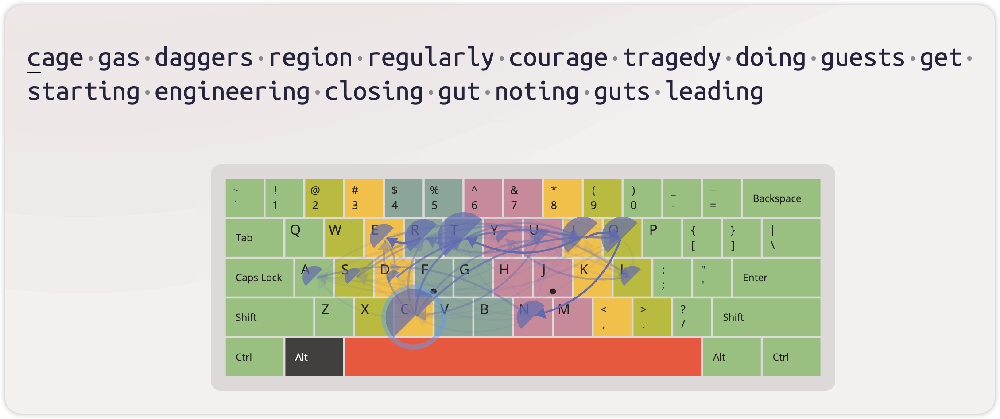

- thrashing
- anything
- daughters
- his
- chanting
- harder
- sheer
- tech
- shot
- their
- clothed
- shutting
- coughed
- host
- shattering
- chairs

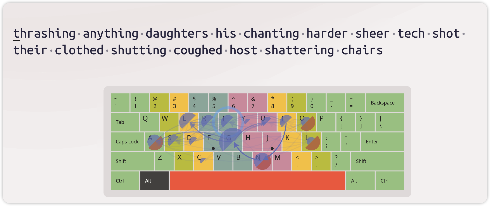

- gap
- gasps
- properly
- period
- despite
- disappeared
- prince
- happens
- gaping
- cupped
- pound
- helping
- suppressed
- concept
- opposite

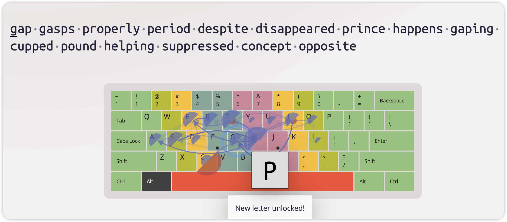

- champagne
- attempted
- madness
- consume
- muscled
- ominous
- automatic
- admired
- manner
- ramp
- motel
- may
- minimum
- masculine
- moon

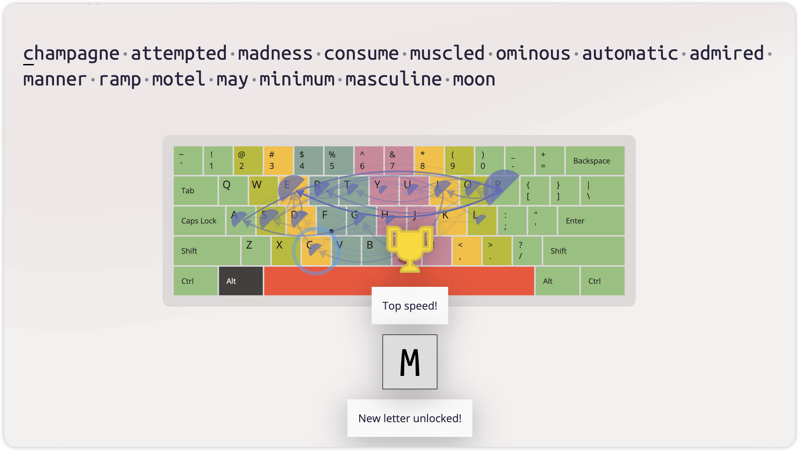

- meals
- dim
- seeming
- motel
- instruments
- named
- million
- empty
- remain
- shimmered
- clamped
- smells
- trimmed
- assume
- mates
- men
- messy

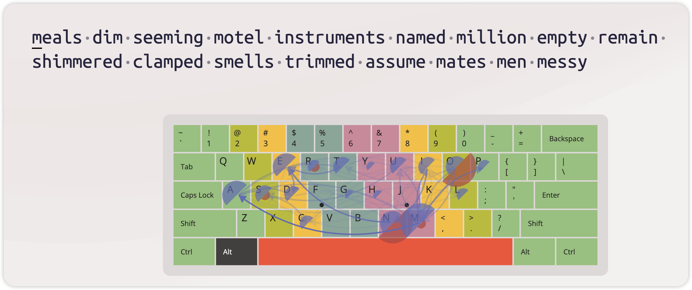

streaked-cockpit-choking-cooked-stack-crackled-poked-sickening-picked- ticked-duck-shook-necks-sparked-keeper-smirks

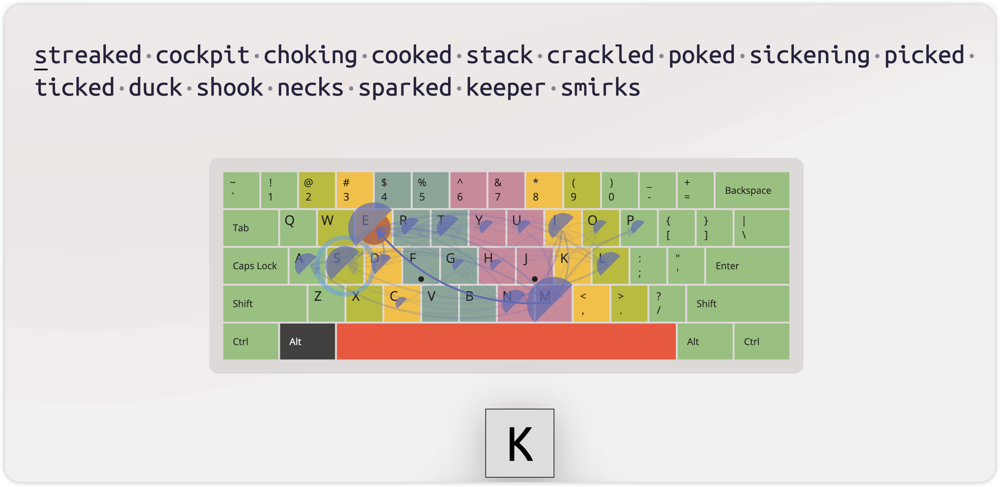

burn-rubble-budget-numbers-beyond-remembered-breaking-possibly-belonged-blasting-blessed-debris-boulder-obsessed-board

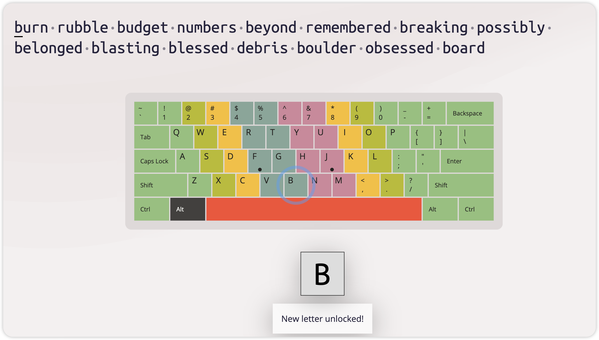

unwell-twins-swirly-windblown-unwieldy-drowned-whirling-whale-between-awesome-row-underwater-wage-shower-wack-winged

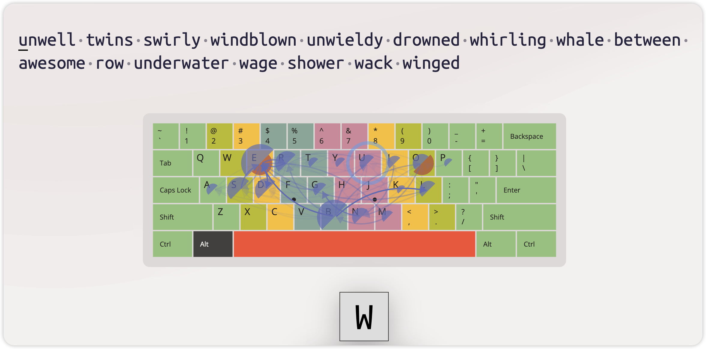

forget-infected-fluttered-foods-stiffen-goofy-clarified-fellows- flywheel-fortune-folksong-officials-cliff-reference

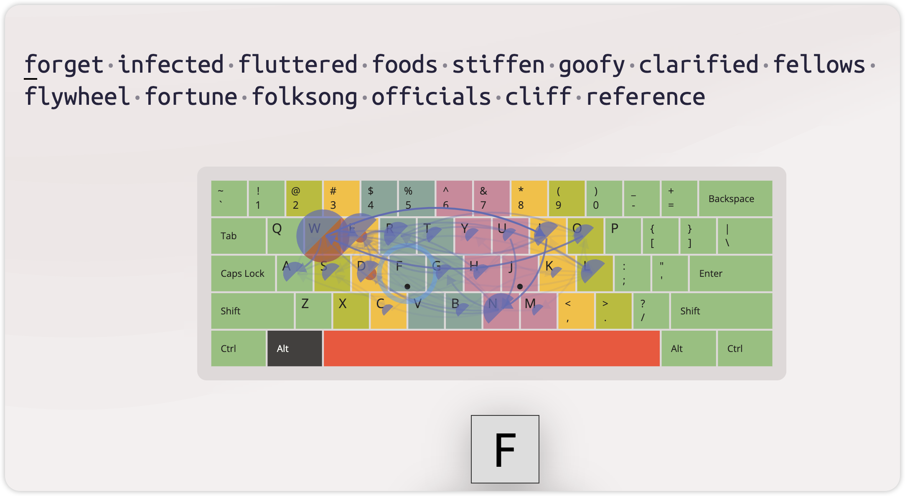

nuzzled-zipped-capsize-zeroing-gaze-dozens-frozen-bronze-zen-bronze-sizzling-buzzsaw-balkanize-apologized-unzipped

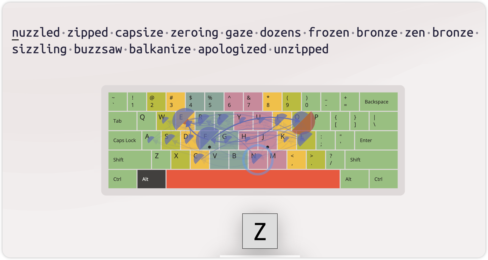

vodka-preview-achieved-flavoring-leverage-investigation-oblivion- recovered-evacuate-poverty-love-diverge-voluminous

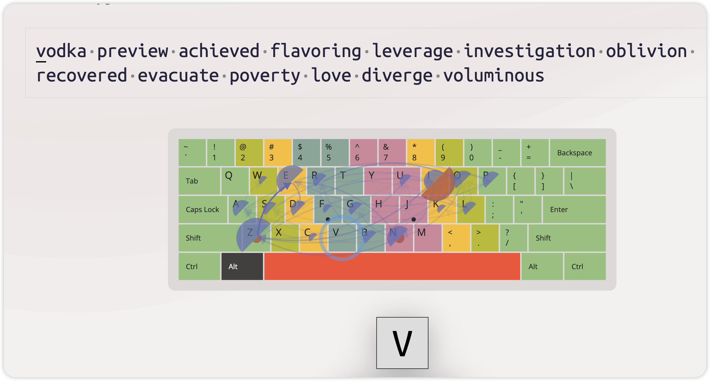

exclude-xenophobe-fixture-mailbox-exclaimed-duplex-excuses-sandbox-exhale-expat-maxim-exploding-excite-experts-xenophobia

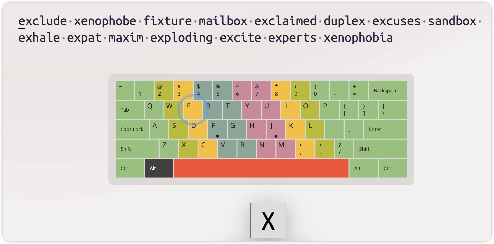

requests-clique-obsequious-questioningly-acquiesce-unrequited-acquaintance-liquidizer-inadequate-quartermaster


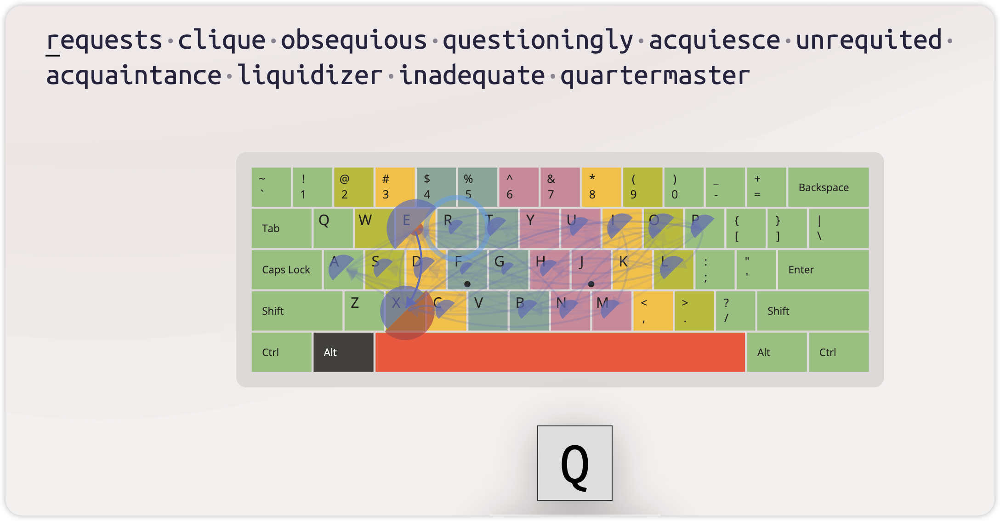

jungle-nightjar-interjects-jar-jigsaw-jibe-enjoyed-majority-adjust- jacquard- adjacent -jumpstart -in juries -jiffy -jumbo

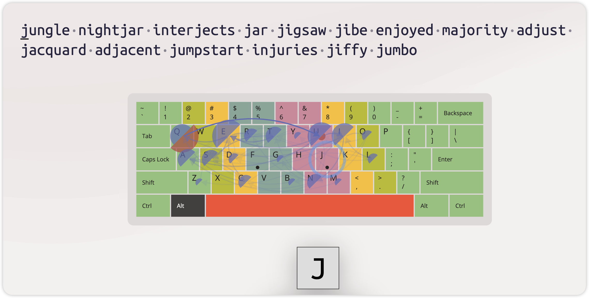

jib-joking-subject-jackknife-jinx-jeans-jarhead-joshing-junction-joker-rejuvenation-disjointed-jettison-misjudge-jackhammer

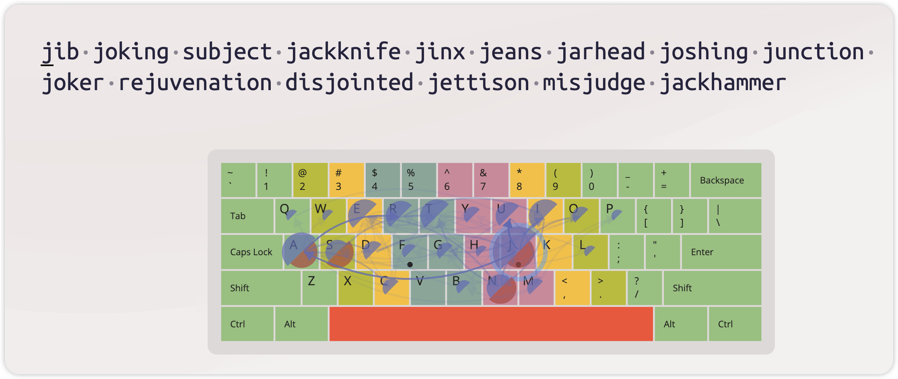 

objection-fjord-unjust-majoring-rejoice-jawbreakers-jackets- majestically-dejected-jingle-prejudicial-jogged-adjourn

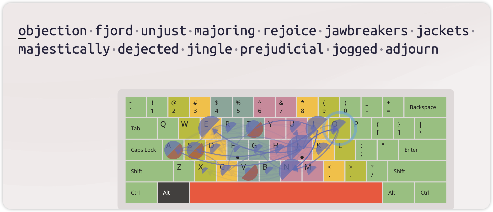

jailhouse-jubilant-jab-jukebox-jest-perjured-jars-injunction-justifiably-bejewelled-rejuvenates-juvenile-projection

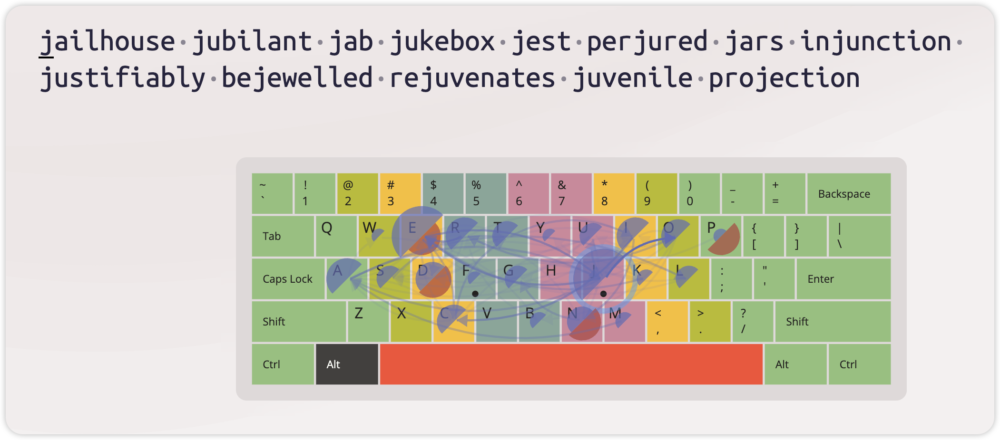

important-have-definitely-number-perfect-lay-across-onto-beyond-very-agreed-shirt-started-promise-their-herself-noticed

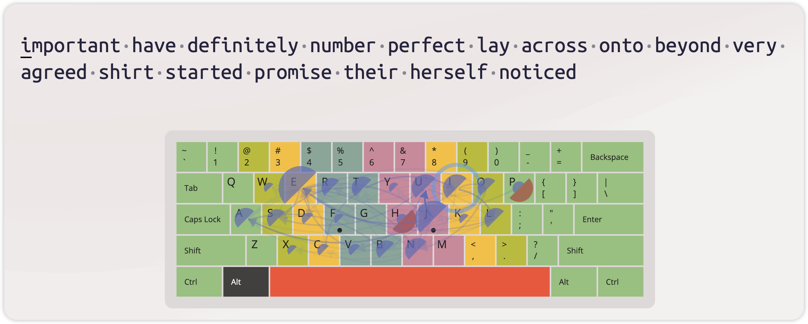


## ▲ 单词发音疑惑

### (1) evoke

*Created: 2023.12.22*


Q: 为什么上面单词的音标中是短元音 `/ɪ/` ，但是读音却是长元音 `/iː/` 的短音版 `/i/`？ 

像这种情况的发音问题不仅仅局限于 `/ɪ/`，其他情况也有，后续遇到其他情况，会继续补充。

### (2) advantage，advice

advantage `/ədˈvæntɪdʒ/` 和 advice `/əd'vaɪs/`，读音中第一个是字母 a 的发音是 `/ə/`，但词典上的读音好像类似 `/æ/`，

我实在没搞明白！


## ▲ 7 个你应该念错的单词

*Added: 2024.05.17* 

*From: https://www.youtube.com/watch?v=FqLCNY5F_Tg&t=209s&ab_channel=%E5%93%A5%E5%80%AB%E5%B8%83Columbus*

*表格翻译来自 ChatGPT 4o*, 但二次编辑。

注：下面表格单词已写到 Goodnotes - 笔记日期：2024.05.20

| 单词        | Correct Pronunciation | Common Pronunciation         | 词性 + 汉语释义            | 示例                                                         |
| ----------- | --------------------- | ---------------------------- | -------------------------- | ------------------------------------------------------------ |
| fifth       | ~~`/fɪfθ/`~~          | `/fɪθ/`                      | adj. 第五的<br>n. 五分之一 | adj. He finished in fifth place. <br>(他获得了第五名。)<br>adj. in the fifth century. 在五世纪。<br />adj. her fifth birthday. 她的五岁生日。<br />n. One fifth of the cake is gone. <br>(五分之一的蛋糕不见了。) |
| clothes     | ~~`/kloʊðz/`~~        | `/kloʊz/`                    | n. 衣服（复数）            | She bought new clothes for the trip. <br>(她为旅行买了新衣服。)<br />What sort of clothes was he wearing? <br />(他穿着什么样的衣服？) |
| prerogative | ~~`/prɪˈrɑːɡətɪv/`~~  | `/pəˈrɑːɡətɪv/`              | n. 特权；优先权            | It is the manager’s prerogative to make the final decision. <br>(经理有权做出最终决定。) |
| triathlon   | ~~`/traɪˈæθlən/`~~    | `/traɪˈæθəlɑn/`              | n. 铁人三项                | She is training for a triathlon. <br>(她在为铁人三项赛训练。) |
| mischievous | `/ˈmɪstʃəvəs/`        | ~~`/ˈmɪsˈtʃɪviəs/`~~         | adj. 淘气的；恶作剧的      | The mischievous child hid his sister’s shoes. <br>(淘气的孩子藏了他妹妹的鞋子。) |
| zoology     | ~~`/zoʊˈɑːlədʒi/`~~   | `/zuːˈɑːlədʒi/`              | n. 动物学                  | She studied zoology in college. <br>(她在大学学习了动物学。) |
| nuclear     | `/ˈnuːkliər/`         | ~~`/ˈnuːkjələr/`~~ (nucular) | adj. 核子的；核能的        | The country has a nuclear power plant. <br>(这个国家有一个核电站。)<br />a nuclear power station. 核电站<br />a nuclear-powered submarine. 核动力潜艇 |


## ▲ 英文标点符号

*Added: 204.05.19* 

下面的笔记需要使用 ChatGPT 4o 编辑，并补充其他常见的标点符号

- **`<` (less than)**
- **`>` (greater than)**
- **`:` (colon)**
- **`"` (double quote)**
- **`/` (forward slash)**
- **`\` (backslash)**
- **`|` (vertical bar or pipe)**
- **`?` (question mark)**
- **`*` (asterisk)**


## ▲ 复合介词

### 复合介词（Compound Prepositions）
复合介词是由两个或更多的词组合而成的介词。它们用来表示时间、位置、方向等关系，比单个介词表达得更具体或复杂。例如，“up on”就是一个常见的复合介词。

### “Up on” 作为复合介词
**“Up on”** 在英语中用来表达某物的位置相对较高或者位于某个特定的高处区域。它可以用来描述具体的物理位置关系，强调某物不仅仅是在另一物体的上方，而且在其上面的高处或顶部区域。这种表达常见于描述物体相对于观察者的位置或者相对于另一物体的上层位置。

### 用法示例
- **“The cat is up on the roof.”** （猫在屋顶上。）
    + 这里，“up on”表达猫不仅在屋顶这个位置，还强调了屋顶的高度或上层位置。

- **“Put the books up on the top shelf.”** （把书放到顶层的架子上。）
    + “up on”在这里用来指示书籍放置的具体位置，即顶层架子。

复合介词能够提供比单一介词更丰富的空间和方向信息，它们在日常英语对话和书面表达中非常有用，尤其是在需要精确描述位置关系时。

复合介词在英语中广泛用于描述事物之间的复杂关系，尤其是位置、时间和逻辑关系。下面是一些常见的复合介词的表格，包括它们的用途和例句：

| 复合介词          | 用途描述                   | 示例句子                             |
|----------------|--------------------------|------------------------------------|
| according to   | 根据                       | According to the report, sales have increased. |
| apart from     | 除了                       | Apart from the cold weather, the trip was great. |
| as for         | 至于                       | As for me, I prefer tea over coffee. |
| as of          | 从…开始                    | As of Monday, the new policy will take effect. |
| as per         | 根据，按照                  | As per your request, we have updated your information. |
| as to          | 关于                       | I am uncertain as to why he acted that way. |
| aside from     | 除了                       | Aside from a few scratches, the car was fine. |
| because of     | 因为                       | We were late because of the traffic. |
| close to       | 接近于                     | The hotel is close to the beach. |
| due to         | 由于                       | The game was postponed due to rain. |
| except for     | 除了                       | Everyone was invited except for John. |
| far from       | 远离                       | His behavior is far from acceptable. |
| in addition to | 除了…还                    | In addition to the salad, she ordered a soup. |
| in front of    | 在…前面                    | He parked the car in front of the store. |
| in spite of    | 尽管                       | In spite of the pain, he finished the race. |
| next to        | 紧挨着                     | She sat next to her friend at the concert. |
| on account of  | 因为                       | The match was cancelled on account of the storm. |
| on behalf of   | 代表                       | On behalf of my team, I would like to thank you. |
| on top of      | 在…之上，除此之外还有       | On top of the fridge, there's a jar. |
| out of         | 从…中出来                   | He ran out of the room quickly. |
| prior to       | 在…之前                    | Prior to the meeting, please read the documents. |
| with regard to | 关于                       | We will discuss the budget with regard to your comments. |
| with respect to| 关于                       | With respect to that matter, I have nothing to add. |

这些复合介词可以帮助您准确地表达一系列复杂的关系和情况。理解并熟练使用这些介词将大大增强您的英语表达能力。如果您需要更多的解释或有其他问题，欢迎随时提问！


## ▲ 英语中常见的自反词

*Added: 2024.05.22*

笔记来自哥伦布老师的 google drive 文档
需要编辑和 Words.md 文档里的其他两个自反词组合。

==注：待编辑==

| dust      | 除去粉末、庾麈                   | Maria is  dusting the shelves. Maria正在清理櫃子,上的厌塵。  |
| --------- | -------------------------------- | ------------------------------------------------------------ |
|           | 撒上粉末                         | He  dusted the cookies with powdered sugar. 他在餅乾. 上撒糖粉。 |
| sanction  | 批准                             | The  government will sanction the new law. 政府將批准新法律。 |
|           | 制裁                             | Huawei  was sanctioned by the US government.                 |
|           |                                  | 華為受  到美國政府制裁。                                     |
| strike    | 打擊、擊球                       | He  struck the ball well.                                    |
|           |                                  | 他這球打擊得滿好的。                                         |
|           |                                  | He  struck out.                                              |
|           | 沒擊中、好球                     | 他被三振出局。                                               |
| fine      | 優質的、良好的  可接受的、還行的 | She  is fine!                                                |
|           |                                  | 她好正!                                                      |
|           |                                  | That's  fine with me.                                        |
|           |                                  | 那個我可以接受。                                             |
| oversight | 疏忽                             | The  project failed because of an oversight. 這個 專案因為一個疏忽而失敗。 |
|           | 監督或監管                       | The  manager has oversight ofthe project. 該專案由經理負責監管。 |
|           |                                  | The  car is going fast.                                      |
| fast      | 快速                             | 車子跑得很快。                                               |
|           | 牢固不動地                       | The  car is stuck fast. 車子卡住了。                         |
| seed      | 播種                             | He  seeded the garden with flowers. 他在花園播種花的種子。   |
|           | 去除種子                         | She  seeded the tomatoes. 她把番茄去籽。                     |


## ▲ 英语相似词汇/短语汇总

### die, pass way, perish

| 单词/词组   | 发音           | 意思                               | 区别              | 示例                          |
| --------- | ------------- | ---------------------------------- | -----------------|-------------------------------|
| die  | `/daɪ/` | 死亡，指生命的终止。  | 最常用，语气直接。 | He died in a car accident.<br /> (他在一场车祸中死亡。)<br />The old man died last week.<br />那个老人上周去世了。 |
| pass away | `/pæs əˈweɪ/`| 去世，也是指死亡，但比“die”更委婉。| 更为委婉、文雅，常用于正式或敏感的语境。 | My grandmother passed away last year. <br />(我奶奶去年去世了。) |
| perish    | `/ˈpɛrɪʃ/`   | 死亡，但常用于大规模、悲惨或暴力的死亡情景。 | 语气更为强烈，常用于描述灾难、战争等情况。 | Many perished in the earthquake. <br />(许多人在地震中丧生。) |

这三个词语都描述了生命的终止，但它们的使用场合和语气各有不同。"Die" 是最普遍的表达；"pass away" 更加委婉，适用于较为正式或敏感的场合；而 "perish" 则通常用于描述更加悲惨或暴力的死亡情景。


## ▲ 英语中的口语缩略形式

Answerer`/'ænsərə/`: ChatGPT 4o

*Added: 2024.05.17*

注：下面表格单词已写到 Goodnotes - 笔记日期：2024.05.20

| 缩略词  | 美式发音    | 完整形式               | 完整形式的汉语翻译      | 示例句子                             | 示例句子的汉语翻译                |
|--------|----------  |----------------------|---------------------|-----------------------------------|--------------------------------|
| gonna  | `/ˈɡɔnə/`  | going to             | 将要                 | I'm gonna go to the store.       | 我要去商店了。                   |
| gotta  | `/ˈɡɑtə/`  | got to / have got to | 必须                 | I gotta leave now.               | 我现在必须走了。                 |
| wanna  | `/ˈwɑnə/`  | want to              | 想要                 | Do you wanna watch a movie?      | 你想看电影吗？                   |
| lemme  | `/ˈlɛmi/`  | let me               | 让我                 | Lemme see what you're working on.| 让我看看你在做什么。             |
| gimme  | `/ˈɡɪmi/`  | give me              | 给我                 | Gimme a minute to finish this.   | 给我一分钟来完成这个。           |
| kinda  | `/ˈkaɪndə/`| kind of              | 有点儿               | I'm kinda tired.                 | 我有点累。                       |
| dunno  | `/ˈdənoʊ/` | do not know          | 不知道               | I dunno what to say.             | 我不知道该说什么。               |
| outta  | `/ˈaʊtə/`  | out of               | 离开                 | I'm outta here.                  | 我要离开这里了。                 |
| hafta  | `/ˈhæftə/` | have to              | 必须                 | We hafta be there by eight.      | 我们必须在八点之前到那里。       |
| betcha | `/ˈbɛtʃə/` | bet you              | 打赌你               | I betcha can't guess this one.   | 我打赌你猜不出这个。             |
| ain't  | `/eɪnt/`   | am not / is not / are not / has not / have not | 不是/没有 | He ain't coming.   | 他不会来了。                     |


## ▲ 发音相似的单词汇总

Answerer：ChatGPT 4

*Added: 2024.03 *

| 单词  | 美式发音  | 词类 + 汉语释义          | 示例                                                         |
| ----- | --------- | ------------------------ | ------------------------------------------------------------ |
| sheep | `/ʃiːp/`  | n. 绵羊                  | A sheep is grazing in the field.<br>(一只绵羊正在田里吃草。) |
| ship  | `/ʃɪp/`   | n. 船<br>v. 运输，航运   | n. The ship sailed across the ocean.<br/>(船横渡大海。)<br />n. The ship is docking at the harbor.<br>(船正在港口停靠。)<br>v. We will ship the products by sea.<br>(我们将通过海运发送产品。) |
|       |           |                          |                                                              |
| pull  | `/pʊl/`   | v. 拉，拖                | Pull the drawer`/drɔːr/` open.<br>(拉开抽屉。)<br />Pull the door to open it.<br/>(拉门将其打开。) |
| pool  | `/puːl/`  | n. 水池；游泳池          | The kids are playing in the pool.<br>(孩子们在游泳池里玩耍。) |
|       |           |                          |                                                              |
| feel  | `/fiːl/`  | v. 感觉，触摸            | I can feel the texture of the fabric.<br>(我能感觉到那布料的质地。)<br />I feel happy today.<br/>(我今天感觉很开心。) |
| fill  | `/fɪl/`   | v. 填充，充满            | Fill^(1)^ the bottle with water.<br>(用水填满瓶子。)<br />Fill the glass with water.<br/>(用水填充玻璃杯。) |
|       |           |                          |                                                              |
| beach | `/biːtʃ/` | n. 海滩                  | They spent the afternoon on^(2)^ the beach.<br>(他们在海滩上度过了下午。)<br />We spent the day at the beach.<br/>(我们在海滩上度过了一天。) |
| bitch | `/bɪtʃ/`  | n. 母狗；荡妇<br>v. 抱怨 | n. The bitch gave birth to six puppies.<br>(这只母狗生了六只小狗。)<br>n. She was unfairly called a bitch by her peers.<br>(她被同伴不公正地称为荡妇。)<br>v. He always bitches about his job.<br>(他总是抱怨他的工作。) |


## ▲ 待查生词

The bright **dipper** stars above are named Dubhe, Merak, Phecda, Megrez, Alioth, Mizar, and Alkaid. 

上面明亮的北斗七星名字依次是：天枢，天璇，天玑，天权，玉衡，开阳，摇光。

- dipper
- Dubhe
- Merak
- Phecda
- Megrez
- Alioth
- Mizar
- Alkaid


## ▲ 相似单词

*Re-edit: 2024.03.18*

ChatGPT 4.0 translations

~~注：下面表格单词已写到 Goodnotes~~

| 单词           | 美式发音             | 词类 + 汉语释义 | 示例                                                         |
| -------------- | -------------------- | --------------- | ------------------------------------------------------------ |
| transition     | `/trænˈzɪʃən/`       | n. 过渡；转变   | transition period  (过渡时期)<br />Making the transition  from youth to adulthood can be very painful. <br />(从青年过渡到成年会是一个非常痛苦的过程.)<br />a society that is in transition (=changing) <br />(一个正在转型的社会)<br />The country is in a period of transition from war to peace.<br /> (这个国家正处于从战争到和平的过渡时期。) |
| transform      | `/trænsˈfɔrm/`       | v. 转变；改变   | transform into. (转变成)<br />Free Transform (自由变换)<br />transform coding (编码转换)<br />Fourier`/ˈfʊərɪˌeɪ/` transform (傅里叶变换)<br />It was an event that would transform my life. <br />(那是能够彻底改变我一生的一件事。)<br />How do we transform one type of file to another? <br />(我们如何将一种文件类型转换为另一种类型?)<br />Technology can transform the way we work. <br />(技术可以改变我们的工作方式。) |
| transformation | `/ˌtrænsfərˈmeɪʃən/` | n. 转变；变革   | social transformation 社会转型（/转变）<br />coordinate transformation 坐标变换<br />transformation process 转换过程<br />The transformation has been nothing short of a miracle. <br />(这种变化看成奇迹。)<br />The transformation of the city has been remarkable.<br /> (这个城市的变革非常显著。) |

**单词解释:**

- **transition (n.)**：
    - “transition” 指的是 **`过渡`** 或 **`转变`** 的过程，涉及从一种状态或情况移至另一种，常用来描述事物或情况的变化阶段。
    - > 让我们全面了解一下单词 "transition"
      >
      > *Added: 2024.03.18* *Answer: ChatGPT 4.0*
      >
      > #### 1. 基本信息
      >
      > - **发音**：/trænˈzɪʃən/
      > - **词性**：名词
      >
      > #### 2. 意思
      >
      > "Transition" 主要指从一个状态、阶段、情形或活动转变到另一个。具体含义如下：
      >
      > 1. **状态或阶段的变化**：指事物或情况从一个形式或阶段发展或变化到另一个形式或阶段的过程。
      > 2. **过渡期或阶段**：这个词还可以指过渡期本身，即从一个状态转变到另一个状态之间的中间阶段。
      >
      > #### 3. 用法
      >
      > - **作为名词**：常用于描述时间、活动、情况或生命阶段中的变化。
      >
      >   示例：The country is going through a transition from war to peace. (这个国家正在经历从战争到和平的过渡。)
      >
      > - **与介词搭配**：通常与介词 "to" 或 "from" 搭配，描述转变的起点和终点。
      >
      >   示例：He found the transition to college life challenging. (他发现过渡到大学生活很有挑战性。)
      >
      > #### 4. 词源
      >
      > - 来自拉丁语 "transitio"，意味着过渡或穿越，"trans-" 前缀意为“穿过”或“变化”，"-itio" 后缀表示行为或过程。
      >
      > #### 5. 派生词
      >
      > - **动词形式**：transitioned, transitioning。例如：The company has transitioned to a new management system. (公司已转向新的管理系统。)
      > - **形容词形式**：transitional，指与过渡有关的，或处于过渡期的。例如：She is living in transitional housing. (她住在过渡性住房中。)
      >
      > #### 6. 同义词和反义词
      >
      > - **同义词**：change, shift, transformation, metamorphosis
      > - **反义词**：stasis, stability, constancy
      >
      > #### 7. 在句子中的应用
      >
      > - **个人发展**：Moving to a new city was a major transition for him. (搬到一个新城市对他来说是一个重大的过渡。)
      > - **职业变化**：She made a smooth transition from journalism to marketing. (她顺利地从新闻业转行到市场营销。)
      >
      > "Transition" 这个词在描述改变或发展的过程中非常有用，强调了从一个状态到另一个状态的过渡。
    
- **transform (v.)**：
  - “transform” 作为动词，表示 **`转变`** 或 **`改变`**，用于描述某物或某人发生的根本变化，这种变化通常是深远和显著的。
  - > 全面了解单词 "transform"
    >
    > *Added: 2024.03.15|16|17（I don't remember exactly which day it was.）* 
    >
    > #### 1. 基本信息
    >
    > - **发音**：/trænsˈfɔːrm/
    > - **词性**：动词
    >
    > #### 2. 意思
    >
    > "Transform" 主要有以下含义：
    >
    > ##### (1) 彻底改变某物的外观或性质
    > - **城市重建示例**：考虑一个城市区域的重建项目。原先这里可能是一片破旧的工业区，经过彻底的重建和发展，它被 **transform** 成了一个充满现代商业中心和居民区的活跃社区。这里，"transform" 描述的是一个地区由荒废不堪变为充满活力的过程，外观和性质都发生了根本变化。 
    > - **个人形象改变示例**：一个人可能通过健康饮食和锻炼，彻底改变了自己的身体形态和健康状况。可以说，他通过这些行动 **transformed** 自己成为一个更健康、更有活力的人。这个例子中，"transform" 用来描述个人外观和身体健康的深刻变化。
    >
    > ##### (2) 转换，变换
    > - **职业转变示例**：一个专业的运动员退役后，可能会将自己的生涯方向 **transform** 成为一名教练或体育评论员。在这里，"transform" 描述的是职业角色和身份的转换。
    >  - **技术变革示例**：互联网技术的发展 **transformed** 传统的商业模式，使得电子商务成为现代经济的一个重要组成部分。这里，“transform”指的是互联网技术如何改变（转换）了商业运作的方式和形态。
    >
    >
    > #### 3. 用法
    >
    > - **作为及物动词**：通常需要一个宾语，表示被变化或转换的对象。
    >
    >   示例：The renovation transformed the old building into a modern office. (装修将这座旧建筑改造成了现代办公室。)
    >
    > - **与介词短语连用**：经常与介词 "into" 一起使用，表明变化的结果或目标状态。
    >
    >   示例：He transformed his diet and turned into a healthy person. (他改变了饮食习惯，变成了一个健康的人。)
    >
    > #### 4. 词源
    >
    > - 来自拉丁语 "transformare"，其中 "trans-" 意为“跨越”，"formare" 意为“形成、塑造”，整体含义是形态的彻底改变。
    >
    > #### 5. 派生词
    >
    > - **名词形式**：transformation (/ˌtrænsfərˈmeɪʃən/)，指改变的行为或过程，以及改变的结果。
    >
    >   示例：The transformation of the city’s skyline has been remarkable. (这座城市天际线的变化令人瞩目。)
    >
    > - **形容词形式**：transformative (/trænsˈfɔːrmətɪv/)，指有改变或转变力的，能引起变化的。
    >
    >   示例：The new policy had a transformative effect on the economy. (新政策对经济产生了变革性的影响。)
    >
    > #### 6. 同义词和反义词
    >
    > - **同义词**：convert, change, alter, metamorphose
    > - **反义词**：maintain, preserve, keep
    >
    > #### 7. 在句子中的应用
    >
    > - 在科技领域："Digital technology has transformed the way we communicate."
    > - 在个人发展领域："She transformed her life through hard work and determination."
    >
    > 总结来说，"transform" 是一个表达深刻和根本变化的强有力的动词，它涵盖了外观、性质或状态的改变，并且这种改变通常是显著和彻底的。


- **transformation (n.)**：
  - “transformation” 指的是 **`转变`** 或 **`变革`** 的行为或结果，强调的是一个过程或结果，该过程或结果带来了显著的变化和发展。


## ▲ 单词书写规则：

(1) 汉语释义只写常用的 2 个（最多 3 个），常用的依据来自欧路词典、chatGPT、Google translate 三个软件的对比；主要来自 ChatGPT 4.0 的翻译，参考欧路词典做交叉验证。

(2) 动词统一的只写 `v.`，不分 vt (verb transitive) 和 vi (verb intransitive)。

(3) 当单词有 noun 和 verb 两种词性时：

- 如果名词词性(noun part of speech) 比动词重要^(1)^，名词写在前动词写在后；目的是为了下面的背诵方式做铺垫；
    + (1) 参考朗文词典的排序
- 如果动词词性(verb part of speech) 比名词词性重要，那么动词词性放在首位。

(4) 形容词（adjective）的所有汉语释义都添加 `的`，也是为了下面的背诵做铺垫。


## ▲ 单词背诵建议：

*Edited: 2024.01.25*

(1) 如果单词只有名词（noun）一种词性时，直接背诵释义。例如：production 的背诵方式如下：

```md
/prəˈdʌkʃən/  生产；制作；产量。
/prəˈdʌkʃən/  生产；制作；产量。
/prəˈdʌkʃən/  生产；制作；产量。
/prəˈdʌkʃən/  p-r-o-d-u-c-t-i-o-n. 生产；制作；产量。
```
*注 1：p-r-o-d-u-c-t-i-o-n 为拼读，读的时候只需要读每个字母，中间的横线不用读；单词的拼写次数根据自己对单词的熟练程度来定.*

*注 2：我个人认为拼不要一背单词就拼读，因为读还都读不好，那就不能着急拼读，拼读是要对单词的读法基本确认并已经读顺嘴的情况下才要做的.*

不要按照下面这样背诵

~~/prəˈdʌkʃən/  名词  生产；制作；产量。~~
~~/prəˈdʌkʃən/  名词  生产；制作；产量。~~

别看上面的背诵方式只多了 "名词" 两字，但背诵效果就有很大差距，区别在于，当我们只能记住 production 的一个汉语释义时，我们下意识的就会说出：production - 生产；但是下面的方式就会记成 production - 名词。


(2) 如果单词有 noun 和 verb 两种词性且名词词性在前时，背诵的方式如下。拿 slice 来举例：
```md
/slaɪs/  片，薄片； 动词 - 切片。
/slaɪs/  片，薄片； 动词 - 切片。
/slaɪs/  片，薄片； 动词 - 切片。
/slaɪs/  s-l-i-c-e. 片，薄片；动词 - 切片。
   
同(1) 背诵时直接略过名词词性的提示；但是动词词性需要提示，因为当前单词有 2 种词性。
```

(3) 如果单词只有 adj (adjective) 形容词性词性，背诵方式和名词一样，因为在中文中，绝大部分的形容词都是 `...的 ` 的形式。比如拿 typical 来举例：
```md
/ˈtɪpɪkəl/  典型的；有代表性的。
/ˈtɪpɪkəl/  典型的；有代表性的。
/ˈtɪpɪkəl/  典型的；有代表性的。
/ˈtɪpɪkəl/  t-y-p-i-c-a-l. 典型的；有代表性的。

```


## ▲ 欧路词典如何导入单词

*Added: 2024.06.14*

在浏览器中打开下面网址：https://my.eudic.net/studylist/import/，选择下图的导入方式：

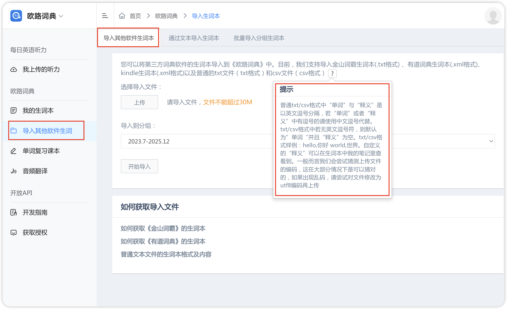

*Note：上图中，点击开始导入按钮，导入 txt 文档成功后显示导入的数量是不对的，自己在词典中验证一下有没有全部导入即可。*

把需要导入的单词以下面这种格式保存到一个 txt 文档中，文档格式如下：

```html
as, `/æz/`<br><br>conj. 当...时；因为；尽管<br><br>adv. 像...一 
when, `/wen/`<br><br>conj. 当...时；何时；如果<br><br>adv. 何时 
before, `/bɪˈfɔːr/`<br><br>conj. 在...之前<br><br>prep. 在...之前<br><br>adv. 以前 
after,`/ˈæftər/`<br><br>conj. 在...之后<br><br>prep. 在...之后 
while,`/waɪl/`<br><br>conj. 当...时候；虽然<br><br>n. 一段时间 
since,`/sɪns/`<br><br>conj. 自从；因为<br><br>adv. 从那时到现在 
until,`/ʌnˈtɪl/`<br><br>conj. & prep. 直到 
once, `/wʌns/`<br><br>conj. 一旦<br><br>adv. 一次 
where,`/wer/`<br><br>conj. 在...的地方<br><br>adv. 哪里 
wherever, `/werˈevər/`<br><br>conj. 无论哪里<br><br>adv. 无论什么地方
though, `/ðoʊ/`<br><br>conj. 虽然<br><br>adv. 然而
because,`/bɪˈkɔz/`<br><br>conj. 因为
now that, `/naʊ ðæt/`<br><br>conj. 既然 
so that,`/soʊ ðæt/`<br><br>conj. 以便
in order that,`/ɪn ˈɔrdər ðæt/`<br><br>conj. 为了
if, `/ɪf/`<br><br>conj. 如果 
unless, `/ʌnˈles/`<br><br>conj. 除非 
provided that,`/prəˈvaɪdɪd ðæt/`<br><br>conj. 只要 
as if,`/æz ɪf/`<br><br>conj. 仿佛 
as though,`/æz ðoʊ/`<br><br>conj. 仿佛 
although, `/ɔlˈðoʊ/`<br><br>conj. 虽然 
even though,`/ˈivən ðoʊ/`<br><br>conj. 即使 
whereas,`/werˈæz/`<br><br>conj. 然而 
while,`/waɪl/`<br><br>conj. 当...时候；虽然,
dramatic, `/drəˈmætɪk/`<br><br>adj. 戏剧性的；引人注目的
demographic,`/ˌdeməˈɡræfɪk/`<br><br>adj. 人口统计的<br><br>n. 人口统计数据 
adulthood,`/əˈdʌlthʊd/`<br><br>n. 成年,
ambiguity,`/ˌæmbɪˈɡjuːəti/`<br><br>n. 模棱两可；不明确,
dictator, `/ˈdɪkteɪtər/`<br><br>n. 独裁者 
attributive,`/əˈtrɪbjətɪv/`<br><br>adj. 定语的 
```

说明：两个 `<br>` 是因为要实现在单词中笔记排版的格式如下图：


备注：从上面的 txt 内容中可以看到，脱字符(`) 和 & 这种特殊字符是不会影响导入的，后续发现别的特殊字符有问题再记笔记。


## ▲ 备份格式比较好的单词记录方式

*Added: 2024.01.31*

*注：上面的格式是 2021-2023 年上半年记单词时根据 Vue 文档摸索出来的格式，但是这种格式对背单词实际上并无多大帮助，看起来也不是很明朗。*

### suite /swiːt/

```md
├── noun [countable]
│   ├── (1) [ROOMS 房间] (a set of rooms, especially expensive ones in a hotel) 套房〔尤指酒店豪华套房〕:
│   │   ├── a honeymoon suite 蜜月套房
│   │   ├── a **suite of rooms** for palace guests 王室贵宾套房
│   ├── (2) [FURNITURE 家具] (especially British English a set of matching furniture for a room) 一套家具:
│   │   ├── a pink bathroom suite 一套粉红色浴室家具
│   │   ├── three-piece suite (=a large seat and two chairs)
│   ├── (3) [COMPUTERS 计算机] *technical* (a group of related computer programs) 套件
│   ├── (4) [MUSIC 音乐] (a piece of music made up of several short parts) 组曲:
│   │   ├── the Nutcracker Suite《胡桃夹子组曲》
│   ├── (5) [POLITICS 政治] *formal* (the people who work for or help an important person)〔要人的〕一批随员[随从] SYN  retinue
```
> [!TIP]
>
> 2023 年下半年开始就是用这种格式来记单词了。例句是可选的，如果单词一点都不认识的时候建议可以不要看例句。

| 单词  | 美式发音  | 词类 + 汉语释义   | 例句                                                         |
| ----- | --------- | ----------------- | ------------------------------------------------------------ |
| suite | `/swiːt/` | n. 套房；一套设备 | a suite of 一系列<br />We booked a suite for our honeymoon. <br />(我们为蜜月预定了一套公寓。) |


## ▲ 中国程序员容易发音错误的单词 (点击🔊收听正确读音)
> https://github.com/shimohq/chinese-programmer-wrong-pronunciation


