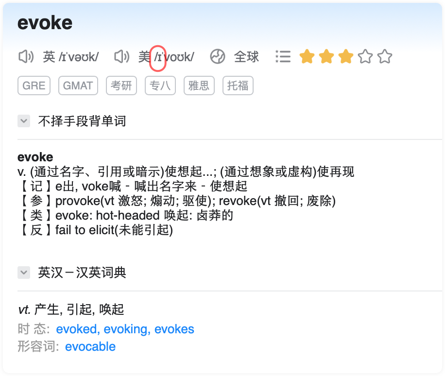

# 词汇


## ▲ 单词发音疑惑

### (1) evoke

*Created: 2023.12.22*



Q: 为什么上面单词的音标中是短元音 `/ɪ/` ，但是读音却是长元音 `/iː/` 的短音版 `/i/`？ 

像这种情况的发音问题不仅仅局限于 `/ɪ/`，其他情况也有，后续遇到其他情况，会继续补充。

### (2) advantage，advice

advantage `/ədˈvæntɪdʒ/` 和 advice `/əd'vaɪs/`，读音中第一个是字母 a 的发音是 `/ə/`，但词典上的读音好像类似 `/æ/`，

我实在没搞明白！


## ▲ 发音相似的单词汇总

为了帮助区分这些发音相近的单词，我将提供它们的美式发音和简短的汉语释义。

### 单词翻译表格

| 单词  | 美式发音  | 词类 + 汉语释义          | 示例                                                         |
| ----- | --------- | ------------------------ | ------------------------------------------------------------ |
| sheep | `/ʃiːp/`  | n. 绵羊                  | A sheep is grazing in the field.<br>(一只绵羊正在田里吃草。) |
| ship  | `/ʃɪp/`   | n. 船<br>v. 运输，航运   | n. The ship sailed across the ocean.<br/>(船横渡大海。)<br />n. The ship is docking at the harbor.<br>(船正在港口停靠。)<br>v. We will ship the products by sea.<br>(我们将通过海运发送产品。) |
|       |           |                          |                                                              |
| pull  | `/pʊl/`   | v. 拉，拖                | Pull the drawer`/drɔːr/` open.<br>(拉开抽屉。)<br />Pull the door to open it.<br/>(拉门将其打开。) |
| pool  | `/puːl/`  | n. 水池；游泳池          | The kids are playing in the pool.<br>(孩子们在游泳池里玩耍。) |
|       |           |                          |                                                              |
| feel  | `/fiːl/`  | v. 感觉，触摸            | I can feel the texture of the fabric.<br>(我能感觉到那布料的质地。)<br />I feel happy today.<br/>(我今天感觉很开心。) |
| fill  | `/fɪl/`   | v. 填充，充满            | Fill^(1)^ the bottle with water.<br>(用水填满瓶子。)<br />Fill the glass with water.<br/>(用水填充玻璃杯。) |
|       |           |                          |                                                              |
| beach | `/biːtʃ/` | n. 海滩                  | They spent the afternoon on^(2)^ the beach.<br>(他们在海滩上度过了下午。)<br />We spent the day at the beach.<br/>(我们在海滩上度过了一天。) |
| bitch | `/bɪtʃ/`  | n. 母狗；荡妇<br>v. 抱怨 | n. The bitch gave birth to six puppies.<br>(这只母狗生了六只小狗。)<br>n. She was unfairly called a bitch by her peers.<br>(她被同伴不公正地称为荡妇。)<br>v. He always bitches about his job.<br>(他总是抱怨他的工作。) |

备注：

**(1)** 句子 "Fill the bottle with water." 没有问题，它是一个祈使句。在英语中，祈使句用来发命令、提出请求或给予指示，其特点是动词原形开头，主语（通常是第二人称“you”）通常被省略。

在这个例子中：

- **Fill** 是动词原形，直接用于发出命令或请求。
- 省略的主语是 "you"（你），这是祈使句的常见特点，即主语不明显地出现在句子中，但意指被命令或请求的人。
- **the bottle** 是宾语，指明要被填满的对象。
- **with water** 是短语，说明用什么来填满瓶子。

所以，虽然在正常陈述句中动词不能直接做主语，但在祈使句中，动词原形开头是标准结构，用来表示命令、请求或指示。因此，"Fill the bottle with water." 是完全正确和符合语法的祈使句。

> 祈使句是用来**发出命令**、**请求**、**建议**或**指示**的句型。它们的主要特点是**直接表达说话者的意图，让听者做某事**。以下是祈使句的一些详细特点和用法：
>
> ### 1. 结构
>
> - **动词原形开头**：祈使句通常以动词的原形开头，省略主语。
> - **省略的主语**：祈使句的主语通常是 “you”，但在句子中通常省略。例如，在句子 "Open the door."（打开门。）中，实际的含义是 "You open the door."，但 "You" 被省略了。
>
> ### 2. 用途
>
> - **发出命令或指示**：如 "Stop talking."（停止说话。）
> - **提出请求**：如 "Please pass the salt."（请递一下盐。）
> - **给出指示或方向**：如 "Turn left at the corner."（在拐角处左转。）
> - **提供建议**：如 "Have a break."（休息一下。）
>
> ### 3. 添加礼貌性
>
> - 在祈使句前后添加 “please” 可以使命令听起来更礼貌。例如，"Please sit down."（请坐下。）
>
> ### 4. 祈使句的否定形式
>
> - 通过在动词前加 "do not" 或 "don't" 来形成否定祈使句。例如，"Don't touch that."（不要触摸那个。）
>
> ### 5. 强调或紧急情况
>
> - 有时为了强调或表示紧急情况，祈使句可以加上 "do" 在句首。例如，"Do come in!"（请进来！）
>
> ### 6. 使用感叹号或句号
>
> - 祈使句可以以感叹号结束，以表示强烈的情感或紧急命令，也可以用句号结束，表示更平静的命令或请求。
>
> 祈使句是英语中非常直接和功能性的句型，广泛用于日常交流中，以表达命令、请求、建议或指示。

**(2)** 在英语中，介词 "on" 和 "at" 在描述地点时的用法可以有细微的差别，这些差别通常与所指地点的具体性和感知的焦点有关。

- **"on the beach"**：使用 "on" 通常指在海滩的沙子上，强调的是海滩作为一个具体的、可以接触到的表面。当使用 "on" 时，往往强调的是海滩这个地方本身，可能涉及到在沙滩上行走、晒太阳、游泳等活动。

- **"at the beach"**：使用 "at" 通常指的是海滩这个地点，但感知上更加宽泛，不特指沙滩的表面，而是整个海滩区域或环境。使用 "at" 时，往往指的是在海滩区域的活动或经历，可能包括在附近的商店逛街、在海滩边的餐厅吃饭等。

尽管两个句子中的意思非常相近，"on the beach" 与 "at the beach" 的使用差别反映了说话者对地点的不同感知和侧重。总的来说，这种差别并不会导致理解上的大问题，因为在许多情况下，这两个短语可以互换使用。然而，微妙的区别在于个人如何想要表达他们在海滩的经历的具体性和范围。  -- ChatGPT 4.0


## ▲ 待查生词
- 


## ▲ 待编辑生词

### Added: 2024.04.08
ChatGPT 4.0 translations

~~注：下面表格单词已写到 Goodnotes~~

这里是您请求的单词的翻译及相关信息：

| 单词            | 美式发音          | 词类 + 汉语释义                        | 示例                                                         |
|-----------------|-------------------|---------------------------------------|--------------------------------------------------------------|
| tough           | `/tʌf/`           | adj. 坚韧的；艰苦的                    | He is known for his tough character.<br />(他以其坚韧的性格著称。) |
| cater           | `/ˈkeɪtər/`       | v. 提供饮食服务；迎合                  | They cater for weddings and other large events.<br />(他们为婚礼和其他大型活动提供饮食服务。) |
| catering        | `/ˈkeɪtərɪŋ/`     | n. 餐饮服务                            | The hotel's catering is known for its quality.<br />(这家酒店的餐饮服务以其质量著称。) |
| graduation      | `/ˌɡrædʒuˈeɪʃən/` | n. 毕业                                | The graduation ceremony will take place in June.<br />(毕业典礼将于六月举行。) |
| postgraduate    | `/ˌpoʊstˈɡrædʒuɪt/`| adj. 研究生的；n. 研究生              | He is studying for his postgraduate degree.<br />(他正在攻读他的研究生学位。) |
| treaty          | `/ˈtriːti/`       | n. 条约                                | The two countries signed a peace treaty.<br />(这两个国家签署了一项和平条约。) |
| parlance        | `/ˈpɑːrləns/`     | n. 说法                                | In legal parlance, this process is very complex.<br />(在法律术语中，这个过程非常复杂。) |
| clutch          | `/klʌtʃ/`         | n. 离合器；v. 抓住                     | He clutched the rope tightly.<br />(他紧紧抓住绳子。) |
| rag             | `/ræɡ/`           | n. 破布；报纸（俚语）                  | She used a rag to clean the window.<br />(她用一块破布清洁窗户。) |
| hug             | `/hʌɡ/`           | v. 拥抱                               | They hugged each other tightly.<br />(他们紧紧地拥抱了对方。) |
| infrastructure  | `/ˈɪnfrəˌstrʌktʃər/`| n. 基础设施                          | The storm caused severe damage to the city's infrastructure.<br />(暴风雨对城市的基础设施造成了严重破坏。) |


根据您的规则，这里是更新后的单词翻译表格：

| 单词            | 美式发音          | 词类 + 汉语释义                     | 示例                                                         |
|-----------------|-------------------|------------------------------------|--------------------------------------------------------------|
| coefficient | `/ˌkoʊɪˈfɪʃənt/` | n. 系数 | The coefficient of friction determines how easily one object slides over another.<br />(摩擦系数决定了一个物体在另一个物体上滑动的难易程度。) |
| tough           | `/tʌf/`           | adj. 坚韧的，艰难的                 | He is tough enough to handle the challenges.<br />(他足够坚韧，能应对这些挑战。) |
| cater           | `/ˈkeɪtər/       | v. 迎合，满足需求                   | The new restaurant caters to vegans.<br />(这家新餐馆迎合素食者的需求。) |
| catering        | `/ˈkeɪtərɪŋ/     | n. 餐饮服务                         | She works in catering and plans events.<br />(她从事餐饮服务，并策划活动。) |
| graduation      | `/ˌɡrædʒuˈeɪʃən/ | n. 毕业                             | The graduation ceremony is next month.<br />(毕业典礼是下个月。) |
| postgraduate    | `/ˌpoʊstˈɡrædʒuɪt/| n. 研究生                           | He is a postgraduate studying economics.<br />(他是一名研究经济学的研究生。) |
| treaty          | `/ˈtriːti/       | n. 条约                             | They signed a treaty to end the conflict.<br />(他们签署了一项条约以结束冲突。) |
| parlance        | `/ˈpɑːrləns/     | n. 说法，用语                       | In legal parlance, that term has a specific meaning.<br />(在法律术语中，那个词有特定的含义。) |
| clutch          | `/klʌtʃ/         | n. 离合器；v. 紧抓                   | n. The clutch in the car is broken.<br />(车的离合器坏了。)<br />v. She clutched the child’s hand tightly.<br />(她紧紧抓住孩子的手。) |
| rag             | `/ræɡ/           | n. 破布                             | He used a rag to clean the spill.<br />(他用一块破布清理溢出的液体。) |
| hug             | `/hʌɡ/           | v. 拥抱                             | They hugged each other in farewell.<br />(他们在告别时拥抱了对方。) |
| infrastructure  | `/ˈɪnfrəˌstrʌktʃər/| n. 基础设施                        | The earthquake damaged the city's infrastructure.<br />(地震损坏了城市的基础设施。) |
| plan            | `/plæn/`        | n. 计划；<br />v. 规划               | n. We have a plan for the project.<br />(我们有一个项目计划。)<br />v. We plan to visit France next year.<br />(我们计划明年访问法国。)<br />v. We plan to travel to Europe next year.<br />(我们计划明年去欧洲旅行。) |
| plane           | `/pleɪn/`       | n. 飞机；平面                        | The plane will land in an hour.<br />(飞机将在一小时内着陆。)<br />The plane will depart at 6 PM.<br />(飞机将于下午6点起飞。)<br />In mathematics, a plane is a flat, two-dimensional surface.<br />(在数学中，平面是一个平坦的二维表面。) |
| daffy          | `/ˈdæfi/`           | adj. 愚蠢的，疯狂的    | She made a daffy decision and regretted it later.<br/>他做了一个愚蠢的决定，之后后悔了。<br />His ideas are a bit daffy but interesting.<br />(他的想法有点傻，但很有趣。)<br />He's got some daffy ideas about how to solve the problem.<br/>他对如何解决问题有一些荒唐的想法。 |

| 单词           | 美式发音                 | 词类 + 汉语释义                            | 示例                                                         |
|----------------|--------------------------|-------------------------------------------|--------------------------------------------------------------|
|              |                   |                     |  |
| interstitial   | `/ˌɪntərˈstɪʃəl/        | adj. 间质的，间隙的                        | Interstitial spaces are found in tissues.<br />(组织中存在间质空间。) |
| pneumonia      | `/njuːˈmoʊniə/          | n. 肺炎                                    | Pneumonia is a serious respiratory condition.<br />(肺炎是一种严重的呼吸系统疾病。) |
| cerebral       | `/ˈsɛrəbrəl/            | adj. 大脑的                                | Cerebral functions refer to activities of the brain.<br />(大脑功能指的是大脑的活动。) |
| ependymitis    | `/ˌɛpɛnˈdɪmɪtɪs/        | n. 室管膜炎                                | Ependymitis is inflammation of the ependymal cells of the brain.<br />(室管膜炎是大脑室管膜细胞的炎症。) |
| vascular       | `/ˈvæskjələr/           | adj. 血管的                                | Vascular diseases affect the body's blood vessels.<br />(血管疾病影响身体的血管。) |
| infiltration   | `/ˌɪnfɪlˈtreɪʃən/       | n. 渗透；浸润                              | The infiltration of water into the soil is essential for plant growth.<br />(水分对土壤的渗透对植物生长至关重要。) |
| hemodia        | `/ˌhiːmoʊˈdaɪə/         | n. 血液透析                                | Hemodia is a process of purifying blood.<br />(血液透析是一种净化血液的过程。) |
| lysis          | `/ˈlaɪsɪs/              | n. 溶解，分解                              | Lysis is the breaking down of cells.<br />(溶解是指细胞的分解过程。) |
| peritoneal     | `/ˌpɛrɪˈtoʊniəl/        | adj. 腹膜的                                | Peritoneal dialysis involves the peritoneum in cleaning the blood.<br />(腹膜透析涉及使用腹膜清洁血液。) |
| dialysis       | `/daɪˈæləsɪs/           | n. 透析                                    | Dialysis is a treatment for kidney failure.<br />(透析是一种治疗肾功能衰竭的方法。) |
| uremia         | `/jʊˈriːmiə/            | n. 尿毒症                                  | Uremia is a condition resulting from kidney failure.<br />(尿毒症是肾功能衰竭的一种表现。) |

| 单词          | 美式发音               | 词类 + 汉语释义                       | 示例                                                         |
|---------------|------------------------|--------------------------------------|--------------------------------------------------------------|
| babysitter    | `/ˈbeɪbɪˌsɪtər/      | n. 保姆                               | She hired a babysitter to watch her children.<br />(她雇了一个保姆来看孩子。) |
| note          | `/noʊt/               | n. 笔记；便条；v. 注意；记录          | n. He took detailed notes during the lecture.<br />(他在讲座中做了详细的笔记。)<br />v. Please note the change in schedule.<br />(请注意时间表的变化。) |
| interviewer   | `/ˌɪn.təˈvjuː.ər/    | n. 面试官                             | The interviewer asked many challenging questions.<br />(面试官提出了许多具有挑战性的问题。) |
| portfolio     | `/pɔːrˈtfoʊlioʊ/     | n. 投资组合；作品集                   | He manages a diverse investment portfolio.<br />(他管理着一个多样化的投资组合。) |
| immediate     | `/ɪˈmiːdiət/         | adj. 立即的；直接的                   | The accident required immediate attention.<br />(这次事故需要立即处理。) |
| highest       | `/ˈhaɪɪst/            | adj. 最高的                           | She achieved the highest score in the class.<br />(她在班上取得了最高分。) |
| asphyxia      | `/æsˈfɪksiə/          | n. 窒息                               | Asphyxia can be caused by a lack of oxygen.<br />(窒息可能是由缺氧引起的。) |
| neonatorum    | `/ˌniːəˈneɪtərəm/     | n. (用于医学术语) 新生儿的            | Neonatal asphyxia is a serious condition.<br />(新生儿窒息是一种严重的状况。) |
| occurrence    | `/əˈkɜːrəns/         | n. 发生；事件                         | The occurrence of such incidents has decreased.<br />(此类事件的发生已经减少。) |
| radius        | `/ˈreɪdiəs/           | n. 半径                               | The circle has a radius of 5 centimeters.<br />(这个圆的半径是5厘米。) |
| isometry      | `/aɪˈsɒmətri/         | n. 等距映射                           | Isometry is an important concept in geometry.<br />(等距映射是几何学中的一个重要概念。) |
| diversity     | `/daɪˈvɜːrsəti/       | n. 多样性                             | The company is committed to promoting diversity.<br />(该公司致力于促进多样性。) |


### Added: 2024.04.06
ChatGPT 4.0 translations

~~注：下面表格单词已写到 Goodnotes~~

| 单词             | 美式发音             | 词类 + 汉语释义                      | 示例                                                         |
|------------------|----------------------|-------------------------------------|--------------------------------------------------------------|
| tender           | `/ˈtɛndər/`          | adj. 温柔的；嫩的；<br />n. 投标（书）<br />v. 提出 | adj. The meat is very tender.<br />(这肉非常嫩。)<br />n. The company is tendering for a construction project. <br />(公司正在投标一个建筑项目。)<br />v. He tendered his resignation.<br />(他提交了辞职信。) |
| tenderness       | `/ˈtɛndərnəs/`       | n. 温柔；柔软                        | She felt a tenderness in her heart.<br />(她心中感到一阵温柔。) |
| bond             | `/bɑːnd/`            | n. 债券；纽带<br />v. 结合 | n. My father put all his money into stock market bonds. <br />(我父亲把他所有的钱都投在上市债券上。)<br />n. The bond between them is very strong.<br />(他们之间的联系非常紧密。)<br />n. The bond of friendship is strong.<br />(友谊的纽带很牢固。)<br />n. Government bonds are considered safe investments.<br />(政府债券被认为是安全的投资。)<br />v. The team bonded during the trip.<br />(团队在旅行中建立了密切的关系。)<br />v. She bonded with her new puppy.<br />(她与新的小狗建立了感情。) |
| concern | `/kənˈsɜrn/` | n. 关心；忧虑；<br />v. 涉及 | n. Health is a major concern.<br />(健康是一个主要的关心点。)<br />n. our concern for human right. <br />(我们对人权的关注。) <br />n. the rise of concern about the environment. <br />(对环境越来越多的关注)<br />v. The issue concerns all of us.<br />(这个问题涉及我们所有人。) |
| raise | `/reɪz/` | v. 提高；筹集；养育 | We need to raise our standards.<br />(我们需要提高我们的标准。)<br />He raised the flag.<br />(他升起了旗帜。)<br />The charity event helped to raise funds.<br />(慈善活动帮助筹集了资金。)<br />They raised three children.<br />(他们养育了三个孩子。) |
| boarding school  | `/ˈbɔrdɪŋ ˌskuːl/`   | n. 寄宿学校                          | She attended a boarding school in Switzerland.<br />(她在瑞士上了一所寄宿学校。) |
| board | `/bɔːrd/` | n. 木板，董事会；<br />v. 登上（飞机﹑火车等） | n. He nailed the notice to the board.<br />(他把通知钉在木板上。)<br />v. We will board the plane soon.<br />(我们很快就要登机了。) |
| through          | `/θruː/`             | prep. 通过；<br />adv. 从头到尾；<br />adj. 直通的 | prep. We walked through the park.<br />(我们穿过了公园。)<br />adv. I read the report through.<br />(我从头到尾读了这份报告。)<br />adv. He worked through the night.<br />(他彻夜工作。)<br />adj. The train is a through service.<br />(这列火车是直通服务。) |
| industrial       | `/ɪnˈdʌstriəl/`      | adj. 工业的；产业的      | The city is known for its industrial development.<br />(这个城市以其工业发展而闻名。) |
| subscribe        | `/səbˈskraɪb/`       | v. 订阅；同意           | I subscribe to several magazines.<br />(我订阅了几本杂志。) |
| different        | `/ˈdɪfərənt/`        | adj. 不同的             | This painting is different from the others.<br />(这幅画与其他的不同。) |

注：上面的表格单词已写到 Goodnotes - 笔记日期：2024.04.02、06 - 04.06

| 单词           | 美式发音              | 词类 + 汉语释义                        | 示例                                                         |
|----------------|-----------------------|---------------------------------------|--------------------------------------------------------------|
| crawl          | `/krɔːl/`            | v. 爬行                               | The baby learned to crawl before walking.<br />(这个婴儿在学会走路之前学会了爬行。) |
| rather         | `/ˈræðər/`           | det. & adv. 宁愿；相当               | I'd rather stay home than go out.<br />(我宁愿呆在家里也不出去。)<br />I was rather surprised to see him with his ex-wife. <br />(我看到他和前妻在一起，感到相当惊讶。) |
| rather than    | `/ˈræðər ˈðæn/`      | conj. 宁愿；而不是                    | I would prefer to stay home rather than go out tonight.<br />(我宁愿今晚呆在家里也不愿出去。) |
| diploma        | `/dɪˈploʊmə/`        | n. 文凭，毕业证书                      | college diploma <br> (大学文凭/毕业证书)<br>high school diploma <br> (高中文凭)<br>postgraduate diploma <br> (研究生文凭)<br>graduate diploma <br> (硕士文凭/研究生文凭)<br>He received his diploma after four years of study.<br />(四年学习后，他获得了文凭。) |
| diplomat       | `/ˈdɪpləmæt/`       | n. 外交官                             | French diplomats. 法国外交官<br />The diplomat negotiated the treaty.<br />(这位外交官谈判了这项条约。) |
| treaty |  |  |  |
| diplomatic     | `/ˌdɪpləˈmætɪk/`     | adj. 外交的；有策略的                  | diplomatic activity. 外交活动。<br />diplomatic relations. 外交关系。<br />The two conuntries established diplomatic relations last year. <br />(去年两国建立了外交关系。)<br />He handled the situation in a diplomatic way.<br />(他以外交手腕处理了这个情况。) |
| doll           | `/dɑːl/`            | n. (洋)娃娃，玩偶                       | a small wooden doll. 一个小木头玩偶。<br />rag doll. 布洋娃娃。<br />The child hugged her doll tightly.<br />(孩子紧紧拥抱着她的玩偶。) |
| creepy         | `/ˈkriːpi/`         | adj. 令人毛骨悚然的                    | The old house looked really creepy at night.<br />(那座老房子在夜晚看起来真的很恐怖。)<br />There’s something creepy about the way he looks at me.<br />(他看着我的样子让人有点毛骨悚然。)<br />The whole place feels creepy.<br />(整个地方让人感到毛骨悚然。) |
| thingamajig    | `/ˈθɪŋəməˌdʒɪɡ/`     | n. [口]某物，玩意儿                    | I need that thingamajig to fix this.<br />(我需要那个玩意儿来修这个。)<br />What do you call that thingamajig? <br />You know – the circle with the line through it.<br />你管那东西叫什么？<br />你知道的——就是一个圆圈﹐中间穿一条线。 |
| sabotage       | `/ˈsæbətɑːʒ/`      | v. 蓄意破坏                            | They tried to sabotage the enemy's infrastructure.<br />(他们试图破坏敌人的基础设施。)<br />Every single plane had been sabotaged.<br />(每架飞机都遭到了破坏。) |
| daisy          | `/ˈdeɪzi/`           | n. 雏菊                               | He picked a daisy for her.<br />(他为她摘了一朵雏菊。) |
| magnitude      | `/ˈmæɡnɪtuːd/`      | n. 大小，重要性；（地震的）级数       | The magnitude of the problem is bigger than we thought.<br />(问题的严重性比我们想象的要大。)<br />We did not realize the magnitude of the problem. <br />(我们没有意识到这个问题的重要性。)<br />The magnitude of the earthquake was recorded as 7.2 on the Richter scale.<br/>(地震的大小被记录为里氏7.2级。)<br />earthquake magnitude. 地震震级/等级 |
| incidence      | `/ˈɪnsɪdəns/`       | n. （尤指罪行﹑疾病等的）发生率               | incidence rate. 发生率/发病率。<br />The incidence of the disease has increased.<br />(这种病的发生率已经上升。)<br />Why did the incidence of heroin use continue to climb?<br />(为什么吸食海洛因的人数持续攀升？)<br />Smokers had the highest incidence of colds. <br />(吸烟者的感冒发病率最高。) |
| heroin | `/ˈheroʊɪn/` | n. 海洛因 | Heroin is a highly addictive drug.<br />(海洛因是一种高度成瘾的药物。) |

| 单词         | 美式发音            | 词类 + 汉语释义                        | 示例                                                         |
|--------------|---------------------|---------------------------------------|--------------------------------------------------------------|
| question     | `/ˈkwestʃən/` | n. 问题；疑问；<br />v. 询问；质疑；   | n. He asked a difficult question.<br />(他问了一个难题。)<br />n. I'm afraid I can't answer that question. <br />(我恐怕无法回答那个问题。)<br />v. They questioned the witness in court.<br />(他们在法庭上质询证人。) |
| hood         | `/hʊd/`            | n. 头巾，风帽；（汽车的）引擎盖 | She wore a hood to protect herself from the rain.<br />(她戴了一个头巾以免淋雨。)<br />Love is not a hood, but an eyewater.<br />(爱情不是头巾，而是明目水。)<br />Check under the hood and see what that noise is.<br />(打开引擎盖查查是什么声音。) |
| anthem       | `/ˈænθəm/`        | n. 国歌；赞美歌                        | The national anthem was played at the ceremony.<br />(仪式上播放了国歌。) |
| critic       | `/ˈkrɪtɪk/`       | n. 评论家；批评家(/者)           | File/Movie critic. 影评家。<br />He is a well-known critic of modern art.<br />(他是现代艺术的著名评论家。) |
| critical     | `/ˈkrɪtɪkəl/`      | adj. 批评的；关键的                    | His work plays a critical role in the project.<br />(他的工作在这个项目中发挥了关键作用。) |
| criticism    | `/ˈkrɪtɪsɪzəm/`   | n. 批评，评论                          | There has been **widespread criticism** of the decision.<br />(这一决定受到了普遍的批评。)<br /> You must learn to **accept criticism**. <br />(你必须学会接受批评。)<br />She accepted the criticism with good grace.<br />(她优雅地接受了批评。) |
| stab         | `/stæb/`           | v. 刺，戳；<br />n. 刺伤                 | v. He was **stabbed to death** in a fight.<br />(他在一次打斗中被捅死了。)<br />v. He stabbed the meat with a fork.<br />(他用叉子刺肉。)<br />n. The victim had a stab wound in the chest.<br />(受害者胸部有刺伤。)<br />n. severe stab wounds. 严重的刺伤。<br />n.  a stab victim. 一个被刀捅的人。 |
| soak         | `/soʊk/`           | v. 浸泡;<br />n. 浸泡                | v. Let the beans soak overnight.<br />(让豆子浸泡一夜。)<br />v. Let the clothes soak in warm water.<br />(让衣服在温水中浸泡。)<br />v. Soak in a warm bath to relax. <br />(泡一个热水澡，放松一下。)<br />n. Give the beans a good soak before cooking.<br />(在烹饪前让豆子充分浸泡。)<br />n. Give the towels a good soak, they're very dirty. <br />(把毛巾好好泡一泡，太脏了。) |
| kukri        | `/ˈkʊkri/`         | n. （印度廓尔喀人用的）反曲刀 | The kukri is a traditional Nepalese knife.<br />(廓尔喀刀是尼泊尔的传统刀具。) |
| agonize      | `/ˈægənaɪz/`      | v. 折磨，使极度痛苦                    | agonize over a problem<br />苦苦思索一个问题<br />He agonized over the decision for days.<br />(他为这个决定苦恼了几天。) |
| agonizing    | `/ˈægəˌnaɪzɪŋ/`    | adj. 令人极度痛苦的                    | The pain was agonizing.疼痛难忍。<br />It was an agonizing choice to make.<br />(这是一个令人极度痛苦的选择。) |
| shrivel      | `/ˈʃrɪvəl/`        | v. （使）枯萎，（使）皱缩              | The leaves shrivel up in the hot sun.<br />(树叶在炎热的阳光下枯萎。)<br />a shrivelled apple. 一个干瘪的苹果 |

注：上面 2 个表格的单词已写到 Goodnotes - 笔记日期：2024.04.07, 2024.04.08


| 单词         | 美式发音            | 词类 + 汉语释义                        | 示例                                                         |
|--------------|---------------------|---------------------------------------|--------------------------------------------------------------|
| blind        | `/blaɪnd/          | adj. 盲的；n. 百叶窗                  | adj. He is blind in one eye.<br />(他的一只眼睛看不见。)<br />n. She pulled down the blind to block the sunlight.<br />(她拉下百叶窗挡住阳光。) |
| draw         | `/drɔː/            | v. 画；拉；吸引                        | He can draw very well.<br />(他画画非常好。) |
| intimate     | `/ˈɪntɪmət/        | adj. 亲密的；n. 密友                  | adj. They shared an intimate moment.<br />(他们共享了一个亲密的时刻。)<br />n. He's one of my intimates.<br />(他是我的密友之一。) |
| urgent       | `/ˈɜrdʒənt/        | adj. 紧急的                           | The situation is urgent and requires immediate attention.<br />(情况紧急，需要立即处理。) |
| variety      | `/vəˈraɪəti/       | n. 多样性；种类                       | The store offers a wide variety of products.<br />(这家商店提供各种各样的产品。) |
| comment      | `/ˈkɑmɛnt/         | n. 评论；v. 评论                      | n. She made a comment about the event.<br />(她对那个事件发表了评论。)<br />v. He commented on the article.<br />(他对那篇文章发表了评论。) |
| collision    | `/kəˈlɪʒən/        | n. 碰撞                               | The collision between the two cars caused a lot of damage.<br />(这两辆车的碰撞造成了很大的损害。) |
| course       | `/kɔːrs/           | n. 课程；过程；赛道                   | She enrolled in a cooking course.<br />(她报名参加了烹饪课程。) |
| existential  | `/ˌɛɡzɪˈstɛnʃəl/   | adj. 存在主义的；存在的               | The film explores deep existential questions.<br />(这部电影探讨了深刻的存在主义问题。) |
| route        | `/ruːt/` or `/raʊt/ | n. 路线                               | We took the scenic route to the coast.<br />(我们走风景路线到达海岸。) |
| euphony      | `/ˈjuːfəni/        | n. 悦耳的声音                         | The euphony of the poetry added to its appeal.<br />(诗歌的悦耳之声增加了它的吸引力。) |

| 单词         | 美式发音            | 词类 + 汉语释义                      | 示例                                                         |
|--------------|---------------------|-------------------------------------|--------------------------------------------------------------|
|               |                 |                      |                                                              |
| chew         | `/tʃuː/            | v. 咀嚼                              | She likes to chew gum.<br />(她喜欢嚼口香糖。) |
| chewing      | `/ˈtʃuːɪŋ/         | n. 咀嚼行为                          | Chewing helps in digestion.<br />(咀嚼有助于消化。) |
| in the act of |                     | phrase 在做…的过程中                 | He was caught in the act of stealing.<br />(他在偷窃的过程中被抓住。) |
| boa          | `/ˈboʊ.ə/          | n. 大蟒；围巾                         | She wore a fur boa to the party.<br />(她戴着一条皮草围巾去了聚会。) |
| constrictor  | `/kənˈstrɪktər/    | n. 约束者；大蟒                      | The boa constrictor is a large snake that squeezes its prey.<br />(大蟒是一种通过挤压猎物来捕食的大蛇。) |
| magnificent  | `/mæɡˈnɪfɪsənt/    | adj. 壮丽的，宏伟的                  | The palace is magnificent.<br />(宫殿很壮丽。) |
| essential    | `/ɪˈsɛnʃəl/        | adj. 必要的；本质的                  | Water is essential for life.<br />(水对于生命来说是必要的。) |
| volcano      | `/vɒlˈkeɪnoʊ/      | n. 火山                              | The volcano erupted last year.<br />(那座火山去年爆发了。) |
| model        | `/ˈmɑːdəl/         | n. 模型；模特                        | He built a model airplane.<br />(他制作了一个飞机模型。)<br />She works as a fashion model.<br />(她是一名时装模特。) |
| charm        | `/tʃɑːrm/          | n. 魅力；v. 吸引                     | n. His smile has a certain charm.<br />(他的微笑有一种特别的魅力。)<br />v. She charmed everyone at the party.<br />(她在聚会上吸引了所有人。) |

| 单词         | 美式发音            | 词类 + 汉语释义                         | 示例                                                         |
|--------------|---------------------|----------------------------------------|--------------------------------------------------------------|
| charming     | `/ˈtʃɑrmɪŋ/       | adj. 迷人的                             | She has a charming personality.<br />(她有一个迷人的个性。) |
| examine      | `/ɪɡˈzæmɪn/       | v. 检查，审查                           | The doctor will examine the patient.<br />(医生将检查病人。) |
| examining    | `/ɪɡˈzæmɪnɪŋ/     | adj. 检查的；n. 检查                    | The examining process is thorough.<br />(检查过程是彻底的。) |
| extraordinary| `/ɪkˈstrɔːrdɪneri/| adj. 非凡的，杰出的                     | Her talent is extraordinary.<br />(她的才华非凡。) |
| cut          | `/kʌt/             | v. 切；n. 切口                          | v. He cut the paper with scissors.<br />(他用剪刀剪了纸。)<br />n. There is a cut on my hand.<br />(我的手上有一个切口。) |
| bright       | `/braɪt/           | adj. 明亮的，聪明的                     | The sun is very bright today.<br />(今天的太阳很明亮。) |
| flight       | `/flaɪt/           | n. 飞行；航班                           | The flight to Tokyo takes approximately 8 hours.<br />(飞往东京的航班大约需要8小时。) |
| dying        | `/ˈdaɪɪŋ/          | adj. 垂死的；v. 死亡（die的现在分词）   | He was with his dying grandmother.<br />(他陪在他垂死的祖母身边。) |
| sally        | `/ˈsæli/           | n. 突然出击；v. 突出                    | The troops made a sally against the enemy.<br />(部队对敌人发动了突然攻击。) |
| dictation    | `/dɪkˈteɪʃən/      | n. 听写；口述                           | The students had an English dictation test.<br />(学生们进行了一次英语听写测试。) |
| ordinary     | `/ˈɔːrdəneri/      | adj. 普通的，平凡的                     | It was just an ordinary day.<br />(那只是平凡的一天。) |

| 单词          | 美式发音          | 词类 + 汉语释义                          | 示例                                                         |
|---------------|--------------------|-----------------------------------------|--------------------------------------------------------------|
| bid           | `/bɪd/            | v. 出价，投标；n. 投标，出价            | v. They bid for the contract.<br />(他们为合同投标。)<br />n. The bid was too low.<br />(出价太低。) |
| construction  | `/kənˈstrʌkʃən/   | n. 建设，施工                            | The construction of the new bridge will take two years.<br />(新桥的建设将需要两年时间。) |
| investment    | `/ɪnˈvɛstmənt/    | n. 投资                                  | Real estate can be a good investment.<br />(房地产可以是一个好的投资。) |
| lifelong      | `/ˈlaɪfˌlɔŋ/      | adj. 终生的                              | He has a lifelong interest in music.<br />(他对音乐有着终生的兴趣。) |
| furious       | `/ˈfjʊəriəs/      | adj. 愤怒的，狂怒的                      | She was furious at the news.<br />(她听到那个消息后非常愤怒。) |
| cheer         | `/tʃɪr/           | v. 欢呼；n. 欢呼，喝彩                    | v. The crowd cheered the winner.<br />(人群为胜利者欢呼。)<br />n. The cheer of the fans filled the stadium.<br />(球迷的欢呼声充满了体育场。) |
| cheers        | `/tʃɪrz/          | int. 干杯（用于祝酒时）                   | Cheers! Let’s celebrate our success.<br />(干杯！让我们庆祝我们的成功。) |
| spoil         | `/spɔɪl/          | v. 溺爱；破坏；n. 战利品，掠夺物          | v. Don't spoil your child.<br />(不要溺爱你的孩子。)<br />n. The victors divided the spoils.<br />(胜利者分配战利品。) |
| desire        | `/dɪˈzaɪər/       | n. 欲望；v. 渴望                         | n. He has a strong desire to succeed.<br />(他有很强的成功欲望。)<br />v. She desires to travel the world.<br />(她渴望周游世界。) |
| haggard       | `/ˈhæɡərd/        | adj. 憔悴的，枯槁的                      | The stress left him looking haggard.<br />(压力使他看起来憔悴。) |
| sneer         | `/snɪr/           | v. 嘲笑；n. 冷笑                         | v. They sneered at his suggestions.<br />(他们对他的建议嗤之以鼻。)<br />n. His sneer made me angry.<br />(他的冷笑让我生气。) |
|              |                 |                                  |                                                              |

### 单词解释：

- **route**: 请注意，单词“route”可以有两种发音，分别是 `/ruːt/` 和 `/raʊt/`，具体取决于地区。如果您需要进一步的解释或有其他单词需要翻译，请告诉我。


### Added: 2024.04.04
ChatGPT 4.0 translations

~~注：下面表格单词已写到 Goodnotes~~

| 单词        | 美式发音          | 词类 + 汉语释义                      | 示例                                                         |
| ----------- | ----------------- | ------------------------------------ | ------------------------------------------------------------ |
| desiccate   | `/ˈdɛsɪkeɪt/`     | v. 使脱水，使干燥                    | The machine desiccates the fruit for storage.<br />(这台机器使水果脱水以便储存。) |
| desiccative | `/ˈdɛsɪˌkeɪtɪv/`  | adj. 使干燥的                        | The desiccative agent is used in packaging to prevent moisture.<br />(这种干燥剂用于包装以防潮湿。) |
| desiccator  | `/ˈdɛsɪkeɪtər/`   | n. 干燥剂，干燥器                    | The chemical samples were stored in a desiccator.<br />(化学样品被储存在干燥器中。) |
| cult        | `/kʌlt/`          | n. 邪教；狂热崇拜                    | The book examines the psychology behind cult movements.<br />(这本书检视了邪教运动背后的心理学。) |
| decimate    | `/ˈdɛsɪˌmeɪt/`    | v. 大量毁灭；严重削弱                | The population was decimated by the plague.<br />(瘟疫大量毁灭了人口。) |
| pussy       | `/ˈpʊsi/`         | n. 猫咪；[俚]女性生殖器              | She has a cute little pussy cat.<br />(她有一只可爱的小猫。) |
| delusion    | `/dɪˈluʒən/`      | n. 错觉；妄想                        | He is under the delusion that he is invincible.<br />(他妄想自己是不可战胜的。) |
| delusional  | `/dɪˈluʒənəl/`    | adj. 妄想的，幻觉的                  | The patient has delusional thoughts about his power.<br />(这位患者对自己的力量有妄想。) |
| sort        | `/sɔːrt/`         | n. 种类；v. 分类                     | n. We have all sorts of books here.<br />(我们这里有各种各样的书。)<br />v. Sort the papers by date.<br />(按日期对文件进行分类。) |
| respite     | `/ˈrɛspɪt/`       | n. 暂缓；喘息                        | The vacation was a welcome respite from work.<br />(假期是从工作中得来的喘息。) |
| ※           | ※                 | ※                                    | ※                                                            |
| catalogue   | `/ˈkætəˌlɔɡ/`     | n. 目录；v. 编目录                   | n. She found the book in the library catalogue.<br />(她在图书馆目录中找到了这本书。)<br />v. We need to catalogue the new arrivals.<br />(我们需要为新到的书编目录。) |
| pasture     | `/ˈpæstʃər/`      | n. 牧场；v. 放牧                     | n. The cows are grazing in the pasture.<br />(奶牛正在牧场上吃草。)<br />v. They pasture their sheep on the hillside.<br />(他们在山坡上放牧羊。) |
| cow         | `/kaʊ/`           | n. 奶牛                              | The cow is grazing in the field.<br />(奶牛正在田野上吃草。) |
| convergence | `/kənˈvɜrdʒəns/`  | n. 汇聚；收敛                        | The convergence of the rivers creates a powerful current.<br />(河流的汇聚形成了强大的水流。) |
| convergent  | `/kənˈvɜrdʒənt/`  | adj. 收敛的                          | Convergent lines meet at a point.<br />(收敛线在一点相交。)  |
| word        | `/wɜrd/`          | n. 单词；话语                        | Choose your words carefully.<br />(仔细选择你的措辞。)       |
| world       | `/wɜrld/`         | n. 世界                              | He has traveled around the world.<br />(他已经环游了世界。)  |
| dose        | `/doʊs/`          | n. 剂量；v. 给...服药                | n. The doctor prescribed a dose of medicine.<br />(医生开了一剂药。)<br />v. She dosed the child with cough syrup.<br />(她给这个孩子服用了咳嗽糖浆。) |
| light       | `/laɪt/`          | n. 光；adj. 轻的；v. 点亮            | n. The light from the sun is very bright.<br />(太阳的光非常明亮。)<br />adj. She prefers light meals.<br />(她喜欢吃清淡的饭菜。)<br />v. Light the candle.<br />(点燃蜡烛。) |
| impression  | `/ɪmˈprɛʃən/`     | n. 印象；感觉                        | His first impression of the city was positive.<br />(他对这座城市的第一印象是积极的。) |
| serial      | `/ˈsɪriəl/`       | adj. 连续的；n. 连续剧               | adj. She writes for a serial publication.<br />(她为一份连续出版物写作。)<br />n. The new serial is popular on television.<br />(新的电视连续剧很受欢迎。) |
| tributary   | `/ˈtrɪbjʊtɛri/`   | n. 支流                              | The river has several tributaries.<br />(这条河有几条支流。) |
| ※           | ※                 | ※                                    | ※                                                            |
| semester    | `/səˈmɛstər/`     | n. 学期                              | The course lasts for one semester.<br />(这门课程持续一个学期。) |
| Ergenbright | `/ˈɜːrɡənˌbraɪt/` | n. 专有名词（人名）                  | Ergenbright is likely a surname and does not have a translation. |
| counsel     | `/ˈkaʊnsəl/`      | n. 咨询，建议；v. 提供专业咨询或建议 | n. She sought counsel from her lawyer.<br />(她向律师征询了意见。)<br />v. He counseled the student on career choices.<br />(他就职业选择向学生提供了咨询。) |
| counsellor  | `/ˈkaʊnsələr/`    | n. 顾问，辅导员                      | The school counsellor helps students with their problems.<br />(学校辅导员帮助学生解决问题。) |
| counselor   | `/ˈkaʊnsələr/`    | n. 顾问，辅导员（美式拼写）          | The counselor offered guidance on college applications.<br />(辅导员提供了关于大学申请的指导。) |
| nightmare   | `/ˈnaɪtˌmɛr/`     | n. 噩梦                              | She woke up from a terrible nightmare.<br />(她从一场可怕的噩梦中醒来。) |
| Satanic     | `/səˈtænɪk/`      | adj. 魔鬼的，撒旦的                  | The movie features a Satanic cult.<br />(这部电影展示了一个魔鬼的邪教。) |
| worship     | `/ˈwɜrʃɪp/`       | v. 崇拜；n. 崇拜，敬仰               | v. People worship in temples, churches, and mosques.<br />(人们在寺庙、教堂和清真寺崇拜。)<br />n. His worship of money led him astray.<br />(他对金钱的崇拜使他误入歧途。) |
| rev         | `/rɛv/`           | v. 加速，提高转速                    | He revved the engine before starting the race.<br />(他在赛前加速了引擎。) |
| casual      | `/ˈkæʒuəl/`       | adj. 随意的，非正式的                | He dresses in a casual style.<br />(他的着装风格很随意。)    |
| postpone    | `/poʊstˈpoʊn/`    | v. 推迟                              | The meeting was postponed until next week.<br />(会议被推迟到下周。) |
| sadistic    | `/səˈdɪstɪk/`     | adj. 虐待狂的                        | He showed a sadistic pleasure in teasing others.<br />(他在折磨别人时表现出虐待狂的乐趣。) |

### 单词解释：

- **Ergenbright** 作为专有名词，通常是个人姓氏或公司名称，其准确的发音可能因地区或个人而异。不过，基于英语发音规则，我们可以做出一个近似的音标表示：`/ˈɜːrɡənˌbraɪt/`。请注意，这个发音是根据单词的拼写推测的，并可能不完全反映某个特定人或实体的实际发音。在实际应用中，最好能听到该名词的持有者或相关人士的发音。


### Added: 2024.04.03
ChatGPT 4.0 translations

~~注：下面表格单词已写到 Goodnotes~~

| 单词           | 美式发音          | 词类 + 汉语释义                | 示例                                                         |
|----------------|-------------------|-------------------------------|--------------------------------------------------------------|
| obsolete       | `/ˌɑːbsəˈliːt/` | adj. 过时的                   | The software is obsolete.<br />(这个软件已经过时。)<br />obsolete weapons.<br />(已淘汰的武器) |
| delegate       | `/ˈdeləɡət/`（n.）<br>`/ˌdelɪˈɡeɪt/`（v.） | n. 代表<br>v. 委派           | n. He is a delegate at the conference.<br />(他是会议的代表。)<br />v. She will delegate the task to her team.<br />(她将把任务委派给她的团队。) |
| hill           | `/hɪl/`           | n. 小山                       | They walked up the hill.<br />(他们走上了小山。)<br />A hawk hovered over the hill. <br />(一只鹰在小山的上空翱翔。) |
| mere           | `/mɪr/`           | adj. 仅仅的，只不过的         | It's a mere formality.<br />(这只不过是个形式。) |
| merely         | `/ˈmɪrli/`        | adv. 仅仅地                   | He merely laughed at the joke.<br />(他仅仅对那个笑话笑了笑。) |
| pray           | `/preɪ/`          | v. 祈祷                       | They pray for good weather.<br />(他们祈求好天气。) |
| chew           | `/tʃu/`           | v. 咀嚼                       | He chews slowly to savor his food.<br />(他慢慢咀嚼以享受食物。) |
| savor / savour | `/ˈseɪvər/` | v. 品尝，享受；n. 滋味 | v. Savor the taste of the wine.<br />(品尝这葡萄酒的味道。)<br />n. The savor of the soup was delightful.<br />(这汤的滋味令人愉悦。) |
| in the act of  |                   | phrase 在...过程中            | Caught in the act of lying, he had no excuse.<br />(在撒谎过程中被抓，他无法辩解。) |
| magnificent    | `/mæɡˈnɪfəsənt/` | adj. 壮丽的，宏伟的           | The palace looks magnificent at night.<br />(宫殿在夜间看起来非常壮丽。) |
| championship   | `/ˈtʃæmpiənˌʃɪp/`| n. 锦标赛                     | She aims to win the world championship.<br />(她的目标是赢得世界锦标赛。) |
| session        | `/ˈsɛʃən/`        | n. 会议，会期                 | The session lasted two hours.<br />(会议持续了两个小时。) |
| parliament     | `/ˈpɑrləmənt/`    | n. 议会                       | The parliament debated the new bill.<br />(议会讨论了新法案。) |
| formality      | `/fɔːrˈmælɪti/ | n. 正式手续；礼节 | Completing the form is just a formality.<br />(填写表格只是一种形式手续。) |
| assembly       | `/əˈsɛmbli/ | n. 集会；议会；装配 | The assembly passed a new law.<br />(议会通过了一项新法律。) |
| plague         | `/pleɪɡ/ | n. 瘟疫；灾害；v. 折磨，困扰 | n. The city was hit by a terrible plague.<br />(这个城市遭受了可怕的瘟疫。)<br />v. He was plagued by guilt.<br />(他被罪恶感折磨。) |
| render         | `/ˈrɛndər/ | v. 使成为；提供；演绎 | The court rendered a verdict of guilty.<br />(法院作出了有罪的裁决。) |


### Added: 2024.04.01
ChatGPT 4.0 translations

~~注：下面表格单词已写到 Goodnotes~~

| Word         | American Pronunciation | Part of Speech + Chinese Definition       | Example Sentence                                          |
|--------------|------------------------|-------------------------------------------|----------------------------------------------------------|
| literature   | `/ˈlɪtərətʃər/       | n. 文学                                   | She has an extensive collection of world literature. (她拥有丰富的世界文学藏书。) |
| literary     | `/ˈlɪtəˌrɛri/        | adj. 文学的                               | He made a significant literary achievement. (他取得了重要的文学成就。) |
| quote        | `/kwoʊt/`            | v. 引用；报价<br />n. 引用；报价        | v. He quoted a famous poet in his speech. (他在演讲中引用了一位著名诗人的话。)<br />v. He quoted a short passage form the Bible. <br />(他引用了《圣经》里的一小段。)<br />n. Can you give me a quote for the repair work?<br />(你能给我一个修理工作的报价吗？) |
|  |  |  |  |
| bam          | `/bæm/               | interj. （突然发生的声音或行动的表示）     | The door went bam and everyone looked up. (门“砰”的一声，所有人都抬头看。) |
| pariah       | `/pəˈraɪə/           | n. 被排斥或鄙视的人                       | He became a social pariah after the scandal. (丑闻之后他成了社会弃儿。) |
| booby        | `/ˈbuːbi/            | n. 傻瓜；笨蛋                             | Don't be such a booby! (别做傻瓜！) |
| shout-out    | `/ˈʃaʊtˌaʊt/         | n. 大声喊出；公开感谢或认可               | I want to give a shout-out to my team for their hard work. (我想大声感谢我的团队为他们的辛勤工作。) |
| rapture      | `/ˈræptʃər/          | n. 狂喜                                   | She listened to the music with a look of rapture. (她听音乐时面露狂喜。) |
| effortless   | `/ˈɛfərtləs/         | adj. 不费力的                             | He made an effortless jump and won the game. (他轻松跳跃赢得了比赛。) |
| boast        | `/boʊst/             | v. 吹嘘；n. 自夸                           | v. He boasts about his achievements. (他夸耀自己的成就。) |
| concise      | `/kənˈsaɪs/          | adj. 简洁的                               | His explanation was clear and concise. (他的解释清晰而简洁。) |
| propaganda   | `/ˌprɑːpəˈɡændə/     | n. 宣传                                   | The government's campaign was full of propaganda. (政府的运动充满了宣传。) |
| exclusive    | `/ɪkˈskluːsɪv/       | adj. 独有的，专有的                       | They obtained an exclusive interview with the celebrity. (他们获得了对那位名人的独家采访。) |

| Word           | American Pronunciation | Part of Speech + Chinese Definition      | Example Sentence                                       |
|----------------|------------------------|------------------------------------------|-------------------------------------------------------|
| indivisible    | `/ˌɪndɪˈvɪzəbl/      | adj. 不可分割的                          | The concept of freedom is indivisible from human rights. (自由的概念与人权不可分割。) |
| onto           | `/ˈɒntu/             | prep. 到...之上                          | She climbed onto the roof. (她爬到屋顶上。)             |
| impression     | `/ɪmˈprɛʃən/         | n. 印象                                  | His speech made a strong impression on the audience. (他的演讲给观众留下了深刻的印象。) |
| repent         | `/rɪˈpɛnt/           | v. 悔改，后悔                            | He repented for his past mistakes. (他为过去的错误感到后悔。) |
| slack          | `/slæk/              | adj. 松弛的；v. 松懈，减弱              | adj. The rope is too slack. (绳子太松了。)<br>v. Don't slack on your duties. (不要在职责上松懈。) |
| fortunate      | `/ˈfɔːrtʃənət/       | adj. 幸运的                              | She was fortunate to find her lost ring. (她很幸运找到了她丢失的戒指。) |
| total          | `/ˈtoʊtl/            | n. 总计；adj. 总的，全部的              | n. The total comes to $100. (总计为100美元。)<br>adj. The total amount is overwhelming. (总金额是压倒性的。) |
| labyrinth      | `/ˈlæbərɪnθ/        | n. 迷宫                                  | The ancient palace was a labyrinth of corridors. (古宫殿是一个迷宫般的走廊。) |
| labyrinthine   | `/ˌlæbəˈrɪnθɪn/     | adj. 迷宫般的                            | The legal procedures were labyrinthine and complex. (法律程序错综复杂。) |
| corpse         | `/kɔːrps/            | n. 尸体                                  | The corpse was found in the woods. (尸体在树林中被发现。) |
| literally      | `/ˈlɪtərəli/         | adv. 字面上的，确实地                    | He was literally the only person there. (他确实是那里唯一的人。) |
| literal        | `/ˈlɪtərəl/          | adj. 字面的，确切的                      | The literal meaning of the word is clear. (这个词的字面意思很清楚。) |

| 单词        | 美式发音          | 词类 + 汉语释义             | 示例                                                         |
|-------------|-------------------|-------------------------|--------------------------------------------------------------|
| endanger    | `/ɛnˈdeɪndʒər/  | v. 使处于危险              | His reckless driving could endanger lives.<br />(他鲁莽的驾驶可能会危及生命。) |
| wonder      | `/ˈwʌndər/      | v. 想知道；对...感到惊奇；n. 奇迹  | v. I wonder why she left the party early.<br />(我想知道她为什么早早地离开了聚会。)<br />n. The Great Wall is one of the wonders of the world.<br />(长城是世界奇迹之一。) |
| mouth       | `/maʊθ/         | n. 嘴；口                 | She put the spoon in her mouth.<br />(她把勺子放进嘴里。) |
| tremendous  | `/trɪˈmɛndəs/   | adj. 巨大的；极好的        | They won the game by a tremendous margin.<br />(他们以巨大的优势赢得了比赛。) |
| toward      | `/təˈwɔrd/      | prep. 朝向；对于           | He walked toward the door.<br />(他朝门走去。) |
| itinerary   | `/aɪˈtɪnəˌrɛri/ | n. 旅行计划；行程单         | She checked her itinerary to confirm the flight times.<br />(她查看了她的行程单以确认航班时间。) |


### Added: 2024.03.30

ChatGPT 4.0 translations

~~注：下面表格单词已写到 Goodnotes~~

 根据您的要求，这里是所请求单词的翻译表格，包括词性、汉语释义和示例：

| 单词       | 美式发音          | 词类 + 汉语释义         | 示例                                                         |
| ---------- | ----------------- | ----------------------- | ------------------------------------------------------------ |
| minimum    | `/ˈmɪnɪməm/      | n. 最小量；最低限度     | The job requires a minimum of five years of experience.<br />(这份工作要求至少五年经验。) |
| cement     | `/sɪˈmɛnt/       | n. 水泥；<br />v. 巩固，加强 | n. The sidewalk was laid with fresh cement.<br />(人行道铺上了新水泥。)<br />v. The crisis cemented their relationship.<br />(危机巩固了他们的关系。) |
| sprig      | `/sprɪɡ/         | n. 嫩枝，小枝      | She added a sprig of parsley to the dish.<br />(她在菜里加了一小枝欧芹。) |
| perch      | `/pɜːrtʃ/        | n. 栖木；v. 栖息   | n. The bird flew to its perch.<br />(鸟飞到了它的栖木上。)<br />v. She perched on the edge of the desk.<br />(她坐在桌子边缘。) |
| estimate   | `/ˈɛstɪmeɪt/     | n. 估计；v. 估计   | n. The estimate for the project was too low.<br />(项目的预算估计太低。)<br />v. They estimated the crowd to be around 10,000.<br />(他们估计人群大约有10,000人。) |
| glamorous  | `/ˈɡlæmərəs/     | adj. 迷人的，富有魅力的 | The actress wore a glamorous dress to the premiere.<br />(这位女演员身着迷人的礼服出席首映式。) |
| chaff      | `/tʃæf/          | n. 谷壳；废物；开玩笑   | He always dismissed the criticism as mere chaff.<br />(他总是将批评视为无足轻重的废话。) |
| impression | `/ɪmˈprɛʃən/     | n. 印象              | Her first impression of the city was positive.<br />(她对这座城市的第一印象是正面的。) |
| ridge      | `/rɪdʒ/          | n. 脊；山脊           | The mountain ridge was covered with snow.<br />(山脊覆盖着雪。) |
| relief     | `/rɪˈliːf/       | n. 缓解；解脱         | The medicine provided quick relief from pain.<br />(这药物迅速缓解了疼痛。) |
| occupation | `/ˌɑːkjʊˈpeɪʃən/ | n. 职业；占领         | His occupation is a school teacher.<br />(他的职业是学校教师。) |
| holocaust  | `/ˈhɑːləkɔːst/   | n. 大屠杀；浩劫       | The Holocaust was a tragic period in history.<br />(大屠杀是历史上的悲剧时期。) |
| semitism   | `/ˈsɛmɪtɪzəm/    | n. 犹太人的特性或习惯  | The book discusses the history of Semitism in the region.<br />(这本书讨论了该地区犹太人的特性或习惯的历史。) |
| summon       | `/ˈsʌmən/      | v. 召唤；召集         | He was summoned to court to testify.<br />(他被召唤到法庭作证。) |
| offscreen    | `/ˌɔːfˈskriːn/ | adj. 屏幕外的         | The actor's offscreen personality is very different from his movie roles.<br />(这位演员的屏幕外个性与他的电影角色非常不同。) |
| protective   | `/prəˈtɛktɪv/  | adj. 保护性的         | She wore protective gear while riding the motorcycle.<br />(她骑摩托车时穿着防护装备。) |
|  |  |  |  |
| release           | `/rɪˈlis/`      | v. 释放；发布<br>n. 发行；释放         | v. They plan to release the new software tomorrow.<br>(他们计划明天发布新软件。)<br>n. The release of the movie is scheduled for next month.<br>(这部电影的上映定于下个月。) |
| extensive    | `/ɪkˈstɛnsɪv/`  | adj. 广泛的；大量的     | His research has extensive coverage of the subject.<br>(他的研究广泛涵盖了这个主题。) |
| species      | `/ˈspiːʃiːz/`   | n. 物种               | This species is endangered and protected by law.<br>(这个物种濒临灭绝并受到法律保护。) |
| primeval     | `/praɪˈmiːvəl/` | adj. 原始的；远古的     | The primeval forest is untouched by modern development.<br>(这片原始森林未被现代开发触及。) |
| necktie      | `/ˈnektaɪ/` | n. 领带               | He chose a silk necktie for the meeting.<br>(他为会议选择了一条丝质领带。) |
| always and forever | N/A       | phrase 永远          | Their promise was to be together always and forever.<br>(他们的承诺是永远在一起。) |
| dishearten | `/dɪsˈhɑːrtən/` | v. 使沮丧，使气馁 | The series of failures disheartened him.<br />(一连串的失败使他感到沮丧。)<br />Don't let this defeat dishearten you.<br />(不要因这次失败而气馁。) |
| disheartened | `/dɪsˈhɑːrtənd/`| adj. 沮丧的；气馁的     | After failing the exam, he felt disheartened and doubted his abilities.<br />(在考试失败后，他感到很沮丧，对自己的能力产生了怀疑。)<br />She felt disheartened after the failure.<br>(失败后她感到气馁。)<br />Do Not Let Me Disheartened. 不要让我失望。 |
| arithmetic   | `/əˈrɪθmətɪk/`  | n. 算术                | Learning the basics of arithmetic is essential in school.<br>(学习算术基础是学校教育的必要部分。) |
| devote       | `/dɪˈvoʊt/`     | v. 奉献；致力于         | He devoted his life to helping others.<br>(他把一生奉献给帮助他人。)<br />He devoted his energies to writing films. <br />(他致力于电影剧本的创作。)<br /><br />朗文 6：在日常英语中，人们一般说 `put time/energy etc into something`，而不说 ~~*devote time/energy etc to something*~~· <br />e.g.: He **put a lot of time into** the project.<br />(他在这个项目上投入了大量时间)。 |
| jungle       | `/ˈdʒʌŋɡəl/`    | n. 丛林                | They went on an expedition through the dense jungle.<br>(他们进行了一次穿越茂密丛林的探险。) |
| adventure    | `/ədˈvɛntʃər/`  | n. 冒险                | She wrote a book about her adventures in Africa.<br>(她写了一本关于她在非洲的冒险的书。) |
| ponder       | `/ˈpɑːndər/`    | v. 沉思；考虑       | He pondered the question before giving his answer.<br>(他在给出答案之前仔细思考了这个问题。) |


### Added: 2024.03.29

ChatGPT 4.0 translations

~~注：下面表格单词已写到 Goodnotes~~

| 单词     | 美式发音       | 词类 + 汉语释义                       | 示例                                                         |
|----------|----------------|------------------------------------|--------------------------------------------------------------|
| tap      | `/tæp/        | n. 水龙头；轻拍；<br />v. 轻拍；开发  | n. Turn off the tap to save water.<br />(关掉水龙头以节约用水。)<br />v. He tapped the table with his fingers.<br />(他用手指轻拍桌子。) |
| faucet   | `/ˈfɔːsɪt/    | n. 水龙头                           | The faucet in the kitchen is leaking.<br />(厨房的水龙头正在漏水。) |
| tangent       | `/ˈtæn.dʒənt/      | n. 正切（数学）；切线；<br />adj. 离题的 | n. In mathematics, the tangent of an angle is a trigonometric function.<br />(在数学中，角的正切是一种三角函数。)<br />adj. He went off on a tangent during the discussion.<br />(他在讨论中突然离题。) |
| process       | `/ˈprɑː.sɛs/       | n. 过程；v. 加工，处理                   | n. The process of making bread takes several hours.<br />(制作面包的过程需要几个小时。)<br />v. The factory processes raw materials into finished products.<br />(工厂将原材料加工成成品。) |
| embellish     | `/ɪmˈbɛl.ɪʃ/       | v. 装饰，美化；夸张                      | She embellished the story with colorful details.<br />(她用丰富的细节美化了这个故事。) |
| instruction   | `/ɪnˈstrʌk.ʃən/    | n. 指令；教学                            | Follow the instructions on the package.<br />(遵循包装上的指示。) |
| fortress      | `/ˈfɔːr.trəs/      | n. 要塞，堡垒                            | The fortress stood on the hill, overlooking the valley.<br />(要塞矗立在山丘上，俯瞰着山谷。) |
| troop         | `/truːp/           | n. 军队；一群（人或动物）                | The troop of scouts set up their tents in the clearing.<br />(这群童子军在空地上搭起了他们的帐篷。) |
|               |                     |                                          |                                                              |
| piss          | `/pɪs/             | v. 小便；n. 小便（粗俗用语）             | v. The dog pissed on the tree.<br />(狗在树上小便了。)       |
| bloke         | `/bloʊk/           | n. 家伙，男人（非正式用语）              | He's a nice bloke.<br />(他是个不错的家伙。)                 |
| factorial     | `/fækˈtɔːriəl/     | n. 阶乘                                  | The factorial of 5 is 120.<br />(5的阶乘是120。)             |
| consider      | `/kənˈsɪdər/       | v. 考虑；认为                            | Please consider my proposal.<br />(请考虑我的提议。)         |
| consideration | `/kənˌsɪdəˈreɪʃən/ | n. 考虑；体贴                            | Your consideration is appreciated.<br />(感谢您的体贴。)     |
| think about   | `/θɪŋk əˈbaʊt/     | phr. 考虑                                | I need to think about your offer.<br />(我需要考虑一下你的提议。) |
| think over    | `/θɪŋk ˈoʊvər/     | phr. 仔细考虑                            | He decided to think over the job opportunity.<br />(他决定仔细考虑这个工作机会。) |
| torture       | `/ˈtɔːrʧər/        | n. 折磨，拷打；v. 折磨                   | n. The prisoners faced torture.<br />(囚犯们面临拷打。)<br />v. He was tortured for the information.<br />(他因信息被折磨。) |
| obsession     | `/əbˈsɛʃən/        | n. 痴迷，强迫观念                        | His obsession with cleanliness is well-known.<br />(他对清洁的痴迷是众所周知的。) |
|               |                     |                                          |                                                              |
| grip          | `/ɡrɪp/            | n. 紧握，把握；v. 抓紧                   | n. The climber had a firm grip on the rope.<br />(攀岩者紧紧握住绳子。)<br />v. The fear gripped him as he walked through the dark alley.<br />(当他穿过黑暗的小巷时，恐惧抓住了他。) |
| gluten        | `/ˈɡluːtən/        | n. 面筋                                  | People with celiac disease cannot tolerate gluten.<br />(患有乳糜泻的人不能忍受面筋。) |
| regain        | `/rɪˈɡeɪn/         | v. 恢复，重新获得                        | He hopes to regain his health through treatment.<br />(他希望通过治疗恢复健康。) |
| gene          | `/dʒiːn/           | n. 基因                                  | Scientists study genes to understand hereditary traits.<br />(科学家研究基因以了解遗传特征。) |
| participate   | `/pɑːrˈtɪsɪpeɪt/   | v. 参与                                  | All team members are expected to participate in the project.<br />(预期所有团队成员都将参与这个项目。) |
| screening     | `/ˈskriːnɪŋ/       | n. 筛查，放映                            | The screening of the film will be at 8 PM.<br />(电影的放映将在晚上8点进行。) |
| cognitive     | `/ˈkɑːɡnɪtɪv/      | adj. 认知的                              | Cognitive development is crucial in the early years of education.<br />(早期教育中的认知发展至关重要。) |
| enslave       | `/ɪnˈsleɪv/        | v. 奴役，使成为奴隶                      | The history books tell of populations being enslaved by conquerors.<br />(历史书籍讲述了被征服者奴役的人口。) |
| close-at-hand | `/ˈkloʊs ət ˈhænd/ | adj. 近在咫尺的                          | Help was close-at-hand when the accident occurred.<br />(事故发生时，帮助近在咫尺。) |
| intimate      | `/ˈɪntɪmət/        | adj. 亲密的；n. 密友                     | adj. They shared an intimate conversation.<br />(他们进行了一场亲密的对话。)<br />n. He trusted only his intimates with the secret.<br />(他只将秘密告诉了他的密友。) |


### Added: 2024.03.28

ChatGPT 4.0 translations

~~注：下面表格单词已写到 Goodnotes~~

| 单词        | 美式发音          | 词类 + 汉语释义                | 示例                                                         |
| ----------- | ----------------- | ------------------------------ | ------------------------------------------------------------ |
| cock        | `/kɑːk/`          | n. 公鸡；[俗]阴茎；<br />v. 扣动（枪栓） | n. The cock crowed at dawn.<br />(公鸡在黎明时打鸣。)<br />n. The cock crowed early in the morning. <br />(公鸡一大早就打鸣。)<br />v. He cocked the gun before shooting.<br />(他在射击前扣动了枪栓。) |
| rooster | `/ˈruːstər/` | n. 公鸡 | The rooster crowed at dawn.<br />(公鸡在黎明时打鸣。) |
| crow | `/kroʊ/` | n. 乌鸦；<br />v. 啼叫（特指公鸡） | n. A crow flew`/fluː/` over the field.<br />(一只乌鸦飞过田野。)<br />v. The rooster crows at dawn.<br />(公鸡在黎明时啼叫。) |
| dawn | `/dɔːn/` | n. 黎明；开始；<br>v. 破晓 | n. The dawn brought a beautiful sunrise.<br />(黎明带来了美丽的日出。)<br>v. The day dawned clear and bright.<br />(天空破晓时清晰而明亮。)<br />v. The morning dawned fresh and clear after the storm.<br />(暴风雨过后﹐破晓时天朗气清。) |
| assault     | `/əˈsɒːlt/`      | n. 攻击；v. 袭击               | n. The assault lasted for hours.<br />(攻击持续了几个小时。)<br />v. The fortress was assaulted by enemy troops.<br />(堡垒遭到敌军的袭击。) |
| rifle       | `/ˈraɪfəl/`       | n. 步枪；v. 搜查并偷走         | n. He loaded the rifle carefully.<br />(他小心地装填步枪。)<br />v. The thief rifled through the drawers.<br />(小偷翻遍了抽屉。) |
| piss        | `/pɪs/`           | v. 小便；n. 尿液               | v. The dog pissed on the tree.<br />(狗在树上小便。)<br />n. He was fully clothed and covered in puke and piss.<br />(他全身都沾满了呕吐物和尿。) |
| lyrical     | `/ˈlɪrɪkəl/`      | adj. 抒情的      | His speech was lyrical and moving.<br />(他的演讲抒情而感人。) |
| debounce    | `/diːˈbaʊns/`     | v. 消除（电子信号的）抖动      | Engineers debounce the switch to prevent false triggering.<br />(工程师消除开关的抖动以防止错误触发。) |
| bounce      | `/baʊns/`         | v. 弹跳；反弹；<br>n. 弹跳；弹性         | v. The ball bounced off the floor.<br />(球从地板上弹跳起来。)<br />n. The new tennis ball has good bounce.<br />(新的网球弹性很好。) |
| weird       | `/wɪrd/`         | adj. 古怪的；怪异的              | A really weird thing happened last night.<br />(昨晚发生了一件非常奇怪的事。)<br />He’s a weird bloke.<br />(他是个古怪的家伙。)<br />The situation got really weird.<br />(情况变得真的很怪异。) |
| obsession   | `/əbˈsɛʃən/`      | n. 痴迷；困扰          | His obsession with cleanliness is well-known.<br />(他对清洁的痴迷是众所周知的。)<br />Love is an obsession.<br />(爱是一种困扰)<br />He was in the grip of an obsession he was powerless to resist.<br />(他陷入了一种无力抗拒的困扰之中) |
| cleanliness | `/ˈklɛnlɪnəs/` | n. 清洁，清洁度 | a high standard of cleanliness.<br />(很高的卫生标准）<br />Maintaining cleanliness in the hospital is critical`/ˈkrɪtɪkəl/`.<br />(医院的清洁度维护至关重要。) |
| independent | `/ˌɪndəˈpendənt/` | adj. 独立的                    | She is a very independent person.<br />(她是一个非常独立的人。)<br />She leads an independent life.<br />(她过着独立的生活。)<br />India became independent in 1947. <br />(印度与 1947 年独立。)<br />By this age, the child becomes relatively independent of his mother.<br />(到了这个年龄，孩子可以较为独立，不完全依赖母亲。) |
| geography   | `/dʒiˈɑːɡrəfi/`   | n. 地理（学）              | a geography lesson. 地理课<br />physical geography. 自然地理学<br />He studied the geography of the region for his report.<br />(他为报告研究了该地区的地理。) |
| Oxford      | `/ˈɑːksfərd/`     | n. 牛津（英国城市）            | He attended Oxford University.<br />(他就读于牛津大学。)     |
| mint        | `/mɪnt/`          | n. 薄荷；造币厂；adj. 崭新的   | n. I grew some mint in my garden.<br />(我在花园里种了一些薄荷。)<br />adj. The car is in mint condition.<br />(这辆车状况良好，像新的一样。) |
| sift        | `/sɪft/`          | v. 筛选，过滤                  | She sifted the flour before baking.<br />(她在烘焙前筛了面粉。) |
| press       | `/prɛs/`         | v. 按，压；<br />n. 新闻界，出版社 | v. Press the button to start the machine.<br />(按下按钮以启动机器。)<br />n. The press covered the event extensively.<br />(新闻界广泛报道了这一事件。)<br />n. The press released a statement about the event.<br />(新闻界对该事件发表了一份声明。) |
| avian         | `/ˈeɪviən/`      | adj. 鸟类的                               | Avian species have various adaptations for flight.<br />(鸟类有各种各样适应飞行的特征。) |

| 短语/单词     | 美式发音         | 词类 + 汉语释义               | 示例                                                         |
| ------------- | ---------------- | ----------------------------- | ------------------------------------------------------------ |
| take the cake | `/teɪk ðə keɪk/ | phr. 胜过一切，最突出         | Winning the lottery really takes the cake!<br />(中彩票真的是胜过一切！) |
| Eyre          | `/ɛər/          | n. 艾尔（人名或地名）         | Lake Eyre is located in Australia.<br />(艾尔湖位于澳大利亚。) |
| sargasso      | `/sɑːrˈɡæsoʊ/   | n. 马尾藻；马尾藻海           | The Sargasso Sea is known for its floating seaweed.<br />(马尾藻海以其漂浮的海藻而闻名。) |
| tuck          | `/tʌk/          | v. 把...塞进；n. （衣服的）褶 | v. She tucked the letter into her diary.<br />(她把信塞进了日记本。)<br />n. The tuck in the dress was sewn neatly.<br />(连衣裙的褶皱缝制得很整齐。) |
| tuck away     | `/tʌk əˈweɪ/    | phr. 隐藏，存放               | He tucked away some money for emergencies.<br />(他存了一些钱应急。) |
| bunny         | `/ˈbʌni/        | n. 小兔子                     | The little girl has a stuffed bunny.<br />(这个小女孩有一个填充的小兔子玩具。) |
| lit           | `/lɪt/          | adj. 点燃的，亮着的           | The room was lit by a single candle.<br />(房间里由一支蜡烛点亮。) |
| light         | `/laɪt/         | n. 光；adj. 轻的；v. 点燃     | n. The light from the sun is bright.<br />(太阳光很亮。)<br />adj. She prefers light meals.<br />(她喜欢吃清淡的饭菜。)<br />v. Light the candle, please.<br />(请点燃蜡烛。) |
| sock          | `/sɑːk/         | n. 袜子                       | He bought a pair of woolen socks.<br />(他买了一双羊毛袜。)  |
| mitt          | `/mɪt/          | n. （尤指棒球的）手套         | The baseball player caught the ball with his mitt.<br />(那位棒球运动员用手套接住了球。) |
| mitten        | `/ˈmɪtən/       | n. 连指手套                   | She wore her warm mittens in the snow.<br />(她在雪中戴着她的保暖连指手套。) |
| lull          | `/lʌl/          | v. 使平静；n. 平静时期        | v. The motion of the car lulled the baby to sleep.<br />(汽车的运动使婴儿入睡。)<br />n. There was a lull in the storm.<br />(暴风雨中出现了一段平静时期。) |
| commute       | `/kəˈmjuːt/     | v. 通勤                       | He commutes to work every day by train.<br />(他每天乘火车通勤上班。) |
| heading       | `/ˈhɛdɪŋ/       | n. 标题；方向                 | The heading of the article was eye-catching.<br />(文章的标题很抢眼。) |
| homeward      | `/ˈhoʊmwərd/    | adj./adv. 归家的，朝家的       | After a long day at work, she is homeward bound.<br />(工作了一整天后，她正归家。) |

| 单词           | 美式发音             | 词类 + 汉语释义            | 示例                                                         |
| ------------- | -------------------- | -------------------------- | ------------------------------------------------------------ |
| excerpt       | `/ˈɛksɜːrpt/`       | n. 摘录；节选              | **excerpt of/from**<br /> An excerpt of the speech appeared in the Sunday paper.<br />演讲的节录刊登在周日报纸上了。<br />She read an excerpt from her novel during the presentation.<br />(她在演讲期间朗读了小说的摘录。) |
| paperback     | `/ˈpeɪpərbæk/       | n. 平装书，软皮书          | I bought a paperback version of the book for convenience.<br />(为了方便，我买了一本平装版的书。) |
| peak          | `/piːk/             | n. 顶点；最高点            | The mountain's peak is covered with snow year-round.<br />(这座山的顶点终年积雪。) |
| sustenance    | `/ˈsʌstənəns/       | n. 食物；生计              | People need both physical and spiritual sustenance.<br />(人们需要身体和精神上的滋养。) |
| livelihood    | `/ˈlaɪvlihʊd/       | n. 生计，谋生              | Many people in the village depend on farming for their livelihood.<br />(村里许多人依靠耕种为生。) |
| goatherd      | `/ˈɡoʊtˌhɜːrd/      | n. 牧羊人                  | The goatherd led his goats up the hill to graze.<br />(牧羊人带着他的羊群上山吃草。) |
| buck          | `/bʌk/`            | n. 雄鹿；[口]美元；<br />v. 反抗 | n. A large buck was spotted in the forest.<br />(在森林中发现了一只大雄鹿。)<br />n. The buck roamed freely in the forest.<br />(雄鹿在森林中自由漫游。) <br />v. That laptop costs over a thousand bucks.<br />(那台笔记本电脑价值超过一千美元。)<br />v. The horse bucked off its rider.<br />(马把骑手甩了下来。) |
| prod          | `/prɑːd/            | v. 刺，戳；激励            | v. She prodded him in the ribs to get his attention.<br />(她戳了戳他的肋部以引起他的注意。) |
| autobiography | `/ˌɔːtəbaɪˈɑːɡrəfi/ | n. 自传                    | He published his autobiography last year.<br />(他去年出版了自传。) |
| recollection  | `/ˌrɛkəˈlɛkʃən/     | n. 回忆，记忆              | My recollection of the event is quite different.<br />(我对那个事件的回忆和别人很不一样。) |
| hush          | `/hʌʃ/              | v. 安静；n. 沉默           | v. She hushed the children before the show started.<br />(她在演出开始前让孩子们安静下来。)<br />n. There was a hush in the room as the announcement was made.<br />(宣布时房间里一片寂静。) |
| magnitude     | `/ˈmæɡnɪˌtuːd/      | n. 重要性；巨大            | The earthquake was of such magnitude that it was felt in distant cities.<br />(这次地震非常强烈，远处的城市都能感觉到。) |

| 单词     | 美式发音         | 词类 + 汉语释义        | 示例                                                         |
| -------- | ---------------- | ---------------------- | ------------------------------------------------------------ |
| solitude | `/ˈsɑːlɪˌtjuːd/ | n. 孤独；隐居          | He enjoys the solitude of the mountains.<br />(他喜欢山中的孤独。) |
| lullaby  | `/ˈlʌləˌbaɪ/    | n. 摇篮曲              | She sang a lullaby to the baby.<br />(她给婴儿唱摇篮曲。)    |
| piece    | `/piːs/         | n. 件；块；篇章        | I ate a piece of cake.<br />(我吃了一块蛋糕。)               |
| moose    | `/muːs/         | n. 麋鹿                | A moose was spotted near the camp.<br />(营地附近发现了一只麋鹿。) |
| muffin   | `/ˈmʌfɪn/       | n. 松饼；小蛋糕        | Would you like a blueberry muffin?<br />(你想要一个蓝莓松饼吗？) |
| kernel   | `/ˈkɜːrnəl/     | n. 核心；仁            | The kernel of his argument is strong.<br />(他的论点的核心是有力的。) |
| spot     | `/spɑːt/        | n. 地点；斑点；v. 发现 | n. We found a perfect spot for a picnic.<br />(我们找到了一个野餐的完美地点。)<br />v. I spotted a deer in the woods.<br />(我在树林里发现了一只鹿。) |
| roam     | `/roʊm/         | v. 漫游；漫步          | The cattle roam freely in the meadow.<br />(牛在草地上自由漫游。) |
| sunshine | `/ˈsʌnˌʃaɪn/    | n. 阳光                | The flowers opened in the morning sunshine.<br />(花朵在早晨的阳光中开放。) |
| canyon   | `/ˈkænjən/      | n. 峡谷                | The river carved a deep canyon in the landscape.<br />(河流在地貌中刻出了一条深峡谷。) |
| gorge    | `/ɡɔːrdʒ/       | n. 峡谷；狭路          | The gorge was filled with lush greenery.<br />(峡谷里长满了茂密的绿色植被。) |
| gully    | `/ˈɡʌli/        | n. 冲沟；小峡谷        | After the rain, water flowed through the gully.<br />(雨后，水流过了冲沟。) |
| ravine   | `/rəˈviːn/      | n. 沟壑；深谷          | The hikers navigated the steep sides of the ravine.<br />(远足者们在陡峭的沟壑边缘行走。) |
| valley   | `/ˈvæli/        | n. 谷，山谷            | The valley was known for its fertile soil.<br />(这个山谷以其肥沃的土壤而闻名。) |


### Added: 2024.03.27

ChatGPT 4.0 translations

~~注：下面表格单词已写到 Goodnotes~~

| 单词          | 美式发音             | 词类 + 汉语释义        | 示例                                                         |
| ------------- | -------------------- | ---------------------- | ------------------------------------------------------------ |
| puke          | `/pjuːk/            | v. 呕吐                | He felt like he was going to puke after the ride.<br />(他觉得骑完后要呕吐了。) |
| dude          | `/duːd/             | n. 家伙；哥们儿        | That dude knows how to party!<br />(那个家伙知道怎么派对！)  |
| dud           | `/dʌd/              | n. 失败者；无用的东西  | The fireworks were a dud.<br />(那些烟花是次品。)            |
| impersonation | `/ˌɪmpɜːrsəˈneɪʃən/ | n. 扮演；模仿          | His impersonation of the president was hilarious.<br />(他模仿总统的样子非常搞笑。) |
| impersonate   | `/ɪmˈpɜːrsəˌneɪt/   | v. 扮演；模仿          | He was arrested for impersonating a police officer.<br />(他因冒充警察被逮捕。) |
| explode       | `/ɪkˈsploʊd/        | v. 爆炸；激增          | The bomb exploded in a remote area.<br />(炸弹在偏远地区爆炸了。) |
| decadence     | `/ˈdɛkədəns/        | n. 堕落，颓废          | The book describes the decadence of the empire.<br />(这本书描述了帝国的堕落。) |
| rig           | `/rɪɡ/              | v. 操纵；n. 设备，装置 | v. The election was rigged.<br />(选举被操纵了。)<br />n. The oil rig is off the coast.<br />(石油钻塔在海岸外。) |
| hinge         | `/hɪndʒ/            | n. 铰链；v. 依...而定  | n. The door's hinge is broken.<br />(门的铰链坏了。)<br />v. The decision hinges on the results of the survey.<br />(决定取决于调查结果。) |
| corn          | `/kɔːrn/            | n. 玉米                | He planted corn in his backyard.<br />(他在后院种了玉米。)   |
| synth         | `/sɪnθ/             | n. 合成器              | He plays the synth in a band.<br />(他在乐队里演奏合成器。)  |
| bald          | `/bɔːld/            | adj. 秃头的            | He is balding at the top of his head.<br />(他的头顶开始秃了。) |
| facility      | `/fəˈsɪləti/        | n. 设施；设备          | The new facility will open next year.<br />(新设施将于明年开放。) |
| hatch         | `/hætʃ/             | v. 孵化；n. 舱口，开口 | v. The eggs are about to hatch.<br />(蛋快要孵化了。)<br />n. Open the hatch to get some fresh air.<br />(打开舱口吸点新鲜空气。) |
| ventilation   | `/ˌvɛntəˈleɪʃən/    | n. 通风                | Proper ventilation is important in a building.<br />(建筑中的适当通风是很重 |

| 单词          | 美式发音         | 词类 + 汉语释义            | 示例                                                         |
| ------------- | ---------------- | -------------------------- | ------------------------------------------------------------ |
| infectious    | `/ɪnˈfɛkʃəs/    | adj. 传染的；有感染力的    | The doctor said the disease is highly infectious.<br />(医生说这种病非常容易传染。) |
| exhaust       | `/ɪɡˈzɔːst/     | v. 使筋疲力尽；n. 排气系统 | v. The long journey exhausted him.<br />(长途旅行使他筋疲力尽。)<br />n. The car's exhaust was leaking.<br />(车的排气系统有泄漏。) |
| normally      | `/ˈnɔːrməli/    | adv. 通常地                | He is normally very punctual.<br />(他通常非常准时。)        |
| aggressive    | `/əˈɡrɛsɪv/     | adj. 侵略性的；好斗的      | His aggressive behavior was causing problems.<br />(他好斗的行为引起了问题。) |
| advisement    | `/ədˈvaɪzmənt/  | n. 考虑，商议              | The proposal is under advisement.<br />(该提案正在考虑中。)  |
| shaky         | `/ˈʃeɪki/       | adj. 摇晃的；不稳定的      | His alibi for that night seems shaky.<br />(他那天晚上的不在场证明看起来不稳固。) |
| stun          | `/stʌn/         | v. 使震惊；使晕倒          | The news stunned everyone.<br />(这消息震惊了所有人。)       |
| advise        | `/ədˈvaɪz/      | v. 建议；通知              | I advise caution in this situation.<br />(我建议在这种情况下要小心。) |
| unique        | `/juːˈniːk/     | adj. 独特的；唯一的        | Her voice is truly unique.<br />(她的声音真的很独特。)       |
| adopt         | `/əˈdɑːpt/      | v. 采纳；收养              | They decided to adopt a child.<br />(他们决定收养一个孩子。) |
| prior         | `/ˈpraɪər/      | adj. 优先的；在前的        | The safety of the crew is our prior concern.<br />(船员的安全是我们首要关注的事项。) |
| take stock of | `/teɪk stɒk ʌv/ | phr. 评估，审视            | We need to take stock of our resources.<br />(我们需要评估我们的资源。) |
| ruthless      | `/ˈruːθləs/     | adj. 无情的；残忍的        | He is known for his ruthless business practices.<br />(他以其无情的商业做法而闻名。) |
| submission    | `/səbˈmɪʃən/    | n. 提交；屈服              | The deadline for the submission of applications is tomorrow.<br />(提交申请的截止日期是明天。) |


### Added: 2024.03.26

ChatGPT 4.0 translations

注：下面表格单词已写到 Goodnotes -  笔记日期：24.04.01、02

| 单词       | 美式发音         | 词类 + 汉语释义                    | 示例                                                         |
| ---------- | ---------------- | ---------------------------------- | ------------------------------------------------------------ |
| spare      | `/spɛər/`        | adj. 多余的，备用的；<br>v. 节约    | adj. Keep a spare key in a safe place.<br />(将备用钥匙放在安全的地方。)<br />v. Please spare some food for the animals.<br />(请为动物留下一些食物。) |
| brute      | `/bruːt/`        | adj. 野蛮的，残忍的；<br>n. 野兽    | adj. It was a brute force approach.<br />(这是一种野蛮的方式。)<br />n. He was a brute in his anger.<br />(他生气时像个野兽。) |
| harbor     | `/ˈhɑːrbər/`     | n. 港口，避难所；<br>v. 怀有（情感等） | n. The ship sailed into the harbor.<br />(船驶入港口。)<br />v. She harbored a secret for years.<br />(她隐藏了一个秘密多年。) |
| accelerate | `/əkˈseləˌreɪt/` | v. 加速，促进                     | The car accelerated on the highway.<br />(汽车在高速公路上加速。) |
| grade      | `/ɡreɪd/`        | n. 等级，年级；<br>v. 评分，分级    | n. She is in the ninth grade at school.<br />(她在学校上九年级。)<br />v. The teacher graded the exams fairly.<br />(老师公平地给考试打分。) |
| true       | `/truː/`         | adj. 真实的，正确的；<br />adv. 真实地 | adj. The facts are true.<br />(这些事实是真实的。)<br />adv. true enough. (确实如此)<br />adv. Surprisingly, the story turned out to be true.<br />(令人惊讶的是，这个故事竟然是真实地。)<br />adv. He spoke true about his experiences`/ɪkˈspɪriənsɪz/`. <br />(他真实地讲述了自己的经历。) |
| quiz       | `/kwɪz/`         | n. 小测验，问答游戏；<br />v. 测验，提问 | n. There will be a quiz next class.<br />(下堂课将有一个测验。)<br />v. The teacher quizzed us on our homework.<br />(老师就我们的作业对我们进行了提问。) |
| thrift     | `/θrɪft/`        | n. 节俭，节约                     | Her thrift was admired by all.<br />(她的节俭受到所有人的赞赏。) |
| dean       | `/diːn/`         | n. 院长，主任                     | The dean spoke at the graduation ceremony.<br />(院长在毕业典礼上发言。) |
| catch      | `/kætʃ/`         | v. 捕捉，抓住；<br>n. 捕获物 | v. He tried to catch the ball.<br />(他试图抓住球。)<br />v. He caught the ball effortlessly.<br />(他毫不费力地接住了球。)<br />n. The fisherman boasted about his catch.<br />(渔夫夸耀他的捕获。)<br />n. That was a good catch!<br />(那是个好捕获！) |
| fitness    | `/ˈfɪtnəs/`      | n. 健康，适合                  | His fitness improved with exercise.<br />(他的健康状况随着锻炼有所改善。) |
| convenient | `/kənˈviːniənt/` | adj. 方便的，便利的                | The hotel is convenient to the airport.<br />(这家酒店去机场很方便。)<br />Is three o'clock convenient for you?<br />(三点钟你方便吗？) |


### Added: 2024.03.25

ChatGPT 4.0 translations

~~注：下面表格单词已写到 Goodnotes~~

| 单词        | 美式发音           | 词类 + 汉语释义                          | 示例                                                         |
| ----------- | ------------------ | ---------------------------------------- | ------------------------------------------------------------ |
| drum        | `/drʌm/`           | n. 鼓；v. 敲击                           | n. He plays the drum in a band.<br />(他在乐队中演奏鼓。)<br />v. He drummed his fingers on the table.<br />(他在桌子上敲击着手指。) |
| aware       | `/əˈwer/`          | adj. 意识到的                            | She was aware of the problem.<br />(她意识到了问题。)        |
| awareness   | `/əˈwernəs/`       | n. 意识，认知                            | Self-Awareness (自我意识/自我认知)<br />Raising awareness about health is important.<br />(提高健康意识很重要。) |
| mill        | `/mɪl/`            | n. 磨坊；工厂；<br />v. 研磨；加工       | n. The old mill is a historic site.<br />(那座老磨坊是一个历史遗址。)<br />v. The farmer mills wheat into flour.<br />(农民把小麦磨成面粉。) |
| normal      | `/ˈnɔːrməl/`       | adj. 正常的，常规的；<br />n. 常态，标准 | His behavior is perfectly normal.<br />(他的行为完全正常。)  |
| range       | `/reɪndʒ/`         | n. 范围，系列；<br />v. 排列，变动       | n. The store offers a wide range of products.<br />(这家商店提供了广泛的产品范围。)<br />v. The discussion ranged over several topics.<br />(讨论涵盖了几个话题。) |
| vast        | `/væst/`           | adj. 广阔的，巨大的                      | The vast plains stretch for miles.<br />(辽阔的平原延伸数英里。) |
| exhaust     | `/ɪgˈzʌːst/`       | v. 使筋疲力尽，耗尽<br />n. 排气，废气； | v. The long journey exhausted them.<br />(长途旅行使他们筋疲力尽。)<br />n. The car's exhaust was loud and smoky.<br />(汽车的排气响亮且冒烟。) |
| disillusion | `/ˌdɪsəˈluːʒən/`   | n. 幻灭；醒悟；<br />v. 使幻想破灭       | n. **Time to end this disillusion**: 是时候醒悟了<br />n. The end of the affair marked his disillusion with love.<br />(这段恋情的结束标志着他对爱情的幻灭。)<br />v. The realities of life disillusioned her.<br />(生活的现实使她幻想破灭。) |
| fatigue     | `/fəˈtiːɡ/`        | n. 疲劳，疲乏；<br />v. 使疲劳           | n. The symptoms of the illness include fatigue.<br />(这种病的症状包括疲劳。)<br />v. The continuous work fatigued him.<br />(连续的工作使他感到疲劳。) |
|             |                    |                                          |                                                              |
| explanation | `/ˌɛkspləˈneɪʃən/` | n. 解释；说明                            | He gave a clear explanation of how it works.<br>(他清楚地解释了它是如何工作的。) |
| biggie      | `/ˈbɪɡi/`          | n. 重要人或物                            | That movie was a real biggie in the box office.<br>(那部电影是票房的重要作品。) |
| reservation | `/ˌrɛzərˈveɪʃən/`  | n. 预订；保留(意见)                      | She made a reservation at the restaurant.<br />(她在餐厅进行了预订。)<br />He has some reservations about the proposal.<br />(他对这个提案有一些保留意见。) |
| summon      | `/ˈsʌmən/`         | v. 召唤；召集                            | The president summoned his advisors to a meeting.<br>(总统召集他的顾问们开会。)<br />The magician summoned a rabbit out of the hat.<br />(魔术师召唤出一只兔子从帽子里。) |
| noon        | `/nuːn/`           | n. 正午；中午                            | We plan to meet at noon.<br>(我们计划中午见面。)<br />He rarely gets up before noon. <br />(他很少在中午之前起床。) |
| misfortune  | `/mɪsˈfɔrtʃən/`    | n. 灾难；不幸                            | She suffered a great deal of misfortune.<br>(她遭受了很多不幸。)<br />Poverty and misfortune.<br />(贫穷与不幸) |
| quiet       | `/ˈkwaɪət/`        | adj. 安静的；<br />n. 安静               | adj. She prefers a quiet place to read.<br>(她喜欢在一个安静的地方读书。)<br />adj. We'll have to be quiet so as not to wake the baby.<br />(我们得安静点，免得吵醒宝宝。)<br />adj. It's a nice car. The engine's`/ˈendʒɪn/` really quiet. <br />(这车真好，发动机声音很小。)<br />n. We were enjoying the quiet of the forest.<br />(我们享受着森林的静谧。)<br />n. I've had an awful day – now I just want some peace and quiet. <br />(我今天过得糟透了 – 现在只想清静清静。) |
| grazing     | `/ˈɡreɪzɪŋ/`       | n. 放牧；牧草地                          | The cows are out for grazing.<br>(奶牛出去吃草了。)<br />I counted 34 wild goats grazing. <br />(我数了有 34 只野山羊在吃草。)<br />Sheep are grazing. 羊在吃草。 |
| graze       | `/ɡreɪz/`          | v. 放牧；擦伤                            | The sheep graze on the hillside.<br>(绵羊在山坡上吃草。)<br />Groups of cattle were grazing on the rich grass.<br />(牛群在肥美的青草地上吃草。)<br />fields where they used to graze their sheep. <br />(他们过去放养的田野。) |

#### 单词解释

1. **drum (n. & v.)**
   - 作为名词，drum 指的是 **`鼓`**，这是一种打击乐器，通常由圆筒形的框架和紧绷的膜组成，通过用鼓棒或手敲打来发声。
   - 作为动词，它主要指的是敲打的动作，特别是在鼓或类似的表面上 **`敲击`** 以产生声音。动词形式的“drum”常用于描述任何重复性的敲打行为，不仅限于音乐演奏中的鼓击。
2. **aware (adj.)**
   - 形容词 aware 表示 **`意识到的`** 或 **`知道的`**，用于描述一个人对某情况或信息有认知和理解。
3. **mill (n. & v.)**
   - 作为名词，mill 指的是 **`磨坊`** 或 **`工厂`**，用于加工和转换物料，如谷物磨成面粉。
   - 作为动词，mill 表示 **`磨碎`** 或 **`加工`** 的过程，如将小麦粒磨成面粉。
4. **exhaust (n. & v.)**
   - 作为动词，exhaust 表示 **`使筋疲力尽`** 或 **`耗尽`**，用于描述由于过度使用、劳累或消耗而导致的疲劳或资源耗竭状态。
   - 作为名词，exhaust 指的是 **`排气`** 或 **`废气`**，特别是指从发动机排出的废气或气体。


### Added: 2024.03.22

ChatGPT 4.0 translations

~~注：下面表格单词已写到 Goodnotes~~

#### 单词翻译表格

| 单词                       | 美式发音                                     | 词类 + 汉语释义                | 示例                                                         |
| -------------------------- | -------------------------------------------- | ------------------------------ | ------------------------------------------------------------ |
| preface                    | `/ˈprɛfɪs/`                                  | n. 前言；序言                  | The author wrote a touching preface for her novel.<br/>(作者为她的小说写了一段感人的前言。)<br />The author added a personal anecdote in the preface.<br>(作者在序言中加入了一个个人轶事。) |
| hyphen                     | `/ˈhaɪfən/`                                  | n. 连字符                      | A hyphen is used to join words like 'well-known'.<br/>(连字符用于连接像‘well-known’这样的词。)<br />Words are often connected by a hyphen to form a compound term.<br>(单词经常通过连字符连接形成复合词。) |
| dash                       | `/dæʃ/`                                      | n. 破折号；<br />v. 猛冲       | n. Use a dash to introduce a list or an explanation.<br>(使用破折号来引入列表或解释。)<br />n. Use a dash to separate parts of a sentence.<br/>(使用破折号来分隔句子的部分。)<br/>v. He dashed to the store before it closed.<br/>(他在商店关门前猛冲过去。) |
| dine                       | `/daɪn/`                                     | v. 用餐                        | They dined under the stars on the beach.<br>(他们在海滩上的星空下用餐。) |
| compromise                 | `/ˈkɑːmprəmaɪz/`                             | n. 妥协；<br>v. 妥协           | n. In the negotiations, both sides reached a compromise. <br />(在谈判中，双方达成了妥协。)<br>v. We should not compromise our principles. <br />(我们不应该妥协我们的原则。) |
| not-so-nicely-lit（light） | N/A                                          | adj. 照明不佳的                | The corridor was not-so-nicely-lit, creating a gloomy atmosphere.<br>(走廊照明不佳，营造出阴郁的氛围。) |
| campus                     | `/ˈkæmpəs/`                                  | n. 校园                        | The campus was buzzing with activity during the festival.<br>(节日期间，校园内活动繁忙。) |
| off-campus                 | `/ˌɔfˈkæmpəs/`                               | adj. 校（园）外的              | Off-campus housing can be cheaper than living in dormitories.<br>(校外住宿的费用可能比住宿舍更便宜。) |
| state-of-the-art           | `/ˌsteɪt əv ði ˈɑrt/`                        | adj. 最先进的                  | The laboratory is equipped with state-of-the-art instruments.<br>(实验室配备了最先进的仪器。) |
| allergen                   | `/ˈælərdʒən/`                                | n. 过敏原                      | Dust mites are a common allergen in homes.<br>(尘螨是家庭中常见的过敏原。)<br />Pollen is a common allergen that triggers hay fever.<br/>(花粉是引发花粉热的常见过敏原。) |
| digest                     | `/daɪˈdʒɛst/` (v.), <br />`/ˈdaɪdʒɛst/` (n.) | v. 消化；理解<br>n. 摘要；文摘 | v. It takes time to digest complex information. <br />(需要时间来消化复杂的信息。)<br>n. She read a digest of the week's news. <br />(她阅读了一周新闻的摘要。) |


### Re-edit: 2024.03.18-19

*Added: 2024.01.14*

*Edited: 2024.03.02、03.16、03.18*

ChatGPT 4.0 translations

~~注：下面表格单词已写到 Goodnotes~~

#### 单词翻译表格

*注：因为单词太多，所以省略了大部分的 **单词解释***。

| 单词        | 美式发音           | 词类 + 汉语释义                        | 示例                                                         |
| ----------- | ------------------ | -------------------------------------- | ------------------------------------------------------------ |
| preliminary | `/prɪˈlɪməneri/`   | adj. 初步的；预备的                    | He conducted preliminary research before starting the project. <br>(在开始项目前，他进行了初步研究。)<br>They held a preliminary meeting to discuss the plan. <br>(他们举行了预备会议来讨论计划。) |
| task        | `/tæsk/`           | n. 任务                                | Completing this task will require careful planning. <br>(完成这项任务将需要仔细规划。) |
| available   | `/əˈveɪləbəl/`     | adj. 可用的；可获得的                  | The report will be available online. <br>(报告将在线上提供。)<br>Are there any tickets available for tonight's show?<br /> (今晚的演出还有票吗？) |
| rudimentary | `/ˌruːdəˈmentəri/` | adj. 基础的；初步的                    | He has rudimentary skills in cooking. <br>(他具有基础的烹饪技能。)<br>They discussed the rudimentary concepts of the theory. <br>(他们讨论了该理论的初步概念。) |
| convincing  | `/kənˈvɪnsɪŋ/`     | adj. 有说服力的                        | Her explanation was clear and convincing. <br>(她的解释清晰而有说服力。) |
| convince    | `/kənˈvɪns/`       | v. 说服；使相信                        | It took some time to convince the committee`/kəˈmɪti/` of the plan's merits`/ˈmerɪt/`. <br>(花了一些时间才说服委员会相信该计划的优点。) |
| nasal       | `/ˈneɪzəl/`        | adj. 鼻的；鼻音的                      | nasal voice. (鼻音)<br />nasal congestion (鼻塞)<br />Nasal passages can become blocked when you have a cold. <br>(感冒时鼻腔可能会堵塞。) |
| set out     | `/sɛt ˈaʊt/`       | phr. v. 开始；出发                     | They set out early to catch the first light of dawn. <br>(他们一早出发以捕捉黎明的第一缕光线。) |
| harness     | `/ˈhɑːrnɪs/`       | n. 马具；<br />v. 利用                 | n. The horse was fitted with a harness. <br />(马被装上了马具。)<br/>n. The horse was fitted with a leather harness. <br />(这匹马配上了皮革马具。)<br/>v. We must harness the energy of the sun for electricity. <br />(我们必须利用太阳能来发电。)<br />v. They harnessed solar energy to power the building. <br />(他们利用太阳能为建筑供电。)<br />v. Engineers are finding ways to harness wind energy efficiently. <br>(工程师们正在寻找有效利用风能的方法。) |
| recognize   | `/ˈrɛkəɡnaɪz/`     | v. 识别；认出                          | He failed to recognize the signs of fatigue in his team. <br>(他没能识别出团队中的疲劳迹象。)<br>She was recognized for her contributions to science. <br>(她因对科学的贡献而获得认可。) |
| Cambridge   | `/ˈkeɪmbrɪdʒ/`     | n. 剑桥（英国城市名）                  |                                                              |
|             |                    |                                        |                                                              |
| utter       | `/ˈʌtər/`          | adj. 完全的；彻底的<br>v. 说；发出声音 | adj. It was an utter disaster. <br>(这是彻底的灾难。)<br>v. He uttered a few words in Spanish. <br>(他用西班牙语说了几个词。) |
| summation   | `/səˈmeɪʃən/`      | n. 总和；总结                          | The summation of the first ten even numbers is 110. <br />(前十个偶数的总和是 110。)<br />The report ended with a summation of the findings. <br>(报告以对发现的总结结束。) |
| rather than | `/ˈræðər ðæn/`     | conj. 而不是                           | She decided to write an email rather than call. <br>(她决定写电子邮件而不是打电话。) |
| beard       | `/bɪrd/`           | n. 胡须                                | full beard. (大胡子)<br />He has had his beard shaved off. <br />(他把胡子刮掉了。) - 现在完成时。<br />He grew a beard during the lockdown. <br>(在封锁期间，他留了胡须。) |
| bear        | `/ber/`            | v. 承担；忍受 <br />n. 熊              | v. It's hard to bear the pain. <br />(很难忍受这种痛苦。) <br />n. We saw a bear in the woods. <br />(我们在树林里看到了一只熊。) |
| adjustment  | `/əˈdʒʌstmənt/`    | n. 调整；调节                          | Making small adjustments to your diet can improve your health. <br>(对饮食进行小的调整可以改善你的健康。) |
| turn        | `/tɜrn/`           | v. 转动；转变<br>n. 转弯；机会         | v. She turned the knob and opened the door. <br>(她转动旋钮并打开了门。)<br>n. It's your turn to play the game. <br>(轮到你玩游戏了。) |
| migration   | `/maɪˈɡreɪʃən/`    | n. 迁移；移民                          | The annual migration of the wildebeest`/ˈwɪldəbiːst/` is a spectacular sight. <br>(年度的角马迁徙是壮观的景象。) |
| grow        | `/ɡroʊ/`           | v. 生长；增长                          | Plants grow faster in the right conditions. <br>(在适宜的条件下，植物生长得更快。) |
| resist      | `/rɪˈzɪst/`        | v. 抵抗；抗拒                          | It's hard to resist the temptation of sweets. <br>(很难抗拒甜食的诱惑。) |
| tip         | `/tɪp/`            | n. 尖端；小费；建议<br>v. 倾斜；给小费 | n. The tip of the pen is very fine. <br>(这支笔的尖非常细。)<br>v. He tipped the waiter generously. <br>(他慷慨地给服务员小费。) |

#### 单词解释

- **harness (n. & v.)**
    - 作为名词，**`harness`** 指的是一种 **`马具`**，指马或其他动物拉车时所用的套具。
    - 作为动词，**`harness`** 表示 **`利用`**，指借助于某种力量或资源进行有效使用，尤其是将自然力量转化为可用的能源或达成特定目的。

- **bear (v. & n.)**：
    - 作为动词，“bear”表示**`承担`**或**`忍受`**某事，涵盖了从物理、情感到责任等方面的容忍或承受能力。
    - 作为名词，"bear" 指的是**`熊`**，一种大型的哺乳动物，常见于森林、山区。

| 单词         | 美式发音           | 词类 + 汉语释义                                              | 示例                                                         |
| ------------ | ------------------ | ------------------------------------------------------------ | ------------------------------------------------------------ |
| negotiation  | `/nɪˌɡoʊʃiˈeɪʃən/` | n. 谈判                                                      | conduct negotiations (进行谈判)<br />break off negotiations (中断谈判)<br />resume negotiations (重启谈判)<br />The successful negotiation resulted in a beneficial agreement. <br>(成功的谈判导致了一个有益的协议。) |
| legend       | `/ˈlɛdʒənd/`       | n. 传说；图例                                                | According to legend, the city was founded by a mythical hero. <br>(根据传说，这座城市是由一个神话英雄建立的。)<br>The map's legend explains its symbols. <br>(地图的图例解释了其符号。) |
| disturb      | `/dɪˈstɜːrb/`      | v. 打扰；干扰                                                | I didn't like to disturb you. <br />(我本不愿打扰你。)<br />Sorry to disturb you, but I have an urgent message. <br />(对不起，打扰一下，我有一个紧急消息。)<br />Please do not disturb her while she is studying. <br>(她学习时请不要打扰她。) |
| infringement | `/ɪnˈfrɪndʒmənt/`  | n. 侵权；违反                                                | patent infringement (专利侵权)<br />The company was sued for copyright infringement. <br>(该公司因侵犯版权被起诉。) |
| infringe     | `/ɪnˈfrɪndʒ/`      | v. 侵犯；违反                                                | To copy the book would infringe copyright laws. <br>(复制这本书将侵犯版权法。) |
| film         | `/fɪlm/`           | n. 电影；胶片；薄膜<br>v. 拍摄                               | n. We watched a classic film last night. <br />(我们昨晚看了一部经典电影。)<br>n. We watched a classic film shot`/ʃɑːt/` on 35mm film.<br /> (我们观看了一部用35毫米胶片拍摄的经典电影。)<br />v. They plan to film the documentary in the jungle. <br />(他们计划在丛林中拍摄这部纪录片。) |
| plane        | `/pleɪn/`          | n. 飞机；平面<br>v. 刨平                                     | n. She took a plane to New York. <br>(她乘飞机去了纽约。)<br>v. The carpenter planed the wood smooth. <br>(木匠将木头刨平。) |
| youth        | `/juːθ/`           | n. 青年；青春时期                                            | She spent her youth in the countryside. <br>(她在乡下度过了她的青春时光。) |
|              |                    |                                                              |                                                              |
| even         | `/ˈiːvən/`         | adj. 平坦的；相等的；偶数的<br/>adv. 甚至；更加<br/>v. 使平衡 | adj. The floor is even. <br>(地板是平坦的。)<br/>adj. Six is an even number. <br>(六是一个偶数。)<br/>adv. He works even harder now. <br>(他现在工作更努力了。)<br/>adv. He didn't even know her name. <br>(他甚至不知道她的名字。)<br />adv. Even young children know the difference between right and wrong. <br>(即使是小孩子也分得清对错。)<br />v. We need to even the scores. <br>(我们需要使比分平衡。) |
| knob         | `/nɑːb/`           | n. (球形)把手；旋钮                                          | The door knob was broken and needed to be replaced. <br>(门把手坏了，需要更换。) |
| spectacular  | `/spɛkˈtækjələr/`  | adj. 壮观的；引人注目的                                      | The fireworks display was truly spectacular. <br>(烟火表演真是壮观。) |
| fine         | `/faɪn/`           | adj. 优质的；细致的；晴朗的<br/>adv. 很好地<br/>n. 罚款<br/>v. 罚款 | adj. The detail in the painting is very fine. <br>(画中的细节非常细致。)<br/>adj. We had fine weather on our trip. <br>(我们旅行时遇到了晴朗的天气。)<br/>adv. She performed fine in the play. <br>(她在剧中表现得很好。)<br/>adv. The dress fitted me fine. <br>(这条连衣裙我穿正合身。)<br />n. He paid a fine for speeding. <br>(他因超速驾驶而缴纳了罚款。)<br/>n. He had to pay a fine for speeding. <br>(他因超速被罚款。)<br />v. The company was fined for breaking environmental regulations. <br>(该公司因违反环境规定而被罚款。) |
| shot         | `/ʃɑːt/`           | n. 射击；射门；〔电影﹑电视节目中的〕镜头<br />v. 射击       | n. She was killed by a single shot to the head. <br />(她被人击中头部一枪打死。)<br />n. His shot hit the bar. (他射门集中球门的横梁。)<br />n. The final shot of the movie was breathtaking. <br>(电影的最后一镜非常震撼。)<br>v. He shot an arrow at the target. <br>(他向目标射了一箭。) |
| mythical     | `/ˈmɪθɪkəl/`       | adj. 神话的；虚构的                                          | The story is based on mythical creatures like dragons and unicorns. <br>(这个故事是基于龙和独角兽这样的神话生物。) |
|              |                    |                                                              |                                                              |
| reasonable   | `/ˈrizənəbəl/`     | adj. 合理的；公道的                                          | His request for a higher salary is reasonable. (他要求加薪是合理的。) |
| spoon        | `/spun/`           | n. 勺子                                                      | She measured the sugar with a spoon. (她用勺子量糖。)        |
| bucket       | `/ˈbʌkɪt/`         | n. 桶                                                        | We used a bucket to carry water from the well. (我们用桶从井里挑水。) |
| structure    | `/ˈstrʌktʃər/`     | n. 结构；建筑物                                              | Data Structure (数据结构)<br />The Eiffel Tower is an iconic structure in Paris. (埃菲尔铁塔是巴黎的标志性建筑。) |
| refer        | `/rɪˈfɜr/`         | v. 提到；参考                                                | He referred to his notes during the presentation. (他在演讲期间参考了他的笔记。) |
| referee      | `/ˌrefəˈriː/`      | n. 裁判                                                      | The referee made a controversial decision during the match. (比赛中裁判做出了有争议的决定。) |
| renew        | `/rɪˈnjuː/`        | v. 续期；更新                                                | It's time to renew your passport. (是时候更新你的护照了。)   |
| proud        | `/praʊd/`          | adj. 自豪的；骄傲的                                          | He is proud of his volunteer work. (他为自己的志愿工作感到自豪。) |
| float        | `/floʊt/`          | v. 漂浮；飘动<br>n. 浮点数                                   | v. The leaf floats on the surface of the water. (树叶在水面上漂浮。)<br>v. The balloon floated away in the breeze. (气球随风飘动。)<br>n. We use float type for decimal numbers in programming. (在编程中，我们使用浮点类型表示小数。) |
| attain       | `/əˈteɪn/`         | v. 达到；获得                                                | She attained a high level of proficiency in Japanese. (她在日语中达到了高水平的熟练程度。) |
|              |                    |                                                              |                                                              |
|              |                    |                                                              |                                                              |
|              |                    |                                                              |                                                              |
|              |                    |                                                              |                                                              |
|              |                    |                                                              |                                                              |
|              |                    |                                                              |                                                              |
|              |                    |                                                              |                                                              |
|              |                    |                                                              |                                                              |
| underage     | `/ˌʌndərˈeɪdʒ/     | adj. 未成年的                                                |                                                              |
| honorable    | `/ˈɑnərəbəl/       | adj. 光荣的；尊敬的                                          |                                                              |
| sandal       | `/ˈsændl/          | n. 凉鞋；拖鞋                                                |                                                              |
| commute      | `/kəˈmjuːt/        | v. 通勤；交换                                                |                                                              |
| transparent  | `/trænsˈpærənt/    | adj. 透明的；易懂的                                          |                                                              |
| desire       | `/dɪˈzaɪər/`       | n. 欲望；渴望；v. 渴望；希望                                 |                                                              |
| desirous     | `/dɪˈzaɪrəs/`      | adj. 渴望的；想望的                                          |                                                              |
| tactic       | `/ˈtæktɪk/         | n. 策略；手段                                                |                                                              |
| endless      | `/ˈɛndləs/         | adj. 无尽的；无止境的                                        |                                                              |
| refer        | `/rɪˈfɜːr/         | v. 参考；提到                                                |                                                              |
|              |                    |                                                              |                                                              |
| invoke       | `/ɪnˈvoʊk/         | v. 调用；引起                                                |                                                              |
| spray        | `/spreɪ/           | n. 喷雾；v. 喷洒；涂抹                                       |                                                              |
| steal        | `/stiːl/           | v. 偷窃；悄悄地做                                            |                                                              |
| ink          | `/ɪŋk/             | n. 墨水；v. 签署；涂墨                                       |                                                              |
| practice     | `/ˈpræktɪs/        | n. 实践；练习 v. 练习；执行                                  |                                                              |
| humble       | `/ˈhʌmbəl/         | adj. 谦逊的；简陋的；低下的                                  |                                                              |
| minute       | `/ˈmɪnɪt/          | n. 分钟；adj. 微小的；详细的                                 |                                                              |
| phrasal      | `/ˈfreɪzəl/        | adj. 短语的；词组的                                          |                                                              |
| brush        | `/brʌʃ/            | n. 刷子；v. 刷；轻触                                         |                                                              |


### Added: 2024.03.17

ChatGPT 4.0 translations

注：下面表格单词已写到 Goodnotes - 笔记日期：2024.03.19

#### 单词翻译表格

| 单词     | 美式发音      | 词类 + 汉语释义          | 示例                                                         |
| -------- | ------------- | ------------------------ | ------------------------------------------------------------ |
| phrase   | `/freɪz/`    | n. 短语；<br />v. 表达   | n. Music often relies on a catchy phrase. <br />(音乐经常依赖于一个朗朗上口的短语。)<br />n. A common phrase in English is "break the ice." <br />(英语中一个常见的短语是“打破沉默”。)<br />v. She phrased her criticism very tactfully. <br />(她非常巧妙地表达了她的批评。)<br />v. He phrased his request very politely. <br />(他非常礼貌地表达了他的请求。) |
| phrasal  | `/ˈfreɪzəl/`  | adj. 短语的              | Phrasal verbs are an important part of English grammar. <br />(短语动词是英语语法的重要部分。)<br />Phrasal verbs are challenging for many learners`/ˈlɜːrnər/` of English. <br />(对许多英语学习者来说，短语动词是一个挑战。) |
| intense  | `/ɪnˈtɛns/`  | adj. 强烈的；紧张的  | He felt an intense pain in his back. <br />(他感到背部剧烈的疼痛。)<br />The debate became very intense. <br />(辩论变得非常激烈。) |
| compile  | `/kəmˈpaɪl/` | v. 编译；汇编            | She compiled a report from the gathered data. <br />(她从收集到的数据编译了一份报告。)<br />The programmer compiled the code without any errors. <br />(程序员没有任何错误地编译了代码。) |
| parallel | `/ˈpærəˌlɛl/` | adj. 平行的；<br />n. 相似之处 | adj. The two lines are parallel to each other. <br />(这两条线互相平行。)<br />adj. The two roads run parallel to each other. <br />(这两条路彼此平行。)<br />n. There are several parallels between the two cases. <br />(这两个案例之间有几处相似之处。) |
| stylish | `/ˈstaɪlɪʃ/` | adj. 时髦的 | She has a stylish wardrobe that follows the latest fashion trends. <br>(她有一个追随最新时尚趋势的时髦衣柜。) |
| durable | `/ˈdʊrəbəl/` | adj. 耐久的；持久的 | This backpack is very durable and can withstand rough handling. <br>(这个背包非常耐用，可以承受粗鲁的处理。) |
| lightweight | `/ˈlaɪtweɪt/` | adj. 轻便的 | They prefer lightweight materials for their hiking gear. <br>(他们更喜欢用轻便的材料制作远足装备。) |
| tear | `/tɪr/` or `/tɛr/` | n. 眼泪；撕裂<br>v. 撕裂 | n. The children were all **in tears**.<br />(孩子们全都哭了。)<br />n. She wiped away a tear from her eye. <br>(她擦掉了眼泪。)<br>v. Be careful not to tear the paper. <br>(小心不要撕破纸张。) |
| scuff | `/skʌf/` | n. 擦痕；v. 擦伤 | n. There's a scuff on my new shoes. <br>(我的新鞋上有擦痕。)<br>v. It's easy to scuff the floor with heavy boots. <br>(重靴很容易刮伤地板。) |
| abrasion | `/əˈbreɪʒən/` | n. 磨损 | The fabric has good resistance to abrasion. <br>(这种织物具有很好的耐磨性。) |
| ballistic | `/bəˈlɪstɪk/` | adj. 弹道的 | The police used ballistic shields during the operation. <br>(警方在行动中使用了弹道盾牌。) |
| versatile | `/ˈvɜːrsətəl/` | adj. 多才多艺的；多用途的 | He is a versatile musician who can play several instruments. <br>(他是一位能演奏多种乐器的多才多艺的音乐家。) |
| reliable | `/rɪˈlaɪəbəl/` | adj. 可靠的 | She is a reliable employee who always completes her tasks on time. <br>(她是一位总是准时完成任务的可靠员工。) |
| heritage | `/ˈhɛrɪtɪdʒ/` | n. 遗产 | The city is known for its rich cultural heritage. <br>(这个城市以其丰富的文化遗产而闻名。) |
| advance     | `/ədˈvæns/`    | v. 推进；促进；<br />n. 进步；提前 | v. They plan to advance the project deadline. <br />(他们计划提前项目截止日期。)<br>v. The team is working hard to advance their project. <br/>(团队正在努力推进他们的项目。)<br/>n. The advance of technology brings new challenges. <br />(技术的进步带来了新的挑战。)<br />n.  I should **warn** you **in advance** that I’m not a very good dancer.<br />(我要先提醒你﹐我跳舞不是很好。)<br />n. They received an advance on their salary. <br/>(他们预先收到了工资。)<br />n. He paid for the car in advance. <br />(他提前支付了汽车款项。) |
| fabric | `/ˈfæbrɪk/` | n. 织物 | This shirt is made of breathable fabric. <br>(这件衬衫是用透气的织物制成的。) |
| utilize | `/ˈjuːtəlaɪz/` | v. 利用；使用 | They utilize solar panels to generate electricity. <br>(他们利用太阳能板发电。) |


#### 单词解释

- **phrase (n., v.)**：
    + 作为名词，**`短语`** 指的是由两个或更多词组成的语言单位，用于表达一个完整的概念或意思。
    + 作为动词，指用特定的方式来 **`表达`** 思想、感情或意图。
- **phrasal (adj.)**：
    + 意思为 **`短语的`**， 形容与短语或短语结构相关的特性，尤指短语动词，即由动词和副词或介词组成，改变原有动词的意义。
- **intense (adj.)**：
    + 形容词，描述感觉、体验、情绪或活动的程度非常高，强度大。它通常用于描述深刻的体验或情感（如 **`强烈的`** 感受），以及充满压力或挑战的情境（如 **`紧张的`** 氛围）。
- **compile (v.)**：
    + 指将各种信息或数据 **`编译`** 或 **`汇编`** 成一个完整的集合，特别是在编写和构建计算机程序的上下文中。
- **parallel (adj., n.)**：
    + 作为形容词，指两个或更多对象在空间中一直保持相同的距离，即 **`平行的`**。
    + 作为名词，指两个或更多事物之间的相似性或对应性，即 **`相似之处`**。
- **stylish (adj.)**：
    + 当我们说某人或某物是 **`时髦的`**，我们指的是它们具有吸引人的、现代的外观或设计，符合最新的时尚趋势。
- **durable (adj.)**：
    + 形容词 **`耐用的`** 和 **`持久的`** 描述物品的能力，能够在长时间的使用或在恶劣条件下保持其功能性和结构完整性。
- **lightweight (adj.)**：
    + 用来形容物品 **`轻便的`** 特性，指它们的重量轻，便于携带或移动，通常用于描述设备、材料或衣物。
- **tear (n., v.)**：
    + 作为名词，**`眼泪`** 指从眼睛流出的水分，通常是因为情绪反应；**`撕裂`** 指物体因被拉扯而分开的破损处。
    + 作为动词，**`撕裂`** 描述了将纸张、布料或其他材料用力分开的行为。
- **scuff (n., v.)**：
    + 名词 **`擦痕`** 指的是在物体表面因摩擦而形成的痕迹。
    + 作为动词，**`擦伤`** 指因摩擦或拖曳导致表面出现刮痕的行为。
- **abrasion (n.)**：
    + **`磨损`** 是指由于物体表面与其他表面摩擦而造成的损伤或磨蚀，常见于各种材料和设备的表层。
- **ballistic (adj.)**：
    + 形容词 **`弹道的`** 通常与抛射物体的路径或行为有关，如子弹、导弹或其他通过空气飞行的物体。
- **versatile (adj.)**：
    + 描述个人、设备或方法的 **`多才多艺的`** 或 **`多用途的`** 特性，意味着它们可以在多种不同情况下有效地工作或应用。
- **reliable (adj.)**：
    + 形容词 **`可靠的`** 表示某物或某人在各种情况下都能提供一致、稳定的性能或结果。
- **heritage (n.)**：
    + **`遗产`** 指一个文化、社区或家族传承下来的财富、传统或特征，这些是通过历史延续并被珍视的。
- **advance (v. & n.)**：
    + 动词 **`推进`** 或 **`促进`** 指通过行动或努力使某事物发展或进步。
    + 名词 **`进步`** 或 **`提前`** 表示在某个领域、技术或过程中取得的发展或早期行动。
- **fabric (n.)**：
    + **`织物`** 是一种材料，用于制造衣服、家具覆盖物或其他物品，具有不同的质地、强度和用途。
- **utilize (v.)**：
    + **`利用`** 指使用某物或资源以达成特定目标或增加效率，表明对现有资源的有效应用。


### Added: 2024.03.16

ChatGPT 4.0 translations

~~注：下面表格单词已写到 Goodnotes~~

#### 单词翻译表格

| 单词          | 美式发音             | 词类 + 汉语释义                   | 示例                                                         |
| ------------- | -------------------- | --------------------------------- | ------------------------------------------------------------ |
| heave         | `/hiːv/`             | v. 举起；呕吐；起伏               | He heaved the heavy box onto the shelf. <br />(他把那个重箱子举到了架子上。) <br />She felt nauseous and heaved. <br />(她感到恶心并呕吐了。) <br />The ground heaved during the earthquake. <br />(地震期间，地面发生了起伏。) |
| nauseous      | `/ˈnɔːʃəs/`          | adj. 恶心的                       | The smell of spoiled food made her feel nauseous. <br />(腐烂食物的气味让她感到恶心。) |
| spoil         | `/spɔɪl/`            | v. 破坏；宠坏；腐败               | Overwatering can spoil the plants. <br />(浇水过多会破坏植物。) <br />She spoils her cat with too many treats. <br />(她用太多零食宠坏了她的猫。) <br />The meat will spoil if left out of the refrigerator. <br />(肉如果不放冰箱会腐败。) |
| greasy        | `/ˈɡriːsi/`          | adj. 油腻的                       | He avoided greasy food to stay healthy. <br />(为了保持健康，他避免吃油腻的食物。) |
| count         | `/kaʊnt/`            | v. 计数<br />n. 数量              | v. She can count from one to ten in Spanish. <br />(她能用西班牙语从一数到十。)<br />v. Count the number of people in the room. <br />(计算房间里的人数。)<br/>n. The final count of votes was in his favor. <br />(最终的投票数对他有利。)<br />n. The final count showed that 300 people attended the event. <br />(最终的计数显示有300人参加了活动。) |
| stimulate     | `/ˈstɪmjuleɪt/`      | v. 刺激；激励                     | His speech stimulated interest in the subject. <br />(他的演讲激发了对这个主题的兴趣。) |
| executive     | `/ɪɡˈzɛkjətɪv/`      | adj. 执行的；<br />n. 主管        | adj. She has executive authority over company decisions. <br />(她对公司决策有执行权。) <br />n. He is an executive at a large corporation. <br />(他是一家大公司的高级管理人员。) |
| interest      | `/ˈɪntrəst/`         | n. 兴趣；利息；<br />v. 使感兴趣  | n. She has a strong interest in music. (她对音乐有很强的兴趣。)<br>n. He calculated the interest on his savings account. <br />(他计算了储蓄账户的利息。)<br />v. The story interested him.<br> (那个故事引起了他的兴趣。)<br />v. This book interests me a lot. <br />(这本书让我非常感兴趣。) |
| impatient     | `/ɪmˈpeɪʃənt/`       | adj. 不耐烦的                     | adj. She is impatient for the meeting to start.<br> (她对会议的开始感到不耐烦。) |
| patient       | `/ˈpeɪʃənt/`         | adj. 耐心的；n. 病人              | adj. She is very patient with her students.<br /> (她对她的学生很耐心。)<br />n. The doctor saw the patient immediately.<br />(医生立刻看了病人。) |
| complimentary | `/ˌkɑːmplɪˈmentəri/` | adj. 免费的；赞美的               | adj. The hotel offers complimentary breakfast.<br> (酒店提供免费早餐。) |
| elementary    | `/ˌelɪˈmentri/`      | adj. 基础的；初级的               | adj. You’ve made a very elementary mistake.<br />(你犯了一个非常基本的错误.)<br />adj. He is taking an elementary course in chemistry.<br> (他正在上一门化学的初级课程。) |
| podcast       | `/ˈpɑːdkæst/`        | n. 播客                           | n. She hosts a weekly podcast on health topics.<br> (她主持一个关于健康话题的每周播客。) |
| fight         | `/faɪt/`             | n. 战斗；争吵<br />v. 战斗；争吵  | n. The fight between the two teams was intense.<br> (两个团队之间的战斗非常激烈。)<br />v. He fought bravely in the war.<br> (他在战争中勇敢地战斗。) |
| iconic        | `/aɪˈkɑnɪk/`         | adj. 图标的；象征性的             | adj. The Statue of Liberty is an iconic symbol of freedom.<br> (自由女神像是自由的象征性图标。) |
| icon          | `/ˈaɪkɒn/`           | n. 图标；偶像                     | n. The app icon is easy to recognize. <br />(这个应用程序的图标很容易识别。)<br />He is an icon in the music industry. <br />(他是音乐行业的偶像。) |
| anal          | `/ˈeɪnəl/`           | adj. 肛门的；吹毛求疵的〔含贬义〕 | The anal stage is an important phase in Freudian psychology. <br />(在弗洛伊德心理学中，肛门期是一个重要阶段。) <br />He is known for his anal attention to detail. <br />(他以对细节的吹毛求疵而闻名。) |
| empathy       | `/ˈempəθi/`          | n. 同理心                         | n. She showed great empathy towards the children.<br> (她对孩子们表现出了极大的同理心。) |

#### 单词解释
- **heave (v.)**：
  - 作为动词，heave 有多种含义；它用于描述用力 **`举起`** 重物的行为，或因身体不适导致的 **`呕吐`** 反应，以及如海浪或地面的 **`起伏`** 等的自然动作。这个词在不同的上下文中可以有截然不同的应用，通常通过上下文来确定其确切含义。
- **nauseous (adj.)**：
  - 当形容某物或某情况为 **`恶心的`** 时，指的是它们引起恶心或呕吐的感觉，通常与不适的胃部感觉相关。
- **spoil (v.)**：
  - 作为动词，spoil 有多种含义；它用于描述用力 **`破坏`** 某物的品质或状况，通过过度的关爱或奖赏来 **`宠坏`** 某人或某物，或描述食物和物质的 **`腐败`** 过程。这个词在不同的上下文中可以有截然不同的应用，通常通过上下文来确定其确切含义。
- **greasy (adj.)**：
    - 形容词 **`油腻的`** 用来描述含有过多油脂的物质，常用于食物，也可以形容物体表面滑腻或油润的质感。
- **count**：
    - 作为动词，count 用于表示 **`计数`(计算数量)** 或 **数数**，用来确定某物的数目。
    - 作为名词，count 表示 **`数量`** 或计数的结果，值某个特定的数目。
- **stimulate (v.)**：
    - 作为动词，stimulate 表示 **`刺激`** 或 **`激励`** 。它用于描述促使某事物活跃或增强的行为，如刺激经济增长、激发创意或鼓舞人心。
- **executive (adj. & n.)**：
    - 作为形容词，executive 指的是与 **`执行的`** 或管理相关的事务，常用于描述那些具有决策权和执行力的职位或活动。
    - 作为名词，executive 指 **`主管`**(高级管理人员)，这些人负责组织或公司的日常管理和决策过程。
- **interest**：
    - 作为名词，interest 表示对某事物的 **`兴趣`**，或者指金融领域的 **`利息`**。
    - 作为动词，它用于描述某事物吸引某人的注意或好奇心，即 **`使感兴趣`**。


### Added: 2024.03.14

*Edited: 03.14、03.15*

ChatGPT 4.0 translations

~~注：下面表格单词已写到 Goodnotes~~

#### 单词翻译表格

| 单词 | 美式发音 | 词类 + 汉语释义 | 示例 |
| ---- | ------- | --------------- | ---- |
| hawk | `/hɔːk/` | n. 鹰；鹰派人物 <br />v. 叫卖 | n. A hawk was circling high in the sky. <br />(一只鹰在高空盘旋。) <br />v. He hawked his paintings in the art district. <br />(他在艺术区叫卖他的画作。) |
| avenue | `/ˈævənuː/` | n. 大道；途径 | The city is known for its wide avenues lined with trees. <br />(这座城市以其两旁种满树木的宽阔大道而闻名。) <br />The main avenue was lined with shops and restaurants. <br />(主大道两旁林立着商店和餐馆。)<br />Exploring new technologies provides an avenue for business growth. <br />(探索新技术为业务增长提供了一种途径。)<br/>Exploring renewable energy sources is an important avenue for environmental sustainability. <br />(探索可再生能源是实现环境可持续性的重要途径。) |
| imprint | `/'ɪmprɪnt/` (n.) <br />`/ɪm'prɪnt/` (v.) | n. 印记 <br />v. 印刻；铭记<br />(<i style="color:red">备注</i>) | n. The incident left a deep imprint on her psyche. <br />(这个事件在她的心灵上留下了深刻的印记。)<br />n. The artist's imprint is evident in all his works. <br />(这位艺术家的印记在他的所有作品中都很明显。)<br />v. His teachings are imprinted in my mind. <br />(他的教诲铭记在我心中。) <br />v. The tragedy imprinted sorrow on her face. <br />(那场悲剧在她的脸上留下了悲伤的印记。) |
| psyche | `/ˈsaɪki/` | n. 心智；灵魂 | The experiences shaped his psyche profoundly. <br />(这些经历深刻地塑造了他的心智和灵魂。) |
| psycho       | `/ˈsaɪkoʊ/`                               | adj. 精神病的；<br />n. 精神病患者          | adj. That was a psycho behavior. <br />(那是一种精神病态的行为。) <br />n. The movie "Psycho" was directed by Alfred Hitchcock. <br />(电影《惊魂记》是由阿尔弗雷德·希区柯克导演的。) |
| evident | `/ˈɛvɪdənt/` | adj. 明显的；显而易见的 | It was evident that she was unhappy. <br />(她不高兴是显而易见的。)<br />The evidence was evident to all present. <br />(在场的所有人都明显看到了证据。)<br />The damage to the building was evident even from a distance. <br />(即使从远处也能明显看到建筑的损坏。) |
| profound | `/prəˈfaʊnd/` | adj. 深刻的；深远的 | She has a profound understanding of the subject. <br />(她对这个主题有深刻的理解。) |
| vaccinate | `/ˈvæksəneɪt/` | v. 接种疫苗 | Many parents choose to vaccinate their children against common diseases. <br />(许多父母选择给他们的孩子接种预防常见疾病的疫苗。) |
| accomplished | `/əˈkɑːmplɪʃt/` | adj. 熟练的；有成就的 | She is an accomplished musician, known for her technical proficiency and emotional performances. <br />(她是一位有成就的音乐家，以其技术精湛和富有感情的表演而闻名。) |
| accomplish | `/əˈkɑːmplɪʃ/` | v. 完成；实现 | She accomplished her goal of running a marathon. <br />(她实现了跑完马拉松的目标。) |
| pianist | `/ˈpiːənɪst/` | n. 钢琴家 | He is a talented pianist. <br />(他是一位有才华的钢琴家。) |
| musician | `/mjʊˈzɪʃən/` | n. 音乐家 | She works as a professional musician. <br />(她是一名职业音乐家。) |
| proficiency | `/prəˈfɪʃənsi/` | n. 精通；熟练 | Her proficiency in Japanese is impressive. <br />(她的日语熟练程度令人印象深刻。) |
| Japan | `/dʒəˈpæn/` | n. 日本 | He traveled to Japan last year. <br />(他去年去了日本。)<br /> He is fascinated by the culture of Japan. <br />(他对日本的文化非常着迷。) |
| Japanese | `/ˌdʒæpəˈniːz/` | n. 日语；日本人 <br />adj. 日本的；日本人的 | n. She is studying Japanese at university. <br />(她在大学学习日语。) <br />adj. He loves Japanese culture. <br />(他热爱日本文化。) |
| renovation | `/ˌrɛnəˈveɪʃən/` | n. 翻新；修复 | The museum is closed for renovation. <br />(博物馆因翻新而关闭。) <br />They specialize in the renovation of old houses. <br />(他们专门从事旧房屋的修复工作。) |
| renovate | `/ˈrɛnəveɪt/` | v. 翻新；修复 | They plan to renovate the old house to its original glory. <br />(他们计划将这座旧房子翻新回其原有的辉煌。)<br />The hotel has been renovated and redecorated.<br />(酒店已经翻新﹐并重新装饰。) |
| redecorate | `/ˌriːˈdɛkəreɪt/` | v. 重新装饰 | They decided to redecorate their living room to give it a fresh look. <br />(他们决定重新装饰客厅，给它一个新的外观。) |
| decorate | `/ˈdɛkəreɪt/` | v. 装饰；装修 | She loves to decorate her house for the holidays. <br />(她喜欢在节日期间装饰她的房子。) |

#### 单词解释
- **hawk (n. & v.)**：
  - 作为名词，"hawk" 指的是 **`鹰`**，一类捕食性鸟类，以其锐利的视觉和飞行时捕捉猎物的能力而著名；同时，在政治语境中，“hawk”也用来指倾向于采取强硬外交政策的 **`鹰派人物`**。
  - 作为动词，"hawk" 表示 **`叫卖`**，即在公共场合兜售商品的行为。
- **avenue (n.)**：
    - 作为名词，“avenue”首先指的是宽阔的**`大道`**，通常是城市中主要的、树木成行的街道。
    - 同时，它也用于比喻意义，表示达到目标或解决问题的一种方法或**`途径`**。这种用法强调了实现某一目的的可能路径或方式。
- **imprint (v. & n.)**：
    - 作为名词，"imprint" 指的是 **`印记`**，表现为物理的痕迹或心理的深刻影响。
    - 作为动词，"imprint" 表示 **`印刻`** 或 **`铭记`**，既可以是在物理对象上留下标记，也可以是在心理或记忆中留下难忘的印象。
    
    > [!TIP]
    >
    > **在英语中，有些单词的名词形式和动词形式在音节的重读上有所不同，这种现象称为重音迁移**。
    >
    > 对于“imprint”，作为名词时重音则放在第一个音节上（'imprint），而作为动词时重音通常放在第二个音节上（im'print）。
    
- **psyche (n.)**：
    - “psyche”作为名词，描述了个体的 **`心智`** 和 **`灵魂`**，涉及到一个人的思维、感情和内在精神世界。它强调了个人的内心活动和情感状态，以及这些因素如何影响一个人的行为和人格。
- **psycho (adj. & n.)**：
    - 作为形容词，“psycho”指的是与**`精神病`**相关的或表现出精神病特征的。
    - 作为名词，"psycho" 指的是一位**`精神病患者`**，通常用于非正式或俚语中，描述那些行为异常或患有精神疾病的人。
- **evident (adj.)**：
    - 当我们说某事是 **`明显的`** 或 **`显而易见的`**（evident），我们指的是它很容易被观察到或理解，不需要进一步的解释或证明。
- **profound (adj.)**：
    - 描述为 **`深刻的`** 或 **`深远的`**（profound）意味着某事物具有深度和强烈的影响，通常指思想、感受或影响程度深远，超出了表面的理解。
- **vaccinate (v.)**：
    - 作为动词，“vaccinate”意味着给予**`疫苗接种`**，是指通过注射疫苗来提供对某种疾病的免疫力。这个过程帮助个体或群体抵抗特定的病毒或细菌，是现代医学预防疾病的重要手段。
- **accomplished (adj.)**：
    - 作为形容词，“accomplished”描述了在某个领域或技能上非常**`熟练的`**和**`有成就的`**状态。它通常用来赞扬某人的技能水平非常高，并且在其领域内取得了显著的成就。
- **accomplish (v.)**：
    - 当我们谈论 “accomplish”，指的是 **`完成`** 或 **`实现`** 某个任务或目标，表示成功地达到预定的结果或标准。
- **pianist (n.)**：
    - “pianist” 指的是 **`钢琴家`**，即专业演奏钢琴的人。
- **musician (n.)**：
    - “musician” 意指 **`音乐家`**，泛指任何专业从事音乐创作、演奏或歌唱的人。   
- **proficiency (n.)**：
    - “proficiency” 描述的是在某个领域或技能上的 **`精通`** 或 **`熟练`** 水平，表示达到了高度的技能和能力。
- **Japan (n.)**：
    - 作为名词，“Japan”指的是位于东亚的一个岛国，是一个具有丰富历史和文化的国家，以其先进的技术、传统艺术和自然美景而闻名。
- **Japanese (n. & adj.)**：
    - 作为名词，"Japanese" 指的是 **`日语`** 或日本的 **`人民`**。
    - 作为形容词，它描述的是与 **`日本的`** 或 **`日本人的`** 相关的事物，如日本文化、日本食物等。
- **renovation (n.)**：
    - “renovation”作为名词，指的是**`翻新`**或**`修复`**的过程，涉及更新和修复旧建筑、家具或系统等，使之恢复到较好的状态或更现代化。
- **renovate (v.)**：
    - 作为动词，“renovate”指的是**`翻新`**或**`修复`**某物，特别是建筑或房间，使之恢复到更好的状态或更现代化。   
- **redecorate (v.)**：
    - 作为动词，“redecorate”意味着**`重新装饰`**某个空间或建筑，通常涉及更改装饰风格、更新油漆颜色、更换家具等，以赋予该空间新的外观和感觉。
- **decorate (v.)**：
    - 作为动词，“decorate”意味着**`装饰`**或**`装修`**，指通过添加装饰物或以某种方式改变空间的外观来美化一个房间、建筑或物体。


### Added: 2024.03.14

ChatGPT 4.0 translations

~~注：下面表格单词已写到 Goodnotes~~

#### 单词翻译表格

| 单词      | 美式发音                                  | 词类 + 汉语释义                                      | 示例                                                         |
| --------- | ----------------------------------------- | ---------------------------------------------------- | ------------------------------------------------------------ |
| uplift    | `/ʌpˈlɪft/`（v. ）<br /> `/ˈʌplɪft/`(n. ) | v. 提升（物理上或抽象层面）；振奋<br />n. 提升；振奋 | v. The good news uplifted everyone's spirits. <br />(好消息振奋了所有人的精神。) <br />v. Engineers uplifted the foundation to prevent flooding. <br />(工程师提高了地基以防洪水。) <br />v. The motivational speech uplifted the team's spirit. <br /> (激励演讲振奋了团队的精神。)<br />n. The charity work gave her a sense of emotional uplift. <br />(慈善工作给她带来了情感上的提升。)<br />n. The movie provided an emotional uplift. <br />(这部电影提供了情绪上的振奋。) |
| thorough  | `/ˈθɜːroʊ/`                               | adj. 彻底的；详尽的                                  | His work requires thorough research. <br />(他的工作需要彻底的研究。) |
| biography | `/baɪˈɑːɡrəfi/`                           | n. 传记                                              | She is reading a biography of Abraham Lincoln. <br />(她正在读亚伯拉罕·林肯的传记。) |
| mingle    | `/ˈmɪŋɡəl/`                               | v. （使）混合；（使）交往                            | She likes to mingle with the guests at her parties. <br />(她喜欢在她的派对上与客人交往。)lie |
| lie       | `/laɪ/`                                   | v. 躺；位于；说谎 <br />n. 谎言                      | v. He likes to lie in the sun. <br />(他喜欢躺在阳光下。) <br />v. The village lies to the north of the mountain. <br>(村庄位于山的北面。) <br />v. She got caught in a lie. <br>(她被抓到说了谎。) <br />n. Telling a lie is against my principles. <br>(说谎违背我的原则。) |

#### 单词解释
- **uplift (v. & n.)**：
    - **动词 (v.)**：“uplift”作为动词时，既可以指在物理上将某物 **`提升`** 到更高位置，也可以指在抽象层面上提升或 **`振奋`** 某人的精神状态或情绪。
    - **名词 (n.)**：作为名词，“uplift”描述了由于积极因素而产生的 **`提升`** 或 **`振奋`** 的状态或过程，涵盖了情绪、精神状态、能力或某方面质量的提升，以及由此带来的情绪或精神上的振奋。
- **thorough (adj.)**：
    - 作为形容词，“thorough”描述了 **`彻底的`** 或 **`详尽的`** 特质，表明某事被执行或检查得非常仔细，没有遗漏任何部分。这个词常用于强调在某项任务、研究或活动中的完整性和细致程度。
- **biography (n.)**：
    - 作为名词，“biography”指的是 **`传记`** ，即一本关于某个人生平、事迹和性格的书籍，通常由另一个人编写。传记不仅记录了该人物的重要生活事件，还常常试图揭示他们的个性、思想和影响。
- **mingle (v.)**：
    - “mingle”作为动词，既可以表示物质上的 **`混合`** ，也可以指社交上的 **`交往`** 。在社交意义上，它描述了在聚会或会议等场合，人们相互之间的交流和互动，强调了社交融合和友好互动的过程。在其他情境下，如液体或颜色的混合，它则指不同元素之间的融合或结合。
- **lie (v. & n.)**：
    - 作为动词，“lie”的含义包括 **`躺`** ，描述人的平卧或休息姿势； **`位于`** ，用来指明某物或某地的位置；以及 **`说谎`** ，即故意说出不真实的信息。
    - 作为名词，“lie”指的是 **`谎言`** ，即不真实或虚假的陈述。


### Added: 2024.03.13

ChatGPT 4.0 translations

注：下面表格单词已写到 Goodnotes - 笔记日期：24.03.05 & 13、14

#### 单词翻译表格

| 单词         | 美式发音           | 词类 + 汉语释义                         | 示例                                                         |
| ------------ | ------------------ | --------------------------------------- | ------------------------------------------------------------ |
| regression   | `/rɪˈɡrɛʃən/`      | n. 回归；退化                           | The patient showed signs of regression in his condition. <br />(病人的状况出现了退化的迹象。) |
| hunger       | `/ˈhʌŋɡər/`        | n. 饥饿；渴望 <br />v. 渴望             | n. The campaign aims to reduce world hunger. <br />(该运动旨在减少世界饥饿问题。) <br />v. She hungered for success. <br />(她渴望成功。) |
| campaign     | `/kæmˈpeɪn/`       | n. 活动；运动；战役                     | The charity launched a campaign to raise funds. <br />(慈善机构发起了一项筹款活动。) <br />The military campaign lasted several months. <br />(军事战役持续了几个月。) |
| hostile      | `/ˈhɑːstəl/`       | adj. 敌对的；不友好的                   | The proposal received a hostile response from the board. <br />(该提案受到了董事会的敌对回应。) |
| empower      | `/ɪmˈpaʊər/`       | v. 授权；使能够                         | The new law empowers the government to regulate this industry. <br />(新法律授权政府来监管这个行业。) |
| power        | `/ˈpaʊər/`         | n. 力量；权力；电力 <br />v. 供电；驱动 | n. The country is seeking to increase its nuclear power. <br />(该国正寻求增加其核能力量。) <br />n. The government has the power to enact laws. <br />(政府有权制定法律。) <br />n. The city was without power after the storm. <br />(风暴过后，城市断电了。) <br />v. The generator powers the entire building. <br />(发电机为整栋建筑供电。) |
| schedule     | `/ˈskedʒʊl/`       | n. 时间表；日程安排 <br />v. 安排；预定 | n. I need to check my schedule for tomorrow. <br />(我需要检查一下明天的日程安排。) <br />v. We scheduled a meeting for next Monday. <br />(我们安排了下周一的会议。) |
| antagonistic | `/ænˌtæɡəˈnɪstɪk/` | adj. 敌对的；对抗性的                   | His remarks were highly antagonistic to the government's policy. <br />(他的言论对政府政策极度敌对。) |
| court        | `/kɔːrt/`          | n. 法院；球场；宫廷 <br />v. 追求；招致 | n. The case was taken to court. <br />(案件被提交到法院。) <br />n. We played tennis on the court. <br />(我们在球场上打网球。) <br />v. He is courting controversy with his statements. <br />(他的言论在招致争议。) |
| veto         | `/ˈviːtoʊ/`        | n. 否决权 <br />v. 否决                 | n. The president has the veto over new legislation. <br />(总统对新立法拥有否决权。) <br />v. The proposal was vetoed by the committee. <br />(该提议被委员会否决了。) |

#### 单词解释
- **regression (n.)**：
  - 作为名词，“regression”通常指的是 **`回归`** 或 **`退化`** 。在心理学中，它可能指行为上的退步或回到更早的发展阶段；在统计学中，回归是一种分析数据的方法，用于确定变量之间的关系。在一般语境中，它也可用来描述事物退回到以前的状态或较低的水平。
- **hunger (n. & v.)**：
    - 作为名词，“hunger”表示 **`饥饿`** ，指身体对食物的需要；或指某种强烈的 **`渴望`** 或需求。
    - 作为动词，"hunger" 指 **`渴望`** 某物或某种状态，表达强烈的愿望或追求。
- **campaign (n.)**：
    - 作为名词，“campaign”不仅指一系列为达到特定目标而设计的 **`活动`** 或 **`运动`** ，这些目标可能是社会性的、政治性的或商业性的，也指在军事上的一系列有组织的行动，即 **`战役`** 。在军事语境中，一场“campaign”通常包括多个战斗和操作，旨在达成更广泛的战略目标。
- **hostile (adj.)**：
    - 作为形容词，“hostile”主要描述 **`敌对的`** 或 **`不友好的`** 态度、环境或行为。它可以用来形容人与人之间的关系，例如某人对他人持有敌意或不友好的感觉；也可以描述更广泛的环境或情况，如对某人不利的条件或氛围。
- **empower (v.)**：
    - 作为动词，“empower”意味着 **`授权`** 或 **`使能够`** ，即赋予某人或某群体权力或能力，让他们有能力进行决策或采取行动。通常用于强调增强个体或群体的自主性和自信。
- **power (n. & v.)**：
    - 作为名词，“power”有几层意义：它可以指 **`力量`** ，即完成某事的能力或强度； **`权力`** ，涉及控制、指挥或做决定的能力；或者 **`电力`** ，指供应设备运行所需的能源。
    - 作为动词，“power”意味着 **`驱动`** 或 **`供电`** ，指为设备或机械提供所需能源以使其运行。
- **schedule (n. & v.)**：
    - 作为名词，“schedule”指的是一种 **`时间表`** 或 **`日程安排`** ，用于记录将要发生的事件及其时间。
    - 作为动词，“schedule”意味着 **`安排`** 或 **`预定`** 某个事件或活动在特定时间发生。
- **antagonistic (adj.)**：
    - 作为形容词，“antagonistic”描述了 **`敌对的`** 或 **`对抗性的`** 态度、行为或关系。这个词常用于形容某人或某事物与另一方在立场、利益或观点上存在冲突或竞争。
- **court (n. & v.)**：
    - 作为名词，“court”可以指 **`法院`** ，即进行法律审判和解决纠纷的地方； **`球场`** ，如网球场或篮球场等运动场地；或 **`宫廷`** ，即国王和其随从的居住和工作场所。
    - 作为动词，“court”意味着 **`追求`** ，特别是指求爱或努力赢得某人的青睐；也可以用来表示 **`招致`** ，比如招致风险或争议。
- **veto (n. & v.)**：
    - 作为名词，“veto”指的是 **`否决权`** ，这是一种特定的权力，使个人或机构能够阻止法案、提案或决定的通过。这通常用于政治和立法的语境中，如一个国家的总统或国王可以对立法机构通过的法律行使否决权。
    - 作为动词，“veto”表示执行这种权力来 **`否决`** 某项法案、提案或决定。这意味着通过行使否决权来阻止某事的实施或成为法律。


### Added: 2024.03.12

ChatGPT 4.0 translations

~~注：下面表格单词已写到 Goodnotes~~

#### 单词翻译表格

| 单词       | 美式发音         | 词类 + 汉语释义                                              | 示例                                                         |
| ---------- | ---------------- | ------------------------------------------------------------ | ------------------------------------------------------------ |
| announce   | `/əˈnaʊns/`      | v. 宣布；通告                                                | The company will announce its new product next week. <br />(公司将于下周宣布其新产品。) |
| further    | `/ˈfɜrðər/`      | adv. 更远地；进一步地<br />adj. 更远的；进一步的 <br />v. 促进；推动 | adv. We need to explore the issue further. <br />(我们需要进一步探讨这个问题。)<br />adj. She lives in a further village. <br />(她住在一个更远的村庄。)<br />v. This research will further our understanding of the topic. <br />(这项研究将促进我们对这个话题的理解。) |
| order      | `/ˈɔːrdər/`      | n. 顺序；命令；订单 <br />v. 订购；命令                      | n. Keep your books in order. <br />(把你的书排列整齐。) <br />n. Keep the files in alphabetical order. <br />(按字母顺序排列文件。) <br />v. He ordered a pizza`/ˈpiːtsə/`. <br />(他订购了一个比萨。) <br />v. He ordered a new computer online. <br />(他在网上订购了一台新电脑。) <br />v. The captain ordered his soldiers to advance. <br />(队长命令他的士兵前进。) |
| conduit    | `/ˈkɑːnduɪt/`    | n. 管道；渠道                                                | The conduit carries water to the city.<br>(管道将水输送到城市。) |
| hypothesis | `/haɪˈpɑːθəsɪs/` | n. 假设；假说                                                | The scientist proposed a hypothesis for the experiment.<br>(科学家为实验提出了一个假设。) |
| complete   | `/kəmˈpliːt/`    | adj. 完整的；完全的 <br />v. 完成；结束                      | adj. We have a complete set of the author's works.<br>(我们拥有这位作者作品的完整套装。) <br />v. She completed her degree last year.<br>(她去年完成了她的学位。) |
| overall    | `/ˌoʊvərˈɒːl/`   | adj. 总的；全面的 <br />adv. 总体上                          | adj. The overall cost was higher than expected.<br>(总体成本高于预期。) <br />adj. Overall band Score. (总分)<br />adv. Overall, the project was a success.<br>(总的来说，这个项目是成功的。)band |
| band       | `/bænd/`         | n. 乐队；带(子)；波段；级别 <br />v. 联合；用带绑(bǎng)扎    | n. The band will perform tonight. <br />(乐队将于今晚表演。) <br />n. She wears a silver band on her wrist. <br />(她手腕上戴着一个银色的手环。) <br />n. This radio operates in a different frequency band. <br />(这台收音机在不同的频率波段运作。) <br />n. He is in the top salary band for his role. <br />(他在他的职位上处于最高薪资级别。) <br />v. They banded together to form a study group. <br />(他们联合起来组成了一个学习小组。) |
| stamp      | `/stæmp/`        | n. 邮票；印章 <br />v. 盖章；跺脚                            | n. I collect stamps from different countries.<br>(我收集来自不同国家的邮票。) <br />v. He stamped his foot in frustration.<br>(他因挫败感而跺脚。) |
| voluntary  | `/ˈvɑːləntɛri/`  | adj. 自愿的；志愿的                                          | She does voluntary work at the hospital.<br>(她在医院做志愿工作。) |

#### 单词解释：
- **announce (v.)**：
  - 作为动词，“announce”用于表达 **`宣布`** 或 **`通告`** 某事。这通常涉及在公众场合或正式场合中公开传达重要信息、消息或决策。例如，领导人可能宣布重大政策，或公司可能通告新产品的发布。
- **further (adv., adj., v.)**：
    - 作为副词和形容词，“further”用于表达 **`更远地/的`** 或 **`进一步地/的`**，可以用来描述距离的延伸或事物发展的深入。
    - 作为动词，"further" 意味着 **`促进`** 或 **`推进`**，指助长或加速某事物的进程或发展。
- **order (n. & v.)**：
    - 作为名词，“order”有多个含义，包括 **`顺序`**（事物排列的方式）、**`命令`**（指示或要求）、**`订单`**（购买的指令或请求）。
    - 作为动词，“order”主要用于表示 **`订购`**（如订购食物或商品）或 **`命令`**（指示某人做某事）。
- **conduit (n.)**：
    - 作为名词，“conduit”指的是 **`管道`** 或 **`渠道`**，通常用于指代传输液体、气体或电缆的物理结构，也可比喻指信息、资源或服务的传递途径。
- **hypothesis (n.)**：
    - 作为名词，“hypothesis”表示 **`假设`** 或 **`假说`**，常用于科学和研究领域，指基于有限的信息做出的初始理论或猜测，待进一步验证或测试。
- **complete (adj. & v.)**：
    - 作为形容词，“complete”描述的是 **`完整的`** 或 **`完全的`** 状态，表示没有缺失部分或属性，或是完全充足的。
    - 作为动词，"complete" 指 **`完成`** 或 **`结束`** 某项任务或过程，意味着使之达到结束点或完成状态。
- **overall (adj. & adv.)**：
    - 作为形容词，“overall”指的是涵盖所有部分或方面的**`总的`**或**`全面的`**。
    - 作为副词，它表达 **`总体上`** 或 **`大体上`** 的概念，指考虑所有因素后的总体状况或结果。
- **band (n. & v.)**：
    - 作为名词，“band”可以指：
        1. **`乐队`**：一组为演奏音乐而聚集的人。
        2. **`带(子)`**：用于绑扎或装饰的窄条；又比如手环或戒指。
        3. **`波段`**：无线电的特定频率范围。
        4. **`级别`**：某个特定的范围或类别。
    - 作为动词，“band”意味着**`联合`**或**`用带绑扎`**。联合表示为了共同目的或兴趣而聚集，而用带绑扎则指物理上用条带或类似物固定或装饰。
- **stamp (n. & v.)**：
    - 作为名词，“stamp”可能指 **`邮票`**，一种用于邮寄的标签，或 **`印章`**，用于在文档上盖印。
    - 作为动词，它可以表示 **`盖章`** 在文件上留下印记，或 **`跺脚`** 表达情绪。
- **voluntary (adj.)**：
    - 作为形容词，“voluntary”指的是 **`自愿的`** 或 **`志愿的`** 行为，意味着行动是出于个人意愿而非因外部压力或义务。


### Added: 2024.03.11

ChatGPT 4.0 translations

~~注：下面表格单词已写到 Goodnotes~~

| 单词   | 美式发音     | 词类 + 汉语释义                   | 示例                                                         |
| ------ | ------------ | --------------------------------- | ------------------------------------------------------------ |
| hereby | `/hɪrˈbaɪ/`  | adv. 特此；以此                   | I hereby declare the ceremony open. <br />(我特此宣布仪式开始。) |
| secret | `/ˈsiːkrɪt/` | adj. 秘密的；保密的 <br/>n. 秘密   | She whispered a secret into her friend's ear. <br />(她在朋友耳边低语了一个秘密。)<br />He kept his plans secret. <br />(他保密了自己的计划。) |

单词解释：
- **hereby (adv.)**：
  - 作为副词，“hereby”用来指 **`特此`** 或 **`以此`**。它通常出现在正式的声明或法律文件中，用于指出接下来的陈述或行为是基于目前所提到的事项或文档。这个词强调某项声明或决定是在当前的情况或此文中正式宣布或实施的。 “hereby”在日常对话中使用较少，更多出现在正式或法律语境中。
  - 当使用“hereby”这个副词时，我们通常是在正式或法律语境中 **`特此`** 声明 或表明某事是 **`以此`**（即根据目前的情境或文档）作为依据的。比如说，在法律文件或正式声明中，"hereby" 常用于引入一个重要的声明或决定，强调该声明或决定是基于当前的语境或文件而作出的。
- **secret (adj. & n.)**：
    - 作为形容词，“secret”表示 **`秘密的`** 或 **`保密的`**。这是指不为人知或故意隐藏的信息或状态，以防止他人知晓。
    - 作为名词，“secret”指的是 **`秘密`**，是指需要保持隐秘的信息或事实，不被外人所知。


### Added: 2024.03.08

ChatGPT 4.0 translations

~~注：下面表格单词已写到 Goodnotes~~

| 单词         | 美式发音          | 词类 + 汉语释义    | 示例                                                         |
| ----------- | ---------------  | -----------------| ------------------------------------------------------------ |
| decoration  | `/ˌdɛkəˈreɪʃən/` | n. 装饰；装潢      | The room was full of festive decorations. <br />(房间里满是节日的装饰。) |
| adornment   | `/əˈdɔːrnmənt/`  | n. 装饰；装饰品    | The room was filled with beautiful adornments for the holiday season. <br />(房间里摆满了节日季的美丽装饰品。) |
| slippery    | `/ˈslɪpəri/`     | adj. 滑的；狡猾的 | The roads are slippery when wet. <br />(道路湿的时候很滑。)<br />Be careful on the slippery floor. <br />(小心滑倒在滑溜溜的地板上。)<br />He is known for his slippery character. <br />(他以其狡猾的性格而闻名。) |
| encounter   | `/ɪnˈkaʊntər/`   | n. 遭遇；邂逅 <br />v. 遇到 | n. They had a close encounter with a bear. <br />(他们与一只熊有过近距离的邂逅。)<br />v. She encountered many difficulties in her research. <br />(她在研究中遇到了许多困难。) |
| ambiguous   | `/æmˈbɪɡjuəs/`   | adj. 模棱两可的；不明确的   | The statement was intentionally ambiguous. <br />(这个声明是故意含糊其辞的。)<br />His answer to my question was quite ambiguous. <br />(他对我的问题的回答相当不明确。) |
| festive     | `/ˈfɛstɪv/`      | adj. 节日的；欢乐的 | The city streets were festive during the holiday season. <br />(节日季节，城市街道充满了欢乐的气氛。) |

解释：

- **decoration (n.)**：
    + 作为名词，“decoration”指的是 **`装饰`** 或 **`装潢`**，通常用于描述对空间、物品或建筑进行美化的行为。这包括内部装饰、节日装饰品、艺术作品等，旨在提升视觉效果或庆祝特殊场合。
- **adornment (n.)**：
    - 作为名词，"adornment" 指的是用于美化或增加外观吸引力的 **`装饰`** 或 **`装饰品`**。这可以包括珠宝、服饰配件或任何其他形式的装饰物。

    > [!TIP]
    >
    > "decoration" 和 "adornment" 这两个词虽然都可以翻译为“装饰”，但在使用中还是有一些细微的区别：
    >
    > 1. **Decoration**：
    >    - 通常指的是用来美化环境或增添氛围的物体，如节日装饰、家居装饰品、墙上的挂饰等。
    >    - 它强调的是装饰物本身对环境或物体的美化作用。
    >    - 例如，圣诞树上的装饰、房间内的装饰物等。
    >
    > 2. **Adornment**：
    >    - 更常用于指个人佩戴的装饰品，如珠宝、配饰等，以及用于个人装扮的任何物品。
    >    - 它强调的是对个人外观的美化或装饰。
    >    - 例如，珠宝首饰作为个人的装饰、装饰性的服饰配件等。
    >
    > 虽然两者可以互换使用，但 "decoration" 更多用于室内装饰或节日装饰，而 "adornment" 更侧重于个人装饰和佩戴的物品。

- **slippery (adj.)**：
    - "slippery" 它有两个主要含义。首先，**`滑的`**，这通常用来描述表面特性，比如湿滑的地板或道路。这个含义强调物理条件下容易滑倒的特性。其次，**`狡猾的`**，这用于形容人的性格或行为。当用这种方式描述时，"slippery" 暗示某人狡猾、不可靠，或在道德上难以捉摸。
- **encounter (n. & v.)**：
    - 作为名词时，"encounter" 指的是**`遭遇`**或**`邂逅`**，通常用于描述与某人或某事的意外或偶然的相遇。
    - 作为动词时，"encounter" 意指**`遇到`**，用于描述在某种情况下的相遇，尤其是在遇到困难、挑战或意外情况的语境中。
- **ambiguous (adj.)**：
    - "ambiguous" 表示**`模棱两可的`**或**`不明确的`**。这通常用于描述那些可以有多种解释、不清楚或不确切的言语、情况或态度。例如，一个不明确的回答可能会让人疑惑，不知道确切的含义或意图。
- **festive (adj.)**：
  
    - 作为形容词，"festive" 指的是**`节日的`**，通常用来描述与节日相关的活动、装饰或氛围，如节日庆祝活动或节日装饰等。同时，“festive”也表达**`欢乐的`**，用于形容充满快乐和庆祝情绪的场合或状态。


### Added: 2024.03.06

ChatGPT 4.0 translations

~~注：下面表格单词已写到 Goodnotes~~

| 单词       | 美式发音        | 词类 + 汉语释义                                       | 示例                                                         |
| ---------- | --------------- | ----------------------------------------------------- | ------------------------------------------------------------ |
| conviction | `/kənˈvɪkʃən/`  | n. 定罪；信念                                         | He was released after his conviction was overturned. (在他的定罪被推翻后，他被释放了。)<br />She spoke with conviction about her beliefs. (她坚定地表达了她的信仰。) |
| firm       | `/fɜːrm/`       | adj. 坚固的；坚定的 <br />n. 公司                     | adj. The mattress is quite firm. (这个床垫相当坚固。)<br />n. She works for a law firm. (她在一家律师事务所工作。) |
| instant    | `/ˈɪnstənt/`    | n. 瞬间；片刻; <br />adj. 即时的                      | n. He decided to leave at that instant. (他决定就在那个瞬间离开。)<br />n. The decision was made in an instant. (决定是在一瞬间做出的。)<br />adj. He needed an instant response. (他需要一个即时的回应。)<br />adj. instant coffee. 速溶咖啡。 instant soup. 方便汤。 |
| duplicate  | `/ˈduːplɪkeɪt/` | adj. 完全相同的；复制的 <br />n. 复制品 <br />v. 复制 | adj. He had a duplicate key made. (他制作了一把完全相同的钥匙。)<br />n. She kept a duplicate of the document for safety. (为了安全，她保留了该文件的复制品。)<br />v. They duplicated the original painting. (他们复制了原画。) |
| comrade    | `/ˈkɑːmræd/`    | n. 同志；伙伴                                         | He greeted his comrades in arms. (他向他的战友们问好。)      |

解释：

- **conviction (n.)**：作为名词，“conviction”有两个主要含义。首先，它可以指在法庭上对某人犯罪的裁定或 **`定罪`** ，即确认某人犯有罪行。其次，它也指对某种信念或观点的坚定持有，表明一个人坚信自己的观点或 **`信念`** 。
- **firm (adj. & n.)**：
    + 作为形容词，"firm" 描述物体结实的、 **`坚固的`** 或不易变形的特性。它也可以用来形容态度、决定或信念上 **`坚定的`** 和不易动摇的。
    + 作为名词，"firm" 常用来指一个商业组织或公司，尤其是专业服务公司，如律师事务所、会计师事务所等。
- **instant (adj. & n.)**：
    + 作为形容词时 (adj.)，"instant" 用来描述发生得非常快，几乎是 **`即时的`** 、 **`立即的`** 事物。它常用于指代没有或几乎没有延迟的动作、响应或结果，比如即时通讯或即时满足需求的服务。
    + 作为名词时 (n.)，"instant" 指的是一个特定的 **`瞬间`** 或 **`时刻`** 。这可以用来描述一件事情发生的具体时间点，强调的是时间的精确刻度，通常与突然或迅速发生的事件相关联。
- **duplicate (adj. & n. & v.)**：
    + 作为形容词 (adj.)，“duplicate”用于形容两个事物在形式上 **`完全相同的`** ，通常指副本与原件在外观和功能上的相似性。这个词常用于描述复制品，如 **`复制的`** 文件、钥匙或物品。
    + 作为名词 (n.)，"duplicate" 指的是任何事物的精确副本，强调与原件的一致性。常用于描述文档、艺术品、数据或物理物品的 **`复制品`** 。
    + 作为动词 (v.)，"duplicate" 指制作一样的副本，特别是在制作文件、艺术品或其他物品的精确复制品时使用。这个动词强调 **`复制`** 的过程，即创建与原件一样的事物。
- **comrade (n.)**：
    - 作为名词，"comrade" 指的是 **`同志`** 或 **`伙伴`** ，通常用来描述在军队、政治组织或运动中共同工作或战斗的人之间的关系。这个词强调了团结和共同目标的重要性，常用于表达战友或政治上的同道合作关系。


### Added: 2024.03.04

ChatGPT 4.0 translations

注：下面表格单词已写到 Goodnotes

| 单词   | 美式发音      | 词类 + 汉语释义      | 示例                                                         |
| ------ | ------------- | -------------------- | ------------------------------------------------------------ |
| litter | `/ˈlɪtər/`    | n. 垃圾；废弃物 <br />v. 乱丢垃圾     | n. The park was full of litter after the concert. <br>(音乐会后，公园里到处是垃圾。)<br />v. Please don't litter in the park. <br>(请不要在公园里乱丢垃圾。) |
| sanction | `/ˈsæŋkʃən/` | n. 制裁；批准 <br />v. 批准；制裁 | n. The country faced international sanctions. <br>(该国面临国际制裁。)<br />v. The plan was sanctioned by the board. <br>(该计划得到了董事会的批准。) |
| congressional | `/kənˈɡrɛʃənəl/` | adj. 国会的 | The congressional committee held a hearing on the matter. <br />(国会委员会就此事举行了听证会。) |
| congress | `/ˈkɑːŋɡrɛs/` | n. 国会；大会 | The bill was passed by Congress. <br>(这项法案由国会通过。)<br />An international medical congress was held in the city. <br>(一次国际医学大会在该城市举行。) |
| oversight | `/ˈoʊvərsaɪt/` | n. 监督；疏忽 | The project failed due to lack of proper oversight. <br />(由于缺乏适当的监督，该项目失败了。) |
| antagonym | `/ænˈtæɡənɪm/` | n. 自反词（具有相反两种含义的词） | "Sanction" is an example of an antagonym. <br>(“Sanction” 是一个自反词的例子。) |
| indefinite | `/ɪnˈdɛfɪnət/` | adj. 无限期的；不确定的 | The meeting has been postponed for an indefinite period. <br />(会议已被推迟至不确定的时间。) |

列表解释：
- **litter (n. & v.)**：
    + 作为名词 (n.)，"litter" 指的是随意丢弃的小件 **`废弃物`** ，如纸张、瓶子、包装等。这个词常用于描述公共场所的清洁问题，强调垃圾的不规范处理和环境影响。
    + 作为动词 (v.)，"litter" 描述的是 **`乱丢垃圾`** 的行为，即随意将废弃物扔在地面或公共场所，导致环境脏乱。这个词强调了对环境的不负责任的态度和行为。
- **sanction (n. & v.)**：
    + 作为名词 (n.)，“sanction”指的是由于违反规则或法律而采取的 **`制裁`** 措施，或对某个行为或计划的正式 **`批准`** 或许可。
    + 作为动词 (v.)，“sanction”可以指对某人或某国实施 **`制裁`** 或惩罚，或者正式 **`批准`** 某项行为、决定或计划。

    > [!NOTE]
    >
    > Q：GPT, 这个单词的意思好奇怪啊？为什么出现一个单词具有两种相反的汉语意思的显现啊？
    >
    > ChatGPT：确实，"sanction" 是英语中非常有趣的单词之一，因为它是一个自反词（antagonym），也就是说，它具有两个相反的含义。这种情况在英语中是不常见的，但确实存在。
    >
    > 原因在于语言的发展和历史使用方式。"Sanction" 这个词来源于拉丁语 "sanctio"，意思是 "法律令"。在不同的语境和历史时期，这个词逐渐演变出了两个主要含义：
    >
    > 1. **批准、认可**：这个含义是基于 "sanctio" 的法律授权或正式批准的概念。当 "sanction" 用于这种情境时，它指的是对某种行为或决定的正式认可或支持。
    > 2. **制裁、惩罚**：在另一种情境下，"sanction" 被用来指代一种惩罚或对规则违反者的制裁，这是基于法律执行的概念，即强制执行法律规定的措施。
    >
    > 这种双重含义可能会导致混淆，因此在使用 "sanction" 这个词时，理解上下文非常重要，以确定它是指批准还是制裁。

- **congressional (adj.)**：
    + 作为形容词 (adj.)，“congressional”用于描述与 **`国会`** 相关的事物，如国会的活动、决策或成员等。
- **congress (n.)**：
    + 作为名词 (n.)，“congress”最常见的含义是指国家的立法机构，特别是美国国会。此外，它也常用来指代各种类型的 **`大会`** 或集会。
- **oversight (n.)**：
    + 作为名词 (n.)，“oversight”有两个主要含义：一是指对项目、工作或活动的 **`监督`** 和管理；二是指疏忽或失误，即由于 **`疏忽`** 或不注意而导致的错误。
- **antagonym (n.)**：
    + 作为名词 (n.)，“antagonym”描述一个单词同时具有两个相反含义的现象，是一种语言学术语。
- **indefinite (adj.)**：
    + 作为形容词 (adj.)，“indefinite”用于形容没有明确限制或确定的结束点的事物，强调时间、期限或数量上的 **`不确定性`** 或 **`无限制性`** 。


### Added: 2024.03.03
ChatGPT 4.0 translations

~~注：下面表格单词已写到 Goodnotes~~

| 单词           | 美式发音             | 词类 + 汉语释义               | 示例                                                         |
| -------------- | -------------------- | ----------------------------- | ------------------------------------------------------------ |
| rebel          | `/ˈrɛbəl/`           | n. 反叛者; v. 反抗            | n. The rebels were fighting against the government. <br />(叛乱者在与政府作战。)<br />v. The teenager rebelled against authority. <br />(那个青少年反抗权威。)。 |
| crew           | `/kruː/`             | n. 全体人员(船、飞机)；团队   | The ship's crew worked tirelessly throughout the journey. <br />(船上的全体船员在整个航程中不知疲倦地工作。)<br />The aircraft crew performed a safety check. <br />(飞机全体人员进行了安全检查。)<br />The project team worked like a well-coordinated crew. <br />(项目团队像一个默契十足的团队一样工作。) |
| tireless       | `/ˈtaɪərləs/`        | adj. 不知疲倦的               | She was tireless in her efforts to improve the community. <br />(她在改善社区方面的努力是不知疲倦的。) |
| throughout     | `/θruˈaʊt/`          | prep. & adv. 遍及；贯穿       | The festival was celebrated throughout the country. <br />(这个节日在整个国家庆祝。) |
| festival       | `/ˈfestəvəl/`        | n. 节日；庆祝活动             | The town holds an annual music festival every summer. <br />(这个镇每年夏天都会举办一次音乐节。) |
| Christian      | `/ˈkrɪstʃən/`        | n. 基督徒；adj. 基督教的      | n. She is a devout Christian. <br />(她是一位虔诚的基督徒。)<br />adj. Christian values influence her decisions. <br />(基督教的价值观影响着她的决定。) |
| devout         | `/dɪˈvaʊt/`          | adj. 虔诚的                   | He is a devout follower of his religion. <br>(他是他的宗教的虔诚信徒。) |
| religion       | `/rɪˈlɪdʒən/`        | n. 宗教                       | She studies the influence of religion on culture. <br />(她研究宗教对文化的影响。) |
| culture        | `/ˈkʌltʃər/`         | n. 文化                       | Each country has its own unique culture. <br />(每个国家都有其独特的文化。) |
| congregation   | `/ˌkɑːŋɡrəˈɡeɪʃn/`   | n. （尤指教堂的）会众         | The congregation gathered for the weekly service. <br />(会众聚集参加每周的礼拜仪式。) |
| congratulation | `/kənˌɡrætʃəˈleɪʃn/` | n. 祝贺; 恭喜（通常用作复数） | He received many congratulations on his promotion. <br />(他因晋升收到了许多祝贺。) |

列表解释：
- **rebel (n.)**：作为名词，“rebel”指的是反抗现有权威、政府或其他控制力量的人，通常用于描述参与政治或军事反叛的个体或团体。作为动词，描述的是反抗或抵制的行为，可以是对父母、学校、工作或更广泛的社会规范的反抗。
- **crew**：指一组共同工作的人，尤其是在船上、飞机上或其他运输工具上的工作人员。在更广泛的意义上，也可以指任何类型的工作或运动团队。
- **tireless (adj.)**：形容词 "tireless" 用于形容一个人或其努力、工作等，表示不知疲倦或持续不懈的。通常用于赞扬某人在某项任务或活动中表现出的持续的努力和能量。
- **throughout (prep. & adv.)**：作为介词（prep.），"throughout" 用来表达在某个地区或空间的每个部分，或在某个时间段的始终。作为副词（adv.），它表示在所有部分或整个期间。
- **festival (n.)**：作为名词，"festival" 指的是为了特定目的或庆祝某事件而举办的一系列活动或庆典，如音乐节、电影节、宗教节日等。这通常是一次快乐和庆祝的时刻，可能包括音乐、舞蹈、表演、游行等各种活动。
- **Christian (n. & adj.)**：作为名词，“Christian”指的是信仰基督教的人。作为形容词，它用来描述与基督教有关的事物，如基督教的教义、传统或文化等。
- **devout (adj.)**：通常用于形容人对宗教、信仰或某种事业非常虔诚和认真。
- **religion (n.)**：作为名词，“religion”指的是围绕神灵崇拜、精神信仰和道德规范的一套体系，它通常包括仪式、礼拜活动和教义。这个词用于描述不同的信仰体系，如基督教、伊斯兰教、佛教等。
- **culture (n.)**：作为名词，"culture" 指的是某个社会或群体的生活方式、艺术、信仰、价值观、习俗、行为准则和社交习惯等。这个词广泛用于描述人类社会的多样性和复杂性，涉及到历史、传统、语言、宗教等方面。
- **congregation (n.)**：作为名词，“congregation”通常指在宗教场所，尤其是教堂，聚集的人群，用于指代那些参加宗教礼拜的人。这个词强调了一群人基于共同的信仰或目的而聚集在一起的概念。
- **congratulation (n.)**：作为名词，“congratulation”通常用作复数形式“congratulations”，表示对某人的成就、成功或好消息的祝贺和庆祝。这个词用于表达赞扬和对他人成就的认可。


### Added: 2024.03.02
ChatGPT 4.0 translations

~~注：下面表格单词已写到 Goodnotes~~

| 单词   | 美式发音       | 词类 + 汉语释义     | 示例                                                         |
| ------ | ------------ | ------------------ | ------------------------------------------------------------ |
| vital  | `/ˈvaɪtl/`   | adj. 至关重要的；生命的 | Regular exercise is vital for good health. <br />(定期锻炼对于良好的健康至关重要。) |
| tourism | `/ˈtʊrɪzəm/` | n. 旅游业 | The city's economy is heavily dependent on tourism. <br />(这座城市的经济极度依赖旅游业。) |
| facial | `/ˈfeɪʃəl/` | adj. 面部的 | She uses a special cream for her facial skin. <br />(她使用特别的面霜护理面部肌肤。) |
| dwelling | `/ˈdwɛlɪŋ/` | n. 住宅 | The area is known for its traditional dwellings. <br />(这个区域以其传统住宅闻名。) |
| forth | `/ fɔːrθ/` | adv. 向前；向外 | He stepped forth into the sunlight. <br />(他走出来，站到阳光下。) |
| gaze | `/ɡeɪz/` | n. & v. 凝视 | n. Her gaze was fixed on the distant hills. <br />(她的目光凝视着远处的山丘。)<br>v. She gazed at the stars. (她凝视着星星。) |
| soothing | `/ˈsuːðɪŋ/` | adj. 安慰的；舒缓的 | The music had a soothing effect on the baby. <br />(这音乐对婴儿有舒缓的效果。) |
| soothe | `/suːð/` | v. 安慰；减轻（痛苦） | She soothed the crying child by rocking him gently. <br />(她轻轻摇晃来安抚哭泣的孩子。) |
| erode | `/ɪˈroʊd/` | v. 侵蚀；腐蚀 | The coastline is slowly eroding due to rising sea levels. <br />(由于海平面上升，海岸线正在缓慢侵蚀。) |

解释：
- **vital**：作为形容词，通常用来描述对生命、生存或成功非常重要或必需的事物。它强调某事物的基本重要性或关键性。 → vital energy 生命能量
- **tourism**：指旅游活动及其相关的服务和产业。它涵盖了旅行目的地的选择、旅行过程中的体验，以及旅游业对经济和文化的影响。
- **facial**：作为形容词，"facial" 主要用来描述与面部相关的事物，如面部表情、面部特征或面部护理。
- **dwelling**：指居住的地方，如房子或公寓。通常用于指住宅，特别是在法律或正式文档中。
- **forth**：通常用于表达向前或向外的移动，强调从起始点向外的动作。
- **gaze**：作为名词和动词，表示长时间而且经常是固定不动地看着某物，通常表达出深思或入迷的状态。
- **soothing**：作为形容词，用来描述有安慰、缓解痛苦或焦虑作用的事物，如音乐、声音或行为。
- **soothe**：作为动词，意指安抚、安慰某人，或减轻痛苦、不适。
- **erode**：表示由水、风或其他自然力量导致的土地、岩石等的逐渐损耗或消失。它也可以用于比喻意义，如权威、信心等的逐渐减少或削弱。


### Added: 2024.03.01

ChatGPT 4.0 translations

注：下面表格单词已写到 Goodnotes

| 单词    | 美式发音    | 词类 + 汉语释义     | 示例                                                         |
| ------- | ----------- | ------------------- | ------------------------------------------------------------ |
| special | `/ˈspɛʃəl/` | adj. 特别的；特殊的 | She bought a special gift for her friend's birthday. <br />(她为朋友的生日买了一份特别的礼物。) |
| alarm   | `/əˈlɑrm/`  | n. 警报；v. 使惊恐  | n. The fire alarm went off during the meeting. <br />(会议期间火警响起。)<br>v. The news alarmed the public. <br />(这条新闻使公众感到惊恐。) |
| barrier | `/ˈbæriər/` | n. 障碍物；屏障     | The language barrier made communication difficult. <br />(语言障碍使沟通变得困难。) |
| reenter | `/riˈɛntər/`| v. 再进入          | She had to reenter her password. <br />(她必须重新输入她的密码。) |
| moss    | `/mɔs/`     | n. 苔藓（xiǎn）      | The stones were covered with moss. <br />(石头上长满了苔藓。)   |
| cabin | `/ˈkæbɪn/` | n. 小(木)屋；船舱 | We stayed in a log cabin in the mountains. <br />(我们在山中的一间小木屋里住宿。) |
| log | `/lɒːɡ/` | n. 圆木；日志；v. 记录 | n. The fireplace was stacked with logs. <br />(壁炉里堆满了圆木。)<br>v. She logged her work hours in the system. <br />(她在系统中记录了她的工作时间。) |
| stack | `/stæk/` | n. 堆；v. 堆积 | n. There is a stack of books on the table. <br />(桌子上有一堆书。)<br>v. She stacked the plates in the cupboard. <br />(她把盘子堆放在橱柜里。) |

解释：
- **special**：作为形容词，"special" 通常用来形容与众不同的、特殊的或特别的事物或情况，强调其独特性或重要性。
- **alarm** ：作为名词时，通常指警报或警告信号，如火警、闹钟等。作为动词时，则表示引起某人的恐慌或担忧。
- **barrier**：作为名词，"barrier" 指的是物理上的障碍物，如栅(zhà)栏、墙等，或者是象征性的障碍，如语言障碍、文化障碍等，阻碍人们的行动或沟通。
- **reenter**：指再次进入某个地方或状态，或重新开始参与某事。
- **moss**：指一种小的绿色或黄绿色植物，通常在湿润或阴暗的地方生长，如石头或树干上。 
- **cabin**：指一个小房子，通常位于乡村或偏远地区，或者指船舶、飞机等交通工具内的乘客或机组人员的居住区域。
- **log**：作为名词，"log" 可以指被砍下用作燃料或建筑材料的大树枝或圆木，也可以指记录事件或活动的日志。作为动词，"log" 表示记录信息，如记录航行数据、工作时间或其他重要事项。
- **stack**：作为名词，"stack" 指一堆整齐排列的物品，如书籍、盘子等。作为动词，"stack" 表示将物品堆叠起来，通常是为了储存或保持整洁。


### Added: 2024.02.27
ChatGPT 4.0 translations

**注：下面表格单词已写到 Goodnotes**

| 单词  | 美式发音    | 词类 + 汉语释义   | 示例                             |
| ------- | -------------- | ------------------ | ------------------------------------------------------------ |
| magnify | `/ˈmæɡnɪfaɪ/` | vt. 放大；夸大 | The microscope can magnify the image up to 1000 times. <br />(显微镜可以将图像放大至1000倍。)<br>She has a tendency to magnify the problems she faces. <br />(她倾向于夸大她面临的问题。) |
| tendency | `/ˈtɛndənsi/` | n. 趋势；倾向 | She has a tendency to be overly critical. <br />(她有过分挑剔的倾向。)<br>There's a tendency for prices to rise. <br />(价格有上涨的趋势。) |
| virtue | `/ˈvɜːrtʃuː/` | n. 美德；优点    | Patience is a great virtue. <br />(耐心是一种伟大的美德。)<br>Honesty is his virtue. <br />(诚实是他的优点。) |
| retreat | `/rɪˈtriːt/`  | n. & v. 撤退；隐退    | n. The army was forced to retreat. <br />(军队被迫撤退。)<br />v. She retreated to her room to think. <br />(她退到房间里思考。) |
| force | `/fɔːrs/` | n. 力量；影响力 <br />v. 强迫 | n. He used force to open the door. <br />(他用力打开门。)<br>v. They forced him to sign the document. <br />(他们强迫他签署文件。) |

列表解释：
- "magnify"：主要用于描述使某物在视觉上看起来更大，或在比喻意义上增加事物的重要性或严重性。
- "tendency"：通常用于描述个人或群体的习惯性行为或某个过程、事物发展的一般方向。
- "virtue"：常用于描述个人的道德品质、行为特点或事物的积极属性。
- "retreat"：可用于描述军事行动中的撤退，也可以用于形容在压力或困境下的后退或隐退行为。
- "force"：既可以作为名词，表示物理上的力量，例如推或拉的力量；也可以作为动词，表示强迫某人做某事。


### Added: 2024.02.26
ChatGPT 4.0 translations

**注：下面表格单词已写到 Goodnotes**

| 单词           | 美式发音            | 词类 + 汉语释义    | 概述                                                         | 示例                                                         |
| -------------- | ------------------- | ------------------ | ------------------------------------------------------------ | ------------------------------------------------------------ |
| prey           | `/preɪ/`            | n. 猎物；v. 捕食   | 解释：作为名词时，通常指被捕食的动物或对象；<br />作为动词时，则指进行捕食的行为。 | n. The lion quietly stalked its prey. <br />(狮子悄悄地追踪着它的猎物。)<br>v. Owls prey on small mammals. <br />(猫头鹰捕食小型哺乳动物。)<br />n. The tiger stalked its prey in the shadows.<br/>(老虎在阴影中悄悄跟踪其猎物。)<br/>v. Owls prey on mice and other small animals.<br/>(猫头鹰捕食老鼠和其他小动物。) |
| stalk          | `/stɔːk/`           | v. 悄悄跟踪；n. 茎 | 解释：作为动词时指悄悄地跟踪或追踪，常见于描述捕食者行为；<br />作为名词时指植物的茎部。 | v. The cat stalked the bird before pouncing. <br />(猫在扑向鸟之前悄悄地跟踪它。)<br>n. She cut the stalks off the flowers. <br />(她剪掉了花的茎。) |
| groan          | `/ɡroʊn/`           | v. 呻吟；n. 呻吟声 | 解释：作为动词时指发出低沉的、表达痛苦或不满的声音；<br />作为名词时指呻吟声。 | v. The patient groaned in pain. <br />(病人痛苦地呻吟。)<br>n. A groan of disappointment filled the room. <br />(房间里充满了失望的呻吟声。) |
| disappointment | `/ˌdɪsəˈpɔɪntmənt/` | n. 失望            | 解释：指因期望未达到或希望落空而产生的感觉。                 | His failure to win the race was a big disappointment. <br />(他未能赢得比赛是一个巨大的失望。) |
| appoint        | `/əˈpɔɪnt/`         | v. 任命；指定      | 解释：指派某人担任特定职务或角色，或确定某事物的时间或地点。<br />概述：通常用于形容正式的任命、指派或安排。 | She was appointed as the new manager. <br />(她被任命为新经理。)<br>We appointed a meeting for next week. <br />(我们安排了下周的会议。) |
| failure        | `/ˈfeɪljər/`        | n. 失败；故障      | 解释：指未能达到预期目标或结果的状态，或指机器、系统等的故障或功能失效。<br />概述：通常用来描述在某项活动或任务中未能成功，或者是设备和系统的不正常工作状态。 | His attempt to climb the mountain ended in failure. (他试图攀登这座山，但以失败告终。)<br>The failure of the engine caused the car to stop. (引擎故障导致汽车停止运行。) |


### Added: 2024.02.25

ChatGPT 4.0 translations

**注：下面表格单词已写到 Goodnotes**

| 单词     | 美式发音        | 词类 + 汉语释义                          | 示例                                                         |
| -------- | --------------- | ---------------------------------------- | ------------------------------------------------------------ |
| theater  | `/ˈθiətər/`     | n. 剧院；电影院                          | We went to the theater to watch a live performance. <br />(我们去剧院观看了一场现场表演。) |
| theatre  | `/ˈθiətər/`     | n. 剧院；电影院                          | She has a passion for working in the theatre.<br /> (她对在剧院工作充满热情。) |
| rave     | `/reɪv/`        | v. 狂热赞扬; <br />n. 狂欢派对           | v. The critics raved about the new movie.<br /> (评论家们对这部新电影赞不绝口。)<br>v. She raved about the new restaurant. <br />(她对新餐馆赞不绝口。)<br />n. They went to a rave on the beach. <br />(他们去海滩参加了一场狂欢派对。) |
| rant     | `/rænt/`        | v. 咆哮；长篇大论                        | He ranted about the unfairness of the situation.<br /> (他激昂地谈论着这种情况的不公平。)<br />He ranted against the new policies. <br />(他对新政策长篇大论地咆哮。) |
| brave    | `/breɪv/`       | adj. 勇敢的；<br />v. 勇敢面对           | adj. The brave firefighter saved the child from the fire. <br />(勇敢的消防员从火中救出了孩子。)<br>v. She braved the storm to help her friend. <br />(她勇敢地面对暴风雨去帮助她的朋友。) |
| survival | `/sərˈvaɪvəl/`  | n. 生存；幸存                            | The survival rate after the surgery was high. <br />(手术后的生存率很高。) |
| fit      | `/fɪt/`         | v. 适合；安装；<br />adj. 合适的；健康的 | adj. The dress is a perfect fit for her. <br />(这条裙子非常适合她。)<br>v. The key fits the lock perfectly. <br />(这把钥匙非常适合这个锁。) |
| fittest  | `/ˈfɪtɪst/`     | adj. 最适合的（fit的最高级）             | Only the fittest animals survive in the wild. <br />(只有最适合的动物能在野外生存。) |
| incident | `/ˈɪnsɪdənt/`   | n. 事件；事故                            | An incident at the school caused concern among parents. <br />(学校发生的一起事件让家长们感到担忧。)<br />An incident disrupted the peace of the small town. <br />(一个事件打破了小镇的平静。) |
| optical  | `/ˈɑptɪkəl/`    | adj. 光学的；视觉的                      | Optical instruments are essential for this research. <br />(光学仪器对这项研究至关重要。) |
| converge | `/kənˈvɜːrdʒ/`  | v. 汇聚；集中                            | The protestors converged at the city center. <br />(抗议者在市中心汇聚。) |
| focal    | `/ˈfoʊkəl/`     | adj. 焦点的；核心的                      | The focal point of the discussion was community safety. <br />(讨论的焦点是社区安全。)<br />The focal point of the study was urban development. <br />(这项研究的核心焦点是城市发展。) |
| among    | `/əˈmʌŋ/`       | prep. 在...之中                          | The teacher divided the candies among the students. <br />(老师将糖果分给了学生们。) |
| element  | `/ˈeləmənt/`    | n. 元素；成分                            | Water is composed of the elements hydrogen and oxygen. <br />(水由氢和氧两种元素组成。) |
| hydrogen | `/ˈhaɪdrədʒən/` | n. 氢                                    | Hydrogen is the most abundant element in the universe. (氢是宇宙中最丰富的元素。) |
| oxygen   | `/ˈɑːksɪdʒən/`  | n. 氧                                    | Plants produce oxygen during photosynthesis. (植物在光合作用过程中产生氧气。) |
| abundant | `/əˈbʌndənt/`   | adj. 丰富的；大量的                      | The region is known for its abundant natural resources. (这个地区以其丰富的自然资源而闻名。) |

- theater：主要指演出剧目的场所，如剧院或电影院，也可指戏剧或表演艺术本身。 
- theatre：通常指用于戏剧、音乐剧或电影放映的场所，也可以指演出艺术本身。 
- **rave (v. & n.)**：作为动词，“rave”意指热情而狂热地赞扬或谈论某事。作为名词，它常用来描述大型的、热闹的舞蹈派对或音乐活动，通常伴随着电子音乐和光效。
- **rant (v.)**：作为动词，“rant”指的是激动或愤怒地长时间说话，通常带有强烈的情感或批评的口吻。这个词描述的是一种强烈表达情感或观点的方式，常常以长篇大论的形式出现，可能包含批评、抱怨或愤怒的成分。
- brave：作为形容词，意味着勇敢或无畏；作为动词，表示勇敢地面对或经受困难或危险的情况 |
- Survival：指的是生存或幸存，而 "fittest" 是形容词 "fit" 的最高级形式，常用于表达“最适合”的概念，特别是在“适者生存”的语境中。 
- fit：作为动词，则表示使某物适合或安装某物；作为形容词，可以表示物品大小、形状合适或描述身体健康。 
- fittest：这个发音强调了 "fit" 的最高级形式，通常用于描述最适合、最合适或最健康的状态。例如，在短语 "survival of the fittest"（适者生存）中，"fittest" 指的是在自然选择中最有生存能力的个体。 
- incident
- optical
- converge
- focal：强调了事物的重要性或核心地位，适用于强调某个话题、问题或对象的中心或关键性。
- among：作为介词，通常用于表示在多个人或事物之间的关系或分布。
- element：指的是组成物质的基本成分，也可用于描述构成更大整体的个别部分或方面。
- hydrogen
- oxygen
- abundant：形容词，用来描述存在于大量或丰富的状态。


### Added: 2024.02.24
ChatGPT 4.0 translations

**注：下面表格单词已写到 Goodnotes**

| 单词       | 美式发音 | 词类 + 汉语释义        | 示例                                                         |
| ---------- | --------------- | ---------------------- | ------------------------------------------------------------ |
| attribute  | `/ˈætrɪˌbjut/` (n.), <br />`/əˈtrɪˌbjut/` (v.) | n. 属性；v. 归因于     | n. The color is an important attribute of the fabric.<br /> (颜色是这种面料的一个重要属性。)<br>v. He attributed his success to hard work.<br /> (他把成功归因于努力工作。) |
| overload   | `/ˌoʊvərˈloʊd/` | v. 超载；n. 超负荷     | v. Don't overload the washing machine.<br /> (不要超载洗衣机。)<br>n. The electrical overload caused a blackout. <br />(电力超载导致了停电。) |
| excitement | `/ɪkˈsaɪtmənt/` | n. 兴奋；激动          | The announcement generated a lot of excitement.<br /> (这个公告引起了很多兴奋。) |
| junior     | `/ˈdʒuːniər/` | adj. 级别低的；年少的；<br />n. 年少者；下级。 | adj. She is two years junior to me. (她比我小两岁。)<br>n. He is a junior in the legal firm.<br>(他是律师事务所的初级员工。) |
| lounge     | `/laʊndʒ/`     | n. 休息室；v. 闲逛     | n. The hotel has a comfortable lounge.<br>(酒店有一个舒适的休息室。)<br>v. We lounged by the pool all day.<br>(我们整天在泳池边闲逛。) |
| adverbial | `/ədˈvɜrːbiəl/` | adj. 副词的；n. 状语 | adj. An adverbial phrase modifies the verb.<br>(副词短语用来修饰动词。)<br>n. "Quickly" in "He ran quickly" is an adverbial.<br>(“He ran quickly”中的“quickly”是状语。) |
| delta      | `/ˈdɛltə/`     | n. 三角洲              | The Nile Delta is known for its fertile land.<br>(尼罗河三角洲以其肥沃的土地而闻名。) |
| sexual     | `/ˈsɛkʃuəl/`  | adj. 性的；性别的      | The study covers various aspects of sexual behavior.<br>(这项研究涵盖了性行为的各个方面。) |
| affection  | `/əˈfɛkʃən/`   | n. 喜爱；感情          | She has a deep affection for her grandparents.<br>(她对她的祖父母有深厚的感情。) |
| crowd      | `/kraʊd/`      | n. 人群；v. 挤满       | n. A large crowd gathered in the square.<br>(一个大人群聚集在广场上。)<br>v. Fans crowded the stadium.<br>(球迷们挤满了体育场。) |
| truth      | `/truθ/`       | n. 真相；真理          | The truth about the incident was finally revealed.<br>(关于这起事件的真相最终被揭露了。) |


### Added: 2024.02.19
*Edited：2024.02.27......*

ChatGPT 4.0 translations

**注：下面第一个表格单词已写到 Goodnotes**  - 笔记日期：24.02.26 、27

| 单词                | 美式发音                 | 词类 + 汉语释义                 |
| ------------------- | ------------------------ | ----------------------------|
| writ	              | `/rɪt/`                 | n. 正式文书；命令状             |
| deception           | `/dɪˈsɛpʃən/`           | n. 欺骗；诡计                  |
| infinite            | `/ˈɪnfənət/`            | adj. 无限的；无穷的             |
| converter           | `/kənˈvɜrtər/`          | n. 转换器；变流器               |
| drive               | `/draɪv/`               | v. 驾驶；推动；n. 驱动；驱动器    |
| programmable        | `/ˈproʊɡræməbəl/`       | adj. 可编程的                  |
| revise              | `/rɪˈvaɪz/`             | v. 修改；复习                  |

| 单词                | 美式发音                 | 词类 + 汉语释义                 |
| ------------------- | ------------------------ | ----------------------------|
| impact              | `/ˈɪmpækt/`             | n. 影响；冲击；v. 影响          |
| depressant          | `/dɪˈprɛsənt/`          | n. 抑制剂；镇静剂               |
| neuro-              | `/ˈnʊroʊ/`              | n. 神经（前缀）                 |
| neurology           | `/nʊˈrɑːlədʒi/`         | n. 神经学                      |
| neurotransmitter    | `/'nʊrotrænzmɪtɚ/`      | n. 神经递质                    |
| depression          | `/dɪˈprɛʃən/`           | n. 抑郁（症）；低迷             |
| anxiety             | `/æŋˈzaɪəti/`           | n. 焦虑；忧虑                  |
| underlying          | `/ˌʌndərˈlaɪɪŋ/`        | adj. 基础的；潜在的             |
| emotional           | `/ɪˈmoʊʃənəl/`          | adj. 情绪的；感情的             |
| additional          | `/əˈdɪʃənəl/`           | adj. 附加的；额外的             |
| additionally        | `/əˈdɪʃənəli/`          | adv. 另外；此外                |
| impair              | `/ɪmˈpɛr/`              | v. 损害；削弱                  |
| pair                | `/per/`                 | n. 一对；一双；v. 配对          |
| stock               | `/stɑk/`                | n. 股票；库存；v. 储备          |
| stocking            | `/ˈstɑkɪŋ/`             | n. 长袜                       |
| sock                | `/sɑːk/`                | n. 短袜                       |
| hose                | `/hoʊz/`                | n. 长筒袜；软管                |
| inhibition          | `/ˌɪnhəˈbɪʃən/`         | n. 抑制；禁止                  |
| dwell               | `/dwɛl/`               | v. 居住；细想                   |
| otherwise           | `/ˈʌðərˌwaɪz/`         | adv. 否则；不然；除此之外        |
| disrupt             | `/dɪsˈrʌpt/`           | v. 扰乱；使中断                  |
| chemical            | `/ˈkɛmɪkəl/            | adj. 化学的；n. 化学制品         |
| keep in check       | `/kiːp ɪn tʃɛk/        | phr. 控制；制约                 |
| serotonin           | `/ˌsɛroʊˈtoʊnɪn/       | n. 血清素                       |
| dopamine            | `/ˈdoʊpəmin/           | n. 多巴胺                       |
| regulating          | `/ˈrɛɡjəˌleɪtɪŋ/       | adj. 调节的                     |
| regulate            | `/ˈrɛɡjəˌleɪt/         | v. 调节；规定                   |
| intensify           | `/ɪnˈtɛnsɪˌfaɪ/        | v. 加强；增强                   |
| physiological       | `/ˌfɪziəˈlɑdʒɪkəl/     | adj. 生理学的                   |
| nausea              | `/ˈnɔziə/              | n. 恶心                         |
| fatigue             | `/fəˈtiɡ/              | n. 疲劳                         |
| contribute          | `/kənˈtrɪbjuːt/        | v. 贡献；促成                   |
| wear off            | `/wɛr ɔf/              | phr. 逐渐消失                   |
| hangover            | `/ˈhæŋˌoʊvər/          | n. 宿醉；余波                   |
| physical            | `/ˈfɪzɪkəl/            | adj. 身体的；物理的             |
| otter               | `/ˈɑtər/               | n. 水獭                        |
| profound            | `/prəˈfaʊnd/           | adj. 深刻的；深远的             |
| crack               | `/kræk/                | v. 破裂；n. 裂缝；缺口           |


### Added: 2024.02.18
ChatGPT 4.0 translations

| 单词          | 美式发音               | 词类 + 汉语释义               |
| ------------- | ---------------------- | ---------------------------- |
| logic         | `/ˈlɑdʒɪk/            | n. 逻辑；逻辑学               |
| programmable  | `/ˈproʊɡrəməbl/       | adj. 可编程的                 |
| converter     | `/kənˈvɜrtər/         | n. 转换器；变流器             |
| sabotage      | `/ˈsæbəˌtɑʒ/          | v. 蓄意破坏                   |
| suburban      | `/səˈbɜrbən/          | adj. 郊区的                   |
| meant         | `/mɛnt/               | v. 意味（mean的过去式和过去分词）|
| ought         | `/ɔːt/                | modal v. 应该                 |
| med.          | `/mɛd/                | abbr. 医学的（medical的缩写）  |
| MED           | `/mɛd/                | abbr. 最小有效剂量（Minimum Effective Dose的缩写）|
| edge          | `/ɛdʒ/                | n. 边缘；优势                 |
| binge         | `/bɪndʒ/              | n. 狂欢；v. 放纵               |
| binger        | `/ˈbɪndʒər/           | n. 狂欢者；放纵者             |
| disrupt       | `/dɪsˈrʌpt/           | v. 扰乱；破坏                 |
| flea          | `/fliː/               | n. 跳蚤                       |
| tightrope     | `/ˈtaɪtroʊp/          | n. 钢丝绳；紧张的局面           |
| necrotic      | `/nɪˈkrɑtɪk/          | adj. 坏死的                   |
| vale          | `/veɪl/               | n. 谷；溪谷                   |
| theoretic     | `/ˌθiːəˈrɛtɪk/        | adj. 理论的                   |
| surround      | `/səˈraʊnd/           | v. 包围；环绕                 |
| benevolent    | `/bəˈnɛvələnt/        | adj. 仁慈的；慈善的           |
| righteous     | `/ˈraɪtʃəs/           | adj. 正直的；正义的            |
| uphold        | `/ʌpˈhoʊld/           | v. 支持；维护                 |
| ax            | `/æks/                | n. 斧头；v. 削减               |
| autopsy       | `/ˈɔːtɑpsi/           | n. 验尸；尸体解剖              |
| asteroid      | `/ˈæstəˌrɔɪd/         | n. 小行星                     |
| mastoid       | `/ˈmæstɔɪd/           | adj. 乳突的；n. 乳突           |
| knucklehead   | `/ˈnʌkəlˌhɛd/         | n. 笨蛋；傻瓜                 |
| in motion     | ——                    | phr. 在运动中；开始             |
| motion        | `/ˈmoʊʃən/           | n. 运动；提议                 |


### Added: 2024.02.15
ChatGPT 4.0 translations

| 单词            | 美式发音              | 词类 + 汉语释义                |
| --------------- | --------------------- | ---------------------------|
| overall         | `/ˈoʊvərˌɔl/         | adj. 全部的；全面的            |
| discoverability | `/dɪˌskʌvərəˈbɪlɪti/ | n. 可发现性                    |
| discoverable    | `/dɪˈskʌvərəbəl/     | adj. 可发现的                  |
| endow           | `/ɪnˈdaʊ/            | v. 赋予；捐赠                  |
| release         | `/rɪˈlis/            | v. 释放；发行；n. 发布         |
| pick            | `/pɪk/               | v. 挑选；n. 精选               |
| lantern         | `/ˈlæntərn/          | n. 灯笼                        |
| approve         | `/əˈpruv/            | v. 批准；赞成                  |
| basic           | `/ˈbeɪsɪk/           | adj. 基础的；基本的            |
| slam            | `/slæm/              | v. 猛关；猛烈批评              |
| picnic          | `/ˈpɪknɪk/           | n. 野餐                        |
| prudent         | `/ˈpruːdnt/          | adj. 谨慎的；精明的            |
| mnemonic        | `/nɪˈmɑnɪk/          | adj. 助记的；n. 记忆法         |
| concise         | `/kənˈsaɪs/          | adj. 简洁的                    |
| paraphrase      | `/ˈpærəfreɪz/        | v. 解释；改述                  |
| affair          | `/əˈfɛr/             | n. 事务；事件                  |
| disappear       | `/ˌdɪsəˈpɪr/         | v. 消失                        |
| offer           | `/ˈɔfər/             | v. 提供；n. 提议               |
| skin            | `/skɪn/              | n. 皮肤；v. 剥皮               |
| caution         | `/ˈkɔʃən/            | n. 谨慎；v. 警告               |
| explicit        | `/ɪkˈsplɪsɪt/        | adj. 明确的；直率的            |
| suppress        | `/səˈprɛs/           | v. 抑制；镇压                  |
| adapt           | `/əˈdæpt/            | v. 适应；修改                  |
| uncomment       | `/ʌnˈkɑmɛnt/         | v. 不发表评论                  |
| squash          | `/skwɑʃ/             | n. 南瓜；v. 压扁               |
| sleep           | `/slip/              | v. 睡觉；n. 睡眠               |
| marble          | `/ˈmɑrbl/            | n. 大理石；弹珠                |
| dug             | `/dʌg/               | v. 挖（dig的过去式和过去分词 ） |
| deposit         | `/dɪˈpɑzɪt/          | v. 存放；n. 存款；沉积物       |
| technical       | `/ˈtɛknɪkəl/         | adj. 技术的；专业的           |
| continue        | `/kənˈtɪnju/         | v. 继续；持续                |
| able            | `/ˈeɪbəl/        | adj. 能够的；有能力的  |
| balance         | `/ˈbæləns/       | n. 平衡；v. 使平衡     |
| beak            | `/biːk/          | n. 鸟嘴；喙            |
| bird            | `/bɜrd/          | n. 鸟                  |
| blame           | `/bleɪm/         | v. 责备；n. 责任       |
| blossoms        | `/ˈblɑːsəmz/     | n. 花；v. 开花         |
| bounce          | `/baʊns/         | v. 弹跳；反弹          |
| broad           | `/brɔːd/         | adj. 宽的；广泛的      |
| burst           | `/bɜrst/         | v. 爆裂；突发          |
| capture         | `/ˈkæptʃər/      | v. 捕获；夺取          |
| chilly          | `/ˈtʃɪli/        | adj. 寒冷的            |
| claws           | `/klɔz/          | n. 爪                  |
| collect         | `/kəˈlɛkt/       | v. 收集；集中          |
| comfort         | `/ˈkʌmfərt/      | n. 舒适；安慰；v. 安慰 |
| community       | `/kəˈmjunəti/    | n. 社区；共同体        |
| cradle          | `/ˈkreɪdəl/      | n. 摇篮；v. 抚育       |
| creep           | `/kriːp/         | v. 爬行；悄悄移动      |
| crowd           | `/kraʊd/         | n. 人群；v. 挤满       |
| cushion         | `/ˈkʊʃən/        | n. 垫子；v. 缓冲       |
| dangle          | `/ˈdæŋɡəl/       | v. 悬挂；摇摆          |
| decorate        | `/ˈdɛkəˌreɪt/    | v. 装饰；布置          |
| delighted       | `/dɪˈlaɪtɪd/     | adj. 高兴的            |
| demonstrate     | `/ˈdɛmənˌstreɪt/ | v. 证明；展示          |
| den             | `/dɛn/           | n. 兽穴；小屋          |
| destroy         | `/dɪˈstrɔɪ/      | v. 破坏；摧毁          |
| dew             | `/du/            | n. 露水                |
| direction       | `/dɪˈrɛkʃən/     | n. 方向；指导          |
| drain           | `/dreɪn/         | v. 排水；耗尽          |
| dusty           | `/ˈdʌsti/        | adj. 多尘的            |
| edge            | `/ɛdʒ/           | n. 边缘；优势          |


### Added: 2024.02.04
ChatGPT 4.0 translations 

注：下面表格单词已写到 Goodnotes

| 单词  | 美式发音  | 词类 + 汉语释义              |
| ----- | --------- | ---------------------------- |
| issue | `/ˈɪʃuː/` | n. 问题；期刊；v. 发行；提出 |


### Added: 2024.02.01
ChatGPT 4.0 translations
~~注：下面表格单词已写到 Goodnotes~~

| 单词          | 美式发音           | 词类 + 汉语释义                            |
| ------------- | ------------------ | ------------------------------------------ |
| when          | `/wɛn/`            | conj. 当...时；adv. 何时                   |
| as            | `/æz/`             | conj. 当...时；因为；prep. 作为；adv. 如同 |
| before        | `/bɪˈfɔr/`       | conj. 在...之前；prep. 在...之前；adv. 以前 |
| after         | `/ˈæftər/`        | prep, conj. 在...之后；adv. 之后；adj. 后面的 |
| while         | `/waɪl/`       | conj. 当...时；虽然；n. 一段时间           |
| since         | `/sɪns/           | conj. 自从；因为；prep. 自从               |
| until         | `/ənˈtɪl/         | conj. 直到...为止；prep. 直到...为止       |
| once          | `/wʌns/           | adv. 一次；conj. 一旦                      |
| where         | `/wɛr/            | adv. 在哪里；conj. 在...地方               |
| wherever      | `/wɛrˈɛvər/       | adv. 无论哪里；conj. 无论在哪里            |
| because       | `/bɪˈkɔz/         | conj. 因为                                 |
| now that      | `/naʊ ðæt/        | conj. 既然                                 |
| so that       | `/soʊ ðæt/        | conj. 以便                                 |
| in order that | `/ɪn ˈɔrdər ðæt/  | conj. 为了                                 |
| so...that     | `/soʊ...ðæt/      | conj. 如此...以至于                        |
| such...that   | `/sʌtʃ...ðæt/     | conj. 如此...以至于                        |
| if            | `/ɪf/             | conj. 如果                                 |
| unless        | `/ənˈlɛs/         | conj. 除非                                 |
| provided that | `/prəˈvaɪdɪd ðæt/ | conj. 假如                                 |
| as long as    | `/æz lɔŋ æz/      | conj. 只要                                 |
| as if         | `/æz ɪf/          | conj. 好像                                 |
| as though     | `/æz ðoʊ/         | conj. 好像                                 |
| although      | `/ɔlˈðoʊ/         | conj. 尽管                                 |
| though        | `/ðoʊ/            | conj. 虽然；adv. 然而                      |
| even though   | `/ˈivɪn ðoʊ/      | conj. 即使                                 |
| whereas       | `/wɛrˈæz/         | conj. 然而；鉴于                           |
| while         | `/waɪl/           | conj. 虽然；在...时；n. 一段时间           |
| hypothesis    | `/haɪˈpɑːθəsɪs/`  | n. 假设；假说             |
| dramatic      | `/drəˈmætɪk/      | adj. 戏剧性的；引人注目的 |
| demographic   | `/ˌdeməˈɡræfɪk/   | adj. 人口统计的           |
| adulthood     | `/ˈædʌlthʊd/      | n. 成年；成人期           |
| ambiguity     | `/æmˈbɪɡjuəti/    | n. 模棱两可；含糊         |
| dictator      | `/ˈdɪkteɪtər/     | n. 独裁者                 |
| rapid         | `/ˈræpɪd/         | adj. 快速的；迅速的       |
| attributive   | `/əˈtrɪbjətɪv/    | adj. 定语的               |
| attribute     | `/ˈætrɪˌbjuːt/` (名词)  <br />`/əˈtrɪˌbjuːt/` (动词) | n. 属性；特征；v. 归因于  |
| overload      | `/ˌoʊvərˈloʊd/    | v. 超载；n. 超负荷        |
| excitement    | `/ɪkˈsaɪtmənt/    | n. 兴奋；激动             |
| junior        | `/ˈdʒunɪər/       | adj. 较年少的；n. 晚辈    |
| lounge        | `/laʊndʒ/         | n. 休息室；v. 懒散地躺    |
| adverbial     | `/ædˈvɜrbiəl/     | adj. 副词的；n. 状语      |
| delta         | `/ˈdɛltə/         | n. 三角洲；Δ（希腊字母）  |
| sexual        | `/ˈsɛkʃuəl/       | adj. 性的；性别的         |
| affection     | `/əˈfɛkʃən/       | n. 喜爱；感情             |
| crowd         | `/kraʊd/          | n. 人群；v. 挤满          |
| truth         | `/truːθ/          | n. 真理；真实             |


### Added: 2024.01.25
ChatGPT 4.0 translations
注：下面表格单词已写到 Goodnotes；日期见 2024.02.03

| 单词        | 美式发音            | 词类 + 汉语释义                       |
| ----------- | ------------------- | --------------------------------- |
| popular     | `/ˈpɑpjələr/`       | adj. 流行的；受欢迎的                |
| popularity  | `/ˌpɑːpjuˈlærəti/`  | n. 流行；受欢迎                 |
| account     | `/əˈkaʊnt/`        | n. 账户；报告； v. 解释；认为        |
| plot        | `/plɑt/`           | n. 情节；阴谋； v. 密谋；绘制       |
| formant     | `/ˈfɔrmənt/`       | n. [语音]共振峰；[音乐]泛音          |
| during      | `/ˈdʊrɪŋ/` | prep. 在…期间                      |
| metallic    | `/məˈtælɪk/`       | adj. 金属的；金属般的                |
| drive       | `/draɪv/`         | v. 开车、驾驶；  n. 驱车出行；驱动(器) |
| convention  | `/kənˈvɛnʃən/`     | n. 会议；惯例；公约                 |


### Added: 2024.01.23
ChatGPT 4.0 translations
注：下面表格单词已写到 Goodnotes；日期见：2024.03.03

| 单词              | 美式发音               | 词类 + 汉语释义                           |                            |
| ----------------- | ---------------------- | ----------------------------------------- | ----------------------------------------- |
| faint             | `/feɪnt/`            | adj. 微弱的；模糊的<br />v. 晕倒 | adj. There was a faint sound coming from the room. <br />(房间里传来了微弱的声音。)<br />v. She fainted from exhaustion. <br />(她因为筋疲力尽而晕倒。) |
| compact           | `/kəmˈpækt/`         | adj. 紧凑的；小巧的 | adj. The apartment is small but compact. <br />(这个公寓小但布局紧凑。)<br>n. She carried her makeup in a small compact. <br />(她携带一个小巧的化妆盒。) |
| laminate          | `/ˈlæməˌneɪt/`       | v. 覆膜；n. 层压板 | v. They decided to laminate the important documents for preservation. <br />(他们决定给重要文件覆上薄膜以便保存。)<br>n. The countertop is made of laminate. <br />(这个台面是由层压板制成的。) |
| callout       | `/ˈkɔːlaʊt/`          | n. 呼叫；标注                             | The emergency services received a callout to a house fire. <br />(紧急服务部门接到了对一起住宅火灾的呼叫。) |
| spec              | `/spɛk/`              | n. 规格；说明（specification的缩写） | Please check the product specs before purchase. <br />(购买前请检查产品规格。) |
| account           | `/əˈkaʊnt/`          | n. 账户；报告；考虑；<br />v. 解释；认为 | n. He has an account at a local bank. <br />(他在一家当地银行有一个账户。)<br />v. How do you account for the success of the project? <br />(你如何解释这个项目的成功？) |
| take into account | `/teɪk ˈɪntu əˈkaʊnt/` | phrasal. 考虑；重视                   |                    |
| skim              | `/skɪm/`              | v. 略读，撇去〔液体表面的浮油或漂浮物〕 | He skimmed the article quickly. <br />(他快速略读了这篇文章。) |
| crucial           | `/ˈkruːʃəl/`          | adj. 关键的；决定性的                     | The support of her family was crucial to her success. <br />(她家人的支持对她的成功至关重要。) |
| central           | `/ˈsɛntrəl/`          | adj. 中心的；主要的                | The library plays a central role in the community. <br />(图书馆在社区中扮演着主要角色。) |
| chip              | `/tʃɪp/`              | n. 芯片；碎片；薄片；v. 打碎；削下 | n. The computer has a powerful chip. <br />(这台电脑有一个强大的芯片。)<br />He noticed a small chip in the glass. <br />(他注意到玻璃上有一个小碎片。)<br />She loves eating potato chips. <br />(她喜欢吃薯片。)<br />v. He accidentally chipped the vase. <br />(他不小心打碎了花瓶。) |
| narration         | `/næˈreɪʃən/`        | n. 叙述；旁白           | The documentary had excellent narration. <br />(这部纪录片的旁白非常出色。)<br />The movie's narration was both informative and entertaining. <br />(这部电影的旁白既提供信息又富有娱乐性。) |
| sleek             | `/sliːk/`             | adj. 光滑的；时髦的     | The design of the car is very sleek. <br />(这辆车的设计非常时髦光滑。) |
| informative | `/ɪnˈfɔːrmətɪv/` | adj. 提供信息的；有教育意义的 | The documentary was both informative and interesting. <br />(这部纪录片既提供了信息又很有趣。) |
| entertaining | `/ˌɛntərˈteɪnɪŋ/` | adj. 有趣的；娱乐性的 | His stories are always entertaining. <br />(他的故事总是很有趣。) |
| documentary | `/ˌdɑːkjəˈmentəri/` | n. 纪录片 | She watched a documentary about wildlife conservation. <br />(她观看了一部关于野生动物保护的纪录片。) |

列表解释：

- **faint (adj.)**：作为形容词，表示某物非常微弱或不明显，如声音、光线或感觉。作为动词，指因为疲劳、疼痛或震惊等原因而突然失去意识。这个用法在描述健康或医疗情况时常见。
- compact
- laminate
- **callout (n.)**：作为名词，“callout”可以指紧急情况下的呼叫或请求，尤其是指向警察、救护车或其他紧急服务的请求。在出版或设计领域中，它还可以指文档、图表或演示中的注释或突出显示的部分。这个词在不同的情境中有着不同的用法。
- spec
- account
- take into account
- skim
- crucial
- **central (adj.)**：作为形容词，“central”用于描述位于中心的事物或在某个过程、系统中起主要作用的事物。"中心的"指的是物理上或比喻意义上的中心位置，而"主要的"则强调事物的重要性或关键性。
- **narration (n.)**：作为名词，“narration”指的是讲述一个故事或事件的行为，通常用于描述电影、电视节目或纪录片中的旁白部分，提供背景信息、解释或评论。
- **informative (adj.)**：作为形容词，"informative" 用于形容提供有用信息或知识的事物，尤其是在教育或传播知识的情境中。它强调了内容的教育性和知识性。
- **entertaining (adj.)**：同样作为形容词，"entertaining" 描述的是提供娱乐、乐趣或愉悦的事物。这个词常用于形容电影、书籍、表演等能够引起兴趣和提供乐趣的活动或内容。
- **documentary (n.)**：作为名词，"documentary" 指的是一种影视作品，它通过记录现实生活中的人物、事件或情况来提供信息和知识，通常用于教育或提高观众对某个主题的了解。纪录片旨在展示真实情况，而非虚构内容。


### Added: 2024.01.22
*Edited: 2024.01.29、02.29、*
ChatGPT 4.0 translations
~~注：下面表格单词已写到 Goodnotes~~

| 单词        | 美式发音        | 词类 + 汉语释义                       |
| ----------- | --------------- | ------------------------------------- |
| arbor       | `/ˈɑrbər/`      | n. 凉亭；树篱 <br>→ Arbor Day 植树节   |
| minutia     | `/mɪˈnuːʃɪə/`   | n. 细节；小事（单数形式）             |
| minutiae    | `/mɪ'nuʃɪi/`    | n. 细节；小事（复数形式） |
| chief       | `/tʃiːf/`       | adj. 主要的；n. 首领 |
| deputy      | `/ˈdɛpjuti/    | n. 副手；代理人                       |
| phrase      | `/freɪz/       | n. 短语；习语 v. 措词表达             |
| destructive | `/dɪˈstrʌktɪv/ | adj. 破坏性的；毁灭性的               |
| erase       | `/ɪˈreɪs/      | v. 擦除；抹去                         |
| any         | `/ˈɛni/        | adj. 任何的；所有的 pron. 任何人      |
| bonus       | `/ˈboʊnəs/     | n. 奖金；额外津贴                     |
| lexical     | `/ˈlɛksɪkəl/   | adj. 词汇的；词典的                   |
| coherence   | `/koʊˈhɪrəns/  | n. 一致性；连贯性                     |
| academy     | `/əˈkædəmi/    | n. 学院；研究院                       |
| bark        | `/bɑrk/        | n. 树皮；吠声 v. 吠叫；咆哮           |
| dye         | `/daɪ/         | n. 染料 v. 染色                       |
| die         | `/daɪ/         | v. 死亡；消逝 n. 骰子                 |
| verse       | `/vɜrs/        | n. 诗；韵文                           |
| module      | `/ˈmɑdʒuːl/    | n. 模块；组件                         |
| merge       | `/mɜrdʒ/       | v. 合并；融合                         |
| pulp        | `/pʌlp/        | n. 浆状物；纸浆 v. 使成浆状           |
| miss        | `/mɪs/         | v. 错过；思念 n. 小姐                 |
| stamina     | `/ˈstæmɪnə/    | n. 耐力；持久力                       |
| pronounce   | `/prəˈnaʊns/`   | v. 发音；宣布                         |
| juggle      | `/ˈdʒʌɡəl/    | v. 玩杂耍；尽力应付                       |
| aspirate    | `/ˈæspəˌreɪt/ | v. 发送气音；抽出 n. 清音                 |
| dash        | `/dæʃ/        | n. 猛冲；短跑 v. 破折号；猛冲             |
| ascend      | `/əˈsɛnd/     | v. 上升；攀登                             |
| descend     | `/dɪˈsɛnd/    | v. 下降；传下                             |
| vest        | `/vɛst/       | n. 背心；马甲 v. 授予；穿上               |
| investing   | `/ɪnˈvɛstɪŋ/  | v. 投资；授予（invest的现在分词形式）     |
| rule        | `/ruːl/       | n. 规则；统治 v. 统治；裁定               |
| inception   | `/ɪnˈsɛpʃən/  | n. 开始；开端                             |
| basket      | `/ˈbæskɪt/    | n. 篮子；篮筐                             |
| case        | `/keɪs/       | n. 情况；箱子 v. 考察；调查               |
| crux        | `/krʌks/      | n. 关键；难题                             |
| form        | `/fɔrm/       | n. 形式；形状 v. 形成；建立               |
| orbit       | `/ˈɔrbɪt/     | n. 轨道；眼眶 v. 绕轨道运行               |
| lump        | `/lʌmp/       | n. 块；肿块 v. 归并在一起；成块状         |
| revival     | `/rɪˈvaɪvəl/  | n. 复兴；复活                             |
| cottage     | `/ˈkɑtɪdʒ/    | n. 小屋；村舍                             |
| crash       | `/kræʃ/       | v. 碰撞；坠落 n. 碰撞；崩溃               |
| smash       | `/smæʃ/       | v. 粉碎；打碎 n. 猛撞；巨大成功           |
| slam        | `/slæm/       | v. 砰地关上；猛烈抨击 n. 猛然关闭         |
| collide     | `/kəˈlaɪd/    | v. 碰撞；冲突                             |
| wreck       | `/rɛk/        | n. 失事船（或飞机）；残骸 v. 毁坏；使失事 |
| fiction     | `/ˈfɪkʃən/    | n. 小说；虚构                             |

解释：
- **chief** 作为形容词时，通常指最重要的或主要的；作为名词时，指领导或主要负责人，如部门负责人或族长。


### Edited: 2024.03.XX

Added: 2024.01.16

ChatGPT 4.0 translations

~~注：下面表格单词已写到 Goodnotes~~

| 单词             | 美式发音               | 词类 + 汉语释义                       |
| ---------------- | ---------------------- | ------------------------------------- |
| authenticate     | `/ɔːˈθentɪkeɪt/`      | v. 鉴别；验证                         |
| unbelievable     | `/ˌʌnbɪˈliːvəbəl/     | adj. 难以置信的；不可思议的            |
| posh             | `/pɑʃ/                | adj. 豪华的；时髦的                    |
| audible          | `/ˈɔdəbəl/            | adj. 可听见的                          |
| alveolar         | `/ælˈviːələr/         | adj. 齿槽的；牙槽的                    |
| swan             | `/swɑn/               | n. 天鹅                               |
| frustrate        | `/ˈfrʌstreɪt/         | v. 挫败；使沮丧                       |
| engage           | `/ɪnˈɡeɪdʒ/           | v. 参与；订婚                         |
| protein          | `/ˈproʊˌtiːn/         | n. 蛋白质                             |
| species          | `/ˈspiːʃiːz/          | n. 物种                               |
| page             | `/peɪdʒ/              | n. 页；网页                           |
| bulge            | `/bʌldʒ/              | n. 凸起；膨胀 v. 凸出；膨胀            |
| badge            | `/bædʒ/               | n. 徽章；标志                         |
| edge             | `/ɛdʒ/                | n. 边缘；优势 v. 逐渐接近              |
| bridge           | `/brɪdʒ/              | n. 桥梁；桥牌 v. 连接；架桥            |
| dodge            | `/dɑdʒ/               | v. 躲避；闪开 n. 躲闪                  |
| judge            | `/dʒʌdʒ/              | n. 法官；评判员 v. 判断；评价          |
| tube             | `/tuːb/               | n. 管；电子管                         |
| morph            | `/mɔrf/               | v. 变形；转换                           |
| stand            | `/stænd/             | v. 站立；忍受 n. 架子；摊位            |
| curtain          | `/ˈkɜrtn/           | n. 窗帘；幕 v. 覆盖；隐藏              |
| yawn             | `/jɔn/              | v. 打哈欠 n. 哈|
| yawn            | `/jɔn/               | v. 打哈欠 n. 哈欠                   |
| stretch         | `/strɛtʃ/            | v. 伸展；延伸 n. 伸展；一段时间     |
| tap             | `/tæp/               | n. 轻拍；水龙头 v. 轻拍；开发       |
| frenzy          | `/ˈfrɛnzi/           | n. 狂热；狂怒                       |
| announce        | `/əˈnaʊns/           | v. 宣布；通告                       |
| excite          | `/ɪkˈsaɪt/           | v. 激动；刺激                       |
| neither         | `/ˈnaɪðər/           | conj. 既不；也不 adj. 两者都不的    |
| pronounce       | `/prəˈnaʊns/         | v. 发音；宣布                       |
| brief           | `/briːf/             | adj. 简短的；简洁的 n. 概要         |
| track           | `/træk/              | n. 轨道；足迹 v. 跟踪；追踪         |
| checkout        | `/ˈtʃɛkˌaʊt/         | n. 结账；检查出口                   |
| unbelievable    | `/ˌʌnbɪˈliːvəbəl/   | adj. 难以置信的；不可思议的         |
| analyst         | `/ˈænəlɪst/          | n. 分析师；评论家                   |
| emperor         | `/ˈɛmpərər/          | n. 皇帝；君主                      |
| scientifically | `/ˌsaɪənˈtɪfɪkli/   | adv. 科学地；系统地                  |
| eager          | `/ˈiːɡər/            | adj. 渴望的；热切的                  |
| tongue         | `/tʌŋ/               | n. 舌头；语言                        |
| credit         | `/ˈkrɛdɪt/`          | n. 信用；学分 v. 归功于；信任        |


### Edited: 2024.03.XX

*Added: 2024.01.15* 

注：下面的单词是使用 ChatGPT 3.5 生成的，需要使用 GPT4.0 重新生成。 

来源：在识别 wordly_wire_3000_list-level.pdf 第一页单词列表中，chatGPT 自己生成了这些单词。

| 单词        | 美式发音          | 词类 + 汉语释义           |
| ----------- | ----------------- | ------------------------- |
| gain        | `/ɡeɪn/        | v. 获得；增加 n. 增益              |
| gift        | `/ɡɪft/        | n. 礼物；天赋                      |
| great       | `/ɡreɪt/       | adj. 伟大的；重要的                |
| habit       | `/ˈhæbɪt/      | n. 习惯；习性                      |
| happen      | `/ˈhæpən/      | v. 发生                             |
| happy       | `/ˈhæpi/       | adj. 快乐的；幸运的                |
| hard        | `/hɑːrd/       | adj. 困难的；硬的                  |
| help        | `/hɛlp/        | v. 帮助 n. 帮助                    |
| hide        | `/haɪd/        | v. 隐藏；躲藏 n. 皮革              |
| high        | `/haɪ/         | adj. 高的；高级的                  |
| hit         | `/hɪt/         | v. 打；撞击 n. 打击                |
| hold        | `/hoʊld/       | v. 持有；举行 n. 把握              |
| hope        | `/hoʊp/        | v. 希望 n. 希望                    |
| hurt        | `/hɜːrt/       | v. 伤害；疼痛 n. 伤害              |
| idea        | `/aɪˈdiːə/     | n. 想法；理念                      |
| important   | `/ɪmˈpɔːrtənt/ | adj. 重要的；主要的                  |
| interest    | `/ˈɪntrəst/    | n. 兴趣；利息 v. 使感兴趣           |
| invent      | `/ɪnˈvɛnt/     | v. 发明；创造                       |
| joy         | `/dʒɔɪ/        | n. 欢乐；高兴                      |
| jump        | `/dʒʌmp/       | v. 跳跃；突增 n. 跳跃               |
| keep        | `/kiːp/        | v. 保持；维持 n. 饲养               |
| kill        | `/kɪl/         | v. 杀死；消灭                       |
| kind        | `/kaɪnd/       | adj. 仁慈的；种类 n. 种类           |
| know        | `/noʊ/         | v. 知道；认识                       |
| last        | `/læst/        | adj. 最后的；持久的 v. 持续         |
| laugh       | `/læf/         | v. 笑 n. 笑声                       |
| learn       | `/lɜːrn/       | v. 学习；了解                       |
| leave       | `/liːv/        | v. 离开；留下 n. 休假               |
| left        | `/lɛft/        | adj. 左边的；剩下的 v. 离开（leave的过去式和过去分词）|
| let         | `/lɛt/         | v. 让；允许                         |
| light       | `/laɪt/        | n. 光；灯 adj. 轻的；浅色的 v. 点亮 |
| like        | `/laɪk/        | v. 喜欢；相似 adj. 相似的           |
| little      | `/ˈlɪtəl/      | adj. 小的；少量的 adv. 一点儿      |
| live        | `/lɪv/         | v. 居住；活着 adj. 活的             |
| long        | `/lɔːŋ/        | adj. 长的；长期的 adv. 长时间       |
| look        | `/lʊk/         | v.看；寻找 n. 外表              |
| lose        | `/luːz/         | v. 失去；输掉                       |
| love        | `/lʌv/          | v. 爱；喜爱 n. 爱                  |
| make        | `/meɪk/         | v. 制作；使成为                     |
| man         | `/mæn/          | n. 男人；人类                       |
| many        | `/ˈmɛni/        | adj. 许多的                         |
| mark        | `/mɑːrk/        | n. 标记；分数 v. 标记               |
| may         | `/meɪ/          | modal v. 可以；可能                 |
| me          | `/mi/           | pron. 我（宾格）                    |
| mean        | `/miːn/         | v. 意味着；打算 adj. 吝啬的        |
| meet        | `/miːt/         | v. 遇见；满足 n. 会面               |
| melt        | `/mɛlt/         | v. 融化；消散                      |
| men         | `/mɛn/          | n. 男人们（man的复数）              |
| mine        | `/maɪn/         | pron. 我的；n. 矿山                |
| mix         | `/mɪks/         | v. 混合；混杂 n. 混合物            |
| more        | `/mɔːr/         | adj. 更多的 adv. 更多地             |
| most        | `/moʊst/        | adj. 最多的 adv. 最；极其           |
| move        | `/muːv/         | v. 移动；搬家 n. 移动              |
| much        | `/mʌtʃ/         | adv. 很多；非常 adj. 大量的         |
| must        | `/mʌst/         | modal v. 必须；必然                 |
| my          | `/maɪ/          | pron. 我的                          |
| name        | `/neɪm/         | n. 名字；名称 v. 命名               |
| near        | `/nɪər/         | adj. 近的；接近的 adv. 接近 v. 靠近 |
| need        | `/niːd/         | v. 需要；必须 n. 需求               |
| never       | `/ˈnɛvər/       | adv. 从不；永不                     |
| new         | `/njuː/         | adj. 新的；最近的                   |
| next        | `/nɛkst/        | adj. 下一个的；接近的 adv. 接着     |
| night       | `/naɪt/         | n. 夜晚；夜间                       |
| no          | `/noʊ/          | adv. 不；没有 n. 拒绝               |
| not         | `/nɑːt/         | adv. 不                             |
| now         | `/naʊ/          | adv. 现在；立即                     |
| of          | `/ʌv/           | prep. 的；关于                      |
| off         | `/ɔf/           | prep. 离开；从...上 adv. 远离      |
| on          | `/ɑn/           | prep. 在...上；进行中 adv. 继续     |
| one         | `/wʌn/          | num. 一；单一的 pron. 某人         |
| only        | `/ˈoʊnli/       | adv. 仅仅；只有 adj. 唯一的        |
| open        | `/ˈoʊpən/       | adj. 打开的；公开的 v. 打开        |
| or          | `/ɔr/           | conj. 或者；否则                   |
| our         | `/aʊər/         | pron. 我们的                       |
| out         | `/aʊt/          | adv. 出去；外面 prep. 在...外      |
| over        | `/ˈoʊvər/       | prep. 在...上方；超过 adv. 结束    |
| own         | `/oʊn/          | adj. 自己的 v. 拥有                |
| part        | `/pɑrt/         | n. 部分；角色 v. 分开              |
| pass        | `/pæs/          | v. 通过；传递 n. 通行证            |
| people      | `/ˈpipəl/       | n. 人们；民族                      |
| pick        | `/pɪk/          | v. 挑选；采摘 n. 选择              |
| picture     | `/ˈpɪktʃər/     | n. 图片；画 v. 描绘；想象          |
| place       | `/pleɪs/        | n. 地方；位置 v. 放置              |
| play        | `/pleɪ/         | v. 玩；演奏 n. 游戏；剧本          |
| point       | `/pɔɪnt/         | n. 点；要点 v. 指向；强调          |
| put         | `/pʊt/           | v. 放置；提出                      |
| read        | `/riːd/          | v. 阅读；理解 n. 读物              |
| right       | `/raɪt/          | adj. 正确的；右边的 adv. 正确地    |
| run         | `/rʌn/           | v. 跑；运行 n. 跑步；经营          |
| said        | `/sɛd/           | v. 说（say的过去式和过去分词）     |
| same        | `/seɪm/          | adj. 相同的；不变的                |
| saw         | `/sɔ/            | v. 看见（see的过去式）             |
| say         | `/seɪ/           | v. 说；表达                        |
| school      | `/skuːl/         | n. 学校；上学                      |
| see         | `/siː/           | v. 看见；理解                      |
| seem        | `/siːm/          | v. 似乎；好像                      |
| send        | `/sɛnd/          | v. 发送；派遣                      |
| set         | `/sɛt/           | v. 设置；放置 n. 一套；集合        |
| she         | `/ʃi/            | pron. 她                           |
| should      | `/ʃʊd/           | modal v. 应该；可能                |
| show        | `/ʃoʊ/           | v. 展示；显示 n. 展览；节目        |
| side        | `/saɪd/           | n. 侧面；方面                      |
| sit         | `/sɪt/           | v. 坐；坐落                        |
| small       | `/smɔl/          | adj. 小的；少量的                  |
| so          | `/soʊ/           | adv. 如此；因此 conj. 所以         |
| some        | `/sʌm/           | adj. 一些；某些 pron. 一些         |
| something   | `/ˈsʌmθɪŋ/       | pron. 某事；某物                   |
| soon        | `/suːn/          | adv. 不久；很快                     |
| start       | `/stɑrt/         | v. 开始；启动 n. 开始              |
| stop        | `/stɑp/          | v. 停止；中断 n. 停止              |
| such        | `/sʌtʃ/           | adj. 这样的；如此的                  |
| take        | `/teɪk/           | v. 拿取；带走 n. 接受              |
| tell        | `/tɛl/            | v. 告诉；分辨                      |
| than        | `/ðæn/            | conj. 比；超过                     |
| that        | `/ðæt/            | pron./adj. 那个（远指）            |
| the         | `/ðə/             | art. 这个；那个（特指）            |
| their       | `/ðɛər/           | pron. 他们的                       |
| them        | `/ðɛm/            | pron. 他们（宾格）                 |
| then        | `/ðɛn/            | adv. 然后；那时                    |
| there       | `/ðɛr/            | adv. 在那里；存在                  |
| these       | `/ðiːz/           | pron./adj. 这些（近指）            |
| they        | `/ðeɪ/            | pron. 他们；她们；它们             |
| thing       | `/θɪŋ/            | n. 事物；东西                      |
| think       | `/θɪŋk/           | v. 思考；认为                      |
| this        | `/ðɪs/            | pron./adj. 这个（近指）            |
| those       | `/ðoʊz/           | pron./adj. 那些（远指）            |
| three       | `/θriː/           | num. 三                            |
| time        | `/taɪm/           | n. 时间；次数 v. 计时              |
| to          | `/tu/             | prep. 到；对于 conj. 以便          |
| today       | `/təˈdeɪ/         | adv. 今天 n. 今天                  |
| together    | `/təˈɡɛðər/       | adv. 一起；共同                    |
| too         | `/tuː/            | adv. 也；过于                      |
| top         | `/tɑp/            | n. 顶部；最高位 adj. 最高的        |
| two         | `/tuː/            | num. 两个                          |
| under       | `/ˈʌndər/         | prep. 在...下面 adv. 在下面        |
| up          | `/ʌp/             | adv. 向上；起床 prep. 沿着         |
| us          | `/ʌs/             | pron. 我们（宾格）                    |
| very        | `/ˈvɛri/        | adv. 非常；确实                    |
| want        | `/wɑːnt/        | v. 想要；需要                      |
| was         | `/wɑːz/         | v. 是（be动词的过去式）            |
| we          | `/wiː/          | pron. 我们                         |
| well        | `/wɛl/          | adv. 好；很 adj. 健康的            |
| went        | `/wɛnt/         | v. 去（go的过去式）                |
| were        | `/wɜːr/         | v. 是（be动词的过去式）            |
| what        | `/wɑːt/         | pron. 什么                         |
| when        | `/wɛn/          | adv. 何时；当...时 conj. 当...时   |
| where       | `/wɛər/         | adv. 在哪里；到哪里                |
| which       | `/wɪtʃ/         | pron. 哪一个                       |
| who         | `/huː/          | pron. 谁                           |
| will        | `/wɪl/          | modal v. 将；会                    |
| with        | `/wɪð/          | prep. 与；用                       |
| word        | `/wɜːrd/        | n. 单词；话                        |
| work        | `/wɜːrk/        | n. 工作；职业 v. 工作；运行        |
| world       | `/wɜːrld/       | n. 世界；领域                      |
| would       | `/wʊd/          | modal v. 将；愿意                  |
| write       | `/raɪt/          | v. 写；书写                        |
| year        | `/jɪr/           | n. 年；年度                        |
| you         | `/juː/           | pron. 你；你们                     |
| young       | `/jʌŋ/           | adj. 年轻的；年少的                |


### Added: 2024.01.14

ChatGPT 3.5 or 4.0 (不记得了) translations

注：下面表格单词已写到 Goodnotes

| 单词  | 美式发音 | 词类 + 汉语释义                                 |
| ----- | -------- | ----------------------------------------------- |
| this  | `/ðɪs/`  | pron. 这个（单数近指）；adj. 这个的（单数近指） |
| these | `/ðiːz/` | pron. 这些（复数近指）；adj. 这些的（复数近指） |
| that  | `/ðæt/`  | pron. 那个（单数远指）；adj. 那个的（单数远指） |
| those | `/ðoʊz/` | pron. 那些（复数远指）；adj. 那些的（复数远指） |

这些词汇作为指示代词（pronoun`/ˈproʊnaʊn/`）和形容词（adjective`/ˈædʒəktɪv/`），在英语中非常常用，用来指代或形容距离说话人近或远的人或物。"This" 和 "these" 用于指近处的对象（"this" 用于单数，"these" 用于复数），而 "that" 和 "those" 用于指远处的对象（"that" 用于单数，"those" 用于复数）。


### Re-edit: 2024.02.29

Edited: 2023.12.26；

ChatGPT 4.0 translations

注：下面表格单词已写到 Goodnotes - 日期见：2024.03.02、03.03

| 单词         | 美式发音        | 词类 + 汉语释义                    | 例句                                                         |
| ----------   | --------------- | ---------------------------------- | ------------------------------------------------------------ |
| conclusive   | `/kənˈkluːsɪv/` | adj. 决定性的；确凿的              | The evidence was conclusive, proving his innocence. <br />(证据是确凿的，证明了他的清白。) |
| rapid        | `/ˈræpɪd/`      | adj. 快速的                        | The company has seen rapid growth. <br />(公司经历了快速增长。) |
| contest      | `/ˈkɑːntɛst/`   | n. 比赛；竞争；<br />v. 竞争；争辩 | n. She entered the singing contest. <br />(她参加了歌唱比赛。)<br>v. He contested the election results. <br />(他对选举结果提出了争议。) |
| iteration    | `/ˌɪtəˈreɪʃən/` | n. 迭代；重复                      | Each iteration of the software added new features. <br />(软件的每次迭代都增加了新功能。) |
| iterate      | `/ˈɪtəreɪt/`    | vt. 重复；反复强调                 | He iterated the importance of careful planning. <br />(他反复强调仔细规划的重要性。) |
| item         | `/ˈaɪtəm/`        | n. 项目；物品                | Each item on the list was carefully checked. <br />(清单上的每个项目都被仔细检查过。) |
| satisfaction | `/ˌsætəsˈfækʃən/` | n. 满足；满意                | Customer satisfaction is our top priority.<br /> (顾客满意是我们的首要任务。) |
| relief       | `/rɪˈliːf/`       | n. 缓解；解脱                | The medicine provided quick relief from pain. <br />(这药物迅速缓解了疼痛。) |
| interference | `/ˌɪntərˈfɪrəns/` | n. 干涉；干扰                | The government's interference in the economy was controversial. <br />(政府对经济的干预引起了争议。) |
| pattern      | `/ˈpætərn/`       | n. 模式；图案；<br />v. 模仿 | n. The dress has a floral pattern. <br />(这条裙子有花卉图案。)<br/>v. The new building is patterned after a classical temple. <br />(新建筑依照古典神庙的样式设计。) |
| medical      | `/ˈmɛdɪkəl/`       | adj. 医学的；医疗的          | She is seeking medical advice. <br />(她正在寻求医学建议。)  |
| locality     | `/loʊˈkæləti/`     | n. 地区；位置                | This species of bird is common in the locality. <br />(这种鸟在当地很常见。) |
| calculation  | `/ˌkælkjəˈleɪʃən/` | n. 计算；估计                | He made a quick calculation in his head. <br />(他在脑中迅速进行了计算。) |
| physical     | `/ˈfɪzɪkəl/`       | adj. 物理的；身体的          | Regular physical activity is important for health. <br />(定期的身体活动对健康很重要。) |
| experiment   | `/ɪkˈspɛrəmənt/`   | n. 实验；<br />v. 实验       | n. The experiment was conducted in a lab. <br />(实验是在实验室进行的。)<br>v. We decided to experiment with new teaching methods. <br />(我们决定尝试新的教学方法。) |

解释：
1. **conclusive**：表示某种结果或证据具有决定性，足以结束争论或确认某事的真实性。用于形容最终且明确的判断或结果。
2. **rapid**：指速度快或发展迅速。常用来描述事物的快速变化或移动。
3. **contest**：可以作为名词，指竞赛或比赛，涉及技能或力量的比拼；作为动词时，意味着争夺或挑战，例如竞争胜利或反对某事。
4. **iteration**：指重复或循环的过程，常用于描述连续发生的事件或软件开发中的一系列更新。
5. **item**：指单独的一件事物或物品，常用于列出清单或目录。
6. **satisfaction**：描述感到满意或满足的感觉，通常与服务或需求的满足相关。
7. **relief**：指减轻或消除痛苦、压力的感觉。
8. **interference**：指不适当地干预或干扰别人的事务。
9. **pattern**：可以指重复的设计或模式，也可指行为或事件的典型方式。
10. **medical**：与医学或医疗相关的。
11. **locality**：特指某个地区或位置。
12. **calculation**：指数学计算或对情况的评估。
13. **physical**：与身体或物质世界相关的。
14. **experiment**：指进行科学实验，或尝试新的方法和想法。


### Re-edit: 2024.03.02

Edited: 2023.12.25-26；

ChatGPT 4.0 translations

~~注：下面表格单词已写到 Goodnotes~~

| 单词          | 美式发音                 | 词类 + 汉语释义         | 示例                                                       |
| ------------ | ----------------------- | --------------------- | ---------------------------------------------------------- |
| inward       | `/ˈɪnwərd/`             | adj. 内部的            | He turned his gaze inward. <br />(他把目光转向内心。)      |
| quarrel      | `/ˈkwɑːrəl/`            | n. 争吵；v. 争吵        | n. They had a quarrel about money. <br />(他们因为钱的问题而争吵。) |
| pavement     | `/ˈpeɪvmənt/`           | n. 人行道              | The kids were playing on the pavement. <br />(孩子们在人行道上玩耍。) |
| stray        | `/streɪ/`               | adj. 迷路的；<br />v. 走失；偏离 | adj. A stray dog followed her home. <br />(一只迷路的狗跟着她回了家。)<br/>v. His thoughts strayed to his childhood. <br />(他的思绪偏离到了他的童年。) |
| observation  | `/ˌɑːbzərˈveɪʃən/`      | n. 观察                | His observation of the birds was very detailed. <br />(他对鸟类的观察非常详细。) |
| ladder       | `/ˈlædər/`              | n. 梯子                | He climbed the ladder to reach the roof. <br />(他爬梯子上屋顶。) |
| dialectic    | `/ˌdaɪəˈlɛktɪk/`        | n. 辩证法              | The debate was an example of dialectic. <br />(这场辩论是辩证法的一个例子。) |
| swish        | `/swɪʃ/`                | v. 挥动；n. 嗖嗖声      | v. The cat's tail swished back and forth. <br />(猫的尾巴来回挥动。) |
| cluster      | `/ˈklʌstər/`            | n. 簇；群；v. 聚集      | n. A cluster of stars could be seen in the sky. (天空中可以看到一簇星星。) |
| compulsory   | `/kəmˈpʌlsəri/`         | adj. 强制的            | Attendance at the meeting is compulsory. (参加会议是强制性的。) |
| moron        | `/ˈmɔrɑn/`              | n. 笨蛋（贬义）         | He acted like a complete moron. (他表现得像个彻底的笨蛋。) |
| solitude     | `/ˈsɑːlɪtuːd/`          | n. 独处                | She enjoyed the solitude of the mountains. (她享受山中的独处。)<br /> live in solitude 孤单(孤独)地生活 |
| socialize    | `/ˈsoʊʃəˌlaɪz/`         | v. 社交                | It's important to socialize with your colleagues. (与同事社交很重要。)<br />You don't socialize enough. 你交际不广 |
| negotiate    | `/nɪˈgoʊʃieɪt/`         | v. 谈判                | They are negotiating a new contract. (他们正在谈判一份新合同。)<br />The two countries are negotiating a trade agreement. <br />这两个国家正在谈判一项贸易协议。 |
| theoretical  | `/ˌθiːəˈretɪkəl/`       | adj. 理论的            | His knowledge is purely theoretical. (他的知识纯粹是理论上的。)<br />theoretical physics. 理论物理（学） |
| cube         | `/kjuːb/`               | n. 立方体；立方(数学)；<br />v. 求...的立方，切成方块 | n. The puzzle was in the shape of a cube. (这个难题是立方体形状的。)<br/>v. To find the volume, cube the length of each side. (要找出体积，求每边长度的立方。)<br />v. 4 cubed is 64. 4 的立方是 64.<br />v. She cubed the potatoes for the stew.<br /> (她把土豆切成方块做炖菜。) |

单词列表的解释：
1. **inward**: 指向内部的或内在的，通常用来描述向内部方向的动作或感受。
2. **quarrel**: 争吵或争论，可以是口头上的争执或意见不合。
3. **pavement**: 通常指街道旁的人行道，是行人走路的硬化地面。
4. **stray**:  作为形容词，"stray" 指迷路的或偏离正轨的，常用来描述动物（如狗或猫）。作为动词，"stray" 描述偏离预定路线或主题，或思想的漂流。
5. **observation**: 观察的行为，指注意观察并记录下的信息。
6. **ladder**: 一种用于攀登的设备，通常由一系列横档构成，用于上下移动。
7. **dialectic**: 辩证法，是一种逻辑论证的方法，通过对立面的辩论来达到真理。
8. **swish**: 描述快速移动时产生的声音，如布料或尾巴的挥动声。
9. **cluster**: 一群紧密聚集在一起的人、物或现象。
10. **compulsory**: 强制性的，意味着必须做的，没有选择余地。
11. **moron**: 贬义词，用来形容一个人非常愚蠢或缺乏常识。
12. **solitude**: 独处或孤独，指一个人独自一人的状态。
13. **socialize**: 社交，指与他人进行交流和互动。
14. **negotiate**: 谈判或协商，通常用于达成协议或解决冲突的过程。
15. **theoretical**: 理论上的，与实际操作或实践相对，更侧重于理论或思想层面。
16. **cube**: 作为名词，"cube" 指的是六面都是正方形的立方体形状，或在数学中指一个数的三次幂。作为动词时，一方面指将物体切成立方体状，常见于烹饪过程中；另一方面，它还指计算某个数的立方。


### Re-edit: 2024.03.02

Edited: 2023.12.19

ChatGPT 4.0 translations

注：下面表格单词已写到 Goodnotes

| 单词            | 美式发音                  | 词类 + 汉语释义             | 示例                                                         |
| --------------- | ------------------------- | -------------------------- | ------------------------------------------------------------ |
| consortium      | `/kənˈsɔrtiəm/`           | n. 联盟；财团              | The consortium of companies bid for the construction contract. (这个公司联盟竞标建筑合同。) |
| footprint       | `/ˈfʊtprɪnt/`             | n. 脚印；足迹（个人或机构活动对环境的影响） | He left wet footprints on the floor. (他在地板上留下了湿脚印。)<br>The company is trying to reduce its environmental footprint. (公司正在努力减少其环境足迹。) |
| specific        | `/spəˈsɪfɪk/`             | adj. 特定的；明确的        | He gave specific instructions on how to proceed. (他给出了如何进行的具体指示。) |
| combination     | `/ˌkɑːmbɪˈneɪʃən/`        | n. 结合；组合              | This dish is a delicious combination of flavors. (这道菜是各种口味的美妙结合。) |
| profile         | `/ˈproʊfaɪl/`             | n. 侧面；简介；配置文件      | n. The mountain has a distinctive profile. (这座山有一个独特的轮廓。) |
| reproducible    | `/ˌriːprəˈduːsəbl/`       | adj. 可复制的              | The experiment's results are reproducible. (实验结果是可复制的。) |
| reproduce       | `/ˌriːprəˈduːs/`          | v. 复制；繁殖             | The artist failed to reproduce the colors of the original painting. (艺术家未能复制原画的颜色。)<br />The scientist managed to reproduce the experiment's results. (科学家设法复制了实验的结果。) |
| representation  | `/ˌreprɪzɛnˈteɪʃən/`      | n. 代表；表现              | She argued for better representation of women in politics. (她主张在政治中更好地代表妇女。) |
| entail          | `/ɪnˈteɪl/`               | v. 牵涉；需要              | The project will entail a lot of hard work. (这个项目将需要大量的努力。) |
| analog          | `/ˈænəlɔg/`               | adj. 模拟的               | The old analog system was replaced by a digital one. (旧的模拟系统被数字系统替代。) |
| arbitrary       | `/ˈɑːrbətreri/`           | adj. 任意的；随机的        | The decision seemed to be quite arbitrary. (这个决定看起来相当随机。) |
| correspond      | `/ˌkɔːrəˈspɑːnd/`         | v. 相符；相一致          | The two stories correspond in many details. (这两个故事在许多细节上相符。) |
| assign          | `/əˈsaɪn/`                | v. 分配；指派              | She was assigned the task of organizing the meeting. (她被指派组织会议的任务。) |
| discrete        | `/dɪˈskriːt/`              | adj. 离散的；不连续的      | The report is divided into discrete sections. (报告被分为几个离散的部分。) |
| stress          | `/stres/`                 | n. 压力；重读；<br />v. 强调；重读 | n. She's been under a lot of stress at work. (她在工作中承受了很大的压力。)<br>v. The report stresses the need for economic reform. (报告强调了进行经济改革的必要性。)<br />n. He felt a lot of stress during the exams. (他在考试期间感到很大压力。)<br/>v. The teacher stressed the importance of homework. (老师强调了家庭作业的重要性。) |

解释：
1. **consortium**: 一个由多个组织或公司组成的合作团体，共同工作以达成共同的目标。
2. **footprint**: 作为名词，确实有两个主要的含义：字面意义上的“脚印”，以及比喻意义上的“足迹”，后者通常用来指代个人或机构活动对环境的影响。
3. **specific**: 指具体的、明确的，强调独特性或特定性。
4. **combination**: 组合或联合，指不同的元素或事物结合在一起。
5. **profile**: 可以指人的侧面轮廓，也指对某人或某事的详细描述，或者社交媒体上的个人信息。
6. **reproducible**: 可以复制的，指实验或过程能够被重复并得到相同结果。
7. **reproduce**: 指复制、再现或生育繁殖。
8. **representation**: 表示代表或象征，通常指通过某种方式（如艺术或政治）代表或呈现一个概念、群体或想法。
9. **entail**: 意味着需要或牵涉到，指为了达到某种结果而必须做的事。
10. **analog**: 与数字相对，指基于连续信号或物理测量的技术或设备。
11. **arbitrary**: 任意的或随机的，通常指未经过深思熟虑的决定或选择。
12. **correspond**: 相符合或相一致，指两个或更多事物在某些方面相似或相等。
13. **assign**: 分配或指派，通常指给某人分配任务或责任。
14. **discrete**: 离散的或不连续的，指分开的或互不相关联的。
15. **stress**: 作为名词，"stress" 不仅指心理或身体的压力，也指语言中的重读（音节上的重音）。作为动词，它既可以表示强调某事物的重要性，也可用于语言学中描述对某个音节的重读。


social transformation 社会转型（/转变）<br />coordinate transformation 坐标变换<br />transformation process 转换过程<br />The transformation has been nothing short of a miracle. <br />这种变化看成奇迹。


## ▲ 相似单词

*Re-edit: 2024.03.18*

ChatGPT 4.0 translations

~~注：下面表格单词已写到 Goodnotes~~

| 单词           | 美式发音             | 词类 + 汉语释义 | 示例                                                         |
| -------------- | -------------------- | --------------- | ------------------------------------------------------------ |
| transition     | `/trænˈzɪʃən/`       | n. 过渡；转变   | transition period  (过渡时期)<br />Making the transition  from youth to adulthood can be very painful. <br />(从青年过渡到成年会是一个非常痛苦的过程.)<br />a society that is in transition (=changing) <br />(一个正在转型的社会)<br />The country is in a period of transition from war to peace.<br /> (这个国家正处于从战争到和平的过渡时期。) |
| transform      | `/trænsˈfɔrm/`       | v. 转变；改变   | transform into. (转变成)<br />Free Transform (自由变换)<br />transform coding (编码转换)<br />Fourier`/ˈfʊərɪˌeɪ/` transform (傅里叶变换)<br />It was an event that would transform my life. <br />(那是能够彻底改变我一生的一件事。)<br />How do we transform one type of file to another? <br />(我们如何将一种文件类型转换为另一种类型?)<br />Technology can transform the way we work. <br />(技术可以改变我们的工作方式。) |
| transformation | `/ˌtrænsfərˈmeɪʃən/` | n. 转变；变革   | social transformation 社会转型（/转变）<br />coordinate transformation 坐标变换<br />transformation process 转换过程<br />The transformation has been nothing short of a miracle. <br />(这种变化看成奇迹。)<br />The transformation of the city has been remarkable.<br /> (这个城市的变革非常显著。) |

**单词解释:**

- **transition (n.)**：
    - “transition” 指的是 **`过渡`** 或 **`转变`** 的过程，涉及从一种状态或情况移至另一种，常用来描述事物或情况的变化阶段。
    - > 让我们全面了解一下单词 "transition"
      >
      > *Added: 2024.03.18* *Answer: ChatGPT 4.0*
      >
      > #### 1. 基本信息
      >
      > - **发音**：/trænˈzɪʃən/
      > - **词性**：名词
      >
      > #### 2. 意思
      >
      > "Transition" 主要指从一个状态、阶段、情形或活动转变到另一个。具体含义如下：
      >
      > 1. **状态或阶段的变化**：指事物或情况从一个形式或阶段发展或变化到另一个形式或阶段的过程。
      > 2. **过渡期或阶段**：这个词还可以指过渡期本身，即从一个状态转变到另一个状态之间的中间阶段。
      >
      > #### 3. 用法
      >
      > - **作为名词**：常用于描述时间、活动、情况或生命阶段中的变化。
      >
      >   示例：The country is going through a transition from war to peace. (这个国家正在经历从战争到和平的过渡。)
      >
      > - **与介词搭配**：通常与介词 "to" 或 "from" 搭配，描述转变的起点和终点。
      >
      >   示例：He found the transition to college life challenging. (他发现过渡到大学生活很有挑战性。)
      >
      > #### 4. 词源
      >
      > - 来自拉丁语 "transitio"，意味着过渡或穿越，"trans-" 前缀意为“穿过”或“变化”，"-itio" 后缀表示行为或过程。
      >
      > #### 5. 派生词
      >
      > - **动词形式**：transitioned, transitioning。例如：The company has transitioned to a new management system. (公司已转向新的管理系统。)
      > - **形容词形式**：transitional，指与过渡有关的，或处于过渡期的。例如：She is living in transitional housing. (她住在过渡性住房中。)
      >
      > #### 6. 同义词和反义词
      >
      > - **同义词**：change, shift, transformation, metamorphosis
      > - **反义词**：stasis, stability, constancy
      >
      > #### 7. 在句子中的应用
      >
      > - **个人发展**：Moving to a new city was a major transition for him. (搬到一个新城市对他来说是一个重大的过渡。)
      > - **职业变化**：She made a smooth transition from journalism to marketing. (她顺利地从新闻业转行到市场营销。)
      >
      > "Transition" 这个词在描述改变或发展的过程中非常有用，强调了从一个状态到另一个状态的过渡。
    
- **transform (v.)**：
  - “transform” 作为动词，表示 **`转变`** 或 **`改变`**，用于描述某物或某人发生的根本变化，这种变化通常是深远和显著的。
  - > 全面了解单词 "transform"
    >
    > *Added: 2024.03.15|16|17（I don't remember exactly which day it was.）* 
    >
    > #### 1. 基本信息
    >
    > - **发音**：/trænsˈfɔːrm/
    > - **词性**：动词
    >
    > #### 2. 意思
    >
    > "Transform" 主要有以下含义：
    >
    > ##### (1) 彻底改变某物的外观或性质
    > - **城市重建示例**：考虑一个城市区域的重建项目。原先这里可能是一片破旧的工业区，经过彻底的重建和发展，它被 **transform** 成了一个充满现代商业中心和居民区的活跃社区。这里，"transform" 描述的是一个地区由荒废不堪变为充满活力的过程，外观和性质都发生了根本变化。 
    > - **个人形象改变示例**：一个人可能通过健康饮食和锻炼，彻底改变了自己的身体形态和健康状况。可以说，他通过这些行动 **transformed** 自己成为一个更健康、更有活力的人。这个例子中，"transform" 用来描述个人外观和身体健康的深刻变化。
    >
    > ##### (2) 转换，变换
    > - **职业转变示例**：一个专业的运动员退役后，可能会将自己的生涯方向 **transform** 成为一名教练或体育评论员。在这里，"transform" 描述的是职业角色和身份的转换。
    >  - **技术变革示例**：互联网技术的发展 **transformed** 传统的商业模式，使得电子商务成为现代经济的一个重要组成部分。这里，“transform”指的是互联网技术如何改变（转换）了商业运作的方式和形态。
    >
    >
    > #### 3. 用法
    >
    > - **作为及物动词**：通常需要一个宾语，表示被变化或转换的对象。
    >
    >   示例：The renovation transformed the old building into a modern office. (装修将这座旧建筑改造成了现代办公室。)
    >
    > - **与介词短语连用**：经常与介词 "into" 一起使用，表明变化的结果或目标状态。
    >
    >   示例：He transformed his diet and turned into a healthy person. (他改变了饮食习惯，变成了一个健康的人。)
    >
    > #### 4. 词源
    >
    > - 来自拉丁语 "transformare"，其中 "trans-" 意为“跨越”，"formare" 意为“形成、塑造”，整体含义是形态的彻底改变。
    >
    > #### 5. 派生词
    >
    > - **名词形式**：transformation (/ˌtrænsfərˈmeɪʃən/)，指改变的行为或过程，以及改变的结果。
    >
    >   示例：The transformation of the city’s skyline has been remarkable. (这座城市天际线的变化令人瞩目。)
    >
    > - **形容词形式**：transformative (/trænsˈfɔːrmətɪv/)，指有改变或转变力的，能引起变化的。
    >
    >   示例：The new policy had a transformative effect on the economy. (新政策对经济产生了变革性的影响。)
    >
    > #### 6. 同义词和反义词
    >
    > - **同义词**：convert, change, alter, metamorphose
    > - **反义词**：maintain, preserve, keep
    >
    > #### 7. 在句子中的应用
    >
    > - 在科技领域："Digital technology has transformed the way we communicate."
    > - 在个人发展领域："She transformed her life through hard work and determination."
    >
    > 总结来说，"transform" 是一个表达深刻和根本变化的强有力的动词，它涵盖了外观、性质或状态的改变，并且这种改变通常是显著和彻底的。


- **transformation (n.)**：
  - “transformation” 指的是 **`转变`** 或 **`变革`** 的行为或结果，强调的是一个过程或结果，该过程或结果带来了显著的变化和发展。


## ▲ 单词书写规则：

(1) 汉语释义只写常用的 2 个（最多 3 个），常用的依据来自欧路词典、chatGPT、Google translate 三个软件的对比；主要来自 ChatGPT 4.0 的翻译，参考欧路词典做交叉验证。

(2) 动词统一的只写 `v.`，不分 vt (verb transitive) 和 vi (verb intransitive)。

(3) 当单词有 noun 和 verb 两种词性时：

- 如果名词词性(noun part of speech) 比动词重要^(1)^，名词写在前动词写在后；目的是为了下面的背诵方式做铺垫；
    + (1) 参考朗文词典的排序
- 如果动词词性(verb part of speech) 比名词词性重要，那么动词词性放在首位。

(4) 形容词（adjective）的所有汉语释义都添加 `的`，也是为了下面的背诵做铺垫。


## ▲ 单词背诵建议：

*Edited: 2024.01.25*

(1) 如果单词只有名词（noun）一种词性时，直接背诵释义。例如：production 的背诵方式如下：

```md
/prəˈdʌkʃən/  生产；制作；产量。
/prəˈdʌkʃən/  生产；制作；产量。
/prəˈdʌkʃən/  生产；制作；产量。
/prəˈdʌkʃən/  p-r-o-d-u-c-t-i-o-n. 生产；制作；产量。
```
*注 1：p-r-o-d-u-c-t-i-o-n 为拼读，读的时候只需要读每个字母，中间的横线不用读；单词的拼写次数根据自己对单词的熟练程度来定.*

*注 2：我个人认为拼不要一背单词就拼读，因为读还都读不好，那就不能着急拼读，拼读是要对单词的读法基本确认并已经读顺嘴的情况下才要做的.*

不要按照下面这样背诵

~~/prəˈdʌkʃən/  名词  生产；制作；产量。~~
~~/prəˈdʌkʃən/  名词  生产；制作；产量。~~

别看上面的背诵方式只多了 "名词" 两字，但背诵效果就有很大差距，区别在于，当我们只能记住 production 的一个汉语释义时，我们下意识的就会说出：production - 生产；但是下面的方式就会记成 production - 名词。


(2) 如果单词有 noun 和 verb 两种词性且名词词性在前时，背诵的方式如下。拿 slice 来举例：
```md
/slaɪs/  片，薄片； 动词 - 切片。
/slaɪs/  片，薄片； 动词 - 切片。
/slaɪs/  片，薄片； 动词 - 切片。
/slaɪs/  s-l-i-c-e. 片，薄片；动词 - 切片。
   
同(1) 背诵时直接略过名词词性的提示；但是动词词性需要提示，因为当前单词有 2 种词性。
```

(3) 如果单词只有 adj (adjective) 形容词性词性，背诵方式和名词一样，因为在中文中，绝大部分的形容词都是 `...的 ` 的形式。比如拿 typical 来举例：
```md
/ˈtɪpɪkəl/  典型的；有代表性的。
/ˈtɪpɪkəl/  典型的；有代表性的。
/ˈtɪpɪkəl/  典型的；有代表性的。
/ˈtɪpɪkəl/  t-y-p-i-c-a-l. 典型的；有代表性的。

```


## 备份格式比较好的单词记录方式

*Added: 2024.01.31*

*注：上面的格式是 2021-2023 年上半年记单词时根据 Vue 文档摸索出来的格式，但是这种格式对背单词实际上并无多大帮助，看起来也不是很明朗。*

### suite /swiːt/

```css
├── noun [countable]
│   ├── (1) [ROOMS 房间] (a set of rooms, especially expensive ones in a hotel) 套房〔尤指酒店豪华套房〕:
│   │   ├── a honeymoon suite 蜜月套房
│   │   ├── a **suite of rooms** for palace guests 王室贵宾套房
│   ├── (2) [FURNITURE 家具] (especially British English a set of matching furniture for a room) 一套家具:
│   │   ├── a pink bathroom suite 一套粉红色浴室家具
│   │   ├── three-piece suite (=a large seat and two chairs)
│   ├── (3) [COMPUTERS 计算机] *technical* (a group of related computer programs) 套件
│   ├── (4) [MUSIC 音乐] (a piece of music made up of several short parts) 组曲:
│   │   ├── the Nutcracker Suite《胡桃夹子组曲》
│   ├── (5) [POLITICS 政治] *formal* (the people who work for or help an important person)〔要人的〕一批随员[随从] SYN  retinue
```
> [!TIP]
>
> 2023 年下半年开始就是用这种格式来记单词了。例句是可选的，如果单词一点都不认识的时候建议可以不要看例句。

| 单词  | 美式发音  | 词类 + 汉语释义   | 例句                                                         |
| ----- | --------- | ----------------- | ------------------------------------------------------------ |
| suite | `/swiːt/` | n. 套房；一套设备 | a suite of 一系列<br />We booked a suite for our honeymoon. <br />(我们为蜜月预定了一套公寓。) |


## ▲ 中国程序员容易发音错误的单词 (点击🔊收听正确读音)
> https://github.com/shimohq/chinese-programmer-wrong-pronunciation


