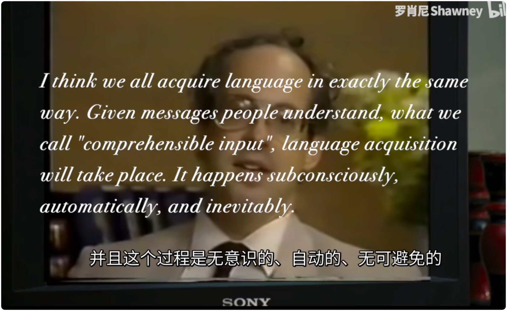
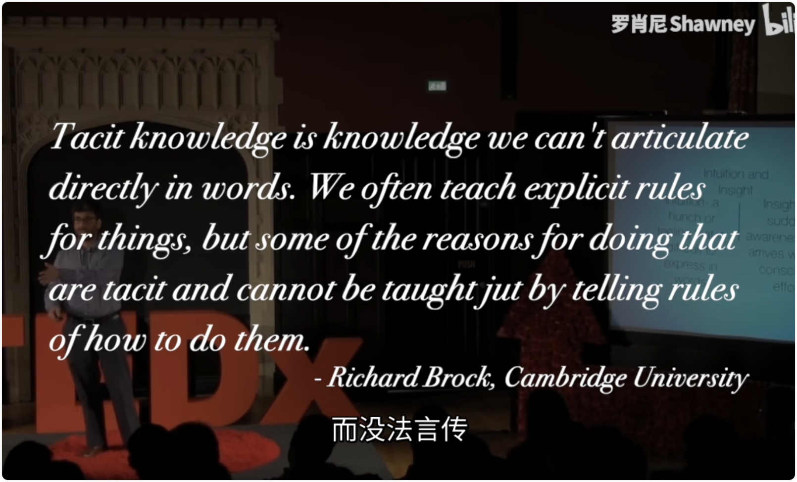

## ▲ 【罗肖尼】如何永远学会一个单词？

*Added: 2024.03.09*

> 笔记来源：https://www.bilibili.com/festival/jzj2023?bvid=BV1ns4y1A7fj&spm_id_from=333.337.search-card.all.click

Form-meaning connection knowledge (词形-意义联系知识)

### 第一章 - 三个难题

#### 词汇难题之一 - 任意符号难题

The arbitrary sign problem of vocabulary acquisition

短期记忆（working memory）

...public enemy number one of language students if forgetting.  -*Lomb Kato, Polyglot: How I learn Languges*

语言学习者们的头号公敌，便是遗忘。

词条式学习（Definition / Glossary Learning) 

One forgets words as one forgets names. One's vocabulary needs constant fertilizing or it will die. 
(我们忘记单词就如同我们忘记名字，我们的词汇需要被常常回顾，否则它们便会死去。）

Words have a habit of changing their meaning from one context to another. -*William Labov, The Boundaries of Words and Their Meanings* （单词们经常换一个语境就改变一次意思）

Beware of the dog 当心恶犬

dog-eared 书页的折角

dog tired 疲惫至极 

bot dog 一种食物 

top dog 优胜者

dirty dog 卑鄙小人

going to the dogs 情况持续变坏

putting on the dog 大摆排场

| take after my dad               | 和我爸爸长得像     |
| ------------------------------- | ------------------ |
| take apart the TV               | 把电视机拆开       |
| take down my address            | 记录我的地址       |
| take in a friend                | 把朋友接进家里住   |
| take off my shoes               | 脱掉我的鞋子       |
| plane takes off                 | 飞机起飞           |
| take to the streets             | 上街游行           |
| take on a project               | 开始一个新项目     |
| take on the enemy               | 与敌人短兵相接     |
| here is my take one the problem | 我对这个问题的看法 |
| take up tennies                 | 开始学习网球       |
| take up half of the room        | 占了半间屋子       |
| take over the opponent          | 超越了对手         |
| takeaway of the lesson          | 本堂课程的要点     |
| burger for takeaway             | 点汉堡包外卖       |
| take me for an idiot            | 把我当个白痴       |

Multi-word Combination（多词组合语 (即：固定搭配)）

#### 词汇难题之二 - 宽度问题

The Width Problem of Vocabulary Acquisition

#### 词汇难题之三 - 深度难题

The Depth Problem of Vocabulary Acquisition

词形变化（morphological relationships） 

句法规则（syntactic frame）

搭配可能 （collocational potentials） 

适用场合（linguistic register） 

词义特征（semantic values）

Third, we must honor the dictum that a dictionary is a reference work. It is meant to be used by a reader to heIp with unknown words in an otherwise meaningful text, or by a writer who knows full well what she is trying to say. For these purposes, a good dictionary is a valuable tool. But, **a dictionary is not designed to be a stand-alone source of meanings for words that are isolated from a comprehensible context**, and it serves this purpose poorly. **Therefore, we must abandon the belief in contextless vocabulary building programs in which students try to memorize the definitions of lists of unrelated words**. 
(第三，我们必须遵守词典的原则，即词典是一本参考书。它旨在帮助读者在其他意义明确的文本中理解不熟悉的单词，或帮助作家明确自己想要表达的内容。对于这些目的来说，一本好的词典是一个宝贵的工具。但是，**词典并不是旨在作为孤立于可理解上下文之外的单词的含义的独立来源**，在这方面它的作用并不好。**因此，我们必须放弃对无上下文词汇构建程序的信仰，这种程序中学生试图记住一系列无关单词的定义**。)  

——*参考文献：Anderson, R. C., ＆ Nagy, W. E. (1992). The vocabulary conundrum. American Educator: The Professional Journal of the American Federation of Teachers, 16(4).*

### 第二章 - 语境的力量 (Chapter Two - The power of Context)

simplicity is the ultimate sophistication 大道至简

"... words cannot be removed from their contexts. One can only understand them — and should only learn them - in their contexts."  —— *Lomb Kato, Polyglot: How I learn languages* (所以我们 "不能把词汇从它们的语境中剥离出来"，一个人只有在语境中才能够理解词语。）

Contextual Learning (语境式学习）

词条式学习

Comprehensible Input (可理解输入)

#### 词汇学习公式

#### 语言传奇 

### 第三章 - 一百万词

#### 半页纸

#### 后记 - "书的皱纹"

## ▲英语学习的认知——总述·阅读篇

> 笔记来源：https://www.bilibili.com/video/BV1aD4y127GE/?spm_id_from=333.1007.0.0&vd_source=e92153ec1930505e455be52646a78b7c

显性知识（Explicit Knowledge）

Free voluntary(`/ˈvɑːləntɛri/`) reading (FVR), a very pleasant form of comprehensible input, is the source of out reading comprehension, nearly all of our educated vocabulary, our ability to write with good styles, to understand and use complex grammar, and this seems to be true across languages.

## ▲ 英语学习的认知——听说篇

> 笔记来源：https://www.bilibili.com/video/BV1tf4y1s7NN/?spm_id_from=autoNext&vd_source=e92153ec1930505e455be52646a78b7c

I'm not opposed to speaking. I think when students speak, it's fine. But what counts in speaking is not what you say, but what the other person says to you. What counts is the input that you can stimulate form other people. So I'm favor of student speaking, but we have to understand it makes a helpful but indirect contribution to language acquisition. 

