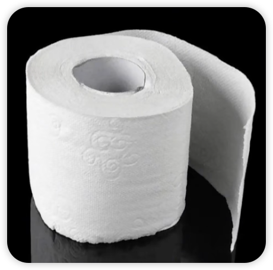

# 英语短语词组


## ▲ 量词

### 1. 英语常用量词

> **量词**（英语： measure word，quantifier）[[1\]](https://zh.wikipedia.org/zh-cn/量词#cite_note-1) 又称 **分类词**（ classifier）、 **单位词** [[2\]](https://zh.wikipedia.org/zh-cn/量词#cite_note-2)，是词的一种分类，用来区分由 [可数名词](https://zh.wikipedia.org/wiki/可数名词)指代的不同事物。
>
> 分类词常用于名词[计数](https://zh.wikipedia.org/wiki/计数)或特指的情况（例如与[数词](https://zh.wikipedia.org/wiki/數詞)或[指示词](https://zh.wikipedia.org/wiki/指示词)连用的时候），例如[汉语](https://zh.wikipedia.org/wiki/汉语)中 “三个人” 的 “个”，“两头牛” 的 “头”。分类词不应与[名词类别](https://zh.wikipedia.org/wiki/名詞類別)混淆，后者通常不是根据词的含义分类，而是根据诸如[词法](https://zh.wikipedia.org/wiki/词法学)来分类。
>
> - 笔记来源：https://zh.wikipedia.org/zh-cn/%E9%87%8F%E8%AF%8D

表格笔记来源：[一阵风，一束光，一群鱼用英语怎么说？](https://www.bilibili.com/video/BV1W1421t7SQ/?spm_id_from=333.1007.top_right_bar_window_history.content.click&vd_source=e92153ec1930505e455be52646a78b7c) 和 [一瓣蒜，一粒米，一盒牛奶用英语怎么说？](https://www.bilibili.com/video/BV14UiwevEvm/?spm_id_from=333.999.0.0&vd_source=e92153ec1930505e455be52646a78b7c)

| 图片                                                         | 量词    | 例句                                                         |
| ------------------------------------------------------------ | ------- | ------------------------------------------------------------ |
|  | **beam**    | This is a **beam** of light. 一**束**光。                    |
|  | **ray**     | This is a **ray** of sunshine. 一**缕**阳光。                |
|  | **bottle**  | This is a bottle of water.  这是一**瓶**水。                 |
|  | **handful** | This is a **handful** of nuts. 一**把**坚果                  |
|  | **bar**     | Thi is a **bar** of soap. 一**块**肥皂                       |
|  | **roll**    | Thi is a **roll** of toilet paper. 一**卷**厕纸。            |
|  | **school**  | Thi is a **school** of fish. 一**群**鱼<br /><br />a school of whales. 一群鲸鱼 |
|  | **flock**   | This is a **flock** of birds. 一**群**鸟                     |
|  | **head** | This is a **head** of garlic. 一**头**蒜。 |
|  | **clove** | This is a **clove** of garlic. 一**瓣**蒜。 |
|  | **bunch** | This is a **bunch** of grapes. 一**串**葡萄。 |
|  | **can** | This is a **can** of coke. 一**听**可乐。 |
|  | **bar** | This is a **bar** of chocolate. 一**块**巧克力。 |
|  | **grain** | This is a **grain** of rice. 一**粒**米。 |
|  | **carton** | This is a **carton** of milk. 一**盒**牛奶。 |
|  | **drop** | This is a **drop** of water. 一**滴**水。 |
|  | **loaf** | This is a **loaf** of bread. 一条**面包**。 |
| 从这开始来自 ChatGPT 4o 扩充 | **cup** | This is a **cup** of coffee. 一**杯**咖啡。 |
|  | **slice** | This is a **slice** of bread. 一**片**面包。 |
|  | **piece** | This is a **piece** of cake. 一**块**蛋糕。 |
|  | **pair** | This is a **pair** of shoes. 一**双**鞋。 |
|  | **pinch** | This is a **pinch** of salt. 一**撮**盐。 |
|  | **set** | This is a **set** of tools. 一**套**工具。 |
|  | **spoonful** | This is a **spoonful** of sugar. 一**匙**糖。 |
|  | **tube** | This is a **tube** of toothpaste. 一**管**牙膏。 |
|  | **pack** | This is a **pack** of cards. 一**副**牌。 |
|  | **jar** | This is a **jar** of jam. 一**罐**果酱。 |


## ▲ 结构

### ★  too...to... 句型 （太...而不能...）

> 笔记来源：https://www.en998.com/gs/writing/020191022.html

#### 1. 这个结构的具体格式是：**too adj^(1)^. to do sth**.

- (1) adjective `/ˈædʒəktɪv/` n. 形容词。

"to do sth" 部分其实就是不定式。所以这个句式的具体格式也可以说是 **"too adj. + 不定式"**。

这个结构的译文一般是 **"太……而不能……"** 或  **"太……，无法……"**，但具体译文可以根椐实际情况和中文的语言习惯灵活变通。下面是两个简单的例句。

> He is too weak to stand because of fever. 由于发烧，他太虚弱了而站不起来。
>
> Susan is too young to go to school. 苏珊年纪还太小，不能去上学。 

#### 2. 除了用于形容词搭配之外，还可与 adv^(2)^ (副词) 搭配，如：

- (2) adverb `/ˈædvɜːrb/` n. 副词。

> He moved too slowly to avoid being hurt. 他移动得太慢，无法避开伤害。
>
> She jumped too lowly to reach the ceil. 她跳得太低，无法触及天花板。

#### 3. 这个句型的不定式部分还可以有逻辑主语。逻辑主语的不定式格式为 for sb. to do sth., 所以这种情况下格式变为 too adj. for sb. to do sth.

> The situation is too complex for her to explain. 情况太复杂了，她无法解释。
>
> Chinese are too difficult for them to learn. 中文对他们来说太难学了。

#### 4. 这个句型的不定式部分还可以使用被动语态，如：

> Atoms are too small to be seen. = Atoms are too small to see. 原子太小，看不见。
>
> *注意上面的句子中，主语 atoms 必需是 see 的这个动作的承受者。如果主语是施动者，则不能用不定式的被动语态*。

#### 5. 需要注意的是，这个结构并不都是表示“太……而不能”的意思。在某种情况下，这个句型其实表示的是肯定的意思。

##### (1) 形容词为 ready, anxious, willing 等描绘心情、态度、倾向等时，如：

> He was too anxious to make money. 他急于赚钱。
>
> She was too ready to provide them with these services. 她太乐意为他们提供这些服务了。

##### (2) too 前边有否定词 never, not 等的时候，如：

> The problem will not be too difficult to solve. 这个问题不会太难解决。
>
> One is never too old to learn. 活到老学到老。


## ▲ 词组

### ★ "更不用说"、"更别提" 英文怎么说

> 笔记来源：https://www.en998.com/gs/writing/020191025.html

英文中表示“更不用说”，“更别提”的常用短语有: **let alone**, **much less**, **still less** 等。

| 短语                       | 英文           |
| -------------------------- | -------------- |
| “更不用说”，<br />“更别提” | **let alone**  |
|                            | **much less**  |
|                            | **still less** |

“更不用说”表示的是一种递进关系。它所表达的意思是：因为前一件事不是真的或可能的，下一件事也不可能是真的或可能的。所以这种句子通常主句会是否定句，如：

> He can **not** speak English, **let alone** French. 他连英语都不会，更不用说法语了。
>
> There **wasn't** enough food for them, **let alone** the captives. 他们当时没有足够的食物，更不用说俘虏了。

当我们说否定的时候，不一定非要是not, 一些表示否定的词如 hardly, barely, never 也表达否定的意思，如：

> He can **hardly** run a mile, **let alone** the marathon. 他连一英里都跑不了，更别提马拉松了。

####  1. let alone 可以看作是一个**副词短语**，后边可以跟**动词**或**名词**。下面说说 let alone 的具体用法。

##### (1) let alone 后可以跟动词。

动词的时态要根据主句的动词时态而定。如果主语的动词是原形，则 let alone 后边的动词也采用原形。但如果主句的动词时态是过去式或完成时，则 let alone 后边的动词要使用过去式，如：

> He can hardly go out, **let alone** take a trip. 他几乎不出门，更何况是去旅行。
>
> I haven't decided on the menu yet, **let alone** bought the food. 我还没拟定好菜单，更不必说买好食物了。

##### (2) let alone 后边也可以跟名词，如：

> We fear no death, **let alone** difficulties. 我们死都不怕，何况困难。

#### 2. much less, still less

much less, still less 与 let alone 的用法类似。

我们知道 much less 有"少很多" 的意思，如：

> Susan eats much less food, because she is much older now. (苏珊吃的食物少很多，因为她现在年龄老多了。)

下边举几个 much less 译为“更不用说”的例子。

> He hasn't enough money for food, **much less** amusements. 他连吃饭的钱都不够，更不用说娱乐了。
>
> She is too shy to talk to a man, **still less** speak to a stranger. 他连和一个男人说话都觉得害羞，更别提要和一个陌生人讲话。

#### 3.  还要提到一个 not to mention 的短语。

==**not to mention**== 这个短语也可以表达 **"更不用说"** 的意思。而且其主句常使用肯定句，意思与 let alone 稍有不同。如：

>  He has a few houses in the central city, **not to mention** his huge deposit. 他在中心城市有几栋房子，更不用说他的巨额存款了。


### ★ Walk 常见词组

```md
Add: 2024.08.14
Answer: ChatGPT 4o
```

| 单词         | 美式发音   | 词性 + 汉语释义                                    |
| ------------ | ---------- | -------------------------------------------------- |
| walk away    | `/wɔːk əˈweɪ/`  | v. 走开；离开（某事）<br>n. （比赛中）不战而胜   |
| walk off     | `/wɔːk ɒf/`     | v. 走掉；摆脱（不快或疼痛）                         |
| walk out     | `/wɔːk aʊt/`    | v. 罢工；离开（会议、演出等）抗议                  |
| walk through | `/wɔːk θruː/`   | v. 排练；练习                                     |
| walk into    | `/wɔːk ˈɪntu/`  | v. 意外碰到；轻松找到（工作等）                    |
| walk over    | `/wɔːk ˈoʊvər/` | v. 轻松战胜（某人）；欺负                         |
| walk up      | `/wɔːk ʌp/`     | v. 走近；走到（某人或某物）前                      |


### ★ ever 常见词组

```md
Add: 2024.08.20
Source: LDOCE 6 & GPT 4o
Answer: ChatGPT 4o
```


| 单词          | 美式发音             | 词性 + 汉语释义              |
|---------------|------------------|------------------------|
| ever          | `/ˈevər/`        | adv. 任何时候；曾经    |


| 短语                  | 英式发音          | 短语 + 汉语释义                                          |
|---------------------|-------------------|---------------------------------------------------------|
| hardly ever         | `/ˈhɑrdli ˈɛvər/` | 几乎从不                                                |
| never ever          | `/ˈnɛvər ˈɛvər/`  | 绝对不；从不                                             |
| for ever            | `/fɔr ˈɛvər/`     | 永远                                                    |
| as ever             | `/æz ˈɛvər/`      | 同往常一样；一如既往                                     |
| ever since          | `/ˈɛvər sɪns/`    | 从…以后一直                                             |
| ever after          | `/ˈɛvər ˈæftər/`  | 从此以后                                                 |
| hotter/colder/better etc than ever | `/ˈhɒtər/ˈkoʊldər/ˈbɛtər/ˈɛt ˈsɛt/ðæn ˈɛvər/` | 比以往任何时候都更热/冷/好等           |
| as friendly/cheerful/miserable etc as ever | `/æz ˈfrɛndli/ˈʧɪrfəl/ˈmɪzərəbəl/ˈɛt ˈsɛt/æz ˈɛvər/` | 与往常一样友好/快乐/痛苦等         |
| ever so cold/wet/nice etc | `/ˈɛvər soʊ kəʊld/wɛt/naɪs/ˈɛt sɛt/` | 非常冷/湿/好等                    |
| ever such           | `/ˈɛvər sʌtʃ/`    | 非常；很                                                  |

| 短语                             | 英式发音                           | 短语 + 汉语释义                          |
| -------------------------------- | ---------------------------------- | ---------------------------------------- |
| ever-increasing/ever-present etc | `/ˈɛvər ɪnˈkrisɪŋ/ˈɛvər ˈprɛzənt/` | 不断增加的/始终存在的等                  |
| Yours ever/Ever yours            | `/ˈjʊrz ˈɛvər/ˈɛvər jʊrz/`         | 你永远的（书信末尾的套语）               |
| if ever there was one            | `/ɪf ˈɛvər ðɛr wəz wʌn/`           | 确实（用于表示某人或某物是个典型的例子） |


### ★ 剪指甲，擤鼻涕，挤痘痘用英语怎么说？

```md
Source: https://www.bilibili.com/video/BV1WE4m1d7YN/?spm_id_from=333.1007.tianma.3-1-7.click&vd_source=e92153ec1930505e455be52646a78b7c
Add: 2024.08.10
```

| 英文表达           | 中文表达 | 备注 |
| ------------------ | -------- | ---- |
| cut one's nail     | 剪指甲   |      |
| blow one's nose    | 擤鼻涕   |      |
| pick one's nose    | 抠鼻屎   |      |
| wiggle one's hips  | 扭屁股   |      |
| pop one's pimple   | 挤痘痘   |      |
| rub one's eyes     | 揉眼睛   |      |
| scratch one's head | 挠头     |      |
| pick one's ear     | 掏耳朵   |      |
| grind one's teeth  | 磨牙     |      |
