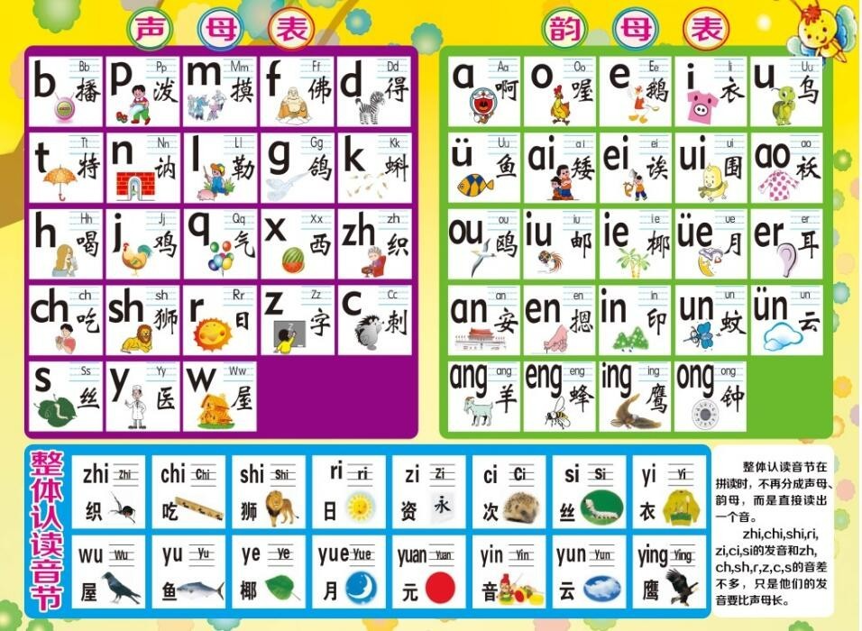
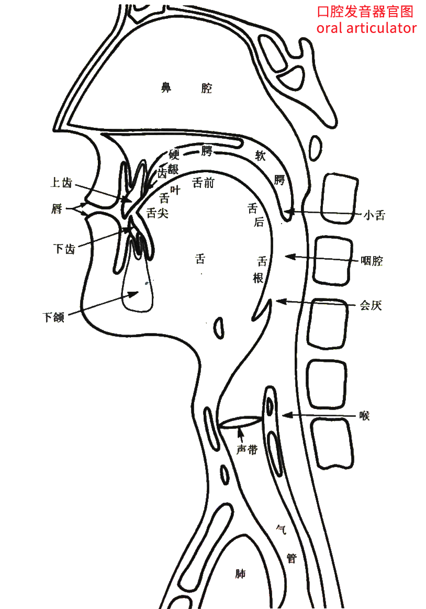
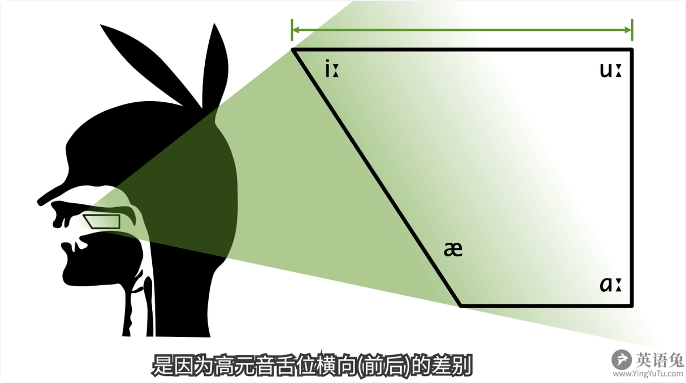
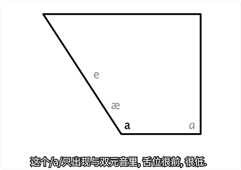

# 英语音标


## Table of contents
1. 英语音标是什么?
2. 48 个英语国际音标表及其分类表
3. 英语音标的体系(或种类)
4. 如何正确学习英语发音?
5. 48 个英语国际音标详细发音教程
    + 5.1 元音发音及口型详述:
    + 5.2 辅音发音及口型详述:


## New words
- **phonetic /fəˈnetɪk/** 
```css
├── adj (adjective)
│   ├── (1) 语音的 (relating to the sounds of human speech)
│   │   ├── English phonetic pronunciation. 英语语音的(音标的)发音
│   │   ├── The phonetic spelling of the word. 那就是单词的读音.
│   ├── (2) 音标的
│   │   ├── a phonetic alphabet 音标
│   │   ├── phonetic symbols 音标符号
│   │   ├── phonetic symbol. 音符, 音标; 语音符号.
│   │   ├── phonetic notation. 注音.
│   │   ├── international phonetic signs [symbols]. 国际音标
```
- **alphabet ['ælfə'bɛt] --n.字母表, 初步, 入门**
    + Find missing letters in the alphabet sequence. 找到字母序列中缺失的字母.

- **pronunciation [prə,nʌnsɪ'eɪʃ(ə)n] (spell: pronun-ciation)**
  **--n.发音, 读音, 读法**
    + What is the pronunciation of this word? 这个单词的发音是什么？
    + Yes, that's good for our pronunciation too. 是的, 这有助于我们发音. 
    + What about reading aloud to practice pronunciation? 
      大声朗读来练习发音怎么样？

- **phoneme ['fəʊniːm]/['fonim] --n.音素, 音位**
    + One integral aspect of language is the phoneme.
      语言的一个不可或缺的方面是音素.

- **phone [fəun]/[fon] --n.电话; 音素. --vt&vi.打电话.**

- **syllable ['sɪləb(ə)l] --n.音节.**
    + 'Simply' is a word of two syllables. simply 是有 2 个音节的字.
    + Ran, teach-, mov-. These are the stressed syllables.
      这些都是重度的音节.
    + How many syllables should this word have?
      这个词有多少个音节?

- **stress [stres] --n.压力; 紧张; 强调; 重读. --vt.强调; 使紧张; 用重音读**
    + How much stress(n) can the walls bear? 这墙能支撑多大的压力?
    + suffer from the stress(n) of city life.
      遭受都市生活的压力.
    + stress(n) accent. (英语等的)重音
    + Where do you place the stresses(n) in this sentence?
      在这个局子里, 你在哪些地方念重音?
    + He stressed(vt) the importance of health. 他强调健康的重要性.
    + a stressed(vt) syllable. 重音节.

- **contraction [kən'trækʃ(ə)n] --n.收缩; 缩写; 紧缩**
    + So, let's look at some of these contractions.
      那么, 让我们看一些这类的缩略词.

- **accent ['æks(ə)nt] --n.口音, 腔调; 重音; 强调, 重点;**
    + the accent is on participation. 重要的是参与.
    + The accent of the report is on safety. 报告的重点是安全问题. 
    + Please accent the first. 请重度第一个音节.

- **monophthong ['mɒnəfθɒŋ]/['mɑnəfθɔŋ] --n.单元音**
    + a monophthong 单元音
    + English monophthong. 英语单元音.

- **diphthong ['dɪfθɒŋ] --n.双元音**
    + a diphthong. 双元音
    + Is a diphthong, and therefore is not divide. 是双元音, 所以不能分开.

- **consonant ['kɒns(ə)nənt] --n.辅音; 子音. --adj.一致的; 符合的.**
    + a consonant letter. 子音字母.
    + Almost every language has an O vowel, a K consonant, and an
      A vowel. 几乎每一种语言都有一个 O 元音, 一个 K 辅音和一个 A 元音.

- **vowel ['vaʊəl] --n.元音; 母音. --adj.元音的**
    + Each language has a different vowel system. 每种语言都有不同的元音系统.


## Content

### 1. 英语音标是什么?

音标, 是学习一门语言的入口.  

汉语有汉语拼音, 日语有五十音图, 法语有音素......而英语, 当然就是英语音标了.

想要系统的学习英语, 音标可以说是必经之路. 而且是第一扇门.

**那么英语中的<strong style="color:#e3772a">音标</strong> (Phonetic $\color{red}{^*}$ symbol) 是什么呢?**

**A:** <strong style="color:#e3772a">音标</strong>是记录 <strong style="color:#e3772a">音素(1) </strong>的符号, 是 `音素` 的标写(标准书写)符号, 它的制定原则是: 一个音素只用一个音标表示, 但一个音标并不是只能表示一个音素.

+ (1) <strong style="color:#e3772a">音素</strong>(phoneme$\color{red}{^*}$)是什么? <br/>
   答: 音素: 是最小的<span style="color:#e3772a">语音</span>单位. (**`音素`**是根据 `语音(2)` 的自然属性划分出来的最小单位.) <br/>
   通俗点讲就是人耳能听清楚, 并能加以区分的一段连续的最小声音片段. (来源: [知乎网友回答](https://www.zhihu.com/question/24153538)). <br/>
   音素并一定是英语音素, 还有其它语言的音素, 比如粤语音素, 汉语音素等... 音素还有另一个名称 `音位`, <br/>
   通过最基础的字符, 代表最基础的发音,目的是为了便于传播和学习 ([来源文章(1)](https://www.zhihu.com/question/274228630)). (提示: `音位` 的概念省略, 若想了解请自行 `Google`.)
  
+ (2) <strong style="color:#e3772a">语音</strong>(phone$\color{red}{^*}$)
  是什么概念? <br/>
  答: 语言学中 `语音` 可以被认为是用来表示语言的发声符号, 也可以被定义为是人的发声器官所发出来的具有一定意义的声音.([维基百科-语音](https://zh.wikipedia.org/zh-hant/%E8%AA%9E%E9%9F%B3))
  

**综合概述:** 人们为了表示器官发出来的具有一定意义的声音(即:`语音`), 发明了一种用来表示语音的最小单位(即:**`音素`**), 而`音标`就是用来记录(一个或多个)音素的书写符号.

**更多解释**: 实际上`音标`和`音素`是**包含和被包含的概念. 音素一定是音标, 但音标不一定是音素. 音标是一个大概念, 而音素只是最小的语音单位.**

+ 例如: big 的音标 `[bɪɡ]` 由音素 `/b/`, `/ɪ/`, `/g/` 组成; 
+ 再如: `/b/` 是音素也是音标, 但单词 dig 的发音 `[dɪɡ]`  则一般认为是音标, 而不会说音素. 记住, 音素是最小的发音单位, 很明显 `/dɪɡ/` 不是最小单位, 而是一个组合体. ([来源文章(1)](https://www.zhihu.com/question/274228630)).

虽然上一段我们说音标是包含音素的一个更大概念, 但我们常说的 **48 个英语国际音标**
是**等于音素**的, 因为此时的音标也是指最小的语音单位.

一个音素只用一个音标表示, 而一个音标并不只表示一个音素 (双元音就是由 2 个音素组成的, 相对于单元音来说. tip: 单元音/双元音,见下面讲解.)


**上面讲完了音素和音标, 我们接着来了解一下 `英语国际音标`**.

我们经常说的英语国际音标其实是狭义上的国际音标. 也可以理解为 `国际音标(1)` 应用在英语中的一般情况.
+ (1) **`国际音标`**(International  Phonetic$\color{red}{^*}$ Alphabet$\color{red}{^*}$, 缩写: IPA): 是一套用来标音的系统, 它有一百多个符号, 以拉丁字母为基础, 作为口语声音的标准化表示方法. 它可以用来表示任何语言. `IPA` 我们经常称为 **广义上的国际音标.**

英语国际音标的数量有 2 种说法: 一种说有**48 个**, 一种说有**44 个**. 那么到底英语国际音标有多少个呢?
+ 传统语音学认为: 英语国际音标一共有 48 个音素. 一个音素对应一个音标, 所以共有 48 个国际音标. 这也是我们国内更加熟知的一种音标体系.
+ 现代语音学认为: 英语国际音标有 44 个音素. 因为现代语音学认为 `/tr/, /dr/, /ts/, /dz/` 这四个不是独立的音素, 而是辅音连缀.

### 2. 48 个英语国际音标表及其分类表

经过上面 `1. 英语音标是什么?` 的讲解后, 我们对英语的`音标`应该已经有所了解; 接下来看一下英语国际音标及其分类.

现在国内的英文教育认为,一共有 **48 个(英语)国际音标** (Tip: 也即是 **48 个音素**, 因为一个音素对应一个音标).

#### 2.1 48 个英语国际音标表

下面是 48 个英语国际音标表

<table style="letter-spacing:1px;">
    <tr>
        <td rowspan="6"> 国际音标表 </td>
        <td rowspan="3">元音 (20 个)</td>
        <td rowspan="2" colspan="2">单元音</td>
        <td>短音</td>
        <td style="color:red;">/ɪ/</td>
        <td style="color:red;">/ʌ/</td>
        <td style="color:red;">/ʊ/</td>
        <td style="color:red;">/e/</td>
        <td style="color:red;">/æ/</td>
        <td style="color:red;">/ə/</td>
        <td style="color:red;">/ɒ/</td>
        <td></td>
        <td></td>
        <td></td>
    </tr>
    <tr>
        <td>长音</td>
        <td style="color:red;">/iː/</td>
        <td style="color:red;">/ɑː/</td>
        <td style="color:red;">/uː/</td>
        <td style="color:red;">/ɜː/</td>
        <td style="color:red;">/ɔː/</td>
        <td></td>
        <td></td>
        <td></td>
        <td></td>
        <td></td>
    </tr>
    <tr>
        <td colspan="3">双元音 (8 个)</td>
        <td style="color:red;">/eɪ/</td>
        <td style="color:red;">/aɪ/</td>
        <td style="color:red;">/ɔɪ/</td>
        <td style="color:red;">/aʊ/</td>
        <td style="color:red;">/əʊ/</td>
        <td style="color:red;">/ɪə/</td>
        <td style="color:red;">/eə/</td>
        <td style="color:red;">/ʊə/</td>
        <td></td>
        <td></td>
    </tr>
    <tr>
        <td rowspan="4">辅音 (28 个)</td>
        <td colspan="3" style="text-align:center;">清辅音</td>
        <td style="color:red;">/p/</td>
        <td style="color:red;">/t/</td>
        <td style="color:red;">/k/</td>
        <td style="color:red;">/f/</td>
        <td style="color:red;">/θ/</td>
        <td style="color:red;">/s/</td>
        <td style="color:red;">/ʃ/</td>
        <td style="color:red;">/tʃ/</td>
        <td style="color:red;">/tr/</td>
        <td style="color:red;">/ts/</td>
    </tr>
    <tr>
        <td colspan="3" style="text-align:center;">浊辅音</td>
        <td style="color:red;">/b/</td>
        <td style="color:red;">/d/</td>
        <td style="color:red;">/ɡ/</td>
        <td style="color:red;">/v/</td>
        <td style="color:red;">/ð/</td>
        <td style="color:red;">/z/</td>
        <td style="color:red;">/ʒ/</td>
        <td style="color:red;">/dʒ/</td>
        <td style="color:red;">/dr/</td>
        <td style="color:red;">/dz/</td>
    </tr>
    <tr>
        <td colspan="3" style="text-align:center;">单个辅音</td>
        <td style="color:red;">/h/</td>
        <td style="color:red;">/m/</td>
        <td style="color:red;">/n/</td>
        <td style="color:red;">/ŋ/</td>
        <td style="color:red;">/l/</td>
        <td style="color:red;">/r/</td>
        <td style="color:red;">/j/</td>
        <td style="color:red;">/w/</td>
        <td></td>
        <td></td>
    </tr>
</table>
48 个国际音标根据发音特点可以分为 2 类, 即:

##### (1) **`元音(20 个)`**: 又称`母音`, 是音素的一种, 与`辅音`相对.

在发音过程中由气流通过口腔而不受阻碍发出的音叫元音.

按前后分类为高, 中, 底元音.

按音节可分为`单元音`和`双元音`.

**(1.1) `单元音`:** (是指发音时舌位, 唇形, 开口度始终不变的元音, 即发音时嘴型不变.)

单元音(monophthong`[ˈmɒnəfθɒŋ]`$\color{red}{^*}$) 又称单母音, 是指未和其他元音复合的元音, 在其发音开始时及结束时的舌位大致相同.  

> 参考文章: 单元音(Wikipedia): https://www.wikiwand.com/zh-cn/%E5%96%AE%E5%85%83%E9%9F%B3

**(1.2) `双元音`:** 两个元音结合在一起发音, 之间有平滑的过渡, 也就是说, 双元音中的发音牵扯到两种不同的舌位, 并且从其中一种舌位滑动到另一舌位.

##### (2) **`辅音(28 个)`**: 又称`子音`, 是音素的一种, 与元音相对.

辅音是指发音时气流受到发音器官(如舌头, 牙齿)的各种阻碍而发出的音.

在语音学中, 将发音时声带振动的音称为**浊音**(又称**有声音**, 英语: voiced sound),

声带不振动的音称为**清音**(又称**无声音**, 英语: voiceless sound).

辅音 (子音) 有清有浊.

在英语的`辅音`中, 分为`清辅音`和`浊辅音`.

即发音时声带不振动, 送气的叫清辅音, 也就是说, 发清辅音时不出声; 发音时声带振动, 不送气的叫浊辅音, 发浊辅音时出声. 汉语拼音中的声母没有清浊辅音之分, 发音时都出声.

> 此段笔记来源: 清浊音(wikipedia): https://zh.wikipedia.org/wiki/%E6%B8%85%E6%BF%81%E9%9F%B3

**Notice**: `元音`和`辅音`是整个英语学习中最重要的一部分内容, 也是最基础的一部分内容. 所有`音节`所有单词都是由`元音`和`辅音`组成的.

#### 2.2 48 个音标的分类表

接下来是 **48 个音标的分类表** (tip: 需要了解有这种分类, 因为有些讲解音标的书籍/视频会用到这种分类.)

<table style="letter-spacing:1px;"> 
    <tr>
        <td rowspan="14">音标分类表</td>
        <td rowspan="5">元音 (20 个)</td>
        <td rowspan="3">单元音 (12 个)</td>
        <td>前元音: 
            <span style="color: red">
                &nbsp; [iː], &nbsp; [ɪ], &nbsp; [e], &nbsp; [æ]
            </span>
        </td>
    </tr>
    <tr>
        <td>中元音:
            <span style="color: red">
                &nbsp; [ɜː], &nbsp; [ə]
            </span>
        </td>
    </tr>
    <tr>
        <td>后元音:
            <span style="color: red">
               &nbsp; [uː],  &nbsp; [ʊ], &nbsp; [ɑː], &nbsp; [ʌ], &nbsp; [ɔː], &nbsp; [ɒ]
            </span>
        </td>
    </tr>
    <tr>
        <td rowspan="2">双元音 (8 个)</td>
        <td>合口双元音:
            <span style="color: red">
                &nbsp; [eɪ], &nbsp; [aɪ], &nbsp; [ɔɪ], &nbsp; [aʊ], &nbsp; [əʊ]
            </span>
        </td>
    </tr>
    <tr>
        <td>集中双元音:
            <span style="color: red">
                &nbsp; [ɪə], &nbsp; [eə], &nbsp; [ʊə]
            </span>
        </td>
    </tr>
    <tr>
        <td rowspan="9">辅音 (28 个)</td>
        <td rowspan="2">爆破音</td>
        <td>清辅音:
            <span style="color: red">
                &nbsp; [p], &nbsp; [t], &nbsp; [k]
            </span>
        </td>
    </tr>
    <tr>
        <td>浊辅音:
            <span style="color: red">
                &nbsp; [b], &nbsp; [d], &nbsp; [ɡ]
            </span>
        </td>
    </tr>
    <tr>
        <td rowspan="2">摩擦音</td>
        <td>清辅音:
            <span style="color: red">
                &nbsp; [f], &nbsp; [s], &nbsp; [ʃ], &nbsp; [θ], &nbsp; [h]
            </span>
        </td>
    </tr>
    <tr>
        <td>浊辅音:
            <span style="color: red">
                &nbsp; [v], &nbsp; [z], &nbsp; [ʒ], &nbsp; [ð], &nbsp; [r]
            </span>
        </td>
    </tr>
    <tr>
        <td rowspan="2">破擦音</td>
        <td>清辅音:
            <span style="color: red">
                &nbsp; [tʃ], &nbsp; [tr], &nbsp; [ts]
            </span>
        </td>
    </tr>
    <tr>
        <td>浊辅音:
            <span style="color: red">
                &nbsp; [dʒ], &nbsp; [dr], &nbsp; [dz]
            </span>
        </td>
    </tr>
    <tr>
        <td>鼻辅音</td>
        <td>浊辅音:
            <span style="color: red">
                &nbsp; [m], &nbsp; [n], &nbsp; [ŋ]
            </span>
        </td>
    </tr>
    <tr>
        <td>舌侧音</td>
        <td>浊辅音:
            <span style="color: red">
                &nbsp; [l]
            </span>
        </td>
    </tr>
    <tr>
        <td>半元音</td>
        <td>浊辅音:
            <span style="color: red">
                &nbsp; [j], &nbsp; [w]
            </span>
        </td>
    </tr>
</table>


### 3. 英语音标的体系(或种类)

#### 3.1 英式(`DJ`)音标和美式(`KK`)音标

英语音标体系有很多种. 现今英语出版物基本上采用 2 种音标体系来标注单词的发音: 

##### (1) 英式出版物用 `DJ 音标`(Daniel Jones).

国内教学用的音标体系都是 DJ 音标, 由英国语音学家 Daniel Jones 编写, 首版发布与于 1917 年, 最后一版是 1963 年, 所以称为 **IPA63**, 目前已经基本不再使用.

后来 1988 年又由 D.J 的学生伦敦大学语音学教授 A.C.Gimson 做了修正, 1988年出版了第 14 版, 使得 DJ 音标更能代表实际发音, 称为 **IPA88**, 也是目前国际最通行的.

##### (2) 美式出版物用 `KK 音标`(John S. Kenyon & Thomas A. Knott 姓氏首字母)

**KK**音标是美国语音学家创立的标注美式英语的音标体系.

实际上这 2 种音标体系都是从广义`国际音标(IPA)`中修改变形来的.

那么`DJ 音标`和`KK 音标`有什么区别呢? 

我们下面给出 英式发音(`DJ 音标`) 和 美式发音(`KK 音标`) 的对照表:

**Note：** 英式 DJ 音标从第 1 版到第 12 版的标音规则称为 `IPA63`, 第 13 ~ 14 版的标音规则称为 `IPA88`。

<table style="text-align:center; font-size:14px; letter-spacing:1px;">
    <tr>
        <td rowspan="13"> 英式/美式发音 </td>
        <td rowspan="9">元音</td>
        <td rowspan="6">单元音</td>
        <td rowspan="3">短音</td>
        <td style="color:grey">IPA63</td>
        <td style="color:grey;">/i/</td>
        <td style="color:grey;">/ʌ/</td>
        <td style="color:grey;">/u/</td>
        <td style="color:grey;">/e/</td>
        <td style="color:grey;">/æ/</td>
        <td style="color:grey;">/ə/</td>
        <td style="color:grey;">/ɔ/</td>
        <td></td>
    </tr>
    <tr>
        <td style="color:red">IPA88<br/>(DJ)</td>
        <td style="color:red;">/ɪ/</td>
        <td style="color:red;">/ʌ/</td>
        <td style="color:red;">/ʊ/</td>
        <td style="color:red;">/e/</td>
        <td style="color:red;">/æ/</td>
        <td style="color:red;">/ə/</td>
        <td style="color:red;">/ɒ/</td>
        <td></td>
    </tr>
    <tr>
        <td style="color:green">KK</td>
        <td style="color:green;">/ɪ/</td>
        <td style="color:green;">/ʌ/</td>
        <td style="color:green;">/ʊ/</td>
        <td style="color:green;">/ɛ/</td>
        <td style="color:green;">/æ/</td>
        <td style="color:green;">/ə/</td>
        <td style="color:green;">/ɒ/</td>
        <td></td>
    </tr>
    <tr>
        <td rowspan="3">长音</td>
        <td style="color:grey">IPA63</td>
        <td style="color:grey;">/iː/</td>
        <td style="color:grey;">/ɑː/</td>
        <td style="color:grey;">/uː/</td>
        <td style="color:grey;">/əː/</td>
        <td style="color:grey;">/ɔː/</td>
        <td></td>
        <td></td>
        <td></td>
    </tr>
    <tr>
            <td style="color:red">IPA88</td>
        <td style="color:red;">/iː/</td>
        <td style="color:red;">/ɑː/</td>
        <td style="color:red;">/uː/</td>
        <td style="color:red;">/ɜː/</td>
        <td style="color:red;">/ɔː/</td>
        <td></td>
        <td></td>
        <td></td>
    </tr>
    <tr>
        <td style="color:green">KK <br/> (美式)</td>
        <td style="color:green;">/i/</td>
        <td style="color:green;">/ɑ/</td>
        <td style="color:green;">/u/</td>
        <td style="color:green;">/ɜ/</td>
        <td style="color:green;">/ɔ/</td>
        <td></td>
        <td></td>
        <td></td>
    </tr>
    <tr>
        <td rowspan="3" colspan="2">双元音</td>
        <td style="color:grey">IPA63</td>
        <td style="color:grey;">/ei/</td>
        <td style="color:grey;">/ai/</td>
        <td style="color:grey;">/ɔi/</td>
        <td style="color:grey;">/au/</td>
        <td style="color:grey;">/əu/</td>
        <td style="color:grey;">/iə/</td>
        <td style="color:grey;">/ɛə/</td>
        <td style="color:grey;">/uə/</td>
    </tr>
    <tr>
        <td style="color:red">IPA88</td>
        <td style="color:red;">/eɪ/</td>
        <td style="color:red;">/aɪ/</td>
        <td style="color:red;">/ɔɪ/</td>
        <td style="color:red;">/aʊ/</td>
        <td style="color:red;">/əʊ/</td>
        <td style="color:red;">/ɪə/</td>
        <td style="color:red;">/eə/</td>
        <td style="color:red;">/ʊə/</td>
    </tr>
    <tr>
        <td style="color:green">KK</td>
        <td style="color:green;">/e/</td>
        <td style="color:green;">/aɪ/</td>
        <td style="color:green;">/ɔɪ/</td>
        <td style="color:green;">/aʊ/</td>
        <td style="color:green;">/o/</td>
        <td style="color:green;">/ɪr/</td>
        <td style="color:green;">/ɛr/</td>
        <td style="color:green;">/ʊr/</td>
    </tr>
    <tr>
        <td rowspan="4">辅音</td>
        <td rowspan="2">清浊成对辅音</td>
        <td colspan="2">清辅音</td>
        <td style="color:red;">/p/</td>
        <td style="color:red;">/t/</td>
        <td style="color:red;">/k/</td>
        <td style="color:red;">/f/</td>
        <td style="color:red;">/θ/</td>
        <td style="color:red;">/s/</td>
        <td style="color:red;">/ʃ/</td>
        <td style="color:red;">/tʃ/</td>
    </tr>
    <tr>
        <td colspan="2">浊辅音</td>
        <td style="color:red;">/b/</td>
        <td style="color:red;">/d/</td>
        <td style="color:red;">/ɡ/</td>
        <td style="color:red;">/v/</td>
        <td style="color:red;">/ð/</td>
        <td style="color:red;">/z/</td>
        <td style="color:red;">/ʒ/</td>
        <td style="color:red;">/dʒ/</td>
    </tr>
    <tr>
        <td rowspan="2" colspan="3">其它辅音</td>
        <td style="color:red;">/h/</td>
        <td style="color:red;">/m/</td>
        <td style="color:red;">/n/</td>
        <td style="color:red;">/ŋ/</td>
        <td style="color:red;">/l/</td>
        <td style="color:red;">/r/</td>
        <td style="color:red;">/j/</td>
        <td style="color:red;">/w/</td>
    </tr>
    <tr>
        <td style="color:red;">/dr/</td>
        <td style="color:red;">/dz/</td>
        <td style="color:red;">/tr/</td>
        <td style="color:red;">/ts/</td>
        <td></td>
        <td></td>
        <td></td>
        <td></td>
    </tr>
</table>

​    

添加注释:
+ (0) 注意: 不管是英式(DJ)音标还是美式(KK)音标, 现在对于短元音 `[ɪ]`的写法都是统一的, 不是 ~~`[i]`~~ 请一定知晓. 音标 `[i]` 只出现在美式(KK)音标中, 对应的英式(DJ)音标为长元音 `[i:]` 
  
+ (1) 美式音标中摒弃了英式音标中的长元音符号m<span style="color:red;">[:]</span>, 看到音标中有
  <span style="color:red;">[:]</span>(冒号), 说明是英式音标.
  
+ (2) 英式音标中有特别的卷舌音 <span style="color:red;">[ə]</span>,而美式音标中没有, 美式音标表示卷舌音时直接加上 <span style="color:green;">[r]</span>, 如 <span style="color:green;">[ɪr], [ɛr], [ʊr]</span>


#### 3.2 `韦氏(词典)音标`

上面说了`DJ 音标`和`KK 音标`, 此处补充一个在以后学习中可能用到的`韦氏(词典)音标`.

韦氏词典所使用的标音系统通常称为 `韦氏音标`.

`韦氏音标` 是 native speaker 用的比较多的一种音标方式, 一图胜千言:


韦氏音标在我们平时查单词的英文软件中不常见, 如果你和我一样使用 "欧路词典" 的话, 你可以试下这个扩展包: 
+ 欧路词典扩展包 + 安装使用讲解.
    - 链接: https://pan.baidu.com/s/1vhSa1MhCr2bwBpw8lEhYoA
    - 提取码: gv2v
+ 各个平台的安装教程见: https://www.bilibili.com/video/BV1mb411G72E


### 4. 如何正确学习英语发音?
拼音对我们每个人而言再熟悉不过了, 我们在认识汉字之前都是先学习的汉语拼音$^{(1)}$. 现在的汉语拼音是拼读音节的过程, 就是把 `声母` 和 `韵母` 拼合并加上 `声调`. 

比如: b + à -> bà(爸);  m + ǎi -> mǎi(买);  b + àn -> bàn(办).

+ (1) 明朝(公元 1368 年)以后, 中国开始出现了用字母注音的方法, 它的出现引发了中国几百年后用字母拼音的基础.

我们都知道, 英语是一种拼音文字, 和汉语拼音有很许多相同之处, 单词的读音是由`音标`决定的, 把英语中的 `辅音` 和 `元音` 拼读在一起加上 `重音` 符号就构成了一个英语单词.

英语音标中的 **元音相当于汉语拼音中的韵母, 辅音相当于汉语拼音中的声母.** 如下图：



那么我们如何把汉语拼音与音标产生关联呢?
+ (1) 英语音标中的单元音发音找到对应的中文**【音近字】**, 即把 12 个单元音找到关联度及高的汉语拼音.
+ (2) 英语中的部分辅音和汉语拼音的部分 `声母` 相同, 找到关联点即可. 下面 `5.2 辅音发音口型介绍` 中会详细讲解.

有了汉语拼音的基础, 借助汉语拼音的知识来学习英语音标知识和单词的拼读规则, 就会减轻学习负担. 也助于提高学习英语的兴趣. 因此, 汉语拼音是学习英语音标的桥梁.

+ > 参考文章: [英语音标怎么练习？大家学习的经历是怎样的？](https://www.zhihu.com/question/19913374/answer/740176529)


### 5. 48 个英语国际音标详细发音教程
这里首先给出口腔发音图和 48 个国际音标的完整发音链接, 作为下面文章的参考.



> [(完整最新版)48个英语国际音标发音教程](https://www.bilibili.com/video/av75470686/)

#### 5.1 元音发音及口型详述:
首先我们来说一下上面 `4. 如何正确学习英语发音?` 节中提到的 **【音近字】**:

`音近字` 就是把英语音标中音节的发音对应到汉语的拼音( 即`声母`和`韵母`).

虽然这种方式感觉很不专业, 但这种方法会在你要开口读音标的时候, 首先在脑海里对音标该发一种什么 "音" 有一个具体的概念;

我们都了解不管我们用眼睛看, 耳朵听, 还是用嘴巴说, 这些外在感官都只是在执行大脑中枢处理完信息后下达的指令`(1)`;

我们用 `[i:]` 举例, 当准备开口读它之前, 我们首先应知道它的发音类似于汉语拼音韵母表中 `【i】`(亿 yì)的拉长版, 然后才是发音口型: **"发音时嘴唇微微张开, 舌尖抵住下齿, 嘴角向两边张开, 流露出微笑的表情"**, 这样我们的大脑就会下达指令, 让嘴巴按照这个口型发声, 而且这样读出来一般情况下都是正确的.

+ `(1)`: 光进入眼睛, 经过晶状体等的折射之后, 在视网膜上成像, 即光子打在了视网膜上. 视网膜上的光感受层细胞（视杆细胞和视锥细胞）中存在感光色素, 感光色素吸收光子后其结构发生改变, 而后与细胞内的一系列蛋白发生一系列作用, 最后使得细胞的膜电位发生变化, 即产生了电信号. **电信号通过神经传入大脑, 在脑中经过整合**, 人得以感知光传递的信息.  -- 作者: (知乎网友)凌峰

  参考文章: [眼睛究竟是如何是如何看到物体的？](https://www.zhihu.com/question/304731189/answer/546800419)
  

好了, 上面说了这么多, 我们先把 **20 个元音**过一遍吧.

`元音(vowel)` 是在发音过程中由气流通过口腔而不受阻碍发出的音.

**几乎所有的英文单词都含有元音, 所以发好元音非常重要.**

英语中根据单个元音发音时是否需要进行舌位唇形的变化, 把元音分为`单元音`和`双元音`.
+ 参考文章: [大概是最全的音标总结--元音部分](https://zhuanlan.zhihu.com/p/79843578)

其中`单元音`又根据发音的时长分为`长元音`和`短元音`.(Tip: 汉语拼音中的单韵母没有长短音之分.)

短元音和长元音有 5 对在发音和口型上是有相同点的,所以把有相同点的二者归为一对.

Hint: **长元音和短元音最主要的区别是舌头的位置不同, 读长音的时候, 舌头是平的,读短音的时候, 舌头略微上调.**

一般发长元音时要拉长, 超过两秒钟, 发短元音时要短促有力, 干脆利落.**

我们先来看 12 个**单元音**.
<table style="text-align:center;">
   <tr>
        <td rowspan="4">单元音</td>
        <td rowspan="2">短音</td>
        <td style="color:red">IPA88</td>
        <td style="color:red;">[ɪ]</td>
        <td style="color:red;">[ʌ]</td>
        <td style="color:red;">[ʊ]</td>
        <td style="color:red;">[e]</td>
        <td style="color:red;">[æ]</td>
        <td style="color:red;">[ə]</td>
        <td style="color:red;">[ɒ]</td>
    </tr>
    <tr>
        <td style="color:green">KK</td>
        <td style="color:green;">[ɪ]</td>
        <td style="color:green;">[ʌ]</td>
        <td style="color:green;">[ʊ]</td>
        <td style="color:green;">[ɛ]</td>
        <td style="color:green;">[æ]</td>
        <td style="color:green;">[ə]</td>
        <td style="color:green;">[ɒ]</td>
    </tr>
    <tr>
        <td rowspan="2">长音</td>
        <td style="color:red">IPA88</td>
        <td style="color:red;">[iː]</td>
        <td style="color:red;">[ɑː]</td>
        <td style="color:red;">[uː]</td>
        <td style="color:red;">[ɜː]</td>
        <td style="color:red;">[ɔː]</td>
        <td></td>
        <td></td>
    </tr>
    <tr>
        <td style="color:green">KK</td>
        <td style="color:green;">[i]</td>
        <td style="color:green;">[ɑ]</td>
        <td style="color:green;">[u]</td>
        <td style="color:green;">[ɜ]</td>
        <td style="color:green;">[ɔ]</td>
        <td></td>
        <td></td>
    </tr>
</table>
单元音具体发音讲解: 



<table>
    <tr>
        <td rowspan="2">(1.0) 短元音: <span style="color:red;">[ɪ]</span></td>
        <td>音近字:</td>
        <td style="line-height: 30px;">
          <strong>无</strong>. <br>
          不过此音标的发音要重读, 对应汉语拼音的声调是第四声. <br>
          从英语角度来说, 此音标的发音读起来像英文单词 A 的短而急促版. <br>
          <strong>Q01:</strong> 音标 <span style="color:red;">[ɪ]</span>
          到底怎么读? <br>
          <strong>A01:</strong> 总的来说, 这个音标的发音像偏短的 A (26 个英文字母的第一个)<br>
          <span style="margin-left: 30px;">而不是读成很短的 "衣" 或偏短的 "哎".</span><br>
          <strong>A02:</strong> 另一个回答见当前同级目录的另外一篇文章:
          <a href="./关于音标 [ɪ] 的读法.md">关于音标 [ɪ] 的读法.md</a> <br>
          <span style="color: grey">
            在赖世雄老师主讲的《美语音标》一书中, `[ɪ]` 的发音要诀是这样说的: <br>
            "本音标符号的发音介乎于汉语 '衣' 和 '也' 之间. 由于汉语并无此音, <br>
            故我们发此音极为困难. 请务必注意下列发音要诀:......" <br>
          </span>
          很诚实的说, 这个说法我并不认同, 因为 `也` 和 A 的发音, 从根本上就是不同的, <br>
          请自己试着读一下, 即使读的再短再急促, 它们也是 100% 不同的.
        </td>
    </tr>
    <tr>
        <td>发音口型</td>
        <td> <span style="color:green;">嘴角微微张开, 舌尖抵下齿, 舌前部抬高, 嘴形是扁平.</span></td>
    </tr>
     <tr>
        <td rowspan="2">(1.1) 长元音: <span style="color:red;">[iː]</span></td>
        <td>音近字:</td>
        <td style="line-height: 30px;">
            类似汉字 <span style="color:red;">"亿(yì)"</span> 读音的拉长版.
        </td>
    </tr>
    <tr>
        <td>发音口型</td>
        <td>
            <span style="color:green;">嘴唇微微张开, 舌尖抵住下齿, 嘴角向两边张开, <br>
            流露出微笑的表情. 与字母 E 的发音相同.</span> <br>
            Added: 长元音 `[i:]` 是紧元音, 短元音 `[ɪ]` 是松元音.
        </td>
    </tr>
     <tr>
        <td rowspan="2">(2.0) 短元音: <span style="color:red;">[ə]</span></td>
        <td>音近字:</td>
        <td style="line-height: 30px;">
            读音类似汉字 <span style="color:red;">"阿(ē)"</span>.
        </td>
    </tr>
    <tr>
        <td>发音口型</td>
        <td>
            <span style="color:green;">发音是干脆利索, 嘴唇微微张开, 舌身放平<br>
            (<span style="color:red;">不卷舌</span>), 舌中部稍微抬起,
            口腔自然放松发声.</span>
        </td>
    </tr>
     <tr>
        <td rowspan="2">(2.1) 长元音: <span style="color:red;">[ɜː]</span></td>
        <td>音近字:</td>
        <td style="line-height: 30px;">
             类似汉字 <span style="color:red;">"阿(ē)"</span> 读音的拉长版. 但没有汉语 `阿(ē)` 的嘴型张的大. <br>
             (tip: 实际上英文的发音, 大部分的嘴型都没有汉语拼音发音时嘴型张的大.)
        </td>
    </tr>
    <tr>
        <td>发音口型</td>
        <td>
            <span style="color:green;"> 发音时嘴型扁平, 上下齿微开, 舌身平放(<span style="color:red;">不卷舌</span>), 舌中部稍抬起. 
            </span>
            <br>
            例词：surgeon /ˈsɜːdʒən $ ˈsɜːr-/ n.外科医生
        </td>
    </tr>
     <tr>
        <td rowspan="2">(3.0) 短元音: <span style="color:red;">[ɒ]</span></td>
        <td>音近字:</td>
        <td style="line-height: 30px;">
            发音类似汉字 <span style="color:red;">"凹(āo)"</span>.
        </td>
    </tr>
    <tr>
        <td>发音口型</td>
        <td>
            <span style="color:green;">
                发音时口腔打开, 嘴张大, 舌头向后缩, 双唇稍微收圆.
            </span>
        </td>
    </tr>
     <tr>
        <td rowspan="2">(3.1) 长元音: <span style="color:red;">[ɔː]</span></td>
        <td>音近字:</td>
        <td style="line-height: 30px;">
            类似汉字 <span style="color:red;">"凹(āo)"</span> 的拉长版.
        </td>
    </tr>
    <tr>
        <td>发音口型</td>
        <td>
            <span style="color:green;">
                发音时双唇收得小而圆, 并向前突出, 舌身往后缩.
            </span>
        </td>
    </tr>
    <tr></tr>
     <tr>
        <td rowspan="2">(4.0) 短元音: <span style="color:red;">[ʊ]</span></td>
        <td>音近字:</td>
        <td style="line-height: 30px;">
            类似汉语拼音韵母表中的<span style="color:red;"> "【u】" </span>
            的简短急促版. 
        </td>
    </tr>
    <tr>
        <td>发音口型</td>
        <td>
            <span style="color:green;">
                嘴唇张开略微向前突出, 然后唇形稍微的收圆, 并放松些, 舌头后缩.
            </span>
        </td>
    </tr>
    <tr></tr>
     <tr>
        <td rowspan="2">(4.1) 长元音: <span style="color:red;">[uː]</span></td>
        <td>音近字:</td>
        <td style="line-height: 30px;">
            类似汉语拼音韵母表中的<span style="color:red;"> "【u】"(呜) </span>.
        </td>
    </tr>
    <tr>
        <td>发音口型</td>
        <td>
            <span style="color:green;">发音时嘴型小而圆, 微微外突, 舌头尽量后缩.</span>
        </td>
    </tr>
    <tr></tr>
     <tr>
        <td rowspan="2">(5.0) 短元音: <span style="color:red;">[ʌ]</span></td>
        <td>音近字:</td>
        <td style="line-height: 30px;">
            类似汉语<span style="color:red;"> "啊(ā)" </span>的简短急促版.
        </td>
    </tr>
    <tr>
        <td>发音口型</td>
        <td>
            <span style="color:green;">
                嘴唇微微张开, 伸向两边, 舌尖轻触下齿, 舌后部稍稍抬起.
            </span>
        </td>
    </tr>
    <tr></tr>
     <tr>
        <td rowspan="2">
            (5.1) 长元音: <span style="color:red;">[ɑː]</span>
        </td>
        <td>音近字:</td>
        <td style="line-height: 30px;">
            发音类似汉语<span style="color:red;"> "啊(ā)" </span>的拉长版.
        </td>
    </tr>
    <tr>
        <td>发音口型</td>
        <td>
            <span style="color:green;">
                发音时, 口张大, 舌身放平后缩,
                <span style="color:red;">舌尖不抵下齿(即: 舌尖离开下齿)</span>,
                <br>
                舌后部略抬起, 放松发音. 开口度比`[ʌ]`更大.
            </span>
            <br> <br>
            参考文章:
            <a href="https://zhuanlan.zhihu.com/p/39605780">
                英语48个音标发音(附详细图解)
            </a>
        </td>
    </tr>
    <tr></tr>
     <tr>
        <td rowspan="2">(6) 短元音: <span style="color:red;">[e]</span></td>
        <td>音近字:</td>
        <td style="line-height: 30px;">
            发音类似汉字<span style="color:red;"> "哎(ēi)"</span>.
        </td>
    </tr>
    <tr>
        <td>发音口型</td>
        <td>
            <span style="color:green;">嘴型扁平, 舌尖抵下齿, 舌前部稍微抬起.</span>
        </td>
    </tr>
    <tr></tr>
     <tr>
        <td rowspan="2">
            (7) 短元音: <span style="color:red;">[æ]</span> (梅花音)
        </td>
        <td>音近字:</td>
        <td style="line-height: 30px;">
            发音仍然类似汉字 <span style="color:red;">"哎(ēi)"</span>.
        </td>
    </tr>
    <tr>
        <td>发音口型</td>
        <td>
            <span style="color:green;">
                嘴张大, 嘴角尽量拉向两边, 嘴型成扁平, 舌尖抵下齿.
                <br>
                <span style="color: black;">
                注：下图 2022.10.07 添加，来自于英语兔老师的发音视频教程的 /æ/ <br/>
                音讲解视频；这里主要想比较直观的对比 /æ/ 和 /e/ 的发音嘴型差异。
                </span>
                
            </span>
        </td>
    </tr>
</table>


接着是 8 个**双元音**:

注意: 双元音由两个元音组成, 发音时由前一个元音向后一个元音滑动, 口型有变化.
前一个元音发音清晰响亮, 且时间长; 后一个元音发音模糊较弱, 且时间短.
发双元音时要尽量饱满, 而且要有滑动的过程. 

<table style="text-align:center;">
    <tr>
        <td rowspan="2" colspan="2">双元音</td>
        <td style="color:red">IPA88</td>
        <td style="color:red;">[eɪ]</td>
        <td style="color:red;">[aɪ]</td>
        <td style="color:red;">[ɔɪ]</td>
        <td style="color:red;">[aʊ]</td>
        <td style="color:red;">[əʊ]</td>
        <td style="color:red;">[ɪə]</td>
        <td style="color:red;">[eə]</td>
        <td style="color:red;">[ʊə]</td>
    </tr>
    <tr>
        <td style="color:green">KK</td>
        <td style="color:green;">[e]</td>
        <td style="color:green;">[aɪ]</td>
        <td style="color:green;">[ɔɪ]</td>
        <td style="color:green;">[aʊ]</td>
        <td style="color:green;">[o]</td>
        <td style="color:green;">[ɪr]</td>
        <td style="color:green;">[ɛr]</td>
        <td style="color:green;">[ʊr]</td>
    </tr>
</table>

+ (1) 双元音 `[eɪ]`: 由 `[e]` 和 `[ɪ]` 两个单音组成;  `[e]` 重读, `[ɪ]` 轻读, 口型从半开到合, 字母 $A$ 就发这个音.
+ (2) 双元音 `[aɪ]`: 由 `[a]` 和 `[ɪ]` ······, 前重读后轻读, 口型由开到合. 与字母 $I$ 的发音相同.
+ (3) 双元音: `[ɔɪ]`: 由 `[ɒ]` 和 `[ɪ]` ······, 前重读后轻读, 口型从开到合.
+ (4) 双元音: `[aʊ]`: 由 `[a]` 和 `[ʊ]` ······, 前重读后轻读, 口型由大到小.
+ (5) 双元音: `[əʊ]`: 由 `[ə]` 和 `[ʊ]` ······, 发音也是一个过程,口型由半开到小, 与字母 $O$ 的发音相同.
+ (6) 双元音: `[ɪə]`: 由 `[ɪ]` 和 `[ə]` ······, 前重读后轻读, 双唇始终是半开的, 很好读.
+ (7) 双元音: `[eə]`: 由 `[e]` 和 `[ə]` ······, 前重后轻, 舌端抵下齿, 双唇是半开的. 
+ (8) 双元音: `[ʊə]`: 由 `[ʊ]` 和 `[ə]` ······, ······, 双唇由收圆到半开.

> 此节音标的发音视频见: [YouTube 海伦英语-从零开始学口语03-音标发音](https://www.youtube.com/watch?v=HFH7WFnPZuU&list=PLVVQyNr_LodvcBuXAmLN4E7TnYoBSJhUj&index=3)


#### 5.2 辅音发音及口型详述:
下面是 28 个**辅音**音标的发音讲解:

<table>
    <tr>
        <td rowspan="3">辅音 (28 个)</td>
        <td rowspan="2">清浊成对辅音</td>
        <td style="text-align:center;">清辅音</td>
        <td style="color:#e37722;">[p]</td>
        <td style="color:#e37722;">[t]</td>
        <td style="color:#e37722;">[k]</td>
        <td style="color:#e37722;">[f]</td>
        <td style="color:red;">[θ]</td>
        <td style="color:#e37722;">[s]</td>
        <td style="color:red;">[ʃ]</td>
        <td style="color:red;">[tʃ]</td>
        <td style="color:red;">[tr]</td>
        <td style="color:red;">[ts]</td>
    </tr>
    <tr>
        <td style="text-align:center;">浊辅音</td>
        <td style="color:#e37722;">[b]</td>
        <td style="color:#e37722;">[d]</td>
        <td style="color:#e37722;">[ɡ]</td>
        <td style="color:#996699;">[v]</td>
        <td style="color:red;">[ð]</td>
        <td style="color:#996699;">[z]</td>
        <td style="color:red;">[ʒ]</td>
        <td style="color:red;">[dʒ]</td>
        <td style="color:red;">[dr]</td>
        <td style="color:red;">[dz]</td>
    </tr>
    <tr>
        <td style="text-align:center;" colspan="2">单个辅音</td>
        <td style="color:#e37722;">[h]</td>
        <td style="color:#e37722;">[m]</td>
        <td style="color:#e37722;">[n]</td>
        <td style="color:red;">[ŋ]</td>
        <td style="color:#e37722;">[l]</td>
        <td style="color:#e37722;">[r]</td>
        <td style="color:red;">[j]</td>
        <td style="color:#e37722;">[w]</td>
        <td></td>
        <td></td>
    </tr>
</table>

下面我们根据不同的发音技巧把辅音发音分为 3 类:

##### (1) 和汉语拼音的读音、拼写相似的有 14 个:

`[b]`, `[p]`, `[m]`, `[f]`, `[d]`, `[t]`, `[n]`, `[l]`,`[g]`, `[k]`, `[h]`, `[w]`, `[s]`, `[r]`

这些音标的发音与汉语拼音中 `声母` 表(汉语拼音见图一)的:

<span style="font-size:16px; display:block;">`b`, `p`, `m`, `f`, `d`, `t`, `n`, `l`, `g`, `k`, `h`, `w`, `s`, `r`</span>

发音相似, 只是把汉语拼音发音的尾音去掉就可以了.

比如: 我们在汉语拼音中拼 `b` 时, 其实相当于 `b` + `o`. 因此读音标 `[b]` 时, 就不读那个 `o` 音, 就可以了.

下面列出部分音标的发音详细: 
<table style="line-height:100%;">
    <tr>
        <td style="line-height:26px;">清辅音 <strong style="color:#e76a1f"> [p] </strong></td>
        <td style="line-height:26px;">发音口型:</td>
        <td style="line-height:26px;">
        发音时, 双唇紧闭, 然后突然张开, 让口腔内气流冲出, 爆破成音,
        但发音时声带不振动. <br>
        (Hint: 尝试把四指伸直并拢贴在喉咙上感觉一下, 声带是不振动的.)
        </td>
    </tr>
    <tr>
        <td style="line-height:26px;">浊辅音 <strong style="color:#e76a1f"> [b] </strong></td>
        <td style="line-height:26px;">发音口型:</td>
        <td style="line-height:26px;">
        发音时, 双唇紧闭, 然后突然张开, 让口腔内气流冲出, 爆破成音,
        发音过程中<strong>声带振动</strong>.
        </td>
    </tr>
    <tr>
        <td style="line-height:26px;">清辅音 <strong style="color:#e76a1f"> [t] </strong></td>
        <td style="line-height:26px;">发音口型:</td>
        <td style="line-height:26px;">
        发音时, 舌尖抵住上齿龈, 憋住气, 然后突然弹开舌尖, 让口腔内气流冲出,
        声带不振动. <br>
        <span style="color:red;">
            (Tip: 实际上, 除了要注意清/浊辅音发音时声带是否振动外, <br>
            这 14 个音标的发音口型几乎和汉语拼音是一样的, 所以我们并不需要特别记忆.)
        </span>
        </td>
    </tr>
    <tr>
        <td style="line-height:26px;">浊辅音 <strong style="color:#e76a1f"> [d] </strong></td>
        <td style="line-height:26px;">发音口型:</td>
        <td style="line-height:26px;">
            发声时, 舌尖抵上齿龈, 憋住气, 然后突然弹开舌尖, 让口腔内气流冲出, <br>
            爆破成音, 发音过程中<strong>声带振动</strong>.
        </td>
    </tr>
    <tr>
        <td style="line-height:26px;">清辅音 <strong style="color:#e76a1f"> [k] </strong></td>
        <td style="line-height:26px;">发音口型:</td>
        <td style="line-height:26px;">
        发音时, 舌后部抵住软腭, 憋住气, 然后突然离开, 将口腔内气流送出, <br>
        像咳嗽一样, 但声带不振动. 
        </td>
    </tr>
    <tr>
        <td style="line-height:26px;">浊辅音 <strong style="color:#e76a1f"> [g] </strong></td>
        <td style="line-height:26px;">发音口型:</td>
        <td style="line-height:26px;">
        发音时, 舌后部抵住软腭, 憋住气, 然后突然离开, 将口腔内气流送出, <br>
        爆破成音, 发音过程中<strong>声带振动</strong>.
        </td>
    </tr>
    <tr>
        <td style="line-height:26px;">清辅音 <strong style="color:#e76a1f"> [s] </strong></td>
        <td style="line-height:26px;">发音口型:</td>
        <td style="line-height:26px;">
            发声时, 双唇微微张开, 上下齿闭合, 舌头自然放松(轻触上齿龈下方), <br>
            气流从上下齿隙(xi)间送出, 声带不振动.
        </td>
    </tr>
    <tr>
        <td style="line-height:26px;">清辅音 <strong style="color:#e76a1f"> [f] </strong></td>
        <td style="line-height:26px;">发音口型:</td>
        <td style="line-height:26px;">
            发声时, 上齿轻轻接触下唇, 然后吹气, 让气流从唇齿间通过, 形成摩擦,
            声带不振动.
        </td>
    </tr>
</table>

<table>
    <tr>
        <td rowspan="2"> 浊辅音 <strong style="color:#e76a1f; text-align:center;">[r]</strong></td>
        <td style="line-height:26px;">音近字:</td>
        <td style="line-height:26px;">
            发音类似汉语的 <span style="color:red;"> "若(ruò)"</span>. <br>
            注意: [r] 是卷舌音. 发音不同于汉语拼音中的【r】(`日`).
        </td>
    </tr>
    <tr>
        <td style="line-height:26px;">发音口型: </td>
        <td style="line-height:26px;">
            发音时嘴型小而圆, 微微外突(tip: 嘴型和元音 `[u]` 相同), <br>
            <strong>舌尖上扬, 微微卷起</strong>, 声带振动, 气息由舌头两侧出来.
            <br>
            注意: 记得卷舌, 但不要太多.
        </td>
    </tr>
    <tr>
        <td rowspan="2"> 浊辅音 <strong style="color:#e76a1f; text-align:center;">[l]</strong></td>
        <td style="line-height:26px;">音近字:</td>
        <td style="line-height:26px;">
            类似拼音 <span style="color:red;"> "乐"</span>. <br>
            注意: [l] 的音最难发, 因为声音有点奇怪, 像大舌头.
        </td>
    </tr>
    <tr>
        <td style="line-height:26px;">发音口型: </td>
        <td style="line-height:26px;">
            发此音时, 双唇要张大些, 舌尖上扬抵住上齿, 振动声带, 气息由舌头两侧出来.
        </td>
    </tr>
</table>

> 详细发音演示见: [从零开始学口语 04 辅音](https://www.youtube.com/watch?v=7FLdd4zb9HY&list=PLVVQyNr_LodvcBuXAmLN4E7TnYoBSJhUj&index=4)
>
>
> 更多讲解见: 英语兔老师辅音音标视频合计 
>
> https://www.youtube.com/playlist?list=PLiRHe7F8P0-2wRRzK6nzriMTXyfRwKEG6 

##### (2) 和英语字母读音/拼写相似的有 2 个: `[z]`, `[v]`

这两个音标的发音就是把对应英文字母的发音后面的 `/i/` 音去掉就可以了.

比如英文字母 Z 的读音 `[zi:]`, 那我们读音标 `/z/` 时, 把后面的 `/i:/`去掉就可以了.
<table>
        <tr>
            <td style="line-height:26px;">浊辅音 <strong style="color:#e76a1f"> [z] </strong></td>
            <td style="line-height:26px;">
                发声时, 双唇微微张开, 上下齿闭合, 舌头自然放松(轻触上齿龈下方),
                但发音过程中<strong>声带需振动</strong>.
            </td>
        </tr>
        <tr>
            <td style="line-height:26px;">浊辅音 <strong style="color:#e76a1f"> [v] </strong></td>
            <td style="line-height:26px;">
                发声时, 上齿轻轻接触下唇, 然后吹气, 让气流从唇齿间通过, 形成摩擦,
                但声带需(要)振动.
            </td>
        </tr>
</table>

##### (3) 不规则的 (12 个)

除了上面 2 类与汉语拼音关联比较大的 16 个外, 还剩余 12 个需要我们着重来学习.

从上面的辅音表中可以看到清浊成对辅音中还剩余 5 对是不规则的, 我们一对一对看:

<table>
    <tr>
        <td rowspan="4">第 1 组</td>
        <td rowspan="2" style="color:#e76a1f; text-align:center;">
            清辅音 <strong style="color:#e76a1f"> [θ] </strong>
        <td>音近字:</td>
        <td>
            这俩的发音有点类似于 
            <strong style="color:#e76a1f;">[s]</strong> 与
            <strong style="color:#e76a1f;">[z]</strong> 的发音,
            唯一的区别就是
            <strong style="color:#e76a1f;">[θ]</strong> 
            <strong style="color:#e76a1f;">[ð]</strong> <br>
            <strong>需要咬住舌尖来发音.</strong>
        </td>
    </tr>
    <tr>
        <td>发音口型:</td>
        <td>
            舌尖微微伸出到齿外, 上下齿轻轻咬住舌尖, 然后送气,
            声带不震动. <br>
            (注意: 此音节发音的所有动作, 都在轻轻之间完成, 牙齿不能使劲咬住舌头, <br>
            如果这样便不能发音.)
        </td>
    </tr>
    <tr>
        <td rowspan="2" style="color:#e76a1f; text-align:center;">
            浊辅音 <strong style="color:#e76a1f"> [ð] </strong>
        </td>
        <td>音近字:</td>
        <td>同上.</td>
    </tr>
    <tr>
        <td>口型:</td>
        <td>
            舌尖微微伸出到齿外, 上下齿轻轻咬住舌尖, 然后送气,
            但声带需要震动.
        </td>
    </tr>
    <tr>
        <td rowspan="4">第 2 组</td>
        <td rowspan="2" style="color:#e76a1f; text-align:center;">
            清辅音 <strong style="color:#e76a1f"> [ʃ] </strong> 
        </td>
        <td>音近字: </td>
        <td>
            发音类似汉语的的 <span style="color:red;"> "诗(shī)"</span>. <br><br>
            (Tip: 注意发清辅音时是不出声的, 但汉语拼音中的声母没有清浊辅音之分, <br>
            发音时都出声. 所以, 音近字只是类似, 并不和音标的发音完全相同.)
        </td>
    </tr>
    <tr>
        <td>口型:</td>
        <td>双唇收圆并稍微突出, 舌尖接近上齿龈, 送气. </td>
    </tr>
    <tr>
        <td rowspan="2" style="color:#e76a1f; text-align:center;">
            浊辅音 <strong style="color:#e76a1f"> [ʒ] </strong> 
        </td>
        <td>音近字:</td>
        <td>发音类似读二声的 <span style="color:red;"> "日(rì)"</span>.</td>
    </tr>
    <tr>
        <td>口型:</td>
        <td>
            双唇收圆并稍微突出, 舌头稍微上卷, 舌尖抵住上齿龈, 送气, 但声带需振动. 
        </td>
    </tr>
    <tr>
        <td rowspan="4">第 3 组</td>
        <td rowspan="2" style="color:#e76a1f; text-align:center;">
            清辅音 <strong style="color:#e76a1f"> [tʃ] </strong> 
        </td>
        <td>音近字: </td>
        <td>
            发音类似汉语的的 <span style="color:red;"> "吃(chī)"</span>.
        </td>
    </tr>
    <tr>
        <td>口型:</td>
        <td>双唇略微张开突出, 舌尖抵住上齿龈, 用力吐气, 声带不振动.</td>
    </tr>
    <tr>
        <td rowspan="2" style="color:#e76a1f; text-align:center;">
            浊辅音 <strong style="color:#e76a1f"> [dʒ] </strong> 
        </td>
        <td>音近字:</td>
        <td>发音类似读二声的<span style="color:red;"> "织(zhī)"</span>.</td>
    </tr>
    <tr>
        <td>口型:</td>
        <td>双唇略微张开突出, 舌尖抵住上齿龈, 用力吐气, 声带需到振动. </td>
    </tr>
    <tr>
        <td rowspan="4">第 4 组</td>
        <td rowspan="2" style="color:#e76a1f; text-align:center;">
            清辅音 <strong style="color:#e76a1f"> [ts] </strong> 
        </td>
        <td>音近字: </td>
        <td>
            发音类似汉语的 <span style="color:red;"> "次(cī)"</span>.
        </td>
    </tr>
    <tr>
        <td>口型:</td>
        <td>
            舌尖先抵住<strong>上齿</strong>, 堵住气流,
            使气流从舌尖和齿龈间送出, 声带不震动.
        </td>
    </tr>
    <tr>
        <td rowspan="2" style="color:#e76a1f; text-align:center;">
            浊辅音 <strong style="color:#e76a1f"> [dz] </strong> 
        </td>
        <td>音近字:</td>
        <td>发音类似读二声的<span style="color:red;"> "滋(zī)"</span>.</td>
    </tr>
    <tr>
        <td>口型:</td>
        <td>
            舌尖先抵住<strong>上齿</strong>, 堵住气流,
            使气流从舌尖和齿龈间送出, 但声带需要震动.
        </td>
    </tr>
    <tr>
        <td rowspan="4">第 5 组</td>
        <td rowspan="2" style="color:#e76a1f; text-align:center;">
            清辅音 <strong style="color:#e76a1f"> [tr] </strong> 
        </td>
        <td>音近字: </td>
        <td>
            发音类似汉语的<span style="color:red;"> "戳(chuō)"</span>.
        </td>
    </tr>
    <tr>
        <td>口型:</td>
        <td>上唇收圆向前突出, 舌尖上翘抵住上齿龈, 采取发 `[r]` 的姿势.</td>
    </tr>
    <tr>
        <td rowspan="2" style="color:#e76a1f; text-align:center;">
            浊辅音 <strong style="color:#e76a1f"> [dr] </strong> 
        </td>
        <td>音近字:</td>
        <td>发音类似读二声的<span style="color:red;"> "桌(zhuō)"</span>.</td>
    </tr>
    <tr>
        <td>口型:</td>
        <td>
            ...
        </td>
    </tr>
</table>

##### (4): 另外单独的两个 `[j]`(类似拼音: `ye`) 和 `[ŋ]`(类似拼音韵母表中的: `eng`)
<table>
    <tr>
        <td rowspan="2" style="color:#e76a1f; text-align:center;">[j]</td>
        <td>音近字:</td>
        <td>
            发音类似汉语的 <span style="color:red;"> "ye(叶)"</span>.
        </td>
    </tr>
    <tr>
        <td>发音口型: </td>
        <td>
            [j] 实际上是个 "半元音", 在单词中往往听起来像 [iː] 或 [ɪ], 而且这个音还经常省略或者变音, [j] 的音标符号就是小写字母 j. <br/>
            发音诀窍: <br>
            - 舌端(尖)往上抬起向硬腭, 与元音 [iː] 的舌位相似, 但是更高一些 <br>
            - 气流从舌面和硬腭之间通过, 产生摩擦出声, 声带振动 <br/>
            - [j] 受到之后元音音素的影响, 往往听上去像元音 [iː] 或 [ɪ], 所以又称为半元音 <br/>
            详细讲解见: <a href="https://www.youtube.com/watch?v=ZAFCskj92ZQ&list=PLiRHe7F8P0-2wRRzK6nzriMTXyfRwKEG6&index=32">https://www.youtube.com/watch?v=ZAFCskj92ZQ&list=PLiRHe7F8P0-2wRRzK6nzriMTXyfRwKEG6&index=32</a>
        </td>
    </tr>
    <tr>
        <td rowspan="2" style="color:#e76a1f; text-align:center;">[ŋ]</td>
        <td>音近字:</td>
        <td>类似拼音 <span style="color:red;"> "eng"</span>.</td>
    </tr>
    <tr>
        <td>发音口型: </td>
        <td></td>
    </tr>
</table>


另外, 这里特别强调几个易发错音的几个音标:
+ (1) 三个鼻音: `[m]`/`[n]`/`[ŋ]` 都是发 "嗯" 的音, 只是嘴型大小不一样.
    - `[m]` 闭嘴鼻音. 嘴巴闭拢, 在单词开头时注意力道, 要有劲, 气息从鼻子里出来.
    - `[n]` 半张嘴鼻音. 舌尖区域抵在上齿龈出, 与`[t]`/`[d]`舌位基本一致,
      气息从鼻子里出来.
    - `[ŋ]` 需要嘴巴张的更大些. 舌头中后部抵住上颚, 气息从鼻子里出来.
+ (2) 对于这三个字母 m, n, l, 他们其实有两种发音.即放在词首与词尾发音是不同的:
    - **放在词首**: 跟我们的汉语拼音有点像, 分别读 "么", "呢", "了".  
    - **在词尾**: m, n 发音如 (1), 而 `/l/` 放在词尾发音有点难,
      需要把舌尖抵在上门牙底端, 然后自然发音, 这个发音听起来像大舌头.

