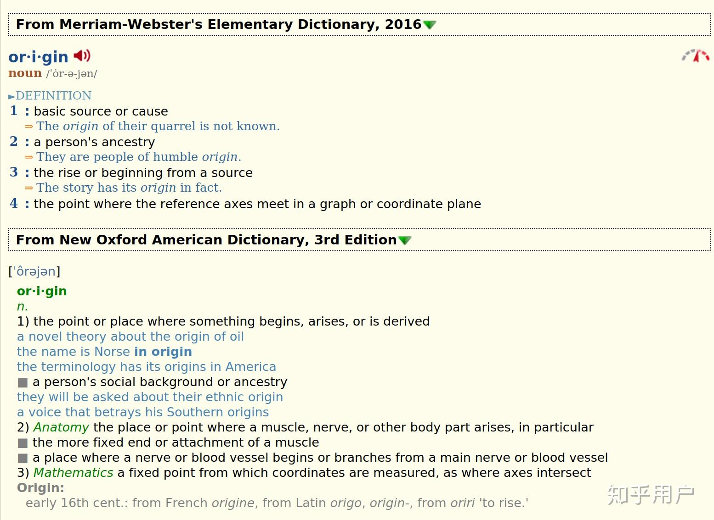
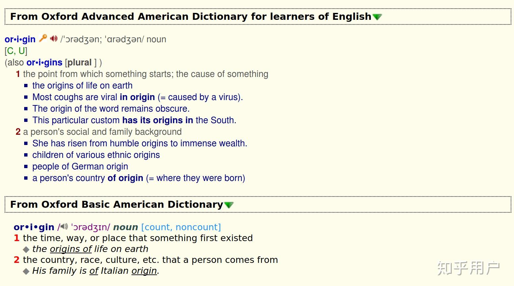
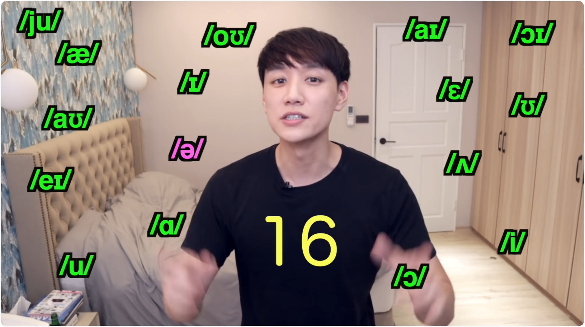

# 英语发音 (English Pronunciation)

**`标音法`**: 用音标标记语音的方法叫标音法.

> 国际音标主要使用两种括号进行记音：
>
> \- `[方括号]`，即严式标音，用于标记语音。通常包括较多的语音细节，即使那些细节在该语言中并不被用于区分语义。
>
> \- `/斜线/`，即宽式标音，用于标记音位。通常仅记录能区分语义的语音特征，而忽略无关的细节。
>
> 举例说明：在英语单词pin和spin中，两者的/p/发音略有不同（前者送气而后者不送气，这在汉语和一些语言会影响单词的意义），但在英语中此差异并不影响语义。因此，音位上来说可以将它们记录为/pɪn/和/spɪn/，包括了相同的音位/p/。然而，为了记录它们之间的差异（/p/的同位异音），它们在语音上可以记录为[pʰɪn]和[spɪn]。
>
> 
>
> *来源 Wikipedia: https://zh.wikipedia.org/wiki/%E5%9C%8B%E9%9A%9B%E9%9F%B3%E6%A8%99*

国际音标旁边的方括号(`[]`)和分隔号(`//`)非音标的一部分，它们是语言专家用以分辨两个主要标音的方法. 

**Tip: 但在此篇文章中, `[]`和`//`并没有按照`标音法`, 它们是等同的, 使用方括号(`[]`)标音法主要是为了排版好看.**

>  很多学习者发不对音, 并不是他发不出, 而是对他的语音表征系统来说, 这两个音在他听来是一样的。-- 青格乐《如何科学地学英语》

音位: 音位是抽象的，它是通过一门具体的语言中，从语音中的各种不区分意义但又具有某种相似的音素概括出来的一个抽象概念，双元音我们可以指是一个音位，因为我们是从抽象概括的角度来说的，但也可以指一个音素，因为我们是从实际的具体发音片段来说的。他们就是一个集体概念和个体概念的区别，即音位和音位变体（即各种发音因具体的环境不同而稍有不同的但又不区分意义的音素）的关系，同理，单元音也可以指音位或者音素，具体看我们从什么角度讲，简单总结下就是，音位是抽象的，音素是具体的音位可看成音素的集合，音素是集合的元素。 举个例子，英语一般我们说它有48个音标，也就是48个音位,一个音位可以对应多个音位变体即音素, `/ɪ/`这个音位根据在音节开头、中间、尾部的不同位置，发音是不同的，这不同的具体发音就是音位变体，即实际的音素发音，虽然发音不同，但我们归纳它为一个音位，因为它不区别词义。所以我们在没有具体的语言环境下，不能说双元音是音位，而不是音素，因为“双元音”这个词我们可以指抽象的“音位”，也可以指具体的发音"音素".

*Added: 2024.01.24*

==元音音素开头的单词前，这里的 “元音音素”都有哪些？==

## ▲ 闪音（flapping）

*Added: 2024.06.26*

From: ChatGPT 4o

Q: GPT, 我再问一个，比如像 status 中的第二个 t 是不是会发成 d 的音？在英语中是否存在一些单词中的 t 在一些情况下发成 d 的音？

ChatGPT: 在美式英语中，有一种现象叫做 **“闪音” (flapping)**，它会导致某些单词中的字母 "t" 或 "d" 发音类似于快速的 /d/ 音。这个现象通常发生在元音之间，尤其是在重读元音和非重读元音之间。以下是一些例子：

1. **status**：在美式英语中，第二个 "t" 通常不会发成 /d/ 的音，而是保留 /t/ 的发音。不过，有些口音或情况下也可能受到轻微影响。标准发音是 [ˈsteɪtəs] 或 [ˈstætəs]。

2. **water**：这个词在美式英语中经常发音为 [ˈwɑːdər]，其中 "t" 发成闪音 /d/。
   
3. **butter**：发音为 [ˈbʌdər]，其中 "t" 发成闪音 /d/。

4. **city**：发音为 [ˈsɪdɪ]，其中 "t" 发成闪音 /d/。

这个现象在英式英语中并不常见，"t" 通常还是会保持为 /t/ 音。以下是一个对比：

- **美式英语**：better [ˈbɛdər]
- **英式英语**：better [ˈbɛtər]

因此，在美式英语中确实存在一些单词中的 "t" 在特定情况下发成 /d/ 的音，这通常发生在元音之间的 "t" 或 "d" 上。

## ▲ 为什么 /ɪn/ 在有的单词中听起来像 /ən/？

*Added: 2024.01.31*

> 笔记来源：https://www.zhihu.com/question/319848864
>
> 
>
> [rchrdyan](https://www.zhihu.com/people/rchrdyan)
>
> 英语语音学音系学爱好者
>
> [发布于 2019-04-12 19:06 ，编辑于 2019-04-12 19:07](https://www.zhihu.com/question/319848864/answer/649196749)
>
> 在很多英语口音里，非重读音节的/ɪ/和/ə/失去对立性的情况很普遍。英国RP口音基本上还是区分的，但较年轻的RP使用者也有把/ɪ/发成/ə/的趋势。
>
> ---
>
> [知乎用户](https://www.zhihu.com/people/433b7dd7e8e622f13b37777a4921d8b7)
>
> [发布于 2020-03-11 21:59 ，编辑于 2020-03-11 22:03](https://www.zhihu.com/question/319848864/answer/1072254602)
>
> 口语里/ɪ/非重读的情况下发弱化为/ə/的情况非常普遍，尤其是美音，而且规律很简单，那就是四个中立元音[ɛ][ɪ][ʊ][ʌ]在非重读的情况下都可以弱化为中央元音/ə/,这个元音比较特殊，在很多语音学的书里，元音表都没列出/ə/，因为认为它不是一个单独的单元音，而是/ɜ/或包括/ʌ/的同一音位，弱读时候才出现。
>
> *[ɛ][ɪ][ʊ][ʌ]这四个元音也可以说本来就是a e i o u本音在非强调非重读情况下懒音弱化演变的结果，现在的英语又会进一步弱化为*/ə/，*这种弱化极端的情况下等于丢掉了这四个音本身，只留下了辅音字母互相连接，就像苏格兰姓氏和快餐巨头“麦当劳”一样，McDonald:* [ mək'dɔnəld ]*；早上碰到个点头之交的熟人，随口说句good morning, good实际发音是g-d,或者准确说是g-b,因为连d也丢掉了，只保留发音时间，然后受后边的m的口型影响，被穿透，成了*[ɡb͡mɔːrnɪŋ]。
>
> *英语真实口语里的实际发音，尤其是高频词非重读音节的发音，弱化到吓人的程度。*
>
> 远远不止origin、destined或者-in-会有这种情况，只要是非重读的[ɪ]都可以发/ə/，否则如果[ɪ]发音特别清楚，就很可能是过头了，所以按理说这是不容易发现的，如果对这个音听起来很敏感，有可能是因为自己发的音有提高空间
>
> 注意以下词典的音标，不光in发/ən/，ri也发/rə/
>
> 
>
> 
>
>
> ---
>
> 这个是美国口语的语音变化现象，适应就好。除此之外，还有各种，比如win，wind等待

## ▲ 英语音标 /ɪŋ/ 怎么发音？
*Added: 2024.01.30*

> 笔记来源：https://www.zhihu.com/question/374543943
>
> 
> 
>
> [不正经的英语老师](https://www.zhihu.com/people/li-xiang-32-78)
>
> 说得严谨点：ɪŋ约等于拼音ing
>
> 说得不太严谨点：ɪŋ等于拼音ing
>
> ŋ就是后鼻音而已
>
> 

## ▲ 为什么 `/ʌn/` 英音发「昂」，美音发「安」？

*Added: 2024.01.27*

==笔记待做==

> https://www.zhihu.com/question/399870307

## ▲ 英语元音（母音）

> https://www.youtube.com/watch?v=rwCK-kepCIc&ab_channel=%E5%93%A5%E5%80%AB%E5%B8%83Columbus

英文有多少个元音呢？我不是说 `A, E, I, O, U, (Y)`，这些是元音（/母音）的字母。

我想问的是英文有多少**发元音**的音呢？美式英文是有 15 个母音的，如果再加上那个特别的 `/ə/`，总共就是16个母音：

| 短元音                   | 长元音                 |
| ------------------------ | ---------------------- |
| `/aʊ/`                   | `/ju:/` 是 `/uː/`??    |
| `/ə/`                    | `/æ/`                  |
| `/uː/`(DJ) / `/u/` (KK)  | `/eɪ/`(DJ) / `/e/`(KK) |
| `/ɔː/` (DJ) / `/ɔ/` (KK) | `/oʊ/`                 |
| `/ʊ/`                    | `/ɑː/`(DJ) / `/ɑ/`(KK) |
| `/ɔɪ/`                   | `/aɪ/`                 |
|                          | `/e/`(DJ) / `/ɛ/`(kk)  |
|                          | `/ʌ/`                  |
|                          | `/iː/`(DJ) / `/i/`(kk) |
|                          | `/ɑː/`(DJ) / `/ɑ/`(kk) |
|                          |                        |
|                          |                        |
|                          |                        |
|                          |                        |
|                          |                        |
|                          |                        |

==笔记未做完==

## Content

(1) 英语的书写使用拉丁字母, 单词的拼写系统或正确拼写法是依据历史传统而继承下来的, 并不严格按照发音规律. 因此, 英语单词的发音与拼写之间经常有很大差异, 单词拼法也是所有字母语言中最难掌握的拼写之一. 世界绝大多数的拼音文字是属于直接拼法, 看单词就能正确发音,而英语拼写是属于间接拼法, 要借助音标才知道单词的正确发音. (笔记来源: [维基百科-英语](https://zh.wikipedia.org/wiki/%E8%8B%B1%E8%AF%AD))

(2) 汉语拼音(Hàn yǔ Pīn yīn): 简称拼音, 是一种以 "拉丁字母" 作普通话(现代标准汉语)标音的方案, 为中文罗马拼音的国际标准规范. (笔记来源: [维基百科-汉语](https://zh.wikipedia.org/wiki/%E6%B1%89%E8%AF%AD%E6%8B%BC%E9%9F%B3))

### 1. 英语音标

- 完整笔记见同级目录: [01_英语音标.md](./01_英语音标.md)

### 2. 英语中的音节
- 完整笔记见同级目录: [02_英语中的音节.md](./02_英语中的音节.md)

### 3. 英文字母在单词中的发音总结
- 完整笔记见同级目录: [03_英文字母在单词中的发音总结.md](03_英文字母在单词中的发音总结.md)

### 4. 英语单词中的重读音节
- 完整笔记见同级目录: [04_英语单词中的重读音节.md](04_英语单词中的重读音节.md)

### 5. 英语单词 143 发音法
- 完整笔记见同级目录: [05_英语单词 143 发音法.md](05_英语单词 143 发音法.md)

### 6. 英语连读有哪些规则跟变音技巧
- 完整笔记见同级目录: [06_英语连读有哪些规则跟变音技巧.md](06_英语连读有哪些规则跟变音技巧.md)

