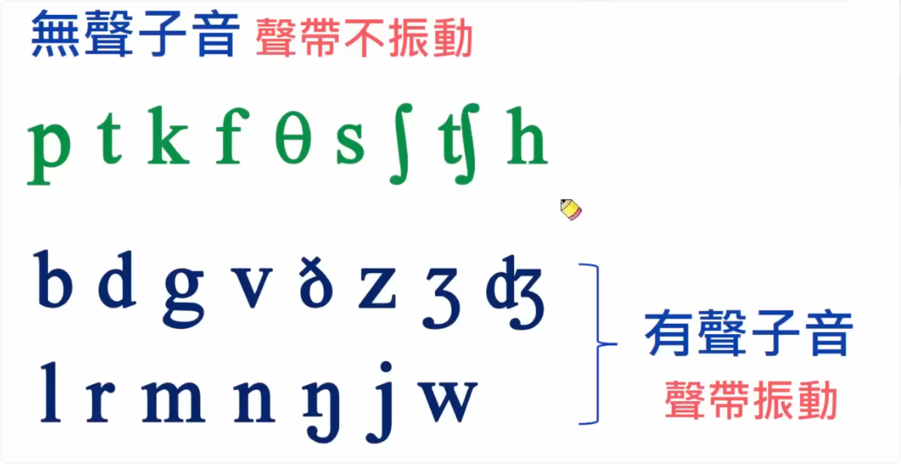
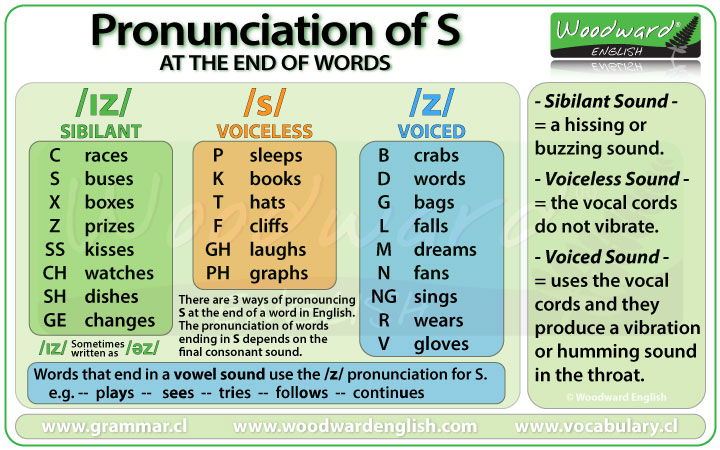

# 英语名词与动词复数 s 的发音

> [英语名词复数与动词第三人称单数结尾何时读 /s/，何时读 /z/？](https://www.zhihu.com/question/40647753)

> [外国人怎样区分类似Ice eyes ，读法有何不同！？](https://www.zhihu.com/question/31173486)

## ▲ 英文名詞複數s的發音

> 笔记来源：https://www.youtube.com/watch?v=b6eB0rcF0io&ab_channel=%E5%90%89%E5%A8%9C%E8%8B%B1%E6%96%87

英文字母单词词尾加 s 的形式有 3 种：

- (1) 名词复数
- (2) 名词所有格
- (3) 动词

嗨大家好我是Gina 今天的课程是复数字尾S的发音 英文单字字尾加上S 不是只有名词复数 还有名词所有格和动词 这里的课程我们要来学习的是字尾单纯只有S的发音 有三种发音的方式 分别是 s z is 好搭配三个口诀 无声配无声 有声配有声 字尾发音是 z is 透过口诀的学习就能很快知道 S到底要如何发音 那我们先来了解一下有声指音与无声指音 这样才能知道口诀的原理 我们来看KK音标的指音 好指音分无声指音跟有声指音 这个分别主要是在于声带有没有震动 声带的位置就在这里这个位置 那你去感觉看看 你在念这些指音的时候 你的声带有没有产生震动的感觉 好那你现在把手指头放在你的声带的位置我们来念 是不是感觉只有拉动 这个是没有震动的 那我们念这个音 好你会感觉到你的声带在震动 所以这就叫无声这就叫有声 在于声带有没有震动 那我们再念 好再念 没有震动 有震动 所以有声跟无声只有在声带有没有震动而已 我们来看这三个口诀的原理 好我们透过粒子来看他的发音就可以了 第一个单字是书 书的最后一个字母是 那可能是一个无声 所以他加上去的S就会产生所谓的无声配上无声的s 所以书的复数就叫 books books 无声配无声这里无声所以加上去的S搭配的就是无声 books books 好我们看第二个单字狗这个单字 他的最后一个字母是个 好他的个发音在这里他是一个有声 个 好有声配上有声的 s 所以狗的复数就叫 dogs dogs 有声配有声 那第三个单字要注意 因为母音也属于有声 所以这个口诀有声配有声 涵盖母音 请看数这个单字 好 这个ㄧㄧ的结尾发音是母音我们要用发音来判断不是用字形是用发音 好他的发音是母音 ㄧ好这是母音母音属于有声 有声配有声所以数的复数 就叫 trees trees 单字加上去的s由单字最后一个子音或是母音的发音来判断 那他到底是要发s s或是e 再搭配这三个口诀是不是就很简单呢 我们看第三个口诀 字尾发音 s 加上去的s会发成 is is 我们看第一个例子玫瑰花 他的发音是 rose 这里一不发音 所以他的结尾的发音是 所以我们加上去的s就要发成 is 所以他的复数就是rosies 好我们看护士 护士他的发音是 nerds 好一在这里不发音 好他的结尾最后一个子音的发音是 s 所以他加上去的s要发成 is 所以护士的复数 nurses nurses nurses nurses 所以单字字尾的发音如果是s s 那你加上去的s就要注意一下他的发音喔 我们来看例子发音练习那这里你画面上看到的第三个单字跟第四个 单字发音比较特别你看一下 如果一个单字的结尾是 ts这个时候你要注意喔 他的发音比较特别 他的发音比较特别是念成 所以猫叫cats cats cats 那你看第四个单字他是ds结尾发音也比较特别要一起念成类似中文的 z z但是轻一点 friends friends friends 好那这里的发音你要注意一下 我们这里有12个例子那请听外师的发音每个单字发音三遍 一边聆听一边对照这个外师他是怎么处理结尾s的发音 要仔细聆听一下喔 cops cops cops roofs roofs roofs cats cats cats friends friends friends bikes bikes bikes chairs chairs chairs girls girls girls rooms rooms rooms rooms pens pens pens shoes shoes shoes movies movies movies teachers teachers teachers 你在聆听外师发音的时候有没有发现除了ts ds之外不论是s s外师的发音都比较倾向直接发音成s音 如果你没有发现那可以再回去聆听一次 所以口语快速发音的时候不论是s s其实美国人大多发音成s音那慢速的时候s s还是会分清楚但快速就会发成s音了 或许在s音里头还是会有一些些的s音 但我个人的学习建议 轻松学习英文就好了 因为英文要学的东西真的很多 不用再花这么多心思在上面到底要发s呢还是s呢 所以呢 我想 你想要的是轻松还是完美其实看你个人的选择 我自己不论是s我都会发成s音 因为我觉得这样说英文变得轻松非常多 那看你自己的 选择啰 这是今天的课程我是Gina如果你觉得我教得还不错要给我按个 赞 好谢谢大家那不要忘记要订阅我的频道那我们下支影片再见了 掰掰

> 下面笔记来自同文档：`/English-Notes/01_发音/英语兔音标课/P3 全部音标-doing/readme.md`
>
> #### (2) 第二种分类：清辅音、浊辅音、单个辅音
>
> | 清辅音   | /p/  | /t/  | /k/  | /f/  | /θ/  | /s/  | /ʃ/  | /tʃ/ | /tr/ | /ts/ |
> | -------- | ---- | ---- | ---- | ---- | ---- | ---- | ---- | ---- | ---- | ---- |
> | 浊辅音   | /b/  | /d/  | /ɡ/  | /v/  | /ð/  | /z/  | /ʒ/  | /dʒ/ | /dr/ | /dz/ |
> | 单个辅音 | /h/  | /m/  | /n/  | /ŋ/  | /l/  | /r/  | /j/  | /w/  |      |      |

| 清辅音 (台: 无声子音) *声带不震动*   | `/p/`  | `/t/`  | `/k/`  | `/f/`  | `/θ/`  | `/s/`  | `/ʃ/`  | `/tʃ/` | ~~/tr/~~ | ~~/ts/~~ | `/h/`  |
| ---------------------------------------------- | ---- | ---- | ---- | ---- | ---- | ---- | ---- | ---- | -------- | -------- | ---- |
| **浊辅音** (台: 有声子音) *声带震动* | `/b/`  | `/d/`  | `/ɡ/`  | `/v/`  | `/ð/`  | `/z/`  | `/ʒ/`  | `/dʒ/` | `/dr/`     | `/dz/`     |      |
| 单个辅音                                       |      | `/m/`  | `/n/`  | `/ŋ/`  | `/l/`  | `/r/`  | `/j/`  | `/w/`  |          |          |      |

这段视频来自“吉娜英文”频道，标题为“英文名詞複數s的發音”。视频讲解了名词复数形式中字尾只有s的发音方式，有三种发音：[s]，[z]，和[ɪz]。

视频的主要内容包括：

1. **无声配无声**：
    - 例如：books, cups, roofs
2. **有声配有声（包括母音）**：
    - 例如：dogs, pens, cars, trees, boys
3. **字尾发音[s][z]--[ɪz]**：
    - 例如：roses, nurses

## ▲ Pronunciation of Final -S

The pronunciation of S at the end of [plural nouns](https://www.grammar.cl/Notes/Plural_Nouns.htm), [verbs in third person](https://www.grammar.cl/Present/Verbs_Third_Person.htm) and as a part of the [possessive case](https://www.grammar.cl/rules/genitive-case.htm) sometimes causes problems for non-native speakers because it can be pronounced in three different ways: / ɪz /, / s / or / z /.
在复数名词、第三人称动词末尾以及作为所有格的一部分，S 的发音有时会给非母语人士带来问题，因为它可以用三种不同的方式发音：/ɪz/、/s/ 或 / z/。

(Note: whenever you see letters or symbols between two slash marks (/ /), it refers to the pronunciation of that letter or sound)
（注：每当您看到两个斜杠（/ /）之间的字母或符号时，它指的是该字母或声音的发音）

The pronunciation depends on the last sound of the verb or noun which is usually a consonant. Before we learn the difference ways to pronounce the final S, we must first know what voiced and voiceless consonants are as well as sibilant sounds:
发音取决于动词或名词的最后一个声音，通常是辅音。在我们学习最后一个 S 的不同发音方法之前，我们必须首先知道什么是浊辅音和清辅音以及咝音：

### Voiced Consonants vs. Voiceless Consonants 

浊辅音与浊辅音对比清辅音

A **voiced** consonant (or sound) means that it uses the vocal cords and they produce a vibration or humming sound in the throat when they are said. Put your finger on your throat and then pronounce the letter L. You will notice a slight vibration in your neck / throat. That is because it is a **voiced** sound.
浊辅音（或声音）意味着它使用声带，并且在发音时在喉咙中产生振动或嗡嗡声。将手指放在喉咙上，然后发音字母 L。您会注意到颈部/喉咙有轻微的振动。那是因为它是浊音。

A **voiceless** sound (sometimes called unvoiced sound) is when there is no vibration in your throat and the sound comes from the mouth area. Pronounce the letter P. You will notice how it comes from your mouth (in fact near your lips at the front of your mouth). The P sound doesn't come from your throat.
清音（有时称为清音）是指喉咙没有振动并且声音来自口腔区域。发音字母 P。您会注意到它是如何从您的嘴中发出的（实际上在您嘴的前面靠近您的嘴唇）。 P 音不是从喉咙发出的。

Try this with the other letters and you will "feel" the difference between a voiced and a voiceless consonant (or sound).
尝试使用其他字母，您会“感觉到”浊辅音和清辅音（或声音）之间的区别。

### Sibilant Sounds 嘶嘶声

Another sound which is relevant to this is the **sibilant sound** which is produced by forcing air out toward your teeth. It is characterized by a hissing sound (sssss), a buzzing sound (zzzzz) or the sound teachers make when they want you to be quiet (shhhh!).
与此相关的另一种声音是嘶嘶声，这是通过将空气压向牙齿而产生的。它的特点是发出嘶嘶声 (sssss)、嗡嗡声 (zzzzz) 或老师希望你安静时发出的声音 (嘘!)。

- Z like the sound a bee makes... zzzzzz Z 就像蜜蜂发出的声音...zzzzzz
- S like the sound a snake makes... sssssss 就像蛇发出的声音... sssssss
- SH like the sound a teacher makes when they want you to be quiet... shhhhh
    嘘，就像老师要求你安静时发出的声音……嘘

Now we know the difference between voiced, voiceless and sibilant sounds we can look at the following rules for the correct pronunciation of S at the end of words in English:
现在我们知道了浊音、清音和咝音的区别，我们可以看看以下英语词尾S的正确发音规则：

### The pronunciation of the S at the end of words in English 英语词尾S的发音

The pronunciation of the final S in plural words and verbs in the third person depend on the final consonant sound before that S.
第三人称复数单词和动词中最后一个S的发音取决于该S之前的最后一个辅音。

The ending is pronounced **/s/ after a voiceless sound**, it is pronounced **/z/ after a voiced sound** and is pronounced **/ɪz / or /əz/ after a sibilant sound**:
清音后结尾读为 /s/，浊音后读为 /z/，咝音后读为 /ɪz / 或 /əz/：

- **Voiceless:** helps /ps/ -- sits /ts/ -- looks /ks/ 无声：帮助/ps/——坐在/ts/——看起来/ks/
- **Voiced:** crabs /bz/ -- words /dz/ -- gloves /vz/, 发声：螃蟹 /bz/ -- 单词 /dz/ -- 手套 /vz/，
- **Sibilant:** buses /sɪz / or /səz /, bridges /dʒɪz / or /dʒəz /, wishes /shɪz / or /shəz /
    嘶嘶声：公共汽车 /sɪz / 或 /səz /、桥梁 /dʒɪz / 或 /dʒəz /、愿望 /shɪz / 或 /shəz /

### 1. The /ɪz/ sound (or /əz/ sound)

 1. /ɪz/ 音（或 /əz/ 音）

Sometimes this sound is written as /əz/ and uses the symbol "schwa" or "upside down e" before the z. For ease we will write this sound as /ɪz/ or /iz/
有时，这个声音被写成/əz/，并在z之前使用符号“schwa”或“颠倒的e”。为了方便起见，我们将这个声音写为 /ɪz/ 或 /iz/

If the last consonant sound of the word is a **sibilant sound** (a hissing or buzzing sound), the final S is pronounced as /ɪz/. This /ɪz/ sound is pronounced like an extra syllable. (e.g. the word *buses* has two syllables)
如果单词的最后一个辅音是咝音（嘶嘶声或嗡嗡声），则最后的 S 发音为 /ɪz/。这个 /ɪz/ 发音就像一个额外的音节。 （例如，bus 这个词有两个音节）

If the sound has a J sound (/dʒ/ like the letter J at the beginning of the word jacket or /ʒ/ like the S in pleasure), then the final S is also pronounced as /ɪz/.
如果这个音是 J 音（/dʒ/ 就像单词jacket 开头的字母J 或/ʒ/ 就像please 中的S），那么最后的S 也发音为/ɪz/。

**Examples of words ending in the /ɪz/ sound:** 以 /ɪz/ 音结尾的单词示例：

- C: races (sounds like "race-iz") C：比赛（听起来像“race-iz”）
- S: pauses, nurses, buses, rises S：暂停、护士、公交车、起床
- X: fixes, boxes, hoaxes X：已修复、盒子、恶作剧
- Z: amazes, freezes, prizes, quizzes Z：惊奇、冻结、奖品、测验
- SS: kisses, misses, passes, bosses SS：亲吻、错过、传球、碰撞
- CH: churches, sandwiches, witches, teaches CH：教堂、三明治、女巫、课程
- SH: dishes, wishes, pushes, crashes SH：菜肴、愿望、推动、崩溃
- GE: garages, changes, ages, judges GE：车库、变化、年龄、法官

Remember: after verbs ending in -sh, -ch, -ss and -x, we add the -es to the end of the verb (in third person) and the pronunciation is /iz/ as an extra syllable.
请记住：以 -sh、-ch、-ss 和 -x 结尾的动词后，我们将 -es 添加到动词末尾（第三人称），发音为 /iz/ 作为额外音节。

### 2. The /s/ sound 

2. /s/ 声音

If the last consonant of the word is **voiceless**, then the S is pronounced as /s/. Be careful not to create an extra syllable.
如果单词的最后一个辅音是清辅音，则 S 发音为 /s/。小心不要创建额外的音节。

NOTE: The consonants c, s, sh, ch and x are voiceless though they use the sibilants ending seen above.
注意：辅音 c、s、sh、ch 和 x 是清音，尽管它们使用上面看到的咝音结尾。

**Examples of words ending in the /s/ sound:** 以 /s/ 音结尾的单词示例：

- P: cups stops, sleeps 问：杯子停下来，睡着了
- T: hats, students, hits, writes T：帽子、学生、热门、写作
- K: cooks, books, drinks, walks K：厨师、书籍、饮料、散步
- F: cliffs, sniffs, beliefs, laughs, graphs (the *-gh* and *-ph* here are pronounced like a F)
    F：悬崖、嗅探、信仰、笑声、图表（这里的 -gh 和 -ph 发音像 F）
- TH: myths, tablecloths, months (voiceless *th*) TH：神话、桌布、月份（清音th）

### 3. The /z/ sound 

3. /z/ 声音

If the last letter of the words ends in a **voiced** consonant (or sound), then the S is pronounced like a Z **/z/**(without creating another syllable). This Z sound is similar to the sound a bee makes zzzz.
如果单词的最后一个字母以浊辅音（或声音）结尾，则 S 的发音类似于 Z /z/（不创建另一个音节）。这种 Z 音类似于蜜蜂发出的 zzzz 声音。

We also use this ending when the word ends in a vowel sound (e.g. bees, flies etc.)
当单词以元音结尾时（例如蜜蜂、苍蝇等），我们也会使用此结尾。

**Examples of words ending in the /z/ sound:** 以 /z/ 音结尾的单词示例：

- B: crabs, rubs B：螃蟹，擦
- D: cards, words, rides, ends D：卡片、单词、游乐设施、结局
- G: rugs, bags, begs G：地毯、包袋、乞丐
- L: deals calls, falls, hills L：发牌跟注、跌倒、山丘
- M: plums, dreams M：李子，梦想
- N: fans, drains, runs, pens N：风扇、排水沟、管道、围栏
- NG: kings, belongs, sings NG：国王、属于、歌唱
- R: wears, cures A：磨损、治愈
- V: gloves, wives, shelves, drives V：手套、妻子、架子、驱动器
- Y: plays, boys, says, Y：玩耍，男孩们，说，
- THE: clothes, bathes, breathes THE：衣服、洗澡、呼吸
- VOWEL SOUNDS: sees, fleas 元音：sees、fleas

### Pronunciation of S cheat sheet S备忘单的发音

