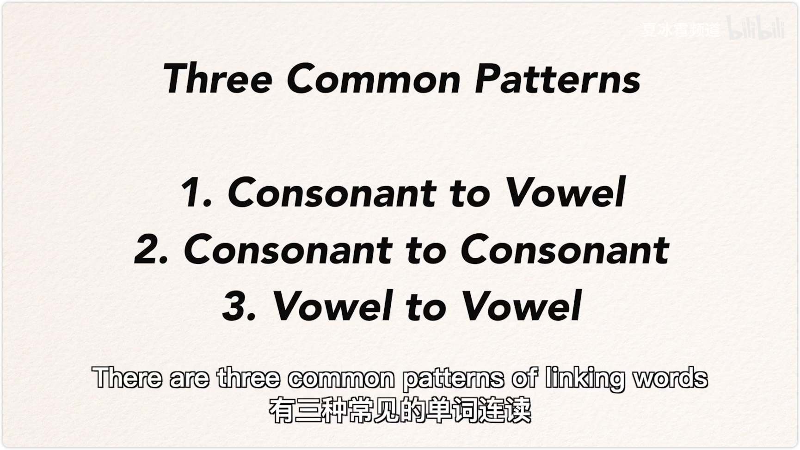

# 01 掌握连读，听懂老外说话 ... 04:02

## New Words

1. phrase `/freɪz/` n.[countable]成语；短语，词组
- Who first used the phrase 'survival of the fittest'? “适者生存”这一说法最早是谁说的？

1. continuous `/kənˈtɪnjuəs/` adj.持续的，连续的；〔动词〕进行式的
- continuous economic growth. 持续的经济增长
- a continuous flow of information. 源源不断的信息 
- a continuous sound. 连续不断的声音
- continuous rain. 连绵不断的雨
- a continuous performance (电影等) 连续不断的上演

1. linking ``

1. comprehension ``

1. consonant `/ˈkɑːnsənənt/` n.辅音；辅音字母。adj.和谐的；一致的。

英语的发音不一定和它的书写方式一样，

English isn't always pronounced the same way it's written. Native speakers tend to link words to each other. They don't pause between words, they say whole phrases as one continuous sound. Linking is very important in English, learning about linking is a great way to improve your listening comprehension and your fluency in English. There are three common patterns of linking words and I'm gonna walk you through all of these in this video. 

## 1. Consonant to Vowel Linking (辅音元音连读)

First pattern, consonant to vowel linking. It's the most common linking pattern in English when the first word ends with a consonant sound, and the second word begins with a vowel sound , the sounds are often linked together. Here are some examples:

 

 My sister is an apple work at leave it. Two consonant to consonant linking also occurs if the first word ends with a constant sound and the following word starts with a similar consonant sound. 

## 2. Consonant to Consonant

## 3. Vowel to Vowel

Rather than saying a constant sound twice, it's only pronounced once, for example, that time hot tea, hot tea, stop playing, need to sleep better. Red. Dress big bet gorilla feel like phone number enough four. Pink car pin car, nice scarf, nice scarf, three vowel to vowel linking, to create a smooth link from a word ending, a vowel sound into a word beginning with a vowel sound, an extra sound, or what is added between the words. 

So the air flow between words isn't stopped. For instance, I I answered do it in, go out. She asked. My uncle say it. Try again. How about few others? Now the key rules for linking words, how do you use these rules? First pay attention to linking that occurs in English videos and native speakers conversations. This will improve your listening comprehension skills. Second, try to imitate what you are listening. You can do shadowing practice which is repeating a piece of English audio word for a word. Gradually the rules become automatic. The deal was first announced in March and the deal was first announced in March the company at 9 billion and valid company and 9 billion. Okay. Once you can link words to each other, it'll be easier to understand the native speakers and your English will sound closer to native. Thanks for watching. I'm shaping bao, we will talk about more tips on improving or listening and speaking skills in the near future. 
