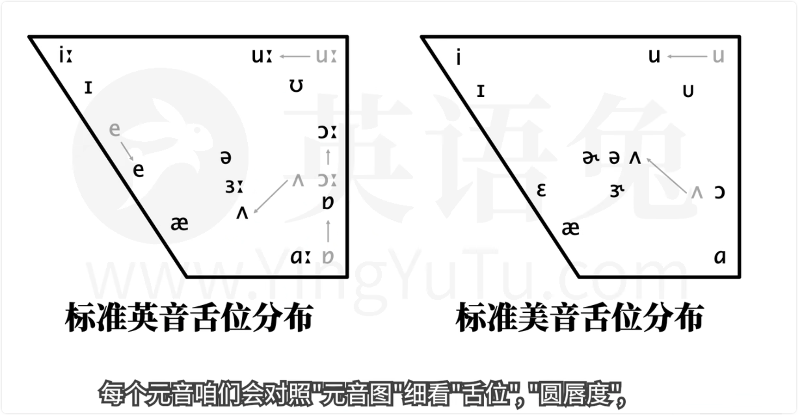

# P1

你好啊,我是最在乎你的英语老师,英语兔。 欢迎你来到全网最适合咱们中国人的免费音标课之一。 这么说好像有些自大,所以请允许我花几分钟说说这一套音标课和市面上常见的音标课有哪些不同。 也借此机会说说如何学习音标最好,或者说在被学校教过音标后如何再次学习音标最好。 首先是这套课程的安排,我并不会一上来就开始讲一,哎,五,啊,而是会先和你介绍几种最主流的音标体系, 包括真正的国际音标,DJ音标,KK音标,维士音标等。 这么做是因为很多人似乎并不知道,学校里学的电子字典上常见的、网络视频里使用的往往根本不是一套统一的注音方法。 一至于有人经常会问,为什么name这个字我在词典书本例句里看到的注音,有时候是这样,有时候是这样,还有时候是这样,到底哪个才是对的? 而boat这个字的注音,为什么学校里教这样,查字典是这样,买的教材上是这样,而你有的时候给出这样? 之所以会这么混乱,就是因为咱们英语学习中会遇到很多种音标体系, 可是甚至还有不少老师在教过时淘汰了的音标,比如DJ音标旧版本的这几个符号,而非对应的新版本的这几个符号。 你也许会说,哎呀,这么小的区别有什么关系嘛,其实你要说这后果严重嘛,它的确不严重。 但实际上,以上每个符号在真正的国际音标IPA里都代表了不同的音。 如果你想知道正版的国际音标读音,可以看这套课程最后的国际音标示范,算是个小科普,不用记忆。 再比如,咱们还会细看一下人类发音过程,真正搞懂原音、符音、清音、着音的本质区别, 你就知道为什么咱们汉语拼音的bdg不是着符音,说英语时不能直接套用, 而在细讲每个原音前,我会让你搞懂舌味、原纯度、原音图的概念,这样你才能在之后的原音学习中一下子体会到相似原音的区别。 在细讲每个符音前,我会和你细说一下调音器官,如声门、应乐、上至音等, 这样你才能在之后的符音学习中抓住每个符音的关键。 这套音标课里有每个原音符音的详细讲解,详细到时常很感人的地步, 好处是你所有可能的疑问都会被解答,坏处是对基础好一点的同学来说就过于细致,甚至啰嗦了一点。 那么,如果你的音标基础已经不错了,就可以直接看课程中的极简版讲解, 其中我把所有音标的关键点快速过了一遍,你可以从中挑出自己没有完全掌握的音标,然后去看对应的详细视频。 在每期音标课里,英语图我都会告诉你该音标符号的来源、写法和正规英语的名称, 比如,s的符号并不是数学上微积分离使用的那个符号,而长音符号的两个小三角形不是冒号。 再比如,马蹄U的由来,它的正式名是拉丁Opsilon,而KK音标其实并没有马蹄U,而是个小号的大写字母U。 这些细节虽说不是特别重要,但是对你手写音标还是有帮助的。 这一点可以说是每期音标课的核心,每个原音咱们会对照原音图细看舌位、原纯度, 而每个符音,咱们会细看调音器官和调音方式。这些术语其实很好理解,而且对你发音帮助很大,但很多课程根本不会提到。 另外,非常关键的一点是,英语图我会带你一起比较,每个音标和汉语拼音中相似的音到底有什么区别。 英语发音最忌讳的就是用咱们母语中文中的音去替代英文中独有的但是中文中缺失的音。 在这一点上,英语母语人士做的视频中不会有,而中国老师做的视频中也很少见。 有些老师甚至直接用中文中的近似音来教学,那样往往会导致严重的中式发音。 这一点也是英语图我这个音标课程的一大特色,几乎每个视频都会示范常见的咱们中国人特有的发音错误。 你可千万别小看这一点,你也千万别想,哎呀,干嘛示范错误嘛,这不多此一举,更让人混乱,甚至让人把错误的学走嘛。 因为咱们母语式中文的人在听到外语单词时,其实会在脑中进行一次过滤。 这就是为什么往往自己发错了音,感觉哪里不太对,但是就是说不出哪里不对。 而这也是为什么小孩子比我们学习外语有优势,因为他们往往不会进行母语过滤。 而进行错误示范,尤其是往往比较夸张的错误示范,恰恰就能让你听到自己有可能已经犯了的却不自知的错误。 如果你在听到这些错误示范时,能意识到,这个好像就是我的错误,那就说明你真正搞懂了正确与错误的区别,反而是好事。 当然英语图我也会告诉你,咱们为什么会犯这些常见错误,以及如何改正。 这个音标课的另一个独特之处,是英式英语和美式英语,一起DJ音标符号和对应KK音标符号的比对。 做英美比较是因为,咱们平时接触英语,其实英音和美音都接触得很多,这样会导致有些人分不清楚哪些是英音,哪些是美音,甚至会混起来随便读。 一句话中几个词是英音,其他是美音。当然了,其实这个也不算什么大问题,可以说不影响交流,但是,如果你有这方面的需要,希望语音能精益求精,那么这一部分对你会非常有用。 另一方面,国内有些教材,老师和视频在教授美式英语时,使用的是KK音标,和学校里传统上使用的DJ音标不同,所以这里又有可能混乱一次。 针对这一问题,我也分别做了英音和美音的示范,对习惯英音或者习惯美音的同学应该都有帮助。 其实这个视频合集不仅仅是一个课程,你也可以把它当做一个音标工具来使用,这就是为什么我也做了三个纯示范视频。 DJ音标的音音示范,KK音标的美音示范,以及真正的国际音标IPA示范。前两者是为了方便你平时查看,后者算是个拓展语音知识的小科普。 以上所提的几点,英语兔我在做每个视频的时候,并不仅仅是根据自己多年总结出来的经验和诀窍,而是查阅了大量的中文教学资料以及纯英文教学资料,因为很多知识点根本就没有中文资料。 地球每条信息不是我的意想自说自话瞎编出来的,而是都有学院派正统的学术理论支持,所以也请放心学习。 其中很多宝贵的信息,我敢说,你根本在其他音标视频里不可能看见。 你别看每个视频只有几分钟哦,背后往往是好几个小时的资料查阅和不断改进,我也不会把一句话拆成十句说或者翻来覆去地说,因为我知道你的时间也很宝贵。 做这套视频课真的很不容易,耗费了我很多心血,已经熬成了兔兔,你瞅瞅我的脑袋。 而正是因为以上几点,我才敢在这里打包票,说这是全网最详细、最适合中国人的音标课之一。 其实我当初犹豫了很久,要不要把这些东西免费放出来,也有人觉得我这么做不可思议,觉得一个正常的老师肯定是要收费才愿意发表这些内容。 不过你现在已经知道结果了,如果你习惯性地认为免费的一定不如收费的,我想恳请你先看一下这些视频,尤其是如果你第一次来英语课这里的话,我可以保证你不需此行。 而如果你等一下看了这些音标视频觉得有用,请帮忙花几秒钟点个赞或评论一下,这也是我唯一的请求啦。 而如果你觉得特别好的话,也请把英语兔推荐给你觉得需要的人,非常感谢。
