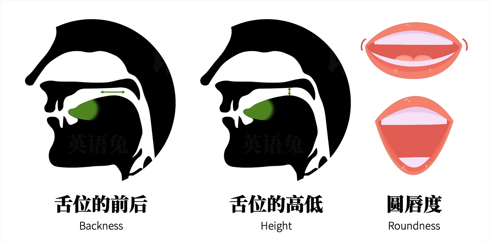
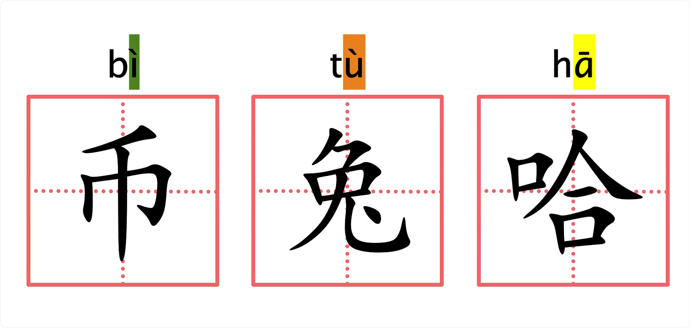
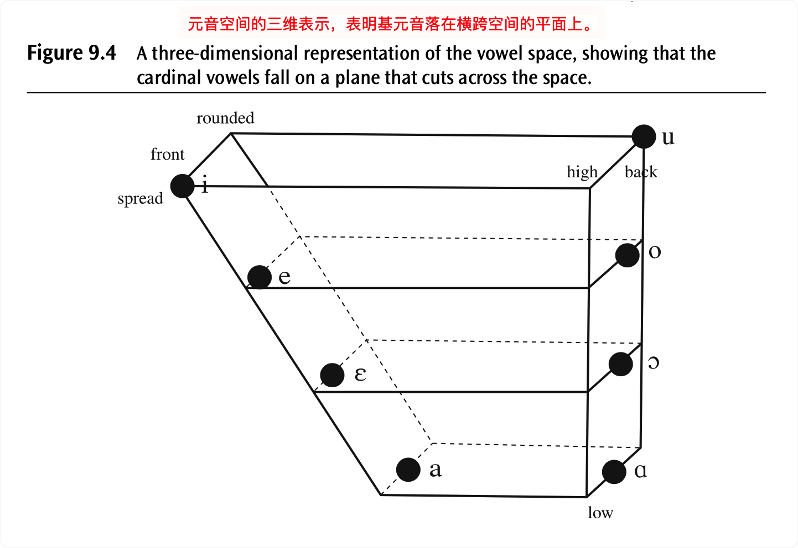
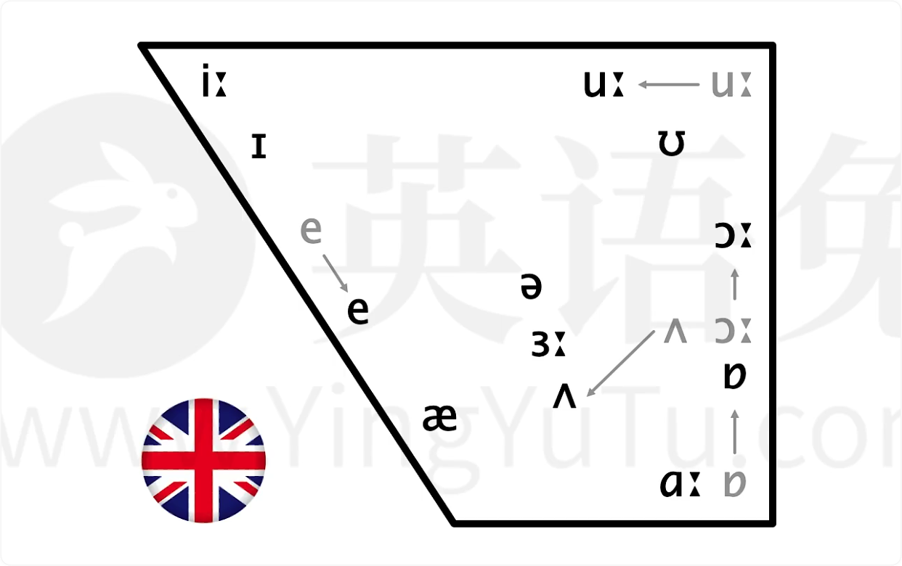
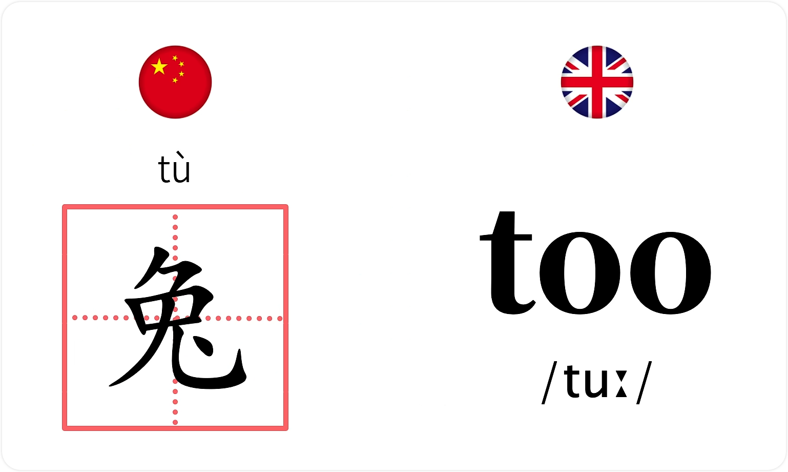
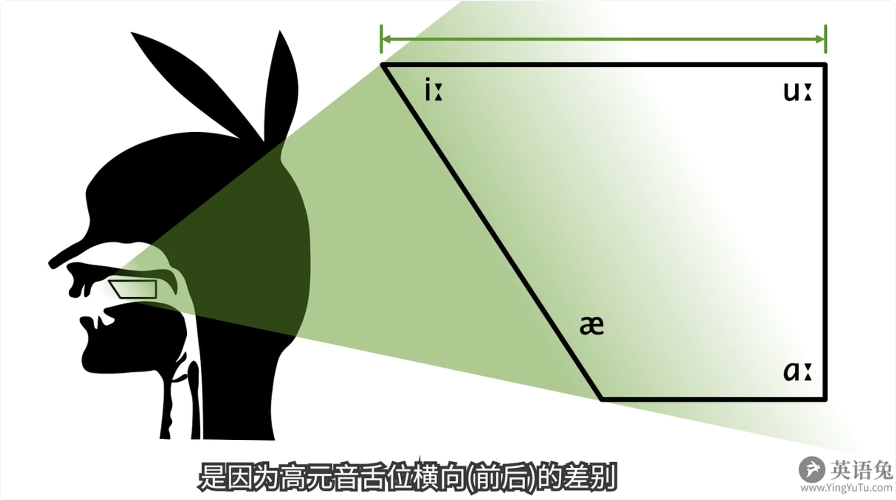
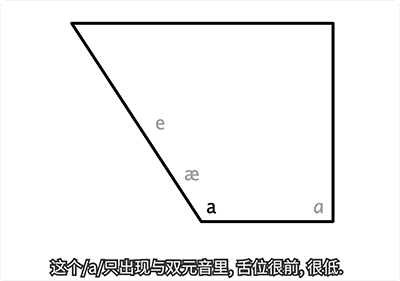
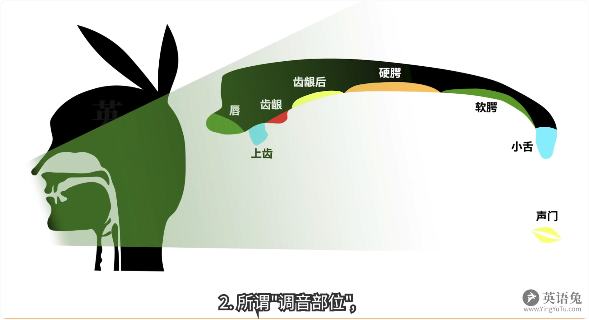

# P3 全部音标

*注：P7 - P43 每个音标详述和当前笔记合并*

*注：下面笔记 99% 的版权归英语兔老师所有。*

英语兔我接下来为你快速讲解一遍所有音标的核心要点。请自行查漏补缺 -- 如果其中某些音标你不是很清楚，请参见对应的音标详解视频。请注意，这个极简版音标讲解是基于最主流的英式 DJ 音标，但其他音标体系代表的都是同一个英语语音体系，甚至可以说是大同小异，所以并不影响你英语语音的学习和进步。

## ▲ 48 个音标分类表

### 1. 元音 (20 个)

#### (1) 第一种分类：单元音 和 双元音。

|                 | **短音** | DJ 音标 - IPA 88 | `/ɪ/`  | `/ʌ/`  | `/ʊ/`  | `/e/`  | `/æ/`  | `/ə/`  | `/ɒ/`  |        |
| :-------------: | :------: | ---------------- | :----: | :----: | :----: | :----: | :----: | :----: | :----: | :----: |
| 单元音（12 个） |          | KK 音标          |   ↑    |   ↑    |   ↑    | `/ɛ/`  |   ↑    |   ↑    |   ↑    |        |
|                 |   长音   | DJ 音标 - IPA 88 | `/iː/` | `/ɑː/` | `/uː/` | `/ɜː/` | `/ɔː/` |        |        |        |
|                 |          | KK 音标          | `/i/`  | `/ɑ/`  | `/u/`  | `/ɜ/`  | `/ɔ/`  |        |        |        |
|                 |          |                  |        |        |        |        |        |        |        |        |
| 双元音（8 个）  |          | DJ 音标 - IPA 88 | `/eɪ/` | `/aɪ/` | `/ɔɪ/` | `/aʊ/` | `/əʊ/` | `/ɪə/` | `/eə/` | `/ʊə/` |
|                 |          | KK 音标          | `/e/`  |   ↑    |   ↑    |   ↑    | `/o/`  | `/ɪr/` | `/ɛr/` | `/ʊr/` |

#### (2) 第二种分类：高元音、中元音、低元音、双元音

下面的分类来自 英语兔老师 的视频：[48个英语音标示范发音](48个英语音标示范发音 (建议收藏))

| 高元音 | `/iː/` | `/ɪ/`  | `/uː/` | `/ʊ/`  |        |        |        |        |
| ------ | ------ | ------ | ------ | ------ | ------ | ------ | ------ | ------ |
| 中元音 | `/e/`  | `/ɜː/` | `/ǝ/`  | `/ʌ/`  | `/ɔː/` |        |        |        |
| 低元音 | `/æ/`  | `/ɑː/` | `/ɒ/`  |        |        |        |        |        |
| 双元音 | `/eɪ/` | `/aɪ/` | `/ɔɪ/` | `/aʊ/` | `/ǝʊ/` | `/ʊǝ/` | `/eǝ/` | `/ɪǝ/` |

### 2. 辅音 (28 个)

#### (1) 第一种分类：

下面的分类来自 英语兔老师 的视频：[48个英语音标示范发音](48个英语音标示范发音 (建议收藏))

| 塞(sè)音 | `/p/`  | `/b/`  | `/t/`  | `/d/`  | `/k/` | `/g/` |       |       |       |
| -------- | ------ | ------ | ------ | ------ | ----- | ----- | ----- | ----- | ----- |
| 鼻音     | `/m/`  | `/n/`  | `/ŋ/`  |        |       |       |       |       |       |
| 擦音     | `/f/`  | `/v/`  | `/s/`  | `/z/`  | `/θ/` | `/ð/` | `/ʃ/` | `/ʒ/` | `/h/` |
| 塞擦音   | `/tʃ/` | `/dʒ/` |        |        |       |       |       |       |       |
| 近音     | `/w/`  | `/r/`  | `/j/`  |        |       |       |       |       |       |
| 边音     | `/l/`  |        |        |        |       |       |       |       |       |
| 辅音连缀 | `/ts/` | `/dz/` | `/tr/` | `/dr/` |       |       |       |       |       |

#### (2) 第二种分类：清辅音、浊辅音、单个辅音

| 清辅音   | /p/  | /t/  | /k/  | /f/  | /θ/  | /s/  | /ʃ/  | /tʃ/ | /tr/ | /ts/ |
| -------- | ---- | ---- | ---- | ---- | ---- | ---- | ---- | ---- | ---- | ---- |
| 浊辅音   | /b/  | /d/  | /ɡ/  | /v/  | /ð/  | /z/  | /ʒ/  | /dʒ/ | /dr/ | /dz/ |
| 单个辅音 | /h/  | /m/  | /n/  | /ŋ/  | /l/  | /r/  | /j/  | /w/  |      |      |

## ▲ 元音

咱们先说元音。区分各个元音的决定性三要素是：

| (1)     | "舌位" 的前后 (Backness);         |
| ------- | --------------------------------- |
| **(2)** | **"舌位" 的高低 (Height);**       |
| **(3)** | **嘴唇的 "圆唇度" (Roundness)。** |

所谓 **"舌位"** 你可以粗略理解为**发音时舌面隆起的最高点在口腔中的位置**。

咱们可以用普通话的元音，即**韵母**，来感受一下舌位的前后高低以及原纯度。

比如普通话 "币" 的韵母（拼音 i）舌位前且高；"兔" 的韵母（拼音 u）舌位后且高；"哈" 的韵母（拼音 a）舌位中且低。

而刚才这三个元音中，只有 "兔" 的韵母（拼音 u）是需要圆唇的，即 "圆唇度" 很高。

- A vowel chart showing the relative vowel qualities represented by some of the symbols used in transcribing English. The symbols [e, a, 0] occur as the first elements of diphthongs. （一个元音图表，显示了（转录/转写/标注）英语中使用的一些符号所代表的相对元音质量。 符号 [ e, a, o ] 作为双元音的第一个元素出现。）

咱们按照舌位的前后高低和圆唇度，可以把英语中不同的元音像这样画在所谓的 "元音图" 上（即：下图）；

但是英语兔我要特别指出，以上元音是标准英式英语（英音）在元音图上的分布。标准美式英语（美音）的元音稍有不同，所以在舌位兔上的分布也稍有不同，像这样：

接下来的极简版音标讲解是基于标准英音的。

与之对应的标准美音及 KK 音标，请见各个音标详解视频。

## ▲ 元音发音详述

### 长音 `/iː/`

| 单元音 | 长音 | 高元音 | `/iː/` | bee `/biː/` |
| :----: | :--: | :----: | :----: | :---------: |

这个元音的**舌位前、高**。3要素如下：

| (1)  | 舌位的前后：前 |
| ---- | -------------- |
| (2)  | 舌位的高低：高 |
| (3)  | 圆唇度：无     |

它和拼音 `i` 发音基本一致。也是咱们中国人觉得最容易的音之一。音标在段落中一般书写在双斜杠内，像这样 `/iː/` 其中的 **`ː`** 符号（请注意是两个小三角形而不是冒号）是所谓 "长音符号"，表示这个音通常发音时长较长。（但这不是绝对的。）

*注：下面表格为笔者补充，非视频内容*。

| 音近字   | 类似汉字 `亿(yì)` 读音的拉长版.                              |
| -------- | ------------------------------------------------------------ |
| 发音口型 | **嘴唇微微张开, ==舌尖轻触(轻轻碰触)下排牙齿==, 嘴角尽量向两边张开, 流露出微笑的表情**； 这也是我们在拍照时有时会说 cheese 的原因，微笑的样子就是长元音 `/i:/`. 与字母 E 的发音相同.  Added: 长元音 `/i:/` 是紧元音, 短元音 `/ɪ/` 是松元音. |

#### 长音 /iː/ 的短版本`/i/`

| 单元音 | `/i/` | 长音 `/iː/` 的短版本 | happy `/ˈhæpi/` |
| :----: | :---: | :------------------: | --------------- |

### 短音 `/ɪ/`

| 单元音 | 短音 | 高元音 | `/ɪ/` | big `/bɪɡ/` |
| :----: | :--: | :----: | :---: | ----------- |

这个元音的**舌位前、高**，但在 `/iː/` 的后下方。

| 舌位的前后 | 前   |
| ---------- | ---- |
| 舌位的高低 | 高   |
| 圆唇度     |      |

这个音在普通话里不存在，但是咱们军训时教官喊的 "一、一、一二一" 那个 "一" 就有点像这个 `/ɪ/`。 请特别注意 `/ɪ/` 并不是咱们刚提到的 `/iː/` 的短音版本，所以 big `/bɪɡ/` 不要读成 ~~`/biɡ/`~~ 。

*注：下面表格为笔者补充，非视频内容*。

| 音近字   | 无 不过此音标的发音要重读, 对应汉语拼音的声调是第四声.  从英语角度来说, 此音标的发音读起来像英文单词 A 的短而急促版.  Q: 音标 `/ɪ/` 到底怎么读?  A: 总的来说, 这个音标的发音像偏短的  A`/eɪ/` (字母 A) ，而不是读成很短的 "衣" 或偏短的 "哎".        就像上面英语兔老师说的，它也像咱们军训时教练喊得 "一、一、一二一" 那个 "一"；更多详细补充见  [关于音标 [ɪ] 的读法.md](../../关于音标 [ɪ] 的读法.md) |
| -------- | ------------------------------------------------------------ |
| 发音口型 | 嘴角微微张开, 舌尖抵下齿, 舌前部抬高, 嘴形是扁平.            |

###  长音 `/uː/`

| 单元音 | 长音 | 高元音 | `/uː/` | too `/tuː/ ` |
| :----: | :--: | :----: | :----: | ------------ |

舌位后、高，它的高度和拼音 `u` 一致，但这个音在现代英语的舌尾已向前迁移，所以比拼音 `u` 更前。

| 舌位的前后 | 后                                                           |
| ---------- | ------------------------------------------------------------ |
| 舌位的高低 | 高                                                           |
| 圆唇度     | 需圆唇（笔者注：这个圆唇度算是区别`/uː/`和短音 `/ʊ/`的重要区别之一了） |

请比较：

 和 `/iː/` 有短版本 `/i/` 相似。

#### 长音 /uː/ 的短版本`/u/`

`/uː/`也有短版本 `/u/`，比如 influence `/ˈɪnfluəns/` 中的第二个元音 `/u/`。

### 短音 `/ʊ/`

| 单元音 | 短音 | 高元音 | `/ʊ/` | book `/bʊk/ ` |
| :----: | :--: | :----: | :---: | ------------- |

舌位后、高，但在（朝前迁移的）`/uː/` 的后下方。这个音在普通话里不存在，也请特别注意，`/ʊ/` 并不是咱们刚提到的 `/uː/` 的短版本 `/u/`  ，所以 book 不要读成 book `/buk/`。

> https://www.zhihu.com/question/63830828
>
> 差别比较大，第一个音要撅嘴唇，它是个后元音，所以，所以舌头要向后隆起，使声音是从口腔后部发出来.后一个发声的时候，嘴巴不用那么撅，而且发的声音部位没有那么后、舌头没有那么撅，发声要短粗干脆.
>
> ### 讲 `/ʊ/` 发音的视频
>
> #### [《中国式英语发音纠正》音标 短元音 u 和长元音 u: 发音的本质区别！](https://www.youtube.com/watch?v=emg4IRZ4bEk&ab_channel=%E8%80%81%E6%9D%8E%E8%8B%B1%E8%AF%AD)
>
> #### [How to Pronounce: /ʊ/ vs. / u/](https://www.youtube.com/watch?v=ZObWFEbqc3A&ab_channel=VOALearningEnglish)
>
> Today, let's explore the vowel sound `/ʊ/` It's the sound of modal verbs, among many other important words. 
>
> (今天，让我们来探索元音发音“/u /”它是情态动词的发音，还有许多其他重要的单词。)
>
> To make the `/ʊ/` sound,  your lips should be slightly rounded and relaxed. Your tongue should be relaxed, and raised at the back of your mouth. 
>
> (要发出“/ʊ/”这个音，你的嘴唇应该微微张开并放松。你的舌头应该放松，并在口腔后部抬起。) 
>
> `/ʊ/` is a common sound in modal verbs, you know, those auxiliary verbs that express ability or possibility. They often have an-o, u, l, d spelling, as in: could, should, would. But the `/ʊ/` vowel sound has two other common spelling patterns. The first is the letters oo, as in: good,
>
> (`/ʊ/`是情态动词中常见的发音，你知道的，那些表达能力或可能性的助动词。它们通常有an-o, u, l, d拼写，如：could, should, would。但`/ʊ/`元音发音还有两种常见的拼写模式。第一种是字母oo，如：good, )

==Note：总的来说，发 `/ʊ/`的时候，最重要的一点是：嘴型几乎不动；但长元音`/uː/`却要把嘴唇撅起来，舌头向后隆起，舍身放平，声音是从口腔后部发出来的，声音比较浑厚。==

bed实为前中高，它和普通话业的韵母一致，所以对我们来说也比较简单。

 Her舌位从前后高低来说，都基本在中央有的母语人士发音时舌位稍稍低一点，他听上去像拼音饿，但实际上拼音鳄的舌尾更厚更高一些。

轻比较her的音的舌位从前后高低上来说在中间，所以被称作中央元音，它可以说是最放松状态下发出的音，同时也是英语中出现频率最高的元音，因为很多元音都会弱读成中央元音，舌位也基本在中央，只是往往比中央元音稍低一点。

咱们中国人往往觉得听上去像这是因为r的舌位是比r高一点点而已，or court舌位厚中高，这个音和拼音or非常像，所以这个音本身并不难，但要命的是这个音在英美两地版本很多，英语图我甚至认为它是最复杂的元音，没有之一标准茵茵的quote。

在美国有两个常见版本，分别独做 caught和caught。 Bad10位前d这个音在普通话里不存在，另外这个音在现代英音中的舌位以向下迁移，所以很多英国人读更像是在读舌位更低的，这就是为什么有时我们听某些英国人说bad像是bad father舌尾后第一，它和拼音凹和昂的起始音一致，为什么要用拼音or和on来举例？

因为其实普通话中I和I的奇石音的舌位前d r的10位中低or和on的起始音才是后d的。虽然这三个区别你可能之前不清楚，但是他们恰恰能很好的体现舌位的前后区别。

当然这个区别就算误读，也不会造成理解问题，所以这个音对咱们中国人来说还是挺简单的， Top舌位厚，d需原唇，这个音在普通话里不存在，但是咱们可以把它理解为嘴唇圆着短着读，其实美音中也没有这个音，因为美音在这个音上不圆唇，所以把Top读成Top。

之前咱们说的是单元音，接下来这几个是所谓双元音，顾名思义双元音可以理解为由单个元音组合而成的元音。其实咱们普通话或者说拼音里的双韵母就是双元音一样的道理，你可以把英语双元音粗略理解为两个音标代表的音，从前一个快速滑动到后一个发出的音，所以这里的极简版就不展开来讲了。

接下来是辅音，区分各个辅音的决定性，三要素是一清浊，即发生时声带是否震动。二，所谓调音部位及发音时最主要用到的阻挡气流的发音器官。三，作为调音方式，即以什么样的方式阻塞气流发出辅音？咱们来通过普通话to的辅音及声母也就是拼音。来体会一下这三个要素。拼音是个轻音，发音时声带不振动，而to之所以能响亮发出，主要靠之后的元音及拼音物，发这个音时需要用舌尖抵住上齿龈，所以拼音的调音部位就是上齿龈。

至于发音方式则是需要用舌尖抵住上齿音，完全阻塞气流之后形成气压，然后舌尖离开上知音，释放气流发出声响，这种调音方式被称作色音，阻塞的瑟俗称爆破音，学术上也称爆发音，咱们按照清浊调音部位调音方式，可以把英语中不同的辅音像这样列在一张表上，英音和美音的辅音发音基本没有区别，就连DJ音标和KK音标的辅音也是一致的。

The pig big是个轻音，发音时声带不振动属于色阴调音部位是双唇，它最常见的发音和普通话婆的声母一致，而but的唯一区别在于but是浊音，发音是声带振动，你可以吧，理解为轻音的浊音版。

The tip dip是个青色音调音部位是上齿音它最常见的发音和普通话to的声母一致。英语图我认为是英语辅音中最复杂的音没有之一，因为他在英语中的发音可能性有送气不送气，无声出组闪音，猴四音、鼻音出组鼻音出组省略。具体请参见的讲解视频和the清浊对立，the可以视作轻音的浊音版。

Kit git是个青色，音调音部位是软腭，他最常见的发音和普通话开的是母一致和一个轻酌对立，一个可以视作轻音的浊音版， Sum、 sun，这三个音都是浊调音方式为鼻音，调音部位分别是双唇上、齿音、软腭和普通话妈的声母一致，和普通话拿的声母一致，和普通话的后鼻音如昂的尾音一致，full of very，very very是个清音调音方式为擦音，也被称作摩擦音调音部位是上齿和下唇肤和普通话肤的生母一致。

符和五清浊对立，五可以视作轻音的浊音版。S zip。Zip是个轻音调音方式，为擦音也被称作摩擦音，调音部位是上齿音丝和普通话丝的声母一致，和z清浊对立，z可以视作清音s的浊音版。英语to，这里要提醒你一下，英语z并不是拼音字，拼音字更接近于音标，the three vs是个轻音调音方式为擦音，调音部位是牙齿，发时需要用上下齿轻咬住舌尖，让气流通过舌尖和牙齿的缝隙向外冲出，和字轻浊对立。

V可以视作轻音的浊音版，在普通话里没有这两个音，而这两个音也是英语的特色和发音难点之一，请不要用s和s来替代它们，十日measure measure是个轻音调音方式为擦音，调音部位是齿龈后和普通话屎的声母相似，但拼音是的，调音部位更靠后一点，你也可以理解为更卷舌一点。

时和日轻浊对立日可以视作清音室的浊音版。Hh judge hoak joke，each是个清音，从音标符号也能看出它有点像色音和擦音是的混合物，所以调音方式为色擦音，调音部位是吃音后吃和普通话吃的声母相似，只是拼音，吃更卷舌一点相似的。纸可以视作的和纸的混合物，也可以视作轻音齿的浊音版。High是个轻音调音部位，是声门调音方式在传统上被归入擦音，但其实气流通过声门后并不需其他发音器官参与发音和普通话的声母相似，只是拼音的调音部位是软腭，而英语的调音部位是声门，也就是更厚一点。

What why？我是个浊音，调音部位有两处，分别是唇和、软腭，也就是唇和软腭都要影响气流，调音方式在传统英语教学中被归入所谓半元音，但严格说来属于静音，具体请参见音标讲解视频。

我和普通话的声母基本一致，right？Car这个符号有两种常见发音，第一种是元音前的浊调音部位是上齿音，调音方式在传统英语教学中被归入擦音，但严格说来属于静音，这样的润和普通话日的生母相似，但英语的调音部位更前一点，且通常伴有圆唇动作请比较日是right，不是。第二种是美式英语，也就是美音中字母二之前的元音二话，也就是通俗说的卷舌音，类似普通话的儿化音如卡尔，这也是美音最显著的特征之一，yes yes也是个浊音，他的调音方式在传统英语教学中被归入所谓半元音，但他和润一样属于静音，调音部位是硬腭，这和普通话牙的生母基本一致了light。

Cool。

这个符号有两种常见发音，第一种是元音前的浊音，它的调音方式属于边禁音，也被称作边音，调音部位是上齿音这种了普通话了的声母一致，这样的被称作清晰l第二种可以理解为第一种冷发音发一半固定口型舌位，而不是立即释放气流这样的被称作模糊l在普通话中不存在 robots，bands，trip，rip词是个轻音，可以视作色音和擦音的混合物，和普通话词的声母一致，子可以视作轻音子的浊音板和软，可以分别是做的和软的混合以及的和软的混合，也是清浊对立。

有些版本的音标不收录这4个音，这也是因为国际上一般认为他们属于辅音连缀而非单独因素，比如s被视作特科斯快速相连发出而非1个全新的音，但是国内的音标教学一般还保留这4个音，这就导致国内音标往往有48个音标，20个元音音标，28个辅音音标，而某些音标只收录44个音标，缺少这4个音。好，以上就是所有英语音标的极简版讲解，希望对你有帮助，如果你对某些音标还不十分清楚，请参见相应的音标讲解视频。

------

单元音具体发音讲解: 

<table>
    <tr>
        <td rowspan="2">(1.0) 短元音: [ɪ]</td>
        <td>音近字:</td>
        <td style="line-height: 30px;">
          <strong>无</strong>.  
          不过此音标的发音要重读, 对应汉语拼音的声调是第四声.  
          从英语角度来说, 此音标的发音读起来像英文单词 A 的短而急促版.  
          <strong>Q01:</strong> 音标 [ɪ]
          到底怎么读?  
          <strong>A01:</strong> 总的来说, 这个音标的发音像偏短的 A (26 个英文字母的第一个) 
          而不是读成很短的 "衣" 或偏短的 "哎". 
          <strong>A02:</strong> 另一个回答见当前同级目录的另外一篇文章:
          <a href="../../关于音标 [ɪ] 的读法.md">关于音标 [ɪ] 的读法.md</a>  
        </td>
    </tr>
    <tr>
        <td>发音口型</td>
        <td> 嘴角微微张开, 舌尖抵下齿, 舌前部抬高, 嘴形是扁平.</td>
    </tr>
     <tr>
        <td rowspan="2">(1.1) 长元音: [iː]</td>
        <td>音近字:</td>
        <td style="line-height: 30px;">
            类似汉字 "亿(yì)" 读音的拉长版.
        </td>
    </tr>
    <tr>
        <td>发音口型</td>
        <td>
            嘴唇微微张开, 舌尖轻触(轻轻碰触)下排牙齿, 嘴角尽量向两边张开,  
            流露出微笑的表情，这也是我们在拍照时有时会说 cheese 的原因，微笑的样子就是长元音 `/i:/`. 与字母 E 的发音相同.  
            Added: 长元音 `[i:]` 是紧元音, 短元音 `[ɪ]` 是松元音.
        </td>
    </tr>
     <tr>
        <td rowspan="2">(2.0) 短元音: [ə]</td>
        <td>音近字:</td>
        <td style="line-height: 30px;">
            读音类似汉字 "阿(ē)".
        </td>
    </tr>
    <tr>
        <td>发音口型</td>
        <td>
            发音是干脆利索, 嘴唇微微张开, 舌身放平 
            (不卷舌), 舌中部稍微抬起,
            口腔自然放松发声.
        </td>
    </tr>
     <tr>
        <td rowspan="2">(2.1) 长元音: [ɜː]</td>
        <td>音近字:</td>
        <td style="line-height: 30px;">
             类似汉字 "饿(è)" 读音的拉长版. 但没有汉语 `饿(è)` 的嘴型张的大.  
             (tip: 实际上英文的发音, 大部分的嘴型都没有汉语拼音发音时嘴型张的大.)
        </td>
    </tr>
    <tr>
        <td>发音口型</td>
        <td>
             发音时嘴型扁平, 上下齿微开, 舌身平放(不卷舌), 舌中部稍抬起. 
            
             
            例词：surgeon /ˈsɜːdʒən $ ˈsɜːr-/ n.外科医生
        </td>
    </tr>
     <tr>
        <td rowspan="2">(3.0) 短元音: [ɒ]</td>
        <td>音近字:</td>
        <td style="line-height: 30px;">
            发音类似汉字 "凹(āo)".
        </td>
    </tr>
    <tr>
        <td>发音口型</td>
        <td>
            
                发音时口腔打开, 嘴张大, 舌头向后缩, 双唇稍微收圆.
            
        </td>
    </tr>
     <tr>
        <td rowspan="2">(3.1) 长元音: [ɔː]</td>
        <td>音近字:</td>
        <td style="line-height: 30px;">
            类似汉字 "凹(āo)" 的拉长版.
        </td>
    </tr>
    <tr>
        <td>发音口型</td>
        <td>
            
                发音时双唇收得小而圆, 并向前突出, 舌身往后缩.
            
        </td>
    </tr>
    <tr></tr>
     <tr>
        <td rowspan="2">(4.0) 短元音: [ʊ]</td>
        <td>音近字:</td>
        <td style="line-height: 30px;">
            <del>类似汉语拼音韵母表中的 "【u】"  的简短急促版.</del>
        </td>
    </tr>
    <tr>
        <td>发音口型</td>
        <td>
            
                嘴唇张开略微向前突出, 然后唇形稍微的收圆, 并放松些, 舌头后缩.
            
        </td>
    </tr>
    <tr></tr>
     <tr>
        <td rowspan="2">(4.1) 长元音: [uː]</td>
        <td>音近字:</td>
        <td style="line-height: 30px;">
            类似汉语拼音韵母表中的 "【u】"(呜) .
        </td>
    </tr>
    <tr>
        <td>发音口型</td>
        <td>
            发音时嘴型小而圆, 舌头尽量后缩.
        </td>
    </tr>
    <tr></tr>
     <tr>
        <td rowspan="2">(5.0) 短元音: [ʌ]</td>
        <td>音近字:</td>
        <td style="line-height: 30px;">
            类似汉语 "啊(ā)" 的简短急促版.
        </td>
    </tr>
    <tr>
        <td>发音口型</td>
        <td>
            
                嘴唇微微张开, 伸向两边, 舌尖轻触下齿, 舌后部稍稍抬起.
            
        </td>
    </tr>
    <tr></tr>
     <tr>
        <td rowspan="2">
            (5.1) 长元音: [ɑː]
        </td>
        <td>音近字:</td>
        <td style="line-height: 30px;">
            发音类似汉语 "啊(ā)" 的拉长版.
        </td>
    </tr>
    <tr>
        <td>发音口型</td>
        <td>
            
                发音时, 口张大, 舌身放平后缩,
                舌尖不抵下齿(即: 舌尖离开下齿),
                 
                舌后部略抬起, 放松发音. 开口度比`[ʌ]`更大.
            
               
            参考文章:
            <a href="https://zhuanlan.zhihu.com/p/39605780">
                英语48个音标发音(附详细图解)
            </a>
        </td>
    </tr>
    <tr></tr>
     <tr>
        <td rowspan="2">(6) 短元音: [e]</td>
        <td>音近字:</td>
        <td style="line-height: 30px;">
            发音类似汉字 "哎(āi)".
        </td>
    </tr>
    <tr>
        <td>发音口型</td>
        <td>
            嘴型扁平, 舌尖抵下齿, 舌前部稍微抬起.
        </td>
    </tr>
    <tr></tr>
     <tr>
        <td rowspan="2">
            (7) 短元音: [æ] (梅花音)
        </td>
        <td>音近字:</td>
        <td style="line-height: 30px;">
            注：发音仍然类似汉字 "哎(āi)".</del>
        </td>
    </tr>
    <tr>
        <td>发音口型</td>
        <td>
            
                嘴张大, 嘴角尽量拉向两边, 嘴型成扁平, 舌尖抵下齿.
                 
                
                注：下图 2022.10.07 添加，来自于英语兔老师的发音视频教程的 /æ/  
                音讲解视频；这里主要想比较直观的对比 /æ/ 和 /e/ 的发音嘴型差异。
                
                
            
        </td>
    </tr>
</table>

## ▲ 辅音发音详述

笔记来源：

- Youtube -  [15分钟的英语音标课](https://www.youtube.com/watch?v=O4Twm51n2Xw&list=PLiRHe7F8P0-2wRRzK6nzriMTXyfRwKEG6&index=2)

- bilibili - [极简版(全部音标)](bilibili.com/video/BV1iV411z7Nj?p=3&vd_source=033cc0cb90262a8954da54444ec97bda)

咱们按照：清浊、调音部位、调音方式，可以把英语中不同的辅音，像这样，列在一张表上（如下）：

英音(DJ) 和 美音(KK) 的辅音发音基本没有区别，就连 DJ 音标和 KK 音标的辅音也是一致的。

### 清音 `/p/`

| 辅音            | `/p/`                                                        |
| :-------------- | ------------------------------------------------------------ |
| 清/浊           | 清音                                                         |
| 调音部位        | 双唇                                                         |
| 调音方式        | 塞（sè）音 (爆破音/爆发音 Stop/Plosive`ˈ/ploʊsɪv/`)          |
| 汉语拼音声母    | `p`                                                          |
| 讲解            | *发音演示*：请见原视频； *详细*：`/p/`是个清音，发音时声带不振动，属于塞音，调音部位是双唇。 它最常见的发音和普通话 "婆" 的声母 (拼音 p) 一致。 *示例*：pig`/pɪɡ/` |
| 备注(个人添加） | `/p/` 和汉语拼音声母表中的 `p` 发音是类似的，但是拼音 `p` 本身读作 `po`(即声母`p`后是有个韵母 `o` )； 在英语单词中， `/p/` 的发音应该有 2 种，大致如下：（*注：个人总结，不一定正确*） (1) 在单词的开头，发音类似 `/pǝ/`(注：类似汉语声母的 `p`( po) )。比如： → problem`/ˈprɒbləm $ ˈprɑː-/`、pronunciation `/prəˌnʌnsiˈeɪʃən/`、put`/pʊt/`、people`/ˈpiːpəl/`… (2) 在单词的词尾，发音类似 `/pu/`。比如： → lamp`/læmp/`、help`/hɛlp/`、develop` /dɪ'vɛləp/`。 |

### 浊音 `/b/`

| 辅音            | `/b/`                                                        |
| :-------------- | ------------------------------------------------------------ |
| 清/浊           | 浊音                                                         |
| 调音部位        | 双唇                                                         |
| 调音方式        | 塞音(爆破音/爆发音)                                          |
| 汉语拼音声母    | `b`                                                          |
| 讲解            | *发音演示*：请见原视频； *详细*：`/b/`和`/p/`的唯一区别在于`/b/`是浊音，发音时声带振动，你可以把`/b/`理解为清音`/p/`的浊音版。 *示例*：big`/bɪɡ/` |
| 备注(个人添加） | `/b/`的发音同上面的 `/p/`的情况类似，在单词中的发音也有 2 种情况；大致如下： (1) 在单词的开头多数情况下发音都像 `/bǝ/`；比如： → bird `/bɝd/`、 better`/ˈbetər/`、beautiful `/ˈbjuːtəfəl/`。 (2) 在单词的结尾多数情况下发音更像 `/bu/`；比如： → club`/klʌb/`、disturb` /dɪˈstɜːrb/`、adverb` /ˈædvɜːrb/`、Youtube `/juːtuːb/`。 （*注：个人总结，不一定正确*） |

| 辅音   | 清/浊 | 调音部位  | 调音方式            | 汉语拼音声母 | 讲解                                                         | 备注(个人添加） |
| :----- | :---- | --------- | ------------------- | :----------- | :----------------------------------------------------------- | --------------- |
|        |       |           |                     |              |                                                              |                 |
|        |       |           |                     |              |                                                              |                 |
| `/t/`  | 清音  | 上齿龈    | 塞音(爆破音/爆发音) | t            | *注：发音演示请见原视频* 笔记待补充 |                 |
| `/d/`  | 浊音  | 上齿龈    | 塞音(爆破音/爆发音) | d            | *注：发音演示请见原视频* 笔记待补充 |                 |
| `/k/`  | 清音  | 软腭      | 塞音(爆破音/爆发音) | k            | *注：发音演示请见原视频* 笔记待补充 |                 |
| `/g/`  | 浊音  | 软腭      | 塞音(爆破音/爆发音) | g            | *注：发音演示请见原视频* 笔记待补充 |                 |
| `/m/`  | 浊音  | 双唇      | 鼻音                | m            | *注：发音演示请见原视频* 笔记待补充 |                 |
| `/n/`  | 浊音  | 上齿龈    | 鼻音                | n            | *注：发音演示请见原视频* 笔记待补充 |                 |
| `/ŋ/`  | 浊音  | 软腭      | 鼻音                |              | *注：发音演示请见原视频* 笔记待补充 |                 |
| `/f/`  | 清音  | 上齿+下唇 | 擦音(摩擦音)        | f            | *注：发音演示请见原视频* 笔记待补充 |                 |
| `/v/`  | 浊音  | 上齿+下唇 | 擦音(摩擦音)        | v            | *注：发音演示请见原视频* 笔记待补充 |                 |
| `/s/`  | 清音  | 上齿龈    | 擦音(摩擦音)        | s            | *注：发音演示请见原视频* 笔记待补充 |                 |
| `/z/`  | 浊音  | 上齿龈    | 擦音(摩擦音)        | z            | *注：发音演示请见原视频* 笔记待补充 |                 |
| `/θ/`  | 清音  | 牙齿      | 擦音(摩擦音)        |              | *注：发音演示请见原视频* 笔记待补充 |                 |
| `/ð/`  | 浊音  | 牙齿      | 擦音(摩擦音)        |              | *注：发音演示请见原视频* 笔记待补充 |                 |
| `/ʃ/`  | 清音  | 齿龈后    | 擦音(摩擦音)        |              | *注：发音演示请见原视频* 笔记待补充 |                 |
| `/ʒ/`  | 浊音  | 齿龈后    | 擦音(摩擦音)        |              | *注：发音演示请见原视频* 笔记待补充 |                 |
| `/tʃ/` | 清音  | 齿龈后    | 塞擦音(阻塞+摩擦)   |              | *注：发音演示请见原视频* 笔记待补充*注：发音演示请见原视频* 笔记待补充 |                 |
| `/dʒ/` | 浊音  | 齿龈后    | 塞擦音(阻塞+摩擦)   |              | *注：发音演示请见原视频* 笔记待补充 |                 |
| `/h/`  | 清音  | 声门      | 擦音(摩擦音)        |              | *注：发音演示请见原视频* 笔记待补充 |                 |
| `/w/`  | 浊音  | 唇+软腭   | 近音                | w            | *注：发音演示请见原视频* 笔记待补充 |                 |
| `/r/`  | 浊音  | 上齿龈    | 近音                | r            | *注：发音演示请见原视频* 笔记待补充 |                 |
| `/j/`  | 浊音  | 硬腭      | 近音                |              | *注：发音演示请见原视频* 笔记待补充 |                 |
| `/l/`  | 浊音  | 上齿龈    | 边近音              |              | *注：发音演示请见原视频* 笔记待补充 |                 |

