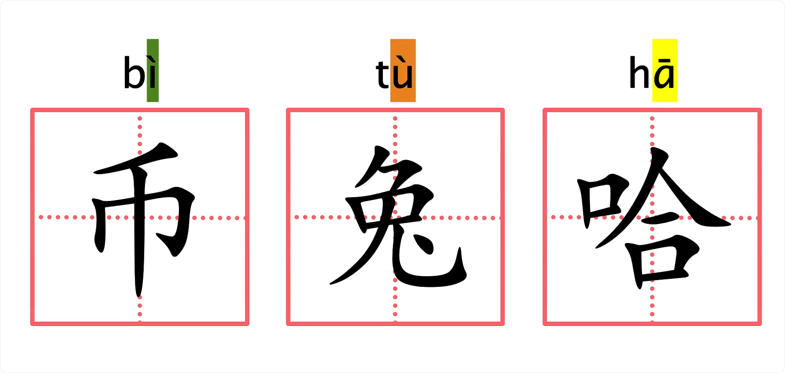
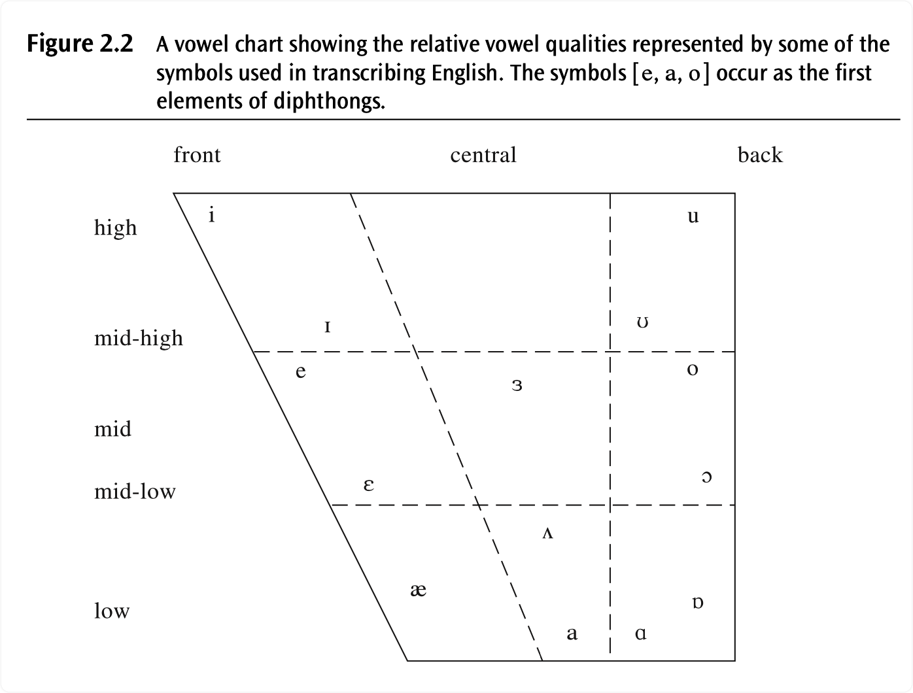
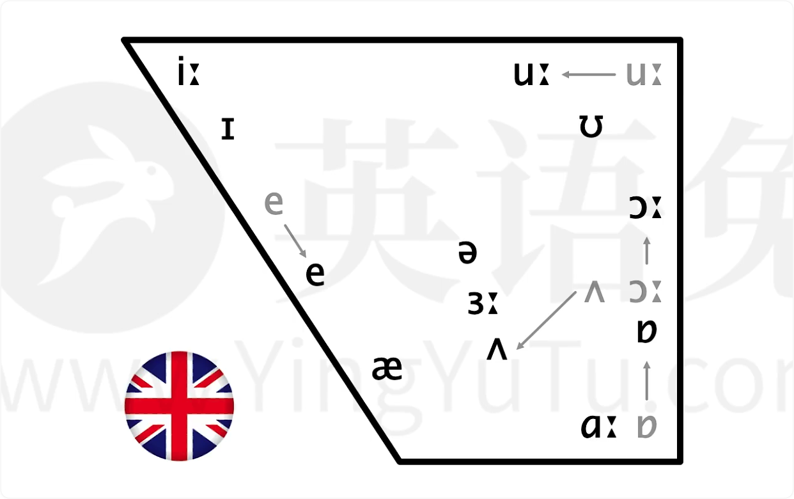
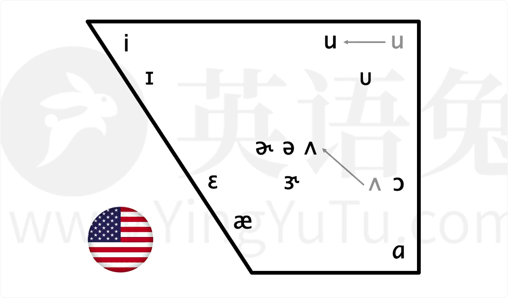

# P3 全部音标（极简版）

*注：下面的文字版为使用讯飞机器快转得到的，然后笔者又对照视频一点一点修改的，图片为视频中的截图，一切版权归英语兔老师所有。*

英语兔我接下来为你快速讲解一遍所有音标的核心要点。请自行查漏补缺 -- 如果其中某些音标你不是很清楚，请参见对应的音标详解视频。请注意，这个极简版音标讲解是基于最主流的 DJ 音标，但其他音标体系代表的都是同一个英语语音体系，甚至可以说是大同小异，所以并不影响你英语语音的学习和进步。

<table style="letter-spacing:1px;">
    <tr>
        <td rowspan="6"> 英式发音 </td>
        <td rowspan="3">元音 (20 个)</td>
        <td rowspan="2" colspan="2">单元音</td>
        <td>短音</td>
        <td style="color:red;">/ɪ/</td>
        <td style="color:red;">/ʌ/</td>
        <td style="color:red;">/ʊ/</td>
        <td style="color:red;">/e/</td>
        <td style="color:red;">/æ/</td>
        <td style="color:red;">/ə/</td>
        <td style="color:red;">/ɒ/</td>
        <td></td>
        <td></td>
        <td></td>
    </tr>
    <tr>
        <td>长音</td>
        <td style="color:red;">/iː/</td>
        <td style="color:red;">/ɑː/</td>
        <td style="color:red;">/uː/</td>
        <td style="color:red;">/ɜː/</td>
        <td style="color:red;">/ɔː/</td>
        <td></td>
        <td></td>
        <td></td>
        <td></td>
        <td></td>
    </tr>
    <tr>
        <td colspan="3">双元音 (8 个)</td>
        <td style="color:red;">/eɪ/</td>
        <td style="color:red;">/aɪ/</td>
        <td style="color:red;">/ɔɪ/</td>
        <td style="color:red;">/aʊ/</td>
        <td style="color:red;">/əʊ/</td>
        <td style="color:red;">/ɪə/</td>
        <td style="color:red;">/eə/</td>
        <td style="color:red;">/ʊə/</td>
        <td></td>
        <td></td>
    </tr>
    <tr>
        <td rowspan="4">辅音 (28 个)</td>
        <td colspan="3" style="text-align:center;">清辅音</td>
        <td style="color:red;">/p/</td>
        <td style="color:red;">/t/</td>
        <td style="color:red;">/k/</td>
        <td style="color:red;">/f/</td>
        <td style="color:red;">/θ/</td>
        <td style="color:red;">/s/</td>
        <td style="color:red;">/ʃ/</td>
        <td style="color:red;">/tʃ/</td>
        <td style="color:red;">/tr/</td>
        <td style="color:red;">/ts/</td>
    </tr>
    <tr>
        <td colspan="3" style="text-align:center;">浊辅音</td>
        <td style="color:red;">/b/</td>
        <td style="color:red;">/d/</td>
        <td style="color:red;">/ɡ/</td>
        <td style="color:red;">/v/</td>
        <td style="color:red;">/ð/</td>
        <td style="color:red;">/z/</td>
        <td style="color:red;">/ʒ/</td>
        <td style="color:red;">/dʒ/</td>
        <td style="color:red;">/dr/</td>
        <td style="color:red;">/dz/</td>
    </tr>
    <tr>
        <td colspan="3" style="text-align:center;">单个辅音</td>
        <td style="color:red;">/h/</td>
        <td style="color:red;">/m/</td>
        <td style="color:red;">/n/</td>
        <td style="color:red;">/ŋ/</td>
        <td style="color:red;">/l/</td>
        <td style="color:red;">/r/</td>
        <td style="color:red;">/j/</td>
        <td style="color:red;">/w/</td>
        <td></td>
        <td></td>
    </tr>
</table>

## ▲ 元音

咱们先说元音。区分各个元音的决定性三要素是：
- **(1) "舌位" 的前后 (Backness)**;
- **(2) "舌位" 的高低 (Height)**;
- **(3) 嘴唇的 "圆唇度" (Roundness)**。

所谓 **"舌位"** 你可以粗略理解为**发音时舌面隆起的最高点在口腔中的位置**。

咱们可以用普通话的元音，即**韵母**，来感受一下舌位的前后高低以及原纯度。

比如普通话 "币" 的韵母（拼音 i）舌位前且高；"兔" 的韵母（拼音 u）舌位后且高；"哈" 的韵母（拼音 a）舌位中且低。

而刚才这三个元音中，只有 "兔" 的韵母（拼音 u）是需要圆唇的，即 "圆唇度" 很高。

- A vowel chart showing the relative vowel qualities represented by some of the symbols used in transcribing English. The symbols [e, a, 0] occur as the first elements of diphthongs. （一个元音图表，显示了（转录/转写/标注）英语中使用的一些符号所代表的相对元音质量。 符号 [ e, a, o ] 作为双元音的第一个元素出现。）

咱们按照舌位的前后高低和圆唇度，可以把英语中不同的元音像这样画在所谓的 "元音图" 上（即：上图）；

但是英语兔我要特别指出，以上元音是标准英式英语（英音）在元音图上的分布。标准美式英语（美音）的元音稍有不同，所以在舌位兔上的分布也稍有不同，像这样：

接下来的极简版音标讲解是基于标准英音的。

与之对应的标准美音及 KK 音标，请见各个音标详解视频。

###  /iː/

| 英式发音 | 元音 | 单元音 | 长音 | `/iː/` | e.g.:  bee `/biː/` |
| :------: | :--: | :----: | :--: | :----: | ------------------ |

这个元音的**舌位前、高**。

它和拼音 `i` 意义基本一致，也是咱们中国人觉得最容易的音之一。音标在段落中一般书写在双斜杠内，像这样 `/iː/` 其中的 **`ː`** 符号（请注意是两个小三角形而不是冒号）是所谓长音符号，表示这个音通常发音时长较长，但这不是绝对的。

这个音还有个短版本，如happy的尾音big，谁为钱高？但是在e的后下方，这个音在普通话里不存在，但是咱们军训时教官喊的而就有点像请特别注意，并不是咱们刚提到的e的短版本，所以big不要读成big02舌位厚高，它的高度和拼音物一致，但这个音在现代英语的舌尾已向前迁移，所以比拼音物更前请比较。

22和e有短版本e相似，也有短版本，比如influence中的第二个元音， book实位后高，但在a的后下方，这个音在普通话里不存在，也请特别注意，并不是咱们刚提到的的短版本，所以book不要读成book，bed实为前中高，它和普通话业的韵母一致，所以对我们来说也比较简单。

 Her舌位从前后高低来说，都基本在中央有的母语人士发音时舌位稍稍低一点，他听上去像拼音饿，但实际上拼音鳄的舌尾更厚更高一些。

轻比较her的音的舌位从前后高低上来说在中间，所以被称作中央元音，它可以说是最放松状态下发出的音，同时也是英语中出现频率最高的元音，因为很多元音都会弱读成中央元音，舌位也基本在中央，只是往往比中央元音稍低一点。

咱们中国人往往觉得听上去像这是因为r的舌位是比r高一点点而已，or court舌位厚中高，这个音和拼音or非常像，所以这个音本身并不难，但要命的是这个音在英美两地版本很多，英语图我甚至认为它是最复杂的元音，没有之一标准茵茵的quote。

在美国有两个常见版本，分别独做 caught和caught。 Bad10位前d这个音在普通话里不存在，另外这个音在现代英音中的舌位以向下迁移，所以很多英国人读更像是在读舌位更低的，这就是为什么有时我们听某些英国人说bad像是bad father舌尾后第一，它和拼音凹和昂的起始音一致，为什么要用拼音or和on来举例？

因为其实普通话中I和I的奇石音的舌位前d r的10位中低or和on的起始音才是后d的。虽然这三个区别你可能之前不清楚，但是他们恰恰能很好的体现舌位的前后区别。

当然这个区别就算误读，也不会造成理解问题，所以这个音对咱们中国人来说还是挺简单的， Top舌位厚，d需原唇，这个音在普通话里不存在，但是咱们可以把它理解为嘴唇圆着短着读，其实美音中也没有这个音，因为美音在这个音上不圆唇，所以把Top读成Top。

之前咱们说的是单元音，接下来这几个是所谓双元音，顾名思义双元音可以理解为由单个元音组合而成的元音。其实咱们普通话或者说拼音里的双韵母就是双元音一样的道理，你可以把英语双元音粗略理解为两个音标代表的音，从前一个快速滑动到后一个发出的音，所以这里的极简版就不展开来讲了。

接下来是辅音，区分各个辅音的决定性，三要素是一清浊，即发生时声带是否震动。二，所谓调音部位及发音时最主要用到的阻挡气流的发音器官。三，作为调音方式，即以什么样的方式阻塞气流发出辅音？咱们来通过普通话to的辅音及声母也就是拼音。来体会一下这三个要素。拼音是个轻音，发音时声带不振动，而to之所以能响亮发出，主要靠之后的元音及拼音物，发这个音时需要用舌尖抵住上齿龈，所以拼音的调音部位就是上齿龈。

至于发音方式则是需要用舌尖抵住上齿音，完全阻塞气流之后形成气压，然后舌尖离开上知音，释放气流发出声响，这种调音方式被称作色音，阻塞的瑟俗称爆破音，学术上也称爆发音，咱们按照清浊调音部位调音方式，可以把英语中不同的辅音像这样列在一张表上，英音和美音的辅音发音基本没有区别，就连DJ音标和KK音标的辅音也是一致的。

The pig big是个轻音，发音时声带不振动属于色阴调音部位是双唇，它最常见的发音和普通话婆的声母一致，而but的唯一区别在于but是浊音，发音是声带振动，你可以吧，理解为轻音的浊音版。

The tip dip是个青色音调音部位是上齿音它最常见的发音和普通话to的声母一致。英语图我认为是英语辅音中最复杂的音没有之一，因为他在英语中的发音可能性有送气不送气，无声出组闪音，猴四音、鼻音出组鼻音出组省略。具体请参见的讲解视频和the清浊对立，the可以视作轻音的浊音版。

Kit git是个青色，音调音部位是软腭，他最常见的发音和普通话开的是母一致和一个轻酌对立，一个可以视作轻音的浊音版， Sum、 sun，这三个音都是浊调音方式为鼻音，调音部位分别是双唇上、齿音、软腭和普通话妈的声母一致，和普通话拿的声母一致，和普通话的后鼻音如昂的尾音一致，full of very，very very是个清音调音方式为擦音，也被称作摩擦音调音部位是上齿和下唇肤和普通话肤的生母一致。

符和五清浊对立，五可以视作轻音的浊音版。S zip。Zip是个轻音调音方式，为擦音也被称作摩擦音，调音部位是上齿音丝和普通话丝的声母一致，和z清浊对立，z可以视作清音s的浊音版。英语to，这里要提醒你一下，英语z并不是拼音字，拼音字更接近于音标，the three vs是个轻音调音方式为擦音，调音部位是牙齿，发时需要用上下齿轻咬住舌尖，让气流通过舌尖和牙齿的缝隙向外冲出，和字轻浊对立。

V可以视作轻音的浊音版，在普通话里没有这两个音，而这两个音也是英语的特色和发音难点之一，请不要用s和s来替代它们，十日measure measure是个轻音调音方式为擦音，调音部位是齿龈后和普通话屎的声母相似，但拼音是的，调音部位更靠后一点，你也可以理解为更卷舌一点。

时和日轻浊对立日可以视作清音室的浊音版。Hh judge hoak joke，each是个清音，从音标符号也能看出它有点像色音和擦音是的混合物，所以调音方式为色擦音，调音部位是吃音后吃和普通话吃的声母相似，只是拼音，吃更卷舌一点相似的。纸可以视作的和纸的混合物，也可以视作轻音齿的浊音版。High是个轻音调音部位，是声门调音方式在传统上被归入擦音，但其实气流通过声门后并不需其他发音器官参与发音和普通话的声母相似，只是拼音的调音部位是软腭，而英语的调音部位是声门，也就是更厚一点。

What why？我是个浊音，调音部位有两处，分别是唇和、软腭，也就是唇和软腭都要影响气流，调音方式在传统英语教学中被归入所谓半元音，但严格说来属于静音，具体请参见音标讲解视频。

我和普通话的声母基本一致，right？Car这个符号有两种常见发音，第一种是元音前的浊调音部位是上齿音，调音方式在传统英语教学中被归入擦音，但严格说来属于静音，这样的润和普通话日的生母相似，但英语的调音部位更前一点，且通常伴有圆唇动作请比较日是right，不是。第二种是美式英语，也就是美音中字母二之前的元音二话，也就是通俗说的卷舌音，类似普通话的儿化音如卡尔，这也是美音最显著的特征之一，yes yes也是个浊音，他的调音方式在传统英语教学中被归入所谓半元音，但他和润一样属于静音，调音部位是硬腭，这和普通话牙的生母基本一致了light。

Cool。

这个符号有两种常见发音，第一种是元音前的浊音，它的调音方式属于边禁音，也被称作边音，调音部位是上齿音这种了普通话了的声母一致，这样的被称作清晰l第二种可以理解为第一种冷发音发一半固定口型舌位，而不是立即释放气流这样的被称作模糊l在普通话中不存在 robots，bands，trip，rip词是个轻音，可以视作色音和擦音的混合物，和普通话词的声母一致，子可以视作轻音子的浊音板和软，可以分别是做的和软的混合以及的和软的混合，也是清浊对立。

有些版本的音标不收录这4个音，这也是因为国际上一般认为他们属于辅音连缀而非单独因素，比如s被视作特科斯快速相连发出而非1个全新的音，但是国内的音标教学一般还保留这4个音，这就导致国内音标往往有48个音标，20个元音音标，28个辅音音标，而某些音标只收录44个音标，缺少这4个音。好，以上就是所有英语音标的极简版讲解，希望对你有帮助，如果你对某些音标还不十分清楚，请参见相应的音标讲解视频。
