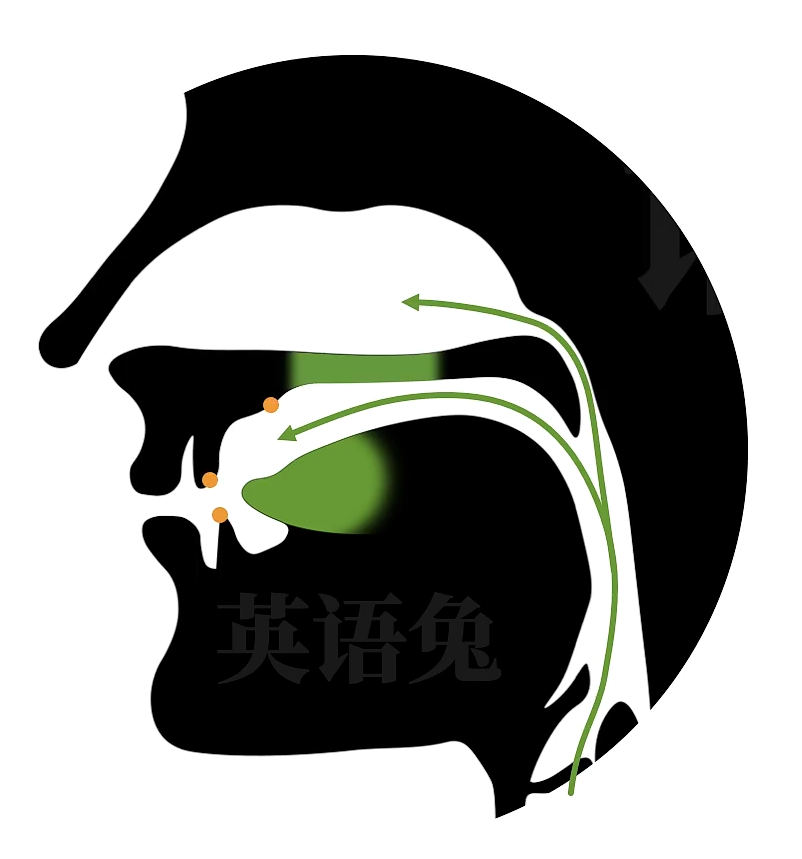

# P4 人类发音过程

可能你早就知道，声音是由振动产生的。粗略的说，咱们的声带振动气流，产生声音，然后通过空气传播，进入人耳，振动耳蜗，产生神经信号再被人脑理解。

<<<<<<< HEAD

=======

>>>>>>> e95d365 (2023.03.17)

这是粗略的过程，但是具体说来非常复杂。咱们现在讨论语音，只看 "产生声音"，也就是发音这一部分。

虽说 "声带振动产生声音"，但声带要怎么才能振动呢？这需要气流的参与。

而气流来自哪里？当然是咱们的肺部，人类发音过程的开始实际上是肺部产生气流。

肺部气流机制其实也很复杂，除了我们通常向外吐气发出的 "外呼音" (比如到现在为止英语兔我说话发出的所有音)；还有 "内呼音"，即向内吸气而发出的音。比如咱们平时说的 "倒吸一口凉气" 发出的那个 "啊"，就是个 "内呼音"。不过这样的情况当然很少。

咱们现在讨论通常的发音的初始阶段，可以粗略理解为，肺部气流被挤压，一路上行来到咱们喉咙这里的 "声门"，这就是发音的 "动力"。声门其实是咱们两瓣声带的开口，没错，咱们都有两瓣声带。

当气流从肺部冲出声门时，咱们可以选择让气流振动声带，再让气流继续上行。如果是这样的由声带振动作为音源而发出的音，咱们称之为 "浊音(voiced sound)"。当然咱们也可以选择在气流通过声门时不振动声带，直接给气流 "放行"，这样发出的音咱们称之为 "清音(voiceless sound)"。

你可能要说，等等，声带不振动也能有声音发出吗？的确，声音虽然由振动产生，但是不一定非要是声带的振动。举个最简单的例子，咱们 "哈" 一口气，像这样："哈~~ "，听到声音了吧，也就是说有振动产生，可是气流只是通过声门/(或者说)声带，而声带并没有振动。这就是清音。

好，咱们继续，气流离开声门，来到口腔和鼻腔处，咱们的唇舌等器官就可以开始参与发音了，

嘴唇可以通过张开和闭合来控制气流通行。

舌头可以通过抬高或降低改变气流的通行。 

舌头还可以和口腔不同的位置（比如齿、齿龈、硬腭）接触阻碍气流。

而软腭、小舌也可以参与发音。

另外，咱们还能选择是否让气流通过鼻腔。

可想而知，这样不同的发音方式的组合可以很复杂，英语兔我之后会和你细细讨论。

除了刚才提到的清音和浊音这种分类，

咱们**还可以按发音过程中气流是否受到阻碍，把人类能发出的音归为两大类**：

- 一类是发音过程中气流通过口腔时不受阻碍而发出的音，咱们称之为**元音(vowels)**，也有的语音体系称之为**母音**，请注意，这里说的是不受阻碍，咱们的舌头还是通过抬高和降低，也就是改变舌头的 "形状"，参与了发音的。只不过，舌头不与任何口腔部位接触，否则就阻碍气流了。当然嘴唇也不能闭拢，否则也形成阻碍，发出的就不是元音了。
- 剩下的一类自然就是在发音过程中，气流在全部时间或一部分时间被阻碍所发出的音，咱们称之为 **辅音(consonants)** 也有体系称之为 **子音**，最后，气流离开人体发一个音的过程也就结束了，之后便可以开始下一个音的发音过程。

你可能还要问，元音辅音这种分类方式，和之前提到的浊清音的分类方式有什么关系吗？理论上来说，元音可以有清浊，即 "浊元音"，"清元音"；辅音也可以有 "浊辅音"，"清辅音"。

但是，清元音非常少见，比如快速语流中说 potato(土豆)，第一个字母 o 代表的元音只做出口型，气流虽然通过口腔，但是声带不振动。而绝大多数情况下，元音的发音都是有声带振动的，所以一般粗略认为原音都是浊音，而辅音中的浊辅音和清辅音则有很明显的对立。

好，快速总结一下，咱们人类发出的大多数是所谓 "外呼音"，动力来自肺部产生的气流，

气流向上，振动声带发出的音叫浊音，否则就是轻音。

气流通过口腔时不受阻碍，发出的音叫元音，否则就是辅音。粗略的说元音都是浊音，而辅音则分为浊辅音和清辅音。

