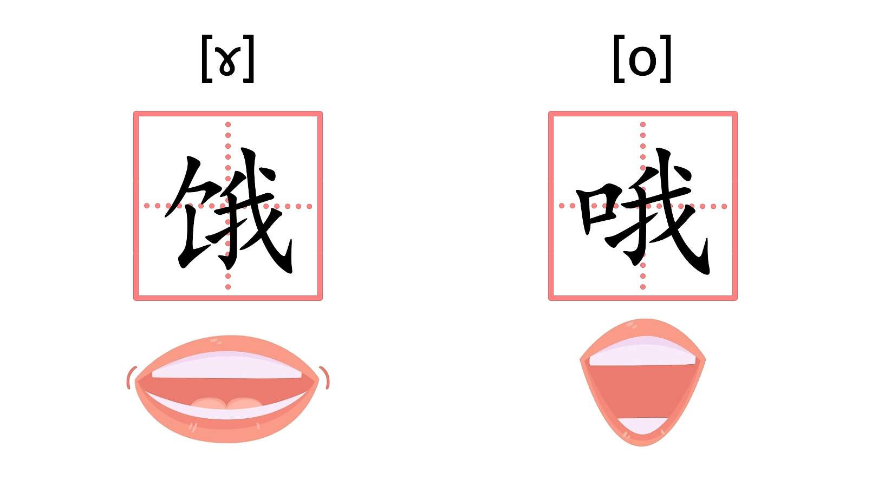

# P6 元音图

**生词**

(1) quadrilateral `/ˌkwɑdrɪ'lætərəl/` -adj.四边(形)的  -n.四边形
- vowel`/'vaʊəl/` quadrilateral 元音四边形。

咱们之前说，**圆唇度(roundness)**，**舌位的高低(height)**，**舌位的前后(backness)**, 就是影响元音的三要素。那怎么样才能直观的用视觉的方式把这三要素表现出来，从而能够更好更精确的学习和纠音呢? 

这就要用到元音图了(vowel diagram 或 vowel chart`/tʃɑːrt/`)。

咱们可以把元音发音时，感知到的舌位的高低和前后，标注在一个上大下小的元音四边形(vowel quadrilateral^(1)^) 内。
- 舌位**高**而**前**的元音，比如咱们之后要讨论的`/i:/`，可以标注在四边形左上方；
- 舌位**高**而**后**的元音，比如咱们之后要讨论的 `/uː/`，可以标注在这个四边形右上方；
- 舌位**低**而**前**的元音，比如咱们之后要讨论的 `/æ/`，可以标注在这个四边形的左下方；
- 舌位**低**而**后**的元音，比如咱们之后要讨论的 `/ɑː/`，可以标注在这个四边形的右下方。

而这个四边形之所以上大下小，是因为高元音舌位横向（前后）的差别。（比如 `/iː/` 和 `/uː/` 的舌位横向差别）要大于低元音舌位横向（前后）的差别（比如`/æ/` 和 `/ɑː/` 的横向差别）。

好，舌位的高低和前后这两个元音因素可以很直观的标注，那么元音的圆唇度呢？没什么特别好的方法，咱们只能依照惯例把同一个舌位上的不圆唇的元音标注在前，而把圆唇的元音标注在后。

比如咱们之前提到的普通话，离(lí)的韵母不圆唇，驴(lǘ)的韵母圆唇，两者舌位一样，分别是拼音（i）和（ü），

对应国际音标 [i] 和 [y]，就可以这样标注在元音图上。

再比如普通话的 "饿(è)" 和 "哦(ò)" 即拼音（e）和（o），对应国际音标 [ɣ] 和 [o]。

它们两者的区别也仅仅是圆唇度，可以标注在原音图的这个位置上。

英语兔我在这里要特别提一下，咱们的口腔可不是真的长得和一个四边形一样，所以原音图上的各个位置是咱们所 "感知到" 的元音舌位，是抽象的，并不是口腔中实际的舌位。

所以 "前后高低" 更准确说只是描述元音之间的相互关系，以及 "听觉感知上的" 音质。

更理论上来说，元音图真正描述的是各元音在声学上所讨论的基础频率的第一共振峰(first formant)在纵轴上的位置和第二共振峰(second format)在横轴上的位置。学术界现在一般也用这两个共振峰来描述元音音质。

不过，咱们这里毕竟不是做学术研究，所以英语兔我就不展开讲了。

基于学习语音和纠音的需求，咱们就粗略把原音图理解为所谓的 "前、后、高、低、圆唇" 的标注就好。

好，总结一下，元音图可以让我们比较元音的三要素，即：舌位高低，舌位前后和圆唇度，虽然它并不和人类口腔完全对应，但他能抽象的描述咱们感知到的元音，并帮助咱们调整纠正自己的元音发音，所以元音图对元音的学习至关重要。