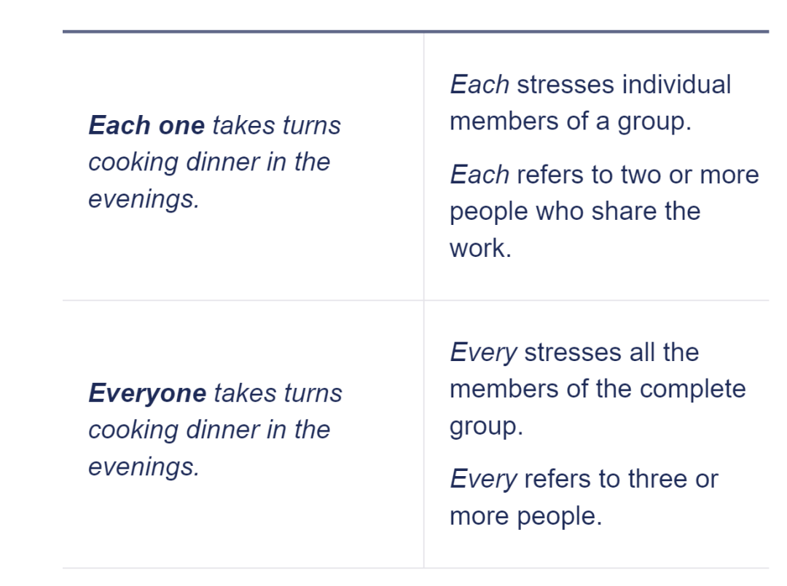

# 英语语法

**英语语法学习原则**, 总结来说: **一定要有语法大系统, 大框架**; **借助语法书, 过一遍**; 不能鼠目寸光, 背诵一个语法小点, 捡芝麻丢西瓜.

## ▲ 祈使句

**例句：Fill the bottle with water.**

ChatGPT 4:

句子 "Fill the bottle with water." 没有问题，它是一个祈使句。在英语中，祈使句用来发命令、提出请求或给予指示，其特点是动词原形开头，主语（通常是第二人称“you”）通常被省略。

在这个例子中：

- **Fill** 是动词原形，直接用于发出命令或请求。
- 省略的主语是 "you"（你），这是祈使句的常见特点，即主语不明显地出现在句子中，但意指被命令或请求的人。
- **the bottle** 是宾语，指明要被填满的对象。
- **with water** 是短语，说明用什么来填满瓶子。

所以，虽然在正常陈述句中动词不能直接做主语，但在祈使句中，动词原形开头是标准结构，用来表示命令、请求或指示。因此，"Fill the bottle with water." 是完全正确和符合语法的祈使句。

> 祈使句是用来**发出命令**、**请求**、**建议**或**指示**的句型。它们的主要特点是**直接表达说话者的意图，让听者做某事**。以下是祈使句的一些详细特点和用法：
>
> ### 1. 结构
>
> - **动词原形开头**：祈使句通常以动词的原形开头，省略主语。
> - **省略的主语**：祈使句的主语通常是 “you”，但在句子中通常省略。例如，在句子 "Open the door."（打开门。）中，实际的含义是 "You open the door."，但 "You" 被省略了。
>
> ### 2. 用途
>
> - **发出命令或指示**：如 "Stop talking."（停止说话。）
> - **提出请求**：如 "Please pass the salt."（请递一下盐。）
> - **给出指示或方向**：如 "Turn left at the corner."（在拐角处左转。）
> - **提供建议**：如 "Have a break."（休息一下。）
>
> ### 3. 添加礼貌性
>
> - 在祈使句前后添加 “please” 可以使命令听起来更礼貌。例如，"Please sit down."（请坐下。）
>
> ### 4. 祈使句的否定形式
>
> - 通过在动词前加 "do not" 或 "don't" 来形成否定祈使句。例如，"Don't touch that."（不要触摸那个。）
>
> ### 5. 强调或紧急情况
>
> - 有时为了强调或表示紧急情况，祈使句可以加上 "do" 在句首。例如，"Do come in!"（请进来！）
>
> ### 6. 使用感叹号或句号
>
> - 祈使句可以以感叹号结束，以表示强烈的情感或紧急命令，也可以用句号结束，表示更平静的命令或请求。
>
> 祈使句是英语中非常直接和功能性的句型，广泛用于日常交流中，以表达命令、请求、建议或指示。

## ▲ in, on, at 详细讲解

笔记来源统计：

1. 哥伦布语法视频
2. 问下 chatGPT 4o
3. 

**例句：They spent the afternoon on the beach.**

ChatGPT 4:

在英语中，介词 "on" 和 "at" 在描述地点时的用法可以有细微的差别，这些差别通常与所指地点的具体性和感知的焦点有关。

- **"on the beach"**：使用 "on" 通常指在海滩的沙子上，强调的是海滩作为一个具体的、可以接触到的表面。当使用 "on" 时，往往强调的是海滩这个地方本身，可能涉及到在沙滩上行走、晒太阳、游泳等活动。

- **"at the beach"**：使用 "at" 通常指的是海滩这个地点，但感知上更加宽泛，不特指沙滩的表面，而是整个海滩区域或环境。使用 "at" 时，往往指的是在海滩区域的活动或经历，可能包括在附近的商店逛街、在海滩边的餐厅吃饭等。

尽管两个句子中的意思非常相近，"on the beach" 与 "at the beach" 的使用差别反映了说话者对地点的不同感知和侧重。总的来说，这种差别并不会导致理解上的大问题，因为在许多情况下，这两个短语可以互换使用。然而，微妙的区别在于个人如何想要表达他们在海滩的经历的具体性和范围。  -- ChatGPT 4.0

### ChatGPT 4o

> Added: 2024.06.04
>
> 当然可以。英语中的介词 "in," "on," 和 "at" 用于表示时间和地点。它们的使用有一些规则，但也有一些例外。下面我会详细讲解每个介词的用法，并列出它们之间的区别。
>
> ### 1. "In" 的用法
>
> | 用法     | 表达                   | 示例                                                         |
> | -------- | ---------------------- | ------------------------------------------------------------ |
> | 时间     | 年份、月份、季节、世纪 | in 2024,  in June`/dʒuːn/`,  in summer,  in the 21st century |
> |          | 长时间段               | in the morning,  in the afternoon,  in the evening           |
> | 地点     | 大范围的区域           | in a city,  in a country,  in a neighborhood^(1)^            |
> |          | 封闭或半封闭空间       | in a room,  in a building,  in a car                         |
> | 其他用法 | 表示某个状态或情境     | in love,  in trouble,  in a good mood                        |
>
> (1) “in a neighborhood” 是表示一个相对较大的区域，但它的范围并不如城市或国家那么大。通常用 “in” 来表示相对较大的区域或封闭的空间，具体解释如下：
>
> - **Neighborhood**（邻里、社区）：指一个相对较小的社区或街区，是比城市小但比具体街道大的一块区域。
> - 使用 "in" 是因为我们把社区视为一个整体的区域，虽然它比城市或国家小，但仍然是一个较大的、相对封闭的区域。
>
> **例子**
>
> - **I live in a quiet neighborhood.** 我住在一个安静的社区。
> - **There are many parks in this neighborhood.** 在这个社区里有很多公园。
>
> **为什么使用 "in"**
>
> - **区域感**：社区（neighborhood）虽然比城市小，但仍然是一个较大的、相对明确的区域。
> - **封闭空间**：社区的感觉类似于一个封闭的空间，尽管它并没有实际的围墙。
>
> ### 2. "On" 的用法
>
> | 用法     | 表达         | 示例                                 |
> | -------- | ------------ | ------------------------------------ |
> | 时间     | 具体的日子   | on Monday, on Christmas Day          |
> |          | 特定的日期   | on June 4th, on New Year’s Eve       |
> | 地点     | 表面         | on the table, on the wall            |
> |          | 公共交通工具 | on a bus, on a train, on a plane     |
> |          | 某条街道     | on Main Street, on Oxford Street     |
> | 其他用法 | 与技术相关   | on the internet, on the phone, on TV |
>
> ### 3. "At" 的用法
>
> | 用法     | 表达               | 示例                                            |
> | -------- | ------------------ | ----------------------------------------------- |
> | 时间     | 具体的时间点       | at 5 o’clock, at noon, at midnight              |
> |          | 节假日或时刻       | at Christmas, at Easter, at the moment          |
> | 地点     | 具体的地点         | at the bus stop, at the entrance, at the corner |
> |          | 活动地点           | at a concert, at a party, at a meeting          |
> | 其他用法 | 表示某个状态或情境 | at risk, at war, at peace                       |
>
> ### 区别
>
> 1. **时间**
>     - **"in" 用于较长的时间段。**
>     - **"on" 用于具体的日子或日期。**
>     - **"at" 用于具体的时间点。**
>
> 2. **地点**
>     - **"in" 用于较大的区域或封闭空间。**
>     - "**on" 用于表面、公共交通工具或街道。**
>     - **"at" 用于具体的地点或活动地点。**
>
> ### 示例总结
>
> - **时间**
>
>     - "in the morning," "on Monday," "at 5 o'clock"
>
> - **地点**
>
>     - "in New York," "on the table," "at the door"
>
>         - > "At the door" 的意思是“在门口”或“在门边”。使用 "at" 是因为 "at" 用于表示具体的位置或地点。具体来说，"at" 表示某个点或位置，不强调它的内部或表面。
>             >
>             > 在这种情况下，"at the door" 强调的是人在门口的具体位置，而不是在门的里面（用 "in"）或在门的表面上（用 "on"）。
>             >
>             > ###### 例句
>             >
>             > - **Someone is at the door.** 有人在门口。
>             >   
>             > - **I'll meet you at the door.** 我会在门口见你。
>             >
>             > ##### 为什么用 "at"
>             >
>             > (1) **具体位置**：门口是一个具体的位置，可以用 "at" 来表示这个特定的点。
>             >
>             > (2) **活动地点**：门口可以被视为一个活动的地点，比如迎接客人或离开房间。
>
> 这些规则可以帮助你更好地理解和使用 "in," "on," 和 "at"。不过，记住还有一些例外情况，使用时要根据具体语境来判断。希望这些解释对你有所帮助！
>
> 
>
> Ask： GPT, 你上面说的这些例外情况你可以给我讲解一下吗？
>
> ChatGPT： 好的，我会详细讲解一些使用 "in," "on," 和 "at" 的例外情况。虽然有一般的规则，但有些情况确实比较特殊，需要根据具体语境来判断。
>
> ### "In" 的例外情况
>
> 1. **交通工具**
>    - 通常我们用 "on" 表示在交通工具上，但 "in" 用于小型封闭交通工具，如汽车。
>    - 例子：in a car, in a taxi
>
> 2. **表达时间的某些固定短语**
>    - 例子：in time（及时）, in the end（最终）
>
> ### "On" 的例外情况
>
> 1. **交通工具**
>    - "On" 用于大型交通工具，如火车、公共汽车、飞机、船。
>    - 例子：on a bus, on a train, on a plane, on a ship
>
> 2. **表达日期的某些固定短语**
>    - 例子：on time（准时）, on a cold winter night（在一个寒冷的冬夜）
>
> 3. **表示某些情况下的表面或位置**
>    - 例子：on the phone（在电话上）, on the internet（在互联网上）
>
> ### "At" 的例外情况
>
> 1. **活动或事件**
>    - 用于表示在某个活动或事件上，而不是特定的地点。
>    - 例子：at a party, at a concert, at a meeting
>
> 2. **表示某些固定的短语**
>    - 例子：at the moment（此刻）, at work（在工作中）
>
> ### 具体例子和解释
>
> 1. **"In" 的例外情况**
>    - 例子：She is in a car. （她在车里。）
>    - 解释：尽管“在车上”是一个封闭空间，使用 "in" 更为合适。
>
> 2. **"On" 的例外情况**
>    - 例子：He is on a bus. （他在公共汽车上。）
>    - 解释：对于大型交通工具，使用 "on" 来表示。
>
> 3. **"At" 的例外情况**
>    - 例子：I will meet you at the party. （我将在派对上见你。）
>    - 解释：尽管派对可能在某个具体的地点，"at" 更强调活动本身。
>
> 这些例外情况表明，虽然有一般规则，但使用这些介词时需要根据具体语境进行调整和判断。如果你有更多关于特定情况的疑问，请随时告诉我！

> ### 状语从句
>
> 状语从句是一个从句（状语从句必须是一个句子，至少包含主语和谓语两部分。但也是一个不完全的句子，不能独立成句），它在（复合）句子中作为状语存在，用来修饰主句中的动词、形容词、副词或整个句子，提供关于动作发生的时间(when, before, after ...)、地点(where, wherever)、原因(because, since,  as ...)、目的(so that, in order that ...)、条件、方式或程度等方面的信息。状语从句根据其所提供的信息类型，可以分为几种不同的类别，例如时间状语从句、地点状语从句、原因状语从句等。
>
> #### 1. 时间状语从句
>
> | 引导词 | 发音        | 词类 & 汉语意思   | 语法                               | 示例                                                         |
> | ------ | ----------- | ----------------- | ---------------------------------- | ------------------------------------------------------------ |
> | when   | `/wɛn/`     | conj. 当…时       | 描述主句中的 动作发生的时间。 | When the sun sets, the birds return to their nests.  (当太阳下山时，鸟儿回到它们的巢穴。) |
> | as     | `/æz/`      | conj. 当…时；因为 | 同上                               | As I was watching, the bird flew away.  (当我在看的时候，鸟飞走了。) |
> | before | `/bɪˈfɔːr/` | conj. 在…之前     | 同上                               | Finish your homework before you go out.  (在你出去之前完成你的作业。) |
> | after  | `/ˈæftər/`  | conj. 在…之后     | 同上                               | After the movie ended, we went for dinner.  (电影结束后，我们去吃晚饭。) |
> | while  | `/waɪl/`    | conj. 当…时；虽然 | 同上                               | While he was sleeping, the phone rang.  (他睡觉的时候，电话响了。) |
> | since  | `/sɪns/`    | conj. 自从        | 同上                               | She hasn't been seen since yesterday.  (自从昨天以来，她就没有出现过。) |
> | until  | `/ənˈtɪl/`  | conj. 直到…为止   | 同上                               | Wait here until I come back.  (在这里等着，直到我回来。) |
> | once   | `/wʌns/`    | conj. 一旦        | 同上                               | Once you finish your homework, you can watch TV.  (一旦你完成了作业，你就可以看电视。) |
>
> #### 2. 地点状语从句
>
> | 引导词   | 发音          | 词类 & 汉语意思  | 语法                               | 示例                                                         |
> | -------- | ------------- | ---------------- | ---------------------------------- | ------------------------------------------------------------ |
> | where    | `/wɛər/`      | conj. 在…地方    | 描述主句中的 动作发生的地点。 | He always feels happy where there is sunshine.  (在有阳光的地方，他总是感到快乐。) |
> | wherever | `/wɛərˈɛvər/` | conj. 无论在哪里 | 同上                               | You can find beauty wherever you look.  (无论你看向哪里，你都能发现美。) |

> #### 3. 原因状语从句
>
> | 引导词   | 发音        | 词类 & 汉语意思  | 语法                                     | 示例                                                         |
> | -------- | ----------- | ---------------- | ---------------------------------------- | ------------------------------------------------------------ |
> | because  | `/bɪˈkɔːz/` | conj. 因为       | 提供主句中的 动作发生的原因或理由。 | Because it was raining, we cancelled the picnic.  (因为下雨，我们取消了野餐。) |
> | since    | `/sɪns/`    | conj. 既然；因为 | 同上                                     | Since you are not interested, we will not discuss it further.  (既然你不感兴趣，我们就不再进一步讨论了。) |
> | as       | `/æz/`      | conj. 因为       | 同上                                     | As he was not feeling well, he stayed at home.  (因为他感觉不舒服，所以他呆在家里。) |
> | now that | `/naʊ ðæt/` | conj. 既然       | 同上                                     | Now that we have finished the project, we can relax.  (既然我们已经完成了项目，我们可以放松一下了。) |

> #### 4. 目的状语从句
>
> | 引导词        | 发音               | 词类 & 汉语意思 | 语法                             | 示例                                                         |
> | ------------- | ------------------ | --------------- | -------------------------------- | ------------------------------------------------------------ |
> | so that       | `/səʊ ðæt/`        | conj. 以便      | 描述主句 动作的目的或意图。 | He whispered so that he would not disturb the others.  (他轻声说话，以免打扰别人。) |
> | in order that | `/ɪn ˈɔːrdər ðæt/` | conj. 为了      | 同上                             | He left early in order that he could catch the train.  (他早早离开，为了赶上火车。) |

> #### 5. 结果状语从句
>
> | 引导词      | 发音         | 词类 & 汉语意思   | 语法                             | 示例                                                         |
> | ----------- | ------------ | ----------------- | -------------------------------- | ------------------------------------------------------------ |
> | so...that   | `/səʊ ðæt/`  | conj. 如此…以至于 | 描述主句 动作的结果或后果。 | He ran so fast that he won the race.  (他跑得如此之快以至于赢得了比赛。) |
> | such...that | `/sʌtʃ ðæt/` | conj. 如此…以至于 | 同上                             | It was such a hot day that we decided to stay indoors.  (天气如此炎热以至于我们决定待在室内。) |

> #### 6. 条件状语从句
>
> | 引导词        | 发音               | 词类 & 汉语意思 | 语法                                 | 示例                                                         |
> | ------------- | ------------------ | --------------- | ------------------------------------ | ------------------------------------------------------------ |
> | if            | `/ɪf/`             | conj. 如果      | 描述主句 动作发生的条件或假设。 | If it rains, the event will be cancelled.  (如果下雨，活动将被取消。) |
> | unless        | `/ənˈlɛs/`         | conj. 除非      | 同上                                 | You will not succeed unless you work harder.  (除非你更加努力，否则你不会成功。) |
> | provided that | `/prəˈvaɪdɪd ðæt/` | conj. 只要      | 同上                                 | ou can go out provided that you finish your homework.  (只要你完成了作业，你就可以出去。) |
> | as long as    | `/æz lɒŋ æz/`      | conj. 只要      | 同上                                 | As long as you keep trying, you will eventually succeed.  (只要你坚持尝试，你最终会成功。) |

> #### 7. 方式状语从句
>
> | 引导词    | 发音       | 词类 & 汉语意思 | 语法                                     | 示例                                                         |
> | --------- | ---------- | --------------- | ---------------------------------------- | ------------------------------------------------------------ |
> | as        | `/æz/`     | conj. 像…一样   | 描述主句中的 动作发生的方式或状态。 | He acted as if nothing had happened.  (他表现得好像什么都没发生过一样。) |
> | as if     | `/æz ɪf/`  | conj. 好像      | 同上                                     | She sings as if she were a professional.  (她唱歌就像是个专业歌手一样。) |
> | as though | `/æz ðoʊ/` | conj. 好像      | 同上                                     | He talks as though he knows everything.  (他说话的样子好像他知道一切。) |

> #### 8. 让步状语从句
>
> | 引导词      | 发音           | 词类 & 汉语意思 | 语法                                           | 示例                                                         |
> | ----------- | -------------- | --------------- | ---------------------------------------------- | ------------------------------------------------------------ |
> | although    | `/ɔːlˈðoʊ/`    | conj. 尽管      | 描述与主句中的 情况相对立或相矛盾的情况。 | Although it was raining, the game continued.  (尽管下雨，比赛还是继续了。) |
> | though      | `/ðoʊ/`        | conj. 虽然      | 同上                                           | He is very friendly, though a bit shy.  (他非常友好，虽然有点害羞。) |
> | even though | `/ˈiːvən ðoʊ/` | conj. 即使      | 同上                                           | Even though he was tired, he kept working.  (即使他很累，他还是继续工作。) |
> | whereas     | `/wɛərˈæz/`    | conj. 然而      | 同上                                           | She is very outgoing, whereas her brother is shy.  (她非常外向，然而她的兄弟很害羞。) |
> | while       | `/waɪl/`       | conj. 虽然      | 同上                                           | While I enjoy hiking, I dislike camping.  (虽然我喜欢远足，我不喜欢露营。) |

>| 类别         | 常见引导词                                         | 语法                                     | 示例                                                         |
>| ------------ | -------------------------------------------------- | ---------------------------------------- | ------------------------------------------------------------ |
>| 时间状语从句 | when, as, before, after, while, since, until, once | 描述主句中的动作发生的时间。             | When the sun sets, the birds return to their nests.  (当太阳下山时，鸟儿回到它们的巢穴。) |
>| 地点状语从句 | where, wherever                                    | 描述主句中的动作发生的地点。             | He always feels happy where there is sunshine.  (在有阳光的地方，他总是感到快乐。) |
>| 原因状语从句 | because, since, as, now that                       | 提供主句中的动作发生的原因或理由。       | Since it was raining, we cancelled the picnic`/'pɪknɪk/`.  (由于下雨，我们取消了野餐。) |
>| 目的状语从句 | so that, in order that                             | 描述主句动作的目的或意图。               | He whispered so that he would not disturb the others.  (他轻声说话，以免打扰别人。) |
>| 结果状语从句 | so...that, such...that                             | 描述主句动作的结果或后果。               | He ran so fast that he won the race.  (他跑得如此之快以至于赢得了比赛。) |
>| 条件状语从句 | if, unless, provided that, as long as              | 描述主句动作发生的条件或假设。           | If it rains, the event will be cancelled.  (如果下雨，活动将被取消。) |
>| 方式状语从句 | as, as if, as though                               | 描述主句中的动作发生的方式或状态。       | She danced as if no one was watching.  (她跳舞就像没有人在看一样。) |
>| 让步状语从句 | although, though, even though, whereas, while      | 描述与主句中的情况相对立或相矛盾的情况。 | Although it was raining, the game continued.  (尽管下雨，比赛还是继续了。) |

## ▲ 英语固定搭配

*Added: 2024.01.24*

**Source: ChatGPT 4.0 - InfoCream**

明白了，我会为每个类别列出 20 个常见的英语固定搭配。这些搭配涵盖了不同的日常用语和表达方式。

### 动词 + 名词

| 固定搭配                         | 意义             |
| -------------------------------- | ---------------- |
| make a decision                  | 做决定           |
| take a break                     | 休息一下         |
| give a presentation`/'kwɛstʃən/` | 进行演讲         |
| pay attention                    | 注意             |
| ask a question                   | 提问             |
| tell a story                     | 讲故事           |
| offer`/ˈɑːfər/` an apology       | 道歉             |
| take a chance                    | 冒险             |
| make a difference                | 有影响，产生变化 |
| do homework                      | 做家庭作业       |
| keep a promise                   | 守承诺           |
| have a look                      | 看一看           |
| take a picture                   | 拍照             |
| save time                        | 节省时间         |
| make a mistake                   | 犯错             |
| set a record                     | 创纪录           |
| break a record                   | 打破纪录         |
| follow advice                    | 遵循建议         |
| lead a team                      | 领导一个团队     |
| win a prize                      | 获奖             |

### 形容词 + 名词

| 固定搭配        | 意义       |
| --------------- | ---------- |
| heavy rain      | 大雨       |
| strong coffee   | 浓咖啡     |
| high quality    | 高质量     |
| full attention  | 充分的注意 |
| hard work       | 艰苦的工作 |
| long distance   | 长距离     |
| short break     | 短暂休息   |
| great deal      | 大量       |
| wide range      | 广泛的范围 |
| deep sleep      | 深度睡眠   |
| serious problem | 严重问题   |
| big surprise    | 大惊喜     |
| small amount    | 小量       |
| young age       | 年轻时     |
| cold weather    | 寒冷的天气 |
| hot temperature | 高温       |
| public place    | 公共场所   |
| private life    | 私生活     |
| important role  | 重要角色   |
| difficult task  | 困难的任务 |

### 名词 + 名词

| 固定搭配               | 意义       |
| ---------------------- | ---------- |
| traffic jam`/dʒæm/`    | 交通堵塞   |
| junk food              | 垃圾食品   |
| peace talks            | 和平谈判   |
| role model             | 榜样       |
| time limit             | 时间限制   |
| dress code             | 着装规定   |
| heart` /hɑːrt/` attack | 心脏病发作 |
| team member            | 团队成员   |
| family member          | 家庭成员   |
| book cover             | 书封面     |
| water bottle           | 水瓶       |
| coffee shop            | 咖啡店     |
| business trip          | 商务旅行   |
| shopping mall          | 购物中心   |
| action plan            | 行动计划   |
| mobile phone           | 手机       |
| bank account           | 银行账户   |
| car accident           | 车祸       |
| health insurance       | 健康保险   |
| climate change         | 气候变化   |

### 副词 + 形容词

| 固定搭配                 | 意义           |
| ------------------------ | -------------- |
| highly likely            | 非常可能       |
| fully aware              | 充分意识到     |
| deeply concerned         | 深切关心       |
| completely different     | 完全不同       |
| strongly believe         | 强烈认为       |
| widely known             | 广为人知       |
| seriously injured        | 严重受伤       |
| closely related          | 密切相关       |
| badly hurt               | 严重受伤       |
| highly successful        | 非常成功       |
| extremely important      | 极其重要       |
| clearly stated           | 明确表述       |
| perfectly clear          | 完全清楚       |
| surprisingly easy        | 出乎意料地容易 |
| relatively small         | 相对较小       |
| absolutely necessary     | 绝对必要       |
| particularly interesting | 特别有趣       |
| generally accepted       | 通常被接受     |
| rapidly changing         | 快速变化       |
| equally important        | 同样重要       |

### 动词 + 副词

| 固定搭配   | 意义           |
| ---------- | -------------- |
| break down | 坏掉，出故障   |
| check out  | 结账离开；查看 |
| fill out   | 填写（表格等） |
| turn off   | 关闭           |
| give up    | 放弃           |
| look up    | 查找           |
| bring up   | 提出；抚养     |
| carry on   | 继续           |
| hold on    | 等一下；坚持   |
| turn up    | 出现；调高     |
| find out   | 发现           |
| pass away  | 去世           |
| show off   | 炫耀           |
| come back  | 回来           |
| go on      | 继续           |
| set up     | 建立；安排     |
| take off   | 起飞；脱下     |
| put away   | 放好；收起     |
| work out   | 解决；锻炼     |
| speak out  | 公开说出       |

## ▲ each 和 every 的区别

*Added: 2024.01.29* *ChatGPT 4 总结*

| 特点             | Each                                                         | Every                                                        |
| ---------------- | ------------------------------------------------------------ | ------------------------------------------------------------ |
| **数量区别**     | 用于两者或以上。                                             | 用于三者或以上。                                             |
| **强调点**       | 强调集体中的个体。                                           | 强调由个体组成的集体。                                       |
| **示例**         | I put a bracelet on each wrist.  （我在每个手腕上都戴了一只手镯。） 只有两个手腕，所以用 'each' | We enjoyed every second of the movie.  （我们享受了电影的每一秒。） 强调整部电影的每一秒 |
| **副词搭配**     | 不能与 'almost', 'practically', 'nearly' 等副词搭配。        | 可以与 'almost', 'practically', 'nearly' 等副词搭配。 例：Almost every car in the car park was new.  （停车场里几乎每辆车都是新的。） |
| **否定形式**     | 通常不与 'not' 搭配。而应使用 'not every'。 例：~~Not each student knew the answer.~~  （不是每个学生都知道答案。）错误用法。 | 使用 'not every'。 例：Not every child enjoyed the party.  （并不是每个孩子都喜欢这个派对。） |
| **介词搭配**     | 'each of + 人称代词' 或 'each of + 定冠词 + 名词复数'。 例：Each of the **students** <u>was</u> holding a book.  （学生们每个人都拿着一本书。） | 'every one of + 人称代词' 或 'every one of + 定冠词 + 名词复数'。 例：Every one of the **tourists** <u>has</u> a bag.  （游客们每个人都有一个包。） |
| **谓语动词形式** | 谓语动词使用第三人称单数形式。 例：Each of us <u>has</u> a bicycle.  （我们每个人都有一辆自行车。） | 谓语动词使用第三人称单数形式。 例：Every one of us <u>is</u> insured.  （我们每个人都有保险。） |

> 笔记来源：https://mp.weixin.qq.com/s/n_gJ3LJbkL_pVgbN4rR4cg
>
> 原文如下：
>
> ### 英文写作什么时候用each，什么时候用every？
>
> 原创 魏剑峰 [英文悦读](javascript:void(0);) *2024-01-26 11:21* *发表于广东*
>
> 英语写作中越常见的词越要注意，因为它们用法众多而且非常灵活，稍微不注意就容易用错。比如前几天写作社群里面有同学提到了两个单词：什么时候用each，什么时候用every？
>
> 这两个单词在一些场合是能够互换的，不过它们存在一些区别。具体来看，each指代的是**两者或两者以上**的事物，而every指的是三者或三者以上的事物，因此在表示“两者之一”时只能用each。比如有一个经典的例子：
>
> I put a bracelet on _____ wrist. (each/every) 
>
> 句子只能填each，因为人只有两个手腕。又比如：She has a birthmark on each ankle. 这里用each也是因为人只有两个脚踝。
>
> 除了表示数量的差异，each通常强调集体中的个体，而every强调的是由个体组成的集体。举个剑桥词典里面的例子：
>
> (1) Each one takes turns cooking dinner in the evenings.
>
> (2) Everyone takes turns cooking dinner in the evenings.
>
> 第一个句子相当于“每个人在晚上轮流做饭”，它强调的是个体。第二个句子相当于“所有人在晚上轮流做饭”，强调“集体”。
>
> 
>
> 又比如：We enjoyed every second of the movie. 句子实际上等同于：We enjoyed **the entire** movie. 因为every second of the movie强调的是由每一秒组成的整部电影。
>
> 除此之外，almost, practically以及nearly这几个常见的副词只能跟every一起用，比如我们可以说：Almost every car in the car park was new. 但不能说：Almost each car in the car park was new.
>
> Each也不能和not搭配，写成not each，而应该写成not every，比如：Not every child enjoyed the party.
>
> 在介词使用上，each的搭配是"each of+人称代词"或者"each of+定冠词+名词复数"，而every的搭配是"every one of+人称代词"或者"every one of+定冠词+名词复数"。
>
> 同时，each of XX或者every one of XX后面的谓语动词都用第三人称单数形式。比如：
>
> (1) Each of the students **was** holding a book.
>
> (2) Every one of the tourists **has** a bag.
>
> (3) Each of us **has** a bicycle.
>
> (4) Every one of us **is** insured. (我们每个人都有保险。)
>
> 这两个搭配在使用的时候要特别留意。

## 待做筆記

### (1) 哥伦布老师的：look, see, watch 讲解

### (2) 下面这个视频里：

#### 1、关于英语和汉语的表达习惯问题，第一句：

>  I wake up in the morning. 
>
>  早上我醒了。

这里有一个表达顺序的问题，汉语习惯（非必要）把时间、地点等先说出来，再说具体的事情，比如说：“早上我醒了”、“我看了看手机上的时间”，但是英语习惯（非必须）把主要的信息先说出来，再说时间、地点等等；比如说：

> I look at the time on my phone. 
>
> 我看了看手机上的时间。

下面我们来对对比一下中英文的区别：

> 下午我醒了。
>
> I wake up in the afternoon.

> 我看了看墙上的时间。
>
> I look at the time on the wall.

#### 2、关于 look 后接介词的讲解：

第一：中文里的动词“看”可以直接接看的对象，比如说“看书、看电影”，但英语里都有特定的用法，叫：

> read book  “看书”
>
> watch movies “看电影” 等等

虽然 look 在英语里也表示 "看"，但如果要表示具体 "朝哪里看"，就要加上 at  "朝、朝哪"，而不能直接说 look 加看的东西，这一点要跟汉语的表达区分开。比如说：

> Look at that picture. 朝那副画那里看。

