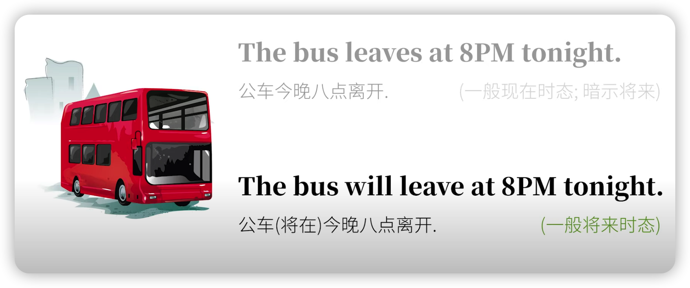

# Unit 12 -- 助动词和情态动词


<b style="color:red;"> Notice: 此章笔记为书本内容和英语兔老师视频的融合。</b>


> **英语语法: 助动词 (基本助动词, 情态(助)动词, 半助动词)   -- By 英语兔**
> 
> Youtube: https://www.youtube.com/watch?v=-mRlocpeYA8
>
> BiliBili: https://www.bilibili.com/video/BV1834y1r79u?spm_id_from=333.337.search-card.all.click


## New Words


## 1. 助动词

咱们之前在语法综述里提到，**任何整句都分为 主语(subject) 和 谓语(predicate`/ˈpredɪkət/ `)**，而谓语部分的核心是**谓语动词(predicate verbs)**，但是**谓语动词本身往往无法独立表达某些语法概念，需要其他词的辅助，而这些来辅助构成谓语但自己本身不能作谓语动词的词就是助动词**。

> Book:
>  
> 助动词是一类用来帮助其他动词构成谓语的动词。助动词本身没有具体词义，它们可以帮助其他动词构成不同的时态、语态、语气，或是构成疑问式及否定式。


听起来有点抽象，那咱们举个具体的例子，你应该已经知道动词有过去式、现在式和将来式。比如：

> 过去式：The rabbit ate`/eɪt/` a carrot. 兔子吃了根胡萝卜。

> 现在式：The rabbit eats carrots. 兔子吃胡萝卜。

> 将来式：The rabbit will eat a carrot. 兔子将吃根胡萝卜。

有没有意识到,  eat 这个动词本身有过去式变位 ate, 第三人称现在式变位 eats，但其实是并没有将来式变位的。

英语兔我再重复一遍，eat 来身是没有办法通过动词变位，即改变拼写来表达 "将来时" 的，eat 怎么才能表达 "将来时" 呢？

必须在前面加 will 来 "辅助" 完成表达，所以 will 在这里就是构成将来时的助动词，而助动词 will 本身是不能独立表达完整句意的：~~The rabbit will a carrot.~~  你肯定觉得哪里怪怪的，对不对？ 必须把实义动词加回来：The rabbit will **eat** a carrot. 这才对嘛。

你也许会反驳说，英语不用助动词也能表达将来吧。比如：

> The bus leaves at 8PM tonight. (公车今晚八点离开)。 

这么说没错，但是这种将来时间是隐含的意义。这句话还是一般现在时态，只不过暗示了将来，而其中的 Leaves 本身并不是将来时变位，真正的将来时还是：



所以你看到吗？助动词有两个基本特征：

- (1) 辅助主动词；

- (2) 不能向主动词那样单独作谓语动词。

那好，再看这句：

> The rabbit can kill a wolf. 兔子能杀死一只狼。

这里的 can 只是表达兔子有这一能力，并不是说兔子真的杀过或者会杀一只狼，对不对？不用 can 这个词, 就没法表达这个意思。所以 can 在这里还是辅助主动词 kill 的；同时，can 这个词自己也不能独立成句：~~The rabbit can a wolf.~~ 虽然看 can 也可以做实义动词表示 "把...放进罐头"，但兔子把狼装进罐头干嘛？过冬么？再说，这里的 can 要做谓语动词好歹也需要变位呀。

你可能意识到英语兔我要说什么了。那就是， 虽然 can 这样的词被很多语法体系归类为 "情态动词"，但是情态动词：

- (1) 起辅助主动词的作用;
- (2) 不能单独作谓语动词。

所以，说到底，can 这样的情态动词还是助动词的一种，也可称作**情态助动词**。

那么，**为什么有些语法体系把情态(助)动词单独归为和助动词并列的一类词？**：这是因为，**这些语法体系认为，助动词只起 "辅助" 作用，本身不该含有实际意义，而像 can 这样的含有实际意义的词应当被区分开来。** 这样说也并非没有道理。所以助动词和情态动词区分开来也不是不行，只不过基于 "是否辅助主动词来构成语法概念" 和 "是否能单独作谓语动词" 这两条，英语兔我更赞成把情态动词作为助动词的一类，咱们称呼他为 "情态动词" 或 "情态助动词" 都可以，只不过前一种叫法更传统一些，那咱们来快速分个类。


## 2. 助动词的分类

### 2.1 基本助动词

基本助动词只有三个：**be**, **do**, **have**.

这三个词在做助动词时本身是没有实际含义的，但是请注意，他们除了做助动词，本身还可以做实义动词，也就是可以单独做谓语动词：


**(1) be (存在)**

> To be or not be, that is the question. 存在还是毁灭，这是个问题。

**(2) do (做)**

> Just do it. 去做就对了。

**(3) have (有)**

> I hava a pen, I have an apple.

请一定要区分它们的助动词身份和实义动词身份。


### 2.2 情态助动词

情态助动词包括：**can/could, may/might, will/would, shall/should, must, ought to, dare/dared, need, used to**


这些词作为(情态)助动词，是也是有实际含义的，但是不能单独作谓语动词。 但是也要注意，他们中的一些也有实义动词的身份；比如咱们刚才提到 can 也能表示 "把...放进罐头"。当这些词作实义动词时，当然是可以单独做谓语动词的. 也请一定区分这两种身份。

另外，你需要意识到，could 实际上是 can 的过去式，might 是 may 的过去式，should 是 shall 的过去式。 英语初学者往往会认为这是六个完全不相干的词，其实并非如此，只是它们的含义有所不同。


### 2.3 半助动词

这类词比较多，既像主动词又像助动词，包括：

- be able to 
- be going to
- be about to
- had better
- ......
- 

你可能平时都不会觉得它们是助动词，但你只要想想咱们之前说的，助动词有两个基本特征：(1) 辅助主动词；(2) 不能向主动词那样单独作谓语动词。是不是就明白他们为什么是助动词了？

因为咱们不能说：

> ~~The rabbit is able to a carrot. (兔子能吃一根胡萝卜。)~~
> 
> ~~The rabbit is going to a carrot. (兔子将要吃一根胡萝卜。)~~
> 
> ~~The rabbit is about to a carrot. (兔子将要吃一根胡萝卜。)~~
> 
> ~~The rabbit had better a carrot. (兔子最好吃一根胡萝卜。)~~

而是必须在他们后面加上主主动词:

> The rabbit is able to eat a carrot. (兔子能吃一根胡萝卜。)
> 
> The rabbit is going to eat a carrot. (兔子将要吃一根胡萝卜。)
> 
> The rabbit is about to eat a carrot. (兔子将要吃一根胡萝卜。)
> 
> The rabbit had better eat a carrot. (兔子最好吃一根胡萝卜。)

而且他们也只是起辅助作用。


以上就是助动词的三大分类，和某些语法体系的分类会有些出入，但是英语我觉得怎么分类不是特别重要，你知道怎么一回事儿就好，这也并不影响咱们对概念的理解和应用，对不对？

接下来咱们助动词分类来具体说说他们的应用。


## 3. 助动词的应用

### 3.1 基本助动词的应用  (be, have, do)

> 参考另外一个视频：[英语语法: 16种时态终极详解 (合集)(看完就懂)](https://www.bilibili.com/video/BV1Sv411y7d8?spm_id_from=333.999.0.0)

仅有的 三个基本助动词 be, have, do 非常常见，它们也出现在咱们之前讲的

"时态"、[英语语法: 16种时态终极详解 (合集)(看完就懂)](https://www.bilibili.com/video/BV1Sv411y7d8?spm_id_from=333.999.0.0)

"被动"、[英语语法: 被动语态(被动句)](https://www.bilibili.com/video/BV1dr4y1K7uv?spm_id_from=333.999.0.0)

"强调"、[语法: 英语中的强调](https://www.bilibili.com/video/BV1WQ4y1o7KT?spm_id_from=333.999.0.0)

 等语法视频中，所以咱们这里就不过多讨论。

```md
常作助动词用的单词是 be, have 和 do,以及它们的各种形式：
(1) be： be, is, am, are, was, were, being, been.
(2) have: has, have, had, having.
(3) do: do, does, did.
```

#### 3.1.1  be

##### (1) be + (动词)现在分动，构成各种时态的进行时。
> ◆ **Are** they **playing** computer games? (他们正在玩电脑游戏吗？)  *现在进行时*

> ◆ They **were playing** football when it began to rain. (他们正在踢足球，突然下起雨来.) *过去进行时*

> ◆ They **will be having** a meeting at 9 o'clock tomorrow morning. (明天上午 9 点他们将在开会.) *将来进行时*

> ◆ It **has been raining** for several hours. (已经下了几个小时的雨了.) *现在完成进行时*

> The rabbit **is`/ɪz/`** eating a carrot. 兔子正在吃一根胡萝卜。


##### (2) be + 过去分词，构成各种时态的被动语态。
> ◆ Smoking **is not allowed** in the school. (学校里禁止吸烟.) *一般现在时的被动语态*

> ◆ A new hospital **is being build** across the street. (马路对面正在建一所新医院.) *现在进行时的被动语态*

> ◆ This is the girl who **was saved** by the police from the flood. (这就是那个被警察从洪水中救出的小姑娘.) *一般过去时的被动语态*

> ◆ This famous novel is said **to be made** into film. (据说这个著名的小说要被拍成电影.) *不定式的被动语态*

> The rabbit **was** eaten by the rabbit. 胡萝卜被兔子吃了。 助动词 be 变为 was 辅助构成被动语态。

##### (3) be + 动词不定式(be to do sth.): 表示计划好的将要发生的动作 (参见 Unit11: 动词时态中动词的一般将来时部分)。
> ◆ The new highway **is** **to be open** to traffic tomorrow. (那条新高速公路明天通车.)

> ◆ He told us that the sports meeting **was to be held** on September 29$^{th}$(twenty-ninth). 
>
> (他告诉我们运动会将在 9 月 29 日举行.)


#### 3.1.2  have
助动词 have 的主要用法：
##### (1) have + 过去分词，构成各种完成时态。
> ◆ He **has visited** the Great Wall. (他去过长城。) *现在完成时*

> ◆ **Have** you **been** to Beijing?  (你们去过北京吗?) *现在完成时*

> ◆ The train **had left** when I arrived at the station. (我到车站的时候，火车已经开走了.) *过去完成时*

> ◆ **Having won** the gold medals`*`, the athletes`*` were warmly welcomed at the airport.
> - `*` medal`/'mɛdl/` --n.奖牌；勋章
> - `*` athlete ` /ˈæθliːt/ & /'æθlit/` --n.运动员；田径运动员
> - 注:  the athletes were welcomed. 为上面的 (be + 过去分词，构成各种时态的被动语态)

> The rabbit **has** eaten a carrot. 兔子吃掉了根胡萝卜。 *have 变为 has 辅助构成现在完成时态。*

> ◆ The meeting **has been cancelled.** (那个会议被取消了.) *现在完成时的被动语态*
>


#### 3.1.3  do
助动词 do 的主要用法
##### (1) 帮助谓语动词构成疑问句。
> ◆ **Do** you always get up early? (你经常起床很早吗？)

> ◆ **Does** he work as a teacher? (他是当老师的吗？) *第三人称单数一般现在时，do 要写成 does*

> ◆ What **did** you do yesterday? (你昨天干什么了？)

> The rabbit **does** like coins. 兔子真的喜欢硬币。

##### (2) 帮助谓语动词构成否定句。
> ◆ We **don't** like him, for he always tells a lie. (我们不喜欢他，因为他总说谎。)

> ◆ He **didn't** come to the party, **did** he? (他没有参加晚会，是吧？)

> ◆ They **don't** like that film. (他们不喜欢那个电影。)

> The rabbit **does not** like freeloaders. 兔子不喜欢看视频白嫖的人。

##### (3) 构成祈使句的否定形式。
> ◆ **Don't** be so careless. (别那么粗心大意。) 

> ◆ **Don't** swim in the river. It's too dangerous. (别在河里游泳。太危险了。) 

##### (4) 用于加强句子的语气。
> ◆ **Do be** careful while crossing the street. (过街时一定要小心。) 

> ◆ I **do hope** I can see you in China soon. (我真希望能很快在中国见到你。) 

##### (5) 避免重复一个动词。在提到刚刚说过的一个动作时，用 do 代替。
> A: Do you like swimming? (你喜欢游泳吗？)
> 
> B: Yes, I **do**(= I like). (是的，我喜欢。) 

> ◆ He doesn't study English but I **do**(= I study). (他没学习英语，但我学英语。)

> ◆ Li Ming speaks good English. So **does** Zhang Hua.(= Zhang Hua speaks good English, too). (李明说一口很好的英语。张华也是。)

##### (6) 帮助构成倒装句。 
> ◆ **Never did he go back** to his hometown.(= He never went back...). (他再也没回过他的家乡。) 

> ◆ **Seldom does he go** shopping with his wife.(= He seldom goes...). (他很少跟他妻子去购物。)


### 3.2 情态(助)动词

情态动词是用来表示说话人对一个动作或状态的看法、态度，即：说话人认为某事 "可能"、"或许"、"应该" 或 "必须" 发生等。

情态动词和助动词一样，不能单独作谓语，没有**人称**和**数**的变化。

但是，情态动词有自己的词义，借助情态动词，可以表示出说话人的 "猜测、判断、允许、可以、指责、惊诧"、等多种情感和态度。

一些情态动词有过去式，但它们并不完全表示时间上的区别，而是表示某种语气。情态动词的否定形式一律是在其后直接加 not (ought to 是在 ought 后加)。将情态动词置于主语之前构成疑问句。

| 现在时 | can  | may | have / has to | will  | shall  | must | ought to | need | dare | used to |
| -----| ----- | ----- | ----- | ----- | ------ | ---- | -------- | ---- | ---- | ------- |
| **过去时** | could | might | had to  | would | should |      |      |     |    |       |

#### 3.1 can 和 could 的意义和用法
##### 3.1.1 表示能力。一般指体力、知识、技能等方面的能力。
> ◆ He **can** speak both English and French. (他英语和法语都能说。)

> ◆ **Can** you put this picture on the wall? (你能把这幅画挂到墙上去吗？)

> ◆ Most of young people **can** use the computer now. (现在大多数年轻人能使用计算机。)

> ◆ She said she **couldn’t** swim. (她说她不会游泳。)

> ◆ I **can’t** lift that box. (我提不动那个箱子。)

在表示能力方面，can和 be able to 的意思相同。但是，can 只有两种时态，现在时 can 和过去时 could，而 be able to 可以有多种时态，如：was/were able to (过去时)；will be able to(—般将来时)，等。

##### 3.1.2 表示由于客观原因而能够做某事的能力。
> ◆ I won't use this dictionary now. You **can** use it. (我现在不用这本字典，你可以用它。)

> ◆ Every one is here. We **can** begin our meeting. (大家都到了。我们可以开会了。)

> ◆ Jane **can't** come to the party, for she has gone to Shanghai on business. (珍妮不能来参加晚会，因为她去上海出差了。)

##### 3.1.3 表示许可。

在表示许可的意思时，can 和 may 的意思基本相同。只是 can 更多用于口语中，而 may 则比较正式，多出现于正式文体或比较客气的场合。

**(1) can 在肯定句中， 表示说话人允许、批准他人做某事。**

> ◆ You **can/may** sit here. (你可以坐在这儿。)

> ◆ He **can/may** go home now. (他现在可以回家了。)

> ◆ You **can** go swimming if you have finished your homework. (如果完成了作业，你就可以去游泳。)

**(2) can 用在否定句中，表示不允许做某事，甚至禁止做某事。**

> ◆ You **cannot** smoke here. (你不能在这儿吸烟。)

> ◆ Before the examination began, the teacher warned us that we **could not** use the cell phone. (考试开始前，老师告诫我们不许使用手机。)

> ◆ You **cannot** travel alone now because of your poor health. (因为健康状况不好，你现在不可以独自旅行。)


##### 3.1.4 can 用在疑问句中，表示征询听话人的许可。
> ◆ **Can/May** I help you? (我可以帮你吗？)

> ◆ A: **Can** I watch TV now? (我现在可以看电视吗？)
> 
>   B: No, you can't. (不行，你不可以看。)

> ◆ **Can** I borrow two books at a time? (我能一次借两本书吗？)


##### 3.1.5 用在否定句和疑问句中,表示惊异、怀疑、猜测或不相信等。

在这里，can 和 could 没有时间上的区别。用 could 时，语气较弱； 用 can 时，语气要更强一些。

> ◆ That **can't** be Tom. He went to London two weeks ago. (那不可能是汤姆。他两周前就去伦敦了。) *表示不相信*

> ◆ Who **can** it be? It is so late. (是谁呢？都这么晚了。) *表示惊异*

> ◆ How **could** you be so lazy? (你怎么能那么懒呢？) *表示惊异*

> ◆ He **couldn't** be over seventy. (他不可能有七十多岁。) *表示猜测*

can 和 could 后面可以接完成式 (can/could have done)或进行式 (can/could be doing)，表示对已经发生的事情或正在发生的事情的惊异、怀疑、猜测或不相信等。

> ◆ He **couldn't have gone** to New York. I met him in the reading room just now. (他不可能去了纽约。我刚才在阅览室见到他了。) *表示不相信*

> ◆ She **can't be working** at this hour. (这个时候，她不会是在工作。) *表示猜测* 


##### 3.1.6 could 除了代替 can，用在过去时的句子里，还可以表示语气委婉、礼貌 (此时，没有过去时的意思)。
> ◆ **Could** you help me with my English?  (你能帮我学习英语吗？)

> ◆ **Could** you show me the way to the post office?  (请告诉我去邮局的路好吗？)

> ◆ You **could** do it in another way.  (你可以换一种方法来做这件亨。)


#### 3.2 may 和 might 的意义和用法
##### 3.2.1  提出问题，询问某事是否可以做。
回答这类问题，可以用 Yes, you may. / No, you may not. 但更多的时候，要根据回答时的严厉或客气的程度，选用适当的句子。
> ◆ A: **May**  I use your desk? (我可以用一下你的桌子吗？)  *客气*
> 
> ◆ B: Yes, please. (请用吧。)

> ◆ A: **May** I smoke here? (我可以在这里抽烟吗？)
>
> ◆ B: No, please don’t. (不，请不要抽。)  *客气*
> 
> ​         No, you mustn't  (不，你不可以在这里抽烟。)  *严厉*

> ◆ A: **May** I play computer games after supper? (晚饭后我可以玩电脑游戒吗？)
>
> ◆ B: No, you may not. (不可以玩)*较严厉*
> 
>    ​         No, you'd better not. (最好不要玩。)  *较客气*

> ◆ He asked if he **might** leave an hour earlier. (他问他是否可以提前一小时离开。)

> ◆ A: **Might** I have a little more wine?  (我可以再要一点葡萄酒吗？)  *表示更礼貌，而不是表示过去时间*
>
> ◆ B: Certainly. (当然可以了。)

##### 3.2.2 表示允许做某事
> ◆ You **may** stay here for two days. (你可以在这里住两天。)

> ◆ You **may** come whenever you are free. (无论什么时候有空，你都可以来。)

> ◆ He told me that I **might** live with him when I studied in Beijing. (他说当我在北京学习时，可以跟他住在一起。)

> ◆ You **may not** make the same mistakes.(你不可以出同样的错误了。)
> - 表示某事不可以做，一般用 may not.

> ◆ You **must not/mustn't** do it again.(你一定不能再做那种事了。)
> - 但是要表示 "不可以" 或 "禁止" 做某事等强硬语气时，常用 must not/mustn't。

##### 3.2.3 表示可能要发生的事，或可能存在的情况，用 may 语气较为肯定；用 might 表示可能性较小。
> ◆ He **may** come tomorrow. (他明天可能会来。)

> ◆ Doctor Li **may** have gone to Hong Kong. (李医生可能去香港了。)

> ◆ He called that he **might** be late because of a traffic jam. (他来电话说，因为交通阻塞，他可能晚一点。)

> ◆ She **may** have some fever. (她可能发烧了。)  *语气较为肯定*

> ◆ She **might** have some fever. (她可能有点发烧。)  *语气不太肯定*

##### 3.2.4 **may** 可以构成表示祝愿的句子。
> ◆ **May** they live long! (视他们长寿！)

> ◆ Long **may** he live!  (愿他长寿！)

> ◆ **May** you be lucky！(视你好运！)


#### 3.3 must 和 have to 的意义和用法
##### 3.3.1 must 和 have to 表示 "必须"、"应当"。
一般情况下，二者可以互换使用。但是二者之间也有一定的区别：

在表示说话人的主观看法，即：说话人觉得自己 "必须" 或 "应当" 做某事时，用 must;

如果是外界的客观情况使说话人不得不去做某事，就只能用 "have to"。此时，二者不能互换。

> ◆ We **must/have to** get up early. (我们必须早起。)

> ◆ You **must/have to** finish your work today. (你今天必须完成你的工作。)

> ◆ The last bus has gone. We **have to** take a taxi. (末班车已经走了。我们只能乘出租车了。) 
>
>     *因为没有公共汽车了，所以不得不乘出租车。此时，不能用 must 替换*

##### 3.3.2 have to 可以有多种时态。
> ◆ You **have to** do it right now. (你现在必须做那件事。)

> ◆ He **has to** be there before 7 o'clock. (他必须7点前到那儿。)

> ◆ They **will have to** get up at 6 o'clock tomorrow morning. (他们明天早上必须在 6 点钟起床。)

> ◆ We **had to** stay in the office last night because of the snowstorm. (因为暴风雪，昨晚我们不得不待在
办公室里。)

##### 3.3.3 must 只有现在式，因此只能用来表示现在的情况。
在间接引语中，有时可以用 must 表示过去的情况，但用 have to 的过去式 had to 更好一些。

> ◆ You **must** give up smoking. (你必须成烟。)

> ◆ She asked whether she **must/had to** return this book within a week. (她问她是否必须在一周之内还这本书。)

> ◆ Tom, you **must** put away your books.  (汤姆、你必须把书收好。)

##### 3.3.4 must not/mustn't  表示 "不准, 禁止"。
> ◆ You **mustn't** go to the cyber(`/saɪbə` adj.(与)网络(有关)的) bar. (你一定不要去网吧。)

> ◆ You **mustn't** be cruel`/ˈkruːəl/` to animals. (你一定不能对动物那么残忍。)

> ◆ The magazines **mustn't** be taken out of the reading room. (杂志不许拿出间览室。)

##### 3.3.5 must 提出问题的肯定和否定回答
在回答由 must 提出的问题时，肯定回答用 must；

但是否定回答不能用 must not，而是用 need not/needn't，或是 don't have to，表示
"不必"。前面已经提到，mustn’t的意思是：一定不许。
> A: **Must** I return the book today? (我今天必须还这本书吗？)
> 
> B: Yes, you **must**. (是的，你必须还。)
> 
>    ​     No, you **needn't**(=you **don't have to**). (不，不必了。)

> A: **Must** I hand in my term paper this week? (我本周必须交学期论文吗？)
>
> B: Yes, you **must**. (是，你必须交。)
>
>    No, you **needn't**. You may hand it in next week.

##### 3.3.6 在肯定句中，must 可以表示一种 "判断"、"推测"。
**(1) "must + 动词原形" 表示对现在情况的判断、推测。** 

> ◆ That man **must be** over seventy years old. (那个人肯定有70多岁了。)

> ◆ You **must be** exhausted`/ɪɡ'zɔstɪd/`(adj) after a day's work. (一天工作后，你(现在)肯定很累了。)

**(2) "must have + 过去分词" 表示对过去发生过的情况的判断、推测。**

> ◆ The street is wet. It **must have rained** last night. (街道是湿的，昨晚肯定下过雨了。)

> ◆ How can you be late again? You **must have overslept**. (你怎么又迟到了？你肯定睡过头了。)

**(3) "must be + 现在分词" 表示对正在发生的情况的判断、推测。**

> ◆ Hurry up! They **must be waiting** for us at the gate. (快点，他们肯定在大门那里等我们了。)

> ◆ Don't interrupt him. He **must be studying** now. (不要打搅他。他现在肯定在学习呢。)


#### 3.4 ought to 的意义和用法
##### 3.4.1 ought to 是固定词组，表示**应该、应当做某事**，意思与 should 相近，只是表达的语气略重一点。

ought to的否定形式是将 not 置于 to 前: **ought not to**，而不能像其他情态动词一样将 not 写到后面：~~ought to not~~。

> ◆ You **ought to** pay more attention to your pronunciation. (你应该多加注意你的发音。)

> ◆ You **ought not to** sit here smoking. (你不应该坐在这儿抽烟。)

> ◆ You **ought not to** waste water like that. (你不应该那样浪费水。)

> ◆ A: **Ought I to** go? (我应当去吗？)
>
>   B: Yes, you **ought (to)**. (是的，你应该去。)

##### 3.4.2 02 ought to + have + 过去分词
"ought to + have + 过去分词"、表示过去应该已经做完某事，但实际上还未完成，有着很强的指责、批评的语气。意思与 should have done 结构相同，只是语气更重一些。

> ◆ You **ought to have come** earlier. (你应该早一点来。) *言外之意是：怎么来这么晚？*

> ◆ I **ought to have visited** them last week. But I was too busy. (我上周应该去看他们的。但我太忙了。) *实际上没去成

> ◆ You **ought not to have spent** too much time playing computer games. (你不应该花那么多时间玩电脑游戏。) *实际上花了太多时间玩电脑*

#### 3.5 shall 和 should 的意义和用法

shall 作助动词，表示将来时，只可以跟第一人称，但是作情态动词，可以跟第二、三人称，表示提出建议、征求意见，或命令等多种含义。
##### 3.5.1 shall 用在疑问句中
shall 用在疑问句中，表示征询对方的意见或指示(提供帮助，提出建议)，主要用于第一、三人称，通常译为 "...好吗？要不要...?"

> ◆ What **shall** I do to help you? (我能做什么来帮助你呢？)

> ◆ **Shall** he come to see you? （要不要他来看你？)

##### 3.5.2 shall 用在第二、三人称作主语的陈述句中
shall 用在第二、三人称作主语的陈述句中，表示说话者告诚、警告、命令、决心等意图，通常译为 "必须、应该或可以" 去做某事。

> ◆ He **shall** go with us. （他可以和我们去。)

> ◆ She **shall** not enter my room again. (她不许再进我的房间。)

> ◆ I think you **shall** do it. （我认为你应该做。) *表示非做不可*

##### 3.5.3 should 表示 "劝告，建议" 或有 "责任，义务" 去做某事，通常译为 "必须，应该"。意思与 ought to 相近。
> ◆ You **should** do as I told you. (你应该照我说的去做。)

> ◆ **Should** I do it again? （我是不是应该再做一次？)

> ◆ Children **should** obey their parents. (儿童应该服从他们的父母。)

##### 3.5.4 should + have + 过去分词
**"should + have + 过去分词"** 表示某事在过去应该做，但实际上没有做。它的否定句形式，即  **"should + not + have + 过去分词"** ，则表示做了一件不应该做的事。

> ◆ You **should have studied** English earlier. (你应该早一点学英语。) *实际上没有早点学*

> ◆ We **shouldn't have been** there. (我们真不应该去那儿。) *实际上去了*

> ◆ You **shouldn't have told** her about that thing. (你真不应该告诉她那件事。) *实际上已经告诉她了*

##### 3.5.5 should 用在一些表示 "命令，要求，建议" 的词后面的从句中，构成 "虚拟语气"。 如：

| suggest | demand<br />`/dɪ'mænd/` | advise<br />`/əd'vaɪz/` | inquire<br />`/ɪn'kwaɪr/` | propose <br>`/prə'poz/` | command |
| :----: | :----: | :----: | :----: | :--: | :--: |
| 建议 | verb.需要，需求；要求 | verb. 劝告，<br />忠告，建议 | verb. 询问，打听 | verb. 提议，建议<br /> noun. proposal | verb. 命令，下令 |
| **order** | **recommend** | **desire** | **request** | **intent** | **insist** |
| 命令 | 推荐 | 愿望 | 请求 | 打算 | 坚持 |

等。这类从句中的 should 可以省略。

> ◆ It is **required** that this work (**should**) be finished on time. (这项工作被要求按时完成。)

> ◆ It is **important** that you (**should**) practice spoken English. （练习口语是很重要的。)

> ◆ She **requires** that everyone (**should**) take part in the examination`/ɪg'zæmə'neʃən/`. (她要求大家都参加这个考试。)


#### 3.6 will 和 would 的意义和用法

##### 3.6.1 用在疑问句中，表示询问对方的意愿，向对方提出请求。

> ◆ **Will** you come to my office? (请你来我的办公室好吗？)

> ◆ **Will** you please show me the way to the library? (请告诉我去图书馆的路好吗？)

在这类句子中，用 would 比用 will 更加婉转、礼貌，丝亳没有表示过去时间的意思。

> ◆ **Would** you have something more to eat? (你是不是再吃点什么？)

> ◆ **Would** you please help me with my math? (请你帮我学习数学好吗？)

##### 3.6.2 表示 "感意做某事" 或 "决心做某事" ，可用于各种人称。在这类句子中，would 作为 will 的过去式，多用在从句中。

> ◆ I **will** tell you everything I know. (我愿意把我所知道的都告诉你。)
> 
> ◆ He said he **would** tell me everything he knew. (他说他要把他所知道的事都告诉我。)

> ◆ I **won’t** make the same mistake again. (我不会再犯同样的错误。)
>
> ◆ He promised that he **wouldn't** make the same mistake again. (他保证不再犯同样的销误了。)

> ◆ If you **will** help him, he is sure to pass this examination. (如果你愿意帮助他，他青定能考试及格。)
> 
> *作情态动词的 will 可以用于条件状语从句中，表示意愿，而不是时间*

##### 3.6.3 表示习惯性的动作或是一种倾向，通常译为 "常常，总是，习惯于"
> ◆ People **will** talk. (人们总是说三道四。)

> ◆ When he is in trouble, he **will** turn to his coach for help. (他有因难的时候，总是去我他的教练寻求帮助。)

> ◆ No matter what happened, he **wouldn't** give up his hope of going to college. (无论发生什么，他都没有放弃上大学的愿望。)

##### 3.6.4 would 表示过去经常性的动作。
> ◆  She **would** come to see us when we were in Beijing. (我们在北京时，她总是来看我们。)

> ◆  We **would** go swimming after school. (我们过去常常在放学后去游泳。)

##### 3.6.5 would 用在虚拟语气中。（参见UNIT14：虚拟语气)

> ◆  If I **were** you, I **would** go at once. (如果我是你，我立刻就走。)

> ◆  If you **had studied** hard, you **would have entered** the college. (如果你学习努力，你就能上大学了。)

##### 3.6.6 would 常用短语

**(1) would rather do sth. 表示宁愿做某事**
> ◆ He **would rather stay** at home. (他宁愿您待在家里。)

**(2) would rather do A than do B. 表示宁愿做 A 而不愿做 B**
> ◆ He **would rather stay** at home **than go** to watch the football game. (他宁愿待在家里而不愿去看足球賽。)

**(3) would rather sb. did sth. 表示更愿意某人去做某事**
> ◆ I **would rather they went** there tomorrow. (我宁愿他们明天去那里。)

**(4) would like to do sth. 表示想要做某事**
> ◆ I **would like to see** a film tonight. (我今晚想去看电影。)

#### 3.7 used to 的意义和用法

**used to** `/ˈjuːst tuː/`
```css
├── modal verb (情态动词)
│   ├── (1) 过去经常 [一直] (发生)，曾经。 (used to do 过去常常做某事。过去经常的动作或状态，但现在已经不是了。)
│   │   ├──  He used to go to our school. 他曾在我们学校就读。
│   │   ├──  We’re eating out more often than we used to. 我们现在出去吃饭的次数比以前多了。
│   │   ├── **used not to do something** (过去常常不做什么)
│   │   │   ├── You used not to fuss/fʌs/ like this. 你以前不是这么大惊小怪的。
│   │   ├── **never used to do something** (过去从不做什么)
│   │   │   ├── It never used to bother me. 这我以前从不担心。
│   ├── (2) 过去曾经〔存在〕
│   │   ├── Jimmy used to be a friend of mine. 吉米曾是我的朋友。
│   │   ├── There used to be a large car park on this site. 这地方曾经是个大停车场。
```
##### 3.7.1 used to 表示曾经习惯于做某事或曾经存在某种状态，
在这个意义上，它与 would do 相同。但是，**used to 还有一层意思，即：现在不再做或状态不再存在了。** 

would do 只说明过去如何，而 **used to 不但说明过去，也表明了现在。**

> ◆ I **used to** work on farm. (我曾经在农场工作。)  *在不在那里工作了*

> ◆ He **used to** get up early. (他曾经起床很早。)  *现在不早起了*

##### 3.7.2 used to do sth. 和 be used to (doing) sth. 
是两个容易混淆的短语。 be used to (doing) sth. 表示习惯于(做)某事。对比下列句子：

> ◆ He **used to** stay up late. (他过去经常热夜。) *现在不再熬夜了*
>
> ◆ He **is used to** staying up late. (他习惯熬夜。) *他现在有这一习惯*

> ◆ He **used to** drink strong wine every day. (他过去每天饮烈酒。) *现在不再饮烈酒了*
> 
> ◆ He **is used to** drinking a little red wine every day. (他习惯于每天喝一点红葡药酒。) 


#### 3.8 need 和 dare 的意义和用法
##### 3.8.1 need 表示 "需要"、"必须"；dare 表示 "敢"。
这两个单词在肯定句中，只能作实意动词；

在疑问句和否定句中，既可以作实意动词，也可以作情态动词。

作实意动词时，它们的否定句和疑问句的构成形式与其他普通动词的各种变化相同，需要借用助动词构成。

作情态动词时，与其他情态动词一样，其后直接加 not 构成否定句。与主语交换位置，放在句首，构成疑问句。

对比下列句子：

> ◆ She **doesn't need to talk** so loud. (她不必这么大声讲话。) *实意动词*
> 
> ◆ She **need not talk** so loud. (她不必这么大声讲话。) *情态动词* 

> ◆ A: 我现在必须去邮局吗？  B: 不，你不必现在去。
>
> ◆ A: **Do I need to go** to the post office now?  B: No, you **don't need.** *实意动词* 
>
> ◆ A: **Need I go** to the post office now?   B: No, you **needn't.** *情态动词* 

> ◆ She **doesn't dare** to say like that. (他不敢那样说。)  *实意动词* 
> 
> ◆ She **dare not** say like that. *情态动词* 

> ◆ A: 你敢告诉她实情吗？  B: 不，我不敢告诉她实情。 
>
> ◆ A: **Do** you **dare to** tell her the truth?  B: No, I **don't dare to** tell her the truth. *实意动词*
> 
> ◆ A: **Dare** you **tell** her the truth?  B: No, I **dare not** tell her the truth. *情态动词*

##### 3.8.2 need 其他用法：在表示 =="某事需要被..."==，need 后跟==动名词==，用主动语态的形式表示被动的意思，也可以用==不定式的被动语态==形式。
> ◆ This house **needs cleaning**.
> 
> ◆ = This house **needs to be cleaned**.  (这个房子需要清扫了。)

> ◆ My car **needs repairing**.
> 
> ◆ = My car **needs to be repaired**. (我的汽车需要修理了。)

##### 3.8.3 dare 作情态动词，可以用在 I dare say; I dare swear. 等少数几个肯定句中。有时可以用在条件状语从句中。
> ◆ **I dare say** you are right. (我认为你是对的。)

> ◆ if you **dare do** it again, I will give you a good lesson.  (如果你敢再做一次，我要好好教训你一下。)


### 3.3 半助动词

咱们再来说几个常见的半助动词。

#### 3.3.1 be able to (可能/可以) 

这个半助动词和 can 很像，但是有些区别.  can 的时态只有现在与过去时，所以一般表示的是现在和过去的能力，而 be able to 可以表达将来的能力。

> I'll be able to reach school on time if I leave right now. 如果我现在离开就能按时到学校。

再表示过去的能力时，**was/were able to** 往往表示 "成功做成...":
> I was able to reach school on time because I left home early. 因为我离家很早所以按时到学校。

#### 3.3.2 be going to / be about to / be to
这三个半助动词和 will 一样都表示 **将要做某事**，但是具体语境有些微妙的区别:

##### (1) be going to 
be going to 有更强的主观能动性，还有 "计划做某事" 的意思，而且通常是 "很快就要做某事"，如；

> I'm going to eat dinner at 6PM today. 我会在 6 点吃完饭。

当然也可以说

> I will eat dinner at 6PM today。 我会在 6 点吃完饭。

不过，再比较：

> I will graduate`/'ɡrædʒuət/` in three years. 我会在 3 年内毕业。

这句话如果说成

> I am going to graduate in 3 years. 我会在 3 年内毕业。

就稍稍有点怪，但也不是不行。

##### (2) be about to
而 be about to 是**马上就要做某事**，时间就更短了。你就不能说：

> ~~I am about to graduate in 3 years.~~  我会在 3 年内毕业。

因为听起来有点矛盾。

##### (3) be to
还有个 be to 往往表示**被命令做某事**，如：

> You are to finish home work first. 你要先做完作业.

这句话就和

> You must finish home work first. 你必须先做完作业。

有点像，它也可以表示命中注定(因为是被命运命令嘛)：

> I think they are to fall in love with each other. 我想他们注定会相爱。


##### (4) had better

had better 表示 **"最好做..."**, 往往表示忠告、警告之意，暗含如果不这么做会有不好的后果。

> You had better follow my orders，你最好听我的命令。

had better 的缩写是 'd better. 其实缩写形式更常见，以至于很多人都不知道 'd better 是 had better，具体请参见英语图 had better 视频。

以上就是英语助动词最核心的概念，再来快速总结一下.

英语的助动词，尤其是其中的情态助动词比较复杂，是英语学习的难点之一。助动词用来辅助之后的主动词构成语法概念，但却不能单独作谓语动词分为三类: 
- 一、基本助动词没有实际含义，包括 be、have、do。
- 二、情态助动词有实际含义，在有些语法体系中独立出来被称作情态动词，这些词，往往有很多含义比较复杂，他们包括以下......
- 三、半助动词也有情态含义，这些词数量就更多了......

这次就到这里，我是最在乎你的英语老师英语屠，请花几秒钟帮忙关注点赞，转发评论，十分感谢咱们下次再见。


> ◆ **** 
> ◆ **** 
> ◆ **** 
> ◆ **** 
> ◆ **** 


---
---
---

## ---------


### 3.2 情态助动词的应用

相比基本助动词，情态助动词就复杂一些了。

#### 3.2.1 can/could 

##### (1) 表能力 ( **有能力做某事...**、 **会...**、**可以...**)

can/could 可以表示 **"有能力做某事"**，也可以译作 **"会"，"可以"**，但是注意**"会"** 在中文里还能表示 **"将要"**，**"而"**  **"可以"** 还能表示 **"许可"** ，与这里的 **"能够"** 有区别。

> I can kill a wolf. 我能杀死一只狼。

这里是说我有能力宰狼，但我不一定将要这么做。

> I could kill a wolf last year. 我去年能杀死一只狼。

could 是 can 的过去式，那么这里是说我去年有能力宰狼，至于我现在是否还有能力？这就不一定了。

##### (2) 表请求或许可

刚才说到 can/could 也可以表示 **"可以"**，中文的可以是多义词，除了表示有能力，也表示 "许可"，所以不要和刚才那种 **"能够"** 的含义混淆: 

> Can/could I borrow your book?  -- Yes, of course.  

我能借用你的书吗？当然可以。问句中的 can/could 是在寻求许可，这里的 could 虽然是 can 的过去式变位，但是却没有时间上的含义，而是更礼貌，更委婉。所以在你请求他人做某事儿的时候，用 could 的肯定比 can 诚恳一些。比如我会说：

> **Could** you give this video a thumbs-up?  你能给这个视频点个赞吗？ 

##### (3) 表可能性

Can/could 可以表可能性, 如：

> Anything **can**(表可能性) happen. 什么事儿都可能发生。

很显然，这里的 can 是表达可能性的。你也可以说：

> Anything **could** happen. 

这里用 could 可以表示对过去的推测，但是也可以表示现在的可能性，只不过可能性比 can 更小一点。再看：

> The rabbit **could have gone** home earlier, but he didn't finish work on time. 兔子本可以早回家的，但他没有按时完成工作。

这里的 could have done 表示过去本可以做但实际未做，这是一种对过去的虚拟表达。

所以情态动词跟虚拟语气还有一腿哦。如果你对虚拟语气还不是特别熟悉，请参见英语图虚拟语气视频。

[英语"虚拟语气"就是这么简单(看完就懂!)](https://www.bilibili.com/video/BV1bt4y1S779?spm_id_from=333.999.0.0)


#### 3.2.2 may/might

##### (1) 表请求或许可

跟 can/could 可以表达请求一样，may/might 也有这个意思。

> May/might  I borrow your book ?   -- Yes, of course. 

我能借用你的书吗？ 当然可以。

May 已经很礼貌了，might 更礼貌。

> So, might I receive a coin or two from you?  我能从你这儿拿到一辆枚硬币吗？

##### (2) 表可能性

may/might 表示可能性的程度小于 can/could 的可能性。所以翻译为 **"也许，大概，可能"**：

> The rabbit isn't here. 兔子不在这。
>
> He may be at home. 他可能在家。 (不确定)

如果用 might，则暗示可能性更小一些，

> The rabbit isn't here. 兔子不在这。
>
> He might be at home. 他可能在家。 (非常不确定)

##### (3) 表祝愿

may 还可以表示祝愿，通常放在句首，

> May your succeed!  祝你成功！

这里不是说你被允许成功，或者你有可能成功，那样就完全不是祝福的意思了，对不对？所以这种含义也不会用 might。


#### 3.2.5 must

##### (1) 表必须 

这是 must 的基本意义，如：

> Your must finish your homework first!  你必须先做完作业！

must 在此为必须是那种不容置辩的语气。所以作为孩子的你不得不爬去乖乖写作业，做完了才能看电视、玩手机啥的。如果勾起了你不好的童年回忆，建议你去看看 [小王子]() 压压惊吧。

##### (2) 表禁止 

再看这个句子，

> You must not (mustn't) smoking here. 禁止你在此吸烟。

当 must 加上 not (或缩写为 mustn't)，就有了 **"不准, 禁止"** 的意思。

英语兔我在这里要特别提醒你，must not 不是 "不必须" 的意思，而是 "必须不"，也就是走到了另一个极端。而且这个否定 must not (mustn't) 只有这个禁止的含义，没有其他含义。

比如，如果你问我，

> Must I give you a thumbs-up?  我是否一定要给你一个赞呢？

虽然我非常想要，但肯定不能说 "你必须" 噻。

但我也不能说

> ~~No, you mustn't give me a thumbs-up.  不，你必须不给我点赞。~~

那样可不是你并非必须给我点赞，而是变成了你绝对不能给我点赞了。兔子我肯定不会是那个意思，对不对？所以我要否定，就会说，

> No, you need not give me a thumbs-up.  不，你不是必须给我点赞。

> No, you don't have to give a thumbs-up. 不，你不是必须给我点赞。

也就是要把 must 换掉，刚才这个 need 属于情态助动词。而 have to 则属于半助动词，咱们呆会儿还会提到。

##### (3) 表推测

must 还能表示 "一定，肯定"，

> The light is on. The rabbit must be at home. 灯亮着，兔子一定在家。

这里不是说兔子必须乖乖待在家里，而是说 "肯确定" 兔子在家。

那如果否定这种可能性？是不是：

~~The light isn't on. The rabbit mustn't be at home.~~

不能这么说，原因还是 mustn't 只有 "禁止" 的含义，所以 The rabbit mustn't be at home. 就变成了禁止兔子呆在家了。 这不是侵犯兔权吗？是要负法律责任的呀。

那要表示灯不亮，兔子很可能不在家又该如何说呢？ 也要把 must 换掉，咱们需要这样说：

> The light isn't on. The rabbit can't be at home. 灯不亮，兔子不可能在家。

所以 must 表示推测只能用在肯定句里，否定就只能用 can't。


#### 3.2.3 will/would 

##### (1) 构成将来时
will 可以构成将来时，比如**现在将来时**:

> The rabbit will eat a carrot. 兔子将吃一根胡萝卜。

> ◆ Tom **will** graduate in June. (汤姆将在 6 月份毕业。) 

> ◆ **Will** you come this Sunday? (这周日你来吗？ / 你这个周日来吗？) 

would 作为 will 的过去式，就可以构成**过去将来时**：

> The rabbit would eat a carrot. 兔子 (在过去某一时间)将吃一根胡萝卜。

> ◆ He said that he **would** retire next month. (他说他下个月将退休。) 

> ◆ I wanted to know who **would** win the game. (我(当时)想知道谁能赢得比赛。) 

如果你对时态还不熟悉，请见英语兔态时态视频合集：[英语语法: 16种时态终极详解 (合集)(看完就懂)](https://www.bilibili.com/video/BV1Sv411y7d8?spm_id_from=333.999.0.0)

刚才这句话中的 would 其实是有歧义的，咱们马上还会提到。

##### (2) 表示 "请求，建议"
咱们看这句：

> Will you lend me that book? 你愿意借给我那本书吗？

这里的 will 有虽然理论上有可能是构成将来时的，表示你将要借我那本书吗？但更大的可能性是比较请求，询问对方是否 "愿意" 做某事，所以这句话是才是 "你愿意借书给我" 吗？再看：

> Would you please lend me that book? 请你借给我那本书好吗？

这里的 would 显然不是构成过去将来时，而是用 will 的过去式 would 更委婉的表达礼貌，-- 也就是和时间无关，请一定不要弄混。所以，一般在英语里请求他人做事，通常会说 **would you please**，比如

> Would you please subscribe`/səb'skraɪb/` to my channel? 你能否订阅我的频道呢？

##### (2) 表 "推测，假设"

没错，Will 和 would 也可以表示推测：

> Ask him. He will/would know. 问他吧，他可能知道。

这里不是说他 "将要" 知道, 而是说他 "可能" 知道。和之前过去式语气更弱类似，would 作推测也比 will 的程度更弱。

还记得咱们刚才提到 The rabbit would eat a carrot 有歧义吗？这句话除了有可能是过去将来时，也可能表示推测兔子可能会吃胡萝卜。具体当然要看语境，

> What would the rabbit eat for dinner? 兔子可能要吃什么？
>
> He would eat a carrot. 他可能要吃一根胡萝卜。

这里语境就很明确，不是过去将来时，而是表示兔子可能会吃啥。


#### 3.2.4 shall/should

接下来咱们说 shall 和 should. shall 和 should 的含义较多，所以咱们挑最重要的说。另外，虽然 should 是 shall 的过去式，但是两者含义区别较大，所以咱们分开来说。

##### (1) shall 构成将来时

shall 可以构成将来时，这点和 will 相同： 下面两句意思基本相同。

> I will be there at 9AM. 我早上 9 点会在那里。

> I shall be there at 9AM. 我早上 9 点会在那里。

> ◆ I **shall** go to college this fall. (我今年秋天将要去上大学。) 

> ◆ We **shall** have an English party this weekend. (本周末我们将有一个英语晚会。) 

should 用于过去将来时：
> ◆ He told me that we **should** have a test next Monday. (他告诉我下周一我们将有一次测试。) 

##### (2) shall 表 "请求或征求意见"

shall 可以用来征求意见，如:

> Shall we meet at 9AM? 我们早上九点见面如何？

这里与其说是预测 "我们明早九点将要见面吗？"，不如说是 "建议" 我们明早九点见吧。


##### (3) shall 表 "警告，命令等"
> You shall not pass! 你不许通过！

这里是警告，命令，再比如圣经里的 "十诫" (ten commandments`/kə'mændmənt/`) 中

> You shall not murder. You shall not steal. You shall not covet`/'kʌvət/`.
你不可杀人，你不可偷盗，你不可贪心。


##### (1) should 表 "应当"

这个含义你应该不陌生，如：
> We should treat the rabbit well. 我们应该对兔子好点儿。

##### (2) should 表 "有一定根据的推测"
> It should rain tomorrow. 明天应该会下雨。

这里不是说明天有义务下雨，而是表推测。这里的推测是根据具体情况做出的推测，所以表示的可能性程度比较大。

##### (3) should 表 "竟然"
这个用法就相对少见一点：

> It's surprising that he should be late. 真的很奇怪，他竟然会迟到。

这里不是说他应该迟到所以令人吃惊，而是用 should 表达 "竟然" 体现惊讶、愤怒或者失望等含义。

##### (4) should 构成虚拟语气
这种情况一般会出现在条件状语从句中：

> If it should rain tomorrow, I wouldn't go. 如果明天万一下雨，我就不去了.

是不是很眼熟？这不就是对将来情况的虚拟吗？没错，动词的虚拟语气中会用到 should。再比如：

> You should have eaten the carrot. 你应该吃掉那根胡萝卜 (但你没吃)。

这里是对过去的与现实相反的假设还是虚拟语气。如果你对虚拟语气不熟悉，请参见英语兔虚拟语气视频。
[英语"虚拟语气"就是这么简单(看完就懂!)](https://www.bilibili.com/video/BV1bt4y1S779?spm_id_from=333.999.0.0)


#### 3.2.6 ought to
ought to 表示 "应该"，与 should 在表示应该时的用法大致相同，

> We ought to treat the rabbit well. 我们应该对兔子好点儿。


#### 3.2.8 need
need 最常见的用法是做实义动词，表示需要，如:

> I need your coins. 我需要你的硬币。


但 need 也可作为情态动词，也表示 "需要，有必要"。不过既然是情态动词，那就要遵循情态动词的行为守则,

> The rabbit need wait. 兔子需要等待。

是不是听起来有些怪，乍看上去甚至象语法错误？这里的 need 是情态动词， 辅助后面的主动词 wait，当然更常见的说法是：

> The rabbit needs to wait. 兔子需要等待。


但是请注意，这里的 needs 可不是情态动词了，而是变了味的谓语动词后跟非谓语动词中的动词不定式 to wait。

如果你对非谓语动词不熟悉，请参见英语图非谓语动词视频: 
[一个合集搞定非谓语动词: 不定式, 动名词, 现在分词, 过去分词](https://www.bilibili.com/video/BV1YZ4y1g7mE?spm_id_from=333.999.0.0). 

那么如果否定刚才这两句怎么办？

need 作情态动词时直接加 not: 
> The rabbit need not wait. 兔子不必等待。

但是作实义动词时就不能直接在后面加 not 了，而是要借助另一个助动词 do:

> The rabbit does not need to wait. 兔子不必等待。


大家记得之前咱们讲 must 时说道过 must 的否定吗？

> **Must** I give you a thumbs-up? 我不需要给你点赞吗？

> No, you **need not** give me a thumbs-up. 不，你不是必须给我点赞。

现在你理解更深了吧。

#### 3.2.7 dare/dared


dare 跟 need 类似，也可以穿个马甲，从实义动词摇身一变成为情态助动词。dare 作为情态助动词表示 "敢"，一般用于否定句和疑问句中。 比如：

> The rabbit dare$^*$ not tell the truth to the wolf. 兔子不敢对狼说出真相。
> - *注：这里是情态动词，所以不是 dares.

> How dare you! 你好大的胆子。

#### 3.2.9 used to 


usd to 表示过去的动作，尤其是重复的动作，而且强调和现在的对比。如：

> There rabbit used to eat apples. Now he only eats carrots. 兔子过去(习惯)吃苹果。现在他只吃胡萝卜。

相比之下，

> The rabbit ate an apple. 兔子吃了一个苹果。

就没有这种 "过去经常/习惯" 的感觉了。请注意，不要把 used to 和实义动词 use (使用) 以及动词词组 be used to something / be used to doing something (习惯于...) 弄混淆:

> Could I use your phone? 我可以用你的电话吗？

> I am used to getting(重读闭音节双写 t) up early. 我习惯早起。


