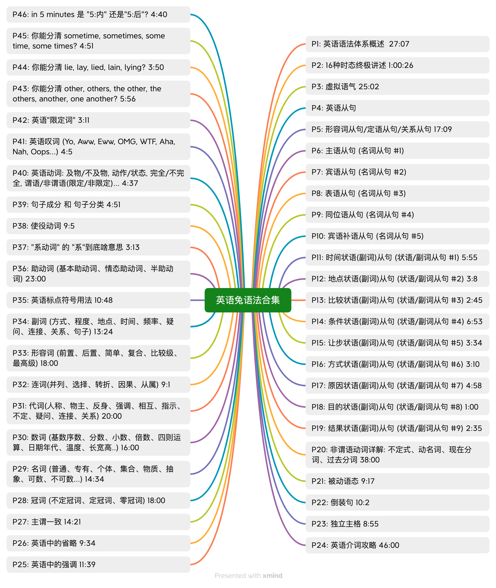

# 英语兔语法合集

> 英语兔网站: www.yingyutu.com

> 当前笔记来源 YouTube 视频合集：https://www.youtube.com/watch?v=is7vn5URVcc&list=PLiRHe7F8P0-0ykWSiVY9Ia431TB-HzQm0&ab_channel=%E8%8B%B1%E8%AF%AD%E5%85%94

## New Words

- **of `/ɒv/`|`/əv/`--prep.属于 (某人或某物) 的; ...的; ...的一部分; 关于; ......***
    + a friend of Mark's 马克的一个朋友
    + the back of the house. 房子的后面
    + the last scene of the movie. 电影的最后一个场景
    + the end of the day. 一天的结束
    + the beauty of the scenery. 景色的美丽
    + the length of the swimming pool. 游泳池的长度
    + the kilos of sugar. 两公斤糖
    + a bar of chocolate. 一块巧克力
    + a cup of coffee. 一杯咖啡
    + several packets of cigarettes. 几包香烟
    + His circle of friends. 他的朋友圈子。
    + the day of the accident. 故事发生的那一天。
    + the people of China. 中国人民
    + the 27th(twenty-seventh) of July. 7 月 27 日
    + He died of cancer. 他死于癌症。
    + We often used to walk by the river of an evening.
      我们以前晚上常在河边散步。
- **carrot `['kærət]` --n.胡萝卜**
    + I'll have some more carrot(s). 我还要一些胡萝卜。
    + These are young carrots and you need not scrape them. 这些胡萝卜很嫩，不用削皮。

## Content

### 1. **of$^{\color{red}{*}}$** 这个单词你读错了?
> https://www.bilibili.com/video/BV1p64y1C7H5?zw

咱们不少人会把这个字读成 `/ɒf/` 或者 "傲父(ào fù)".

可问题在于, 这个单词结尾的 f 可不是 `/f/`, 你可别一看见字母 f 就自动往咱们汉语拼音上靠啊.

这个词的结尾可是 `/v/` 的音, 是的, 没错, 这个词单独读出来是 `/ɒv/`, 你要是读 `/ɒf/` , 那就成了另一个词: off;

请记住, of(`/ɒv/`|`/əv/`) 和 off(`/ɒf/`|`/ɔf/`) 可不是同一个读音哦,

不过, 英语兔我刚才为啥说 "单独" 读出来时是 `/ɒv/`? 那是因为啊, 绝大多数情况下, of 也并不读 `/ɒv/`.

正常对话语流中, of 的开头元音会弱化为中央元音 `/ə/`, 而整个单词会弱读为 `/əv/`.

所以, 以下这些常见的短语:
- a box of carrots$^{\color{red}{*}}$. 一箱胡萝卜
- a friend of mine. 我的一个朋友
- the first of May. 五月一日
- all of it. 所有的/全部
- I'm proud of you. 我以你为荣

你读对了吗? 如果你觉得有用, 还请帮忙点赞关注或者转发给需要的朋友, 谢谢啦, 咱们下次再见.

### 2. 英语的语调(如何用母语人士的"腔调"说话?)