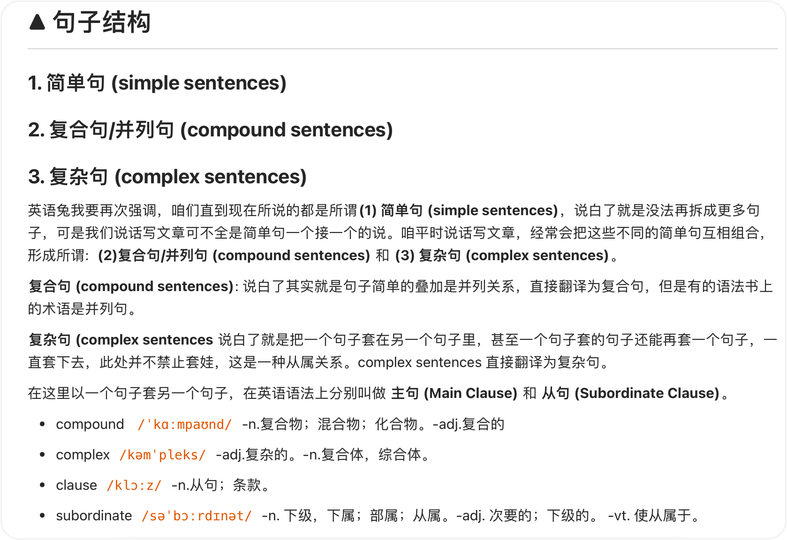

# Unit01 绪论

## 1.1 英语概说
英语是盎格鲁－撒克逊人的民族语。它属于印欧语系的日耳曼西部语支。英语的形成大约是在公元五世纪；它是在一于五百余年的漫长历史过程中发展起来的。

英语有三个重要特征。
- 其一是它的屈折变化形式相对较少：除名词、代词、动词、形容词和副词有变化外，数词、介词、连词、冠词和感叹词都是不变的。
- 其二是它的词汇的开放性：英语词汇一半为日耳曼语族词汇，一半为罗曼语族词汇，还有许多从希腊语、荷兰语、意大利语、西班牙语、德语、阿拉伯语以及其它语言引进的词汇。
- 其三是它的句法的灵活性：英语只有三种句子结构，即**简单句**、**并列句**和**复合句**；词序比较固定。

  > 其三这里有错误，正确讲解见同仓库：`../../英语兔语法合集/P1 英语语法体系概述-done/readme.md`。图示如下：
  >
  > 

英语现已是一种国际性语言。在当代各种国际活动中，英语用得最为广泛。

## 1.2 本书性质
概略地说，当代英语语法体系有结构语法、转换生成语法和传统语法等三大种。本书为了结合我国英语教学实际， 故采用了传统语法体系， 但也含有一些当代英语语法的新成就和编者个人的一些研习语法的心得。

本书是编者所编著的实用英语语法系列中的一种。它是一部属干中等层次的英语语法，与高层次的《高级英语语法》和较低层次的《英语语法手册》构成一较为完整的英语语法系列。它的主要对象是具有初级以上程度的读者，如属千这种程度的高中、大专学生以及英语自学者等。

## 1.3 词类
英语的词有实词(notional word)与虚词(form word) 两种。

实词都有实义， 共有六类：
1) 名词（noun, 缩写式为n.) 如 book, water。
2) 代词(pronoun, 缩写式为pron.), 如 I, you。
3) 形容词(adjective, 缩写式为a 或adj.), 如 clear, happy。
4) 数词(numeral, 缩写式为num.), 如 four, sixty。
5) 动词(verb, 缩写式为v.), 如 come, take。
6) 副词(adverb, 缩写式为ad或adv.), 如here, today。

虚词没有实义， 共有四类：
7) 冠词（article, 缩写式为a rt.), 如a, the 。
8) 介词(preposition, 缩写式为p rep.), 如of, to。
9) 连词（conjunction, 缩写式为conj.), 如and, or 。
10) 感叹词(interjection, 缩写式为int.), 如oh, alas。

yes 和no 可列入副词一类， 因为它们很像用作句子独立成分的副词。

英语里有不少词可属于几个不同词类， 如 study 既可属于动词，亦可属于名词；fast 既可属于形容词，亦可属于副词；for 既可属于介词， 亦可属于连词； after 则既可是介词与连词， 又可是副词。

本书还有三种由短语构成的词类：
1) 短语动词（phrasal verb), 如：get up, call on, take care of。
2) 短语介词(phrasal preposition), 如：because of, instead of, in front of。
3) 短语连词（phrasal conjunction), 如：as if, so that, as long as。

此外， 还有一种叫做从属关联词(subordinate correlative)的词类， 即引导从句的连词、疑问代词、疑问副词、关系代词、关系副词、缩合连接代词和缩合连接副词。

## 1.4 句子成分

## 1.5 短语 

## 1.6 从句

## 1.7 句子
