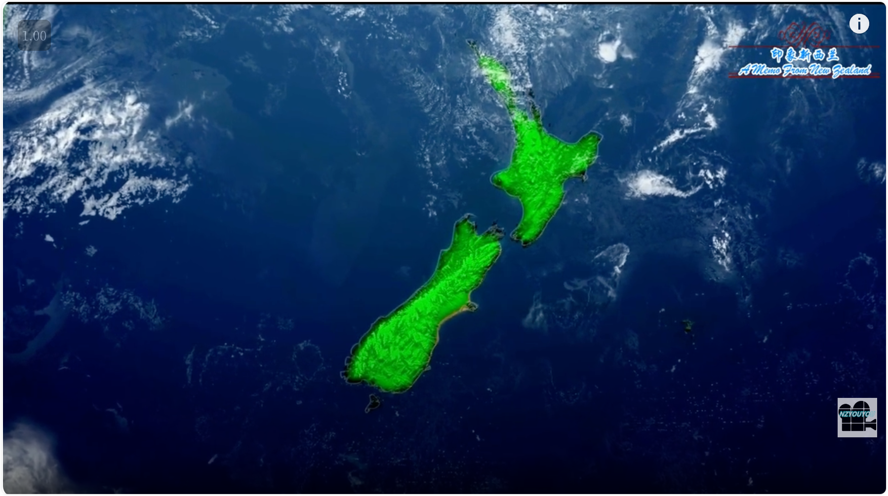
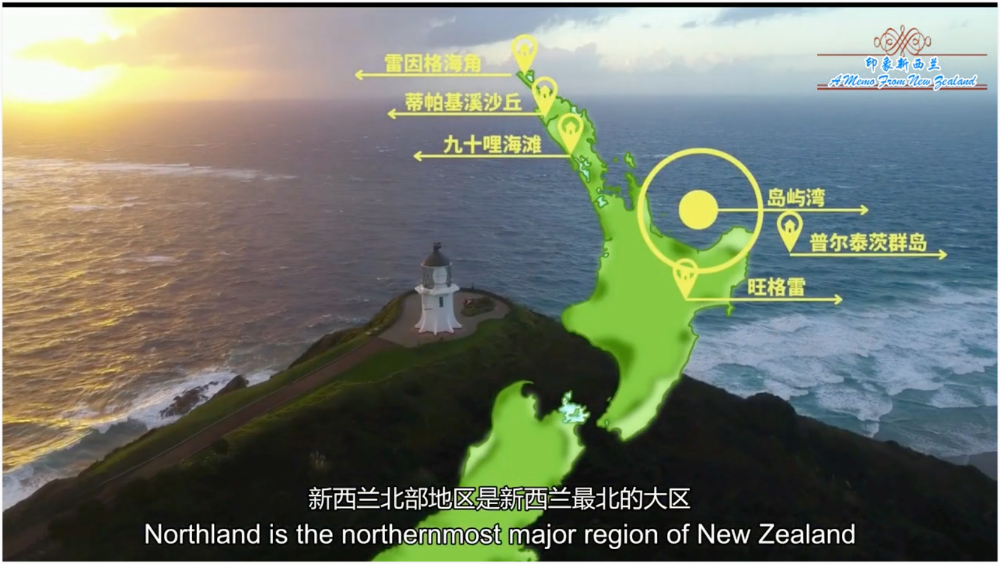
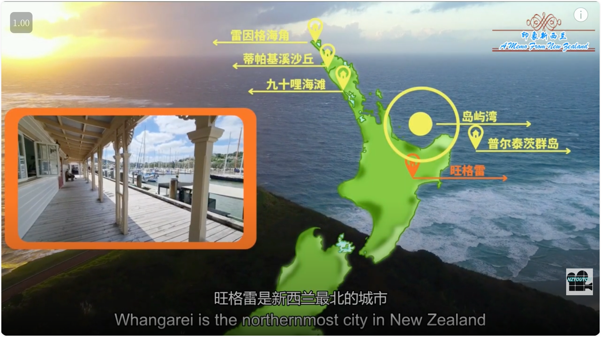

# 印象新西兰

*Add: 2024.07.14*

==编辑校正中==

A Memo From New Zealand

> 笔记来源：https://www.youtube.com/watch?v=vwxr9OFkDcQ&ab_channel=YOUYOU

## 岛屿湾 Bay Of Islands

新西兰北部地区是新西兰最北的大区
Northland is the northernmost`/ˈnɔːrðərnmoʊst/` major region of New Zealand

在地图上看又窄又长
appearing narrow and long on the map

这里有原始的西部海岸沙滩
It has **pristine** beach coasts to the east

还有美丽的东海岸沙滩
and west

中间一些区域有原始雨林
and pristine rainforest in areas in between

北部地区有壮丽的自然景观和丰富的历史人文资源
Northland has magnificent natural landscapes as well as rich social history

古老的贝克山森林绵延无际
Here, ancient **Kauri** forests stretch as far as the eye can see

数不清的海豚在美丽的岛屿湾里嬉戏
Countless dolphins frolic through the beautiful Bay of Islands

是毛里人古老的精神家园
Which are spiritual home of the **Maori** people

雷因格海角、岛屿湾、九十里海滩、普尔奈茨群岛等都是超乎想像的旅游目的地。
Cape Reinga, Bay of Island, Ninety Mile Beach and the Pernetz Islands are all destinations beyond imagination.

旺格雷是新西兰最北的城市
**Whangarei** is the northernmost city in New Zealand

是北部地区的首府城市
and is the capital city of this region

新西兰北部地区最大的产业中心
with a largest industrial center

==UnEdit Flow==

==下面的未编辑==

旺格雷地处亚热带地区

气候宜人

是一个充满亚热带风情的海滨城市

城市湾的码头地区

是发展完善的餐饮

与娱乐中心

现代景观与殖民乐道

是香港最新的广场

遴旱双径

北部地区中最新的城市

现代景观与殖民时期的建筑完美地结合在一起

为当地人和来自世界各地的游客提供了一个聚会的理想场所

除了别具风格的咖啡馆和餐厅之外

还有博物馆、美术馆和专卖店等

位于城市北郊旺格雷濑瀑布风景保护区内的旺格雷瀑布

被认为是新西兰最上进的瀑布

已经成为新西兰一大必游景点

波尔奈茨群岛有两个大岛和几个小岛组成

面积约23平方千米

被誉为是新西兰北部地区世界顶级潜水地之一

当您潜入波尔奈茨群岛的海底

五彩斑斓的世界让您惊叹不已

可以看到各种海洋生物在您身边游来游去

海水四周有成群的海绵和珊瑚礁

是众多海洋居民的家园

比如鱼类、贝类、海胆和海葵等

海底还有许多洞穴

里面的海水深不可测

群岛周围有海洋保护区

那里生活著许多亚热带鱼类

他们可是您在新西兰其他地方难得一见的海洋生物

岛屿湾靠近北岛最北端是一个小区域

由144个小岛组成

宜人的亚热带气候让这里成为了航海的天堂

岛屿湾风景宜人、草木茂密

绿色的森林、金黄的沙滩和蓝色的海洋

完美地结合在一起

让人流连忘返

岛屿湾是新西兰北岛最著名的旅游胜地之一

不论你身处岛屿湾的什么地方

都将被那里的美丽大海所吸引

它还以丰富多彩的水上活动而吸引著大量的游客

划水、垂钓、出海、劈滑艇、观赏海豚、划沙等

都是游客们最喜爱的项目

在岛屿湾的乡镇里

你还可以了解本地区丰富多彩的历史

拉塞尔、派西亚、淮唐伊

淮唐伊随时欢迎各位游客

前来参观关于毛利人和欧洲人留下的历史文物

派西亚小镇位于北岛地区的岛屿湾

是岛屿湾最重要的旅游小镇

也是探索岛屿湾的基地

这座滨海城镇以岛屿湾的珍宝闻名于世

镇上的碧海银滩可供游客游泳、浮潜、垂钓

还可以从码头安排去外岛的旅行

游客可以和可爱的海豚一起游泳

和全家人在海滩上野餐

或者搭乘轮渡去拉塞尔

派西亚也正好在去淮唐伊

具有历史意义的条约屋的路边

淮唐伊条约标志著新西兰作为一个国家的开始

1840年2月6日

毛利酋长和英国王室

就是在此签订了著名的淮唐伊条约

揭开了新西兰的近代历史

2月6日也因此成为新西兰的国庆日

与淮唐伊隔海相望的拉塞尔

成为了新西兰第一个首都

这里是有旅游中心、礼品店和两间咖啡馆

以及全世界最大的战斗独木舟

和毛利文化表演等

淮唐伊不但极具教育意义

而且也是一个值得游览的美丽景区

与派西亚溢水之隔的拉塞尔

是新西兰最早的海港

第一个欧洲定居点

也是新西兰创国时的首都

在这个国家的历史上占据重要的地位

小镇的街巷依然保留著1834年建成时的格局和名称

至今留有许多百年的建筑

不少历史古建筑今天仍然向公众开放

历史的沉淀、浪漫的故事

曾经的建筑给小镇蒙上了一层历史的风尘和神秘的氛围

时光在静静的流逝

但小镇风韵尤存

九世英里海滩是新西兰北岛最著名的经典旅游路线之一

它是在新西兰北岛的最北部的西部海岸

面向塔斯曼海

拥有平坦壮阔的金色沙滩

车辆可以直接在上面行驶

近距离地观看壮美的新西兰海岸线

举世闻名的九世英里海滩

其真实的长度是88公里

整个海岸线笔直的几乎让人觉得是用尺子画出来的

对地形熟悉的旅游大巴车司机会沿著海岸线开车

感觉非常奇妙

如果自己开四驱车

也能直接开上沙滩

在一望无际的海岸线上飞驰

享受海天一色广阔无垠的壮丽景色

在这里可以看到茂密的圣诞树林

蜿蜒的海岸线和美丽的日落等景观

雷因格角灯塔与九世英里海滩之间

有个蒂帕奇沙丘

是南半球面积最大的沙丘地形

深处其中如站于沙漠之上

尽管爬上沙丘顶部并不容易

但坐在小冲浪板上

从沙丘上滑下时的惊险刺激

绝对值得一试

因为沙丘的沙丘的沙滩是沙滩的沙滩

沙滩的惊险刺激绝对值得一切的努力

沿著九世英里海滩向北行驶

可以到达新西兰最北端

这里是塔斯曼海和太平洋的交会处

步行到海拔290米的雷因格海角灯塔

雷因格海角灯塔是新西兰标志性的景观

位于陡峭的岩石海角边缘

被塔斯曼海和太平洋包围著

灯塔建于1941年高10.5米

高于海平面165米

是世界上最亮的灯塔之一

海上的船可以在50公里外看到

您可以步行到灯塔

在那里观赏太平洋和塔斯曼海交会的壮丽景观

新西兰北部地区属亚热带气候

这里阳光充沛、日照时间长

风和日丽、温暖宜人

从古老的森林、宁静的海湾到银白的沙滩

从繁华的东海岸到质朴而充满生机的西海岸

正是这些截然不同的景观

让北部地区成为如物物的环境

让北部地区成为如物物的环境

让北部地区成为如此迷人的地方

