# 写作

## ▲ New Zealand 主要城市

*Added: 2024.04.28*

> 笔记来源：https://zh.wikipedia.org/zh-cn/%E7%B4%90%E8%A5%BF%E8%98%AD%E5%9F%8E%E5%B8%82%E5%88%97%E8%A1%A8

### 新西兰主要城市分布

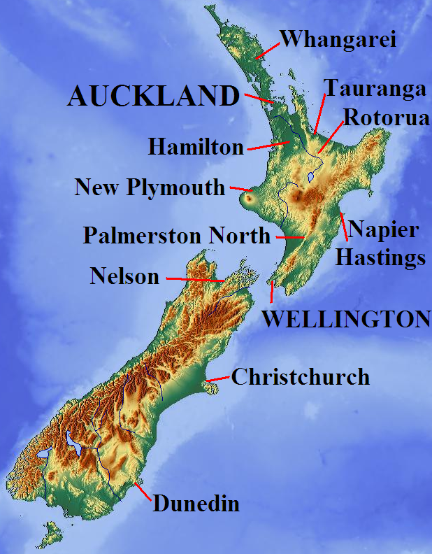

本条目为**[新西兰](https://zh.wikipedia.org/wiki/紐西蘭)**的城市列表。新西兰前五大城市依序为[奥克兰](https://zh.wikipedia.org/wiki/奧克蘭)（拥有新西兰三分之一的人口）、[基督城](https://zh.wikipedia.org/wiki/基督城)、[威灵顿](https://zh.wikipedia.org/wiki/威靈頓)、[汉密顿](https://zh.wikipedia.org/wiki/漢密頓_(紐西蘭))和[陶朗加](https://zh.wikipedia.org/wiki/陶朗加)。大部分的主要城市位于[北岛](https://zh.wikipedia.org/wiki/北島_(紐西蘭))。

> 下面笔记来源：https://en.wikipedia.org/wiki/List_of_cities_in_New_Zealand

### Urban areas based on 2018 standard 城市地区按2018年标准

[Statistics New Zealand](https://en.wikipedia.org/wiki/Statistics_New_Zealand) creates standards for statistical geographic areas that are the basis for determining population figures. Statistics New Zealand announced in 2017 that the Statistical Standard for Geographic Areas 2018 (SSGA18) would replace the New Zealand Standard Areas Classification 1992 (NZSAC92). The change impacted Wellington most, by splitting it into four urban areas, being the Wellington city and Lower Hutt city "major urban areas" and Porirua and Upper Hutt "large urban areas". As defined by SSGA18, Wellington approximately halved in size, and Lower Hutt entered the city rankings in sixth place between Tauranga and Dunedin.[[3\]](https://en.wikipedia.org/wiki/List_of_cities_in_New_Zealand#cite_note-Mitchell_opinion-3)
新西兰统计局制定了统计地理区域的标准，作为确定人口数据的基础。新西兰统计局于 2017 年宣布，2018 年地理区域统计标准 (SSGA18) 将取代 1992 年新西兰标准区域分类 (NZSAC92)。这一变化对惠灵顿的影响最大，将其分为四个市区，即惠灵顿市和下哈特市“主要城区”以及波里鲁阿和上哈特市“大城市区”。根据 SSGA18 的定义，惠灵顿的面积大约减少了一半，下哈特进入城市排名第六位，位于陶朗加和达尼丁之间。 [[3\]](https://en.wikipedia.org/wiki/List_of_cities_in_New_Zealand#cite_note-Mitchell_opinion-3)

The table below contains all "major urban areas" (100,000 or more residents) and all "large urban areas" (30,000 to 99,999 residents).[[4\]](https://en.wikipedia.org/wiki/List_of_cities_in_New_Zealand#cite_note-4) The urban area that will next move from the "medium urban area" category to the "large urban area" category is [Paraparaumu](https://en.wikipedia.org/wiki/Paraparaumu) (30,800).
下表包含所有“主要城市地区”（100,000 名或以上居民）和所有“大城市地区”（30,000 至 99,999 名居民）。 [[4\]](https://en.wikipedia.org/wiki/List_of_cities_in_New_Zealand#cite_note-4) 接下来将从“中等城市地区”类别转移到“大城市地区”类别的城市地区是帕拉帕拉乌姆 (30,800)。

**"Major" and "large" urban areas**
“主要”和“大型”城市地区

*注：下面的表格有修改，发音来自 ChatGPT 4.0*

| Rank |  Urban area  |  发音  | 都市区 | Population | Area 区域  (km^2^) | Population density (per km^2^) 人口密度（每公里 ^2^ ） |  Image  | 大区 | 岛屿 |
| :--: | :----------: | ---- | :--------: | :---------------------: | :----------------------------------------------------------: | :-----------------: | :---------------: | ---- | :--: |
|  1   | [Auckland](https://en.wikipedia.org/wiki/Auckland)    | `/ˈɔːklənd/` | 奥克兰    |  1,478,800  |    605.67  |  2,441.6  | [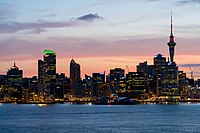](https://en.wikipedia.org/wiki/File:Auckland_Skyline_383495.jpg) | 奥克兰            | 北岛 |
|  2   | [Christchurch](https://en.wikipedia.org/wiki/Christchurch)  | `/ˈkraɪst ʧɜːrtʃ/` | 基督城        |  384,800   |         294.43          |                           1,306.9                            | [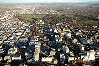](https://en.wikipedia.org/wiki/File:Hagley_Park_01.jpg) | 坎特伯雷          | 南岛 |
|  3   | [Wellington](https://en.wikipedia.org/wiki/Wellington)    | `/ˈwɛlɪŋtən/` | 惠灵顿        |  215,200   |  112.71   |   1,909.3    |  | 惠灵顿     | 北岛 |
|  4   | [Hamilton](https://en.wikipedia.org/wiki/Hamilton,_New_Zealand) | `/'hæmiltən/` | 汉密尔顿      |  185,300   |  110.37   |   1,678.9    | 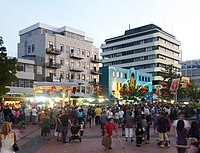 | 怀卡托     | 北岛 |
|  5   | [Tauranga](https://en.wikipedia.org/wiki/Tauranga)      | `/taʊ'ræŋə/` | 陶朗加 |  161,800   |  141.91   |   1,140.2    |  | 惠灵顿     | 北岛 |
|  6   | [Lower Hutt](https://en.wikipedia.org/wiki/Lower_Hutt)    | `/ˈloʊər hʌt/` | 下哈特 |  113,000   |   78.54   |   1,438.8    | -20240428134708795.jpg) | 惠灵顿     | 北岛 |
|  7   | [Dunedin](https://en.wikipedia.org/wiki/Dunedin)| `/dʌˈniːdɪn/` | 但尼丁 |  106,200   |   91.16   |   1,165.0    | 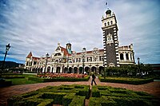 | 奥塔哥     | 南岛 |
|  8   | [Palmerston North](https://en.wikipedia.org/wiki/Palmerston_North) | `/ˈpɑːlmərstən nɔːrθ/` | 北帕默斯顿    |   82,500   |   77.05   |   1,070.7    | 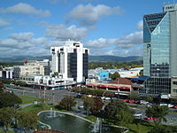 | 马纳瓦图-旺加努伊 | 北岛 |
|  9   | [Napier](https://en.wikipedia.org/wiki/Napier,_New_Zealand)  | `/ˈneɪpiər/` | 纳皮尔 |   67,500   |  105.05   |    642.6     | 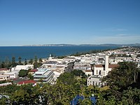 | 霍克湾     | 北岛 |
|  10  | [Hibiscus Coast](https://en.wikipedia.org/wiki/Hibiscus_Coast) | `/ˈhaɪbɪskəs koʊst/` | 芙蓉海岸      |   63,400   |   48.39   |   1,310.2    | 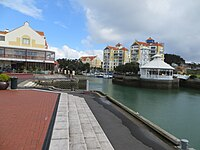 | 奥克兰     | 北岛 |
|  11  | [Porirua](https://en.wikipedia.org/wiki/Porirua)| `/pɔːˈruːə/` | 波里鲁阿      |   60,900   |   61.19   |    995.3     | 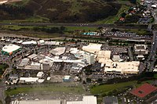 | 惠灵顿     | 北岛 |
|  12  | [New Plymouth](https://en.wikipedia.org/wiki/New_Plymouth)  | `/ˈnjuː ˈplɪməθ/` | 新普利茅斯    |   59,600   |   74.79   |    796.9     | 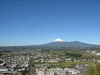 | 塔拉纳基   | 北岛 |
|  13  | [Rotorua](https://en.wikipedia.org/wiki/Rotorua)| `/ˌroʊtəˈruːə/` | 罗托鲁瓦      |   58,900   |   46.06   |   1,278.8    | 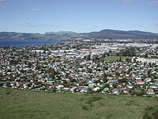 | 普伦蒂湾   | 北岛 |
|  14  | [Whangārei](https://en.wikipedia.org/wiki/Whangārei)     | `/ˈfɑːŋəreɪ/` | 法纳雷/旺加雷 |   56,900   |   63.53   |    895.6     |  | 北地| 北岛 |
|  15  | [Nelson](https://en.wikipedia.org/wiki/Nelson,_New_Zealand)  | `/ˈnɛlsən/` | 尼尔逊/纳尔逊 |   51,900   |   54.69   |    949.0     | 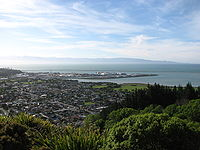 | 尼尔逊     | 南岛 |
|  16  | [Hastings](https://en.wikipedia.org/wiki/Hastings,_New_Zealand) | `/ˈheɪstɪŋz/` | 黑斯廷斯      |   51,500   |   26.29   |   1,958.9    | 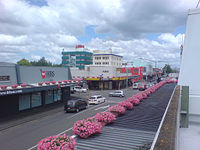 | 霍克湾     | 北岛 |
|  17  | [Invercargill](https://en.wikipedia.org/wiki/Invercargill)  | `/ˌɪnvərˈkɑːrɡɪl/` | 因弗卡吉尔    |   51,000   |   62.95   |    810.2     |  | 南地| 南岛 |
|  18  | [Upper Hutt](https://en.wikipedia.org/wiki/Upper_Hutt)    | `/ˈʌpər hʌt/` | 上哈特 |   45,400   |   51.16   |    887.4     | 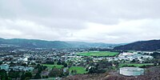 | 惠灵顿     | 北岛 |
|  19  | [Whanganui](https://en.wikipedia.org/wiki/Whanganui)     | `/ˈwɑːŋənuːi/` | 旺加努伊      |   42,800   |   41.05   |   1,042.6    | 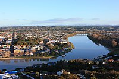 | 马纳瓦图-旺加努伊 | 北岛 |
|  20  | [Gisborne](https://en.wikipedia.org/wiki/Gisborne,_New_Zealand) | `/ˈɡɪzbərn/` | 吉斯伯恩      |   38,200   |   37.43   |   1,020.6    | ](./ReadMe.assets/200px-Gisborne_nz_1-20240428134943368.jpg) | 吉斯伯恩          | 北岛 |

## ▲ 句子翻译

| 英文                                                         | 中文                                                         | 备注                                      |
| :----------------------------------------------------------- | ------------------------------------------------------------ | ----------------------------------------- |
| eat small, frequent meals.  或 have several small meals a day. | 少吃多餐                                                     | Added: 2024.02.19. From: chatGPT 4.0 |
| He's just an average guy in terms of height and build, not particularly standing out in crowd, but there's something about his smile that's memorable.  | 就身高和体型而言，他只是一个普通人，在人群中并不特别突出，但他的笑容令人难忘。 |                                           |
| The colour-sorted bottles are put into <u>furnaces</u> which melt the glass in preparation for <u>molding</u>. | 将分类好颜色的瓶子放入炉子中，熔化玻璃以准备成型。           |                                           |
| Aren't we here in this world just to experience it?  - *ChatGPT 4.0*  You came to this world just to experience it, right?  - *Google Translate* | 来到这个世界就是为了体验的不是吗？                           | Added: 2024.04.18                         |
| If you can do what you do best and be happy, you're further along in life than most people. | 如果你能做你擅长的事同时又快乐，你在生命中已走得比大多数人还远。 - Leonardo DiCaprio (李奥纳多·狄卡皮欧) | Added: 2024.04.22                         |
| MORAL: If you harm others, you will also be harmed.          | 格言: 伤害别人，也会自食其果。                               |                                           |
|                                                              |                                                              |                                           |
|                                                              |                                                              |                                           |

## ▲ 哥伦布 Columbus

### 英语常用 8 个句子

| 索引 | 英文                               | 中文 +  备注                                                 |
| ---- | ---------------------------------- | ------------------------------------------------------------ |
| 1    | **I'm not buying it.**             | 表面意思：我不要买。 实际意思：**我不相信**。（Don't believe you.) |
| 2    | **Sorry, I didn't catch that.**    | 抱歉，我没有听到（/听懂）。                                  |
| 3    | **It's not the end of the world.** | 还不是世界末日。                                             |
| 4    | **Make yourself at home.**         | 把这里当(dàng)做自己的家。                                   |
| 5    | **No hard feelings!**              | 别见怪。/ 不要放在心理。                                     |
| 6    | **Thanks in advance!**             | 先谢谢你。                                                   |
| 7    | **I'll say!**                      | 中肯。/ 就是啊。                                             |
| 8    | **Good Call.**                     | 好主意！                                                     |

*Added: 2024.04.18*

**出太陽  / 炎熱 **

簡單的 nice (美好的) 或 warm (溫暖的)、sunny (陽光普照)、clear (晴朗的) 都可以形容好天氣。
再炎熱一點就用 scorching (灼熱的)、burning (燃燒的)、sweltering (極熱的) 加強形容熱 (hot) 的程度。

Q: Mom? How’s the weather today? (麻～今天天氣怎麼樣？)
A: It’s clear and scorching (hot) outside. Don’t forget your sunscreen. (外面萬里無雲而且超熱，你別忘了防曬。)

## ▲ 电影台词

| 英文                                                         | 中文                                                         | 电影 &nbsp;&nbsp;&nbsp;&nbsp;&nbsp;&nbsp;&nbsp;&nbsp;&nbsp;&nbsp;&nbsp;&nbsp;&nbsp;&nbsp;&nbsp;&nbsp;&nbsp;&nbsp;&nbsp;&nbsp;&nbsp; | 添加时间   |
| ------------------------------------------------------------ | ------------------------------------------------------------ | ------------------------------------------------------------ | ---------- |
| **[Mohammad ](https://www.imdb.com/name/nm0708216/?ref_=tt_ch):** *[crying]* Our teacher says that God loves the blind more because they can't see. But I told him if it was so, He would not make us blind so that we can't see Him. He answered "God is not visible. He is everywhere. You can feel Him. You see Him through your fingertips." Now I reach out everywhere for God till the day my hands touch Him and tell Him everything, even all the secrets in my heart. Mohammad: *[crying]* Nobody loves me because I'm blind. | 穆罕默德：我们的老师说上帝更爱盲人，因为他们看不见。但是我告诉他，如果上帝真的爱我们的话，就不会让我们成为瞎子了，以至于让我们看不见他。老师回答说：上帝是看不见的。他无处不在，你可以感觉到他，你可以通过你的手指来感受到他。现在我四处寻找上帝直到我的手可以感觉到他，然后告诉他我心中所有的秘密。 | Color of Paradise( dir. Majid Majidi, 1999)  中文名：《天堂的颜色》 | 2023.12.17 |
|                                                              |                                                              |                                                              |            |
|                                                              |                                                              |                                                              |            |

## ▲ English idioms （英语习语）

Q: What are some common English idioms?

Certainly! Here are some common English idioms along with their meanings:

Remember that idioms are phrases that often have a figurative meaning that may not be clear if taken literally. If you need more idioms or have any other questions, feel free to ask! （请记住，成语是通常具有比喻含义的短语，如果从字面上理解，可能并不清楚。如果您需要更多成语或有任何其他问题，请随时提问！）

| 英文 | 中文 | 注释 |
| ---- | ---- | ---- |
| **Break a leg**  | 祝你好运 | This idiom is used to wish someone good luck, especially before a performance or event.  这个习语通常用于在表演或活动前向他人表示祝福。 |
| **Bite the bullet**  | 硬着头皮上 | To face a difficult situation with courage, even if it's unpleasant. 面对困难情况时勇敢地去处理，即使情况不愉快。 |
| **Hit the nail on the head**  | 一针见血 | To describe someone who is exactly right or accurate about something. 用来形容某人在某事上非常准确或正确。 |
| **A piece of cake** | 小菜一碟 | Referring to something that is very easy to do.  指做某事很容易。 |
| **Cost an arm and a leg**  | 代价高昂 | Used to describe something that is very expensive.  形容某物的价格非常昂贵。 |
| **Let the cat out of the bag**  | 泄露天机 | To reveal a secret unintentionally. 无意间揭示一个秘密。 |
| **Once in a blue moon**  | 月黑风高夜 | Referring to something that happens very rarely.  指某事发生得非常罕见。 |
| **Don't cry over spilled milk**  | 覆水难收 | Advising someone not to worry about something that has already happened and can't be changed.  建议某人不要为已经发生且无法改变的事情而烦恼。 |
| **Kick the bucket**  | 踢桶 | A euphemism for passing away or dying. 委婉说法，表示去世或死亡。 |
| **Beat around the bush**  | 绕着弯子说 | To avoid addressing a topic directly and instead talk about irrelevant things.  避免直接谈论某个话题，而是谈论无关紧要的事情。 |
| The strong take what they want. | 弱肉强食. |  |
|  |  |  |
|  |  |  |
|  |  |  |
|  |  |  |

## 翻译技巧
(1) Every time you commit, or save the state of your project in Git.(每次你提交或将项目状态保存在 Git 中时)
+ the state of your project, 先翻译 of 后面的名词, 再加上前面的修饰: "你项目的状态".

------

Tony: If I'm gonna do this carrying on living thing, it's gonna be on my terms, I'm gonna do what I want, and I've always got suicide to fall back on." 

(如果我要继续活下去, 就得按照我的条件, 我要随心所欲, 反正随时都可以自杀.)

But it didn't go to plan. At first, I thought it was like a superpower. I can do anything. Who cares? What's the worst that can happen? Nothing can hurt me, because I can always kill myself, you know? And...

(但是并没按照我的计划发展. 一开始, 我以为这就像是超能力. 我什么都可以做, 谁管呢? 最糟糕能糟糕到哪里去? 没有什么能伤害到我. 因为我总是可以自杀, 你懂吗?)

But then... I realized you can't... You can't not care about things you actually care about. You can't fool yourself and... And, err... it was something you said, that it's not all about me, and even though I'm in pain, it's worth... sticking around to maybe... make my...little corner of the world a slightly better place.

(可然后, 我意识到你不能... 你不能不关心那些你关心的事物. 你不能自欺欺人, 然后, 是你说的一番话, 世界并不围着我转, 尽管我很痛苦, 还是值得, 坚持下来, 或许, 让我...所处的这个小小世界变得更好一点)

Anne:  Got to have a backup. (得有个备用计划.)

That's all there is. (就该这样)

Happiness is amazing. (幸福很美好)

It's so amazing, it doesn't matter if it's yours or not. (太美好 属不属于你都不重要)

There's that lovely thing, "A society grows great when old men plant trees, the shade of which they will never sit in." 

(有句老话说得好, "社会变得美好是因为老人们在不停地栽树, 尽管他们知道他们并不会享受到这些树荫.")

Good people do things for other people. (好人为别人做事.)

That's it. The end. (就这么简单.)

And you're good, Tony. (而你是好人, 托尼.)