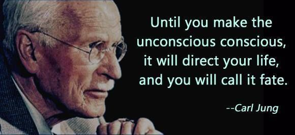

# 写作


## ▲ 让 ChatGPT 4o 中英翻译描述方式

```md
Add: 2024.08.16
Answer: ChatGPT 4o
```
总结一下你希望的格式：
- 英文段落和对应的中文翻译紧贴在一起。
- 不加粗、不使用分割线、无多余空行。
- 翻译顺序为：先英文段落，紧接着是中文翻译。


## ▲ 常见提示语汉英

*Add: 2024.06.24*

Translate: ChatGPT 4o 

| 中文提示语       | 英文翻译                           |
|-------------|--------------------------------|
| 当心坠落        | Beware of Falling              |
| 禁止抛物        | No Throwing`/θroʊ/` |
| 节约用水        | Please Save Water. <br />或 <br />Please Conserve`/kənˈsɜːrv/` Water. |
| 节约用纸 | Please Save Paper. <br />/<br /> Plese Conserve Paper. |
| 小心地滑        | Caution: Wet Floor`/flɔːr/`   |
| 当心碰头        | Mind Your Head. <br />/<br />Overhead obstacle`/ˈɑːbstəkl/` |
| 注意脚下 | Watch Your step. |
| 禁止吸烟        | No Smoking                     |
| 请勿拍照        | No Photography `/fəˈtɑːɡrəfi/` |
| 请保持安静       | Please Keep Quiet              |
| 紧急出口        | Emergency Exit                 |
| 工作区域        | Work Area`/ˈeriə/`             |
| 避免拥挤        | Avoid Crowding                 |
| 禁止入内        | No Entry                       |
| 请勿打扰        | Do Not Disturb`/dɪˈstɜːrb/` |
| 请勿触摸        | Do Not Touch                   |
| 请走楼梯        | Use Stairs                     |
| 注意安全        | Safety First. / Caution. |
| 禁止饮食        | No Eating or Drinking          |
| 请勿喧哗        | No Loud Noise                  |
| 禁止携带宠物     | No Pets Allowed                |
| 请勿倚靠        | Do Not Lean                    |
| 请排队         | Please Queue Here              |
| 请勿越线        | Do Not Cross the Line          |
| 小心高温        | Caution: High Temperature      |
| 禁止攀爬        | No Climbing                    |
| 禁止触摸        | No Touching                    |
| 请保持清洁       | Keep Clean                     |
| 请勿投喂动物      | Do Not Feed the Animals        |
| 非工作人员禁止入内  | Authorized Personnel Only      |
| 禁止使用手机      | No Mobile Phones               |
| 出入口         | Entrance/Exit                  |
| 请系好安全带     | Fasten Seat Belt               |
| 危险区域        | Danger Zone                    |
| 请慢行         | Slow Down                      |
| 请勿坐在台阶上   | Do Not Sit on the Steps        |
| 正在施工        | Under Construction             |


## ▲ ChatGPT 4.0 翻译句子及解析

*Added: 2024.02.01*

### △ 随着季节的变化，景观完全变了。

最常用英文翻译可能是：**As the seasons change, the landscape transforms completely.**

这里的翻译使用了以下元素：

1. **主语和谓语**：“As the seasons change” 是一个**时间状语从句**，用来说明主句发生的时间背景。这里的主语是 "the seasons"（季节），而谓语是 "change"（变化），表示季节的更迭。

2. **主句**：“the landscape transforms completely” 是主句，描述了随着季节的变化，景观发生了怎样的变化。这里的主语是 "the landscape"（景观），而谓语是 "transforms"（转变），"completely"（完全地）用作副词，强调变化的程度。

3. **连词**：“As” 作为连词，用来引导时间状语从句，表明两个动作（季节的变化和景观的转变）是同时发生的。

这种翻译方式比较直接地传达了原文的意思，同时保持了语句的流畅性和清晰度。在这个句子中，"change" 和 "transform" 分别用来描绘季节的变化和景观的变化，传达了原文“消逝”和“改变”的意境。

### △ “您有什么事儿吗？” 这句话的英语翻译是什么啊？

```md
Answer: Claude 3.5 Sonnet
Time： 2024.08.07
```

这个中文表达通常用于询问对方是否有需要帮助或处理的事情，但它的确更侧重于询问对方的需求，而不是主动提供帮助。

考虑到这一点，更贴近原意的英文表达可能是：

| 英文表达                                 | 直译                   | 意译               | 讲解                                                         |
| ---------------------------------------- | ---------------------- | ------------------ | ------------------------------------------------------------ |
| Is there something you need?             | 有什么你需要的吗？     | 您有什么需要吗？   | 较为直接，适用于日常场合。<br />暗示说话人愿意提供帮助，但不过于正式。 |
| Do you have any business to discuss?     | 你有任何事务要讨论吗？ | 您有什么事要谈吗？ | 更正式，适合工作场合。<br />"business"这个词暗示谈话可能涉及工作或重要事务。 |
| Is there anything on your mind?          | 你心里有什么事吗？     | 您有什么想说的吗？ | 比较随意友好，适合朋友间使用。<br />暗示对方可能有心事或想法要分享。 |
| Did you want to see me about something?  | 你想见我谈些什么吗？   | 您找我有事吗？     | 暗示对方主动寻求交谈。适用于有人来访或主动接近你的情况。     |
| Is there a matter you'd like to address? | 有什么事项你想提出吗？ | 您有什么事想说吗？ | 较为正式，"address"一词使其适合商务或正式场合。<br />暗示对方可能有具体的问题或话题要讨论。 |

 


## ▲ 句子翻译

| 英文                                                         | 中文                                                         | 备注                                      |
| :----------------------------------------------------------- | ------------------------------------------------------------ | ----------------------------------------- |
| eat small, frequent meals. <br />或<br />have several small meals a day. | 少吃多餐                                                     | Added: 2024.02.19.<br />From: chatGPT 4.0 |
| He's just an average guy in terms of height and build, not particularly standing out in crowd, but there's something about his smile that's memorable.<br /> | 就身高和体型而言，他只是一个普通人，在人群中并不特别突出，但他的笑容令人难忘。 |                                           |
| The colour-sorted bottles are put into <u>furnaces</u> which melt the glass in preparation for <u>molding</u>. | 将分类好颜色的瓶子放入炉子中，熔化玻璃以准备成型。           |                                           |
| Aren't we here in this world just to experience it?  - *ChatGPT 4.0*<br /> You came to this world just to experience it, right?  - *Google Translate* | 来到这个世界就是为了体验的不是吗？                           | Added: 2024.04.18                         |
| If you can do what you do best and be happy, you're further along in life than most people. | 如果你能做你擅长的事同时又快乐，你在生命中已走得比大多数人还远。 - Leonardo DiCaprio (李奥纳多·狄卡皮欧) | Added: 2024.04.22                         |
| MORAL: If you harm others, you will also be harmed.          | 格言: 伤害别人，也会自食其果。                               |                                           |
| "Tea leaves can become unclean due to numerous production processes, so it is necessary to wash the tea the first time you brew it." | "茶叶经过很多的制作工序会变得不干净，所以第一次泡茶的时候需要洗茶。" | Added: 2024.06.10<br />ChatGPT 4o         |
|                                                              |                                                              |                                           |


## ▲ 哥伦布 Columbus

### 英语常用 8 个句子

| 索引 | 英文                               | 中文 +  备注                                                 |
| ---- | ---------------------------------- | ------------------------------------------------------------ |
| 1    | **I'm not buying it.**             | 表面意思：我不要买。<br />实际意思：**我不相信**。（Don't believe you.) |
| 2    | **Sorry, I didn't catch that.**    | 抱歉，我没有听到（/听懂）。                                  |
| 3    | **It's not the end of the world.** | 还不是世界末日。                                             |
| 4    | **Make yourself at home.**         | 把这里当(dàng)做自己的家。                                   |
| 5    | **No hard feelings!**              | 别见怪。/ 不要放在心理。                                     |
| 6    | **Thanks in advance!**             | 先谢谢你。                                                   |
| 7    | **I'll say!**                      | 中肯。/ 就是啊。                                             |
| 8    | **Good Call.**                     | 好主意！                                                     |

*Added: 2024.04.18*

**出太陽  / 炎熱 **

簡單的 nice (美好的) 或 warm (溫暖的)、sunny (陽光普照)、clear (晴朗的) 都可以形容好天氣。
再炎熱一點就用 scorching (灼熱的)、burning (燃燒的)、sweltering (極熱的) 加強形容熱 (hot) 的程度。

Q: Mom? How’s the weather today? (麻～今天天氣怎麼樣？)
A: It’s clear and scorching (hot) outside. Don’t forget your sunscreen. (外面萬里無雲而且超熱，你別忘了防曬。)


## ▲ 电影台词

| 英文                                                         | 中文                                                         | 电影 &nbsp;&nbsp;&nbsp;&nbsp;&nbsp;&nbsp;&nbsp;&nbsp;&nbsp;&nbsp;&nbsp;&nbsp;&nbsp;&nbsp;&nbsp;&nbsp;&nbsp;&nbsp;&nbsp;&nbsp;&nbsp; | 添加时间   |
| ------------------------------------------------------------ | ------------------------------------------------------------ | ------------------------------------------------------------ | ---------- |
| **[Mohammad ](https://www.imdb.com/name/nm0708216/?ref_=tt_ch):** *[crying]* Our teacher says that God loves the blind more because they can't see. But I told him if it was so, He would not make us blind so that we can't see Him. He answered "God is not visible. He is everywhere. You can feel Him. You see Him through your fingertips." Now I reach out everywhere for God till the day my hands touch Him and tell Him everything, even all the secrets in my heart.<br />Mohammad: *[crying]* Nobody loves me because I'm blind. | 穆罕默德：我们的老师说上帝更爱盲人，因为他们看不见。但是我告诉他，如果上帝真的爱我们的话，就不会让我们成为瞎子了，以至于让我们看不见他。老师回答说：上帝是看不见的。他无处不在，你可以感觉到他，你可以通过你的手指来感受到他。现在我四处寻找上帝直到我的手可以感觉到他，然后告诉他我心中所有的秘密。 | Color of Paradise( dir. Majid Majidi, 1999)<br /><br />中文名：《天堂的颜色》 | 2023.12.17 |
|                                                              |                                                              |                                                              |            |
|                                                              |                                                              |                                                              |            |


## ▲ English idioms （英语习语）

Q: What are some common English idioms?

Certainly! Here are some common English idioms along with their meanings:

Remember that idioms are phrases that often have a figurative meaning that may not be clear if taken literally. If you need more idioms or have any other questions, feel free to ask! （请记住，成语是通常具有比喻含义的短语，如果从字面上理解，可能并不清楚。如果您需要更多成语或有任何其他问题，请随时提问！）

| 英文 | 中文 | 注释 |
| ---- | ---- | ---- |
| **Break a leg**  | 祝你好运 | This idiom is used to wish someone good luck, especially before a performance or event. <br />这个习语通常用于在表演或活动前向他人表示祝福。 |
| **Bite the bullet**  | 硬着头皮上 | To face a difficult situation with courage, even if it's unpleasant.<br />面对困难情况时勇敢地去处理，即使情况不愉快。 |
| **Hit the nail on the head**  | 一针见血 | To describe someone who is exactly right or accurate about something.<br />用来形容某人在某事上非常准确或正确。 |
| **A piece of cake** | 小菜一碟 | Referring to something that is very easy to do. <br />指做某事很容易。 |
| **Cost an arm and a leg**  | 代价高昂 | Used to describe something that is very expensive.<br /> 形容某物的价格非常昂贵。 |
| **Let the cat out of the bag**  | 泄露天机 | To reveal a secret unintentionally.<br />无意间揭示一个秘密。 |
| **Once in a blue moon**  | 月黑风高夜 | Referring to something that happens very rarely.<br /> 指某事发生得非常罕见。 |
| **Don't cry over spilled milk**  | 覆水难收 | Advising someone not to worry about something that has already happened and can't be changed.<br /> 建议某人不要为已经发生且无法改变的事情而烦恼。 |
| **Kick the bucket**  | 踢桶 | A euphemism for passing away or dying.<br />委婉说法，表示去世或死亡。 |
| **Beat around the bush**  | 绕着弯子说 | To avoid addressing a topic directly and instead talk about irrelevant things.<br /> 避免直接谈论某个话题，而是谈论无关紧要的事情。 |
| The strong take what they want. | 弱肉强食. |  |
|  |  |  |
|  |  |  |
|  |  |  |
|  |  |  |


## ▲ 翻译技巧

(1) Every time you commit, or save the state of your project in Git.(每次你提交或将项目状态保存在 Git 中时)
+ the state of your project, 先翻译 of 后面的名词, 再加上前面的修饰: "你项目的状态".


------

Tony: If I'm gonna do this carrying on living thing, it's gonna be on my terms, I'm gonna do what I want, and I've always got suicide to fall back on." 

(如果我要继续活下去, 就得按照我的条件, 我要随心所欲, 反正随时都可以自杀.)

But it didn't go to plan. At first, I thought it was like a superpower. I can do anything. Who cares? What's the worst that can happen? Nothing can hurt me, because I can always kill myself, you know? And...

(但是并没按照我的计划发展. 一开始, 我以为这就像是超能力. 我什么都可以做, 谁管呢? 最糟糕能糟糕到哪里去? 没有什么能伤害到我. 因为我总是可以自杀, 你懂吗?)

But then... I realized you can't... You can't not care about things you actually care about. You can't fool yourself and... And, err... it was something you said, that it's not all about me, and even though I'm in pain, it's worth... sticking around to maybe... make my...little corner of the world a slightly better place.

(可然后, 我意识到你不能... 你不能不关心那些你关心的事物. 你不能自欺欺人, 然后, 是你说的一番话, 世界并不围着我转, 尽管我很痛苦, 还是值得, 坚持下来, 或许, 让我...所处的这个小小世界变得更好一点)

Anne:  Got to have a backup. (得有个备用计划.)

That's all there is. (就该这样)

Happiness is amazing. (幸福很美好)

It's so amazing, it doesn't matter if it's yours or not. (太美好 属不属于你都不重要)

There's that lovely thing, "A society grows great when old men plant trees, the shade of which they will never sit in." 

(有句老话说得好, "社会变得美好是因为老人们在不停地栽树, 尽管他们知道他们并不会享受到这些树荫.")

Good people do things for other people. (好人为别人做事.)

That's it. The end. (就这么简单.)

And you're good, Tony. (而你是好人, 托尼.)


##  ▲ 奥斯卡・王尔德（英国作家、诗人、散文家）

| 单词        | 美式发音         | 词性 + 汉语释义                 |
| ----------- | ---------------- | ------------------------------- |
| Oscar Wilde | `/ˈɒskər waɪld/` | n. 奥斯卡・王尔德（爱尔兰作家） |

```md
Source: https://en.wikipedia.org/wiki/Oscar_Wilde
```

**Oscar Fingal O'Fflahertie Wills Wilde**[[a\]](https://en.wikipedia.org/wiki/Oscar_Wilde#cite_note-3) (16 October 1854 – 30 November 1900) was an Irish poet and playwright. After writing in different forms throughout the 1880s, he became one of the most popular playwrights in London in the early 1890s. He is best remembered for his [epigrams](https://en.wikipedia.org/wiki/Epigrams) and plays, his novel *[The Picture of Dorian Gray](https://en.wikipedia.org/wiki/The_Picture_of_Dorian_Gray)*, and his criminal conviction for [gross indecency](https://en.wikipedia.org/wiki/Gross_indecency) for homosexual acts.
**奥斯卡・芬格尔・奥弗拉赫蒂・威尔斯・王尔德（Oscar Fingal O'Fflahertie Wills Wilde** [， 1854](https://en.wikipedia.org/wiki/Oscar_Wilde#cite_note-3) 年 10 月 16 日－1900 年 11 月 30 日）是一位爱尔兰诗人和剧作家。在整个 1880 年代以不同形式进行创作后，他成为 1890 年代初期伦敦最受欢迎的剧作家之一。他最为人们所铭记的是他的 [警句](https://en.wikipedia.org/wiki/Epigrams)和戏剧、小说*[《道林・格雷的画像》](https://en.wikipedia.org/wiki/The_Picture_of_Dorian_Gray)* ，以及他因同性恋行为[严重猥亵而](https://en.wikipedia.org/wiki/Gross_indecency)被定罪的刑事罪名。


```md
Source: https://www.cnblogs.com/intelwisd/p/7649298.html

Add: 2024.08.08

Edite: ChatGPT 4o
```

| 中文                                                         | 英文                                                         | 注释                                                         |
| ------------------------------------------------------------ | ------------------------------------------------------------ | ------------------------------------------------------------ |
| 1、感官跟火一样，既能毁灭人，也能净化人。                    | The senses, like fire, can not only destroy man, but also purify man. |                                                              |
| 2、不论什么地方，只要你爱它，它便是你的世界。                | No matter where, as long as you love it, it is your world.   |                                                              |
| 3、真正的傻瓜，诸神用来取乐或取笑的傻瓜，是那些没有自知之明的人。 | The real fool, the gods mock or ridicule the fool, who does not know himself. |                                                              |
| 4、把人分成好和坏的是荒谬的。人要么是迷人，或者乏味。        | It is absurd to divide people into good and bad. People are either charming or boring. |                                                              |
| 5、一个人恋爱的时候总是以自欺欺人开始，而以欺骗别人告终。    | When a person in love is always in self deception, and ends by deceiving others. | 原句结构不流畅，建议改为 "When a person falls in love, it always begins with self-deception and ends by deceiving others." |
| 6、一旦被贴上标签，你就很难逃脱。                            | Once labeled, it's hard to escape.                           |                                                              |
| 7、如果你拒绝接受我的信，我也照写不误，以便你知道至少有信一直在等着你。 | If you refuse to accept my letter, I will write it up so that you know at least a letter has been waiting for you. |                                                              |
| 8、有悲哀的地方就是神圣的所在。                              | Where there is sorrow is the Holy place.                     |                                                              |
| 9、活着是世界上最罕见的事，大多数人只是存在，仅此而已。      | To live is the rarest thing in the world, most people just exist, that's all. |                                                              |
| 10、结婚的唯一美妙之处，就是双方都绝对需要靠撒谎过日子。     | The only good thing about marriage is that both sides need to lie. |                                                              |
| 11、自恋是一生浪漫的开始。                                   | Narcissism is the beginning of a lifelong romance.           |                                                              |
| 12、如今是这样一个时代，看得太多而没有时间欣赏，写的太多而没有时间思想。 | It is such an era that there is too much time to appreciate and too much time to write. | 原翻译未准确表达句意，建议改为 "It is such an era where people see too much but have no time to appreciate, write too much but have no time to think." |
| 13、不幸的是，我在你的身上花去了一生。                       | Unfortunately, I spent a lifetime with you.                  |                                                              |
| 14、恨是盲目的，爱亦然。                                     | Hate is blind, so is love.                                   |                                                              |
| 15、过去的事情唯一可爱之处就在于它已经过去。                 | The only thing that ever happened was that it was over.      |                                                              |
| 16、人生因为有美，所以最后一定是悲剧。                       | Life is beautiful, so it must be a tragedy.                  |                                                              |
| 17、别人信仰看不见的东西，我信仰人可以触摸、看到的东西。     | Others believe in things that I can't see, I believe what people can touch and see. |                                                              |
| 18、生活的一切都和性有关，除了性本身。因为性关乎权力。       | Everything in life is about sex, except sex itself. Because sex is power. |                                                              |
| 19、每个圣人都有过去，每个罪人都有未来。                     | Every saint has a past and every sinner has a future.        |                                                              |
| 20、你知道的比你认为知道的多，但比你想知道的少。             | You know more than you think you know, but less than you want to know. |                                                              |
| 21、这个世界上好看的脸蛋太多，有趣的灵魂太少。               | There are too many good faces in the world, too few interesting souls. |                                                              |
| 22、心是用来碎的。                                           | The heart is broken.                                         |                                                              |
| 23、人想恢复青春，只消重演过去干的蠢事就够了。               | People want to restore youth, just a repeat of past folly is enough. |                                                              |
| 24、理智的表情在哪里露头，美，真正的美就在那里告终。         | Where is the rational expression of the United States, the United States, where the real beauty in the end. | 原翻译不准确，建议改为 "Wherever rationality appears, beauty, true beauty, ends." |
| 25、在这个时代里，那些非必需品反而成了我们的必需品。         | In these times, the necessities are not our necessities.     |                                                              |
| 26、每个人生来都是君王，但大多数在流亡中死去。               | Every man is a king, but most die in exile.                  | 建议改为 "Every man is born a king, but most die in exile." 且第35句中文内容重复。 |
| 27、天堂和地狱都在我们每个人自己身上。                       | Heaven and hell are on each of us.                           |                                                              |
| 28、渺小的忧伤和渺小的爱寿命很长，伟大的爱和伟大的忧伤却毁于自身的过于丰富强烈。 | Small and insignificant sad love life is very long, great love and great sadness was destroyed by its rich too strong. |                                                              |
| 29、我把灵魂的珍珠投入酒杯，踏着长笛的音符走在享乐的路上。   | I put my soul into the glass pearls, with notes of a flute in the enjoyment of the road. |                                                              |
| 30、浪漫的精髓就在于它充满种种可能。                         | The essence of romance is that it is full of possibilities.  | 建议将 "possibilities" 改为 "possibility"。                  |
| 31、若诸神要惩罚我等，必先让我等如愿以偿。                   | When the gods wish to punish us, we must first make our prayers. |                                                              |
| 32、我们都在阴沟里，但仍有人仰望星空。                       | We are all in the gutter, but people are still looking at the stars. |                                                              |
| 33、嘲笑一个处于痛苦中的灵魂是一件可怕的事，嘲笑者的生活是不美的。 | It is a terrible thing to laugh at a soul in pain.           |                                                              |
| 34、思想产生在阴影里，太阳是嫉妒思想的。                     | Thought is born in the shadows, the sun is jealous.          |                                                              |
| ~~35、每个人生下来都是王，而大多数人却在放逐中死去。~~       | ~~Every man is king, and most people die in exile.~~         | ~~中文内容与第26句重复。~~                                   |
| 36、你的生活中可没有动机。你只有欲念而已。动机是理性的目标。 | There's no motivation in your life. You only desire. Motivation is the goal of reason. |                                                              |
| 37、男人结婚是因为疲惫，女人结婚是因为好奇，结果双方都大失所望。 | Men marry because they are tired, women because they are curious, the both sides are greatly disappointed. | “the” 不需要，建议改为 "both sides are greatly disappointed." |
| 38、一个人不哭的那一天也就是他的心变硬的那一天，而不是他的心充满欢乐的那一天。 | The day when a man does not cry is the day when his heart hardens, not the day when his heart is filled with joy. |                                                              |
| 39、定义一样东西，就意味着限制了它。                         | To define something means to limit it.                       |                                                              |
| 40、男人的爱情如果不专一，那他和任何女人在一起都会感到幸福。 | If a man's love is not single-minded, he will be happy with any woman. | 建议改为 "If a man's love is not devoted, he will be happy with any woman." |
| 41、往事常常可以抹掉，手段是悔恨、克制或遗忘。               | The past can often be erased, means is regret, restraint or forgotten. | 原句结构不顺，建议改为 "The past can often be erased by regret, restraint, or forgetfulness." |
| 42、切莫垂头丧气，即使失去了一切，你还握有未来。             | Do not become dejected and despondent, even lost everything, you also have the future. |                                                              |
| 43、不管是伟大的人还是渺小的人，除了用自己的手毁灭自己之外，没有什么别的东西能够毁灭他。 | No matter how great a man or a man is, there is nothing to destroy but his own hand. |                                                              |
| 44、人人必杀所爱，因此人人得以苟活。                         | Everyone will love, so everyone can live.                    |                                                              |
| 45、爱自己是终身浪漫的开始。                                 | To love oneself is the beginning of a lifelong romance.      |                                                              |
| 46、他被束缚在思想的牢笼中。记忆像一种可怕的疾病，蚕食着他的灵魂。 | He was trapped in the cage of thought. Memory is like a terrible disease, eating his soul. |                                                              |
| 47、我根据长相选择朋友，根据人品选择熟人，根据智力选择敌人。 | According to the appearance of my choice of friends, according to the character of the choice of acquaintances, according to the intelligence of the enemy. |                                                              |
| 48、摆脱诱惑的唯一方法是向诱惑屈服。我能抵御一切 —— 除了诱惑。 | The only way to get rid of temptation is to yield to temptation. I can resist everything except temptation. |                                                              |
| 49、一个人总是可以善待他毫不在意的人。                       | One can always be kind to people who don't care.             | 建议改为 "One can always be kind to those they don't care about." |
| 50、我们往往只欣赏自然，很少考虑与自然共生存。               | We tend to appreciate nature and seldom think about living with nature. |                                                              |
| 51、我宽恕了你的过去，虽然我对我们的未来只字未提。           | I forgive you of the past, although I did not mention to our future. |                                                              |
| 52、人生就是一件蠢事追着另一件蠢事而来，而爱情则是两个蠢东西追来追去。 | Life is a fool thing after another and come, but love is two fool things after. |                                                              |
| 53、人生有两个悲剧，第一是想得到的得不到，第二是想得到的得到了。 | There are two tragedies in life. The first is to get what you can't get, the other one is to get what you want second. | 建议改为 "There are two tragedies in life. The first is to get what one cannot have; the second is to have it." |
| 54、梦想家只能在月光下找到自己的路，他的惩罚是第一个看见黎明。 | A dreamer is one who can only find his way by moonlight, and his punishment is that he sees the dawn. |                                                              |
| 55、其实薄幸的人，更知晓爱的真相。                           | In fact, they who tell the truth of love.                    | 原句表达不完整，建议改为 "In fact, those who are unfaithful know the truth of love better." |
| 56、老年人相信一切，中年人怀疑一切，青年人什么都懂。         | The old believe everything, the middle-aged suspect everything, the young know everything. |                                                              |
| 57、永远宽恕你的敌人，没有什么能比这个更让他们恼怒的了。     | Always forgive your enemies, nothing can make them angry.    | 建议改为 "Always forgive your enemies; nothing annoys them so much." |
| 58、当爱到了终点，软弱者哭泣精明者马上去发现另外一个，聪明的早就预备了一个。 | When love comes to the end, the weak cry, the wise man will find another one at once. |                                                              |
| 59、男女之间不存在纯粹的友谊，有的只是爱恨情仇。             | There is no pure friendship between men and women, there is only love and hate. |                                                              |
| 60、一个人倘若不为自己思考，那就从未思考过。                 | If one does not think for himself, he has never thought.     |                                                              |
| 61、过自己想要的生活不是自私，要求别人按自己的意愿生活才是。 | It is not selfish to live the life you want, but it is necessary to ask others to live according to their own will. |                                                              |
| 62、一个人决不应该相信说出自己真实年龄的女人。如果她把这都说出来了，那她什么都会说。 | One should never trust a woman who tells her true age. If she says that, she'll say anything. | 建议将 "true age" 改为 "real age"。                          |
| 63、什么是离婚的主要原因？结婚。                             | What is the main reason for divorce? Marriage.               | 标点符号应为 "What is the main reason for divorce? Marriage." |
| 64、我爱他，是因为他像爱情本身应有的样子。                   | I love him because he is the way love is.                    |                                                              |
| 65、不够真诚是危险的，太真诚则绝对是致命的。                 | It is dangerous to be sincere, but it is fatal to be sincere. |                                                              |
| 66、生活中只有两个悲剧：一个是没有得到你想要的，另外一个是得到了你想要的。 | There are only two tragedies in life: one is not getting what you want, the other is getting what you want. | 建议改为 "There are only two tragedies in life: one is not getting what one wants, and the other is getting it." |
| 67、再普通的东西，只要你把它藏起来，它就讨人喜欢。           | What's more common, as long as you hide it, it's pleasing.   |                                                              |
| 68、女人代表着物质战胜了理智，正如男人代表着理智战胜了道德。 | Women represent the triumph of matter over reason, just as men represent the triumph of reason over morality. | 英文内容与第69句重复。                                       |
| 69、男女之间不可能存在友谊，有的只是爱恨情仇。               | Men and women may not exist between friendship, there is only love and hate. | 英文内容与第68句重复。                                       |
| 70、真正的爱人多是痛苦的、沉默的。                           | True love is more painful, silent.                           |                                                              |
| 71、一个人要做一件愚蠢透顶的事，常常是出于最崇高的动机。     | A person to do a stupid thing, often for the most noble motives. |                                                              |
| 72、一个不危险的想法不值得被称为想法。                       | An idea that is not dangerous does not deserve to be called an idea. |                                                              |
| 73、我同相貌美的人交朋友，同名声好的人相识，同头脑灵的人做对头。 | I make friends with people who look good, people who have the same name know each other, and do the same thing with the spirit of the people. | 原翻译结构不清晰，建议改进。                                 |
| 74、对于忠告，你所能做的，就是把它奉送给别人，忠告从来就不是给自己准备的。 | For advice, you can do, is to put it away to others, it is never to prepare their own. | 原翻译不清晰，建议改进。                                     |
| 75、大多数人发现他们从未后悔的事情只是他们的错误，但发现时已经太晚了。 | Most people find that the things they never regret are just their mistakes, but it's too late to find them. |                                                              |
| 76、我不想谋生，我想生活。                                   | I don't want to make a living, I want to live.               |                                                              |
| 77、我不想去天堂，因为我的朋友都不在那里。                   | I don't want to go to heaven, because my friends are not there. |                                                              |
| 78、书无所谓道德的或不道德的。书有写得好的或写的糟的。仅此而已。 | The book is not moral or immoral. The book is well written or badly written. That's it. | 标点符号错误，应为 "That's it."                              |
| 79、说出真理是一件痛苦的事，但被迫说谎更痛苦。               | Telling the truth is a painful thing, but it is more painful to be lied to. |                                                              |
| 80、给我们赦免的，是忏悔而不是牧师。                         | It is the confession, not the priest, that gives us absolution. |                                                              |


## ▲ Carl Gustav Jung (卡尔・古斯塔夫・荣格)

| 单词             | 美式发音                | 词性 + 汉语释义                         |
| ---------------- | ----------------------- | --------------------------------------- |
| Carl Gustav Jung | `/kɑːrl ˈɡuːstɑːv jʊŋ/` | n. 卡尔・古斯塔夫・荣格（瑞士心理学家） |

### 卡尔 · 荣格 简介

```md
Source： https://en.wikipedia.org/wiki/Carl_Jung
```

Carl Gustav Jung `/kɑːl ˈɡʊstɑːv jʊŋ/` ([/jʊŋ/](https://en.wikipedia.org/wiki/Help:IPA/English) [*YUUNG*](https://en.wikipedia.org/wiki/Help:Pronunciation_respelling_key);[[1\]](https://en.wikipedia.org/wiki/Carl_Jung#cite_note-:2-1)[[2\]](https://en.wikipedia.org/wiki/Carl_Jung#cite_note-2) German: [[kaʁl ˈjʊŋ\]](https://en.wikipedia.org/wiki/Help:IPA/Standard_German); 26 July 1875 – 6 June 1961) was a Swiss [psychiatrist](https://en.wikipedia.org/wiki/Psychiatrist), [psychotherapist](https://en.wikipedia.org/wiki/Psychotherapist) and [psychologist](https://en.wikipedia.org/wiki/Psychologist) who founded the school of [analytical psychology](https://en.wikipedia.org/wiki/Analytical_psychology).[[a\]](https://en.wikipedia.org/wiki/Carl_Jung#cite_note-5) He was a prolific author, illustrator, and correspondent, and a complex and controversial character, perhaps best known through his "autobiography" *[Memories, Dreams, Reflections](https://en.wikipedia.org/wiki/Memories,_Dreams,_Reflections).*[[5\]](https://en.wikipedia.org/wiki/Carl_Jung#cite_note-6)
**卡尔・古斯塔夫・荣格** （ [/jʊŋ/](https://en.wikipedia.org/wiki/Help:IPA/English) ; 1875 年 7 月 26 日至 1961 年 6 月 6 日）是一位瑞士 [精神病学家](https://en.wikipedia.org/wiki/Psychiatrist)、[心理治疗师](https://en.wikipedia.org/wiki/Psychotherapist)和[心理学家](https://en.wikipedia.org/wiki/Psychologist)，创立了[分析心理学](https://en.wikipedia.org/wiki/Analytical_psychology)派。 [[ a \]](https://en.wikipedia.org/wiki/Carl_Jung#cite_note-5) 他是一位多产的作家、插画家和通讯员，也是一个复杂而有争议的人物，也许最出名的是他的 “自传” *[《回忆、梦想、反思》](https://en.wikipedia.org/wiki/Memories,_Dreams,_Reflections) 。* [[ 5 \]](https://en.wikipedia.org/wiki/Carl_Jung#cite_note-6)

Jung's work has been influential in the fields of [psychiatry](https://en.wikipedia.org/wiki/Psychiatry), [anthropology](https://en.wikipedia.org/wiki/Anthropology), [archaeology](https://en.wikipedia.org/wiki/Archaeology), [literature](https://en.wikipedia.org/wiki/Literature), [philosophy](https://en.wikipedia.org/wiki/Philosophy), [psychology](https://en.wikipedia.org/wiki/Psychology),[[6\]](https://en.wikipedia.org/wiki/Carl_Jung#cite_note-7) and [religious studies](https://en.wikipedia.org/wiki/Religious_studies). He worked as a research scientist at the [Burghölzli](https://en.wikipedia.org/wiki/Burghölzli) psychiatric hospital, in [Zurich](https://en.wikipedia.org/wiki/Zürich), under [Eugen Bleuler](https://en.wikipedia.org/wiki/Eugen_Bleuler). Jung established himself as an influential mind, developing a friendship with [Sigmund Freud](https://en.wikipedia.org/wiki/Sigmund_Freud), founder of [psychoanalysis](https://en.wikipedia.org/wiki/Psychoanalysis), conducting a [lengthy correspondence](https://en.wikipedia.org/wiki/The_Freud/Jung_Letters) paramount to their joint vision of human psychology. Jung is widely regarded as one of the most influential psychologists in history.[[7\]](https://en.wikipedia.org/wiki/Carl_Jung#cite_note-8)[[8\]](https://en.wikipedia.org/wiki/Carl_Jung#cite_note-9)
荣格的著作在[精神病学](https://en.wikipedia.org/wiki/Psychiatry)、[人类学](https://en.wikipedia.org/wiki/Anthropology)、[考古学](https://en.wikipedia.org/wiki/Archaeology)、[文学](https://en.wikipedia.org/wiki/Literature)、[哲学](https://en.wikipedia.org/wiki/Philosophy)、[心理学](https://en.wikipedia.org/wiki/Psychology)[[ 6 \]](https://en.wikipedia.org/wiki/Carl_Jung#cite_note-7) 和 [宗教研究](https://en.wikipedia.org/wiki/Religious_studies)领域都具有影响力。他在[苏黎世](https://en.wikipedia.org/wiki/Zürich) [Burghölzli](https://en.wikipedia.org/wiki/Burghölzli) 精神病院担任研究科学家，师从 [Eugen Bleuler](https://en.wikipedia.org/wiki/Eugen_Bleuler) 。荣格确立了自己作为一个有影响力的思想家的地位，他与 [精神分析学](https://en.wikipedia.org/wiki/Psychoanalysis)创始人[西格蒙德・弗洛伊德](https://en.wikipedia.org/wiki/Sigmund_Freud)建立了友谊，并进行了[长篇通信](https://en.wikipedia.org/wiki/The_Freud/Jung_Letters)，这对他们对人类心理学的共同愿景至关重要。荣格被广泛认为是历史上最有影响力的心理学家之一。 [[ 7 \]](https://en.wikipedia.org/wiki/Carl_Jung#cite_note-8) [[ 8 \]](https://en.wikipedia.org/wiki/Carl_Jung#cite_note-9)

Freud saw the younger Jung not only as the heir he had been seeking to take forward his "new science" of psychoanalysis, but as a means to legitimize his own work: Freud and other contemporary psychoanalysts were Jews facing rising antisemitism in Europe, and Jung was [Christian](https://en.wikipedia.org/wiki/Christians).[[9\]](https://en.wikipedia.org/wiki/Carl_Jung#cite_note-10) Freud secured Jung's appointment as president of Freud's newly founded [International Psychoanalytical Association](https://en.wikipedia.org/wiki/International_Psychoanalytical_Association). Jung's research and personal vision, however, made it difficult to follow his older colleague's doctrine and they parted ways. This division was painful for Jung and resulted in the establishment of Jung's analytical psychology, as a comprehensive system separate from psychoanalysis. Scholar [Yosef Hayim Yerushalmi](https://en.wikipedia.org/wiki/Yosef_Hayim_Yerushalmi) believed Jung's later antisemitic remarks may be a clue to the schism.[[10\]](https://en.wikipedia.org/wiki/Carl_Jung#cite_note-11)
弗洛伊德不仅将年轻的荣格视为他一直在寻求的精神分析 “新科学” 的继承人，而且将其视为使自己的工作合法化的一种手段：弗洛伊德和其他当代精神分析学家都是面临欧洲反犹太主义抬头的犹太人，而荣格是[基督徒](https://en.wikipedia.org/wiki/Christians)。 [[ 9 \]](https://en.wikipedia.org/wiki/Carl_Jung#cite_note-10) 弗洛伊德确保荣格被任命为弗洛伊德新成立的 [国际精神分析协会](https://en.wikipedia.org/wiki/International_Psychoanalytical_Association)主席。然而，荣格的研究和个人愿景使得他很难遵循他年长同事的学说，于是他们分道扬镳。这种划分对荣格来说是痛苦的，并导致荣格分析心理学的建立，作为一个独立于精神分析的综合体系。学者[约瑟夫・哈伊姆・耶鲁沙米（Yosef Hayim Yerushalmi）](https://en.wikipedia.org/wiki/Yosef_Hayim_Yerushalmi)认为，荣格后来的反犹太主义言论可能是分裂的线索。 [[ 10 \]](https://en.wikipedia.org/wiki/Carl_Jung#cite_note-11)

Among the central concepts of analytical psychology is [individuation](https://en.wikipedia.org/wiki/Individuation#Carl_Jung)—the lifelong psychological process of differentiation of the self out of each individual's conscious and unconscious elements. Jung considered it to be the main task of human development. He created some of the best known psychological concepts, including [synchronicity](https://en.wikipedia.org/wiki/Synchronicity), [archetypal phenomena](https://en.wikipedia.org/wiki/Jungian_archetypes), the [collective unconscious](https://en.wikipedia.org/wiki/Collective_unconscious), the [psychological complex](https://en.wikipedia.org/wiki/Complex_(psychology)), and [extraversion and introversion](https://en.wikipedia.org/wiki/Extraversion_and_introversion). His belief that some alcoholics may recover if they have a "spiritual or religious experience" led, in part, to the founding of [Alcoholics Anonymous](https://en.wikipedia.org/wiki/Alcoholics_Anonymous).[[11\]](https://en.wikipedia.org/wiki/Carl_Jung#cite_note-12) Jung was an [artist](https://en.wikipedia.org/wiki/Artist), [craftsman](https://en.wikipedia.org/wiki/Artisan), builder, and prolific writer. Many of his works were not published until after his death and some remain unpublished.[[12\]](https://en.wikipedia.org/wiki/Carl_Jung#cite_note-13)
分析心理学的核心概念之一是[个体化](https://en.wikipedia.org/wiki/Individuation#Carl_Jung) —— 将自我从每个个体的有意识和无意识元素中分化出来的终生心理过程。荣格认为这是人类发展的主要任务。他创造了一些最著名的心理学概念，包括[同步性](https://en.wikipedia.org/wiki/Synchronicity)、[原型现象](https://en.wikipedia.org/wiki/Jungian_archetypes)、[集体无意识](https://en.wikipedia.org/wiki/Collective_unconscious)、[心理复合体](https://en.wikipedia.org/wiki/Complex_(psychology))以及[外向性和内向性](https://en.wikipedia.org/wiki/Extraversion_and_introversion)。他相信一些酗酒者如果有 “精神或宗教经历” 可能会康复，这在一定程度上促成了[戒酒互诫协会](https://en.wikipedia.org/wiki/Alcoholics_Anonymous)的成立。 [[ 11 \]](https://en.wikipedia.org/wiki/Carl_Jung#cite_note-12) 荣格是一位 [艺术家](https://en.wikipedia.org/wiki/Artist)、[工匠](https://en.wikipedia.org/wiki/Artisan)、建筑商和多产作家。他的许多作品直到他去世后才出版，有些作品至今仍未出版。 [[ 12 \]](https://en.wikipedia.org/wiki/Carl_Jung#cite_note-13)


### 57 Inspirational Carl Jung Quotes

```md
Source: https://addicted2success.com/quotes/57-inspirational-carl-jung-quotes/
```

Carl Jung or C.G Jung was a psychiatrist and psychotherapist from Switzerland who was the founder of analytical psychology. Jung is best remembered for developing some of the best known psychological concepts, such as extroverted and introverted personalities. Other major influences of Carl Jung consists of anthropology, religious studies, archaeology, philosophy, and literature.

 

Until you make the unconscious conscious, it will direct your life, and you will call it fate. 
只有当你将无意识转化为意识，它才会指导你的生活，而你将称之为命运。


1. Who looks outside, dreams; who looks inside, awakes.
2. We cannot change anything until we accept it. Condemnation does not liberate, it oppresses.
3. There is no coming to consciousness without pain.
4. The debt we owe to the play of imagination is incalculable.
5. Knowledge rests not upon truth alone, but upon error also.
6. Often the hands will solve a mystery that the intellect has struggled with in vain.
7. It all depends on how we look at things, and not how they are in themselves.
8. Great talents are the most lovely and often the most dangerous fruits on the tree of humanity. They hang upon the most slender twigs that are easily snapped off.
9. A man who has not passed through the inferno of his passions has never overcome them.
10. An understanding heart is everything in a teacher, and cannot be esteemed highly enough. One looks back with appreciation to the brilliant teachers, but with gratitude to those who touched our human feeling. The curriculum is so much necessary raw material, but warmth is the vital element for the growing plant and for the soul of the child.
11. Where love rules, there is no will to power, and where power predominates, love is lacking. The one is the shadow of the other.
12. The creation of something new is not accomplished by the intellect but by the play instinct acting from inner necessity. The creative mind plays with the objects it loves.
13. Shame is a soul eating emotion.
14. The rational attitude which permits us to declare objective values as valid at all is not the work of the individual subject, but the product of human history.
15. Nothing has a stronger influence psychologically on their environment and especially on their children than the unlived life of the parent.” – Carl Jung
16. The least of things with a meaning is worth more in life than the greatest of things without it.
17. To ask the right question is already half the solution of a problem.
18. To me dreams are part of nature, which harbors no intention to deceive but expresses something as best it can.
19. The capacity for directed thinking I call intellect; the capacity for passive or undirected thinking I call intellectual intuition.
20. Sometimes, indeed, there is such a discrepancy between the genius and his human qualities that one has to ask oneself whether a little less talent might not have been better.
21. I have always been impressed by the fact that there are a surprising number of individuals who never use their minds if they can avoid it, and an equal number who do use their minds, but in an amazingly stupid way.
22. Everything that irritates us about others can lead us to a better understanding of ourselves.
23. Creative powers can just as easily turn out to be destructive. It rests solely with the moral personality.
24. Whether they apply themselves to good things or to bad. And if this is lacking, no teacher can supply it or take its place.
25. That which compels us to create a substitute for ourselves is not the external lack of objects, but our incapacity to lovingly include a thing outside of ourselves.
26. A dream that is not understood remains a mere occurrence; understood it becomes a living experience.
27. A special ability means a heavy expenditure of energy in a particular direction, with a consequent drain from some other side of life.
28. We should not pretend to understand the world only by the intellect; we apprehend it just as much by feeling. Therefore, the judgment of the intellect is, at best, only the half of truth, and must, if it be honest, also come to an understanding of its inadequacy.
29. If a man knows more than others, he becomes lonely.
30. I regret many follies which sprang from my obstinacy; but without that trait I would not have reached my goal.
31. “As any change must begin somewhere, it is the single individual who will experience it and carry it through. The change must indeed begin with an individual; it might be any one of us. Nobody can afford to look round and to wait for somebody else to do what he is loath to do himself.
32. When we consider the infinite variety of dreams, it is difficult to conceive that there could ever be a method or a technical procedure which would lead to an infallible result. It is, indeed, a good thing that no valid method exists for otherwise the meaning of the dream would be limited in advance and would lose precisely that virtue which makes dreams so valuable for therapeutic purposes – their ability to offer new points of view.
33. The greatest and most important problems of life are all fundamentally insoluble. They can never be solved but only outgrown.
34. A man who has not passed through the inferno of his passions has never overcome them.
35. Your vision will become clear only when you can look into your own heart. Who looks outside, dreams; who looks inside, awakes.
36. I am not what happened to me, I am what I choose to become.
37. The first half of life is devoted to forming a healthy ego, the second half is going inward and letting go of it.
38. It is often tragic to see how blatantly a man bungles his own life and the lives of others yet remains totally incapable of seeing how much the whole tragedy originates in himself, and how he continually feeds it and keeps it going.
39. I shall not commit the fashionable stupidity of regarding everything I cannot explain as a fraud.
40. Resistance to the organized mass can be effected only by the man who is as well organized in his individuality as the mass itself.
41. The shoe that fits one person pinches another; there is no recipe for living that suits all cases.
42. Knowing your own darkness is the best method for dealing with the darknesses of other people.
43. The acceptance of oneself is the essence of the whole moral problem and the epitome of a whole outlook on life.
44. We cannot change anything unless we accept it. Condemnation does not liberate, it oppresses.
45. Find out what a person fears most and that is where he will develop next.
46. The pendulum of the mind oscillates between sense and nonsense, not between right and wrong.
47. No tree, it is said, can grow to heaven unless its roots reach down to hell.
48. Where wisdom reigns, there is no conflict between thinking and feeling.
49. Man needs difficulties; they are necessary for health.
50. There are as many nights as days, and the one is just as long as the other in the year’s course. Even a happy life cannot be without a measure of darkness, and the word ‘happy’ would lose its meaning if it were not balanced by sadness.
51. Nobody can fall so low unless he has a great depth.
52. If such a thing can happen to a man, it challenges his best and highest on the other side; that is to say, this depth corresponds to a potential height, and the blackest darkness to a hidden light.
53. In all chaos there is a cosmos, in all disorder a secret order.
54. Nobody, as long as he moves about among the chaotic currents of life, is without trouble.
55. Mistakes are, after all, the foundations of truth, and if a man does not know what a thing is, it is at least an increase in knowledge if he knows what it is not.
56. As far as we can discern, the sole purpose of human existence is to kindle a light in the darkness of mere being.
57. Faith, hope, love, and insight are the highest achievements of human effort. They are found-given-by experience.


## ▲  Arthur Schopenhauer  阿瑟·叔本华

| 单词                | 美式发音                  | 词性 + 汉语释义              |
| ------------------- | ------------------------- | ---------------------------- |
| Arthur Schopenhauer | `/ˈɑːrθər ˈʃoʊpənˌhaʊər/` | n. 亚瑟·叔本华（德国哲学家） |

### Arthur Schopenhauer  synopsis （简介）

```md
Source: https://en.wikipedia.org/wiki/Arthur_Schopenhauer
```

**Arthur Schopenhauer** ([/ˈʃoʊpənhaʊər/](https://en.wikipedia.org/wiki/Help:IPA/English) [*SHOH-pən-how-ər*](https://en.wikipedia.org/wiki/Help:Pronunciation_respelling_key);[[9\]](https://en.wikipedia.org/wiki/Arthur_Schopenhauer#cite_note-9) German: [[ˈaʁtuːɐ̯ ˈʃoːpn̩haʊɐ\]](https://en.wikipedia.org/wiki/Help:IPA/Standard_German) [ⓘ](https://en.wikipedia.org/wiki/File:De-Arthur_Schopenhauer2.ogg); 22 February 1788 – 21 September 1860) was a German philosopher. He is known for his 1818 work *[The World as Will and Representation](https://en.wikipedia.org/wiki/The_World_as_Will_and_Representation)* (expanded in 1844), which characterizes the [phenomenal](https://en.wikipedia.org/wiki/Phenomenon) world as the manifestation of a blind and irrational [noumenal](https://en.wikipedia.org/wiki/Noumenon) will.[[10\]](https://en.wikipedia.org/wiki/Arthur_Schopenhauer#cite_note-10)[[11\]](https://en.wikipedia.org/wiki/Arthur_Schopenhauer#cite_note-11)[[12\]](https://en.wikipedia.org/wiki/Arthur_Schopenhauer#cite_note-12) Building on the [transcendental idealism](https://en.wikipedia.org/wiki/Transcendental_idealism) of [Immanuel Kant](https://en.wikipedia.org/wiki/Immanuel_Kant) (1724–1804), Schopenhauer developed an [atheistic](https://en.wikipedia.org/wiki/Atheistic) metaphysical and ethical system that rejected the contemporaneous ideas of [German idealism](https://en.wikipedia.org/wiki/German_idealism).[[7\]](https://en.wikipedia.org/wiki/Arthur_Schopenhauer#cite_note-WWR3-7)[[8\]](https://en.wikipedia.org/wiki/Arthur_Schopenhauer#cite_note-Jacquette-8)
**阿瑟・叔本华** （ [/ˈʃoʊpənhaʊər/](https://en.wikipedia.org/wiki/Help:IPA/English) [*SHOH -pən-how-ər*](https://en.wikipedia.org/wiki/Help:Pronunciation_respelling_key) ; [[ 9 \]](https://en.wikipedia.org/wiki/Arthur_Schopenhauer#cite_note-9) 德语： [[ˈaʁtuːɐ̯ ˈʃoːpn̩haʊɐ\]](https://en.wikipedia.org/wiki/Help:IPA/Standard_German) [ⓘ](https://en.wikipedia.org/wiki/File:De-Arthur_Schopenhauer2.ogg) ; （1788 年 2 月 22 日－1860 年 9 月 21 日）是一位德国哲学家。他因 1818 年的作品*[《作为意志和表象的世界》](https://en.wikipedia.org/wiki/The_World_as_Will_and_Representation)* （于 1844 年扩展）而闻名，该书将[现象](https://en.wikipedia.org/wiki/Phenomenon)世界描述为盲目和非理性的[本体](https://en.wikipedia.org/wiki/Noumenon)意志的表现。 [[ 10 \]](https://en.wikipedia.org/wiki/Arthur_Schopenhauer#cite_note-10) [[ 11 \]](https://en.wikipedia.org/wiki/Arthur_Schopenhauer#cite_note-11) [[ 12 \]](https://en.wikipedia.org/wiki/Arthur_Schopenhauer#cite_note-12) 叔本华以伊曼努尔・康德（ [Immanuel Kant](https://en.wikipedia.org/wiki/Immanuel_Kant) ，1724-1804）的 [先验唯心主义](https://en.wikipedia.org/wiki/Transcendental_idealism)为基础，发展了一种[无神论的](https://en.wikipedia.org/wiki/Atheistic)形而上学和伦理体系，拒绝了同时代的[德国唯心主义](https://en.wikipedia.org/wiki/German_idealism)思想。 [[ 7 \]](https://en.wikipedia.org/wiki/Arthur_Schopenhauer#cite_note-WWR3-7) [[ 8 \]](https://en.wikipedia.org/wiki/Arthur_Schopenhauer#cite_note-Jacquette-8)

Schopenhauer was among the first thinkers in [Western philosophy](https://en.wikipedia.org/wiki/Western_philosophy) to share and affirm significant tenets of [Indian philosophy](https://en.wikipedia.org/wiki/Indian_philosophy), such as [asceticism](https://en.wikipedia.org/wiki/Asceticism), denial of the [self](https://en.wikipedia.org/wiki/Self_(philosophy)), and the notion of the [world-as-appearance](https://en.wikipedia.org/wiki/Maya_(religion)).[[13\]](https://en.wikipedia.org/wiki/Arthur_Schopenhauer#cite_note-13) His work has been described as an exemplary manifestation of [philosophical pessimism](https://en.wikipedia.org/wiki/Philosophical_pessimism).[[14\]](https://en.wikipedia.org/wiki/Arthur_Schopenhauer#cite_note-14) Though his work failed to garner substantial attention during his lifetime, he had a posthumous impact across various disciplines, including philosophy, literature, and science. His writing on [aesthetics](https://en.wikipedia.org/wiki/Schopenhauer's_aesthetics), [morality](https://en.wikipedia.org/wiki/Morality), and [psychology](https://en.wikipedia.org/wiki/Psychology) have influenced many thinkers and artists.
叔本华是[西方哲学](https://en.wikipedia.org/wiki/Western_philosophy)中最早分享和肯定[印度哲学](https://en.wikipedia.org/wiki/Indian_philosophy)重要原则的思想家之一，例如[禁欲主义](https://en.wikipedia.org/wiki/Asceticism)、[自我](https://en.wikipedia.org/wiki/Self_(philosophy))否定和[世界表象](https://en.wikipedia.org/wiki/Maya_(religion))的概念。 [[ 13 \]](https://en.wikipedia.org/wiki/Arthur_Schopenhauer#cite_note-13) 他的作品被描述为 [哲学悲观主义](https://en.wikipedia.org/wiki/Philosophical_pessimism)的典范。 [[ 14 \]](https://en.wikipedia.org/wiki/Arthur_Schopenhauer#cite_note-14) 尽管他的作品在生前未能引起广泛关注，但他死后对各个学科产生了影响，包括哲学、文学和科学。他关于 [美学](https://en.wikipedia.org/wiki/Schopenhauer's_aesthetics)、[道德](https://en.wikipedia.org/wiki/Morality)和[心理学](https://en.wikipedia.org/wiki/Psychology)的著作影响了许多思想家和艺术家。


## ▲ Sigmund Freud  (西格蒙德・ 弗洛伊德)

| 单词          | 美式发音           | 词性 + 汉语释义                                 |
| ------------- | ------------------ | ----------------------------------------------- |
| Sigmund Freud | `/ˈsɪɡmənd frɔɪd/` | n. 西格蒙德・弗(fú)洛伊德（奥地利精神分析学家） |

```md
Source: https://en.wikipedia.org/wiki/Sigmund_Freud
```

**Sigmund Freud** ([/frɔɪd/](https://en.wikipedia.org/wiki/Help:IPA/English) [*FROYD*](https://en.wikipedia.org/wiki/Help:Pronunciation_respelling_key);[[2\]](https://en.wikipedia.org/wiki/Sigmund_Freud#cite_note-2) German: [[ˈziːkmʊnt ˈfrɔʏt\]](https://en.wikipedia.org/wiki/Help:IPA/Standard_German); born **Sigismund Schlomo Freud**; 6 May 1856 – 23 September 1939) was an Austrian [neurologist](https://en.wikipedia.org/wiki/Neurologist) and the founder of [psychoanalysis](https://en.wikipedia.org/wiki/Psychoanalysis), a clinical method for evaluating and treating [pathologies](https://en.wikipedia.org/wiki/Psychopathology) seen as originating from conflicts in the [psyche](https://en.wikipedia.org/wiki/Psyche_(psychology)), through dialogue between patient and psychoanalyst,[[3\]](https://en.wikipedia.org/wiki/Sigmund_Freud#cite_note-Systems-3) and the distinctive theory of mind and human agency derived from it.[[4\]](https://en.wikipedia.org/wiki/Sigmund_Freud#cite_note-4)
**西格蒙德・弗洛伊德** （ [/frɔɪd/](https://en.wikipedia.org/wiki/Help:IPA/English) [*弗洛伊德*](https://en.wikipedia.org/wiki/Help:Pronunciation_respelling_key)； [[ 2 \]](https://en.wikipedia.org/wiki/Sigmund_Freud#cite_note-2) 德语： [[ˈziːkmʊnt ˈfrɔʏt\]](https://en.wikipedia.org/wiki/Help:IPA/Standard_German) ; 出生于 **西吉斯蒙德・施洛莫・弗洛伊德**； 1856 年 5 月 6 日至 1939 年 9 月 23 日）是一位奥地利[神经学家](https://en.wikipedia.org/wiki/Neurologist)和[精神分析](https://en.wikipedia.org/wiki/Psychoanalysis)的创始人，精神分析是一种通过患者和精神分析师之间的对话来评估和治疗源自[心理](https://en.wikipedia.org/wiki/Psyche_(psychology))冲突的[病理的](https://en.wikipedia.org/wiki/Psychopathology)临床方法， [[ 3 \]](https://en.wikipedia.org/wiki/Sigmund_Freud#cite_note-Systems-3) 以及独特的理论思想和人类能动性源自于它。 [[ 4 \]](https://en.wikipedia.org/wiki/Sigmund_Freud#cite_note-4)

Freud was born to [Galician Jewish](https://en.wikipedia.org/wiki/Galician_Jews) parents in the [Moravian](https://en.wikipedia.org/wiki/Moravia) town of [Freiberg](https://en.wikipedia.org/wiki/Příbor), in the [Austrian Empire](https://en.wikipedia.org/wiki/Austrian_Empire). He qualified as a doctor of medicine in 1881 at the [University of Vienna](https://en.wikipedia.org/wiki/University_of_Vienna).[[5\]](https://en.wikipedia.org/wiki/Sigmund_Freud#cite_note-5)[[6\]](https://en.wikipedia.org/wiki/Sigmund_Freud#cite_note-6) Upon completing his [habilitation](https://en.wikipedia.org/wiki/Habilitation) in 1885, he was appointed a [docent](https://en.wikipedia.org/wiki/Docent) in [neuropathology](https://en.wikipedia.org/wiki/Neuropathology) and became an affiliated professor in 1902.[[7\]](https://en.wikipedia.org/wiki/Sigmund_Freud#cite_note-7) Freud lived and worked in [Vienna](https://en.wikipedia.org/wiki/Vienna) having set up his clinical practice there in 1886. Following the [German annexation of Austria](https://en.wikipedia.org/wiki/Anschluss) in March 1938, Freud left Austria to escape [Nazi](https://en.wikipedia.org/wiki/Nazi) persecution. He died in exile in the United Kingdom in 1939.
弗洛伊德的父母是[加利西亚犹太人，](https://en.wikipedia.org/wiki/Galician_Jews)出生于[奥地利帝国](https://en.wikipedia.org/wiki/Austrian_Empire)的[摩拉维亚](https://en.wikipedia.org/wiki/Moravia)小镇[弗赖贝格](https://en.wikipedia.org/wiki/Příbor)。 1881 年，他在[维也纳大学](https://en.wikipedia.org/wiki/University_of_Vienna)获得医学博士学位。 [[ 5 \]](https://en.wikipedia.org/wiki/Sigmund_Freud#cite_note-5) [[ 6 \]](https://en.wikipedia.org/wiki/Sigmund_Freud#cite_note-6) 1885 年完成 [训练](https://en.wikipedia.org/wiki/Habilitation)后，他被任命为[神经病理学](https://en.wikipedia.org/wiki/Neuropathology)[讲师](https://en.wikipedia.org/wiki/Docent)，并于 1902 年成为附属教授。 [[ 7 \]](https://en.wikipedia.org/wiki/Sigmund_Freud#cite_note-7) 弗洛伊德在 [维也纳](https://en.wikipedia.org/wiki/Vienna)生活和工作，并于 1886 年在那里建立了他的临床实践[。](https://en.wikipedia.org/wiki/Anschluss) 1938 年 3 月[奥地利吞并后](https://en.wikipedia.org/wiki/Anschluss)，弗洛伊德离开奥地利以躲避[纳粹](https://en.wikipedia.org/wiki/Nazi)迫害。 1939 年他在英国流亡途中去世。

In founding [psychoanalysis](https://en.wikipedia.org/wiki/Psychoanalysis), Freud developed therapeutic techniques such as the use of [free association](https://en.wikipedia.org/wiki/Free_association_(psychology)) and discovered [transference](https://en.wikipedia.org/wiki/Transference), establishing its central role in the analytic process. Freud's redefinition of sexuality to include its infantile forms led him to formulate the [Oedipus complex](https://en.wikipedia.org/wiki/Oedipus_complex) as the central tenet of psychoanalytical theory.[[8\]](https://en.wikipedia.org/wiki/Sigmund_Freud#cite_note-8) His analysis of [dreams](https://en.wikipedia.org/wiki/Dream) as wish-fulfilments provided him with models for the clinical analysis of symptom formation and the underlying mechanisms of [repression](https://en.wikipedia.org/wiki/Repression_(psychology)). On this basis, Freud elaborated his theory of the [unconscious](https://en.wikipedia.org/wiki/Sigmund_Freud#The_unconscious) and went on to develop a model of psychic structure comprising [id, ego and super-ego](https://en.wikipedia.org/wiki/Id,_ego_and_super-ego).[[9\]](https://en.wikipedia.org/wiki/Sigmund_Freud#cite_note-mannoni-9) Freud postulated the existence of [libido](https://en.wikipedia.org/wiki/Libido), sexualised energy with which mental processes and structures are invested and which generates erotic attachments, and a [death drive](https://en.wikipedia.org/wiki/Death_drive), the source of compulsive repetition, hate, aggression, and [neurotic](https://en.wikipedia.org/wiki/Neurosis) guilt.[[9\]](https://en.wikipedia.org/wiki/Sigmund_Freud#cite_note-mannoni-9) In his later work, Freud developed a wide-ranging interpretation and critique of religion and culture.
在创立[精神分析](https://en.wikipedia.org/wiki/Psychoanalysis)时，弗洛伊德发展了使用[自由联想](https://en.wikipedia.org/wiki/Free_association_(psychology))等治疗技术，并发现了[移情](https://en.wikipedia.org/wiki/Transference)，确立了其在分析过程中的核心作用。弗洛伊德对性的重新定义包括其婴儿形式，这导致他将[俄狄浦斯情结](https://en.wikipedia.org/wiki/Oedipus_complex)阐述为精神分析理论的中心原则。 [[ 8 \]](https://en.wikipedia.org/wiki/Sigmund_Freud#cite_note-8) 他将 [梦](https://en.wikipedia.org/wiki/Dream)作为愿望实现的分析为他提供了临床分析症状形成和潜在的[压抑](https://en.wikipedia.org/wiki/Repression_(psychology))机制的模型。在此基础上，弗洛伊德阐述了他的[无意识](https://en.wikipedia.org/wiki/Sigmund_Freud#The_unconscious)理论，并进一步发展了由[本我、自我和超我](https://en.wikipedia.org/wiki/Id,_ego_and_super-ego)组成的心理结构模型。 [[ 9 \]](https://en.wikipedia.org/wiki/Sigmund_Freud#cite_note-mannoni-9) 弗洛伊德假设存在 [力比多](https://en.wikipedia.org/wiki/Libido)，即性能量，心理过程和结构投入其中并产生色情依恋，以及[死亡驱力](https://en.wikipedia.org/wiki/Death_drive)，这是强迫性重复、仇恨、攻击性和[神经质](https://en.wikipedia.org/wiki/Neurosis)内疚的根源。 [[ 9 \]](https://en.wikipedia.org/wiki/Sigmund_Freud#cite_note-mannoni-9) 在他后来的著作中，弗洛伊德对宗教和文化进行了广泛的解释和批判。

Though in overall decline as a diagnostic and clinical practice, psychoanalysis remains influential within [psychology](https://en.wikipedia.org/wiki/Psychology), [psychiatry](https://en.wikipedia.org/wiki/Psychiatry), [psychotherapy](https://en.wikipedia.org/wiki/Psychotherapy), and across the [humanities](https://en.wikipedia.org/wiki/Humanities). It thus continues to generate extensive and highly contested debate concerning its therapeutic efficacy, its scientific status, and whether it advances or hinders the [feminist](https://en.wikipedia.org/wiki/Feminist) cause.[[10\]](https://en.wikipedia.org/wiki/Sigmund_Freud#cite_note-10) Nonetheless, Freud's work has suffused contemporary [Western thought](https://en.wikipedia.org/wiki/Western_thought) and popular culture. [W. H. Auden](https://en.wikipedia.org/wiki/W._H._Auden)'s 1940 poetic tribute to Freud describes him as having created "a whole climate of opinion / under whom we conduct our different lives".[[11\]](https://en.wikipedia.org/wiki/Sigmund_Freud#cite_note-11)
尽管作为一种诊断和临床实践，精神分析在总体上正在衰落，但它在[心理学](https://en.wikipedia.org/wiki/Psychology)、[精神病学](https://en.wikipedia.org/wiki/Psychiatry)、[心理治疗](https://en.wikipedia.org/wiki/Psychotherapy)和整个[人文学科](https://en.wikipedia.org/wiki/Humanities)中仍然具有影响力。因此，它继续引发关于其治疗功效、科学地位以及它是否促进或阻碍[女权主义](https://en.wikipedia.org/wiki/Feminist)事业的广泛且激烈的争论。 [[ 10 \]](https://en.wikipedia.org/wiki/Sigmund_Freud#cite_note-10) 尽管如此，弗洛伊德的著作已经渗透到当代 [西方思想](https://en.wikipedia.org/wiki/Western_thought)和流行文化中。 [W. H. Auden](https://en.wikipedia.org/wiki/W._H._Auden)'s 1940 年向弗洛伊德致敬的诗歌称他创造了 “一种整体的舆论氛围 / 我们在这种氛围下过着不同的生活”。 [[ 11 \]](https://en.wikipedia.org/wiki/Sigmund_Freud#cite_note-11)

