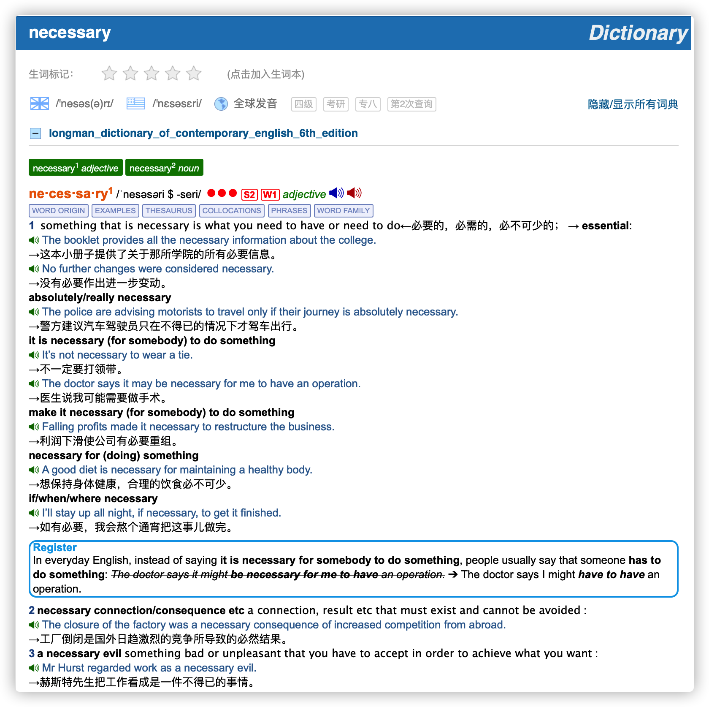

# Longman Dictionary of Contemporary English 5th/6th Edition

朗文当代英文词典 第 5/6 版

## New words

### 2021.07.12

#### 1. facilitate `/fəˈsɪlɪteɪt/` ●○○ `AWL` `verb [transitive]` formal  
==VERB TABLE== ==EXAMPLES== ==THESAURUS== ==COLLOCATIONS== ==WORD FAMILY==

##### 促进；使便利 (to make it easier for a process or activity to happen)
- Computers can be used to facilitate language learning. 计算机可以用来方便语言学习。
- facilitation `/fəˌsɪlɪˈteɪʃən/` `noun` [uncountable]

#### 2. the‧sau‧rus `/θɪˈsɔːrəs/` noun (plural thesauruses or thesauri /-raɪ/) [countable]  
WORD ORIGIN EXAMPLES WORD SETS
a book in which words are put into groups with other words that have similar meanings←分类词典，同义词词典

## Content

如果手机上只能装一本词典的话，我会推荐它。在所有的学习型词典中，朗文英英5/6词典（以下简称LDOCE5/6）是业界最良心的一本，它收词量最大，例句最多，各种搭配和用法举例也非常用心。

词典给出了每个单词的音标以及英式和美式发音，同时还有单词的词源，比如"rendezvous"其实是来源于法语。同时它会列出单词每个词条的解释以及各种搭配和例句。

LDOCE5/6 最令人感动的地方是：单词的例句都是带有发音的！这种发音不是机械的电脑合成音，而是真人原声，非常清晰自然。看例句的时候可以听一听语音，可以加深对例句的理解。

### 常用功能解释：

- **常用 9000 词**: 朗文根据语料库词频整理出常用的 9000 个词汇，并将他们划分为高，中，低三个频次。每个频次分别用 3 个红点，2 个红点和一个红点示意。（位于音标右侧，如图所示）
- **口语(Spoken)/写作(Writing)常用 3000 词**: 朗文在常用 9000 词的基础上，分别针对口语和写作整理出了最为常用的 3000 个词汇并分别用 `S1`,`S2`,`S3` 与 `W1`, `W2`, `W3` 进行标识。以上图为例: necessary 标有 `S2`, `W1` 的标识，代表了 necessary 既属于口语常用 2000 词，也属于写作常用 1000 词的范围。

- **WORD ORIGIN (词源)**
- **VERB TABLE (动词表)**
- **EXAMPLES (例句)**
- **THESAURUS (近义词，同类词)**: 举个例子，对于 "walk"，它会列出与之意思相近的单词："wander,stride,pace,wade"，并对此进行比较。比较之后你会发现，这些单词都有“走”的意思，但每个单词的意思都有细微的区别，比如"wander"是“漫步”，"stride"是“大踏步走”，pace是“踱步走”。而只有理解了这些词的区别之后你才能准备使用它们。
- **COLLOCATIONS (常见搭配)**: COLLOCATIONS，也就是搭配功能，这一点对写作很有帮助。 比如 "development" 这个词大家都知道，但是应该怎么使用呢？这个词前面应该用什么动词？ COLLOCATIONS 会告诉你，可以用 support/assist/further/facilitate development，比如：
    + We need to facilitate development and economic activity that provides jobs.
- **WORD FAMILY (词汇家族)**: 比如 economics, economist, economy, economic, economical 这样的词汇家族。朗文词典在每个单词页面的顶部把所有相关的不同词性的关联词汇清晰地罗列了出来，并且每个家族词汇都设置了超链接，点击即可跳转相关词汇的页面，十分方便。
- **PHRASES (词组，习语)**
- **WORD SETS (词汇集合)** : 比如计算机相关词汇，昆虫相关词汇， 蔬菜相关词汇等等。 

### 欧路词典安装扩展词库的方法，以 windows 为例：
点击软件右上角的 **工具** --> **词库管理**， 点击 **安装词库**， 点击 **打开文件** 按钮
找到词库的 mdx 格式所在的文件夹，点击加载即可 (注意：mdd 和 mdx 这两个文件的文件名必须保持一致，mdx 加载后会默认去找 mdd 文件。)
出现询问是否安装词典的对话框， 点击 "安装词库"  即可。

#### 高阶英英词典
- 韦氏高阶英英词典 (Webster's Advanced Learner's Dictionary)
- 麦克米伦高阶英英词典 (Macmillan English Dictionary for Advanced Learners)
- 柯林斯高阶英英词典 (Collins COBUILD Advanced Learner's English Dictionary)
- 剑桥高阶英英词典 (Cambridge Advanced Learner's Dictionary)

#### 三部高阶英汉双解学习词典
- 21世纪英汉汉英双向词典 (21st Century English-Chinese Dictionary)
- 牛津高阶英汉双解学习词典 (xford Advanced Learner's English-Chinese Dictionary)
- 柯林斯高阶英汉双解学习词典 (Collins COBUILD Advanced Learner's English-Chinese Dictionary)

#### 两部同义词词典
- 柯林斯英语同义词字典 (Collins Thesaurus)
- 牛津初级同义词词典 (Oxford Learner's Thesaurus)

#### 三部母语者使用的英英词典
- 韦氏大学英语词典 (Merriam-Webster's Collegiate Dictionary)
- 美国传统英语词典 (American Heritage Dictionary)
- 牛津英语词典 (Oxford Dictionary of English)

