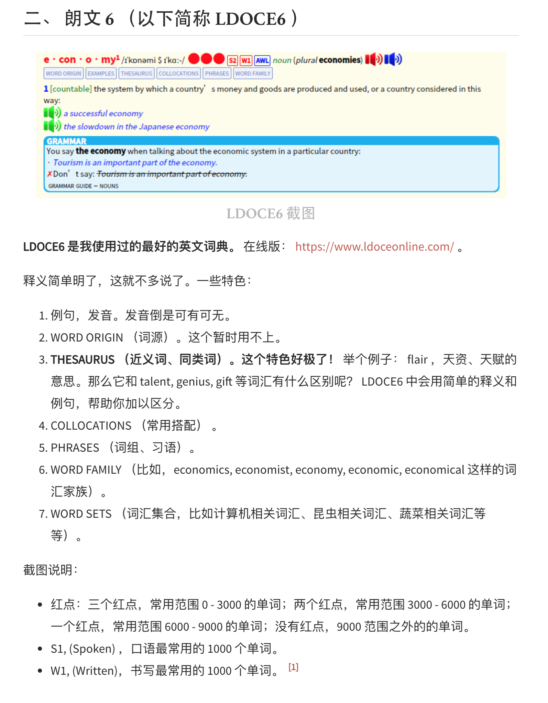

# English-Notes 英语笔记

- 真正的理解是无法速成的, 需要大量系统性的输入和辩证的思考.

    

## Catalog
1. 学习英语到底学的是什么, 换句话说, 英语是由什么组成的?
2. 一张图告诉你英语该学什么
3. 欧路词典适用的英语词典扩展包

## New Words
- **contemporary `[kənˈtempərəri]`/`[kənˈtempəreri]` --adj.当代的,现代的.**
  **--n.同代人,同龄人.**
    + contemporary society 当代社会
    + Longman Dictionary of Contemporary English 5th Edition. 
      朗文当代高级英文词典 第5版
    + That's very contemporary. 那是非常现在的.

## Content

### 1. 学习英语到底学的是什么, 换句话说, 英语是由什么组成的?
英语的组成基本可以归纳为三大块: **发音, 语法, 词汇**.

学好发音、语法和词汇. 搞定这三个, 不存在英语学不好的. 

至于所谓的 阅读/听力/写作/翻译/口语 无非都是在这 3 者基础之上的运用.
在实际操作中, 不过就是写句子, 听句子, 说句子, 翻句子. 

这里按照数学中取`交集(intersection set)`的方法,
用`文氏图(Venn 图)`来表示**发音, 语法, 词汇**是英语各项能力的共同交集,
所以说这三项也就是大家必须要掌握的基本功.

此段笔记来源: [知乎: 萌姐英语](https://www.zhihu.com/question/59148385/answer/1140437392)
(略有修改).

### 2. 一张图告诉你英语该学什么
此节的笔记来自 b 站视频:

> [第01讲 一张图告诉你英语该怎么学 | 英语学习方法论](https://www.bilibili.com/video/BV1jE41157bX?t=1435)

此处以视频中的一张图来总结整个视频中的内容

实际上上面这个图简单总结我觉得可以写成这样(个人看法):

### 3. 欧路词典适用的英语词典扩展包:
下面的笔记来源 - [每个人都值得拥有几本好词典](https://zhuanlan.zhihu.com/p/20214473?refer=talk-about-english)

词典下载 (hint: 网盘里的分享不来自当前文章在微信公众号里获取的资源,
实际上我还真的从微信公众号里获取了资源, 但实在"太乱"了, 完全一脸懵逼.)
+ 链接: https://pan.baidu.com/s/1ugzkQCVv8PrHL4601AvMaw
+ 密码: 1me4

#### (1) Longman Dictionary of Contemporary English 5th Edition (朗文当代高英文词典 第5版)

如果手机上只能装一本词典的话，我会推荐它。在所有的学习型词典中，朗文英英5词典（以下简称LDOCE5）是最业界良心的一本，它收词量最大，例句也最多，各种搭配和用法举例也非常用心。

词典给出了每个单词的音标以及英式和美式发音，同时还有单词的词源，比如"rendezvous"其实是来源于法语。同时它会列出单词每个词条的解释以及各种搭配和例句。

LDOCE5最令人感动的地方是：单词的例句都是带有发音的！这种发音不是机械的电脑合成音，而是真人原声，非常清晰自然。看例句的时候可以听一听语音，可以加深对例句的理解。

除了真人语音之外，LDOCE5还有一个很实用的功能：COLLOCATIONS，也就是搭配功能，这一点对写作很有帮助。

比如"development"这个词大家都知道，但是应该怎么使用呢？这个词前面应该用什么动词？ COLLOCATIONS 会告诉你，可以用 support/assist/further/facilitate development ，比如 We need to facilitate development and economic activity that provides jobs.

写作时如果碰到单词认识但不会用，不妨试着查一查 LDOCE5，词典上面的搭配功能应该能够给你带来启发。

词典还有另一个很实用的功能：THESAURUS

举个例子，对于"walk"，它会列出与之意思相近的单词："wander,stride,pace,wade"，并对此进行比较。比较之后你会发现，这些单词都有“走”的意思，但每个单词的意思都有细微的区别，比如"wander"是“漫步”，"stride"是“大踏步走”，pace是“踱步走”。而只有理解了这些词的区别之后你才能准备使用它们。

除了上面提到的几个功能之外，词典还有语料库（里面有大量例句），用法指示等功能，LDOCE5 是一个资源宝库，值得我们好好探索。

        
欧路词典安装扩展词库的方法，以 windows 为例：
点击软件右上角的 **工具** --> **词库管理**， 点击 **安装词库**， 点击 **打开文件** 按钮
找到词库的 mdx 格式所在的文件夹，点击加载即可 (注意：mdd 和 mdx 这两个文件的文件名必须保持一致，mdx 加载后会默认去找 mdd 文件。)
出现询问是否安装词典的对话框， 点击 "安装词库"  即可。

#### (2) Macmillan English Dictionary for Advanced Learners (麦克米伦高阶英语词典)

《麦克米伦高阶英语词典》有两个特点，一个是采用红色星号标注词频，它用一、二、三个不等的红色星号来标示其使用频率的高低（一二三星词汇加起来一共有7500个，三星词汇出现频率最高，一星最少）。另一个是带有大量的短语搭配。

麦克米伦词典收录的短语数量非常多，我在使用的时候发现很多在其他词典上找不到的短语它都有收录.

另外词典的单词同样带有英式和美式两种发音，音质很不错，例句也非常详细且接地气，是一本很好的学习词典。

#### (3) Collins Cobuild Advanced Learner's English Dictionary (柯林斯高阶英英词典)

柯林斯词典有两个特点: 
1. 采用英文整句释义来解释单词
2. 用五颗星来标记词频

比如 "melancholy" 单词, 词典是这样解释的:
1. Melancholy is an intense feeling of sadness which lasts for a long time and which strongly affects your behaviour and attitudes.
2. If someone feels or looks melancholy, they feel or look very sad.

读完这样的解释之后可我们以很容易地理解"melancholy"的意思，同时还能知道可以采用 feel/look melancholy 这样的搭配。同时 "melancholy"还带有一星的标志，这意味着它是英语中最常用的14600词之一，会经常出现，应该记起来。

柯林斯词典有一个高达2.5亿的语料库，从语料库中筛选出了最常用的14600词用五星标注。其中五星（最常用词，以下逐级次之）680词，四星1040词（累计1720词），三星1580词（累计3300词），二星3200词（累计6500词），一星8100词（累计14600词）。根据语料库的统计结果，掌握五级四级的前1720詞，就可以读通英语资料的75%，掌握五、四、三、二级的6500词，就可以读通英语资料的90%，掌握这14600词，就可以读懂任何英语资料的95%，即从理论上说，任何一篇100词的文章里大概只有5个词不认识。

总而言之，这是一本对学习者非常友好的词典，如果你刚开始使用英英词典，那么它会是一个非常好的入门选择。当然柯林斯词典也有一些缺点，比如过分追求采用整句释义来解释单词，导致解释冗长啰嗦，而且有时候会带来解释不够精确的问题。但瑕不掩瑜，这仍然是一本很不错的词典。

#### (4) Cambridge Advanced Learner's Dictionary (剑桥高阶英语学习词典)

剑桥高阶英语学习词典(又称 CALD), 这本词典的收词量很大, 而且带有大量的短语.
对于每个单词, 词典中都会给出英式和美式的音标以及发音, 
我的感觉是 CALD 的单词发音在所有英英词典中音质最棒, 最纯正.
每次单词不确定读音我都会用CALD查一遍. 

#### (5) Merriam-Webster's Advanced Learner's English Dictionary (韦氏高阶英语词典)

《韦氏高阶英语词典》是美系品牌, 因此收录了较多的美式常用惯用语以及动词搭配.
词典最大的特点是: 例句超级多. 这本词典据说收录了160,000个例句,
号称是市面上所有英语学习字典中收录例句最多者. 韦氏不仅收录例句多, 对于比较难的例句,
它还会贴心地在例句后面附带上一句通俗版的解释, 从为学习者考虑这一点来说, 
这是我见过的最有诚意的一本词典了.