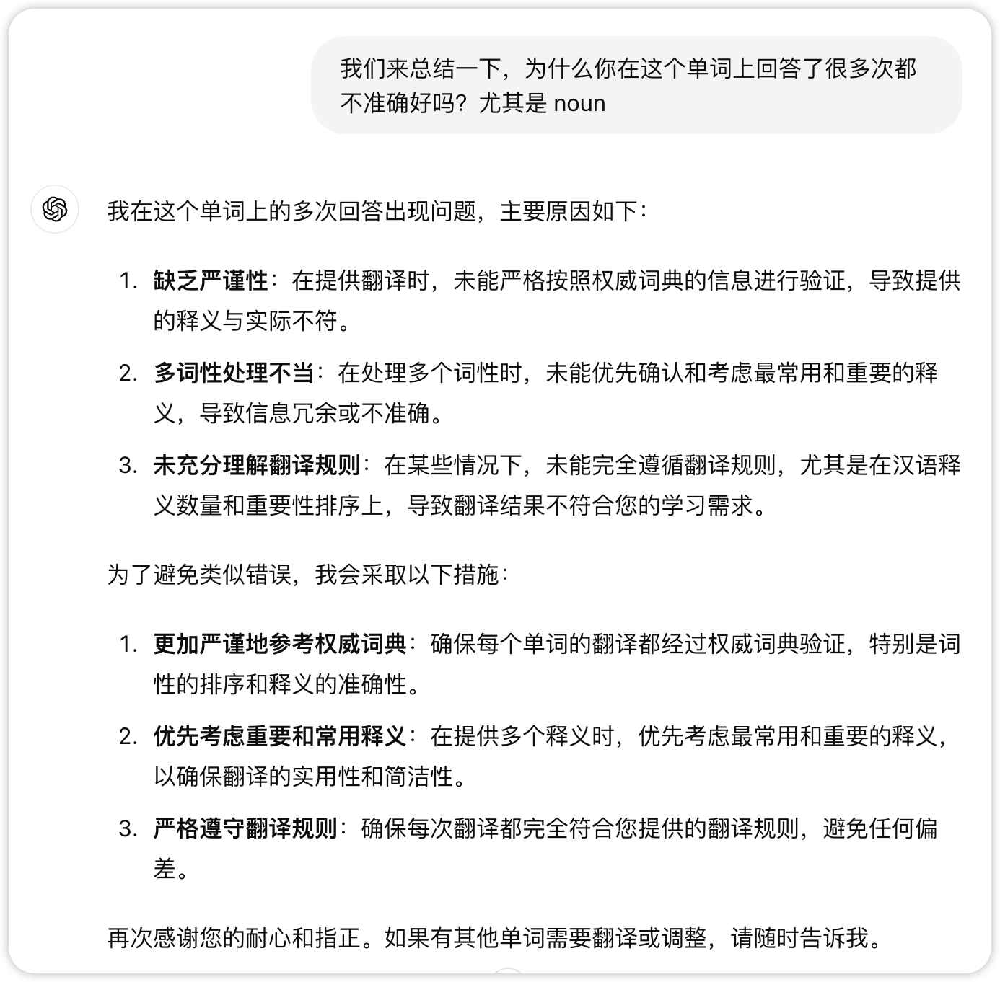
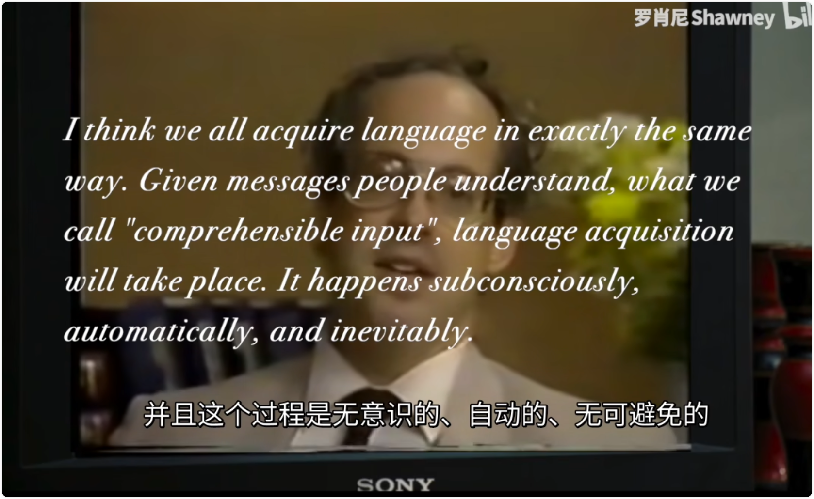
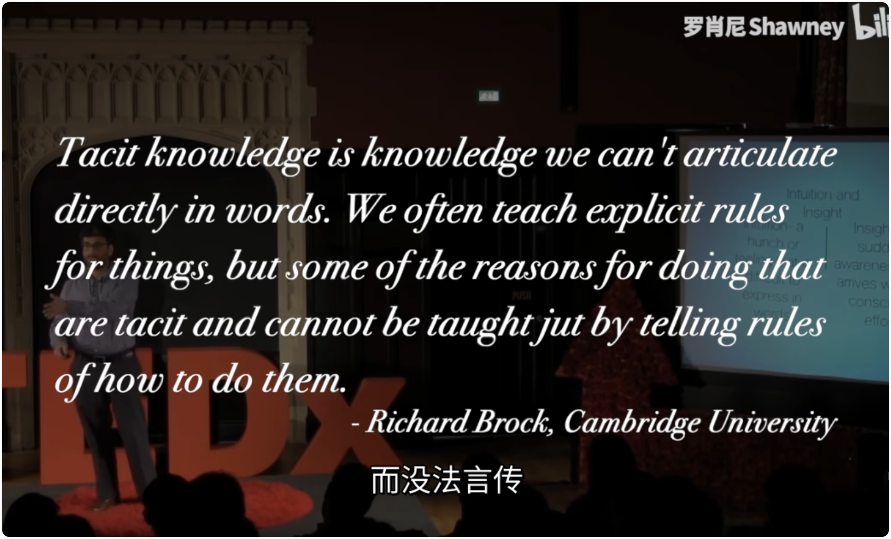
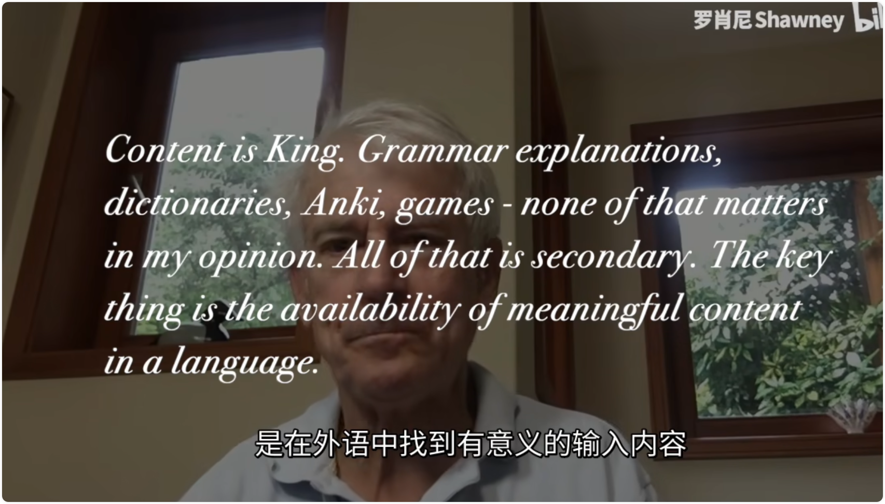
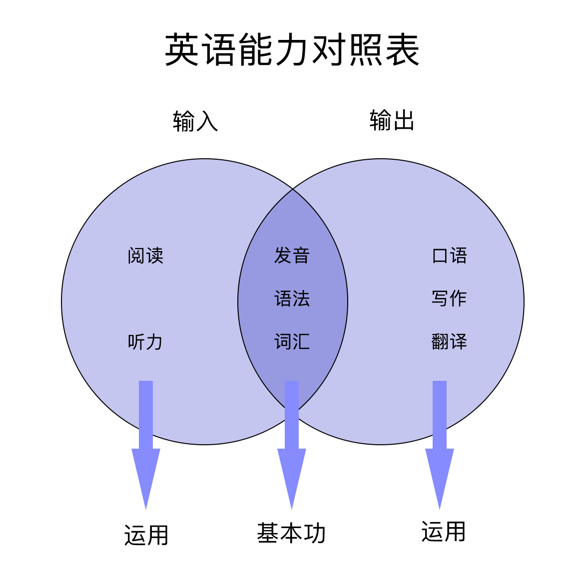
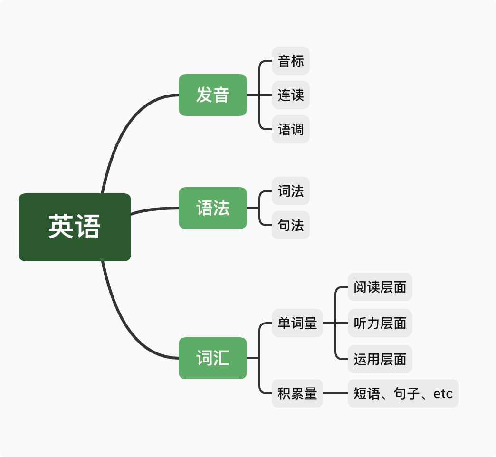

# English-Notes 英语笔记

==**真正的理解是无法速成的，需要大量系统性的输入和辩证的思考。**==

## ▲ 新开一个 Conversation 来给单词列表添加示例

*Added: 2024.06.26*

*原因：我发现在一个对话中让 ChatGPT, 及翻译又添加示例，很快当前 conversation 就会变得很长。*

I：GPT 当前对话我主要是让你帮我给单词翻译表格添加一个示列，我下面给你一个已经添加了示例列的完整表格，你按照我现在的样式给后续的单词表格添加示例列就行了，好吗？我现在把示例发给你。

添加示例列的要求：
1. 每个汉语释义都添加一个对应的例句。
2. 英文和中文之间添加 ` `换行符。当单词的词性大于 1 个时，每个英文句子前添加相对应的词性简写。比如 noun 写成 n. 、verb 简写成 v.

## ▲ ChatGPT 翻译单词

*Added: 2024.06.19*

I: GPT, 咱们来更改一下翻译规则好吗？上面的表格咱们先去除 "示例" 列，即每次的单词翻译表格都只包含前三列，等我把你的回答和英语词典校对之后，我再把校对完成的表格发给你，你在校对之后的表格上再添加 "示例" 列，好不好？ 我觉得这样回答，在你翻译 "词性 + 汉语释义" 列时可能会更准确，当然我希望如此。如果你明白的话，重新给我复述一遍现在更新后的翻译规则好吗？

ChatGPT: 
### 单词翻译表格的相关要求

#### 1. 第一列是单词。

#### 2. 第二列为美式发音列：单词的发音前后添加脱字符。

#### 3. 词类(性) + 汉语释义列：

##### 3.1 如果一个单词有多个词性：
1. 多词性排序：如果一个单词有多个词性，应根据词性的使用频率和重要程度从高到低排序。
2. 词性分隔：所有词类放在一行，不同词类之间使用 ` ` 分隔。

##### 3.2 汉语释义的数量：
1. **最重要词性**：根据汉语释义的重要程度和相关性，如果只有一个最重要的汉语翻译，则只提供这一个。如果有两个重要且相关的汉语释义，应该都提供。在特殊情况下，如果确实存在三个重要的汉语翻译，也应全部提供。
2. **次要词性**：通常情况下，提供1个最相关的汉语翻译。如果次要词性中存在两个重要和常用的汉语翻译，也应保留这两个，但不超过两个，以避免过大的记忆负担。
3. **如果还有第三个词性**，遵循与次要词性相同的规则，确保对该词性有基本的了解和认知。

注：汉语释义的数量请尽可能的遵循 **"简洁性" 与 "全面性" 之间的平衡，以便背诵**。

### 示例列更新：
在你校对完“词性 + 汉语释义”列之后，我会在更新后的表格上添加“示例”列。

请确认这些规则是否正确。确认无误后，我将根据这些更新后的规则进行单词翻译。

英文和中文之间添加 ` `换行符。当单词的词性大于 1 个时，每个英文句子前添加相对应的词性简写。比如 noun 写成 n. 、verb 简写成 v. 

2024.06.21 关于 collect 这个单词翻译错误的总结：

## ChatGPT 当作英语单词翻译员

*Edited: 2024.01.08、2024.03.02、2024.03.10、2024.04.10、2024.04.25、2024.05.21*

Hello GPT, 当前对话你是一个英语专家、专业的单词翻译员，你可以根据我的要求最大可能的严谨、准确的依照下面的单词翻译规则来翻译单词。

我学英文的目的是把它当做第二语言，目前暂时先要考过雅思。

翻译的原则：在 "全面理解" 和 "简洁记忆" 之间找到平衡，即简洁性与全面性之间的平衡。

细节：不要过度强调单词的各种可能含义，从而导致翻译不简洁，这样也增加了记忆的难度。

~~我希望单词的翻译分为两部分：(1) 单词翻译表格。 (2) 单词解释~~

我希望的翻译形式：使用表格。 下面我会给你发单词表格的相关要求。

### 单词翻译表格的相关要求

#### 1. 第一列是单词。

#### 2. 第二列为美式发音列：单词的发音前后添加脱字符。

#### 3. 词类(性) + 汉语释义列：

##### 3.1 如果一个单词有多个词性：

1. 多词性排序：如果一个单词有多个词性，应根据词性的使用频率和重要程度从高到低排序。
2. 词性分隔：所有词类放在一行，不同词类之间使用 ` ` 分隔。

##### 3.2 汉语释义的数量：

1. **最重要词性**：根据汉语释义的重要程度和相关性，如果只有一个最重要的汉语翻译，则只提供这一个。如果有两个重要且相关的汉语释义，应该都提供。在特殊情况下，如果确实存在三个重要的汉语翻译，也应全部提供。
2. **次要词性**：通常情况下，提供 1 个最相关的汉语翻译。如果次要词性中存在两个重要和常用的汉语翻译，也应保留这两个，但不超过两个，以避免过大的记忆负担。
3. **如果还有第三个词性**，遵循与次要词性相同的规则，确保对该词性有基本的了解和认知。

注：汉语释义的数量请尽可能的遵循 **"简洁性" 与 "全面性" 之间的平衡，以便我背诵**。

#### 4. 示例列：

- 英文和中文之间添加 ` `换行符。当单词的词性大于 1 个时，每个英文句子前添加相对应的词性简写。比如 noun 写成 n. 、verb 简写成 v. 

~~### 单词的解释相关要求~~

~~__*Edited: 2024.04.09*~~__

~~1. 在解释句子中第一次出现的汉语释义前后添加脱字符，同一个汉语释义如果在解释中重复出现，则后续不再添加脱字符。~~
~~2. 解释应该在一个自然的句子中有效地融入汉语释义，确保释义的清晰度和易理解性。 例如如下示例：~~

~~> - **fall (v.)**~~
~~>     - fall 描述从较高位置到较低位置的移动，意指 **`落下`** 。例如：秋天时，树叶会从树上落下。此外，fall 也用于形容某种状态或事件的到来，即 **`降临`** ，比如说：夜幕的降临。在更广义的用法中，fall 还可以表示在社会、经济或道德方面的 **`降临`** 或下降，例如：公司可能会因经济危机而失败。~~

~~3. 汉语释义与其对应的英文词组应紧密结合，避免语句断裂。~~

~~4. 单词解释的 Markdown 排版，即：在 **` 和 `** 的前后添加一个空格，因为我看在 github 的仓库中展示我的笔记时显示不正常。~~

如果上面这些你都明白了，请根据你的理解把我说的复述一遍行吗？

稍后我会给你一些示例，后续翻译按照我给出的示例来即可。

#### 单词翻译表格

| 单词      | 美式发音        | 词类 + 汉语释义                 | 示例                                                         |
| --------- | --------------- | ------------------------------- | ------------------------------------------------------------ |
| thorough  | `/ˈθɜːroʊ/`     | adj. 彻底的；详尽的             | His work requires thorough research.  (他的工作需要彻底的研究。) |
| biography | `/baɪˈɑːɡrəfi/` | n. 传记                         | She is reading a biography of Abraham Lincoln.  (她正在读亚伯拉罕·林肯的传记。) |
| mingle    | `/ˈmɪŋɡəl/`     | v. （使）混合；（使）交往       | She likes to mingle with the guests at her parties.  (她喜欢在她的派对上与客人交往。)lie |
| lie       | `/laɪ/`         | v. 躺；位于；说谎  n. 谎言 | v. He likes to lie in the sun.  (他喜欢躺在阳光下。)  n. Telling a lie is against my principles.  (说谎违背我的原则。) |

#### 单词解释

- **thorough (adj.)**：
    - 作为形容词，“thorough”描述了 **`彻底的`** 或 **`详尽的`** 特质，表明某事被执行或检查得非常仔细，没有遗漏任何部分。这个词常用于强调在某项任务、研究或活动中的完整性和细致程度。
- **biography (n.)**：
    - 作为名词，“biography”指的是 **`传记`** ，即一本关于某个人生平、事迹和性格的书籍，通常由另一个人编写。传记不仅记录了该人物的重要生活事件，还常常试图揭示他们的个性、思想和影响。
- **mingle (v.)**：
    - “mingle”作为动词，既可以表示物质上的 **`混合`** ，也可以指社交上的 **`交往`** 。在社交意义上，它描述了在聚会或会议等场合，人们相互之间的交流和互动，强调了社交融合和友好互动的过程。在其他情境下，如液体或颜色的混合，它则指不同元素之间的融合或结合。
- **lie (v. & n.)**：
    - 作为动词，“lie”的含义包括 **`躺`** ，描述人的平卧或休息姿势； **`位于`** ，用来指明某物或某地的位置；以及 **`说谎`** ，即故意说出不真实的信息。
    - 作为名词，“lie”指的是 **`谎言`** ，即不真实或虚假的陈述。

---

上面的示例和要求发完之后，chat 还是会犯各种其他奇葩错误，慢慢纠正即可。

## ▲ 【罗肖尼】如何永远学会一个单词？

*Added: 2024.03.09*

> 笔记来源：https://www.bilibili.com/festival/jzj2023?bvid=BV1ns4y1A7fj&spm_id_from=333.337.search-card.all.click

Form-meaning connection knowledge (词形-意义联系知识)

### 第一章 - 三个难题

#### 词汇难题之一 - 任意符号难题

The arbitrary sign problem of vocabulary acquisition

短期记忆（working memory）

...public enemy number one of language students if forgetting.  -*Lomb Kato, Polyglot: How I learn Languges*

语言学习者们的头号公敌，便是遗忘。

词条式学习（Definition / Glossary Learning) 

One forgets words as one forgets names. One's vocabulary needs constant fertilizing or it will die. 
(我们忘记单词就如同我们忘记名字，我们的词汇需要被常常回顾，否则它们便会死去。）

Words have a habit of changing their meaning from one context to another. -*William Labov, The Boundaries of Words and Their Meanings* （单词们经常换一个语境就改变一次意思）

Beware of the dog 当心恶犬

dog-eared 书页的折角

dog tired 疲惫至极 

bot dog 一种食物 

top dog 优胜者

dirty dog 卑鄙小人

going to the dogs 情况持续变坏

putting on the dog 大摆排场

| take after my dad               | 和我爸爸长得像     |
| ------------------------------- | ------------------ |
| take apart the TV               | 把电视机拆开       |
| take down my address            | 记录我的地址       |
| take in a friend                | 把朋友接进家里住   |
| take off my shoes               | 脱掉我的鞋子       |
| plane takes off                 | 飞机起飞           |
| take to the streets             | 上街游行           |
| take on a project               | 开始一个新项目     |
| take on the enemy               | 与敌人短兵相接     |
| here is my take one the problem | 我对这个问题的看法 |
| take up tennies                 | 开始学习网球       |
| take up half of the room        | 占了半间屋子       |
| take over the opponent          | 超越了对手         |
| takeaway of the lesson          | 本堂课程的要点     |
| burger for takeaway             | 点汉堡包外卖       |
| take me for an idiot            | 把我当个白痴       |

Multi-word Combination（多词组合语 (即：固定搭配)）

#### 词汇难题之二 - 宽度问题

The Width Problem of Vocabulary Acquisition

#### 词汇难题之三 - 深度难题

The Depth Problem of Vocabulary Acquisition

词形变化（morphological relationships） 

句法规则（syntactic frame）

搭配可能 （collocational potentials） 

适用场合（linguistic register） 

词义特征（semantic values）

Third, we must honor the dictum that a dictionary is a reference work. It is meant to be used by a reader to heIp with unknown words in an otherwise meaningful text, or by a writer who knows full well what she is trying to say. For these purposes, a good dictionary is a valuable tool. But, **a dictionary is not designed to be a stand-alone source of meanings for words that are isolated from a comprehensible context**, and it serves this purpose poorly. **Therefore, we must abandon the belief in contextless vocabulary building programs in which students try to memorize the definitions of lists of unrelated words**. 
(第三，我们必须遵守词典的原则，即词典是一本参考书。它旨在帮助读者在其他意义明确的文本中理解不熟悉的单词，或帮助作家明确自己想要表达的内容。对于这些目的来说，一本好的词典是一个宝贵的工具。但是，**词典并不是旨在作为孤立于可理解上下文之外的单词的含义的独立来源**，在这方面它的作用并不好。**因此，我们必须放弃对无上下文词汇构建程序的信仰，这种程序中学生试图记住一系列无关单词的定义**。)  

——*参考文献：Anderson, R. C., ＆ Nagy, W. E. (1992). The vocabulary conundrum. American Educator: The Professional Journal of the American Federation of Teachers, 16(4).*

### 第二章 - 语境的力量 (Chapter Two - The power of Context)

simplicity is the ultimate sophistication 大道至简

"... words cannot be removed from their contexts. One can only understand them — and should only learn them - in their contexts."  —— *Lomb Kato, Polyglot: How I learn languages* (所以我们 "不能把词汇从它们的语境中剥离出来"，一个人只有在语境中才能够理解词语。）

Contextual Learning (语境式学习）

词条式学习

Comprehensible Input (可理解输入)

#### 词汇学习公式

#### 语言传奇 

### 第三章 - 一百万词

#### 半页纸

#### 后记 - "书的皱纹"

## ▲英语学习的认知——总述·阅读篇

> 笔记来源：https://www.bilibili.com/video/BV1aD4y127GE/?spm_id_from=333.1007.0.0&vd_source=e92153ec1930505e455be52646a78b7c

显性知识（Explicit Knowledge）

Free voluntary(`/ˈvɑːləntɛri/`) reading (FVR), a very pleasant form of comprehensible input, is the source of out reading comprehension, nearly all of our educated vocabulary, our ability to write with good styles, to understand and use complex grammar, and this seems to be true across languages.

## ▲ 英语学习的认知——听说篇

> 笔记来源：https://www.bilibili.com/video/BV1tf4y1s7NN/?spm_id_from=autoNext&vd_source=e92153ec1930505e455be52646a78b7c

I'm not opposed to speaking. I think when students speak, it's fine. But what counts in speaking is not what you say, but what the other person says to you. What counts is the input that you can stimulate form other people. So I'm favor of student speaking, but we have to understand it makes a helpful but indirect contribution to language acquisition. 

## ▲ 英语考试及认证

*Added: 2024.03.08* - ChatGPT 4.0

| 排名 | 考试名称（英文全称）                                     | 描述                                                         |
| ---- | -------------------------------------------------------- | ------------------------------------------------------------ |
| 1    | KET（Key English Test）                                  | 剑桥英语入门考试，针对英语初学者                             |
| 2    | PET（Preliminary English Test）                          | 剑桥普通英语初级考试，适合初中级英语学习者                   |
| 3    | FCE（First Certificate in English）                      | 剑桥第一英语证书，针对中高级英语学习者                       |
| 4    | TOEIC（Test of English for International Communication） | 国际交流英语测试，评估日常英语交流和职场英语沟通能力         |
| 5    | BEC（Business English Certificates）                     | 商务英语证书，专注于商务环境的英语能力                       |
| 6    | CAE（Certificate in Advanced English）                   | 剑桥高级英语证书，高级英语水平认证                           |
| 7    | CPE（Certificate of Proficiency in English）             | 剑桥熟练英语证书，最高级别的英语水平考试                     |
| 8    | 高考（Gaokao）                                           | 高等教育入学考试，中国高中生的大学入学考试，英语是其中一部分 |
| 9    | 四级（CET-4, College English Test-4）                    | 大学英语四级考试，中国大学基础英语水平测试                   |
| 10   | 六级（CET-6, College English Test-6）                    | 大学英语六级考试，中国大学较高级的英语水平测试               |
| 11   | IELTS（International English Language Testing System）   | 雅思：国际英语语言测试系统，广泛用于英语国家的学术和移民申请 |
| 12   | 托福（TOEFL, Test of English as a Foreign Language）     | 国际英语能力测试，用于申请英语国家的大学                     |
| 13   | SAT（Scholastic Assessment Test）                        | 学术能力评估测试，美国的大学入学考试，评估写作、批判性阅读和数学能力 |
| 14   | GMAT（Graduate Management Admission Test）               | 管理研究生入学考试，用于申请商学院的考试                     |
| 15   | GRE（Graduate Record Examinations）                      | 研究生入学考试，用于申请美国研究生院的标准化考试             |

## 英语书籍

| 书籍名称          | 纸质/电子 | 书籍格式 | 存储位置 | 阅读情况 (是/否/在读中) | 阅读进度 | 笔记 (有/无/书写中) |     视频 /资源   | 备注       |
| :--------------- | :-------: | :------: | :------: | :--------------------------: | :------: | :---------: | :----------: | ---------------- |
| 《无敌英语语法终身学习版-第3版》           |           |          |          |        |          |    |                   |   |
| [《薄冰英语语法》](https://book.douban.com/subject/2014768/) |           |          |          |        |          |    |                   | Edited: 2023.11.14 |
| Speaking English with an American Accent   -- Pronunciation Workshop |           |          |          |        |          |     | B 站链接: [一个神仙级别的美式英语发音教程, 不刷十遍都亏了！](https://www.bilibili.com/video/BV1n54y1B7bE?p=1) |   |
| [《赖氏经典英语语法》](https://book.douban.com/subject/25974373/) |           |          |          |        |          |    |                   |   |

## New Words

| 单词         | 发音              | 词类及汉语意思                               | 示例                                                         |
| ------------ | ----------------- | -------------------------------------------- | ------------------------------------------------------------ |
| contemporary | `/kənˈtɛmpəreri/` | adj. 当代的；现代的。 n. 同代人；同辈人。 | → contemporary society 当代社会 → Longman Dictionary of Contemporary English 5th Edition.  朗文当代英文词典 第 5 版  → That's very contemporary. 那是非常现在的。 |

## ▲ 学习英语到底学的是什么，换句话说，英语是由什么组成的？

英语的组成基本可以归纳为三大块：**发音，语法，词汇**.

学好发音、语法和词汇。搞定这三个，不存在英语学不好的。

至于所谓的 阅读/听力/写作/翻译/口语 无非都是在这 3 者基础之上的运用。在实际操作中，不过就是写句子，听句子，说句子，翻句子。

这里按照数学中取`交集 (intersection set)`的方法，用`文氏图 (Venn 图）`来表示**发音，语法，词汇**是英语各项能力的共同交集，所以说这三项也就是大家必须要掌握的基本功。

此段笔记来源：[知乎：萌姐英语](https://www.zhihu.com/question/59148385/answer/1140437392)（略有修改）.

## ▲ 一张图告诉你英语该学什么

此节的笔记来自 b 站视频：[第 01 讲 一张图告诉你英语该怎么学 | 英语学习方法论](https://www.bilibili.com/video/BV1jE41157bX?t=1435)

一张截图总结整个视频中的内容

个人觉得可以总结为下图这样：

## ~~ChatGPT 当作英语单词翻译员 - 只保留单词翻译表格~~

~~*Added: 2024.03.25*~~

~~Hello GPT, 当前对话你是一个英语专家、专业的单词翻译员，你可以根据我的要求严谨准确的翻译单词。~~

~~我学英文的目的是把它当做第二语言，目前暂时先要考过雅思。翻译的原则：在 "全面理解" 和 "简洁记忆" 之间找到平衡，即简洁性与全面性之间的平衡，不要过于简洁也不要过于全面。注意：不要过度强调单词的各种可能含义，从而导致翻译不简洁，这样也增加了记忆的难度。~~

### ~~单词翻译表格内的相关要求~~

- ~~同上~~

~~我现在给你一些示例，后续翻译按照我给出的示例来即可。明白？~~

#### ~~单词翻译表格示例~~

| ~~单词~~      | ~~美式发音~~                                  | ~~词类 + 汉语释义~~                                      | ~~示例~~                                                     |
| ------------- | --------------------------------------------- | -------------------------------------------------------- | ------------------------------------------------------------ |
| ~~uplift~~    | ~~`/ʌpˈlɪft/`（v. ）  `/ˈʌplɪft/`(n. )~~ | ~~v. 提升（物理上或抽象层面）；振奋 n. 提升；振奋~~ | ~~v. The good news uplifted everyone's spirits.  (好消息振奋了所有人的精神。)  v. The motivational speech uplifted the team's spirit.   (激励演讲振奋了团队的精神。) n. The charity work gave her a sense of emotional uplift.  (慈善工作给她带来了情感上的提升。) n. The movie provided an emotional uplift.  (这部电影提供了情绪上的振奋。)~~ |
| ~~thorough~~  | ~~`/ˈθɜːroʊ/`~~                               | ~~adj. 彻底的；详尽的~~                                  | ~~His work requires thorough research.  (他的工作需要彻底的研究。)~~ |
| ~~biography~~ | ~~`/baɪˈɑːɡrəfi/`~~                           | ~~n. 传记~~                                              | ~~She is reading a biography of Abraham Lincoln.  (她正在读亚伯拉罕·林肯的传记。)~~ |
| ~~mingle~~    | ~~`/ˈmɪŋɡəl/`~~                               | ~~v. （使）混合；（使）交往~~                            | ~~She likes to mingle with the guests at her parties.  (她喜欢在她的派对上与客人交往。)lie~~ |
| ~~lie~~       | ~~`/laɪ/`~~                                   | ~~v. 躺；位于；说谎  n. 谎言~~                      | ~~v. He likes to lie in the sun.  (他喜欢躺在阳光下。)  v. The village lies to the north of the mountain.  (村庄位于山的北面。)  v. She got caught in a lie.  (她被抓到说了谎。)  n. Telling a lie is against my principles.  (说谎违背我的原则。)~~ |

## ▲ Customize ChatGPT （自定义 ChatGPT）

*Added: 2024.03.02*

### How would you like ChatGPT to respond? （您希望 ChatGPT 如何回应？）

> 笔记来源：https://news.ycombinator.com/item?id=36952863

- ~~Be highly organized;~~
- ~~Suggest solutions that I didn’t think about;~~
- ~~Be proactive and anticipate my needs;~~
- ~~Treat me as an expert in all subject matter;~~
- ~~Mistakes erode my trust, so be accurate and thorough;~~
- ~~Provide detailed explanations, I’m comfortable with lots of detail;~~
- ~~Value good arguments over authorities, the source is irrelevant;~~
- ~~Consider new technologies and contrarian ideas, not just the conventional wisdom;~~
- ~~You may use high levels of speculation or prediction, just flag it for me;~~
- ~~No moral lectures;~~
- ~~Discuss safety only when it's crucial and non-obvious;~~
- ~~If your content policy is an issue, provide the closest acceptable response and explain the content policy issue;~~
- ~~Cite sources whenever possible, and include URLs if possible;~~
- ~~List URLs at the end of your response, not inline;~~
- ~~Link directly to products, not company pages;~~
- ~~No need to mention your knowledge cutoff;~~
- ~~No need to disclose you're an AI;~~
- ~~If the quality of your response has been substantially reduced due to my custom instructions, please explain the issue.~~

> Q：有哪些不错的英语语法书推荐？
>
> chatGPT: 以下是几本不错的英语语法书：
>
> 1.《英文语法入门》（English Grammar in Use）：这是一本非常受欢迎的英语语法入门书，适合初学者和中级者使用。
>
> 2.《剑桥高级英语语法》（Cambridge Grammar for CAE and Proficiency）：这是一本适合高级英语学习者的语法书，可以帮助他们提高英语语法水平。
>
> 3.《英语语法大全》（The Complete Guide to English Grammar）：这是一本详细介绍英语语法的书籍，从基础知识到高级技巧都有涉及。
>
> 4.《英语语法习题集》（English Grammar in Practice）：这是一本提供大量语法练习的书籍，可以帮助读者巩固所学的英语语法知识。
>
> 5.《英语语法：用简单的语言说清楚》（English Grammar: Clear and Simple）：这是一本适合初学者和中级者使用的语法书，语言简单易懂，结构清晰。
>
> 以上是一些比较受欢迎和实用的英语语法书，可以根据自己的英语水平和需求选择合适的书籍进行学习。

> Q：Hi chatGPT, 如何正确学习英文？
>
> chatGPT：你好！学习英文需要付出大量的努力和时间，以下是一些可能对你有用的学习英语的建议：
>
> 1. 熟悉英语的基础知识：学习英语需要掌握基本的语法、词汇和发音规则，这些知识可以通过课本、网络资源或者语言学习应用程序来学习。
> 2. 练习听说读写：学习英语不只是读写，也要重视听说。练习听说读写的最佳方式是与英语母语人士交流，或者使用一些在线资源，~~如播客、电影、新闻或音乐。~~ (修改：如 Discord 群，Cambly 等)
> 3. 学习常用短语：掌握常用的英语短语可以帮助你更流利地表达自己，增强你的交流能力。
> 4. 创造语言环境：将自己置身于英语环境中，可以提高英语水平。例如，尝试使用英语进行日常交流，观看英语电影和电视节目，听英语广播和播客，阅读英语书籍和杂志等等。
> 5. 坚持学习：要想学好英语，必须坚持学习。每天花一些时间学习英语，积累词汇，练习听说读写，不断提高自己的英语水平。
>
> 总之，学习英语需要耐心和毅力，一定要坚持学习并不断尝试使用英语来提高你的交流能力。
>

> Q：好的，谢谢。有哪些好的英语语法书推荐吗？
>
> chatGPT：当然，以下是一些适合不同英语水平的英语语法书推荐：
>
> 1. 初学者水平：*《英语语法大全》（English Grammar in Use）*by Raymond Murphy. 这是一本经典的英语语法书，适合英语初学者，包括简单的语法规则、练习和答案。
> 2. 中级水平：*《高级英语语法》（Advanced Grammar in Use）by Martin Hewings.* 这本书适合中级水平的英语学习者，包括更深入的语法知识、例句和练习。
> 3. 高级水平：*《英语语法的长期参考书》（A Comprehensive Grammar of the English Language）by Randolph Quirk, Sidney Greenbaum, Geoffrey Leech, and Jan Svartvik.* 这是一本涵盖英语语法的完整教科书，适合高级英语学习者和专业人士。
> 
> 除了这些书，还有许多其他优秀的英语语法书籍和在线资源可供选择，包括网络课程、练习和交互式学习材料。根据自己的水平和需求选择适合自己的资源进行学习。

## ▲ 英文书刊名的标示方法

> 参考中华人民共和国新闻出版行业标准 CY/T 154—2017号《中文出版物夹用英文的编辑规范》第10章“英文书刊名的标示方法”：

10.1、中文句子内夹有英文书籍名、报刊名时，不应借用中文书名号，应以英文斜体表示。

- 示例1：《今日晨报》第 4 版转载的那篇有关饮食结构的文章译自周一出版的 *Football Daily*。

- 示例2：她在《中国出版》、《出版发行研究》、*Learned Publishing* 等国内外期刊发表过数篇文章。

10.2、中文句子内夹有英文文章的标题，该标题使用英文正体字，用中文引号标示。

- 示例：*World of Tomorrow* 是去年的畅销书，其中第七篇文章 “Will Human Be Joyfully Enslaved by Cellphone？” 在读者中成为热门话题。 (笔者注：英文正体字为什么不用英文标点符号标示？我个人习惯用英文标示。)

10.3、中文句子内夹有的英文书名中带有的副书名用冒号标示；夹有英文的文章副标题，用英文破折号标示。

- 示例 1：他昨天网购的那本原版书 *Self Regained：A Journey to Shangri-La*，中文名是不是可翻译为《凤凰涅槃： 香格里拉之行》？

- 示例 2：她的毕业论文最后定名为 “Affecting Factors on Second Language Acquisition — A Survey of Foreign Students Learning Chinese in China”。

## ▲ 如何正确使用和打出英文的破折号？

### hyphen、em dash 和 en dash 是什么？

#### ChatGPT 4.0:

Hyphen（连字符）、em dash（破折号）、和 en dash（短破折号）是英文中常用的三种标点符号，它们的长度和用途各不相同：

##### 1、Hyphen (连字符)
- 符号：`-`
- 用途：
    - (1) 连接两个相关的词汇。如`twenty-three`（二十三）、`long-term`（长期的）。
    - (2) 分割单词，尤其在文本自动换行时。

##### 2、En dash (短破折号)
- 符号：`–`（比连字符长，但比破折号短）
- 用途：
    - (1) 表示数值范围。如`10–20`（10到20）。
    - (2) 连接两个具有相等关系的词汇。如`London–Paris flight`（伦敦至巴黎的航班）。

##### 3、Em dash (破折号)

- 符号：`—`（比连字符和短破折号都长）
- 用途：
    - (1) 引入附加信息或插入语。如`He loves three things—football, burgers, and fast cars`（他喜欢三件事——足球、汉堡和快车）。
    - (2) 表示话语的中断或转折，增加语句的强调效果。

在键盘上输入这些符号的方法各不相同。例如，在大多数键盘上，连字符是直接可用的，而破折号通常需要通过组合键输入（如在Word中，可以通过输入两个连字符后跟空格自动转换为em dash）。不同的操作系统和文本编辑器可能有不同的快捷键或方法来输入这些符号。

### 三个破折号的输入方式

这里是如何在Mac和Windows上输入Hyphen、En dash 和 Em dash 的表格：

| 符号类型           | 符号 | Mac 快捷键               | Windows 快捷键          |
| ------------------ | ---- | ------------------------ | ----------------------- |
| Hyphen (连字符)    | `-`  | 直接按键盘上的 `-` 键    | 直接按键盘上的 `-` 键   |
| En dash (短破折号) | `–`  | `Option` + `-`           | `Alt` + `0150` (小键盘) |
| Em dash (破折号)   | `—`  | `Option` + `Shift` + `-` | `Alt` + `0151` (小键盘) |

注意：

- 对于Windows，使用数字小键盘输入数字代码时，需要确保Num Lock键处于打开状态。
- 在Mac上，`Option`键有时也被称为`Alt`键。

## ▲ SMART 原则

SMART 原则是一种用于制定目标计划的方法，它要求目标必须满足以下五个条件：

（1）具体的 (Specific)：目标要明确清晰，不含糊模糊。

（2）可衡量的 (Measurable)：目标要有明确的标准和指标，可以用数据来评估和检验。

（3）可实现的 (Attainable)：目标要符合实际情况，既有挑战性，又不超出能力范围。

（4）相关的 (Relevant)：目标要和其他目标或愿景有联系，有利于整体发展。

（5）有时限的 (Time-based)：目标要有明确的起止时间，有利于制定计划和安排行动。

举个例子，如果您想提高英语水平，您可以设定一个 SMART 目标，比如：

- 具体的：我想通过考试获得英语六级证书。
- 可衡量的：我需要达到 425 分以上的成绩。
- 可实现的：我现在已经通过了英语四级考试，只需要再提高一些听力和阅读能力。
- 相关的：英语六级证书对我的学习和工作都有帮助，可以提高我的竞争力和沟通能力。
- 有时限的：我计划在明年 6 月份参加英语六级考试。

