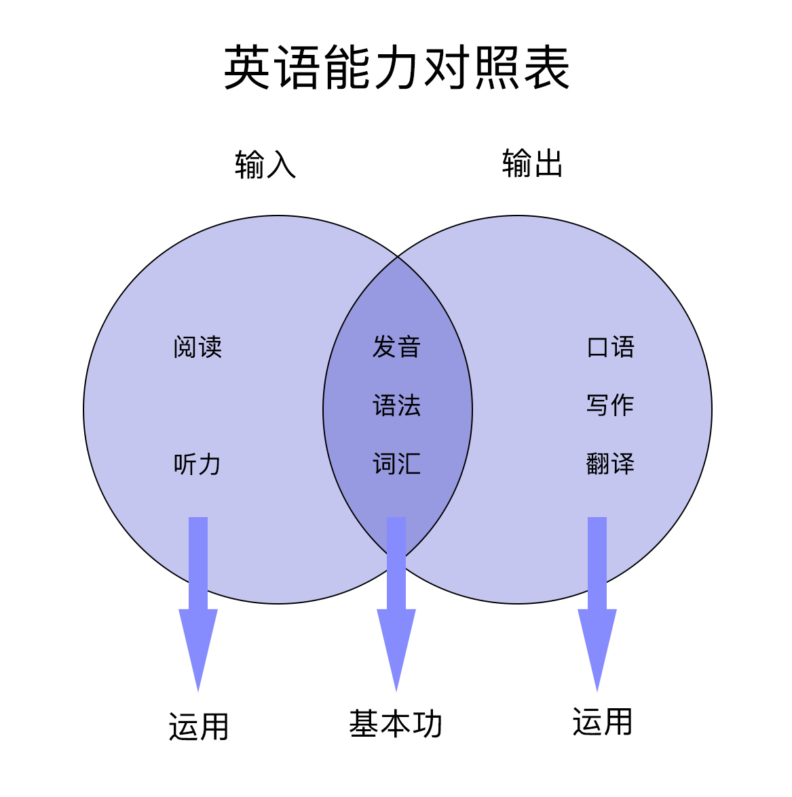
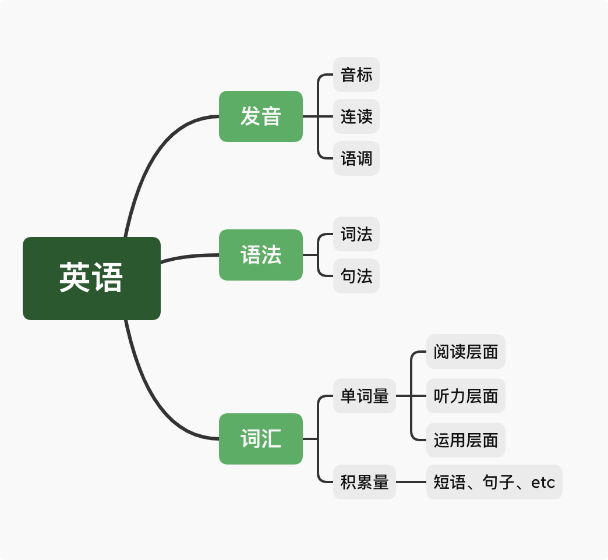

# English-Notes 英语笔记


- 真正的理解是无法速成的, 需要大量系统性的输入和辩证的思考.


```css
├── adj
│   ├── 
│   │   ├── 
│   │   ├── 
│   ├── 
│   │   ├──  
│   │   │  
│
├── verb[intransitive, transitive]
│   ├── 
│   │   ├── 
│   │   ├── 
│
├── noun
│   ├── 
│   ├── 


18$^{(th)}$


## New Words
- **contemporary `[kənˈtempərəri]`/`[kənˈtempəreri]` --adj.当代的,现代的.**
  **--n.同代人,同龄人.**
    + contemporary society 当代社会
    + Longman Dictionary of Contemporary English 5th Edition. 
      朗文当代英文词典 第5版
    + That's very contemporary. 那是非常现在的.


## Content

### 1. 学习英语到底学的是什么, 换句话说, 英语是由什么组成的?
英语的组成基本可以归纳为三大块: **发音, 语法, 词汇**.

学好发音、语法和词汇. 搞定这三个, 不存在英语学不好的. 

至于所谓的 阅读/听力/写作/翻译/口语 无非都是在这 3 者基础之上的运用.
在实际操作中, 不过就是写句子, 听句子, 说句子, 翻句子. 

这里按照数学中取`交集(intersection set)`的方法,
用`文氏图(Venn 图)`来表示**发音, 语法, 词汇**是英语各项能力的共同交集,
所以说这三项也就是大家必须要掌握的基本功.



此段笔记来源: [知乎: 萌姐英语](https://www.zhihu.com/question/59148385/answer/1140437392)
(略有修改).


### 2. 一张图告诉你英语该学什么
此节的笔记来自 b 站视频:

> [第01讲 一张图告诉你英语该怎么学 | 英语学习方法论](https://www.bilibili.com/video/BV1jE41157bX?t=1435)

此处以视频中的一张图来总结整个视频中的内容


个人觉得可以总结为下图这样：




### 3. 欧路词典介绍使用及其扩展词典推荐

#### 3.0 欧路词典是什么
欧路词典是支持 IOS、Android(安卓)、Windows、Mac 系统的全平台的**英语词典软件**。它首创 LightPeek 取词，可以做到即指即译，划词搜索，跨软件取词。

在手机上看英语文章时遇到生词可以直接用欧路词典查询而且支持查询过的生词自动加入生词本。支持卡片式复习，支持利用内置词典导出生词本到本地。

最重要的是，**欧路词典支持个性化加载 Mdict、灵格斯等多种格式的扩充词库**。免费/收费版本自选。

#### 3.1 欧陆词典文件格式
欧路词典的每部扩展词典一般包含两个文件：mdx 文件和 mdd 文件。

**mdx 文件是标准的电子词典文件格式**，里面储存的是一部词典的文本信息。

**mdd 文件里面包含的是声音和图片**。

有的词典只有一个 mdx 文件，没有 mdd 文件，就代表这部词典是没有单词发音，不能点击发声。

#### 3.3 欧路词典扩充词库的安装方法

##### windows 系统：
依次点击欧路词典主界面右上角“工具”---“词库管理”点击“安装词典”，找到词库所在文件夹。

按住 CRTL 键同时选择一部词典的 mdd 文件和 mdx 文件，点击“打开” （注意mdd和mdx这两个文件的文件名必须保持一致）

出现询问是否安装词典的对话框，点击“安装词库”，即可完成扩展词库的安装。

安装完全部词库后，可以在词库管理器页面，单击选中任一词库，然后点击上方工具栏内的”上移“”下移“按钮，调整此词库在查询单词释义时出现的先后位置。
##### ipad 与 iphone：
在百度网盘内点击下载好的欧路扩充词库，页面显示“抱歉，该文件暂时无法预览”。

点击页面底部最左侧的"打开"图标，选择“用欧路词典导入”。此时欧路词典APP自动打开，并询问是否安装词库，点击“安装”，即可完成此部扩展词典的安装。

##### Mac 系统：
直接拖拽下载好的扩充词库文件到欧路词典词库扩充框中即可。

##### 安卓系统：
在电脑上或百度云盘中下载好词库文件，找到文件所在目录并复制到手机的 `eudb_en` 文件内。之后可以在手机欧路词典APP的"词典库管理"中调整词库显示顺序。


#### 3.4 欧路词典扩充词库(词典)推荐
> 笔记参考 - [每个人都值得拥有几本好词典](https://zhuanlan.zhihu.com/p/20214473?refer=talk-about-english)

下面词典的下载链接：
+ 链接: https://pan.baidu.com/s/1ugzkQCVv8PrHL4601AvMaw
+ 密码: 1me4


#### (1) Longman Dictionary of Contemporary English 5th/6th Edition (朗文当代英文词典 第5版) （Hint: 墙裂推荐）
笔记详见同级目录的: `./Longman-dictionary.md`

#### (2) Macmillan English Dictionary for Advanced Learners (麦克米伦高阶英语词典)

《麦克米伦高阶英语词典》有两个特点，一个是采用红色星号标注词频，它用一、二、三个不等的红色星号来标示其使用频率的高低（一二三星词汇加起来一共有7500个，三星词汇出现频率最高，一星最少）。另一个是带有大量的短语搭配。

麦克米伦词典收录的短语数量非常多，我在使用的时候发现很多在其他词典上找不到的短语它都有收录.

另外词典的单词同样带有英式和美式两种发音，音质很不错，例句也非常详细且接地气，是一本很好的学习词典。


#### (3) Collins Cobuild Advanced Learner's English Dictionary (柯林斯高阶英英词典)

柯林斯词典有两个特点: 
1. 采用英文整句释义来解释单词
2. 用五颗星来标记词频

比如 "melancholy" 单词, 词典是这样解释的:
1. Melancholy is an intense feeling of sadness which lasts for a long time and which strongly affects your behavior and attitudes.
2. If someone feels or looks melancholy, they feel or look very sad.

读完这样的解释之后可我们以很容易地理解"melancholy"的意思，同时还能知道可以采用 feel/look melancholy 这样的搭配。同时 "melancholy"还带有一星的标志，这意味着它是英语中最常用的14600词之一，会经常出现，应该记起来。

柯林斯词典有一个高达2.5亿的语料库，从语料库中筛选出了最常用的14600词用五星标注。其中五星（最常用词，以下逐级次之）680词，四星1040词（累计1720词），三星1580词（累计3300词），二星3200词（累计6500词），一星8100词（累计14600词）。根据语料库的统计结果，掌握五级四级的前1720詞，就可以读通英语资料的75%，掌握五、四、三、二级的6500词，就可以读通英语资料的90%，掌握这14600词，就可以读懂任何英语资料的95%，即从理论上说，任何一篇100词的文章里大概只有5个词不认识。

总而言之，这是一本对学习者非常友好的词典，如果你刚开始使用英英词典，那么它会是一个非常好的入门选择。当然柯林斯词典也有一些缺点，比如过分追求采用整句释义来解释单词，导致解释冗长啰嗦，而且有时候会带来解释不够精确的问题。但瑕不掩瑜，这仍然是一本很不错的词典。

#### (4) Cambridge Advanced Learner's Dictionary (剑桥高阶英语学习词典)

剑桥高阶英语学习词典(又称 CALD), 这本词典的收词量很大, 而且带有大量的短语.
对于每个单词, 词典中都会给出英式和美式的音标以及发音, 
我的感觉是 CALD 的单词发音在所有英英词典中音质最棒, 最纯正.
每次单词不确定读音我都会用CALD查一遍. 

#### (5) Merriam-Webster's Advanced Learner's English Dictionary (韦氏高阶英语词典)

《韦氏高阶英语词典》是美系品牌, 因此收录了较多的美式常用惯用语以及动词搭配.
词典最大的特点是: 例句超级多. 这本词典据说收录了160,000个例句,
号称是市面上所有英语学习字典中收录例句最多者. 韦氏不仅收录例句多, 对于比较难的例句,
它还会贴心地在例句后面附带上一句通俗版的解释, 从为学习者考虑这一点来说, 
这是我见过的最有诚意的一本词典了.
