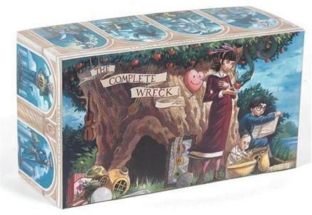
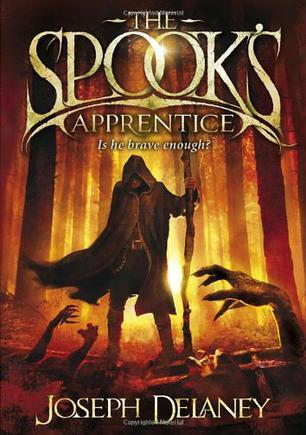
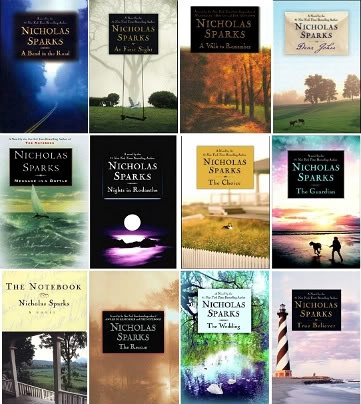
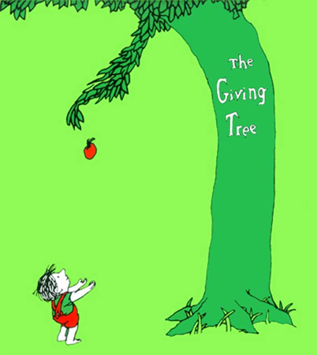
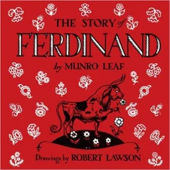

# 有哪些易读的英文著作？

> 笔记来源：https://www.zhihu.com/question/24327190

作者 / 恶魔的奶爸Sam

转载无所谓，但是不允许**不加超链接就直接转。**

> https://daily.zhihu.com/story/7226502?utm_id=0

鉴于有人跟我说英语水平要很高词汇量要很大才能看得懂原版读物，而我所谓的拿起字典就可以轻松读懂原版书的说法是扯淡，我就费事儿来整理下资料（下面的资料都属于欧美文化的重要部分，属于你聊天时候提到作为文化引典，绝对不会丢份儿，别人也都懂不会冷场的那种）

本帖长期更新：

就说说真正可以读懂的吧（以下链接皆来自维基）

首先预热一下，我觉得所有人确定一定以及肯定可以看懂的必然是这本，超简单

这本书的伟大或者经典就不多说了，里面每个生词，建议都牢牢背下来，非常值得反复精读，在欧美那儿可谓无人不知无人不晓

下面进入正题：

1, 1000-2000 词，低幼读物

这里面比较出名的

[Dr. Seuss](http://en.wikipedia.org/wiki/Dr_Suess)

全世界最出名的启蒙童话作家，500 词以内就可以看懂，他出版中的多且销量惊人，每本书都非常短，基本都是俏皮童话或者短歌谣，几乎每一位欧美小朋友的童年记忆里，都少不了苏斯博士的童话

（题主要文化背景，苏斯绝对在欧美文化中占重要的一席）

[Curious George](http://en.wikipedia.org/wiki/Curious_George)（1000 词以内）

这套书在国外也属于无人不知道无人不晓的程度，非常有趣有意思，词汇量在一两千字左右，有特别低幼的卡通图文，也有风趣可爱的短篇小故事

小火车托马斯和它的小伙伴们

[The Railway Series](http://en.wikipedia.org/wiki/The_Railway_Series)

内容较为低幼，词汇量含量也少

[Beverly Cleary](http://en.wikipedia.org/wiki/Beverly_Cleary)（1000-2000 词）

这本书的出名和经典也不用多说了，主角是 Ramona，一个淘气的小女孩，书籍难度同样非常低

[Junie B. Jones](http://en.wikipedia.org/wiki/Junie_B._Jones)

整个系列数量庞大，较多，图文可爱丰富，值得一看

这本书就不多说了，地球人应该都知道了，难度在 2000-3000 词左右

[Peter Rabbit](http://en.wikipedia.org/wiki/Peter_Rabbit)

这个系列的著名童话也不用我多说了

**2, 8 岁以上（800-3000 词）**

隆重介绍两大系列

http://en.wikipedia.org/wiki/Magic_Tree_House

Magic Tree House 神奇树屋系列，通过奇妙的树屋两位小朋友穿梭到各个异世界去冒险，见识到史前恐龙和外太空宇宙，老少皆宜的科普作品，非常推荐

[R. L. Stine](http://en.wikipedia.org/wiki/R._L._Stine)

RL 是举世闻名的儿童作家，其中的作品多带恐怖和惊悚情节，当然成人来看气势一般般啦，没有过多恶心的内容，被誉为是小学生中的史蒂芬金，他最出名的是两个系列：Goosebumps 和 Fear Street

上面这两人的作品都很丰富，每个系列都超过了 50 本，可以读很长时间，对口语和常见词汇帮助很大

[Diary of a Wimpy Kid](http://en.wikipedia.org/wiki/Diary_of_a_Wimpy_Kid)

近年来最火的儿童读物，主角是个捣蛋鬼，用充满童真童趣的生活口语写的日记，爆笑无比，非常推荐

**3，大龄儿童向（这里说的是有三四千词汇基础绝对可以看的很嗨皮的）**

同样要推荐还是两个多产作家的书

[Roald Dahl](http://en.wikipedia.org/wiki/Roald_Dahl)

Roald Dahl 属于极好极其优秀的作家，能把儿童文学写的妙笔生花风趣幽默，促狭中带有一丝丝的协趣，可谓是童话大家中的高手高手高高手，而且他写作的初中就是让每个人从童年时候就爱上阅读，所以专门针对孩子的口味，发挥自己最天马行空的想象，创造出一个个美妙的故事

[Enid Blyton](http://en.wikipedia.org/wiki/Enid_Blyton)

Enid Blyton 的所有书都推荐，非常厉害的一位作家，其中三个系列最畅销最有名：

Noddy 系列,Famous Five 系列, and Secret Seven 系列，每个系列都在 10 本以上，题材多为悬疑冒险

[WIND IN THE WILLOW 柳林风 (豆瓣)](http://book.douban.com/subject/3479011/)

上面这三本童话太出名了，就不多介绍了

下面要说一点稍微难点，但是 4K 以上词汇基础也可以将就看的

Horrible Histories 是我读过最有趣的历史科普读物，非常非常的 horrible，讲述了很多有趣的历史故事，同名的科教纪录片也一定要看！

The Chronicles of Narnia

CS Lewis 的文笔相当棒，他另外出的 Space Trilogy 也非常推荐，Narnia 胜在故事有趣，语言简单，虽然有评论说基督化的情况非常严重（日本的田中芳树非常讨厌这套书，说这套书折射的是神权和森森白骨），但是对后代的影响非常深远，HP 就是受了 Lewis 的影响，定为 7 卷的

CS Lewis 写的另一套儿童读物，属于科幻向

A Series of Unfortunate Events

顾名思义，就是讲一群倒霉蛋孩子怎么持续倒霉的故事，整套书的数量就不吉利，共 13 本

这本书也不多说了吧。。。

The Spiderwick Chronicles 共 5 本，同样是非常有趣的奇幻故事，很推荐大家阅读

4，青少向（6K 词汇以上）从这个级别开始，我就开始介绍有了四六级基础的人可以看什么，不会再分明显的难度分级，对于以下书籍有兴趣自己挑选阅读即可

哈利波特的伟大无需多言，但是我必须指出来的是：

**最好最佳的分级读物，不是什么书虫，而是哈利波特**

罗琳的书对于培养人的阅读能力真的超棒，从第一本只需要五六千词汇就可以看懂的书，到后期每本不断的加厚，随着情节的深奥，书的难度也慢慢加深，风格也慢慢由协趣童话转为严肃的青年冒险作品，读完一整套对于阅读理解能力和词汇量都是非常大的帮助（最后一本书使用的词汇范围远超过了一万五），如果能搭配听 audiobook 就更好了。

HP 系列还有三本衍生童话，推荐也找来一看

注：如果有想购买纸质收藏的，请一定要认准英国儿童版购买，其它版本都不好

读完了 HP，推荐读读 The Hobbit

对霍比特人不感冒的可以看看下面这几个系列

Artemis Fowl 共 8 本，属于现代奇幻故事，讲独特的北欧奇幻，主角和北欧小妖精斗智斗勇的故事，文本语言难度有一些，和 HP 第四第五本差不多

[The Alex Rider Collection (豆瓣)](http://book.douban.com/subject/3348799/) 少年 007 系列，现代的谍战动作书，难度较小

下面再推荐一堆童话

[The Borrowers (豆瓣)](http://book.douban.com/subject/5940845/)

[Holes (豆瓣)](http://book.douban.com/subject/5995978/)

[The Cricket in Times Square (豆瓣)](http://book.douban.com/subject/6566024/)

[Guardians of Ga'hoole Boxed Set, Books 1-4 (豆瓣)](http://book.douban.com/subject/2692665/)

[Where the Mountain Meets the Moon (豆瓣)](http://book.douban.com/subject/6026302/)

[The Graveyard Book (豆瓣)](http://book.douban.com/subject/3120450/)

[Bridge to terabithia (豆瓣)](http://book.douban.com/subject/2040113/)

单独拎这部分的童话出来说话，是因为有个著名的儿童文学大奖，叫做纽伯瑞儿童文学奖（Newbery Medal），每年颁发一次，奖励给那些对儿童文学做出巨大贡献的作品，质量非常高，而且貌似只颁给英语文学，喜欢童书的同学，维基一下，对着往年获奖的单子找，能找到很多好书，极为精彩，语言难度和词汇量也往往控制在 1W 以内，但是收获的阅读乐趣和感动，不是词汇量能比得上的（上面的都是 New Berry 历年的获奖作品）

再推两大系列

每套都出了 60 本以上，换过好几代的作家，出版历史远超 30 年，给出的图片都是第一版的，故事可能较老，推荐 80 年代以后出版的故事，看起来清新活跃

你们都笑话柯南是万年小学生，呵呵，柯南在这两套书面前，跟万年高中生比起来，根本不值一提

下面再来两套 James Patterson 的

这两套书都是讲超能力小孩的冒险故事，由大名鼎鼎的 James Patterson 所作，也有种说法是别人写挂他的名字卖的，可以说是我见过语言文字最简单的作品了

至于故事情节和文笔，只能用及格来说了，当然，靠 JP 的牌子，当年都是大卖热门（James Patterson，被誉为美国惊悚推理小说天王，新作一问世，即能登上《纽约时报》畅销书排行榜首位，被美国《时代周刊》誉为“从不失手的人”。作为世界顶级畅销书作家，詹姆斯·帕特森 2004 年被评为《读者文摘》最受欢迎的作家，目前为止书目总销量估计超一亿册，著作等身是真的）

当然我个人是不承认他所谓的“美国惊悚推理小说天王”的名号的，文笔着实一般，故事其实也就是及格水平罢了

再来两本女性向的

这两本都被改编成电影，且都是大热，女孩子应该都会喜欢，不多介绍了

Meg Cabot， 全美乃至世界首屈一指的商业 YA 作家，出版物超过了 100 多本，本本卖座，她的书是青春期女生阅读的首选，尤其可贵的是，她的每本书都做到了青春少女情怀，童真童趣，小说创意，深度，故事情节和正常真挚情感相结合，比暮光之城这类垃圾不知道好了多少辈

当然，Meg 阿姨的书多偏向低幼化，这是现实……

下面是少年小说中的名著

地球人都知道，不多介绍了吧

下面推荐几部在 YA（young adult，青少年文学）中，属于柱石级别的书籍（难度都比较大，不建议一上来就尝试）

哈尔的移动城堡，Diana Wynne Jones 老婆婆的所有书都推荐，风格跟 Roald Dahl 比较像，但是语言难度大了不少，因为宫崎骏，这本书是她最出名的系列

波希杰克逊和奥林匹斯众神，说实话一般般，不过语言难度较低，频度约在七八千以内，写了 5 本，不知道这套书怎么在美国大红大紫的

The Bartimaeus Trilogy 写的是独特的奇幻故事，魔法师学徒召唤出有史以来最强大的精灵之后的故事，这里的精灵不是魔戒里的 elf，而是阿拉丁神灯里的那种有强大法力可以实现你冤枉的精灵，强烈推荐有声书

I am Number Four 关键四号，最近几年也被改编成电影，科幻小说，难度偏成人化，没那么低幼，动作描写紧张刺激，充满张力，非常推荐

地海巫师，诗歌一般的优美语言，想感受英语言文学的美，读这本书肯定错不了，极为精彩，如梦如幻的场景情节，这位作家所有书都推荐——这本书一出手，同时拿了当年的 Newberry 和 Hugo 奖，彻底把整个 YA 系列的文学流派都提高了一个档次，是公认的 YA 著作中的柱石

遗产四部曲，是我当年最美好的回忆，故事吸引人，姑娘也够美，不过文笔一般般，非常啰嗦，比起 HP 差了不少（考虑作者当时只有 16 岁还是 19 岁），情节冗长拖沓，但是比 HP 成人化情节更多一些，整体故事也还不错，考虑到欧美文化市场 YA 文学整体的疲软，这本也可以将就看看（难度较大）

黑暗物质三部曲 + 前传，是我见过想象力最天马行空，文字难度最大的一部“儿童读物”，语言难度超级大，生僻词汇不少，句式较为复杂，但是文笔非常美幻。不知道作者写儿童读物为什么写的这么艰深

最近几年欧美的 YA 市场疲软的一塌糊涂，Twilight 开了个非常糟糕的头，这套书是我看过最垃圾的小说，如果作者真的是她所说的文学专业毕业的话，我估计她当年肯定没拿到学位，或者大学成绩也肯定垫底，文笔给母校蒙羞妥妥的，之后开展一系列什么绯闻少女，吸血鬼日记，吸血鬼学院，都只能令人呵呵，前几年又有什么饥饿游戏借着电影大火一把，彻头彻尾抄的蝇王和大逃杀，后来又流行了什么 Divergent Series(分歧者系列)，跟饥饿游戏一样，全都登上了所谓纽约时报畅销排行，实在令人大跌眼镜，而当五十度灰出现的时候，老美的脑残终于突破了我的底线，于是，我不愿意再吐槽了

这类图书的典型特征是从传统严肃文学里抄来一两个创意（蝇王，美丽新世界等），结合高中生的中二幻想，加上初中生的三流文笔，凑出了一盘大杂烩，于是美帝小学生和成年人就开始欢呼（凭他们智商估计也只能看得懂这类作品了）。**就算抱着提高英文水平的目的，也不要读这种垃圾。都说中国的网文烂，等你见识了美帝通俗文化市场这种 YA 系列的书籍之后，就不会再这么说了**

如果一定要看一些浅显的读物打发时间，女孩子我倒是可以推荐：

[John Green (author)](http://en.wikipedia.org/wiki/John_Green_(author))

约翰格雷，号称美国四娘，是最近图书市场最火的人，甚至被时代评为影响世界百大人物之一，典型特点是 teen romance，夹杂一点 science fiction 元素在里面，文笔非常非常非常小清新，销量极大，NPR 票选最佳青少年小说百大排行，他的书一口气登上去了五六本，语言文字极其浅显，我虽然受不了这类小说，但是感兴趣的可以尝试下——起码比暮光之城之类的垃圾要好 N 个档次了，语言难度却差不多

其它近年来较为优秀的幻想小说（其实也不是很近年来了），我只推荐两套：

非常酷，语言文字很浅显，但是怪吓人的，这里的 Spook 没什么法力，主要是做驱魔工作，所以，还是挺吓人的，电影据说已经上映了？全套共七八本

Scott Westerfeld 的丑人系列，同样也是 YA 中的经典读物，讲述的是未来世界，人类可以选择自己样貌的故事，属于较为有深度的作品，好像一共三四本。他写的 Leviathan 系列（3 本）也可以看看，带有极其强烈的蒸汽朋克风格，讲述的是当年达尔文不仅留下了进化论，还留下了生物遗传密码，于是生物技术迅猛发展，世界分裂成两块，一块是用蒸汽文明，一块是用合成兽对抗，设定非常有趣，但是看了简介感觉故事偏低幼，没看得下去

上面基本上就是我个人觉得比较不错的 YA 奇幻小说，随便取一本，都可以享受阅读，享受故事了

下面聊聊成人类虚构作品和社科类作品

对少年读物和幻想故事不感兴趣的人，可以直接读下面四位作家的（大约需要四六级词汇语法基础）

Sidney Sheldon，号称美国金庸，当今世界最顶级的说故事高手，也是在世界上作品被翻译成最多国语言的作家，全球有 180 个国家引进了他的作品，其作品共计被翻译成 51 种语言，全球总销量逾 3 亿册，但总计只写了 18 部小说，前 17 本小说全部登上过《纽约时报》畅销书排行榜的榜首

语言文字似乎有一种魔力，可以把平凡生活写的绘声绘色，文字描写充满了张力，故事情节引人入胜，令人欲罢不能，是当之无愧的通俗小说之王

从英文上来说，小说的文笔浅显易懂，没有绕老绕去的长难句，偏爱用小词和小词组成的地道短语，比如 pay off, see to, get to, bring to his/her knees 等等，看似每个词都会，可组成了一个短语又似乎不太熟悉，这类词在西德尼谢尔顿的书中十分常见，对于学会地道用法帮助非常大

推荐 Rage of Angels 和 If Tomorrow Comes

[James Hadley Chase](http://en.wikipedia.org/wiki/James_Hadley_Chase)

被誉为欧洲惊险小说之王，共著有 90 多本小说，文笔多对话描写，浅显易懂，小说胜在布局功力强大，令人读起来欲罢不能，每本小说都相对独立，非常推荐

[James Hadley Chase](http://en.wikipedia.org/wiki/James_Hadley_Chase)

Erle Stanley Gardner 早年曾为执业律师，是一位擅长写法庭侦探小说的高手。他一生写了 146 部著作，其中最引人入胜的是以律师佩里·梅森为主人公的 85 部探案小说，每部均在美国销售百万余册，而这套小说全球总销量已超过三亿册

首推的，就是梅森探案集了，一共 85 本，有的看了

梅森系列的特色传统上是有大量的法庭戏，因此有大量的对话和描述性语言，而且都是正式场合下的语体，是非常有助于口语语料的吸收，这点看过没森探案集的人都同意

唯一的缺点是作家较老了，极个别用法过时，比如里面有一句 I am a dick，我基友看到了笑了半天，查了字典才知道，dick 也有侦探的意思

[James Patterson](http://en.wikipedia.org/wiki/James_Patterson)

James Patterson 号称当代悬疑小说之王，和上面三位不同，他的小说著成时间比较靠当代，年代没那么老，而且文笔更加直白浅显，我估计三四千词汇就可以拿起来上手阅读了，但是小说质量参差不齐，商业化痕迹严重，后期甚至自己不动手，挂个 JP 牌子，雇专业枪手团队批量帮忙写作，早期听说还拟个故事大纲，后来据说连提纲都不列了

他最出名的系列是 Alex Cross，数量众多，也可以看看

以上 4 位作家属于语言浅显到不能再浅显的程度，而且貌似都不避讳性和暴力描写，风格都偏悬疑惊悚，属于大众喜爱，下面说说女性向

女性向作品我看的不多，其中比较出名的是：

[http://en.wikipedia.org/wiki/Nicholas_Sparks](http://en.wikipedia.org/wiki/James_Patterson)

共出版小说接近 20 本，情节都挺类似，写感人至深的真挚情感，用词浅显易懂，句式简洁明了，是女孩子读原版的首选

上面提到的美国四娘 John Green，不多说了

Stephanie Plum 系列

这个系列在中国非常小众，作者 Janet Evanovich 在国内也不为人知，但这本确实是相当不错的系列，因为主人公 Plum 本人职业的关系，Bounty Hunter，赏金猎头，所以书的特色是集合浪漫爱情，爆笑，悬疑，解密和动作于一身，相当不错

唯一的缺点就是文笔实在不太好，你会感觉美国的畅销书怎么都这个样

这套书的另一个特色是每本书名都一个数字，同时指代这是系列中的第几本，整个系列书超多，也从侧面说明了书的成功

The No. 1 Ladies Detective Agency

这套书也非常出名，登上最畅销书排行榜前百位的，主角是位处于非洲的女性侦探

这本小说并不是传统意义的侦探小说，而是通过有趣的侦探故事，向北半球的读者展示了一个非常不同的世界：非洲南部人们充满异国情调的生活方式，既淳朴又狡黠的乡民之间特殊的人际关系，传统习俗与现代观念的各种冲突，非洲原住民的道德体系和基督教在现代的矛盾和接轨。人物塑造神灵活现，非常推荐听有声书版本

以上是所谓“易读”的虚构类作品，下面说说非虚构类的

Non Fiction 中最畅销的是啥呢，猥琐脸

当然是我大心灵鸡汤啊哈哈哈 Chicken Soup for the Soul，共出版 100 多册，全球销量过两亿册，全部都是短篇小故事，口语化的语言，两三千词汇绝对能看懂，还等啥呢，看呗！

除了心灵鸡汤外，最畅销的社科图书还包括（其实应该属于 self-help 啦）

顺着这张最畅销的表来找书，肯定没问题啦——都很简单

其中要提的是 What Color is Your Parachute? 这本书，讲未来规划和职业选择的，我觉得本科生应该是必读的

好了，上面的书如果你觉得没营养，看所谓的傻瓜丛书好了

傻瓜系列丛书写的通俗易懂深入浅出，涉及方方面面，我电脑里搜集了 1000 多本，涵盖了几乎所有主题，有兴趣的可以拿来一看，开拓视野，增长知识

除了傻瓜系列外，还推荐一个系列

牛津通识读本，跟傻瓜系列不同，这套书的质量更高，文笔更好，词汇深度也更难一点，一共有 300 多本，选择自己喜欢的阅读——外研社引进了

这类图书使人明智，思考，是非常不错的选择

除此以外，社科类读物推荐 Malcolm Gladwell 和 Thomas Sowell 两位作家，文笔好到飞起，但是因为难度过大，略过不谈

以上就是我个人认为所谓易读的英文原版读物，应该包括的一些范畴，下面小结一下

1，平时看书主要用 Kindle，平板电脑或者笔记本直接阅读，电子词典主要用欧路词典搭配麦克米伦新牛津等词库

至于你说你看不惯电子书，我呵呵冷笑一声，看不惯就看不惯，别撒娇

2，如果你只想享受阅读，那么上面随便选自己感兴趣的阅读即可，我个人建议小说类至少读 30 本，非小说类至少读 10 本，之后按照自己感兴趣的方向，去网上找找单子，各类幻想，言情，奇幻，科幻，名著，都可以阅读

3，如果你想系统地通过阅读来构建词汇结构，首先在手机安装好欧路词典和麦克米伦词库，然后首选 Magic Tree House 40 多本，一天一本，每个生词必查，每个生词都是极为有用的

然后在 Sideney Sheldon, James Patterson, James Hadley Chase 和 Nicholas Sparks 中选出一位作家，大量快速的泛读，至少读完 20 本，这时候可以用透析法来阅读，透析法操作办法翻翻我过去的答案

之后选择 Alvin Toffler 几本书，每本书最好都读一读，他的社科书籍也是大师级的笔法，每个词都有必要积累和背诵

然后选择上面提到的描写中国类别的书籍一堆，每本逐一阅读

接着去牛津通识读本和傻瓜指南里选择自己感兴趣的科目，逐一读完

接下来可以阅读 Malcolm Gladwell, Thomas Sowell, 丘吉尔, 奥威尔, 罗素等人的散文随笔和非虚构类作品

最后就可以自己选择主攻方向，去 goodreads 和豆瓣找些好书，随心所欲阅读皆可

4，如果你需要的是专业知识

首先在牛津通识和傻瓜指南之找到感兴趣的科目，阅读完毕，积累生词

然后去图书馆找相关科目的专业教材，进行深入学习和阅读

接着可在 Cousera 等网络学院报名参加相关课程

5，如果你想通过考试，那么以上说的统统不存在

你需要做的仅仅是：**找到往年阅读真题文章，一一阅读，积累生词**

考试的文章偏说理类的说明文，文风和娱乐小说完全不同，读小说固然有好处，但是短期突破成效不大，建议还是以熟悉考试类文风为首要目的，多读真题文章，扣字眼琢磨句子，心有余力后选择社科类读物阅读

6，如何平衡报刊类文章和原版书的阅读时间

资讯类报刊文章适合扫读——快速扫描标题，掌握动态，遇到感兴趣文章，再略读看看

虚构类书籍适合泛读——享受阅读乐趣

社科类书籍适合精读——问题词汇较正式且涵盖各方面，适合学习

初始开始进行阅读训练不建议以报刊短文和社科为主，建议以充满乐趣的虚构作品为主，待对英文熟悉了，再开始慢慢过渡升级

7，为什么一定要读书

阅读是学习语言，开阔视野，提升心智的最好办法，收获到的绝对不只是几万几万词汇量，但是要牢记，一定要选择自己喜欢的读，不喜欢，我再推荐，效果也只能适得其反

8，如何找好书

首先利用知乎，豆瓣，Goodreads 的书评和书单

然后关注一些比较厉害的读书人，比如李笑来和刘未鹏老师

接着关注自己喜欢的作家推崇的作家，比如喜欢田中芳树，就能知道他推崇 Dean Koontz，有空可以找来读一读

如果是社科类读物，读完一本好书，可以看看背后的参考文本，顺藤摸瓜，又能找到一堆好书

**但是，适合自己的书自己能自己去读，去找，光是听推荐，没啥用！**

9，专业教材哪里找？别来问我，我又不是你这个专业，当我什么都懂？我又不懂物理化学……

首先看自己教材和背后参考文献，书本为美国人的，搜一搜，都能找到英文名

然后去图书馆询问检索

接着找老师要推荐

也可以从网路的专业论坛中获得

10，有关什么基地，阿西莫夫，冰火之类的畅销书，并不属于易读这个范畴，因此没列，大家感兴趣可以自己去寻找阅读即可，我对冰火没兴趣，也没看过，阿西莫夫经常看，但是，就不多推荐了

保持阅读的人持续进化，其它人则停留在猩猩状态

各位祝好！

------ ------ ------

作者：沪江
链接：https://www.zhihu.com/question/24327190/answer/128243407
来源：知乎
著作权归作者所有。商业转载请联系作者获得授权，非商业转载请注明出处。

**五、休闲书单：经典英文绘本**

读英文原作免不了要拿出完整的时间阅读才有所收获，这就容易造成英文阅读的不连贯性。所以沪江君最后为大家推荐十本适合零基础英语学习者的图书，阅读无压力，图文并茂，好读有趣，适合做休闲阅读，放松心情。

这些绘本故事集是国外读者评选出的经典图书，虽然简单，却是很认真的推荐，借用《小王子》里的那句话，“献给所有曾是孩子的大人”。

1. Goodnight Moon

《晚安，月亮》

《晚安，月亮》并不是一个真正意义上的故事。这本书只是描述了某些东西，比如猫咪们、一只老鼠和一位安静的老太太，有连指手套、一座玩具屋，甚至有一头奶牛。作者把它们介绍了一遍，在结尾对它们道声晚安，重复使用相同的句式，但是词汇不同，能学很多新词。

2. The Very Hungry Caterpillar

《饥饿的毛毛虫》

这本书讲了一只毛毛虫从卵里孵出来，每天都在寻找食物，开始吃得很健康；后来，这只毛毛虫吃越来越多的垃圾食品，以致于胃受伤了。因此，它又吃了很多好东西，最后化茧成蝶。

这本书版本很多，故事梗概相似，但语言有差别，对学习日常英语很有帮助。

3. If You Give a Moose a Muffin

《如果你给驼鹿吃松饼》

《如果你给驼鹿吃松饼》讲了一头在生活中总是想要更多东西的驼鹿。开始，他想要一块松饼。接着他想要一些搭配松饼吃的果酱。当他吃完了，他想要更多，直到吃完所有松饼。接着，他让你再多做一些，再多一些……这本书不长，故事逗趣，很适合学习语法和一些英语缩写。

4. Curious George

《好奇的乔治》

《好奇的乔治》是一个著名的连载故事，不仅有同名电影，还有同名动画片。乔治是只对事物充满好奇的猴子，后来被人类抓住带去了大城市。在那儿，它制造了各种各样的问题，打电话给消防部门，被关进监狱，逃狱，被气球带飞到天上，最后安全地到达动物园。     乔治的形象很萌，而且句子短而简单，可读性很高，能帮你轻松get很多生活化的口语表达。

5. The Giving Tree

《爱心树》

这个故事大家应该不陌生，一个男孩喜欢在苹果树上玩，长大后就远离了这棵苹果树。后来，他回到树身边寻求帮助，这棵树因为爱他帮助了他。故事结尾，男孩成为一位老人，最后一次回到树的身边，坐在树墩上，让它开心。     这本书故事熟悉，词汇也不难，行文流畅清晰，很值得一读。

6. Corduroy

《灯芯绒》

《灯芯绒》讲了玩具店里一只待售的小熊。他失去了一粒纽扣，所以没人想买他。他很想被一个小孩子带回家，所以决定找一颗新纽扣。之后的一天晚上，他离开玩具店，自己去大商店寻找纽扣。

这本书用了许多高级词汇，读的时候可以备一本词典，还能学到许多家具词汇。

7. “Where the Wild Things Are”

《野兽出没的地方》

《野兽出没的地方》是关于一个名叫马克斯的男孩，他在父母面前举止不礼貌。他的妈妈不让他吃晚饭，让他回房待着。然而在他的房间，一片森林魔法般地成长起来，马克斯见到了巨大的怪物，它们名叫野兽。野兽想要吓唬他，但是马克斯用魔法技巧驯服了它们。野兽开始害怕马克斯，后来马克斯坐着私人小船回到他的房间看到妈妈为他留了晚餐，还是温热的。

这是英语文学中最经典的童书之一，也是最著名的图书之一。它还被拍成了一部很出名的电影。尽管是本童书，但不能否认《野兽出没的地方》对高阶词汇和语法的学习而言很棒。

8. “The Story of Ferdinand”

​    《弗丁南德的故事》

沪江君是看了桑德拉·布洛克的封后之作*The Blind Side*知道这本书，故事温馨可爱。公牛弗丁南德从小就喜欢在生活的牧场上嗅花香，而其他公牛喜欢玩，用头互顶。当弗丁南德长大，他变成公牛中最大最强壮的——但他依然喜欢坐下来闻花香。后来有人来牧场挑选公牛参加斗牛比赛。弗丁南德不想被选中，但是被一只蜜蜂蛰了。这使弗丁南德狂躁地跳来跳去，所以这五个人挑中了弗丁南德去参加斗牛。结果在弗丁南德的第一场比赛中，他不比赛，反而在斗牛场上躺下来闻花香，于是被送回了牧场。

这本书没有诗歌押韵，语言平实普通，但对英语学习者而言，它具备一切想要的特质：有简单词汇也有高级词汇，有简单的语法也有高级的语法。如电影中所演的，做晚安读物真的很合适。

9.“Green Eggs and Ham”

《绿鸡蛋火腿》

这本书很好玩，以食物的名字作书名，沪江君是很爱的。一只名叫萨姆的猫很喜欢绿鸡蛋加火腿，所以他想分享给朋友，但是朋友不想吃绿鸡蛋火腿。在火车上坐了很久，但是萨姆的朋友依然不想吃，最后不敌萨姆的多次要求，试着吃了一些。

这本书是一首长而有趣的诗歌，再次证明诗歌也不是完全阳春白雪的存在。它采用了像《饥饿的毛毛虫》那样的重复。词汇虽然简单，但是用词方式很巧妙。相似的词很多，也有许多押韵，使得这本书很精巧，读起来也很有乐趣。

10. “The Cat in the Hat”

《戴帽子的猫》

这本书和《绿鸡蛋火腿》的作者是同一人，以两兄弟开篇。有一天他们不得不待在屋里，因为外面下着雨，又很冷。他们不知道有什么好玩的事可做，而且父母不在家。突然，一只戴帽子的猫来敲门，不请自入。它到处玩耍，弄得屋里一片狼藉。这只猫离开后又带回两样东西，把屋里弄得更乱。

《戴帽子的猫》是这十本书中最长也是最好的一本，是苏斯博士最受欢迎的故事之一。语言简单，词汇多变，很适合想扩大词汇量的人阅读。

读至此处，或许会有些小伙伴觉得这些书太简单，even a little childish，在这一点上沪江君很认同国外读者的观点“在童书中有许多适合提高英语的学习方式，有令人难忘的图画、重要的人生功课和有用的词汇和语法。不知道怎么样扩充英语知识的时候，就试着读本童书吧”。

**结语：英文阅读如汪洋大海，沪江君无法以一篇文章尽述其中精华，依然希望上述内容能对英语学习者有所帮助。语言不仅是工具，更是人文教育的一部分，若想窥探英语的真实面貌，阅读英文原著是最好的方式。民国时期西南联大的英语课程全部直面文学作品本身，完全不是现在听说读写的框架，而在那里出了很多大家。愿看见此文的人都能享受英文阅读的乐趣。**
