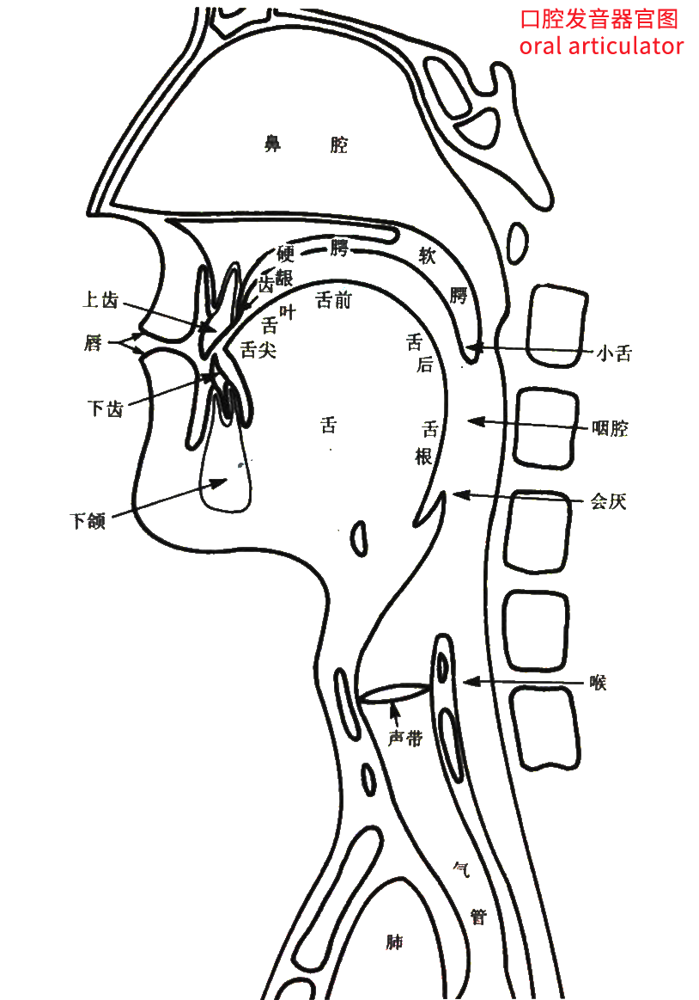

# 英语音标发音详述

- [【最全美式KK音标串讲】Part A 易错点串讲 | 英语音标发音](https://www.bilibili.com/video/BV1n7411i7xg/?spm_id_from=333.788.videocard.1)

## Catalog
1. 48 个英语国际音标表
    + 1.1 如何正确学习英语发音?
2. 48 个英语国际音标详细发音教程
    + 2.1 元音发音及口型详述:
    + 2.2 辅音发音及口型详述:

## New Words

## Content
### 1. 48 个国际音标表
- 48 个英语国际音标表
  <table>
    <tr>
        <td rowspan="6"> 国际音标表 </td>
        <td rowspan="3">元音 (20 个)</td>
        <td rowspan="2" colspan="2">单元音</td>
        <td>短音</td>
        <td style="color:red;">[ɪ]</td>
        <td style="color:red;">[ʌ]</td>
        <td style="color:red;">[ʊ]</td>
        <td style="color:red;">[e]</td>
        <td style="color:red;">[æ]</td>
        <td style="color:red;">[ə]</td>
        <td style="color:red;">[ɒ]</td>
        <td></td>
        <td></td>
        <td></td>
    </tr>
    <tr>
        <td>长音</td>
        <td style="color:red;">[iː]</td>
        <td style="color:red;">[ɑː]</td>
        <td style="color:red;">[uː]</td>
        <td style="color:red;">[ɜː]</td>
        <td style="color:red;">[ɔː]</td>
        <td></td>
        <td></td>
        <td></td>
        <td></td>
        <td></td>
    </tr>
    <tr>
        <td colspan="3">双元音 (8 个)</td>
        <td style="color:red;">[eɪ]</td>
        <td style="color:red;">[aɪ]</td>
        <td style="color:red;">[ɔɪ]</td>
        <td style="color:red;">[aʊ]</td>
        <td style="color:red;">[əʊ]</td>
        <td style="color:red;">[ɪə]</td>
        <td style="color:red;">[eə]</td>
        <td style="color:red;">[ʊə]</td>
        <td></td>
        <td></td>
    </tr>
    <tr>
        <td rowspan="4">辅音 (28 个)</td>
        <td colspan="3" style="text-align:center;">清辅音</td>
        <td style="color:red;">[p]</td>
        <td style="color:red;">[t]</td>
        <td style="color:red;">[k]</td>
        <td style="color:red;">[f]</td>
        <td style="color:red;">[θ]</td>
        <td style="color:red;">[s]</td>
        <td style="color:red;">[ʃ]</td>
        <td style="color:red;">[tʃ]</td>
        <td style="color:red;">[tr]</td>
        <td style="color:red;">[ts]</td>
    </tr>
    <tr>
        <td colspan="3" style="text-align:center;">浊辅音</td>
        <td style="color:red;">[b]</td>
        <td style="color:red;">[d]</td>
        <td style="color:red;">[ɡ]</td>
        <td style="color:red;">[v]</td>
        <td style="color:red;">[ð]</td>
        <td style="color:red;">[z]</td>
        <td style="color:red;">[ʒ]</td>
        <td style="color:red;">[dʒ]</td>
        <td style="color:red;">[dr]</td>
        <td style="color:red;">[dz]</td>
    </tr>
    <tr>
        <td colspan="3" style="text-align:center;">单个辅音</td>
        <td style="color:red;">[h]</td>
        <td style="color:red;">[m]</td>
        <td style="color:red;">[n]</td>
        <td style="color:red;">[ŋ]</td>
        <td style="color:red;">[l]</td>
        <td style="color:red;">[r]</td>
        <td style="color:red;">[j]</td>
        <td style="color:red;">[w]</td>
        <td></td>
        <td></td>
    </tr>
  </table>

#### 1.1 如何正确学习英语发音?
- 拼音对我们每个人而言再熟悉不过了, 我们在认识汉字之前都是先学习的汉语拼音$^{(1)}$.
  现在的汉语拼音是拼读音节的过程, 就是把 `声母` 和 `韵母` 拼合并加上 `声调`
  而成为一个汉字音节. 比如: b+à -> bà(爸); m+ǎi -> mǎi(买); b+àn -> bàn(办).
  
    + (1) 明朝(公元 1368 年)以后, 中国开始出现了用字母注音的方法,
      它的出现引发了中国几百年后用字母拼音的基础.
  
  我们都知道, 英语是一种拼音文字, 和汉语拼音有很许多相同之处,
  单词的读音是由`音标`决定的, 把英语中的 `辅音` 和 `元音` 拼读在一起加上
  `重音` 符号就构成了一个英语单词.

  英语音标中的 **元音相当于汉语拼音中的韵母, 辅音相当于汉语拼音中的声母.**

- 那么我们如何把汉语拼音与音标产生关联呢?
    + (1) 英语音标中的单元音发音找到对应的中文**【音近字】**, 即把 12
      个单元音找到关联度及高的汉语拼音.
    + (2) 英语中的部分辅音和汉语拼音的部分 `声母` 相同,
      找到关联点即可. 下面 `2.2 辅音发音口型介绍` 中会详细讲解.
    
  有了汉语拼音的基础, 借助汉语拼音的知识来学习英语音标知识和单词的拼读规则,
  就会减轻学习负担. 也助于提高学习英语的兴趣. 因此, 汉语拼音是学习英语音标的桥梁.
  
  + > 参考文章: [英语音标怎么练习？大家学习的经历是怎样的？](https://www.zhihu.com/question/19913374/answer/740176529)
  + 记不清完整的汉语拼音了? 不要紧, 我这里给你备着呢! (滑稽.jpg)

    
  

### 2. 48 个英语国际音标详细发音教程
- 这里首先给出口腔发音图和 48 个国际音标的完整发音连接,
  以便下面文章讲解到口腔发音时的参考
  
  

- > [(完整最新版)48个英语国际音标发音教程](https://www.bilibili.com/video/av75470686/)

#### 2.1 元音发音及口型详述:
- 首先我们来说一下上面 `1.1` 节中提到的 **【音近字】**:
  
  `音近字` 就是如何把音节的发音对应到汉语的拼音( 即`声母`和`韵母`).
  虽然这种方式感觉很不专业, 但这种方法会在你要开口读音标的时候,
  首先在脑海里对音标该发一种什么 "音" 有一个具体的概念;
  
  我们都了解不管我们用眼睛看, 耳朵听, 还是用嘴巴说,
  这些外在感官都只是在执行大脑中枢处理完信息后下达的指令;
    + > [眼睛究竟是如何是如何看到物体的？](https://www.zhihu.com/question/304731189/answer/546800419)
    + Additional Info: 光进入眼睛, 经过晶状体等的折射之后, 在视网膜上成像,
      即光子打在了视网膜上. 视网膜上的光感受层细胞（视杆细胞和视锥细胞）中存在感光色素,
      感光色素吸收光子后其结构发生改变, 而后与细胞内的一系列蛋白发生一系列作用,
      最后使得细胞的膜电位发生变化, 即产生了电信号. **电信号通过神经传入大脑,
      在脑中经过整合**, 人得以感知光传递的信息.  -- 作者: (知乎网友)凌峰
  
  我们用 `[i:]` 举例, 当准备开口读它之前, 我们首先应知道它的发音类似于汉语拼音韵母表中
  `【i】`(亿 yì)的拉长版, 然后才是发音口型: "发音时嘴唇微微张开, 舌尖抵住下齿,
  嘴角向两边张开, 流露出微笑的表情", 这样我们的大脑就会下达指令,
  让嘴巴按照这个口型发出这个音节, 这样读出来一般情况下都是正确的.
  
- 好了, 上面说了这么多, 我们先把 20 个元音过一遍吧.

  `元音(vowel)` 是在发音过程中由气流通过口腔而不受阻碍发出的音.
  (这里我们不研究专业术语, 只研究发音方法)
  **几乎所有的英文单词都含有元音, 所以发好元音非常重要.**
  英语中根据单个元音发音时是否需要进行舌位唇形的变化, 把元音分为`单元音`和`双元音`.
    + > 此段笔记来源:
      [大概是最全的音标总结--元音部分](https://zhuanlan.zhihu.com/p/79843578)

  其中`单元音`又根据发音的时长分为`长元音`和`短元音`.(Tip:
  汉语拼音中的单韵母没有长短音之分.)

  一般发长元音时要拉长, 超过两秒钟, 发短元音时要短促有力, 干脆利落.

  短元音和长元音有 5 对在发音和口型上是有相同点的,
  所以把有相同点的二者归为一对.
  
  **Hint: 长元音和短元音最主要的区别是舌头的位置不同, 读长音的时候, 舌头是平的,
  读短音的时候, 舌头略微上调.**

  **一般发长元音时要拉长, 超过两秒钟, 发短元音时要短促有力, 干脆利落.**
  
  <table style="text-align:center;">
    <tr>
        <td rowspan="2">单元音</td>
        <td>短元音</td> 
        <td style="color:red;">[ɪ]</td>
        <td style="color:red;">[ə]</td>
        <td style="color:red;">[ɒ]</td>
        <td style="color:red;">[ʊ]</td>
        <td style="color:red;">[ʌ]</td>
        <td style="color:red;">[e]</td>
        <td style="color:red;">[æ]</td>
    </tr>
    <tr>
        <td>长元音</td>
        <td style="color:red;">[iː]</td>
        <td style="color:red;">[ɜː]</td>
        <td style="color:red;">[ɔː]</td>
        <td style="color:red;">[uː]</td>
        <td style="color:red;">[ɑː]</td>
      <td></td>
        <td></td>
    </tr>
  </table>
  
    + (1.0) 短元音 `[ɪ]`
        - 音近字: 无, 不过这个音标的发音如果对应汉语的声调是第四声.
          从英语角度来说, 此音标的发音读起来像英文单词 $A$ 的短而急促版.
            + **Q01**: 音标 `[ɪ]` 到底怎么读?
              
              **A**: 总的来说, 这个音标的发音像偏短的 $A$
              (26 个英文字母的第一个), 而不是读成很短的 "衣" 或者偏短的 "哎";
  
              <i style="color: grey">
              在赖世雄老师主讲的《美语音标》一书中, `[ɪ]` 的发音要诀是这样说的:
              "本音标符号的发音介乎于汉语 '衣' 和 '也' 之间. 由于汉语并无此音,
              故我们发此音极为困难. 请务必注意下列发音要诀:......"</i>
  
              很诚实的说, 这个说法我并不认同, 因为 `也` 和 $A$ 的发音,
              从根本上就是不同的, 请自己试着读一下, 即使读的再短再急促,
              它们也是 100% 不同的.
            
            + **Q02**: 关于音标 `[ɪ]` 的读法:
  
              **A**: `./关于音标 [ɪ] 的读法.md`. 
        - 发音口型: <i style="color:green;">嘴角微微张开, 舌尖抵下齿, 舌前部抬高, 嘴形是扁平.</i>
    + (1.1) 长元音 `[iː]`
        - 音近字: 类似汉字 `亿(yì)` 读音的拉长版.
        - 发音口型: <i style="color:green;">嘴唇微微张开, 舌尖抵住下齿, 嘴角向两边张开, 流露出微笑的表情. 与字母 E 的发音相同.</i>
            + Added: 长元音 `[i:]` 是紧元音, 短元音 `[ɪ]` 是松元音.
    + (2.0) 短元音 `[ə]`
        - 音近字: 读音类似汉字 `阿(ē)`.
        - 发音口型: <i style="color:green;">发音是干脆利索, 嘴唇微微张开, 舌身放平(不卷舌), 舌中部稍微抬起, 口腔自然放松发声.</i>
    + (2.1) 长元音 `[ɜː]`
        - 音近字: 类似汉字 `阿(ē)` 读音的拉长版. 但没有汉语 `阿(ē)` 的嘴型张的大. (tip:
        实际上英文的发音, 大部分的嘴型都没有汉语拼音发音时嘴型张的大.)
        - 发音口型: <i style="color:green;">发音时嘴型扁平, 上下齿微开, 舌身平放(不卷舌), 舌中部稍抬起</i>
    + (3.0) 短元音 `[ɒ]`
        - 音近字: 发音类似汉字 `凹(āo)`
        - 发音口型: <i style="color:green;">发音时口腔打开, 嘴张大, 舌头向后缩, 双唇稍微收圆.</i>
    + (3.1) 长元音 `[ɔː]`
        - 音近字: 发音类似汉字 `凹(āo)` 的拉长版.
        - 发音口型: <i style="color:green;">发音时双唇收得小而圆, 并向前突出, 舌身往后缩.</i>
    + (4.0) 短元音 `[ʊ]`
        - 音近字: 汉语拼音韵母表中的【u】的简短急促版.
        - 发音口型: <i style="color:green;">嘴唇张开略微向前突出, 然后唇形稍微的收圆, 并放松些, 舌头后缩.</i>
    + (4.1) 长元音 `[uː]`
        - 音近字: 和汉语拼音韵母表中的【u】很像. (tip: 汉语拼音表见上图) 
        - 发音口型: <i style="color:green;">发音时嘴型小而圆, 微微外突, 舌头尽量后缩.</i>
    + (5.0) 短元音 `[ʌ]`
        - 音近字: 类似汉语 "啊(ā)" 的简短急促版.
        - 发音口型: <i style="color:green;">嘴唇微微张开, 伸向两边, 舌尖轻触下齿, 舌后部稍稍抬起.</i>
    + (5.1) 长元音 `[ɑː]`
        - 音近字: 发音类似汉语 "啊(ā)" 的拉长版.
        - 发音口型: <i style="color:green;">发音时, 口张大, 舌身放平后缩,
           舌尖不抵下齿(即: 舌尖离开下齿),
          舌后部略抬起, 放松发音. 开口度比`[ʌ]`更大.</i>  
        - > 参考文章 [英语48个音标发音(附详细图解)](https://zhuanlan.zhihu.com/p/39605780)
    + (6) 短元音 `[e]`: 
        - 音近字: 发音类似汉字 `哎(ēi)`.
        - 发音口型: <i style="color:green;">嘴型扁平, 舌尖抵下齿, 舌前部稍微抬起.</i>
    + (7) 短元音 `[æ]` (梅花音):
      - 音近字: 发音仍然类似汉字 `哎(ēi)`
        - 发音口型: <i style="color:green;">嘴张大, 嘴角尽量拉向两边, 嘴型成扁平, 舌尖抵下齿.</i>
  
  接着我们看一下双元音:
  
  注意: 双元音由两个元音组成, 发音时由前一个元音向后一个元音滑动, 口型有变化.
  前一个元音发音清晰响亮, 且时间长; 后一个元音发音模糊较弱, 且时间短.
  发双元音时要尽量饱满, 而且要有滑动的过程. 
  
  <table style="text-align:center;">
    <tr>
        <td >双元音</td>
        <td style="color:red;">[eɪ]</td>
        <td style="color:red;">[aɪ]</td>
        <td style="color:red;">[ɔɪ]</td>
        <td style="color:red;">[aʊ]</td>
        <td style="color:red;">[əʊ]</td>
        <td style="color:red;">[ɪə]</td>
      <td style="color:red;">[eə]</td>
        <td style="color:red;">[ʊə]</td>
    </tr>
  </table>
  
    + (1) 双元音 `[eɪ]`: 由 `[e]` 和 `[ɪ]` 两个单音组成;  `[e]` 重读, `[ɪ]` 轻读, 口型从半开到合, 字母 $A$ 就发这个音.
    + (2) 双元音 `[aɪ]`: 由 `[a]` 和 `[ɪ]` ······, 前重读后轻读, 口型由开到合. 与字母 $I$ 的发音相同.
    + (3) 双元音: `[ɔɪ]`: 由 `[ɒ]` 和 `[ɪ]` ······, 前重读后轻读, 口型从开到合.
    + (4) 双元音: `[aʊ]`: 由 `[a]` 和 `[ʊ]` ······, 前重读后轻读, 口型由大到小.
    + (5) 双元音: `[əʊ]`: 由 `[ə]` 和 `[ʊ]` ······, 发音也是一个过程,口型由半开到小, 与字母 $O$ 的发音相同.
    + (6) 双元音: `[ɪə]`: 由 `[ɪ]` 和 `[ə]` ······, 前重读后轻读, 双唇始终是半开的, 很好读.
    + (7) 双元音: `[eə]`: 由 `[e]` 和 `[ə]` ······, 前重后轻, 舌端抵下齿, 双唇是半开的. 
    + (8) 双元音: `[ʊə]`: 由 `[ʊ]` 和 `[ə]` ······, ······, 双唇由收圆到半开.
  
   > 此节音标的发音视频见: [YouTube 海伦英语-从零开始学口语03-音标发音](https://www.youtube.com/watch?v=HFH7WFnPZuU&list=PLVVQyNr_LodvcBuXAmLN4E7TnYoBSJhUj&index=3)
  

#### 2.2 辅音发音及口型详述:
- `辅音(28 个)` (辅音是指发音时气流受到发音器官(如舌头, 牙齿)的各种阻碍而发出的音.)
    + `清辅音`: **发音时声带不振动的辅音.**
    + `浊辅音`: **发音时声带振动.**

  **注意:** 发音时声带不振动, 送气的叫清辅音, 也就是说, 发清辅音时不出声,
  不要加上一个弱读的元音 `[ə]`; 发音时声带振动, 不送气的叫浊辅音, 发浊辅音时出声.
  汉语拼音中的声母没有清浊辅音之分, 发音时都出声.

  <table>
    <tr>
        <td rowspan="3">辅音 (28 个)</td>
        <td rowspan="2">清浊成对辅音</td>
        <td style="text-align:center;">清辅音</td>
        <td style="color:#e37722;">[p]</td>
        <td style="color:#e37722;">[t]</td>
        <td style="color:#e37722;">[k]</td>
        <td style="color:#e37722;">[f]</td>
        <td style="color:red;">[θ]</td>
        <td style="color:#e37722;">[s]</td>
        <td style="color:red;">[ʃ]</td>
        <td style="color:red;">[tʃ]</td>
        <td style="color:red;">[tr]</td>
        <td style="color:red;">[ts]</td>
    </tr>
    <tr>
        <td style="text-align:center;">浊辅音</td>
        <td style="color:#e37722;">[b]</td>
        <td style="color:#e37722;">[d]</td>
        <td style="color:#e37722;">[ɡ]</td>
        <td style="color:#996699;">[v]</td>
        <td style="color:red;">[ð]</td>
        <td style="color:#996699;">[z]</td>
        <td style="color:red;">[ʒ]</td>
        <td style="color:red;">[dʒ]</td>
        <td style="color:red;">[dr]</td>
        <td style="color:red;">[dz]</td>
    </tr>
    <tr>
        <td style="text-align:center;" colspan="2">单个辅音</td>
        <td style="color:#e37722;">[h]</td>
        <td style="color:#e37722;">[m]</td>
        <td style="color:#e37722;">[n]</td>
        <td style="color:red;">[ŋ]</td>
        <td style="color:#e37722;">[l]</td>
        <td style="color:#e37722;">[r]</td>
        <td style="color:red;">[j]</td>
        <td style="color:#e37722;">[w]</td>
        <td></td>
        <td></td>
    </tr>
  </table>
- 下面我们根据不同的发音技巧把辅音发音分为 3 类:
    + **(1) 和汉语拼音的读音、拼写相似的有 14 个:**
      
      `[b]`, `[p]`, `[m]`, `[f]`,
      
      `[d]`, `[t]`, `[n]`, `[l]`,
      
      `[g]`, `[k]`, `[h]`,
      
      `[w]`, `[s]`, `[r]`
      
      这些音标的发音与汉语拼音中 `声母` 表(汉语拼音见图一)的:
      
      `b`, `p`, `m`, `f`, `d`, `t`, `n`, `l`, `g`, `k`, `h`, `w`, `s`, `r`
      
      发音相似, 只是把汉语拼音发音的尾音去掉就可以了.

      比如: 我们在汉语拼音中拼 `b` 时, 其实相当于 `b` + `o`. 因此读音标 `[b]`
      时, 就不读那个 `o` 音, 就可以了.

      注意(1): 音标 **`[r]`** 是卷舌音. 发音不同于汉语拼音中的【r】(`日`).
        + 音近字为: **`若(ruò)`**.
        + 发音口型: 发音时嘴型小而圆, 微微外突(tip: 嘴型和元音 `[u]` 相同),
          **舌尖上扬, 微微卷起**, 声带振动, 气息由舌头两侧出来. (注意: 记得卷舌.) 
      
      注意(2): 音标 **`[l]`** 的音最难发, 因为声音有点奇怪, 像大舌头.
        + 音近字为: **`乐`**
        + 发音口型: 发此音时, 双唇要张大些, 舌尖上扬抵住上齿, 振动声带,
          气息由舌头两侧出来.

      > 详细发音演示教程见: [从零开始学口语04 辅音](https://www.youtube.com/watch?v=7FLdd4zb9HY&list=PLVVQyNr_LodvcBuXAmLN4E7TnYoBSJhUj&index=4)
      
      **Additional Info**: 添加视频中的部分音标的发音口型解说: 
      <table>
        <tr>
            <td>清辅音 <strong style="color:#e76a1f"> [p] </strong></td>
            <td>
            发音时, 双唇紧闭, 然后突然张开, 让口腔内气流冲出, 爆破成音,
            但发音时声带不振动.   
            (tip: 尝试把四指伸直并拢贴在喉咙上感觉一下, 声带是不振动的.)
            </td>
        </tr>
        <tr>
            <td>浊辅音 <strong style="color:#e76a1f"> [b] </strong></td>
            <td>
            发音时, 双唇紧闭, 然后突然张开, 让口腔内气流冲出, 爆破成音,
            发音过程中<strong>声带振动</strong>.
            </td>
        </tr>
        <tr>
            <td>清辅音 <strong style="color:#e76a1f"> [t] </strong></td>
            <td>
            发音时, 舌尖抵住上齿龈, 憋住气, 然后突然弹开舌尖, 让口腔内气流冲出,
            声带不振动.   
            <i style="color:red;">
            (Tip: 实际上, 除了要注意清/浊辅音发音时声带是否振动外,
            这 14 个音标的发音口型几乎和汉语拼音是一样的, 所以我们并不需要特别记忆.)
            </i>
            </td>
        </tr>
        <tr>
            <td>浊辅音 <strong style="color:#e76a1f"> [d] </strong></td>
            <td>
             发声时, 舌尖抵上齿龈, 憋住气, 然后突然弹开舌尖, 让口腔内气流冲出,
             爆破成音, 发音过程中<strong>声带振动</strong>.
            </td>
        </tr>
        <tr>
            <td>清辅音 <strong style="color:#e76a1f"> [k] </strong></td>
            <td>
            发音时, 舌后部抵住软腭, 憋住气, 然后突然离开, 将口腔内气流送出, 
            像咳嗽一样, 但声带不振动.   
            </td>
        </tr>
        <tr>
            <td>浊辅音 <strong style="color:#e76a1f"> [g] </strong></td>
            <td>
            发音时, 舌后部抵住软腭, 憋住气, 然后突然离开, 将口腔内气流送出,
            爆破成音, 发音过程中<strong>声带振动</strong>.
            </td>
        </tr>
        <tr>
            <td>清辅音 <strong style="color:#e76a1f"> [s] </strong></td>
            <td>
             发声时, 双唇微微张开, 上下齿闭合, 舌头自然放松(轻触上齿龈下方),
             气流从上下齿隙(xi)间送出, 声带不振动.   
            </td>
        </tr>
        <tr>
            <td>清辅音 <strong style="color:#e76a1f"> [f] </strong></td>
            <td>
             发声时, 上齿轻轻接触下唇, 然后吹气, 让气流从唇齿间通过, 形成摩擦,
             声带不振动.
            </td>
        </tr>
      </table>
      
    + **(2) 和英语字母读音/拼写相似的有 2 个:** `[z]`, `[v]`
      
      这两个音标的发音就是把对应英文字母的发音后面的 `/i/` 音去掉就可以了.
    
      比如英文字母 Z 的读音 `[zi:]`, 那我们读音标 `/z/` 时, 把后面的 `/i:/`
      去掉就可以了.
      <table>
        <tr>
            <td>浊辅音 <strong style="color:#e76a1f"> [z] </strong></td>
            <td>
             发声时, 双唇微微张开, 上下齿闭合, 舌头自然放松(轻触上齿龈下方),
             但发音过程中<strong>声带需振动</strong>.
            </td>
        </tr>
        <tr>
            <td>浊辅音 <strong style="color:#e76a1f"> [v] </strong></td>
            <td>
             发声时, 上齿轻轻接触下唇, 然后吹气, 让气流从唇齿间通过, 形成摩擦,
             但声带需(要)振动.
            </td>
        </tr>
      </table>
    + **(3) 不规则的 (12 个)**
      
      除了上面 2 类与汉语拼音关联比较大的 16 个外, 还剩余 12 个需要我们着重来学习.
    
      从上面的辅音表中可以看到清浊成对辅音中还剩余 5 对是不规则的, 我们一对一对看:
        - (1) 第 1 组: `[θ]`/`[ð]`
    
          这俩的发音有点类似于 `/s/` 与 `/z/` 的发音, 唯一的区别就是
          `[θ]`/`[ð]` **需要咬住舌尖来发音**.
          <table>
            <tr>
                <td>
                    清辅音 <strong style="color:#e76a1f"> [θ] </strong>
                </td>
                <td>
                    发音口型: 舌尖微微伸出到齿外, 上下齿轻轻咬住舌尖, 然后送气,
                    声带不震动.   
                    (注意: 此音节发音的所有动作, 都在轻轻之间完成, 牙齿不能使劲咬住舌头, 如果这样便不能发音.)
                </td>
            </tr>
            <tr>
                <td>
                    浊辅音 <strong style="color:#e76a1f"> [ð] </strong>
                </td>
                <td>
                    发音口型: 舌尖微微伸出到齿外, 上下齿轻轻咬住舌尖, 然后送气,
                    但声带需要震动.
                </td>
            </tr>
          </table>
    
        - (2) 第 2 组: `[ʃ]`/`[ʒ]`
          <table>
            <tr>
                <td rowspan="2" style="color:#e76a1f; text-align:center;">[ʃ]</td>
                <td>音近字: 发音类似汉语的的 `诗(shī)`.   
                (Tip: 注意发清辅音时是不出声的, 但汉语拼音中的声母没有清浊辅音之分,
                发音时都出声. 所以, 音近字只是类似, 并不和音标的发音完全相同.)
                </td>
            </tr>
            <tr>
                <td>发音口型: 双唇收圆并稍微突出, 舌尖接近上齿龈, 送气. </td>
            </tr>
            <tr>
                <td rowspan="2" style="color:#e76a1f; text-align:center;">[ʒ]</td>
                <td>音近字: 发音类似读二声的 `日(rì)`.</td>
            </tr>
            <tr>
                <td>
                  发音口型: 双唇收圆并稍微突出, 舌头稍微上卷, 舌尖抵住上齿龈,
                  送气, 但声带需振动. 
                </td>
            </tr>
          </table>
        - (3) 第 3 组: `[tʃ]`/`[dʒ]`
          <table>
            <tr>
                <td rowspan="2" style="color:#e76a1f; text-align:center;">[tʃ]</td>
                <td>音近字: 发音类似汉语的的 `吃(chī)`.</td>
            </tr>
            <tr>
                <td>发音口型: 双唇略微张开突出, 舌尖抵住上齿龈, 用力吐气,
                  声带不振动. </td>
            </tr>
            <tr>
                <td rowspan="2" style="color:#e76a1f; text-align:center;">[dʒ]</td>
                <td>音近字: 发音类似读二声的 `织(zhī)`.</td>
            </tr>
            <tr>
                <td>发音口型: 双唇略微张开突出, 舌尖抵住上齿龈, 用力吐气,
                  声带需到振动. </td>
            </tr>
          </table>
        - (4) 第 4 组: `[ts]`/ `[dz]`
          <table>
            <tr>
                <td rowspan="2" style="color:#e76a1f; text-align:center;">[ts]</td>
                <td>音近字: 发音类似汉语的的 `次(cī)`.</td>
            </tr>
            <tr>
                <td>发音口型: 舌尖先抵住<strong>上齿</strong>, 堵住气流,
                使气流从舌尖和齿龈间送出, 声带不震动.</td>
            </tr>
            <tr>
                <td rowspan="2" style="color:#e76a1f; text-align:center;">[dz]</td>
                <td>音近字: 发音类似读二声的 `滋(zī)`.</td>
            </tr>
            <tr>
                <td>发音口型: 舌尖先抵住<strong>上齿</strong>, 堵住气流,
                使气流从舌尖和齿龈间送出, 但声带需要震动.</td>
            </tr>
          </table>
        - (5) 第 5 组: `[tr]`/`[dr]`
          <table>
            <tr>
                <td rowspan="2" style="color:#e76a1f; text-align:center;">[tr]</td>
                <td>音近字: 发音类似汉语的的 `戳(chuō)`.</td>
            </tr>
            <tr>
                 <td>发音口型: 上唇收圆向前突出, 舌尖上翘抵住上齿龈, 采取发
                 `[r]` 的姿势. </td>
            </tr>
            <tr>
                <td rowspan="2" style="color:#e76a1f; text-align:center;">[dr]</td>
                <td>音近字: 发音类似读二声的 `桌(zhuō)`.</td>
            </tr>
            <tr>
                <td>发音口型: 略</td>
            </tr>
          </table>
      
    + **(4)**: 另外单独的两个 `[j]`(类似拼音: `ye`) 和
      `[ŋ]`(类似拼音韵母表中的: `eng`)
      <table>
            <tr>
                <td rowspan="2" style="color:#e76a1f; text-align:center;">[j]</td>
                <td>音近字: 发音类似汉语的的 `ye(爷)`.</td>
            </tr>
            <tr>
                 <td>发音口型:  </td>
            </tr>
            <tr>
                <td rowspan="2" style="color:#e76a1f; text-align:center;">[ŋ]</td>
                <td>音近字: 类似拼音 `eng`.</td>
            </tr>
            <tr>
                <td>发音口型: </td>
            </tr>
          </table>

  
- > 辅音发音演示教程见: [从零开始学口语04 辅音](https://www.youtube.com/watch?v=7FLdd4zb9HY&list=PLVVQyNr_LodvcBuXAmLN4E7TnYoBSJhUj&index=4)
  
- 另外, 这里特别强调几个易发错音的几个音标:
    + (1) 三个鼻音: `[m]`/`[n]`/`[ŋ]` 都是发 "嗯" 的音, 只是嘴型大小不一样.
        - `[m]` 闭嘴鼻音. 嘴巴闭拢, 在单词开头时注意力道, 要有劲, 气息从鼻子里出来.
        - `[n]` 半张嘴鼻音. 舌尖区域抵在上齿龈出, 与`[t]`/`[d]`舌位基本一致,
          气息从鼻子里出来.
        - `[ŋ]` 需要嘴巴张的更大些. 舌头中后部抵住上颚, 气息从鼻子里出来.
    + (2)  对于这三个字母 m, n, l, 他们其实有两种发音.
      即放在词首与词尾发音是不同的:
        - **放在词首**: 跟我们的汉语拼音有点像, 分别读 "么", "呢", "了".  
        - **在词尾**: m, n 发音如 (1), 而 `/l/` 放在词尾发音有点难,
          需要把舌尖抵在上门牙底端, 然后自然发音, 这个发音听起来像大舌头.