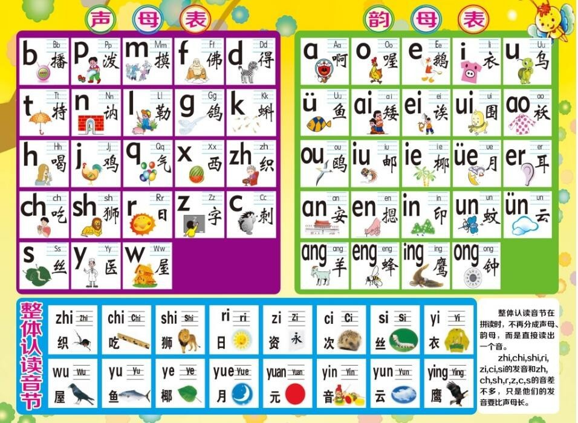

# 英语音标发音详述

## 0 暂时存放未归入下面章节的笔记

### 英语音标学习方法

- (1) 结合单韵母学习单元音:
 + 请看如下单韵母与单元音的对应关系
   
      拼音单韵母: ɑ, o, e, i, u
      
      英语长元音: `ɑ:`, `ɔ:`, `ɜ:`, `i:`, `u:`
      
      英语短元音: `ʌ`, `ɒ`, `ə`, `ɪ`, `ʊ`, `æ`(大口), `e`(小口)
      
      谐音分别是: 阿, 奥, 鹅, 衣,  乌, 哀, 哀
      
      `æ` 与 `e` 发音有些相似, 只是 `æ` 比 `e` 口型大些, 所以我们称
      `æ` 为大口 "哀", `e` 为小口 "哀",
      
      Notice(注意): 汉语拼音中的单韵母没有长短音之分,
      英语中的单元音又分长元音和短元音.
      一般发长元音时要拉长, 超过两秒钟, 发短元音时要短促有力, 干脆利落.
- (3) 28 个辅音:
  
    + (3.1) 

-  

### 0.0 美式发音和英式发音的一些不同
- 发音方式不同:
    1. 在美式英语当中, 如果/t/在两个元音之间, 要浊化, 听起来像是/d/,但是不完全是/d/的发音,
       更像的处于/t/和/d/中间靠/d/的一种发音. 常见的单词比如 better/letter/water/butter 等. 
    2. 大家所熟悉的/r/的发音, 比如单词 "park" 在英式英语中的音标为[pɑːk]; 
       在美式英语当中发音为[pɑrk]. 英式英语当中, /r/只在元音前发音, 而美式英语当中, 
       无论在哪个位置, /r/都是发音的. 
    3. `/æ/` 的发音也是英式英语和美式英语不同之处, 美式发音非常的夸张, 
       而英式英语没有这种夸张的发音比如单词 can/class/pass/answer 等等. 
    4. `/ɑ/` 的发音在英式英语和美式英语的对比如单词 pot/box/watch/ popular 等. 

- 重音: 两个音节以上的单词就有重音符号, 念起来像汉语的第一声,
  没有重音符号的像汉语的第三声. 
  + 例如: hello [həˈləʊ]中的符号 "ˈ" .  "ˈ" 出现的位置, 其后面的音节需要发重音
  
- 重音位置不同: 有些单词在英式发音和美式发音当中的重音位置也不同,
  如单词 "cafe" 在英式英语的音标 `['kæfeɪ]` `['kæfɪ]`,
  在美式英语当中的音标为[kæ'fe]. 又如单词 "garage"
  的英式英语发音为['gærɑː(d)ʒ ], 在美式英语发音为[gəˈrɑʒ ]等. 

### `[ʌ]` 和 `[ə]` 的发音?
- > (笔记来自 YouTube 视频:
  [你再也不要这样发这些英语发音!](https://www.youtube.com/watch?v=_WRu7m11pDg), 但略有改动)
- A: 我们刚开始学习这两个发音的时候, 经常说 `[ʌ]`(倒立的 v) 类似于汉语发音的 `啊(ā)`,
    `[ə]` 类似于汉语发音的 `阿(ē)`, 实际上这个类比确实不完全错误,
    但也不全对, 为什么说不全对呢? 你可以尝试对这着镜子或手机前置镜头,
    再读一下汉字 `啊(ā)` 和 `阿(ē)`, 你会发现舌头是悬浮在口腔中的,
    且有一点点轻微的抬起, 但是不卷舌. `[ʌ]` 和 `[ə]`
    的发音相对于这两个汉语的区别是: 嘴巴张的没有这两个汉语的发音那么大,
    舌头也悬浮在口腔中但几乎贴着下颚, 舌头没有轻微的抬起; 
    不过和汉语相同的是, 英语中的这两个音节也不卷舌.

    更具体的发音要领是这样的:
    + (1) 嘴巴不怎么动(嘴张的口度不大); (提示: 单元音: 是指发音时舌位,
        唇形, 开口度始终不变的元音, 即发音时嘴型不变.)
    + (2) 舌头在(口腔中)要平放在下面;
    + (3) 舌头不要拱起来, 不要卷起, 也不要抬起来.

    当然  `[ʌ]` 和 `[ə]` 还有一点区别就是: 
    + (1) `[ʌ]` 是重读的音(标/素). 例如:
        - but `/bʌt/`
        - up `/ʌp/`
        - fun `/fʌn/`
    + (2) `[ə]` 是轻读的音. 例如
        - about `/ə'baʊt/`
        - above `/ə'bʌv/`

## Catalog
0. 26 个英文字母及在单词中发什么音?
1. 48 个英语国际音标表
2. 20 个元音详述
3. 英语单词中的重音

## New Words

## Content
### 1. 48 个国际音标表
- 48 个英语国际音标表
  <table>
    <tr>
        <td rowspan="6"> 国际音标表 </td>
        <td rowspan="3">元音 (20 个)</td>
        <td rowspan="2" colspan="2">单元音</td>
        <td>短音</td>
        <td style="color:red;">[ɪ]</td>
        <td style="color:red;">[ʌ]</td>
        <td style="color:red;">[ʊ]</td>
        <td style="color:red;">[e]</td>
        <td style="color:red;">[æ]</td>
        <td style="color:red;">[ə]</td>
        <td style="color:red;">[ɒ]</td>
        <td></td>
        <td></td>
        <td></td>
    </tr>
    <tr>
        <td>长音</td>
        <td style="color:red;">[iː]</td>
        <td style="color:red;">[ɑː]</td>
        <td style="color:red;">[uː]</td>
        <td style="color:red;">[ɜː]</td>
        <td style="color:red;">[ɔː]</td>
        <td></td>
        <td></td>
        <td></td>
        <td></td>
        <td></td>
    </tr>
    <tr>
        <td colspan="3">双元音 (8 个)</td>
        <td style="color:red;">[eɪ]</td>
        <td style="color:red;">[aɪ]</td>
        <td style="color:red;">[ɔɪ]</td>
        <td style="color:red;">[aʊ]</td>
        <td style="color:red;">[əʊ]</td>
        <td style="color:red;">[ɪə]</td>
        <td style="color:red;">[eə]</td>
        <td style="color:red;">[ʊə]</td>
        <td></td>
        <td></td>
    </tr>
    <tr>
        <td rowspan="4">辅音 (28 个)</td>
        <td colspan="3" style="text-align:center;">清辅音</td>
        <td style="color:red;">[p]</td>
        <td style="color:red;">[t]</td>
        <td style="color:red;">[k]</td>
        <td style="color:red;">[f]</td>
        <td style="color:red;">[θ]</td>
        <td style="color:red;">[s]</td>
        <td style="color:red;">[ʃ]</td>
        <td style="color:red;">[tʃ]</td>
        <td style="color:red;">[tr]</td>
        <td style="color:red;">[ts]</td>
    </tr>
    <tr>
        <td colspan="3" style="text-align:center;">浊辅音</td>
        <td style="color:red;">[b]</td>
        <td style="color:red;">[d]</td>
        <td style="color:red;">[ɡ]</td>
        <td style="color:red;">[v]</td>
        <td style="color:red;">[ð]</td>
        <td style="color:red;">[z]</td>
        <td style="color:red;">[ʒ]</td>
        <td style="color:red;">[dʒ]</td>
        <td style="color:red;">[dr]</td>
        <td style="color:red;">[dz]</td>
    </tr>
    <tr>
        <td colspan="3" style="text-align:center;">单个辅音</td>
        <td style="color:red;">[h]</td>
        <td style="color:red;">[m]</td>
        <td style="color:red;">[n]</td>
        <td style="color:red;">[ŋ]</td>
        <td style="color:red;">[l]</td>
        <td style="color:red;">[r]</td>
        <td style="color:red;">[j]</td>
        <td style="color:red;">[w]</td>
        <td></td>
        <td></td>
    </tr>
  </table>

#### 1.1 如何正确学习英语发音?
- 拼音的概念对我们而言再熟悉不过了, 我们认识汉字之前就是从学习汉语拼音开始的$^{(1)}$.
  现在的汉语拼音是拼读音节的过程, 就是把 `声母` 和 `韵母` 拼合并加上 `声调`
  而成为一个汉字音节. 比如: b-a -> bà(爸); m-ai -> mǎi(买); b-an -> bàn(办).
    + (1) 明朝(公元 1368 年)以后, 中国开始出现了用字母注音的方法,
      它的出现引发了中国几百年后用字母拼音的基础.
  
  我们都知道, 英语是一种拼音文字, 和汉语拼音有很许多相同之处, 单词的读音是由音标决定的, 把英语中的 `辅音` 和 `元音` 拼读在一起加上 `重音` 符号就构成了一个英语单词.

  英语音标中的 **元音相当于汉语拼音中的韵母, 辅音相当于汉语拼音中的声母.**

- 那么我们如何把汉语拼音与音标产生关联呢?
    + (1) 英语音标中的单元音发音找到对应的中文**【音近字】**, 即把 12
      个单元音找到关联度及高的汉语拼音.
    + (2) 英语中的部分辅音, 和汉语拼音的部分 `声母` 相同,
      找到关联点即可. 下面 `2.2 辅音发音即口型介绍` 中会详细讲解.
  
  有了汉语拼音的基础, 借助汉语拼音的知识来学习英语音标知识和单词的拼读规则,
  就会减轻学习负担. 同时也有助于提高学习英语的兴趣. 因此, 汉语拼音是学习英语音标的桥梁.

  + 参考文章: [英语音标怎么练习？大家学习的经历是怎样的？](https://www.zhihu.com/question/19913374/answer/740176529)
  + 记不清完整的汉语拼音了? 不要紧, 我这里给你备着呢! (滑稽.jpg)
    
  

### 2. 20 个元音详述
#### 2.1 元音发音及口型介绍:
- **【音近字】**: 就是如何把音节的发音对应到汉语的拼音( 即`声母`和`韵母`).
  虽然这种方式被很多英语老师和英语大神所鄙视, 但我想表达的意思是,
  当你要开口读音标发音的时候(例如 `[i:]`), 首先要在脑海里对当前这个 "音" 有一个概念;
  
  我们都了解不管我们用眼睛看, 耳朵听, 还是用嘴巴说,
  这些外在感官都只是在执行大脑中枢处理完信息后下达的指令;
    + Additional Info:
      [眼睛究竟是如何是如何看到物体的？](https://www.zhihu.com/question/304731189/answer/546800419)
      光进入眼睛, 经过晶状体等的折射之后, 在视网膜上成像, 即光子打在了视网膜上.
      视网膜上的光感受层细胞（视杆细胞和视锥细胞）中存在感光色素,
      感光色素吸收光子后其结构发生改变, 而后与细胞内的一系列蛋白发生一系列作用,
      最后使得细胞的膜电位发生变化, 即产生了电信号. **电信号通过神经传入大脑,
      在脑中经过整合**, 人得以感知光传递的信息.  -- 作者: (知乎网友)凌峰
  
  仍用 `[i:]`举例, 我们首先应知道它的发音类似于汉语拼音韵母表中
  `【i】`(亿 yì)的拉长版, 然后才是发音口型: "发音时嘴唇微微张开, 舌尖抵住下齿,
  嘴角向两边张开, 流露出微笑的表情", 这样我们的大脑就会下达指令,
  让嘴巴按照这个口型发出这个音节, 这样读出来一般情况下都是正确的.
  
- 好了, 上面说了这么多, 我们先把 20 个元音过一遍吧.

  首先是单元音: 短元音和长元音有 5 对在发音和口型上是有相同点的,
  所以把有相同点的二者归为一对.
  
  **Hint: 长元音和短元音最主要的区别是舌头的位置不同, 读长音的时候, 舌头是平的, 读短音的时候, 舌头略微上调.**

  <table style="text-align:center;">
    <tr>
        <td colspan="2">短元音</td>
        <td style="color:red;">[ɪ]</td>
        <td style="color:red;">[ə]</td>
        <td style="color:red;">[ɒ]</td>
        <td style="color:red;">[ʊ]</td>
        <td style="color:red;">[ʌ]</td>
        <td style="color:red;">[e]</td>
        <td style="color:red;">[æ]</td>
    </tr>
    <tr>
        <td colspan="2">长元音</td>
        <td style="color:red;">[iː]</td>
        <td style="color:red;">[ɜː]</td>
        <td style="color:red;">[ɔː]</td>
        <td style="color:red;">[uː]</td>
        <td style="color:red;">[ɑː]</td>
        <td></td>
        <td></td>
    </tr>
  </table>

    + (1.0) 短元音 `[ɪ]`
        - 音近字: 无, 不过这个音标的发音如果对应汉语的声调是第四声.
          从英语角度来说, 此音标的发音读起来像英文单词 $A$ 的短而急促版.
            + **Q01**: 音标 `[ɪ]` 到底怎么读?

              **A**: 总的来说, 这个音标的发音像偏短的 $A$
              (26 个英文字母的第一个), 而不是读成很短的 "衣" 或者偏短的 "哎";

              <i style="color: grey">
              在赖世雄老师主讲的《美语音标》一书中, `[ɪ]` 的发音要诀是这样说的:
              "本音标符号的发音介乎于汉语 '衣' 和 '也' 之间. 由于汉语并无此音,
              故我们发此音极为困难. 请务必注意下列发音要诀:......"</i>

              很诚实的说, 这个说法我并不认同, 因为 `也` 和 $A$ 的发音,
              从根本上就是不同的, 请自己试着读一下, 即使读的再短再急促,
              它们也是 100% 不同的.
            + **Q02**: 关于音标 `[ɪ]` 的读法:

              **A**: `./关于音标 [ɪ] 的读法.md`. 
        - 发音口型: <i style="color:green;">嘴角微微张开, 舌尖抵下齿, 舌前部抬高, 嘴形是扁平.</i>
    + (1.1) 长元音 `[iː]`
        - 音近字: 类似汉字 `亿(yì)` 读音的拉长版.
        - 发音口型: <i style="color:green;">嘴唇微微张开, 舌尖抵住下齿, 嘴角向两边张开, 流露出微笑的表情. 与字母 E 的发音相同.</i>
            + Added: 长元音 `[i:]` 是紧元音, 短元音 `[ɪ]` 是松元音.

    + (2.0) 短元音 `[ə]`
        - 音近字: 读音类似汉字 `阿(ē)`.
        - 发音口型: <i style="color:green;">发音是干脆利索, 嘴唇微微张开, 舌身放平(不卷舌), 舌中部稍微抬起, 口腔自然放松发声.</i>
    + (2.1) 长元音 `[ɜː]`
        - 音近字: 类似汉字 `阿(ē)` 读音的拉长版. 但没有汉语 `阿(ē)` 的嘴型张的大. (tip:
        实际上英文的发音, 大部分的嘴型都没有汉语拼音发音时嘴型张的大.)
        - 发音口型: <i style="color:green;">发音时嘴型扁平, 上下齿微开, 舌身平放(不卷舌), 舌中部稍抬起</i>

    + (3.0) 短元音 `[ɒ]`
        - 音近字: 发音类似汉字 `凹(āo)`
        - 发音口型: <i style="color:green;">发音时口腔打开, 嘴张大, 舌头向后缩, 双唇稍微收圆.</i>
    + (3.1) 长元音 `[ɔː]`
        - 音近字: 发音类似汉字 `凹(āo)` 的拉长版.
        - 发音口型: <i style="color:green;">发音时双唇收得小而圆, 并向前突出, 舌身往后缩.</i>

    + (4.0) 短元音 `[ʊ]`
        - 音近字:
        - 发音口型: <i style="color:green;">嘴唇张开略微向前突出, 然后唇形稍微的收圆, 并放松些, 舌头后缩.</i>
    + (4.1) 长元音 `[uː]`
        - 音近字: 和汉语拼音韵母表中的【u】很像. (tip: 汉语拼音表见上图) 
        - 发音口型: <i style="color:green;">发音时嘴型小而圆, 微微外突, 舌头尽量后缩.</i>

    + (5.0) 短元音 `[ʌ]`
        - 音近字: 
        - 发音口型: <i style="color:green;">嘴唇微微张开, 伸向两边, 舌尖轻触下齿, 舌后部稍稍抬起.</i>
    + (5.1) 长元音 `[ɑː]`
        - 音近字:
        - 发音口型: <i style="color:green;">口腔打开, 嘴张大, 舌身放平, 舌尖不抵下齿, 下巴放低, 放松发音.</i>

    + (6) 短元音 `[e]`:
        - 音近字: 发音类似汉字 `哎(ēi)`.
        - 发音口型: <i style="color:green;">嘴型扁平, 舌尖抵下齿, 舌前部稍微抬起.</i>
    + (7) 短元音 `[æ]` (梅花音):
        - 音近字: 发音仍然类似汉字 `哎(ēi)`
        - 发音口型: <i style="color:green;">嘴张大, 嘴角尽量拉向两边, 嘴型成扁平, 舌尖抵下齿.</i>
  
  接着我们看一下双元音:

  注意: 双元音由两个元音组成, 发音时由前一个元音向后一个元音滑动, 口型有变化.
  前一个元音发音清晰响亮, 且时间长; 后一个元音发音模糊较弱, 且时间短.
  发双元音时要尽量饱满, 而且要有滑动的过程. 
  
  <table style="text-align:center;">
    <tr>
        <td >双元音</td>
        <td style="color:red;">[eɪ]</td>
        <td style="color:red;">[aɪ]</td>
        <td style="color:red;">[ɔɪ]</td>
        <td style="color:red;">[aʊ]</td>
        <td style="color:red;">[əʊ]</td>
        <td style="color:red;">[ɪə]</td>
      <td style="color:red;">[eə]</td>
        <td style="color:red;">[ʊə]</td>
    </tr>
  </table>
  
    + (1) 双元音 `[eɪ]`: 由 `[e]` 和 `[ɪ]` 两个单音组成;  `[e]` 重读, `[ɪ]` 轻读, 口型从半开到合, 字母 $A$ 就发这个音.
    + (2) 双元音 `[aɪ]`: 由 `[a]` 和 `[ɪ]` ······, 前重读后轻读, 口型由开到合. 与字母 $I$ 的发音相同.
    + (3) 双元音: `[ɔɪ]`: 由 `[ɒ]` 和 `[ɪ]` ······, 前重读后轻读, 口型从开到合.
    + (4) 双元音: `[aʊ]`: 由 `[a]` 和 `[ʊ]` ······, 前重读后轻读, 口型由大到小.
    + (5) 双元音: `[əʊ]`: 由 `[ə]` 和 `[ʊ]` ······, 发音也是一个过程,口型由半开到小, 与字母 $O$ 的发音相同.
    + (6) 双元音: `[ɪə]`: 由 `[ɪ]` 和 `[ə]` ······, 前重读后轻读, 双唇始终是半开的, 很好读.
    + (7) 双元音: `[eə]`: 由 `[e]` 和 `[ə]` ······, 前重后轻, 舌端抵下齿, 双唇是半开的. 
    + (8) 双元音: `[ʊə]`: 由 `[ʊ]` 和 `[ə]` ······, ······, 双唇由收圆到半开.
  
   > 此段音标的发音视频见: [YouTube 海伦英语-从零开始学口语03-音标发音](https://www.youtube.com/watch?v=HFH7WFnPZuU&list=PLVVQyNr_LodvcBuXAmLN4E7TnYoBSJhUj&index=3)
  

#### 2.2 辅音发音及口型介绍:
- `辅音(28 个)` (辅音是指发音时气流受到发音器官(如舌头, 牙齿)的各种阻碍而发出的音.)
    + `清辅音`: 发音时声带不振动的辅音.
    + `浊辅音`: 发音时声带振动.
  <table>
    <tr>
        <td rowspan="3">辅音 (28 个)</td>
        <td style="text-align:center;">清辅音</td>
        <td style="color:red;">[p]</td>
        <td style="color:red;">[t]</td>
        <td style="color:red;">[k]</td>
        <td style="color:red;">[f]</td>
        <td style="color:red;">[θ]</td>
        <td style="color:red;">[s]</td>
        <td style="color:red;">[ʃ]</td>
        <td style="color:red;">[tʃ]</td>
        <td style="color:red;">[tr]</td>
        <td style="color:red;">[ts]</td>
    </tr>
    <tr>
        <td style="text-align:center;">浊辅音</td>
        <td style="color:red;">[b]</td>
        <td style="color:red;">[d]</td>
        <td style="color:red;">[ɡ]</td>
        <td style="color:red;">[v]</td>
        <td style="color:red;">[ð]</td>
        <td style="color:red;">[z]</td>
        <td style="color:red;">[ʒ]</td>
        <td style="color:red;">[dʒ]</td>
        <td style="color:red;">[dr]</td>
        <td style="color:red;">[dz]</td>
    </tr>
    <tr>
        <td style="text-align:center;">单个辅音</td>
        <td style="color:red;">[h]</td>
        <td style="color:red;">[m]</td>
        <td style="color:red;">[n]</td>
        <td style="color:red;">[ŋ]</td>
        <td style="color:red;">[l]</td>
        <td style="color:red;">[r]</td>
        <td style="color:red;">[j]</td>
        <td style="color:red;">[w]</td>
        <td></td>
        <td></td>
    </tr>
  </table>
- 可以把辅音发音分为 3 类:
    +  **(1)和汉语拼音读音、拼写相似的(14个):**
      
      `[b]`, `[p]`, `[m]`, `[f]`, `[d]`, `[t]`, `[n]`, `[l]`, `[g]`,
      `[k]`, `[h]`, `[w]`, `[s]`, `[r]`('若') 
      
      这些音标的发音与汉语拼音中 `声母` 表的: `b`, `p`, `m`, `f`, `d`, `t`,
      `n`, `l`, `g`, `k`, `h`, `w`, `s`, `r` 等发音相似,
      只是把汉语拼音发音的尾音去掉就可以了.

      比如: 我们在汉语拼音中拼 `b` 时, 其实相当于 `b` + `o`. 因此读音标 `[b]`
      时, 就不读那个 `o` 音, 就可以了.
    +  **(2)和英语字母读音/拼写相似的有 2 个:** `[z]`, `[v]`
       

- 第二组: `[ʃ]`/`[ʒ]`   "屎"  "日" 
- 第三组: `[h]`/`[r]` "喝"  "弱" 
- 第四组: `[ts]`/`[dz]`  "此"  "滋" 
- 第五组: `[tʃ]`/`[dʒ]`  "尺"  "之" 
- 第六组: `[tr]`/`[dr]`  "戳"  "捉" 
- 第七组: `[m]`/`[n]`/`[ŋ]` 都是发 "嗯" 的音, 只是嘴型大小不一样
  
    + [m] 闭紧

### 3. 英语单词中的重音
- > 资料来源: [英语单词中的重音怎么个「重」法？](https://www.zhihu.com/question/280625866)

- 英语单词的重音主要分为共分四类:
    + (1) 第一类是主重音, 标号为音节左上方的短竖杠；
    + (2) 第二类是次重音, 标号为音节左下方的短竖杠；
    + (3) 第三类是含一个双元音或者一个长元音的非重读音节, 这类非重读音节不标重音符号, 也不标弱音符号；
    + (4) 第四类为含元音 a, i, u 的弱读音节, 或含由成音节辅音所组成的弱读音节。
    
