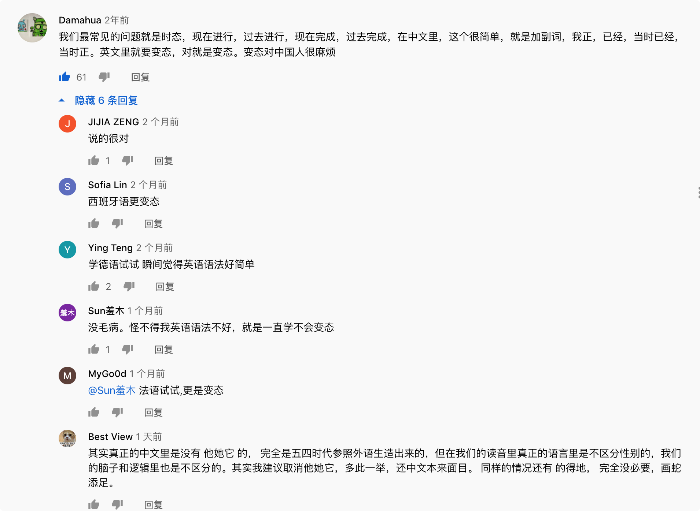

# Teacher Mike (麦克老师)

see 看到
look 仔細瞧瞧
watch 觀賞

## Catalog(大纲)
1. [中式英语] 经常犯的英语错误 (Common Chinglish$^\color{red}{*}$ Mistakes)
    + 1.1 10 句中国人最常见的英文错误

## New Words(生词)
1. **Chinglish ['tʃiŋɡliʃ] --n.中式英语 (等于 Chinese English)**
1. **Chinese [ˌtʃai'ni:z] --adj.中国的. --n.中国人,华裔; 中国话,中文,汉语.**
    + Chinese food is really different from western food.
      中餐和西餐可是大不相同.
    + Chinese has tens of thousands of characters.
      中文有成千上万个汉字.
1. **drizzle ['drɪz(ə)l]{UK} / ['drɪzl]{US} --n.[不可数]毛毛雨; 细雨.**
   **--vi.下毛毛雨(时态: 过去式和过去分词(drizzled); 现在分词(drizzling))**
    + The shower tailed off into a drizzle(n).
      阵雨越来越小, 最后变成了毛毛雨.
    + It's drizzled(vi) on and off. 毛毛雨时下时停.
    + It was drizzling(vi) that day. 那天下着毛毛雨.
    + It drizzled(vi) off and on all day. 整日在时停时续的下着毛毛雨.
1. **awkward ['ɔːkwəd]{UK} / ['ɔkwɚd]{US} --adj.尴尬的; 别扭的; 笨拙的.**
    + How do you say awkward? 尴尬怎么说?
    + an awkward expression. 生硬的语句.
    + You were so very awkward in doing it. 你把这件事做得糟糕透了.
1. **continuous [kən'tɪnjʊəs] --adj.连续的, 持续的, 不断的**
    + be continuous with 与...相连
    + It's like it's on a continuous loop. 看起来像是在循环播放. 
    + This means to talk continuously and to talk too much.
      意思就是一直在说, 说的太多了. 
    + a continuous hot weather. 持续的高温天气
1. **tense [tɛns] --n.时态. --adj.紧张的; 拉紧的. --vt.拉紧; 拉紧. --vi.变紧; 紧张(起来)**
    + You can see that over half the time, we're using the
      `Simple Present` tense(n). 
      从这个图表中你可以看到, 在英语会话过程中, `一般现在时` 使用的频率超过 5 成.
    + You look tense. --I'm not tense. 你看着紧张. 我不紧张.

## Content(内容)
### 1. [中式英语] 经常犯的英语错误 (Common Chinglish$^\color{red}{*}$ Mistakes)
#### 1.1 10 句中国人最常见的英文错误
- (1) 大雨: Heavy rain / It's raining cats and dogs. 小雨:
  Light rain / It's `drizzling` outside.
  
  **不是**: ~~Big rain / Small rain.~~

- (2) 打开/关掉手机: Turn on/off your phone. 或 Switch on/off ...
  
  **不可以说**: ~~Open/Close...~~

- (3) 我们经常会说 "尴尬" 用英文怎么说呢? 这个 `怎么说` 对应的英文是
  `How do you say`...?. 例如: How do you say `Awkward`? (尴尬怎么说?)

  **不是**: ~~How to say...?~~
  
  Hint: 实际上 `How do...?` 是一个特殊疑问句. 特殊疑问句由:
  `特殊疑问词`(`when` / `what` / `how` / `where` / `why`) + `一般疑问句`
  组成.

- (4) 我们经常说 那里有很多好吃的 / 那里有很多美女, `那里有...`
  的对应英文是`There are...`
    + There are many great restaurants there. 那里有很多好吃的东西.
    + There are many beautiful women there. 那有很多美女.
  
  **不是**: ~~There has/have...~~,
  
- (5) 我是中国人 = I'm a Chinese person. 此为常用说法;
  
  **不建议使用**: ~~I am a Chinese~~.
  
  虽然 Chinese 有 形容词(adj) 和 名词(n) 两种词性, 但是国外没有 a Chinese
  这种说法; 同理 Chinese 也并是唯一一个前面不能加 a/an 冠词用法的词,
  在英文中统一的规定是这样的: 如果你要表示的国籍是 `-ese`结尾的, 那都不能用 a/an
  来修饰. 比如: Japanese(日本人) / Portuguese(葡萄牙人) / Vietnamese(越南人).
  
  不过除了 `-ese` 这种后缀结尾的国籍不能使用 `a/an` 修饰之外,
  其他的国籍的英文单词都是可以的. 比如:
  
  + I am American. = I am an American. 我是美国人.
  
- (6) 我们常说: 他是 gay = He is gay.
  
  **不是**: ~~He is a gay.~~
  
  因为 gay 是形容词(adj), 冠词 `a/an` 只能用来修饰 名词(n).

- (7) 我非常喜欢英语 = I really(adv) + like(vt) English.

   **不是**: ~~I very(adv) like English.~~
   
   请记住: **very(adv) + 形容词(adj)** 其后不能 + `动词`(vt/vi).

- (8) 没有为什么 = No reason.
    + Why aren't you coming? -- No reason.
      你为什么不来? -- 没有为什么.(即: 就是不想来.)

  **不是**: ~~No why~~

- (9) 不用谢 = You are welcome / No worries / No problem.
  
  **不是**: ~~No thanks~~.

  No thanks = 我不要.
    + Do you want to eat ice cream? -- No, thanks.
      你要吃冰淇淋吗? -- 我不要. 

- (10) 下下个星期 = The week after next / In two weeks.
  
  **不是**: ~~Next next week~~.

  下个星期 = Next week. 下下下个星期(三周后) = In 3 weeks.

- 哈哈哈....
  
  

### 2. 英语中 100 个最常用的动词 + 时态 (100 Most Common English Verbs + Tenses)
#### 2.1 第一期: 不规则动词 (Episode 1: Irregular verbs)
- [YouTube link](https://www.youtube.com/watch?v=k_MHEFesZCs)

#### 2.2 时态(Tenses) 语法
- Example:
    + He sings. 他唱歌
    + He has sung. 他已经唱过了.
    + He is singing. 他正在唱歌.
    + He has been singing. 他一直在唱
    + He sang. 他唱过了.
    + He had sung. 他已经唱过了.
    + He was singing. 他正在唱.
    + He had been singing. 他一直在唱.
    + He will sing. 他将唱.
    + He will be singing. 他马上要唱.
    + He will have sung. 届时他会唱.
    + He will have been singing. 他将会一直唱.
    
English verb tenses are so complicated!

(英语动词时态这么复杂!)
  
They are so complicated that even native speakers get them wrong sometimes.
  
(它们如此复杂, 有时候什么母语人士也会犯错.)

Now, depending on who you talk to,
there are twelve or sixteen verb tenses in English.

(根据你讲话的对象, 在英语中会出现 12 种或者 16 种动词的时态.)

For the purpose of this video, let's say that there are 12 different
verb tenses.

(就本视频来说的话, 主要讨论 12 种不同的动词时态.)

So whether you are new to English, or you're confused about verb
tenses, or you just want to review how to use the verb tenses,
this video is for you. (所以, 不论你是英语的初学者; 或者,
弄不清动词时态的朋友们; 或者, 你只是想复习复习下如何使用动词时态,本视频就是为你量身定做的哦.)

So how do we make verb tenses simple? Let's have a look at this chart.
(那么要如何才能让动词的时态变得简单呢? 我们来看一个图标吧.)

| # | Verb tense used in spoken English. 英语口语中的常见动词时态 | Frequency 使用频率 |
|:--- | :--- | :--- |
| 1 | `Simple Present` (一般现在时) | 57.51% |
| 2 | `Simple Past` (一般过去时) | 19.7% |
| 3 | `Simple Future` (一般将来时) | 8.5% |
| 4 | `Present Perfect` (现在完成时) | 6.0% |
| 5 | `Present Continuous` (现在进行时) | 5.1% |
| 6 | Past Continuous (过去进行时) | 1.4% |
| 7 | Past Perfect (过去完成时) | 1.2% |
| 8 | Present Perfect Continuous (现在完成进行时) | 0.7% |
| 9 | Future Perfect (将来完成时) | 0.2% |
| 10 | Future Continuous (将来进行时) | 0.1% |
| 11 | Past Perfect Continuous (过去完成进行时) | 0.1% |
| 12 | Future Perfect Continuous (将来完成进行时) | 0.1% |
  
You can see that over half the time, we're using the
`Simple Present` tense$^\color{red}{*}$. You can also see more commonly used ones
are `Simple Past`, `Simple Future`, `Present Perfect`, and
`Present Continuous`.  

(从这个图表中你可以看到, 在英语会话过程中, `一般现在时` 使用的频率超过
5 成, 还有 `一般过去时`, `一般将来时`, `现在完成时`, `现在进行时`,
也是常用的时态. )

Also, notice that all the other ones, we very seldom use in
spoken English.

(另外, 注意一下那些其他的时态, 在口语中的使用频率很低.)

For Example: (例如:)

She will have been living in China for 10 years at aht point.
(届时她将会在中国生活 10 年.)

There's nothing wrong with the grammar of this sentence. We just very
seldom have the need to use this tense. We are going to focus on the
commonly used tenses. Some of them are easy to do, some of them are
little more difficult. In my opinion, English tenses are the the
hardest part for non-native speakers to master. So, if you can improve
this area of your English, you will sound much native and much more
fluent.

(这句话出现的时态本身没有任何问题. 只不过平时我们用到该时态的机会很少.
我们会专注与常用的时态. 这当中有些内容很简单, 有些内容难度会稍大一点. 在我看来,
英语的时态是非母语人士最难掌握的部分. 所以, 如果你在这方面能有所提升的话,
你的英语会听起来更加地道,更加流利.)

There are so many rules and exceptions. It makes my head want
to ... It's too big of a subject to cover in one video, so we're gonna
focus and make it as simple as we can. Today's video is going to cover
irregular verbs and the next week's video is going to cover regular
verbs. So today the 50 most common irregular verbs and next week the
50 most common regular verbs. In total, the 100 most commonly used 
verbs in English and their most commonly use tenses. 

(这里涉及许多的语法规则以及和例外情况.这些内容令我头都大了,
一条视频无法讲完这个主题, 所以我们会集中精力并且尽量 把这些内容简单化.
今天的视频主要内容是不规则动词, 下周的视频会将常规的动词. 所以今天的是 50
个不规则动词, 下周是 50 个常规动词. 总共是, 100
个英语里常用的动词以及他们最常用的时态.)

The two most common verbs, without a doubt are 'be' and 'have'.
If you are new to English, please spend a little extra time learning
about these verbs. The are very complicated in their use. 

(毫无疑问, 这是 2 个最常用的动词, be 动词和 have, 如果你是英语的初学者,
请花一些额外的时间去学习这些动词. 他们的用法非常复杂.)

The 50 most common irregular verbs. Now the main difference between
an irregular verb and regular verb is how many forms they have. The
past tense of regular verbs `typically` ends in '-d' or '-ed' and the
only other form is '-img'.

(50 个最常用的不规则动词,不规则动词和规则动词之间最主要的区别是两个有多种拼写形式,
常规动词的过去时通常会在词汇后加上 `-d` 或 `ed`, 唯一的其他形式是 `ing`.)

Irregular verbs often have several forms. Let's get to the
50 most commonly used  irregular verbs and their tenses.

(不规则动词通常有多个拼写形式. 让我们看一下 50 个不规则动词及其时态.)

#### Some Example sentence: (例句)
- Example (1): (Be: is/am || was/were || will be || have been || being)
    + (1) Simple present(一般现在时): I am a teacher. (我现在是名老师)
    + (2) Simple past(一般过去时): I was a teacher. (我曾经是一名老师.)
    + (3) Simple future(一般将来时): I will be a teacher. (我将成为一名老师.)
    + (4) Present perfect(现在完成时): I have been a teacher for 11 years.
      (我当老师已经 11 年了.)
    + (5) Present continuous$^\color{red}{*}$(现在进行时): I am a teacher.
      (我正在当老师.) 不是: ~~I am being a teacher.~~

  Alright, here is one of these crazy rules I was talking about. In
  English we have what's called `stative verbs`. We don't often use
  `stative verbs` in the continuous tense. We can just use the simple
  present tense instead.
  
  (好吧,我要说一下英语的奇葩语法, 其中有一条规定. 在英语中, 有一个`静态动词`的概念,
  静态动词通常不会用来表达进行时的句子. 取而代之, 静态动词只用表达一般现在时.)

- Example (2): (`Have`:  have / had / will have / have had / having )
    + (1) Simple present(一般现在时): I have a pen. (我有一支笔.)
    + (2) Simple past(一般过去时): I had an apple. (我吃了一颗苹果.)
    + (3) Simple future(一般将来时): I will have an apple pen.
      (我将会有一支笔.)
    + (4) Present perfect(现在完成时): I have had an apple for breakfast.
      (我吃了一颗苹果当作早餐.)
    + (5) Present continuous(现在进行时): I am having an apple for
      breakfast. (我早餐会吃苹果)

- Example (3): (`Do`: do / did / will do / have done / doing)
    
    + 主语+动词 Subject + Verb

主语+动词+宾语 Subject + Verb + Object

主语+动词+形容词 Subject + Verb + Adjective

主语+动词+副词 Subject + Verb + Adverb

主语+动词+名词 Subject + Verb + Noun

### 惊讶!学会这些625单词就可以走走遍天下! 
(动物) Animal: dog, cat, fish, bird, cow, pig, mouse, horse, wing, animal 
(交通) Transportation: train, plane, car, truck, bicycle, bus, boat, ship, tire, gasoline, engine, (train) 
ticket, transportation 
(地点) Location: city, house, apartment, street/road, airport, train station, bridge, hotel, restaurant, farm, 
court, school, office, room, town, university, club, bar, park, camp, store/shop, theater, library, hospital, 
church, market, country (USA, France, etc.), building, ground, space (outer space), bank, location 
(衣衣服) Clothing: hat, dress, suit, skirt, shirt, T-shirt, pants, shoes, pocket, coat, stain, clothing 
(颜色色) Color: red, green, blue (light/dark), yellow, brown, pink, orange, black, white, gray, color 
(人人) People: son, daughter, mother, father, parent, baby, man, woman, brother, sister, family, 
grandfather, grandmother, husband, wife, king, queen, president, neighbor, boy, girl, child, adult, human, 
friend, victim, player, fan, crowd, person 
(工工作) Job: Teacher, student, lawyer, doctor, patient, waiter, secretary, priest, police, army, soldier, artist, 
author, manager, reporter, actor, job 
(社会) Society: religion, heaven, hell, death, medicine, money, dollar, bill, marriage, wedding, team, 
race (ethnicity), sex (the act), sex (gender), murder, prison, technology, energy, war, peace, attack, 
election, magazine, newspaper, poison, gun, sport, race (sport), exercise, ball, game, price, contract, 
drug, sign, science, God 
(艺术) Art: band, song, instrument (musical), music, movie, art 
(饮料料) Beverages: coffee, tea, wine, beer, juice, water, milk, beverage 
(⻝食食物) Food: egg, cheese, bread, soup, cake, chicken, pork, beef, apple, banana, orange, lemon, corn, 
rice, oil, seed, knife, spoon, fork, plate, cup, breakfast, lunch, dinner, sugar, salt, bottle, food 
(家里里里) Home: table, chair, bed, dream, window, door, bedroom, kitchen, bathroom, pencil, pen, 
photograph, soap, book, page, key, paint, letter, note, wall, paper, floor, ceiling, roof, pool, lock, 
telephone, garden, yard, needle, bag, box, gift, card, ring, tool 
(电子子产品) Electronics: clock, lamp, fan, cell phone, network, computer, program (computer), laptop, 
screen, camera, television, radio 
(身体) Body: head, neck, face, beard, hair, eye, mouth, lip, nose, tooth, ear, tear (drop), tongue, back, 
toe, finger, foot, hand, leg, arm, shoulder, heart, blood, brain, knee, sweat, disease, bone, voice, skin, 
body 
(大大自自然) Nature: sea, ocean, river, mountain, rain, snow, tree, sun, moon, world, Earth, forest, sky, 
plant, wind, soil/earth, flower, valley, root, lake, star, grass, leaf, air, sand, beach, wave, fire, ice, island, 
hill, heat, nature 
(材料料) Materials: glass, metal, plastic, wood, stone, diamond, clay, dust, gold, copper, silver, material 
(数学) Math/Measurements: meter, centimeter, kilogram, inch, foot, pound, half, circle, square, 
temperature, date, weight, edge, corner 
(其他名词) Other Nouns: map, dot, consonant, vowel, light, sound, yes, no, piece, pain, injury, hole, 
image, pattern 
(方方向) Directions: top, bottom, side, front, back, outside, inside, up, down, left, right, straight, north, 
south, east, west, direction 
(季节) Seasons: Summer, Spring, Winter, Fall, season 
(数字) Numbers: 0, 1, 2, 3, 4, 5, 6, 7, 8, 9, 10, 11, 12, 13, 14, 15, 16, 17, 18, 19, 20, 21, 22, 30, 31, 32, 
40, 41, 42, 50, 51, 52, 60, 61, 62, 70, 71, 72, 80, 81, 82, 90, 91, 92, 100, 101, 102, 110, 111, 1000, 
1001, 10000, 100000, million, billion, 1st, 2nd, 3rd, 4th, 5th, number 
(月月份) Months: January, February, March, April, May, June, July, August, September, October, 
November, December 
(天) Days of the week: Monday, Tuesday, Wednesday, Thursday, Friday, Saturday, Sunday 
(时期) Time: year, month, week, day, hour, minute, second, morning, afternoon, evening, night, time 
(动词) Verbs: work, play, walk, run, drive, fly, swim, go, stop, follow, think, speak/say, eat, drink, kill, die, 
smile, laugh, cry, buy, pay, sell, shoot(a gun), learn, jump, smell, hear (a sound), listen (music), taste, 
touch, see (a bird), watch (TV), kiss, burn, melt, dig, explode, sit, stand, love, pass by, cut, fight, lie 
down, dance, sleep, wake up, sing, count, marry, pray, win, lose, mix/stir, bend, wash, cook, open, 
close, write, call, turn, build, teach, grow, draw, feed, catch, throw, clean, find, fall, push, pull, carry, 
break, wear, hang, shake, sign, beat, lift 
(形容词) Adjectives: long, short (long), tall, short (vs. tall), wide, narrow, big/large, small/little, slow, fast, 
hot, cold, warm, cool, new, old (new), young, old (young), good, bad, wet, dry, sick, healthy, loud, quiet, 
happy, sad, beautiful, ugly, deaf, blind, nice, mean, rich, poor, thick, thin, expensive, cheap, flat, curved, 
male, female, tight, loose, high, low, soft, hard, deep, shallow, clean, dirty, strong, weak, dead, alive, 
heavy, light (not heavy), dark, light (not dark), nuclear, famous 
