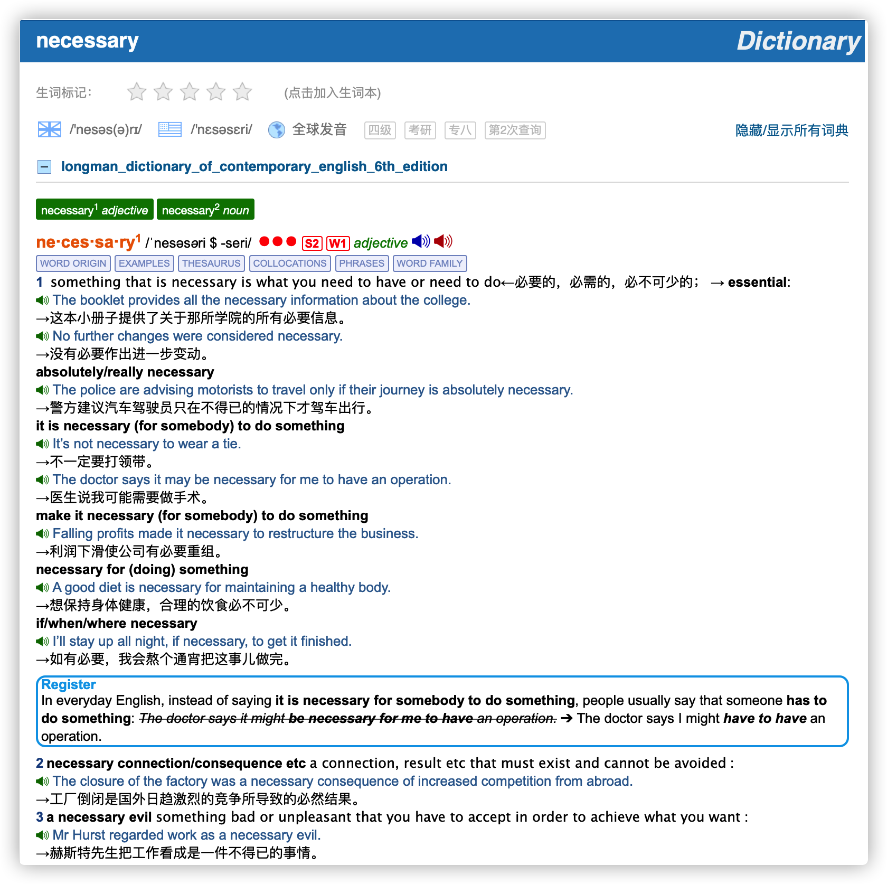

# Longman Dictionary of Contemporary English 5th/6th Edition

朗文当代英文词典 第 5/6 版

## New words

### 2021.07.12

#### 1. facilitate `/fəˈsɪlɪteɪt/` verb [transitive]
- 促进；使便利 (to make it easier for a process or activity to happen.使一个过程或活动更容易发生)
    + Computers can be used to facilitate language learning. 计算机可以用来方便语言学习。
- facilitation `/fəˌsɪlɪˈteɪʃən/` `noun` [uncountable]

#### 2. thesaurus `/θɪˈsɔːrəs/` noun (plural thesauruses or thesauri /-raɪ/) [countable]  
- 分类词典，同义词词典(a book in which words are put into groups with other words that have similar meanings)

#### 2. reminisce `/ˌreməˈnɪs/`  verb[intransitive]
- 追忆[回忆]往事，缅怀过去(to talk or think about pleasant events in your past).
    + **reminisce about**
        - a group of former students reminiscing about their college days. 追忆着大学时光的一群老校友

## Content

如果手机上只能装一本词典的话，我会推荐它。在所有的学习型词典中，朗文英英5/6词典（以下简称LDOCE5/6）是业界最良心的一本，它收词量最大，例句最多，各种搭配和用法举例也非常用心。

词典给出了每个单词的音标以及英式和美式发音，同时还有单词的词源，比如"rendezvous"其实是来源于法语。同时它会列出单词每个词条的解释以及各种搭配和例句。

LDOCE5/6 最令人感动的地方是：单词的例句都是带有发音的！这种发音不是机械的电脑合成音，而是真人原声，非常清晰自然。看例句的时候可以听一听语音，可以加深对例句的理解。

### 常用功能解释：

- **WORD FAMILY (词汇家族)**: 比如 economics, economist, economy, economic, economical 这样的词汇家族。朗文词典在每个单词页面的顶部把所有相关的不同词性的关联词汇清晰地罗列了出来，并且每个家族词汇都设置了超链接，点击即可跳转相关词汇的页面，十分方便。

- **常用 9000 词**: 朗文根据语料库词频整理出常用的 9000 个词汇，并将他们划分为高，中，低三个频次。每个频次分别用 3 个红点，2 个红点和一个红点示意。（位于音标右侧，如图所示）
- **口语(Spoken)/写作(Writing)常用 3000 词**: 朗文在常用 9000 词的基础上，分别针对口语和写作整理出了最为常用的 3000 个词汇并分别用 `S1`,`S2`,`S3` 与 `W1`, `W2`, `W3` 进行标识。以上图为例: necessary 标有 `S2`, `W1` 的标识，代表了 necessary 既属于口语常用 2000 词，也属于写作常用 1000 词的范围。
- **WORD ORIGIN (词源)**
- **VERB TABLE (动词表)**
- **EXAMPLES (例句)**
- **THESAURUS (近义词，同类词)**: 举个例子，对于 "walk"，它会列出与之意思相近的单词: "wander, stride, pace, wade"，并对此进行比较。比较之后你会发现，这些单词都有“走”的意思，但每个单词的意思都有细微的区别，比如"wander"是“漫步”，"stride"是“大踏步走”，pace是“踱步走”。而只有理解了这些词的区别之后你才能准备使用它们。
- **COLLOCATIONS (常见搭配)**: COLLOCATIONS，也就是搭配功能，这一点对写作很有帮助. 比如 "development" 这个词大家都知道，但是应该怎么使用呢？这个词前面应该用什么动词？ COLLOCATIONS 会告诉你，可以用 support/assist/further/facilitate development，比如：
    + We need to facilitate development and economic activity that provides jobs. 我们需要促进提供就业机会的发展和经济活动。
- **PHRASES (词组，习语)**
- **WORD SETS (词汇集合)** : 比如计算机相关词汇，昆虫相关词汇， 蔬菜相关词汇等等。 

在使用一个词时，我们既要了解它的含义，又要知道它的语法。例如，recall 和  reminisce 这两个词都表示“回忆过去发生的某件事情”，两者具有相同的含义。因此，在 *The two old friends talked for hours, recalling their schooldays. (两位老友交谈了几个小时起回忆他们在学校中的生活)* 这个的子中，单纯就含义而言，似乎未尝不可以用 reminisce 来代替 recall 但是，就语法而言，这两个动词却有重要的区别：recall 永远是及物动词，reminisce 永远是不及物动词。因此，*The two old friends talked for hours, reminiscing their schooldays.* 这个向子在语法上是不正确的，因为 reminisce 这个动词不可以后接直接宾语(受词)。意义相同的两个词在语法上并不总是相同的。由此可见，句中词语的正确使用不仅取决于对这些词语含义的理解，而且取决于对这些词语的语法功能的了解。

致力于提高英语运动能力的高层次学生来说, 通晓词语的语法功能显然特别重要. 有鉴于此,《朗文当代高级英语辞典》确定了一个目标，即对每一个词的语法特征和含义都要做到两者并重，提供既全面又清晣的说明。这个目标是借助一套“语法代号”（Grammar Codes）来完成的，这套代号把《当代英语语法》（Quirk, Greenbaun, Leech 和 Svartvik, 1985) 中的语法说明作为它的主要参比依据。例如，recall 这个词被标上代号 `Transitive`，表明它是一个**及物动词(Transitive)**。而 reminisce 这个词则则被标上`Intransitive (about)`，表明它是一个**不及物动词(Intransitive)**，而且后面可以接介词 about。如果在上面的例句用 reminisce 作为替换词的话，就必须把这些语法特征考虑进去。正确的新句为:
- The two old friends talked for hours, **reminiscing about** their schooldays.
  两个老友交谈了几个小时, 一起回忆他们在学校的生活.

除了表明基本的语法特征（如动词是及物的还是不及物的，名词是可数的还是不可数的等）之外，语法代号还对各种类型的补足成分作了充分的说明（此处需要注意的是：使用这类代号并不意味着永远需用这类结构，也不是不允许存在其他可替換的结构）。例如，一个词可有 that从 [子] 句作为补足语时就用代号 (+ that) 表示，而一些可后接 to 加不定词 (式) 短语的词则用代号 (+ to-v)表示。这种关于补足成分的信息不仅为动词提供，同样为名词和形容词提供。

同一个词可以有一系列不同的语法结构。例如，dream 就其主要语义而言，可用作不及物动词(*Do you dream at night?*)；也可与介词搭配使用 (*What did you dream about?*)；还可同 that 从 [子] 句连用 (*I dreamt that I was flying to the moon*).

从另一方面来看，一个词的各个不同含义常常需要不同的语法上的搭配。例如 drive 词既可用作及物动词 (to drive a car, bus, etc.)，也可用作不及物动词 (She drove along the street). 但是，在其含义为 to force to go(驱赶)时，它就只能用作及物动词 (to drive cattle) (Bad weather drove the tourists away)。由此可见，本辞典的一套代号既方便读者使用，又很能说明问题，整部辞典中各个词的语法持征都是用这种方式清楚地标示出来的。

这些代号提供的信息又通过例证加以充实。例证可把某个词所能显示的各种语法特征都具体地表現出来。而且，表明补足结构和介词搭配的语法代号就直接放在它们所适用的例句之前, 例如:

上图例子中, 先是列出词类(verb), 接着列出的是表示 "及物" 的语法代号 `[transitive]` 和 "不及物" 的语法代号 `[Intransitive]`.

有关本辞典列入的语法信息的说明可见 "本辞典使用方法简介" 的第 8 项, 以及 "语法代号" 表.

### 欧路词典安装扩展词库的方法，以 windows 为例：
点击软件右上角的 **工具** --> **词库管理**， 点击 **安装词库**， 点击 **打开文件** 按钮
找到词库的 mdx 格式所在的文件夹，点击加载即可 (注意：mdd 和 mdx 这两个文件的文件名必须保持一致，mdx 加载后会默认去找 mdd 文件。)
出现询问是否安装词典的对话框， 点击 "安装词库"  即可。

#### 高阶英英词典
- 韦氏高阶英英词典 (Webster's Advanced Learner's Dictionary)
- 麦克米伦高阶英英词典 (Macmillan English Dictionary for Advanced Learners)
- 柯林斯高阶英英词典 (Collins COBUILD Advanced Learner's English Dictionary)
- 剑桥高阶英英词典 (Cambridge Advanced Learner's Dictionary)

#### 三部高阶英汉双解学习词典
- 21世纪英汉汉英双向词典 (21st Century English-Chinese Dictionary)
- 牛津高阶英汉双解学习词典 (xford Advanced Learner's English-Chinese Dictionary)
- 柯林斯高阶英汉双解学习词典 (Collins COBUILD Advanced Learner's English-Chinese Dictionary)

#### 两部同义词词典
- 柯林斯英语同义词字典 (Collins Thesaurus)
- 牛津初级同义词词典 (Oxford Learner's Thesaurus)

#### 三部母语者使用的英英词典
- 韦氏大学英语词典 (Merriam-Webster's Collegiate Dictionary)
- 美国传统英语词典 (American Heritage Dictionary)
- 牛津英语词典 (Oxford Dictionary of English)

