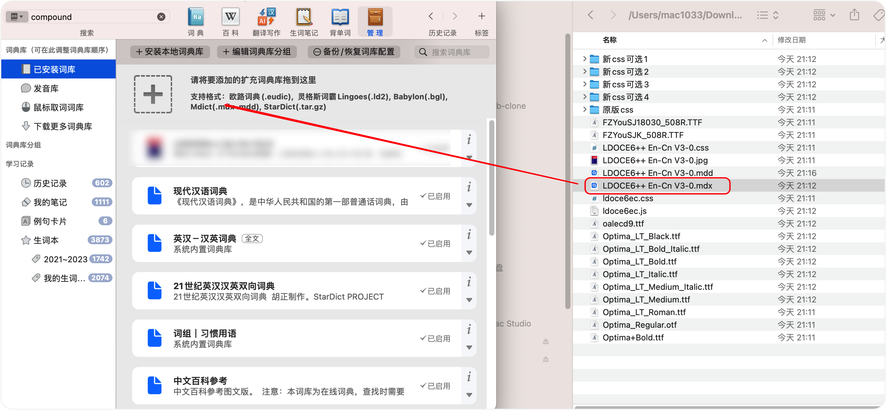

# 英语词库相关笔记

## 欧路词典介绍使用及其扩展词典推荐

#### 3.0 欧路词典是什么

欧路词典是支持 IOS、Android（安卓）、Windows、Mac 系统的全平台的**英语词典软件**。它首创 LightPeek 取词，可以做到即指即译，划词搜索，跨软件取词。

在手机上看英语文章时遇到生词可以直接用欧路词典查询而且支持查询过的生词自动加入生词本。支持卡片式复习，支持利用内置词典导出生词本到本地。

最重要的是，**欧路词典支持个性化加载 Mdict、灵格斯等多种格式的扩充词库**。免费/收费版本自选。

#### 3.1 欧陆词典文件格式

欧路词典的每部扩展词典一般包含两个文件：mdx 文件和 mdd 文件。

**==mdx 文件是标准的电子词典文件格式==**，里面储存的是一部词典的文本信息。

**==mdd 文件里面包含的是声音和图片==**。

有的词典只有一个 mdx 文件，没有 mdd 文件，就代表这部词典是没有单词发音，不能点击发声。

#### 3.3 欧路词典扩充词库的安装方法

##### windows 系统：

依次点击欧路词典主界面右上角“工具”---“词库管理”点击“安装词典”，找到词库所在文件夹。

按住 CRTL 键同时选择一部词典的 mdd 文件和 mdx 文件，点击“打开” （注意 mdd 和 mdx 这两个文件的文件名必须保持一致）

出现询问是否安装词典的对话框，点击“安装词库”，即可完成扩展词库的安装。

安装完全部词库后，可以在词库管理器页面，单击选中任一词库，然后点击上方工具栏内的”上移“”下移“按钮，调整此词库在查询单词释义时出现的先后位置。

##### ipad 与 iphone：

在百度网盘内点击下载好的欧路扩充词库，页面显示“抱歉，该文件暂时无法预览”。

点击页面底部最左侧的"打开"图标，选择“用欧路词典导入”。此时欧路词典 APP 自动打开，并询问是否安装词库，点击“安装”，即可完成此部扩展词典的安装。

##### Mac 系统：

直接拖拽下载好的扩充词库文件到欧路词典词库扩充框中即可。（注意：有时候可能一次拖拽不成功，多试两次。）

##### 安卓系统：

在电脑上或百度云盘中下载好词库文件，找到文件所在目录并复制到手机的 `eudb_en` 文件内。之后可以在手机欧路词典 APP 的"词典库管理"中调整词库显示顺序。

#### 3.4 欧路词典扩充词库（词典）推荐

> 笔记参考 - [每个人都值得拥有几本好词典](https://zhuanlan.zhihu.com/p/20214473?refer=talk-about-english)

下面词典的下载链接：

+ 链接：https://pan.baidu.com/s/1ugzkQCVv8PrHL4601AvMaw
+ 密码：1me4

#### (1) Longman Dictionary of Contemporary English 5th/6th Edition （朗文当代英文词典 第 5 版） （Hint: 墙裂推荐）

笔记详见同级目录的：`./Longman-dictionary.md`

#### (2) Macmillan English Dictionary for Advanced Learners （麦克米伦高阶英语词典）

《麦克米伦高阶英语词典》有两个特点，一个是采用红色星号标注词频，它用一、二、三个不等的红色星号来标示其使用频率的高低（一二三星词汇加起来一共有 7500 个，三星词汇出现频率最高，一星最少）。另一个是带有大量的短语搭配。

麦克米伦词典收录的短语数量非常多，我在使用的时候发现很多在其他词典上找不到的短语它都有收录。

另外词典的单词同样带有英式和美式两种发音，音质很不错，例句也非常详细且接地气，是一本很好的学习词典。

#### (3) Collins Cobuild Advanced Learner's English Dictionary （柯林斯高阶英英词典）

柯林斯词典有两个特点：

1. 采用英文整句释义来解释单词
2. 用五颗星来标记词频

比如 "melancholy" 单词，词典是这样解释的：

1. Melancholy is an intense feeling of sadness which lasts for a long time and which strongly affects your behavior and attitudes.
2. If someone feels or looks melancholy, they feel or look very sad.

读完这样的解释之后可我们以很容易地理解"melancholy"的意思，同时还能知道可以采用 feel/look melancholy 这样的搭配。同时 "melancholy"还带有一星的标志，这意味着它是英语中最常用的 14600 词之一，会经常出现，应该记起来。

柯林斯词典有一个高达 2.5 亿的语料库，从语料库中筛选出了最常用的 14600 词用五星标注。其中五星（最常用词，以下逐级次之）680 词，四星 1040 词（累计 1720 词），三星 1580 词（累计 3300 词），二星 3200 词（累计 6500 词），一星 8100 词（累计 14600 词）。根据语料库的统计结果，掌握五级四级的前 1720 詞，就可以读通英语资料的 75%，掌握五、四、三、二级的 6500 词，就可以读通英语资料的 90%，掌握这 14600 词，就可以读懂任何英语资料的 95%，即从理论上说，任何一篇 100 词的文章里大概只有 5 个词不认识。

总而言之，这是一本对学习者非常友好的词典，如果你刚开始使用英英词典，那么它会是一个非常好的入门选择。当然柯林斯词典也有一些缺点，比如过分追求采用整句释义来解释单词，导致解释冗长啰嗦，而且有时候会带来解释不够精确的问题。但瑕不掩瑜，这仍然是一本很不错的词典。

#### (4) Cambridge Advanced Learner's Dictionary （剑桥高阶英语学习词典）

剑桥高阶英语学习词典（又称 CALD), 这本词典的收词量很大，而且带有大量的短语。
对于每个单词，词典中都会给出英式和美式的音标以及发音，
我的感觉是 CALD 的单词发音在所有英英词典中音质最棒，最纯正。
每次单词不确定读音我都会用 CALD 查一遍。

#### (5) Merriam-Webster's Advanced Learner's English Dictionary （韦氏高阶英语词典）

《韦氏高阶英语词典》是美系品牌，因此收录了较多的美式常用惯用语以及动词搭配。
词典最大的特点是：例句超级多。这本词典据说收录了 160,000 个例句，
号称是市面上所有英语学习字典中收录例句最多者。韦氏不仅收录例句多，对于比较难的例句，
它还会贴心地在例句后面附带上一句通俗版的解释，从为学习者考虑这一点来说，
这是我见过的最有诚意的一本词典了。

## mdx、mdd 与 css 之间的关系

> 文章来源：https://xfdj.github.io/2020/12/18/mdx%E3%80%81mdd%E4%B8%8Ecss%E4%B9%8B%E9%97%B4%E7%9A%84%E5%85%B3%E7%B3%BB/

 发表于 2020-12-18 更新于 2022-05-20 本文字数： 1.2k 

> MDict 是一款用于 PC 及移动设备的电子辞典软件，可以用于查看 mdx 格式的词典文件。
>
> —— 维基百科

MDict 本身并不提供词库，不过可以从网上下载到热心网友为 MDict 制作的词库，包括各大著名词典比如牛津、剑桥、朗文等等。

我们从网上下载词库文件，一般会下载到后缀为`.mdx`、`.mdd` 和`.css` 后缀的文件。`.css` 是给`.mdx` 排版的文件。

`.mdx` 和`.mdd` 文件是 MDict 的词库文件，其中

- `.mdx` 文件是存文字的词库文件，实质上是由成千上万个由 HTML 语言编写的词条排列压缩构成的，它包含了一部词典几乎所有的文本。
- `.mdd` 是词库资源包，存除文字以外的全部内容，包括 CSS、JavaScript、音频、图片、视频等等，任何文件都可以打包到`.mdd` 里去，能不能和`.mdx` 联合起来查看另说，所以一般来说，`.mdd` 文件都会比`.mdx` 文件大很多，不过`.mdd` 文件是可选的。

- `.css` 是外部层叠样式表，控制`.mdx` 中 HTML 文本的排版，有了它，可以让词典焕发出绚丽的色彩。CSS 可以打包进`.mdd`，也可以外置成单独的一个文件。如果`.mdx` 要链接上 CSS，内容里必须有 `<link href="content://xxx.css">` 这样的代码。但是对 MDict 而言，有一种特殊情况：比如 `A.mdx` 的没有 `<link href="content://xxx.css">`，可以建一个同名文件 `A.css` 来控制 `A.mdx` 的排版（在 GoldenDict 下似乎暂时不可行）。另外，如果 `A.mdx` 有 `<link href="content://B.css">`，那么这个 `B.css` 可以打包进 `A.mdd`，也可以外置和 `A.mdx`、`A.mdd` 放在一起，但是不能改名（如果改名成 `A.css`，在 MDict 下还是可以的，其他软件不保证效果）。

从网上下载的`.mdx`、`.mdd` 文件，可以随意改名，只要文件名一致就行，但是`.css` 不能随便更改，必须是制作者提供的那个名字，除非自己修改，链接了另一个名字的`.css`。有部分制作者，`.mdd` 里打包了 CSS，不过为了方便其他人修改，又提供了一个外置的 CSS，所以这种情况下，删除了外置的 CSS，排版效果仍在。而根据参考网页的说法，外置的 CSS 优先级是高于内置的 CSS 的，也就是说如果你修改了外置的 CSS，那相应的`.mdx` 文件的排版是会改变的。

如果要更换 CSS，首先需要**备份原 CSS 文件**。然后将新的 CSS 文件直接覆盖原 CSS 文件即可（文件名要保持相同）。而且，一部词典的 CSS 是为该词典量身定做的，使用其它词典的 CSS 可能会导致各方面的问题，所以不要拿其它词典的 CSS 套用在自己想要的词典上。

## 英语词库编辑 CSS 样式方法

> 文章来源：https://www.pdawiki.com/forum/thread-25453-1-1.html ([教程] 最最最最详细的手把手地教你修改css)

### 准备材料：
1. MdictWindows版：用于获取某个词条的源代码。 文件见：`./英语词库编辑所需文件/MDictPC.7z`
2. MdxExport，用于解压出 MDD 文件中的 css 文件。 文件见：`./英语词库编辑所需文件/MdxExport.3.6.zip`
3. Chrome 浏览器，用于调试 css 代码。

### 第一步：获取某个词条的源代码

详细过程：
- 最好先在桌面上建立一个文件夹，比如我这次要修改 "牛津词典"，我就会创建一个叫 "牛津" 的文件夹，用于存放相关文件。
- 建立好文件夹后，把 mdx 和对应的 css 文件放进去。注：有些词典的 css 文件并不是直接给你的，而是被压缩在对应的 mdd 文件里面的，因此，对于这些词典，首先要做的就是使用 MDX EXPORT 获取它的 css 文件。该软件的操作完全是傻瓜式的，这里就不赘述了。
- 解压出来的文件夹中如果有css，就把它拉到 "牛津" 文件夹里，要是没有css的话，那就说明这部词典使用了内嵌式css样式，无法用此方式修改。
- 打开mdict，点击 "词库"，加载牛津词典。查询几个单词。这几个单词的解释要比较长，因为越长说明它涵盖的样式越多，越方便修改。这里推荐几个：take，think，make，go等。查完某个单词，鼠标移到解释界面并右击，点击 "查看源"，这时会显示一个txt文档。

### 第二步：处理txt文档。
- 在源代码txt文件中，点击编辑——查找，输入 `.css` （不包含冒号），开始查找。你会搜到几处高亮显示的 `content://mdict.cn/mdd/109/oalecd8e.css`，把 `oalecd8e.css` 前面的部分删除。
- 如果你要修改的词典文件还使用了 js，那么还要搜索 `.js` ，在牛津里，我搜到两处：`content://mdict.cn/mdd/109/jquery.js和content://mdict.cn/mdd/109/oalecd8e.js`，还是像处理 css 那样，把`content://mdict.cn/mdd/109/` 部分删掉，就剩下 jquery.js 和 oalecd8e.js。
- 处理完毕后，点击保存，文件名为think，文件格式为 `html` （可以通过重命名改后缀的方式完成），词条源码文件依旧储存在 `牛津` 文件夹内。（注意，mdx，html，css三个文件一定要放在同一目录下）

### 第三步：修改css。

- 打开Chrome浏览器，将第二步中得到的html文件“think.html”拖动到浏览器界面中，你就能看到这个单词在词典中的样子了（如果你第二步中的操作有误，你就不看到任何排版，只有杂乱的文字）。8 _# T& u' R& e
- 接着，按“win+F12”，打开调试窗口（有的电脑直接按F12，有的按Fn+F12）。调试窗口我们能用到的只有Elements和Sources窗口。在Elements窗口下，点击最左上角的按钮后，再去点击浏览器中所显示的词条的某个部分，在styles下会出现各种与你所点击内容样式相关的代码（这个操作贯穿修改css全程的始终）。
- 如图，点击词头“think”后在styles下方出现了与词头样式相关的代码，每一个代码之前有一个框。在框中有√就说明该样式已被激活，你可以用鼠标点击这个√，这样√会消失，这个样式会取消激活。（你可以灵活地使用这个方法去试探某个样式到底是不是你想控制内容的样式）。各种css中常见的代码有：color（改颜色），font-size（改字体大小），font-family（改字体），font-weight（更改字体粗细），border（添加边框），border-radius（调整边框四角弧度）等，百度中有很多相关内容。修改的部分你多试几次就熟练了，这里不再赘述了。修改过程中，请放心大胆修改，ctrl+z可以撤销操作。

## 欧陆词典中的朗文词库编辑 CSS

欧路词典中的 LDOC 6 V3.0 的 CSS 文件自己编辑没有用，2022.07.12 下午 1 - 3 点折腾了 2 个小时，==放弃==。

要编辑的文件为 `ldoce6ec.css` 这个文件，但是不知道为什么几个文件夹替换就是可以的，但我自己打开 css 编辑就不行，醉了。
