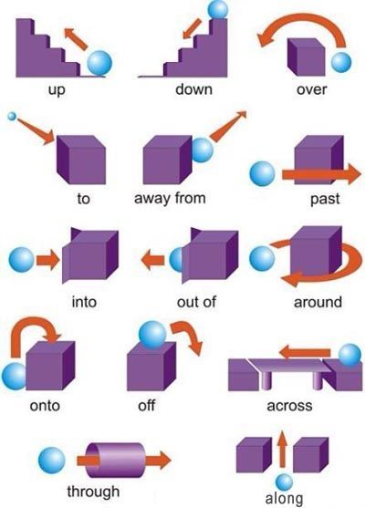
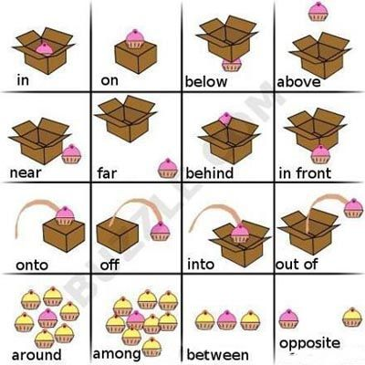
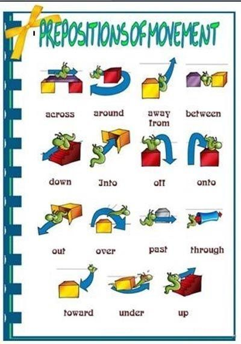
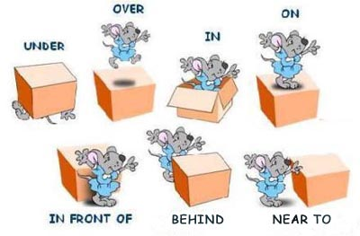
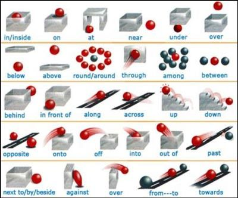
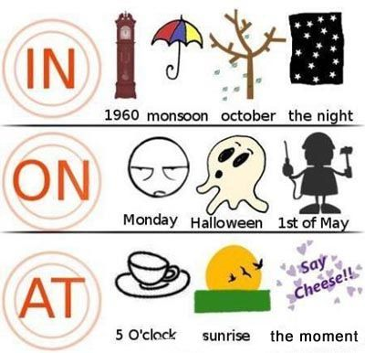
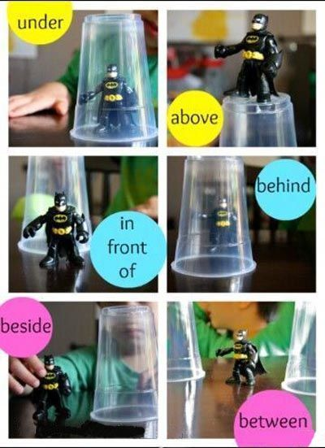
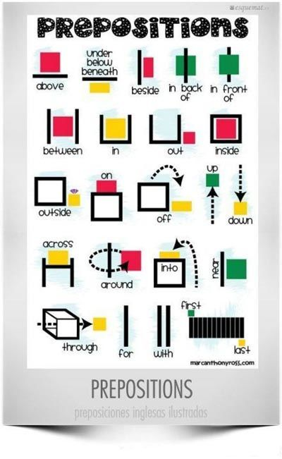
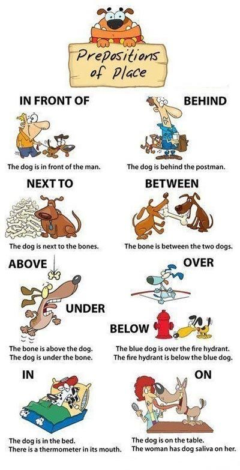

# 英语语法

- 英语语法学习原则, 总结来说: 一定要有语法大系统, 大框架; 借助语法书, 过一遍;
  不能鼠目寸光, 背诵一个语法小点, 捡芝麻丢西瓜.

- You don't even know what you are talking about.
  你甚至都不知道你在说什么.

## TOC

## New Words

## Content

### 九张图搞定所有英语介词(preposition)用法

> 笔记来源： https://zhuanlan.zhihu.com/p/25341244

#### NO 1

#### NO 2

#### NO 3

#### NO 4

#### NO 5

#### NO 6

#### NO 7

#### NO 8

#### NO 9

#### 记忆口诀： (下面的笔记需要再次编辑)

- 早、午、晚要用in，at黎明、午夜、点与分。

- 年、月、年月、季节、周，阳光、灯、影、衣、冒in。

- 将来时态in...以后，小处at大处in。

- 有形with无形by，语言、单位、材料in。

- 特征、方面与方式，心情成语惯用in。

- 介词at和to表方向，攻击、位置、恶、善分。

- 日子、日期、年月日，星期加上早、午、晚，

- 收音、农场、值日on，关于、基础、靠、著论。

- 着、罢、出售、偷、公、假，故意、支付、相反，准。

- 特定时日和“一……就”，on后常接动名词。

- 年、月、日加早、午、晚，of之前on代in。

- 步行、驴、马、玩笑on，cab，carriage则用in。

- at山脚、门口、在当前，速、温、日落、价、核心。

- 工具、和、同随with，具有、独立、就、原因。

- 就……来说宾译主，对、有、方状、表细分。

- 海、陆、空、车、偶、被by，单数、人类know to man。

- this、that、tomorrow，yesterday，next、last、one。

- 接年、月、季、星期、周，介词省略已习惯。

- over、under正上下，above、below则不然，

- 若与数量词连用，混合使用亦无关。‘

- beyond超出、无、不能，against靠着，对与反。

- besides，except分内外，among之内along沿。

- 同类比较except，加for异类记心间。

- 原状because of,、 owing to、 due to表语形容词

- under后接修、建中，of、from物、化分。

- before、after表一点, ago、later表一段。

- before能接完成时，ago过去极有限。

- since以来during间，since时态多变换。

- 与之相比beside，除了last but one。

- 复不定for、找、价、原，对、给、段、去、为、作、赞。

- 快到、对、向towards，工、学、军、城、北、上、南。

- but for否定用虚拟，复合介词待后言。

- ing型由于鉴，除了除外与包合。

- 之后、关于、在......方面，有关介词须记全。

- in内to外表位置，山、水、国界to在前。

- 如大体掌握如上介调用法口诀，就不易出错。当然，至于介词的详尽用法，同形词又是连词及副词等内容此章不讲。下面对该口诀分别举例帮助你理解消化。

- 早、午、晚要用in

- 例：in the morning 在早上

- in the afternoon 在下午

- in the evening 在晚上

- in the day 在白天

- at黎明、午、夜、点与分

- 例: at dawn, at daybreak 在黎明时候

- at noon 在中午

- at night 在夜间

- at midnight 在午夜

- 以上短语都不用冠词

- at six o'clock 在6点钟

- at 7：30 (seven thirty) 在7点半

- at half past eleven 在11点半

- at nine fifteen 在9点15分

- at ten thirty a.m. 在上午10点30分

- 也可以写成

- seven to five 5点差7分(半小时以上)

- five minutes after two 2点过5分

- at a quarter to two 1点45分

- at the weekend 在周末

- 年、月、年月、季节、周

- 即在“来年”，在“某月”，在“某年某月” (但在某年某月某

- 日则用on)，在四季，在第几周等都要用in。

- 例；in 1986 在1986年

- in 1927 在1927年

- in April 在四月

- in March 在三月

- in December 1986 1986年12月

- in July l983 1983年7月

- in spring 在春季 in summer 在夏季

- in autumn 在秋季 in winter 在冬季

- in the fist week of this semester 这学期的第一周

- in the third week 在第三周

- 阳光、灯、影、衣、冒 in，

- 即在阳光下，在灯下，在树阴下，穿衣、着装、冒雨等都要用in。

- 例：Don't read in dim light. 切勿在暗淡的灯光下看书。

- They are reviewing their lessons in the bright light. 他们在明亮的灯光下复习功课。

- They are sitting in the shade of a tree. 他们坐在树阴下乘凉。

- a prisoner in irons 带着镣铐的囚犯

- He went in the rain to meet me at the station. 他冒雨到车站去接我。

- The poor dressed (clothed) in rags in old society. 旧社会穷人们衣衫褴褛．

- 以及：in the bright sunlight 在明亮的阳光下

- a merchant in disguise 乔装的商人

- the woman in white (black, red, yellow) 穿着白(黑、红、黄)色衣服的妇女

- in uniform 穿着制服

- in mourning 穿着丧服

- in brown shoes 穿着棕色鞋

- in his shirt sleeves 穿着衬衫

- 将来时态in...以后

- 例: They will come back in 10 days. 他们将10天以后回来。

- I'll come round in a day or two. 我一两天就回来。

- We'll be back in no time. 我们一会儿就回来。

- Come and see me in two days' time. 两天后来看我。(从现在开始)

- after... (从过去开始)

- 小处at大处in

- 例：Li and I arrived at Heishan county safe and sound, all is well. Don't worry. 李和我平安地到达黑山县，一切很好，勿念。

- I live in a great city (big city), my sister lives at a small town while my parents live at a village. 我住在大城市，我姐姐住在一个小城镇，而我的父母则住在农村。

- I'm in Liaoning, at Anshan. 我住在辽宁省鞍山市．

- 有形with无形by，语言 、单位、材料in

- 例：The workers are paving a road with stone. 工人们正用石子铺路。(有形)

- The teacher is correcting the paper with a new pen. 这位教师正用一支新笔批改论文。(有形)

- "Taking Tiger Mountain by Strategy" is a good opera. < <智取威虎山 > >是—出好戏。(无形)

- The product is separated by distilation into gasoline and gas oil. 这种产品是用蒸馏分离出气油和粗柴油。 (表示方式、手段、方法——无形)

- I really can't express my idea in English freely in-deed． 我确实不能用英语流利地表达我的思想。 (表示某种语言用in)

- I wrote a novel in Russian. 我用俄语写了一本小说。(同上)

- The kilometer is the biggest unit of length in the metric system． 公里是米制中最长的长度单位。 (表示度、量、衡单位的用in )

- The length is measured in meter, kilometre, and centimetre. 长度是以米、公里、厘米为单位来计算的。(同上)

- This board was cast in bronze not in gold. 这个牌匾是铜铸的，不是金铸的。

- 特征、方面与方式、心情、成语惯用in

- 特征或状态：

- 例: The Democratic Party was then in power. 那时民主党执政。

- They found the patient in a coma. 他们发现病人处于昏迷状态。

- He has not been in good health for some years. 他几年来身体一直不好。

- Many who came in despair went away in hope. 许多人带着绝望情绪而来，却满怀希望而去。

- The house was in ruins. 这房屋成了废墟。

- The poor girl was in tears. 这个贫苦女孩泪流满面。

- Her clothes were in rags. 她的衣跟穿破了。

- His shoes were in holes. 他的鞋穿出窟窿了。

- I only said it in fun. 我说这话只是开玩笑的。

- She spoke in grief rather than in anger. 与其说她讲得很气愤，不如说她讲得很伤心。

- 还有一些短语也用in，如：

- in jest 诙谐地，in joke 开玩笑地，in spite 恶意地， in fairness 公正地，in revenge 报复, in mercy 宽大，in sorrow 伤心地等。

- His mind was in great confusion. 他脑子里很乱。

- Today everybody is in high spirits and no one is in low ebb. 今天大家都兴高采烈，没有一个情绪低落的。

- She and her classmates are in flower ages. 她和她的同学都正值妙龄。

- The compaign was in full swing. 运动正值高潮中。

- 方面：

- 例：we accepted the item in principle. 我们在原则上接受了这个条款。

- They are never backward in giving their views. 他们从来不怕发表自己的意见。

- The backward area has achieved self-sufficient in grain. 这个落后的地区在粮食方面已能自给。

- A good teacher must be an example in study. 一个好的教师必须是学习的模范。

- 方式：

- 例：All the speeches were taken down in shorthand. 所有报告都用速记记录下来了。

- The Party has always educated us in the spirit of patriotism and internationalism. 党一贯以爱国主义和国际主义精神教育我们。

- 如下成语惯用in

- 例如： in all 总计

- in advance 事前

- in the meantime 与此同时

- in place 适当地

- in hopes of(或in the hope of) 怀着.......希望

- in connection with 和……有关

- in contact with 和……联系

- in addition to 除......以外

- in case of 倘若，万一

- in conflict with 和......冲突

- in force 有效的，大批

- in depth 彻底地

- in regard to 关于

- in the neighborhood of 大约、邻近

- in retrospect 回顾，一想起

- in behalf of 代表......利益

- in the least 一点，丝毫

- in alarm 惊慌、担心

- in the opinion of 据……见解

- in the long run 从长远说来

- in one's opinion 在……看来

- in word 口头上

- in a word 总之

- in vain 无益地, 白白地

- in case 如果，万一，以防

- in detail 详细地

- in haste 急急忙忙地

- in conclusion 总之

- in spite of 尽管

- in other words... 换句话说

- in return 作为回报

- in the name of 以......名义

- be confident in 对......有信心

- be interested in 对......感兴趣

- in doubt 怀疑

- in love 恋爱中

- in debt 负债

- in fun (jest、joke) 玩笑地

- in hesitation 犹豫不决

- in wonder 在惊奇中

- in public (secret) 公开他(秘密地)

- in a good humour 心情(情绪)好

- “介词at、to表方向，攻击、位置、善、恶、分”。

- 介词at和to都可以表示方向; 用at表示方向时，侧重于攻击的目标，往往表示恶意；用to表示方向时，突出运动的位置或动作的对象，侧重表示善意。试比较下列各句：

- 1. A．She came at me. 她向我扑过来。

- B．She came to me. 她向我走过来。

- 2．A．Jake ran at John. 几 杰克向约翰扑过去。

- B．Jake ran to John. 杰克朝约翰跑去。

- 3．A. He rushed at the woman with a sword. 他拿着剑向那妇女扑过去。

- B. He rushed to the woman with a sword. 他带着剑向那妇女跑过去。

- 4．A．He shouted at the old man. 他大声喝斥那老人。

- B. He shouted to the old man. 他大声向那老人说

- 5．A．I heard her muttering at Xiao Li. 我听见她在抱怨小李。

- B．I heard her muttering to Xiao Li. 我听见她在同小李低声说话。

- 6．A. She talked at you just now. 她刚才还说你坏话呢。

- B．She talked to you just now. 她刚才还同你谈话呢.

- 7．A．She threw a bone at the dog. 她用一块骨头砸狗。

- B．She threw a bone to the dog. 她把一块骨头扔给狗吃。

- 8．A．He presented a pistol at me. 他用手枪对着我。

- B．He presented a pistol to me. 他赠送我一支手枪。

- 日子、日期、年月日，星期加上早午晚; 以下皆用on。

- 例: on Octorber the first 1949 1949年10月1日

- on February the thirteenth l893 1893年2月13日

- on May the first 5月1日

- on the first 1号

- on the sixteenth 16号

- on the second of January 或 on January the second 1月2日

- on a summer evening 在夏天的一个夜晚

- on Boxing Day 在节礼日(圣诞节次日)

- on New Year's Day 在元旦

- on my birthday 在我的生日

- 但 in the Christmas holidays在圣诞节假期; in the eighteenth century 在十八世纪; in ancient times 在古代; in earlier times 在早期; in modern times 在现代，则用in，the present time 现在，at the present day当今则用at。

- on May Day 在“五?一”节

- on winter day 在冬天

- on Decenber 12th 1950 l950年12月12日

- on Sunday 在星期天

- on Monday 在星期一

- on Tuesday morning 星期二早晨

- on Saturday afternoon 星期六下午

- on Friday evening 星期五晚上

- 但last night 昨夜；in the evening 在晚上; on time准时，in time及时，等则不同。

- 年月日，加早午晚，of之前on代in

- 例： on the morning of 18th 18日早晨

- on the evening of 4th 4日晚上

- On the eve of their departure they gave a farewell banquet and their head gave a garewell speech. 他们在临行前夕举行了一次告别宴会，他们的团长发表了告别讲话。

- 收音、农场，值日on

- 例：Did your supervisor like the story over (or on) the radio last night?

- 您的导师喜欢昨天从收音机里听到的故事吗?

- I heard the news over (or on) the radio. 我从收音机里听到了这一条消息。

- taIk over the radio 由无线电播音

- on TV 从电视里......

- hear something on the wireless 在无线电里听到

- My brother works on an Army reclamation farm. 我哥哥在一个军垦农场工作。

- The students are working on a school farm. 学生们正在校办农场劳动。

- This is a farmer's house on a farm. 这是农场的农舍。

- Who is on duty, tody? 今天谁值日?

- We go on duty at 8 a.m. 我们上午8点钟上班。

- 关于、基础、靠、著论

- 例: This afternoon we are going to listen to a report on the international situation. 今天下午我们要听关于国际形势的报告。

- Professor Shen will give us a talk on travelling in America. 申教授将给我们做关于美国之行的报告。

- You are wrong on all these issues. 在这些问题上你的看法都错了。

- The belief is based on practical experience. 这种信念是以实际经验为基础的。

- Theory must be based on practice. 理论必须以实践为基础。

- The people in the south live on rice. 南方人主食大米。(靠)

- The citizens live on their salaries. 城市人靠薪金生活。

- You can't afford luxuries, on an income of 100 yuan a month． 靠月薪100元的收入，你是买不起奢侈品的。

- Her pet dogs were fed on the choicest food． 她用精饲料喂养她心爱的狗。

- He is just a scrounger, who lives on other people. 他正是一个小偷，专靠损害别人过日子。

- Keep the kettle on the boil (=boiling). 让水壶的水一直开着。

- The enemy are on the run (=running). 敌人在逃跑。

- on后接the加上一个作名词的动词．其意义与现在分词所表达的相近。类似例子很多如：

- on the march在行军中，on the mend 在好转中，on the prowl徘徊，on the move活动中，on the scrounge巧取豪夺(埋语)，on the go活跃，忙碌，on the lookout注意, 警戒，on the watch监视着。on the hop趁不备抓住某人等等。

- on the People's Democratic Dictatorship < <实践论 > >和 < <矛盾论 > >

- on the People's Democratic Dictatorship < <论人民民主专政 > >

- "on Coalition Government" < <论联合政府 > >

- 着、罢、出售、偷、公、假，故意、支付，相反、准

- 注：口诀中的“着”是指着火，罢指罢工，偷指偷偷地，公指出差、办公事；假指休假，准指准时。

- 例：The house next to mine was on fire. 我邻居的房子着火了。

- The workers of the railway station were on strike. 铁路工人罢工了。

- Grapes and big water melons from Sinkiang are on sale on a large sale. 新疆葡萄和西瓜大量上市了。

- do something on the sly (quiet). 秘密地(暗地里，偷偷地)做某事。

- I've come here on business. 我是有公事来的。

- They went to Bern on a mission. 他们到伯尔尼去执行一项使命。

- They has been away on a long trip. 他们出去做一次长途旅行。

- I'll go home on leave next month. 下月我将休假回家。

- I went on business to Shanghai. I did not take leave. 我是公出去上海的，不是不告面别。

- She came to see you on purpose. 她是专程来看你的。

- He came here on purpose to discuss it with you. 他到这来是要与你讨论这件事的。

- This lunch is on me.

- "No. let's go Dutch."

- “这顿午饭我付钱。”

- “不，还是各付各的。”

- On the contrary, it was very easy to understand. 相反，这事儿很容易理解。

- P1ease come on time. (on schedule). 请准时来。

- 注：in time是“及时”的意思。

- The train arrived on schedule. 火车准时到达。

- 特定时间和“一……就”，左右on后动名词

- 例：Gases expand on heating and contract on cooling. 气体加热时膨胀，冷却时收缩。(特定时间)

- On entering the room, he found his friends dancing in high spirits. 一进屋，他就发现他的朋友们在愉快地跳舞。

- On reaching the city he called up Lao Yang. 一到城里他就给老杨打了一个电话。

- I'll write to him on hearing from you. 我接到你的来信就给他写信。(一……就)

- 以及on the left, right向左向右，on the stair在台阶上等。

- 步行、驴、马、玩笑on，cab，carriage用in

- 例：On foot步行; on horse骑马; on donkey 骑驴。

- He rode on, blood flowing from his side. 他骑着马，鲜血从腰部流下来。

- The soldier of the Eighth Route Army rode 100 li on a horse a day in order to catch up with his unit. 为赶上部队，那位八路军战士骑马日行百里。

- Go on horse back! 骑马去！

- You are having me on! 你和我开玩笑呢!

- in cab和in carriage 不能用on或by cab或carrige。

- at山脚、门口在当前，速、温、日落价核心

- 即在山脚下、在门口、在目前，速度、以……速率、温度、在日落时、在……核心要用at。

- 例：At the foot of the mountain, there are thirty of our comrades. 在山脚下，有我们30个同志。

- There is a beautiful lake at the foot of the hill. 山脚下有一个美丽的湖。

- At the gate of the house there are many children playing glassball. 门口有一大群孩子在玩玻璃球。

- Who's standing there at the door? 谁站在门口?

- I don't need the dictionary at present. 我现在还不需要这本词典。

- He is at present in Washington. 他目前正在华盛顿。

- The train runs at fifty kilometres an hour. 火车每小时行驶50公里。

- at home 在国内，在家里

- at ten degrees centigrade 在摄氏10度

- at minus ten degrees centigrade 摄氏零下10度

- Water freezes at 0°centigrade. 水在镊氏零度结冰。

- Water usually boils at 100°. 水通常在摄氏loo度沸赐。

- at zero 在零度

- at the rate of 45 miles an hour

- at full speed 全速

- at a good price 高价

- at a low cost 低成本

- at a great cost 花了很大代价

- at that time 在当时

- at 1000RPM (revolution per minute) 每分钟1000转

注：文章来源于网络。

