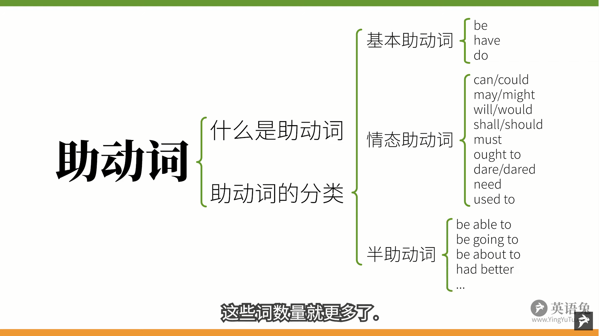
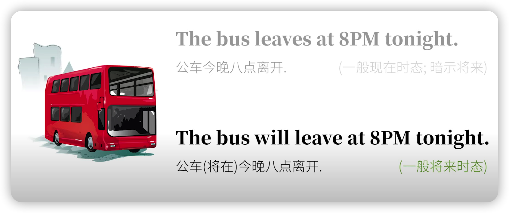
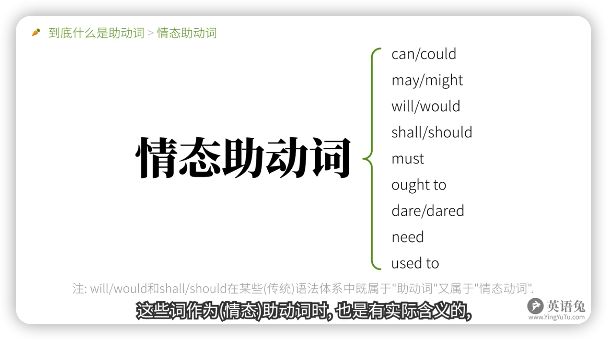
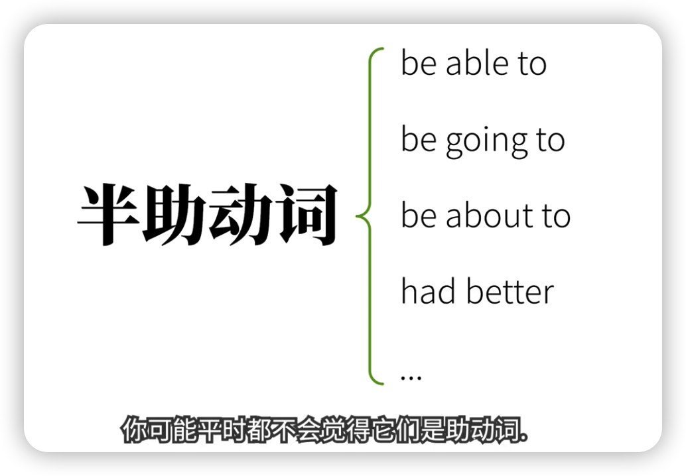
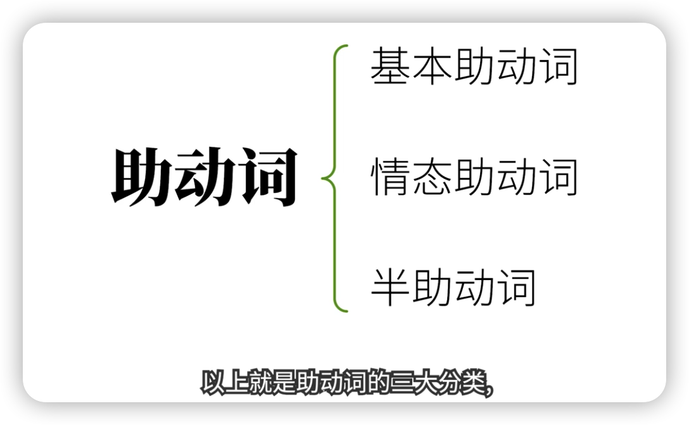

# Unit 12 -- 助动词和情态动词

要做笔记:  英语语法: 助动词 (基本助动词, 情态助动词, 半助动词)

> Youtube: https://www.youtube.com/watch?v=-mRlocpeYA8
>
> BiliBili: https://www.bilibili.com/video/BV1834y1r79u?spm_id_from=333.337.search-card.all.click

你好啊，我是最在乎你的英语老师英语兔。这次咱们来说**助动词**(auxiliary`/ɔɡ'zɪlɪəri/` verbs)，并着重讲一下**助动词中的情态动词**(modal` /ˈməʊdl` verbs)。你也许会问，不对啊，助动词和情态动词是不同的两类词吧?，怎么能混在一起？别急，请听英语兔我解释。

## 1. 什么是助动词?

咱们之前在语法综述里提到，**任何整句都分为主语和谓语**，而谓语部分的核心是**谓语动词**，但是**谓语动词本身往往无法独立表达某些语法概念，需要其他词的辅助，而这些来辅助构成谓语但自己本身不能作谓语动词的词就是助动词**。

听起来有点抽象，那咱们举个具体的例子，你应该已经知道动词有过去式、现在式和将来式。比如：

- 过去式：The rabbit ate`/eɪt/` a carrot. 兔子吃了根胡萝卜。
- 现在式：The rabbit eats carrots. 兔子吃胡萝卜。
- 将来式：The rabbit will eat a carrot. 兔子将吃根胡萝卜。

有没有意识到,  eat 这个动词本身有过去式变位 ate, 第三人称现在式变位 eats，但其实是并没有将来式变位的。

英语兔我再重复一遍，eat 来身是没有办法通过动词变位，即改变拼写来表达 ”将来时“ 的，eat 怎么才能表达 ”将来时“ 呢？

必须在前面加 will 来 "辅助" 完成表达，所以 will 在这里就是构成将来时的助动词，而助动词 will 本身是不能独立表达完整句意的：~~The rabbit will a carrot.~~  你肯定觉得哪里怪怪的，对不对？ 必须把实义动词加回来：The rabbit will **eat** a carrot. 这才对嘛。

你也许会反驳说，英语不用助动词也能表达将来吧。比如：The bus leaves at  8PM tonight. (公车今晚八点离开)。 这么说没错，但是这种将来时间是隐含的意义。这句话还是一般现在时态，只不过暗示了将来，而其中的 Leaves 本身并不是将来时变位，真正的将来时还是：

所以你看到吗？助动词有两个基本特征：

- (1) 辅助主动词；

- (2) 不能向主动词那样单独作谓语动词。

那好，再看这句：The rabbit can kill a wolf. (兔子能杀死一只狼。)；这里的 can 只是表达兔子有这一能力，并不是说兔子真的杀过或者会杀一只狼，对不对？不用 can 这个词, 就没法表达这个意思。所以 can 在这里还是辅助主动词 kill 的；同时，can 这个词自己也不能独立成句：~~The rabbit can a wolf.~~ 虽然看 can 也可以做实义动词表示 “把...放进罐头”，

但兔子把狼装进罐头干嘛？过冬么？再说，这里的 can 要做谓语动词好歹也需要变位呀。

你可能意识到英语兔我要说什么了。那就是， 虽然 can 这样的词被很多语法体系归类为 ”情态动词“，但是情态动词：

- (1) 起辅助主动词的作用;
- (2) 不能单独作谓语动词。

所以，说到底，can 这样的情态动词还是助动词的一种，也可称作**情态助动词**。

那么，**为什么有些语法体系把情态(助)动词单独归为和助动词并列的一类词？**：这是因为，**这些语法体系认为，助动词只起 ”辅助“ 作用，本身不该含有实际意义，而像 can 这样的含有实际意义的词应当被区分开来。** 这样说也并非没有道理。所以助动词和情态动词区分开来也不是不行，只不过基于 ”是否辅助主动词来构成语法概念“ 和 ”是否能单独作谓语动词“ 这两条，英语兔我更赞成把情态动词作为助动词的一类，咱们称呼他为 ”情态动词“ 或 ”情态助动词“ 都可以，只不过前一种叫法更传统一些，那咱们来快速分个类。

## 2. 助动词的分类

### 2.1 基本助动词

基本助动词只有三个：**be**, **do**, **have**.

这三个词在做助动词时本身是没有实际含义的，但是请注意，他们除了做助动词，本身还可以做实义动词，也就是可以单独做谓语动词：

**(1) be (存在)**

- To be or not be, that is the question. 存在还是毁灭，这是个问题。

**(2) do (做)**
- Just do it. 去做就对了。

**(3) have (有)**
- I hava a pen, I have a apple.

请一定要区分它们的助动词身份和实义动词身份。

### 2.2 情态助动词

情态助动词包括：**can/could, may/might, will/would, shall/should, must, ought to, dare/dared, need, used to**

这些词作为(情态)助动词，是也是有实际含义的，但是不能单独作谓语动词。 但是也要注意，他们中的一些也有实义动词的身份；比如咱们刚才提到 can 也能表示 ”把...放进罐头“。当这些词作实义动词时，当然是可以单独做谓语动词的. 也请一定区分这两种身份。

另外，你需要意识到，could 实际上是 can 的过去式，might 是 may 的过去式，should 是 shall 的过去式。 英语初学者往往会认为这是六个完全不相干的词，其实并非如此，只是它们的含义有所不同。

### 2.3 半助动词

这类词比较多，既像主动词又像助动词，包括：

- be able to 
- be going to
- be about to
- had better
- ......
- 

你可能平时都不会觉得它们是助动词，但你只要想想咱们之前说的，助动词有两个基本特征：(1) 辅助主动词；(2) 不能向主动词那样单独作谓语动词。是不是就明白他们为什么是助动词了？

因为咱们不能说：

- ~~The rabbit is able to a carrot.（兔子能吃一根胡萝卜。）~~
- ~~The rabbit is going to a carrot.（兔子将要吃一根胡萝卜。）~~
- ~~The rabbit is about to a carrot.（兔子将要吃一根胡萝卜。）~~
- ~~The rabbit had better a carrot.（兔子最好吃一根胡萝卜。）~~

而是必须在他们后面加上主主动词:

- The rabbit is able to eat a carrot.（兔子能吃一根胡萝卜。）
- The rabbit is going to eat a carrot.（兔子将要吃一根胡萝卜。）
- The rabbit is about to eat a carrot.（兔子将要吃一根胡萝卜。）
- The rabbit had better eat a carrot.（兔子最好吃一根胡萝卜。）

而且他们也只是起辅助作用。

以上就是助动词的三大分类，和某些语法体系的分类会有些出入，但是英语我觉得怎么分类不是特别重要，你知道怎么一回事儿就好，这也并不影响咱们对概念的理解和应用，对不对？

接下来咱们助动词分类来具体说说他们的应用。

## 3. 助动词的应用

### 3.1 基本助动词的应用 （be, do, have）

> 参考另外一个视频：[英语 16 种时态终极讲解]()

仅有的 三个基本助动词 be, do, have 非常常见，它们也出现在咱们之前讲的

"时态"、[英语 16 种时态终极讲解]() 

"被动"、[被动态]()

"强调"、[强调]()

 等语法视频中，所以咱们这里就不过多讨论。

#### 3.1.1  be

● The rabbit **is** eating a carrot. 兔子正在吃一根胡萝卜。这里是助动词 be 变为 is 辅助构成现在进行时态.

● The rabbit **was** eaten by the rabbit. 胡萝卜被兔子吃了。这是助动词 be 变为 was 辅助构成被动语态。

#### 3.1.2  have
● The rabbit **has** eaten a carrot. 兔子吃掉了根胡萝卜。这里是助动词 have 变为 has 辅助构成现在完成时态。

#### 3.1.3  do
● The rabbit **does** like coins. 兔子真的喜欢硬币。这里是助动词 do 变为 does 构成强调。

● The rabbit **does** not like freeloaders. 兔子不喜欢看视频白嫖的人。这里是助动词 do 变为 does，辅助构成，否定。好好再读一遍，刚才两句你懂得。

相比基本助动词，情态助动词就复杂一些了。

#### 3.2 情态助动词的应用

##### 3.2.1 can/could 

###### (1) 表能力 ( **有能力做某事...**、 **会...，可以...**)

can/could 可以表示 **"有能力做某事"**，也可以译作 **"会"，"可以"**，但是注意**"会"** 在中文里还能表示 **"将要"**，**"而"**  **"可以"** 还能表示 **"许可"** ，与这里的 **"能够"** 有区别。

I can kill a wolf. 我能杀死一只狼。这里是说我有能力宰狼，但我不一定将要这么做。

I could kill a wolf last year. 我去年能杀死一只狼。could 是 can 的过去式，那么这里是说我去年有能力宰狼，至于我现在是否还有能力？这就不一定了。

###### (2) 表请求或许可

刚才说到 can/could 也可以表示 **"可以"**，中文的可以是多义词，除了表示有能力，也表示 "许可"，所以不要和刚才那种 **"能够"** 的含义混淆: 

Can/could I borrow your book?  -- Yes, of course.  

我能借用你的书吗？当然可以。问句中的 can/could 是在寻求许可，这里的 could 虽然是 can 的过去式变位，但是却没有时间上的含义，而是更礼貌，更委婉。所以在你请求他人做某事儿的时候，用 could 的肯定比 can 诚恳一些。比如我会说：

**Could** you give this video a thumbs-up?  你能给这个视频点个赞吗？ 

###### (3) 表可能性

Can/could 可以表可能性, 如：

Anything **can**(表可能性) happen.  什么事儿都可能发生。很显然，这里的 can 是表达可能性的。你也可以说：

Anything **could** happen. 这里用 could 可以表示对过去的推测，但是也可以表示现在的可能性，只不过可能性比 can 更小一点。再看：

The rabbit **could have gone** home earlier, but he didn't finish work on time. 兔子本可以早回家的，但他没有按时完成工作。

这里的 could have done 表示过去本可以做但实际未做，这是一种对过去的虚拟表达。

所以情态动词跟虚拟语气还有一腿哦。如果你对虚拟语气还不是特别熟悉，请参见英语图虚拟语气视频。

[虚拟语气就是这么简单（看完就懂!）]()

##### 3.2.2 may/might

###### (1) 表请求或许可

跟 can/could 可以表达请求一样，may/might 也有这个意思。

May/might  I borrow your book ?   -- Yes, of course. 

我能借用你的书吗？  当然可以。May 已经很礼貌了，might 更礼貌。

So, might I receive a coin or two from you?  我能从你这儿拿到一辆枚硬币吗？

###### (2) 表可能性

may/might 表示可能性的程度小于 can/could 的可能性。所以翻译为 **"也许，大概，可能"**：

The rabbit isn't here. 兔子不在这。

He may be at home. 他可能在家。（不确定）

如果用 might，则暗示可能性更小一些，

The rabbit isn't here. 兔子不在这。

He may be at home. 他可能在家。（非常不确定）

###### (3) 表祝愿

may 还可以表示祝愿，通常放在句首，

May your succeed!  祝你成功！

这里不是说你被允许成功，或者你有可能成功，那样就完全不是祝福的意思了，对不对？所以这种含义也不会用 might。

##### 3.2.5 must

###### (1) 表必须 

这是 must 的基本意义，如：

Your must finish your homework first!  你必须先做完作业！

must 在此为必须是那种不容置辩的语气。所以作为孩子的你不得不爬去乖乖写作业，做完了才能看电视、玩手机啥的。如果勾起了你不好的童年回忆，建议你去看看 [小王子]() 压压惊吧。

###### (2) 表禁止 

再看这个句子，

You must not (mustn't) smoking here. 禁止你在此吸烟。

当 must 加上 not (或缩写为 mustn't)，就有了 **"不准, 禁止"** 的意思。

英语兔我在这里要特别提醒你，must not 不是 "不必须" 的意思，而是 "必须不"，也就是走到了另一个极端。而且这个否定 must not (mustn't) 只有这个禁止的含义，没有其他含义。

比如，如果你问我，

Must I give you a thumbs-up?  我是否一定要给你一个赞呢？

虽然我非常想要，但肯定不能说 "你必须" 噻。

但我也不能说

No, you mustn't give me a thumbs-up.  不，你并非必须给我点赞。

那样可不是你并非必须给我点赞，而是变成了你绝对不能给我点赞了。兔子我肯定不会是那个意思，对不对？所以我要否定，就会说，

No, you need not give me a thumbs-up.  不，你不是必须给我点赞。

No, you don't have to give a thumbs-up. 不，你不是必须给我点赞。

也就是要把 must 换掉，刚才这个 need 属于情态助动词。而 have to 则属于半助动词，咱们呆会儿还会提到。

###### (3) 表推测

must 还能表示 "一定，肯定"，

The light is on. The rabbit must be at home. 灯亮着，兔子一定在家。

这里不是说兔子必须乖乖待在家里，而是说 "肯确定" 兔子在家。

那如果否定这种可能性？是不是：

~~The light isn't on. The rabbit mustn't be at home.~~

不能这么说，原因还是 mustn't 只有 "禁止" 的含义，所以 The rabbit mustn't be at home. 就变成了禁止兔子呆在家了。 这不是侵犯兔权吗？是要负法律责任的呀。

那要表示灯不亮，兔子很可能不在家又该如何说呢？ 也要把 must 换掉，咱们需要这样说：

The light isn't on. The rabbit can't be at home. 灯不亮，兔子不可能在家。

所以 must 表示推测只能用在肯定句里，否定就只能用 can't。

##### 3.2.3 will/would 

###### (1) 构成将来时
will 可以构成将来时，比如**现在将来时**:

The rabbit will eat a carrot. 兔子将吃一根胡萝卜。

Would 作为 will 的过去式，就可以构成**过去将来时**：

The rabbit would eat a carrot. 兔子（在过去某一时间）将吃一根胡萝卜。

如果你对时态还不熟悉，请见英语兔态时态视频合集：[英语16种时态终极详解]()

刚才这句话中的 would 其实是有歧义的，咱们马上还会提到。

###### (2) 表示请求，建议
咱们看这句：

Would you lend me that book? 你愿意借给我那本书吗？

这里的 wll 有虽然理论上有可能是构成将来时的，表示你将要借我那本书吗？但更大的可能性是比较请求，询问对方是否 "愿意" 做某事，所以这句话是才是 "你愿意借书给我" 吗？再看：

Would you please lend me that book? 请你借给我那本书好吗？

这里的 would 显然不是构成过去将来时，而是用 will 的过去式 would 更委婉的表达礼貌，-- 也就是和时间无关，请一定不要弄混。所以，一般在英语里请求他人做事，通常会说 **would you please**，比如

Would you please subscribe`/səb'skraɪb/` to my channel? 你能否订阅我的频道呢？

###### (2) 表推测，假设

没错，Will 和 would 也可以表示推测：

Ask him. He will/would know. 问他吧，他可能知道。

这里不是说他 "将要" 知道, 而是说他 "可能" 知道。和之前过去式语气更弱类似，would 作推测也比 will 的程度更弱。

还记得咱们刚才提到 The rabbit would eat a carrot 有歧义吗？这句话除了有可能是过去将来时，也可能表示推测兔子可能会吃胡萝卜。具体当然要看语境，

- What would the rabbit eat for dinner? 兔子可能要吃什么？
- He would eat a carrot. 他可能要吃一根胡萝卜。

这里语境就很明确，不是过去将来时，而是表示兔子可能会吃啥。

##### 3.2.4 shall/should

接下来咱们说 shall 和 should. shall 和 should 的含义较多，所以咱们挑最重要的说。另外，虽然 should 是 shall 的过去式，但是两者含义区别较大，所以咱们分开来说。

###### (1) shall 构成将来时

shall 可以构成将来时，这点和 will 相同：

I will be there at 9AM. 我早上 9 点会在那里。

I shall be there at 9AM. 我早上 9 点会在那里。

这两句意思基本相同。

###### (2) 表请求或征求意见

shall 可以用来征求意见，如:

Shall we meet at 9AM? 我们早上九点见面如何？

这里与其说是预测 "我们明早九点将要见面吗？"，不如说是 "建议" 我们明早九点见吧。

###### (3) 表警告，命令等

You shall not pass! 你不许通过！

这里是警告，命令，再比如圣经里的 "十诫" (ten commandments`/kə'mændmənt/`) 中

You shll not murder. You shall not steal. You shall not covet`/'kʌvət/`.
你不可杀人，你不可偷盗，你不可贪心。

youyoushallnotmurderyoushallnotstealyoushallnotcovered，你不可杀人，不可偷盗，你不可贪心。刚才是现代版本，中国英语版本是shoutnomotherwillshallnotstealthoushallnotcovered，

这个是中古英语中的你的单数，Shot是动词变位。如果你对ewido的这样的表示你，你们的还不太熟悉，请间英语屠LV视频。

这个含义你应该不陌生，如weshouldtreattherabbitwell，我们应该对兔子好点。

Itshouldraintomorrow，明天应该会下雨，这里不是说明天有一物下雨，而是表推测，那里神又是推测。这里的推测是根据具体情况做出的推测，所以表示的可能性程度比较大。

这个用法就相对少见一点，Itsurprisingthatsheshouldbelate，真的很奇怪，他竟然会迟到。这里不是说他应该迟到所以令人吃惊，而是用should表达，竟然体现惊讶、愤怒或者失望等含义。

##### 3.2.6 ought to

##### 3.2.7 dare/dared

##### 3.2.8 need

##### 3.2.9 used to 

#### 3.3 半助动词的应用 

<strong style="color:red">Notice：下面的笔记是直接转义的视频，还没有修改，错误很多，请不要阅读！！！</strong>

这种情况一般会出现在条件状语从句中，IfyourgreentomorrowIwouldgo，如果明天万一下雨，我就不去了，

是不是很眼熟？这不就是对将来情况的虚拟吗？没错，动词的虚拟语气中会用到似的。再比如，Youshouldhaveeatenthecarrot，应该吃掉那根胡萝卜，但你没吃。这里是对过去的与现实相反的假设还是虚拟语气。如果你对虚拟语气不熟悉，请参见英语to虚拟语气视频，请叫我套娃to。

表示应该与should在表示应该时的用法大致相同，但往往语气更强一些，Wealltotreattherabbitwell，我们应该对兔子好些。

Need最常见的用法是做实义动词，表示需要，如Ineedyourcoins，我需要你的硬币。

但腻子也可作为情态动词，也表示需要，有必要。不过既然是情态动词，那就要遵循情态动词的行为守则，Therabbitneedswait，兔子需要等待，是不是听起来有些怪，乍看上去甚至象语法错误？这里的need是情态动词辅助后面的主动词wait，当然更常见的说法是，Therabbitneedstowait，兔子需要等待，但是请注意，这里的needs可就不是情态动词了，而是变了味的谓语动词后跟非谓语动词中的动词不定式，

Towait。如果你对非谓语动词不熟悉，请参见英语图非谓语动词视频。那么如果否定刚才这两句怎么办？Need作情态动词时直接加nottherabbitneednotwait，兔子不必等待，加not了，而是要借助另一个助动词，Dotherabbitdoesnotneedtowait，兔子不必等待。大家记得之前咱们讲must时说道过must的否定吗？MustIgiveyouathumbsupnoyouneednotgivemeathumbsup，

Dad跟need类似，也可以穿个马甲，从实义动词摇身一变成为情态助动词。dare作为情态助动词表示感，一般用于否定句和疑问句中，比如，Therabbitdidnottellthetruthtowolf，兔子不敢对郎说出真相，Howdareyou，你好大的胆子。Usedto表示过去的动作，尤其是重复的动作，而且强调和现在的对比。如therabbitusedtoeatapplesnowheonlyeatscarrots，

兔子过去习惯吃苹果，现在他只吃胡萝卜，相比之下，TherabbitAsianAPP就没有这种过去经常习惯的感觉了。请注意，不要把usedto和实义动词use使用，以及动词词组beusedsomethingorbeusedtodoingsomething习惯于什么什么弄混淆，CouldIuseyourphone，我可以用你的电话吗？IamusedToGettingupearly，我习惯早起。咱们再来说几个常见的半助动词。

这个半助动词和can很像，但是有些区别，看的时态只有现在与过去时，所以一般表示的是现在和过去的能力，而beableto可以表达将来的能力。babertoreachschoolontimeifIliverightnow，如果我现在离开，就能按时到学校。

再表示过去的能力时，Waswereableto往往表示成功做成某事，IwasabletoreachschoolontimebecauseIlefthomeearly，因为我离家很早，所以按时到学校。

这三个半助动词和我有一样，都表示将要做某事，但是具体语境有些微妙的区别，Begoingto有更强的主观能动性，还有计划做某事的意思，而且通常是很快就要做某事，如gonnaeatdinneratsixPMtoday，我会在六点吃完饭，当然也可以说IwilleatdinneratsixPMtoday。不过在比较，Iwillgraduateinthreeyears，我会在三年内毕业。这句话如果说成IamgoingToGraduateinthreeyears就稍稍有点怪，

但也不是不行。而beaboutto马上就要做某事，时间就更短了。你就不能说ImaboutToGraduateinthreeyears，因为听起来有点矛盾。还有个bto往往表示被命令做某事，如youaretofinishhomeworkfirst，你要先做完作业，这句话就和youmustfinishhomeworkfirst有点像，她也可以表示命中注定，因为是被命运命令吗？Ithinktheyaretofallinlovewith。

我想他们注定会相爱。

Hadbetter表示最好做，往往表示忠告、警告之意，暗含如果不这么做会有不好的后果。youhadbetterfollowmyorders，你最好听我的命令。hadbetter的缩写是thebetter，其实缩写形式更常见，以至于很多人都不知道的better是hadbetter，具体请参见英语图hadbetter视频。以上就是英语助动词最核心的概念，再来快速总结一下英语的助动词，尤其是其中的情态助动词比较复杂，

是英语学习的难点之一。助动词用来辅助之后的主动词构成语法概念，但却不能单独作谓语动词分为三类，一、基本助动词没有实际含义，包括behavedo，二、情态助动词有实际含义，在有些语法体系中独立出来被称作情态动词，这些词，往往有很多含义比较复杂，他们包括以下三半助动词也有情态含义，

这些词数量就更多了好，这次就到这里，我是最在乎你的英语老师英语屠，请花几秒钟帮忙关注点赞，转发评论，

十分感谢咱们下次再见。

## New Words

## Content