# P2 英语语法综述

Here's a question for you. What is the hardest part of learning English, pronunciation, grammar, or vocabulary`/və'kæbjəlɛri/`? let's see: pronunciation-wise as long as you don't make obvious` /ˈɒbviəs $ ˈɑːb-/ ` mistakes, having an accent is no big deal. as for vocabulary, you could acquire a reasonably`/'ri:znəbli/` large vocabulary through reading or verbal communication, or you could simply go through "word lists". 

这是一个问题。 学习英语、发音、语法或词汇最难的部分是什么？ 让我们看看：发音方面只要你不犯明显的错误，有口音没什么大不了的。 至于词汇，你可以通过阅读或口头交流获得相当多的词汇，或者你可以简单地通过“单词表”。

But grammar... Ah, it's a whole different story. You see plenty of people with good pronunciation and vocabulary still making grammar mistakes in every other sentence. A regional`/'ridʒənl/` accent might be a part of your identity that you can be proud of, but can you also be proud of grammar mistakes? Perhaps not. Also, should you ever try to memorize grammar rules the same way you memorize new words? It's not like you have time to recall a rule before you speak, Right? The fact is, grammar can be tough. And the whole English grammar system just seems like a big mess, doesn't it？ I'm here to help.

但是语法... 啊，这是一个完全不同的故事。你会见到很多语音词汇都不错的人还是频繁犯语法错误。你也许可以为作为身份标志的地域口音而自豪，但您也可以为语法错误感到自豪吗？ 也许不是。 此外，您是否应该尝试以与记忆新单词相同的方式记忆语法规则？ 在你说话之前你没有时间回忆规则，对吧？ 事实是，语法可能很难。 整个英语语法系统看起来就像一团糟，不是吗？我是来帮忙的。

你好，我是英语兔，我希望通过这个视频帮你在脑中构建，甚至重塑你对英语语法的认知。我知道这听上去像是说大话，但是请让我证明给你看，这个视频比较长，但是它也许会是你看的最重要的英语学习视频...之一，所以还请耐心看完，首先我想问你，你现在对英语的语法体系或者说框架是否有个完整清晰的认知？

如果你觉得现在自己的英语语法认知不成体系，那么我接下来就是要帮你理清整个英语语法的核心框架，如果你现在的英语语法已经学得不错了，那么接下来的内容也可能对你有些启发。

## ▲ 简单句

我想再问你一个问题，我们为什么学语法？ “为了考试考高分！” 好吧，我说的不是这个，其实所有的英语语法说白了只有一个目的 -- 造句。英语和中文一样，咱们说话写文章有的时候用短句子，有的时候用长句子，不同的短句又可以组合成新的长句。

但这里说的是句子的长度，并不适合语法讨论，我们只有把长句子拆开来，直到拆到不能再继续拆了，否则句意语会不完整的 -- “基本句”，才好研究语法，因为如果 “基本句” 研究透了，长句子就是他们的组合，这个很好理解吧。

我们把这样的不能再拆的 “基本句” 称: **简单句 (Simple Sentences)**。而这样的简单句 -- 除去那些 “嗯”，“哦”，“啊” 这样的感叹句、或者省略句、或者向整句提问的问句 -- 全部都是在说：什么怎么样？没错，绝大多数的句子粗略的分一共就只有这两个部分：**什么 + 怎么样**，而 “什么” 和 “怎么样” 分别对应了两个最基本的 **句子成分 (Clause Elements)** ("句子成分", 是个语法概念，咱们等会还要细讲.)

## ▲ 最基本的句子成分

现在你只要记住两个最基本的句子成分是:
- **主语 (subject)** 和
- **谓语 (predicate)**
    + predicate `/ˈpredɪkət/` -noun[countable].谓语

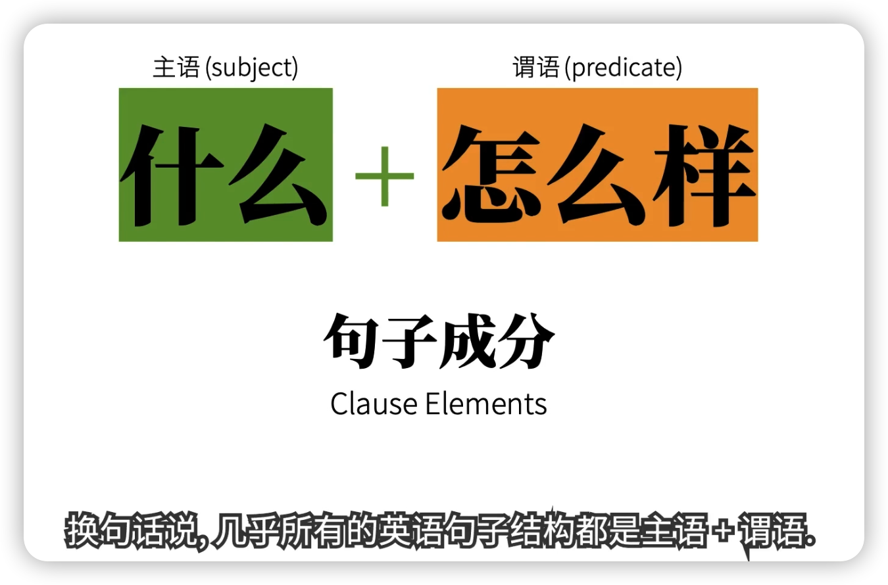

换句话说，几乎所有的英语句子结构都是 **主语 + 谓语**。你也许要说等等，不是 "主谓宾" 吗？别急，这个问题先放一放，你马上就知道怎么回事了. 这里的主语一般是人或物，不管抽象还是具体，这也很好理解。

而接下来的怎么样里面都有一个广义的动作或者发生了什么事儿，注意这个动作并不是我们平时狭义说的要 "动起来" 的 "动作"，而这个广义的动作也就是我们语法上说的 **动词 (verbs)**。

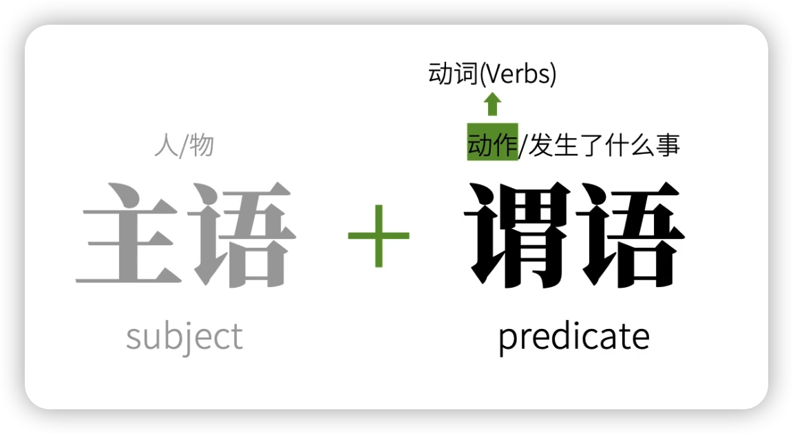

那么，这世上有哪些不同类型的 "动作" 呢？

## ▲ 动作(动词)

### (1) 可以独立完成的动作(/动词)。 结构：主语 + 不及物动词
例如:

> ◆ Papa Rabbit **sleeps**. 兔老爹睡觉.

像 sleep 这样的没有承受者的动词叫 **不及物动词 (intransitive verbs)**。

第一种情况对应的句子结构就是: **主语 + 不及物动词**。

### (2) 有 1 个动作的承受者。 结构：主语 + 单及物动词 + 宾语
例如:

> ◆ Papa Rabbit **likes** you. 兔老爹喜欢你

如果光说兔老爹喜欢你肯定觉得意思不完整，因为像 "喜欢" 这样的动词，没有承受者就没有什么实际意义. 这样的动词属于 **及物动词 (transitive verbs)**. 而这个动作承受者就是 **宾语(object)**。

第二种情况的句子基本结构就是: **主语 + 及物动词 + 宾语**。

讲完下面的 `### (3)` 又对当前第二种情况的句子基本结构做了修改:

好，我们再回头把之前的第二种情况再改进一下，只有一个宾语的及物动词，我们称之为 **单及物动词 (monotransitive verbs)**。所以第二种情况的句子基本结构, 更更精确就是: **主语 + 单及物动词 + 宾语**。

### (3)有 2 个动作承受者。 结构: 主语 + 双及物动词 + 间接宾语 + 直接宾语

例如:

> Papa Rabbit **teaches** you English. 兔老爹教你英语.

这里的核心动词是 teach 教，但是**教授的知识是英语**，而**知识的接受对象是你**。

在语法上，我们把这样的动词的两个承受者分别称为：

- **直接宾语 (direct object)** 和 
- **间接宾语 (indirect object)**。

如果我光说 "兔老爹教英语"，其实语义已经完整了，因为教英语的 "英语" 这里就是直接宾语。而如果我光说兔老爹教你而又没有上下文的话，你肯定觉得还缺了什么？所以你在这里是间接宾语，这样的往往既有直接宾语又有间接宾语的动词，也是及物动词的一种，更具体说它属于 **双及物动词 (ditransitive`/ˌdaɪˈtrænsətɪv/` verbs)**。

而第 3 种情况的句子基本结构就是: **主语 + 双及物动词 + 间接宾语 + 直接宾语**。

### (4) 只有 1 个动作承受者(但需补充)，但又和第二种情况不太一样。 结构：**主语 + 复杂及物动词 + 宾语 + (宾语)补语**
例如:

> ◆ Papa Rabbit considers you smart. 兔老爹认为你聪明.

这里虽然只有一个动作承受者，也就是宾语 "你"，但是如果我光说 "兔老爹认为你" 肯定觉得我话没有说完，可是宾于你后面的聪明，却也不像第 3 种情况那样是另一个动作承受者这样的动词，必须要有个补充承受者的信息才意义完整，而补充的信息我们在语法上称为 **补足语或补语 (compliment)**. 更明确也可以说是 **宾语补语 (object compliment)**. 这样的需要补语的动词，我们称之为 **复杂及物动词 (complex-transitive verbs)**。

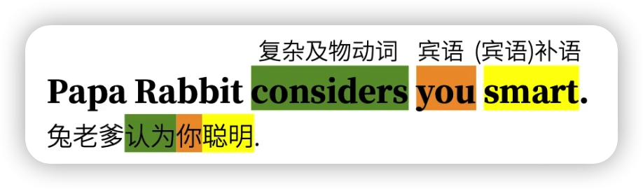

所以第 4 种情况的句子基本结构就是: **主语 + 复杂及物动词 + 宾语 + (宾语)补语**.

### (5) 非 "动作(词)"  结构: 主语 + 系动词 + (主语)补语/表语
最后一种，第 5 种情况里的动词所表达的 "动作" 和咱们狭义上说的 "动作" 不太一样。例如:

> ◆ Papa Rabbit is tall. 兔老爹是高的。

这里的 is 在咱们中文里经常翻译成 "是"，但实际上它的作用很简单，就是把动词之后的信息赋予给前面的主语。

我再重复一遍，因为这个很重要，**is 这样的词为代表的一类词，作用就是把这个字后面的信息赋予给它前面的词**。

Papa Rabbit is tall. 中的 is 说白了就是把 Papa Rabbit 和 tall 连在一起画上等号而已，或者说把后者信息赋予前者.

如果咱们把 tall 换成 in the room (在房间里)，

> ◆ Papa Rabbit is in the room. 兔老爹在房间里。

其实就是把 in the room 这个状态性质赋予给 Papa Rabbit 而已。再看:

> ◆ Papa Rabbit looks tall. 兔老爹看上去高

这个 look 通常意义是 "看"，但是这里到底是谁看啊？其实不是兔老爹在看，兔老爹在这里是被看；这句话的意思是 "兔老爹看上去高"，其实也是把动词后面的 tall 赋予给动词前面的主语 Papa Rabbit 而已，也算是划等号，只不过划等号比之前的 is 多了个 "看上去" 的意义。

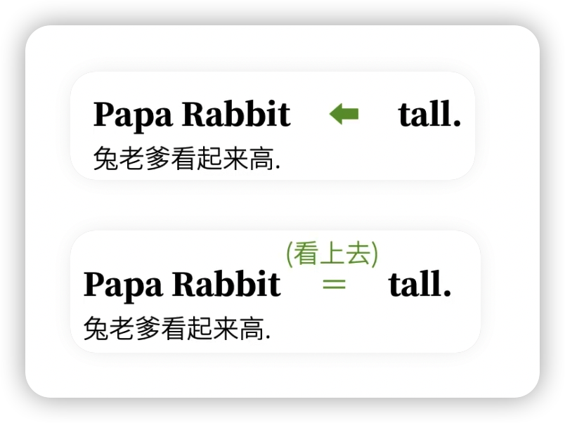

你也可以说:

> ◆ Papa Rabbit smells nice. 兔老爹闻上去香。

其实还是把 Papa Rabbit 和香两者划等号，只不过还有 "闻上去" 这层意思.

像这样的赋予主语某种性质状态的 "划等号" 的动词，我们称之为 **(连)系动词 (linking verbs)**，也就是联系起来就好了。

没错，**联系动词** 也被称为 **系动词**，系动词的 "系" 就是这么来的，联系 linking 而已。

而系动词后面的补充信息也自然是 **补足语 (/补语)**。更精确点，可以说是 **主语补语**。

而 主语补语 在咱们中国英语教学中还有另外一个名字叫 **表语 (predicative)**。
- predicative `/prɪˈdɪkətɪv $ ˈpredəkeɪtɪv/` -adj.谓语性的，作表语的
    + These adjectives`/ˈædʒəktɪv/` are usually used to as the predicative`/predəkeɪtɪv/` in a sentence. 这类形容词通常用在句子中作表语。

所以， 第 5 种也就是最后一种情况的句子基本结构: **主语 + 系动词 + (主语)补语/表语**。

### 谓语动词

你别看我们刚刚只是在说英语的动词，实际上以上的这几种基本的动词所对应的简单句的类型可以说是涵盖了英语所有的句子。那些长长的看起来让人眼花缭乱的，让你做题做到吐血的，往往说到底都只不过是以上这 5 种动词对应的句子类型而已。

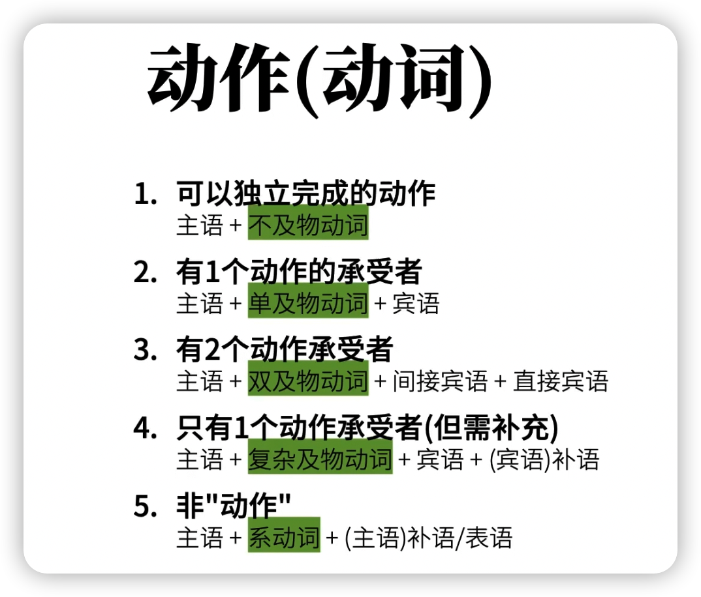

其实你可能之前就听说过所谓英语的 5 种基本句型: 

> ####  5 种基本句型
> ##### 1. 主语+动词
> ##### 2. 主语＋动词+宾语
> ##### 3. 主语＋动词+间接宾语+ 直接宾语
> ##### 4. 主语+动词+宾语＋宾语补语
> ##### 5. 主语+动词+ 主语补语/表语
> 
> 
>
> 注：还有一种 "八大句型" 的分类，即在 "五大句型" 基础上增加：
> ##### 6. "there be" 句型。
> 如：There is a rabbit. 可理解为第五种句型 "主语 + 系动词 + (主语)补语/表语" 的倒装。
> ##### 7. 主语 + 谓语动词 + 状语。
> 如：I live in China. 可理解为第一种句型 "主语 + 谓语动词" 的延伸 (虽然这里的状语很重要)。
> ##### 8. 主语 + 谓语动词 + 宾话 + 状语。
> 如：I put the carrot on the table. 可理解为第四种句型 "主语 + 谓语动词 + 宾语 + 宾语补语" 的延伸。

你说不定还苦恼过，"这怎么背嘛，这么多什么语 + 什么语 + 什么语..." 现在你明白了吧？其实就是在说动词以及动词需要几个对象才能完整表达意思。

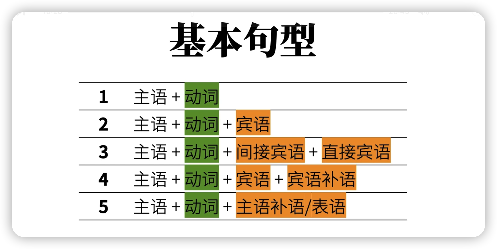

好，咱们先快速做个小结.

英语中的所有句子，当拆到不能再拆后都是在说: **"什么 + 怎么样"**，什么是语法上的**主语**，怎么样是**谓语**；谓语都有一个核心动词，叫做**谓语动词**。

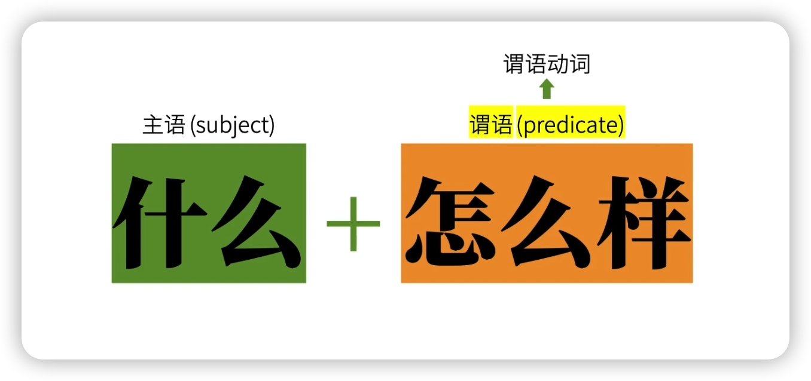

谓语动词有 5 个基本类别：
1. 无需承受者或者说宾语。
2. 有 1 个宾语无需补充信息。
3. 有 2 个宾语，一个直接一个间接。
4. 有 1 个宾语，但是需要补充信息，也就是(宾语)补语。
5. 用来赋予状态性质的 "系动词"，系动词之前是主语，之后是主语补语，又称作表语。

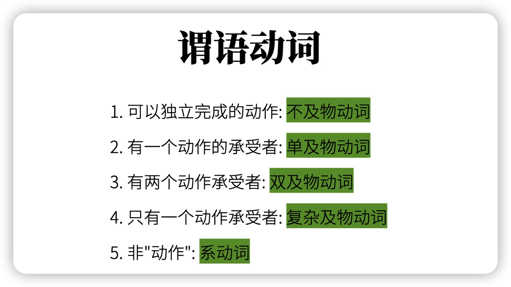

而这 5 种谓语动词便是对应了 5 种基本句型：

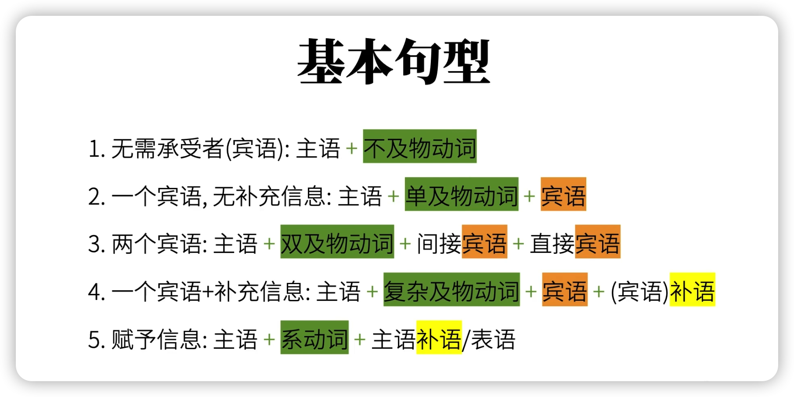

如果你听懂了英语兔我刚才说的，请在公屏上告诉我哦！

刚才咱们不是提到主谓宾吗？其实所谓主谓宾只不过是以上的一个类别，即: 主语 + 谓语动词 + 宾语，也就是所谓的 "主谓宾结构"，而严格说来 谓语 和 谓语动词 是有区别的。

句子主语后面余下的句子部分就是谓语，谓语动词只是谓语的一部分，但是在平时通俗的为了方便，很多人会直接称呼谓语动词为谓语，而把主语、谓语动词、宾语这样的句子结构直接称呼为主语、谓语、宾语。这也不是什么大问题，为什么英语兔我在这里要强调谓语动词这个说法，那是因为等一下咱们还要提到所谓 **非谓语动词** 这个概念。

好，咱们再回到之前说的 **句子成分 (clause elements)**.

## ▲ 句子成分 (clause elements)

句子成分除了刚才讲到的:

### 1. 主语

### 2. 谓语动词

### 3. 宾语

### 4. 宾语补语

### 5. 主语补语

还有可能有以下主要成分。

### 6. 定语 (Attributive): 主要用来修饰主语或宾语。
**attributive `/əˈtrɪbjətɪv/`** -adj.修饰的; 限定的; 定语的 (注意：`j`发`I`的音，`j` 后的`ə`不发音)

例如:

> ◆ **The little white** rabbit ate **a large** carrot. 这只小白兔吃了一根大萝卜。

the little white 就是主语 rabbit 的定语，而 a large 就是宾语 carrot 的定语。

### 7. 状语 (adverbial): 主要用来修饰谓语动词。
**adverbial `/ədˈvɜːbiəl/`** -adj. 副词的，状语的. -n.状语

例如:

> ◆ The rabbit ate **quickly**. 兔子快速的吃.

quickly 就是 eat 的状语.

### 8. 同谓语: 主要用来再把主语或宾语说一遍。

例如:

> ◆ Papa Rabbit, **an English teacher**, eats carrots. 兔老爹，一个英语老师吃胡萝卜。

这里的 an English teacher 其实就是把 Papa Rabbit 用不同方式再说一遍，在这里算是和主语同等地位，而到现在为止，我们便说到了英语句子中所有可能出现的句子成分;

总结一下就是 **主语、谓语动词、宾语、宾语补语、主语补语/表语、定语、状语、同谓语**。

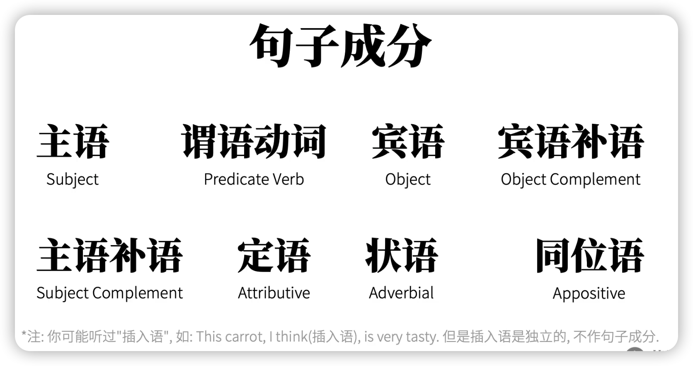

英语兔我要再次强调，咱们直到现在所说的都是所谓**简单句 (Simple Sentences)**，说白了就是没法再拆成更多句子，可是我们说话写文章可不全是简单句一个接一个的说。

咱平时说话写文章，经常会把这些不同的简单句互相组合，形成所谓:
- (1) **compound sentences (复合句/并列句)** 和 
    + compound `/ˈkɒmpaʊnd $ ˈkɑːm-/` -n.(1)化合物; (2)混合体，复合物; (3)复合词
- (2) **complex sentences (复杂句)**

**compound sentences** 说白了其实就是句子简单的叠加是并列关系，直接翻译为复合句，但是有的语法书上的术语是并列句。而

**complex sentences** 说白了就是把一个句子套在另一个句子里，甚至一个句子套的句子还能再套一个句子，一直套下去，此处并不禁止套娃，这是一种从属关系。complex sentences 直接翻译为复杂句。

在这里以一个句子套另一个句子，在英语语法上分别叫做 **主句 (Main Clause)** 和 **从句 (Subordinate Clause)**。
- subordinate `/sə'bɔdɪnet/` --adj.(1)下级的; 从属的; (2)次要的

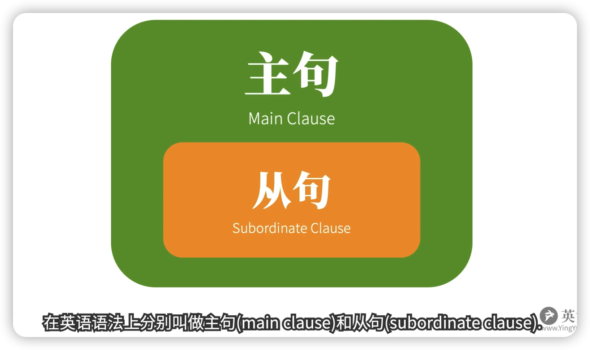

从句说白了就是把简单句修改一下来充当另一个句子的句子成分。

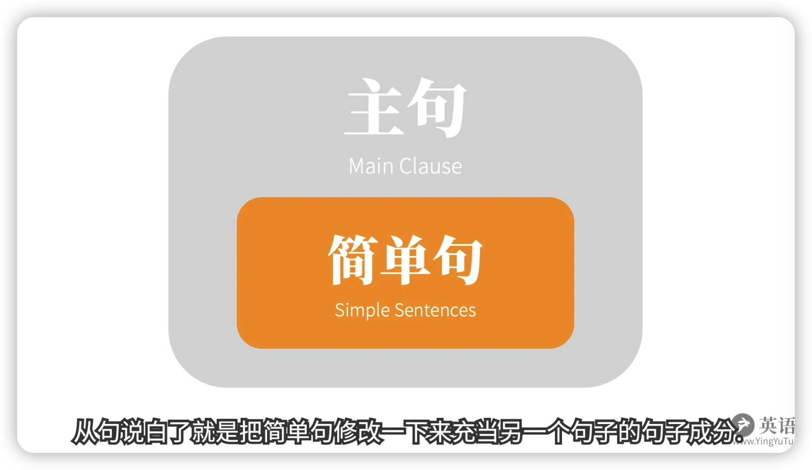

比如我们修改一个简单句，它就可以充当另一个句子的主语 -- 这就是主语从句。

比如我们修改一个简单句，它可以充当另一个句子的宾语 -- 这就是宾语从句。

比如我们修改一个简单句，它又可以充当另一个句子的主语补语 (也就是表语) -- 这就是表语从句。

比如我们修改一个简单句，它就可以充当另一个句子的同位语 -- 这就是同谓语从句。

以上这几种从句都具有名词的性质，所以又合称为名词性从句。

另外，我们修改一个简单从句，它就可以做定语、状语，很显然那些就是定语从句、状语从句。

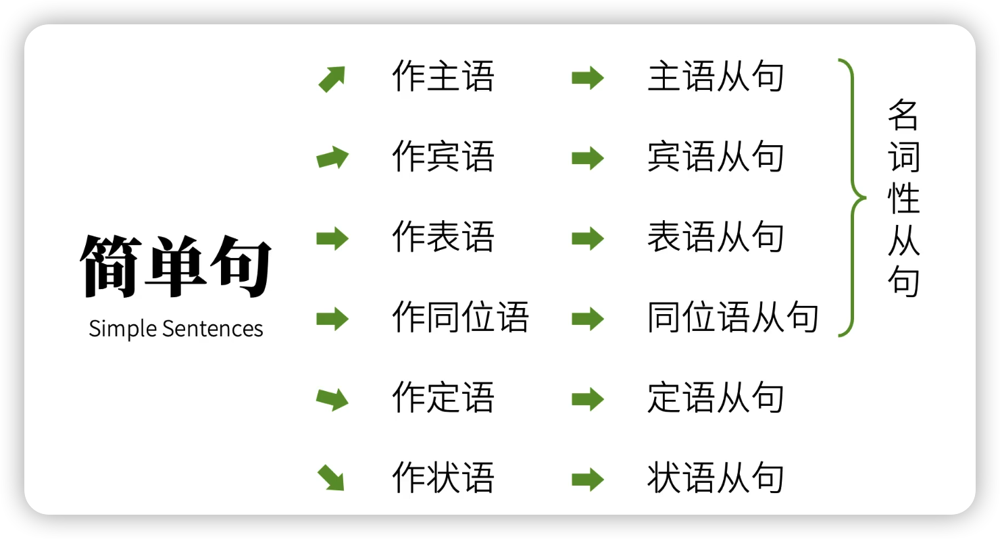

英语这种套娃的从句和咱们中文习惯区别挺大，所以是英语语法难点之一。之后英语兔我会专门做一个视频合集细讲英语从句。

以上说了英语的句子成分和造句，但是现在问题来了，两个句子也许句子组成的方式相同，比如都是：主语 + 谓语动词 + 宾语，可是句中包含的词的类型并不一定相同；比如:
> ◆ The rabbit ate a carrot.

> ◆ he saw something over there.

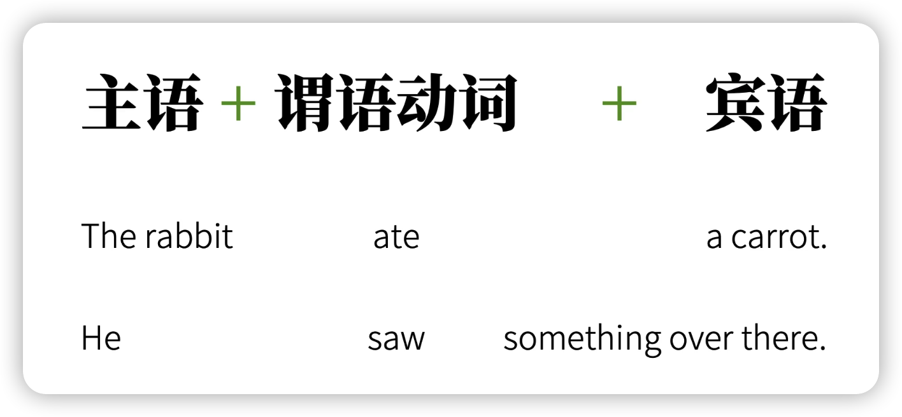

很显然这两句话 "句型" 相同，但是包含的词却不太一样。也就是说，同一类句子成分里可能有不同的词类，这概念其实咱们中文也有。

语法中的 

## ▲  词性 (parts of speech)

包括

### 1. 动词 (verb) `v.`
动词是表示 `动作` 或 `状态` 的词. (详细: 动词是表示 `动作, 行为, 心理活动` 或 `存在, 变化, 消
失`等的词.)

例如:

> **be, do, have, look, know**

> ◆ Papa Rabbit **is** a rabbit.  兔老爹是只兔子

### 2. 名词 (noun) `n`
表示 `人, 事物, 地点` 或 `抽象概念` 的名称. (详细: 名词是词性的一种, 也是实词的一种, 是指 `人, 物, 事, 时(间), 地(点), 情感, 概念` 等实体或抽象事物的词.)**

例如: 

> boy, eye, Jack, China

> ◆ Papa Rabbit is a **rabbit**.  兔老爹是只兔子

### 3. 冠词 (article) `art.`
用在名词之前对名词起限制作用的一种虚词. 用来帮助说明名词所指的人或事物. 

例如:

> **a, an, the**

> ◆ Papa Rabbit is **a** rabbit. 

### 4. 代词 (pronoun) `pron.`
用来代替 `名词`, `形容词` 或 `数词` 的词. (或说为：替代人和物)

例如:

> **I, one, his, which, mine, this**

> ◆ **I** am **a** rabbit. 

### 5. 形容词 (adjective) `adj.`
修饰 `名词` 或 `代词`, 表示人或事物的性质, 状态, 特征的词. 

例如:

> **small, long, short**

> ◆ I am a **smart** rabbit. 我是只聪明的兔子。 

### 6. 数词 (numeral) `num.`
表示 `数量` 或 `顺序` 的词. 

例如:

> **one, ten, twenty, first, second**

> ◆ I ate **two** carrots. 我吃了两根胡萝卜。

### 7. 副词 (adverb) `adv.`
修饰`动词`, `形容词`, `(其他)副词` 或 `整个句子`, 表示动作特征或性状特征 

例如:

> **very, often, hard, usually, quickly**

> ◆ I ate two carrots **quickly**. 我很快地吃了两根胡萝卜。

### 8. 介词 (preposition) `prep.`
用来表示它后面的`名词`, `代词`, `短语` 或 `从句`与其他句子成分的关系. 

例如:

> **from, for, in, on**

> ◆ I ate two carrots **with** chopsticks. 我用筷子吃了两根胡萝卜。

### 9. 感叹词 (interjection) `interj.`
表示说话时的喜悦, 惊讶等各种情感的语气. (或说：表感叹)

例如:

> **oh, hey, dear, my goodness, Dear me, well**

> ◆ **Ah**, the carrot is tasty! 啊，胡萝卜好美味！

### 10. 连词 (conjunction) `conj.`
连词不能独立担任句子成分, 而只起连接 `词与词`,`短语与短语`以及`句子与句子`的作用. (或说：连接词和句)

例如:

> **and, or, but, therefore, or, unless, since, if**

> ◆ I ate two carrots and a potato, **because** I was hungry. 我吃了两根胡萝卜和一个马铃薯，因为我饿了。

以上这些词类便是英语的 10 大词类。

说到这里英语兔我要提醒你，**句子成分 (Clause Elements)** 和 句子中的**词类 (Parts of Speech)** 是完全不同的概念，

 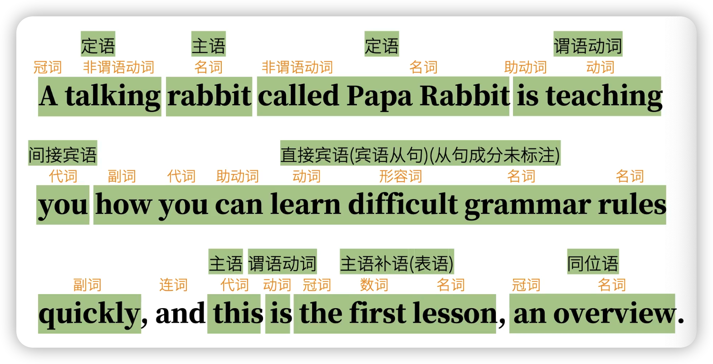

这里面每一种句子成分除了谓语动词是动词，其他都可能包含不同的词类。你也许注意到了，句子成分中最特殊的似乎就是谓语动词这一类。其他句子成分可能是不同词类，但是谓语动词很显然只可能是动词。英语谓语动词有些很厉害的本领，而这些本领咱们中文的动词都没有，所以是英语语法难点之一。

谓语动词有咱们中文动词没有的三大本领

## ▲ 谓语动词的 "三大本领"。

### (1) 表示动作的时间
比如: 动作可能在过去或将来。

### (2) 表示动作的状态，
比如: 动作可能是已经完成的状态或者正在进行的状态。

以上两者合在一起称为 **`时态 (tense)`**。 

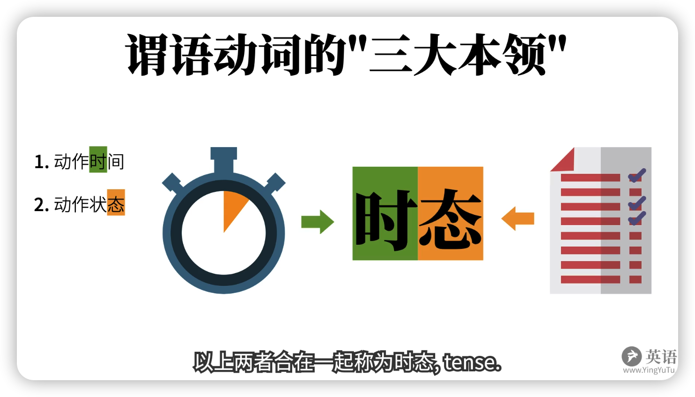

没错，英语的时态是: **时间 + 状态** 合在一起，而并非只有时间。

英语描述动词时间可能有 4 种: 
- 现在;
- 过去;
- 将来;
- 过去将来. (从过去某个时间点 "算将来") 

英语描述动词状态也可能是 4 种:
- 一般; (未说明)
- 完成;
- 进行;
- 完成进行. (不但完成而且继续)

而动词的 4 种时间和 4 种状态自由排列组合，理论上就有 16 种可能的时态。

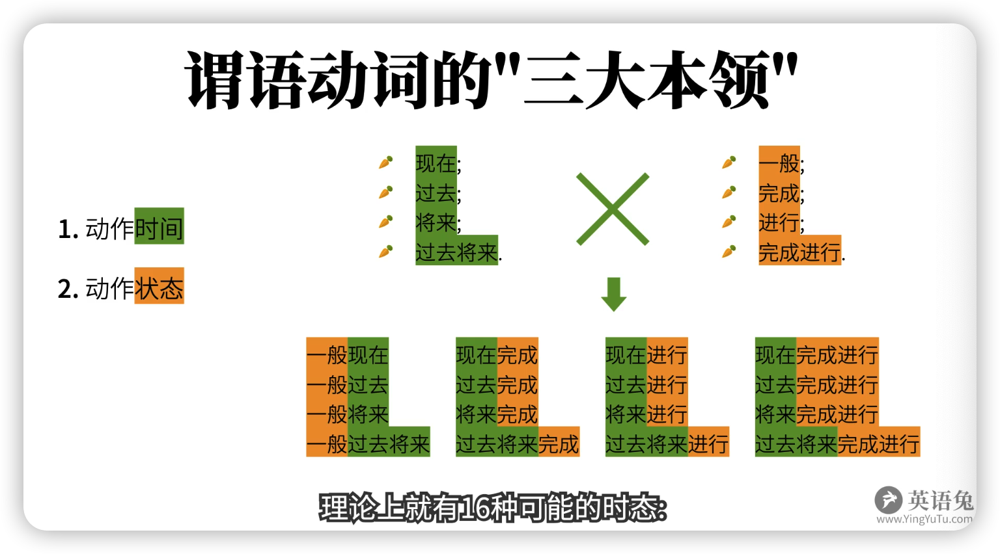

很多同学之所以时态这块很乱，没有搞清楚时态实际上是排列组合，并不是线性的列表，也并非只和时间有关。时态是英语的难点之一，因为咱们中文动词没有这样的特性，英语兔我之后会专门做一个视频细讲英语的时态。

### (3) 表示动作的假设, 情感...

这个叫做动词的 **语气** (和咱平时说话那个 "语气" 不是一个语气，这里是语法的 "语气")，比如:

**虚拟语气**: 用来表示意愿，和事实相反的假设等。在:

> ◆ if I were rabbit... (虚拟语气) 

(如果我是只兔子...) 中 I 后的 were 就暗示了我其实并不是只兔子，中文动词也没有这样的特性，所以也是一大难点。英语兔之后也会专门做一个视频细讲 "动词语气"。

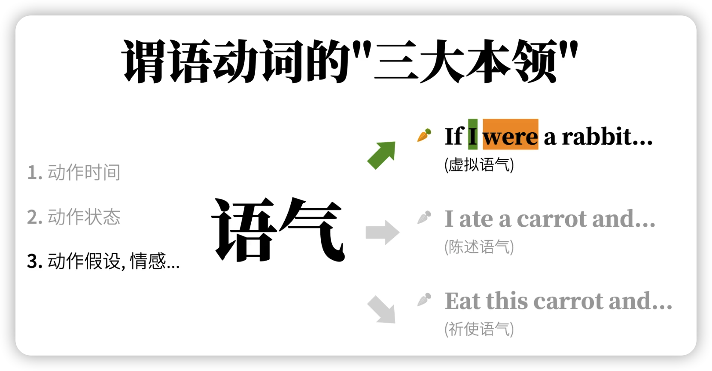

以上三个概念在专业术语中称作 动词(Verb) 的 **Tense**, **Aspect**，**Mood**, 合称 TAM -- 中文往往一作动词的 **时**, **体**, **气**。

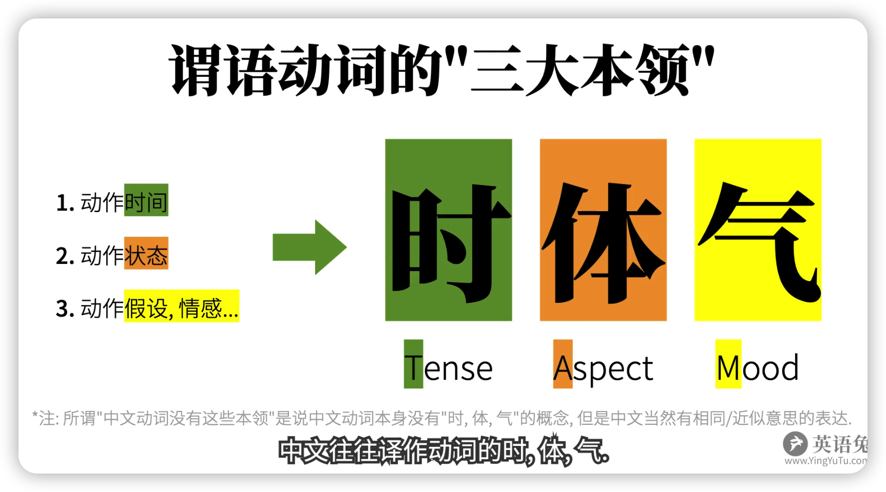

英语兔我在之后的视频会详细讲述谓语动词的几种厉害的本领，但是现在要特别指出一点，那就是，英语的谓语动词本身往往是不能够独立完成刚才说的那些本领，以及另外一些其他的本领，而且谓语动词独自也无法完成，比如表示否定、可能性、必须性等意思。

想让谓语动词充分发挥，我们必须用到另一类经常和动词一起用的词帮助完成任务。他们就是: **助动词 (auxiliary verbs)**

## ▲ 助动词 (auxiliary verbs)

## ▲ 非谓语动词
......如果你以上几句不太明白，不用担心英语托我接下来会专门做一个非谓语动词的视频合集，来细讲这些概念。

## ▲ 概述英语语法体系

像你这样聪明的同学可能已经意识到了咱们怎么说来说去都是在说动词，你这么感觉就对啦。

英语兔我现在就告诉你，英语语法的核心就是动词，动词能够串起几乎所有语法概念，你要是不信英语兔，我现在就用动词来为你高度或者说粗略概括一下整个英语语法体系。

英语的核心是 **动词** 分为:
- **谓语动词** 和
- **非谓语动词**.

谓语动词分为 5 种，分别决定了**简单句**(不能再拆分)的 5 种基本句型，

同时也囊括以下句子成分: **主语、谓语、动词、宾语、宾语、补语、主语、补语也就是表语**；除此之外，句子成分还有**定语、状语、同谓语**。

简单句可以组合成：
- **并列关系的复合句** 以及
- **从属关系的复杂句**。

复杂句包括 **主句** 和 **从句**。从句可以充当所有除谓语动词外的句子成分。

句子成分可以由不同词类充当，分别是 **动词、名词、代词、冠词、形容词、数词、副词、介词、叹词、连词**。

**谓语动词** 可以表达动作的时间、状态、语气等，但是需要用到助动词，助动词还能帮助否定动词、表达动词的被动、可能性、义务性等等。

**非谓语动词** 可以视作改动后的谓语动词，可以充当除谓语动词之外，所有句子成分，取代几乎所有从句简化句子。

概括完毕。

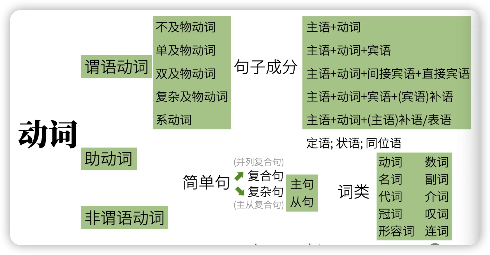

以上就是英语语法体系的主体框架，绝大多数的语法规则都逃不出这个框架，而无数的规则和特例也只不过就是让这个核心体系更加丰富而已。当然请不要误解英语兔，我做这个视频的目的，我做这个视频可不是要告诉你英语语法很简单很规则，就那么几条，更不是告诉你那些厚厚的语法书里全都是废话。

英语兔我做这个视频的目的是尽量简化语法体系，简化到一个能够让你看到清晰脉络的地步。如果你之前脑中没有一个对英语语法完整清晰的认知，那么这里粗线条的核心语法框架至少可以帮助你鸟瞰全局，但是相应的这样的粗线条就会牺牲一些细节的准确性，因为英语语法充斥了大量的所谓特例，一个短短视频当然不可能一应俱全，而英语全套的语法非常复杂，可我还是要说，你别以为学好全套语法才算学好英语，你只要掌握了核心语法，就已经基本够用了，剩下的只是不断积累和改进，请加油。
