# 英语时态，看懂这20张图就够了

> [英语时态，看懂这20张图就够了](https://zhuanlan.zhihu.com/p/141778301)

## 第一章 什么是动词时态？

时态是**一个动作发生的“时间”**和**当时所处的“状态”。**

没错，

所谓 “时”，就是指该动作发生的“时间”；

所谓 “态”，就是指该动作在这个时间点的“状态”。

## **1. 时态中的“时**”

我们一般将英语中的时间分为三个阶段，即过去Past，现在Now和将来Future，举几个例子：

> I **worked** in Shanghai.
> （我过去在上海工作。)
>
> I **work** in Shanghai..
> （我现在在上海工作。)
>
> I **will work** in Shanghai.
> （我将在上海工作。)

不难发现，上述三个示例除了动词形态不同外，它们的其它成分是完全相同的。其中：

worked表示这个动作发生在**过去**；

work表示这个动作发生在**现在**；

will work表示这个动作发生在**将来**。

将前面三个示例中的动作work表示在时间轴中，可得到下图：

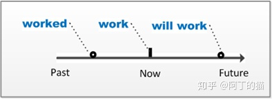

我们只通过改变动词的形态，就轻松地表明了这个动作所发生的时间。

弄清楚了时态中的“时”，接下来我们将一起了解时态中的“态”。

## **2. 时态中的“态”**

时态中的**状态**指的是这个动作在某个时间所处于的状态。我们一般认为每个阶段的时间（过去、现在、将来）分别对应四种状态：**一般式**、**进行式、完成式、进行完成式。**

我们将从下面这个例子开始，一起来讨论“现在”这个时间点的四类状态分别是怎么样的。

> I work in Shanghai.

为清晰的表示出这四类状态的具体形式，接下来我们将使用do来代表动词原形、用did来代表过去式、用done来代表过去分词、用doing来代表现在分词。

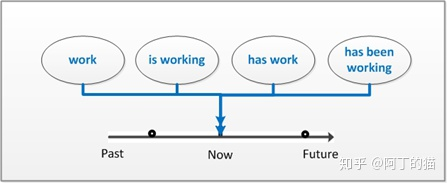

如上图所示，四类状态的第一类为**一般式**（**simple**），它表示的是“经常发生或频繁发生的动作”，其具体动词形式为动词原形do。例如：

> I **work** in Shanghai.
> （我在上海工作。)

上句中使用的就是动词原型work，表示“我在上海工作”是一个常态化的动作，即：我现在上海工作，而且这个状态已经持续比较长的时间了。将这个句子描绘到坐标轴中得到：

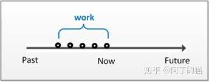

如上图的空心圆点所示，一般式是由很多个经常发生的相同动作汇集而成的一类状态。

四类状态中的第二类为**进行式**（continuous），它表示的是“正在进行的动作”，具体动词形式为“be动词 + doing”。例如：

> I **am working** in Shanghai.
> （我正在上海工作。)

上句动词“am working”使用就是进行式，表示的是：“我在上海工作”是一个正在发生的动作。将其表述到坐标轴中应为：

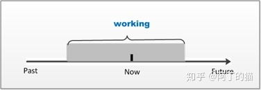

从上图中的灰色矩形可以看出，working这个动作从过去某个时间点就一直持续，而且直到现在还在发生。

四类状态中的第三类为**完成式**（perfect simple），它表示的是“对一个之前已经结束了的动作的总结”，这类状态的具体动词形式为“have/has + done”。

完成式所重视的是该动作所产生的“结果”（即这个动作的完成情况），例如：

> I **have worked** in Shanghai.
> （我在上海工作过。)

上句使用是完成式“have worked”，表示“我在上海工作”是一个已经完成了的动作。将其表述到坐标轴中应为：

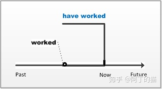

从上图可以看出，worked这个动作在过去某个时间点或时间段发生过了，而且已经结束了。所以，完成式相当于我站在现在这个时间点对上述动作做回顾和总结，得到的结果是：这个动作已经完成了。

四类状态中的最后一类为**完成进行式（**perfect continuous**），**它表示的是“对一个正在发生动作的总结”，具体动词形式为“have/has + been + doing”。

从它的形式上可以看出，它是进行式和完成式的一个组合，这类状态重视的是这个持续动作所产生的“结果”（这个动作的持续时间），例如：

> I have been working in Shanghai for 3 years.
> （我在上海工作一年了。)

上句使用是完成进行式“have been working”，表示“我在上海工作”产生的结果是“时长有三年时间了”。将其表述到坐标轴中应为：

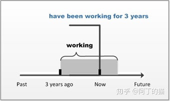

从上图可以看出，working这个动作直到现在还在发生。所以，完成进行式相当于我站在“现在”这个时间点对上述动作做回顾和总结，得到的结果是：这个动作已经持续三年时间了。

## 第二章 动词的十二类时态

如果我们将上述三类时间（过去、现在、将来）和四类状态（一般式、进行式、完成式、现在完成式）组合，便会得到如下表所示的十二类时态。

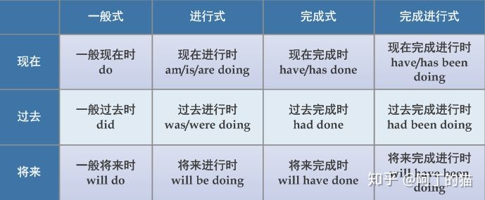

那么，我们就一起来学习这十二类时态的用法吧，学习的顺序为：一般式、进行式、完成式、完成进行式。

## **一般式**表示的是“经常发生或频繁发生的动作”。

这类状态与现在、过去、将来这三个时间点分别结合而成三类时态，即：**一般现在时（present simple）**、**一般过去时（past simple）**、**一般将来时（future simple）**。

## **1.** **一般现在时（动词的形式为：do）**

一般现在时的两个主要功能是：表示**事实或习惯**。例如：

> Light travels more quickly than sound.
> （光传播的速度比声音快。）
>
> His father is a businessman.
> （他的父亲是一位商人。）

“光传播的速度比声音快”是一个放之四海而皆准的客观事实，而他父亲的职业也是一个确定的事实，所以我们在上面两个例子中使用一般现在时（动词原形travel和is）表示的这两个“事实”。

> She often drinks coffee.
> （她常喝咖啡。）
>
> I get up at six every morning.
> （我每天早晨六点钟起床。）

而上面例子表述的是“她喝咖啡”和“我早上起床”的两个个人习惯，所以谓语使用动词原形drink和get。

如果我们将“She often drinks coffee”绘制到时间轴中，则可以得到：

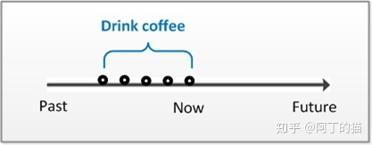

因为一般现在时表示的就是某个经常发生的动作，所以在图中体现出的就是很多个表示“drink coffee”这个动作的**“空心圆点”**在坐标轴上的顺序排列。

## **2.** **一般过去时（动词的形式为：did）**

一般过去时用来表示**某个过去时间点发生的动作**，而且这个动作是在过去就已经结束了。例如：

> I watched the movie last week. ①
> （我上周看过这个电影。）

上句的谓语watched表示的是动词watch的过去式。如果我们同样用**“空心圆点”**来表示这个过去时间点，将句①绘制到时间轴中可得：

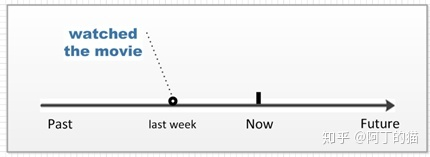

由上图可以看出，“watched the movie”这个动作是发生在过去（Past）的一个时间点，而且这个动作在过去就已经结束了。

更多一般过去时的例子如下所示，其中的was和received表示的是相应动词的过去式。

> He was born in Beijing.
> （他出生于北京。）
>
> Simon received a medal for his heroism.
> （Simon因他的英勇获得了一枚奖章 。）

## **3.** **一般将来时（动词的形式为：will do）**

一般将来时用来表示**某个将来时间点会发生的动作**。例如：

> Phoebe will live in a modern city. ②
> （Phoebe将在大城市生活。）

上句的谓语live表示的是动词原型。我们同样用**“空心圆点”**来表示这个将来的时间点，并将句②绘制到时间轴中，可得到：

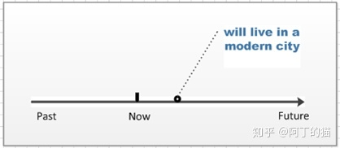

由上图可以看出，“live in a modern city”这个动作发生在将来（Future）的某一个时间点。

更多一般将来时的例子如下所示，其中的take和check是动词原型。

> The bellboy will take your luggage to your room.
> （服务生会将行李送到你的房间。）
>
> I will check up the figure tomorrow.
> （明天我将核对这个数字。）

## **进行式**表示的是“正在进行的动作”。

这类状态与现在、过去、将来这三个时间点分别结合而成三类时态，即：**现在进行时（present continuous）、过去进行时（past continuous）和将来进行时（future continuous）**。

## **4.** **现在进行时（动词的形式为：am/is/are doing）**

现在进行时用来表示**现在正在进行的动作**。

> I am playing tennis right now. ③
> （我正在打网球。）

上句的谓语playing表示的是动词play的现在分词形式。由于“正在进行的动作”必定会延续一段时间，所以我们用**“灰色矩形”**来表示进行时，将句③绘制到时间轴中可得到：

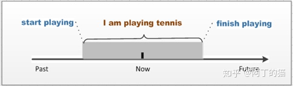

由上图所示，灰色矩形“playing tennis”从某个过去的时间点开始一直延续到了现在（now），所以我们说“I am playing tennis right now”。

更多现在进行时的例子如下所示，其中的listening和making均为现在分词。

> They are listening to the lecturer.
> （他们正在听那位学者讲话。）
>
> A group of students are making model planes.
> （一组学生正在做模型飞机。）

在这十二类时态中，有些时态是英语学习者非常容易混淆的。所以，本文在讲解时态的同时，也会配套一个小专题来比较该类时态与其它相似时态在用法上的区别，目的是回顾前文中学习过的知识，并通过比较的方式来加深各位读者对该类时态的认知和理解。

在本小节中，我们要一起辨析的是一般现在时和现在进行时在用法上的区别。

## **Ø** **时态专题1：一般现在时（do）与现在进行时（am/is/are doing）**

我们一起学过，一般现在时是用来表示“事实或习惯”，例如：

> Yolanda comes from Singapore.
> （Yolanda来自新加坡。)

因为一个人出生时就拥有了国籍，而Yolanda生来就是新加坡人，这是一个客观事实，所以动词使用的是一般现在时。

再比如：

> Tom eats a lot.
> （Tom吃的很多。）

因为Tom每顿都吃很多，这是他每顿饭的一个习惯动作，所以这句话使用的也是一般现在时。

而现在进行时用来表示“现在正在发生的动作，且这个动作持续时间较为短暂”。

如果我们将上面两句话改为现在进行时的话，它们的含义会有什么变化呢？如下例所示：

> Yolanda is coming from Singapore.
> （Yolanda正从新加坡回来。)

句子的意义变为强调Yolanda从新加坡回来的这个短暂的动作。那她是不是就是新加坡人呢？这句话里已经找不到任何线索。

> Tom is eating a lot.
> （Tom正在吃很多东西。）

这句话也变为表述Tom正在吃很多东西的这个动作。那他是不是每顿都吃这么多呢？不知道。

可以这样说，我们在描述一个长期固定的动作的时候，会使用一般现在时。而在描述一个短期且正在发生动作的时候，会使用现在进行时。

这里做一个小测试，请各位读者判断下面句子中时态的用法是否正确：

> John is playing football.
> （John会踢球。）
>
> The price of chicken goes up this month.
> （这个月鸡肉的价格在上涨。）
>
> I am driving fast.
> （我开车很快。）
>
> Watch out! A lorry comes.
> （小心！一辆卡车过来了。）

答案是：上面的四个句子都是错误的。

第一个句子意图讲述的是一个客观事实，即John现在会踢球，以后也会踢球，所以这句话应使用一般现在时：

> John plays football.

第二个句子中有一个时间状语this month，可以知道这句话表述的是一个最近发生的短期动作，所以时态应该使用现在进行时：

> The price of chicken is going up this month.

第三个句子表述的是我开车的一个习惯，只要我坐到了驾驶位就会把车开得很快，所以时态应该使用一般现在时：

> I drive fast.

第四个句子表述的是临时的一个紧急状况，所以时态应该使用现在进行时：

> Watch out! A lorry is coming.

## **5.** **过去进行时（动词的形式为：was/were doing）**

过去进行时用来表示**某个过去时间点正在进行的动作**。

> They were watching TV when a stranger suddenly rushed in. ④
> （当一个陌生人突然冲进来的时候，他们正在看电视。）

一般来说，我们会在同一个句子中明确的表示出这个过去的时间点，比如上句中的“when a stranger suddenly rushed in”。如果我们同样用**“灰色矩形”**来表示此时态，并将句④绘制到时间轴中可得到：

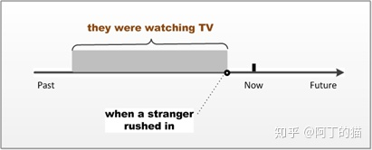

由上图所示，空心圆点表示“when a stranger suddenly rushed in”这个过去时间点，其正处于灰色矩形“they were watching TV”的右边边界上，表示的是这个突然出现的情况打断了他们原来持续进行的动作。也就是说，从这个时间点开始他们停止了看电视。

更多过去进行时的例子如下所示，其中的playing和talking是现在分词，过去的时间点则是分别由“when the doorbell rang”和“hours ago”明确表示了出来。

> Emily was playing the piano when the doorbell rang.
> （当门铃响的时候，Emily正在弹钢琴。）
>
> He was talking about his brother hours ago.
> （几小时前，他正在谈论他哥哥。 ）

## **6.** **将来进行时（动词的形式为：will be doing）**

将来进行时用来表示**在某个将来时间点正在进行的动作**，这类动作一般是事先计划好，而且一定会发生的。

> We will be flying at 30 000 feet in five minutes. ⑤
> （五分钟后，我们就会翱翔在三万英尺的高空了。）

与过去将来时相似，我们一般也会在同一个句子中明确表示出这个将来的时间点，比如上句中的“in five minutes”。我们用**“灰色矩形”**来表示此时态，将句⑤绘制到时间轴中，可以得到：

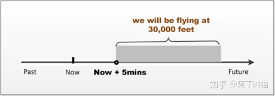

由上图所示，我们用空心圆点表示“in five minutes”这个将来时间点，其正好位于灰色矩形“We will be flying at 30 000 feet”的左边框上，表示的是：从这个时刻开始，他们就开始翱翔在三万英尺的高空了。

更多将来进行时的例子如下所示，其中的lying和doing是现在分词，将来的时间点则是分别由“by this time tomorrow”和“during the weekend”明确表示出来。

> By this time tomorrow, I will be lying on the beach.
> （明天的这个时候，我就会躺在沙滩上了。）
>
> Tom will be doing my homework during the weekend.
> （周末期间Tom一定是在做作业。 ）

## 完成式表示的是“站在某一时间点，对这个时间点之前发生的动作作总结”。

这类状态与现在、过去、将来这三个时间点分别结合而成三类时态，即：**现在完成时（present perfect）、过去完成时（past perfect）、将来完成时（future perfect）**。

## **7.** **现在完成时（动词的形式为：have / has done）**

现在完成时用来表示**处于现在（now）这个时间点，对这个时间点之前发生的一个或一系列动作的总结**。例如：

> I have watched the movie three times. ⑥
> （我看过三遍这个电影。）

上句中的watched为动词watch的过去分词形式。因为完成式是对之前发生事情的一个总结，所以我们用**“向左的方括号”**来表示完成式。将句⑥绘制到时间轴中可得：

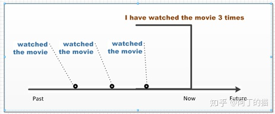

由上图所示，由于“watched the movie”这个动作在过去发生了三次，如果我们处于现在（now）这个时间点来总结这三次动作，即会得到“I have watched the movie three times”的结论。

另外，我们一般用现在完成时来表示一个过去动作所产生的“结果”，而忽略这个动作发生的时间，例如下例中的“has had”和“have finished”：

> Nina has had a wonderful meal.
> （Nina已经美餐一顿了。）
>
> I have finished my homework already.
> （我已经完成了作业了。）

上面两个示例表示的就是动作的结果，即“Nina已经美餐一顿了”和“我已经完成了作业了”。至于Nina吃饭的时间或是我作业完成的时间，这些信息并不十分重要，所以就被忽略掉了。

因为现在完成时和一般过去时表示的都是过去发生的动作，所以很多同学总是不确定到底什么时候该使用现在完成时，而什么时候该使用一般过去时。

因此，本章的第二个专题讨论的就是这两类时态在用法上的区别。

## **Ø** **时态专题2：一般过去时（did）与现在完成时（have/has done）**

一般过去时用来表示的是“**某个过去发生的动作，且现在这个动作已经结束了。**”例如：

> Shelly lived in Japan.
> （Shelly曾住在日本。）
>
> I was a doctor.
> （我曾是一名医生。）

上面两个例子中的动词均为一般过去时，表示的就是这些动作是在过去发生的，即：现在Shelly已经不住在日本了，而我也不再是一名医生了。

而现在完成时用来表示的是“**对一个过去发生动作作总结，而且这个过去发生动作（或是这个动作的影响）一直延续到了现在**”，例如：

> Shelly has lived in Japan for 2 years.
> （Shelly住在日本两年了。）
>
> I have been a doctor since 2010.
> （我从2010年就是一名医生了。）

上面两个例子中的动词为现在完成时，表示的就是这些动作从某个过去时间点一直延续到了现在，即：Shelly现在还住在日本，而我也还是一名医生。

请各位读者快速判断下句应该使用lost还是have lost：

> I lost/have lost my wallet a week ago.
> （一星期前，我搞丢了钱包。）

我们从句中的a week ago就能知道这句话描述的是一个过去的动作，所以应该选择一般过去时lost，即：

> I lost my wallet a week ago.

假如直至现在（now）这个时间点我还是没有找到钱包，也就是说虽然“丢钱包”这个动作到现在仍有影响，此时我们就可以用完成时来总结，如下所示：

> I have lost my wallet. （√）
> （我已经把钱包搞丢了。）

但如果我昨天已经在沙发底下找到了这个钱包，这时“丢钱包”这件动作对现在已经没有影响，我们就不能再用完成式来总结这个动作了，所以下句是错误的：

> I have lost my wallet. （×）

另外，如果我们重视的是一个动作的结果，则应该一般使用现在完成时；而如果我们重视的是这个动作发生的时间，则应该使用一般过去时，例如：

> My sister has finished her homework.
> （我妹妹已经写完了作业。）
>
> My sister finished her homework an hour ago.
> （我妹妹一小时前写完了作业。）

比如妈妈只是想知道妹妹有没有完成了作业，也就是只关注该动作是否完成，这时我就应该用第一句话（现在完成时）来回答妈妈的提问；而如果妈妈想了解的是妹妹的作业做了多长时间，也就是动作发生的时间，这时我就应该回答第二句话（一般过去时）。

## **8.** **过去完成时（动词的形式为：had done）**

过去完成时用来表示**站在某个过去的时间点，对这个时间点之前发生的一个或一系列动作的总结**。

> When they reached there, the ship had set off. ⑦
> （当他们到达那里的时候，船已经开了。）

如果一个句子中有两个发生在过去的动作，我们会将发生比较靠前的动作时态改为过去完成时，来表明两个动作的先后顺序，如句⑦表示的是“the ship set off”这个动作发生在“they reached there”之前。

所以，我们也称过去完成时为“**过去的过去**”。

我们同样用**“向左的方括号”**表示该时态，将句⑦绘制到时间轴中可得：

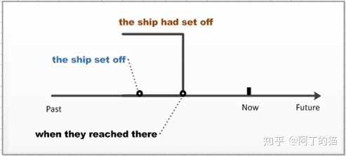

由上图所示，该句相当于站在“they reached there”这个过去的时间点，对这个时间点之前发生的动作“the ship set off”做一个总结，便得到了“the ship had set off”的结论。

更多过去完成时的例子如下所示，其中的begun和lived为过去分词：

> The movie had begun when we got to the cinema.
> （当我们到达电影院时，电影已经开始了。）
>
> Mr. Harrison had lived in the Mediterranean for many years before he returned to England.
> （在Harrison返回英国之前，他已经在地中海生活了很多年了。）

## **Ø** **时态专题3：一般过去时（did）与过去完成时（had done）**

在一句话中，有时会存在两个发生在过去的动作，比如下句中的“I arrived home”和“Tom left”：

> When I arrived home, Tom left.
> （当我到家时，Tom离开了。)

我们将上句绘制在时间轴上可以得到：

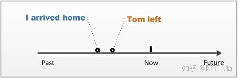

从图中可以看出，上句两个动作发生顺序是：“I arrived home”这发生在“Tom left”之前。

此时，如果我想将上面两个动作的顺序调换，即“Tom left”发生在“I arrived home”之前，要做怎样改写呢？

这里就需要隆重推出过去完成时了。

因为一般过去时表示的是“**过去发生的动作**”，而过去完成时表示的是“**过去发生动作之前所发生的动作**”，即“**过去的过去**”。所以我们可以将上句改写为：

> When I arrived home, Tom had left.
> （当我到家的时候，Tom已经离开了。)

我们再将上句绘制在时间轴上，可以得到：

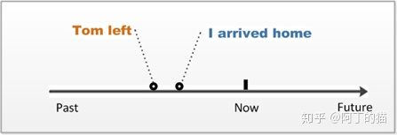

可以发现，动作发生顺序变成了“Tom left”在“I arrived home”之前了。

总而言之，如果要明确表示两个过去动作发生的先后顺序，我们会用一般过去时来表述较先发生的动作，而用过去完成时来表述较后发生的动作。

同样的道理，我们也可以用过去完成时来表示“某个过去的动作发生在一个过去时间点之前”，比如：

> The library had been opened at 8 this morning.
> （图书馆在早上八点前就开门了。)

上句就明确表示出“the library was opened”发生在今天早上8点之前，将其绘制到时间轴中可以得到：

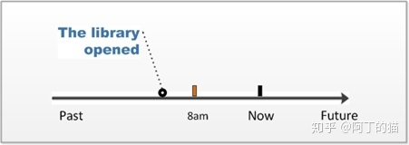

## **9.** **将来完成时（动词的形式为：will have done）**

将来完成时用来表示**站在某个将来的时间点，对这个时间点之前的一个或一系列动作的总结**。

> By July, Michael will have got two college degrees. ⑧
> （到七月份，Michael就已经拿到两个大学学位了。）

在使用将来完成时的时候，我们一般会将这个将来的时间点明确表示出来，如句⑧中的“by July”。如果将句⑧绘制到时间轴中，则可以得到：

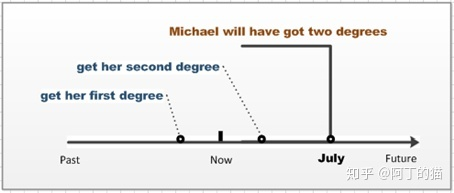

我们站在现在（now）这个时间点来看，或许Michael已经拿到了两个学位、或许拿到了一个学位、也或许她还一个学位都没有拿到，其实都不重要。重要的是将来完成时所总结的结果：“到七月份，Michael就已经拿到两个大学学位了”

更多将来完成时的例子如下所示，其中的taught和learned为过去分词，两个将来的时间点则分别由“by the end of this year”和“before she moves to China”点明：

> By the end of this year, I will have taught English for 15 years.
> （到今年年底，我教英语就满十五年了。）
>
> She will have learned Chinese before she moves to China.
> （在她搬到中国前，她就会学会中文了。）

## 完成进行式是完成式与进行式的结合，表示的是“对一个正在进行动作的总结”。这类状态总结的内容就是这个动作已经发生的时间，一般与for和since连用。

这类状态与现在、过去、将来这三个时间点分别结合而成三类状态，即：**现在完成进行时（present perfect continuous）、过去完成进行时（past perfect continuous）、将来完成进行时（future perfect continuous）**。

## **10.** **现在完成进行时（动词的形式为：have / has been doing）**

现在完成进行时用来表示**对一个现在正在进行动作的总结**。

> Tom has been playing football for two hours. ⑨
> （Tom已经踢了两个小时的足球了。）

如句⑥所示，我们用现在完成进行时来总结一个正在进行的动作“playing football”，最后得到了这个动作已经持续了“two hours”的结论。

如果用**“灰色矩形**”来表示进行时，而用**“向左的方括号”**来表示完成时，将句⑨绘制到时间轴中可得到：

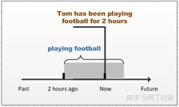

如上图所示，相当于我们站在现在（now）这个时间点，对当时正在进行的动作“playing football”展开总结，于是得到了“Tom has been playing football for two hours”的结论。

更多现在完成进行时的例子如下所示：

> Simon have been working on the project for several years.
> (Simon已经做了好几年这方面的工作了。)
>
> I have been waiting for this day since I was a boy.
> (从我还是一个小男孩开始，我就一直在等待这一天了。)

## **11.** **过去完成进行时（动词的形式为：had been doing）**

过去完成进行时用来表示**站在某个过去的时间点，对这个时间点正在进行动作的总结**。

> I had been cleaning my room the whole morning when she came.⑩
> （当他来的时候，我已经打扫了一早上的房间了。)

上句中的“when she came”点明了这个过去的时间点。我们将句⑩绘制到时间轴中可以得到：

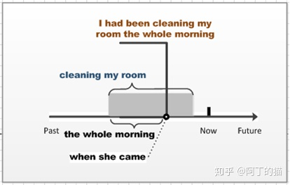

如上图所示，相当于我们站在“when she came”这个过去的时间点，并对这个时间点正在进行的动作“cleaning my room”作一个总结，于是就得到了“I had been cleaning my room the whole morning”的结论。

更多过去完成进行时的例子如下所示，其中的“by the time we arrived at the tennis hall”和“when allowed to enter the room”分别点明了两句话中过去的时间点：

> The players had been playing for 20 minutes by the time we arrived at the tennis hall.
> (当我们到达网球馆时，球员们已经打了20分钟的球了。)
>
> We had been waiting for two hours outside when allowed to enter the room.
> (当我们获准进入那个房间的时候，已经在外面等了整整两小时了。)

## **12.** **将来完成进行时（动词的形式为：will have been doing）**

将来完成进行时用来表示**站在某个将来的时间点，对这个时间点正在进行动作的总结**。

> I will have been doing the drawing for 5 hours at 11 pm. ⑪
> （到晚上11点，我就连续画图五个小时了。）

上句中的“at 11 pm”点明了这个将来时间点，我们将句⑪绘制到时间轴中可以得到：

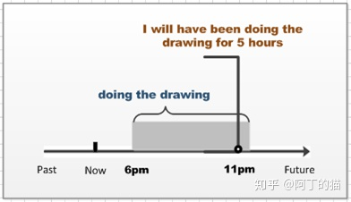

如上图所示，相当于我们站在一个将来的时间点11 pm，对这个时间点正在进行的动作“doing the drawing”作一个总结，于是就得到了“I will have been doing the drawing for five hour”的结论。

更多将来完成进行时的例子如下所示，其中的“by this summer”和“by September”分别点明了两句话中将来的时间点：

> By this summer, he will have been training horses for 10 years.
> （到这个夏天，他训练马匹就有10年了。）
>
> By September the play will have been running for three months.
> （到九月份，这出戏就连演三个月了。）

至此，所有时态就都介绍完了，希望上述内容能对大家有所帮助。

最后想说的是：写文章不易，画图也不易，求点个赞~~

获取更多英语学习的干货，请关注公众号「阿丁的英语课堂」，一起来变身英语达人吧。

编辑于 2022-04-25 08:58