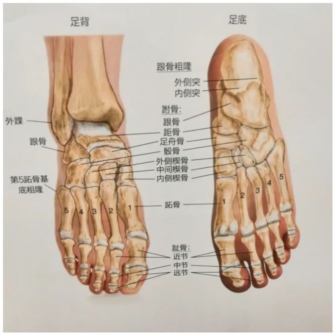

不积跬步，无以至千里

脚既要支撑身体的重量

又要负责人体的跑、跳和步行

重压之下必定会有损伤

足底筋膜炎 就是比较常见的足跟痛原因

那**足前侧疼痛的常见原因是什么呢？**

今天我们就一起来揭晓：

跖痛症的秘密

[图片来源：基础临床按摩疗法：解剖学与治疗学的结合（ 第3版）](vscode-webview-resource://b843c931-c661-44a6-ab85-4fc2d9eec0a0/file///h%3A/%23 Github-clone/English-Notes/趾痛症.md)

“跖（zhi）”，脚面上接近脚趾的部分，跖痛症就是跖骨头附近的不适感或疼痛感，疼痛为渐进性疼痛，尤其是足趾离地阶段。需要注意的是跖痛症不是一种疾病，而是一个症状。

### **什么疾病会导致跖痛症呢？**

导致跖痛症的疾病很多，踇外翻、踇强直、风湿性关节炎、痛风、跗管综合征、跖筋膜炎、局部应力性骨折等都会直接或间接导致跖痛症。但是在日常生活中常见的原因主要有以下这几种：

### 1. 重压或挤压

主要体现在两方面：

（1） 身体超重或长时间从事需负重的工作，给足底带来巨大的压力，相应的跖骨附近压力也会增大，长此以往造成劳损，引发跖痛症。

（2） 鞋子不合适，鞋子太小或鞋子前方过窄会造成跖骨挤压，同样也会带来跖痛症。

### 2. 负重失衡

我们人体在站立的时候，100%的体重通过距骨承担，然后50%的重量会向后传到足跟，50%传向前方。在前方，第一跖趾关节分担了25%的重量，外侧的4个脚趾又分担了另外的25%。但是当足部的生物力学改变，负重失衡，身体的重量过多的落在跖骨头上，就会刺激跖趾关节，导致跖痛症。

这里面又分为这样几种情况：
1. 高足弓或第二脚趾比第一脚趾长，导致第2、3跖骨头压力增加，引发跖痛症；
2. 低足弓或足趾内在屈肌无力使足弓变平，导致身体重量不是通过足弓来分散承重，而是集中在跖骨头，重压之下引发跖痛症。
3. 穿上高跟鞋后随着足跟的被动抬高，负重由内侧纵弓向前足转移，使第1、2跖趾关节应力增加，并且足跟抬高，足纵弓缓冲振动功能减小，会加剧跖骨疲劳，引发跖痛症。
4. 踝关节僵硬，跖屈受限，跖趾关节代偿工作 ，增加跖骨压力，引发跖痛症。
5. 足内旋、跟腱紧张也会造成足部生物力学改变，负重失衡，带来跖痛症。

### 3. 年龄

随着年龄的增长保护足底部的脂肪垫会变薄，足部缓冲能力减弱，相应的地面反作用于足前部的冲击力也会加大。这也是跖痛症好发于30-50岁的原因之一。

### 4. 过度使用

跖趾关节负责屈曲、伸展、内收和外展4种运动，人体的跑、跳、步行都离不开它。因此高强度的运动或运动过度都会造成跖趾关节的过度使用，引发跖痛症。

### **跖痛症应该如何应对呢？**

由于产生跖痛症的疾病有很多，所以找准病因很重要。如果是跖骨头、跖侧软组织受压，肌力失衡造成的跖痛症，可以这样应对:

#### **急性期**: 急性期要注意休息，缓解跖骨头过分负重。需要时还可以通过口服非类固醇止痛消炎药减轻疼痛。

#### 慢性期

##### 物理因子治疗

超短波透热、特定电磁波、低频电热电按摩、热振磁等物理因子治疗方法可以改善局部血液循环，促进新陈代谢，降低肌张力，缓解肌痉挛，从而起到镇痛消炎的作用。

##### 矫形鞋垫

矫形鞋垫能够从生物力学角度发散转移跖骨的异常受力，重建前足的负重点，调节失衡的肌力。对于症状较轻，还没有形成明显痛性胼胝或骨的继发畸形轻微者可选择矫形鞋垫治疗。

##### 自主功能训练

1. 趾尖放松
    + 动作要领：双脚分别做“石头”、“剪刀”、“布”的动作，每个动作保持5s。
2. 足趾下压训练
    + 动作要领：前脚趾按压网球，保持20s后放松。
3. 足跟下压训练
    + 动作要领：取站立位，将网球放置足底，用力将网球压扁。
4. 踝关节背伸跖屈训练
    + 动作要领：仰卧位，双下肢伸直，做足踝部的背伸跖屈，持续30s，然后放松，重复10次左右。
5. 小腿前侧放松
    + 动作要领：跪姿，双手撑地，将一侧小腿前侧放在泡沫轴上，滚动小腿前侧肌肉30秒，可将小腿稍微旋内，这样可以避免滚压到骨头表面，引起不适。
6. 小腿后侧放松
    + 动作要领：坐姿，双手将身体稍撑起，将要放松的小腿放在泡沫轴上，从跟腱到膝盖处滚动，滚动30秒，换另一侧。

##### 生活习惯调整
1. 着合适的鞋子，尽量少穿高跟鞋或尖头鞋。
2. 避免久行或久站。
3. 养成热水泡脚的习惯，每天放松一下足部。
4. 注意运动强度，避免运动过度。

【本文参考文献】

冯国平,张诚,姜剑魁,盖茂杨,焦伟.跖痛症的病因及治疗[J].风湿病与关节炎,2014,3(9):49

雷英,石捷,黄龙模,王少芸, 陈启波,周巧玲.电脑中频与温热疗法运动训练综合治疗跖痛症[J].中国康复理论与实践,2003,9(11):694

武勇,范向阳,曹磊,刘晓,李莹,龚晓峰,孙宁.生物力学矫形鞋垫治疗跖痛症的疗效[J].2019,6(3):7-8

托马斯·亨德里克森;张志杰,刘春龙,王学强主译.骨科疾病:评估与手法治疗[M].北京科学技术出版社:北京,2019:255,266

编辑：申卫红

