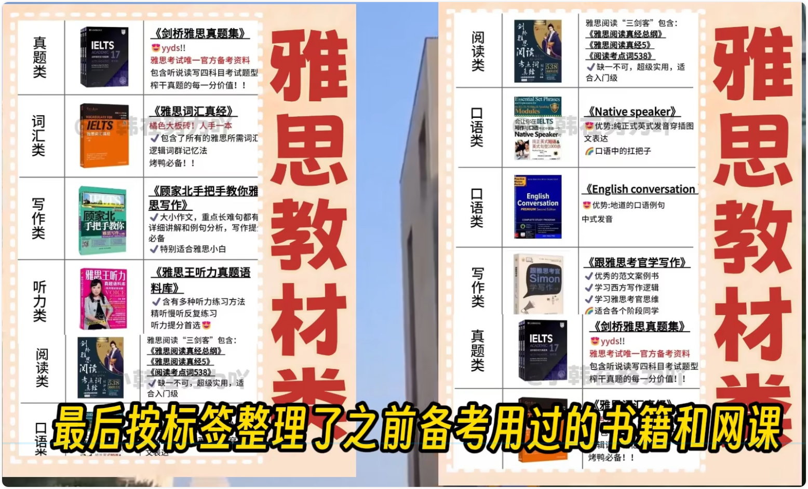
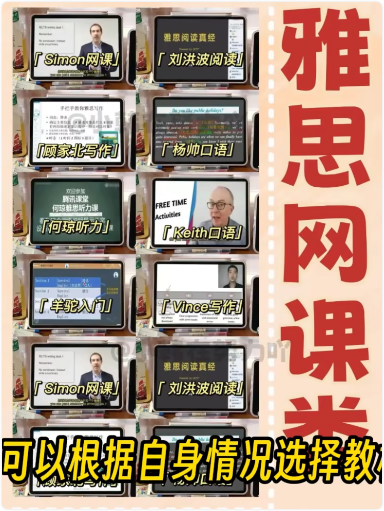
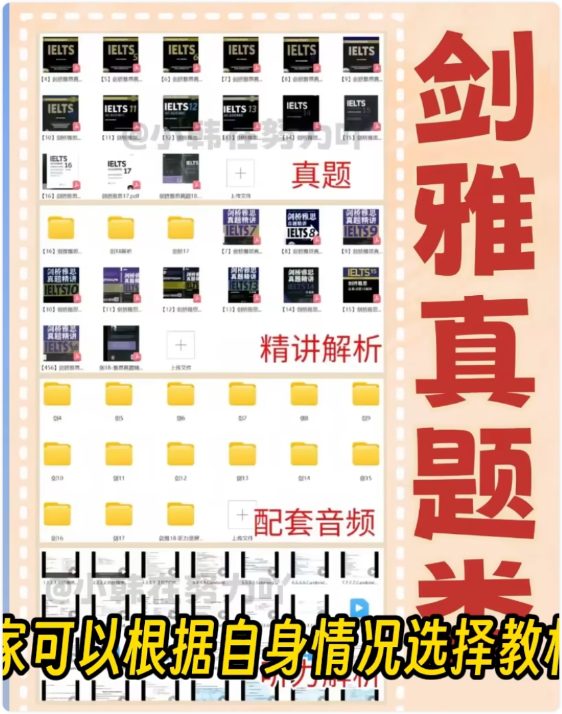
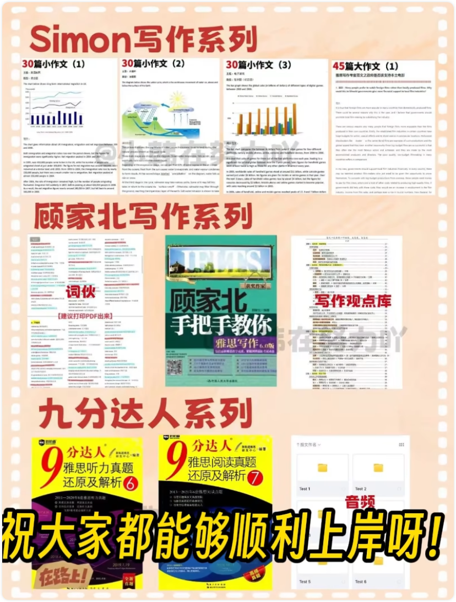
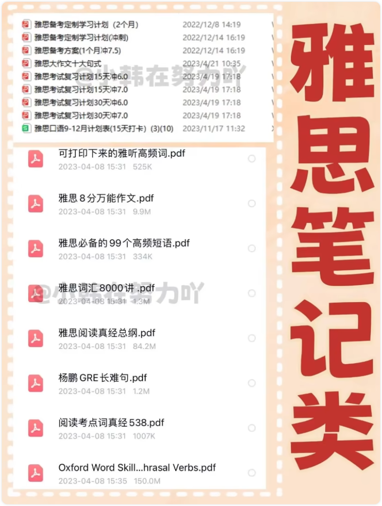

# 雅思 IELTS

> https://zh.wikipedia.org/wiki/%E9%9B%85%E6%80%9D

雅思（英语：IELTS，发音为/ˈaɪ.ɛlts/），全称为国际英语测试系统（International English Language Testing System），是著名的国际性英语标准化水平测试之一。由澳大利亚教育国际开发署（IDP)、剑桥大学考试委员会、英国文化协会共同于1989年设立，其中剑桥大学负责有关学术水平及试题内容，而IDP及英国文化协会负责于世界各地定期举办考试。考生可以选择学术类测试（A类，Academic）和培训类测试（G类，General Training）。雅思成绩被英国、爱尔兰以及澳大利亚、加拿大、新西兰、南非等英联邦成员及越来越多的美国的教育机构和各种各样的专业组织接受。成绩有效期限为两年。  -- Wikipedia

> 下面笔记来自：https://www.bilibili.com/video/BV1ce411D7Qw/?spm_id_from=333.788.recommend_more_video.-1&vd_source=e92153ec1930505e455be52646a78b7c

## 雅思教材类（这些书有甄别的下载）：

## 视频网课：

## 雅思真题类：

## 雅思笔记类：

> 可打印下来的雅听高频词.pdf
>
> 雅思 8 分万能作文.pdf
>
> 雅思必备的 99 个高频短语.pdf
>
> 雅思词汇 8000 讲.pdf
>
> 雅思阅读真经总纲.pdf
>
> 杨鹏 GRE 长难句.pdf
>
> 阅读考点词真经 538.pdf
>
> Oxford Word Skill...hrasal Verbs.pdf

